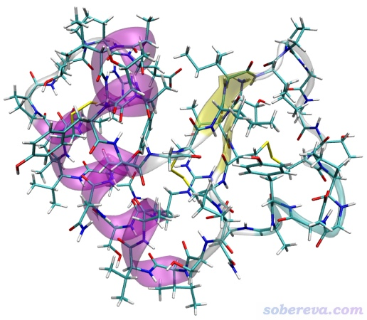
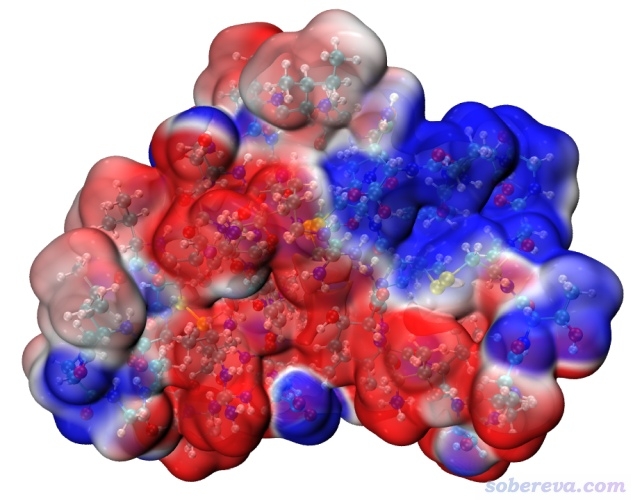
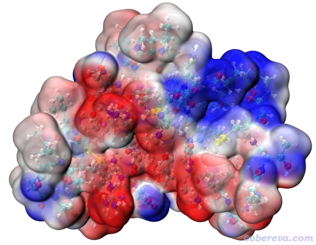
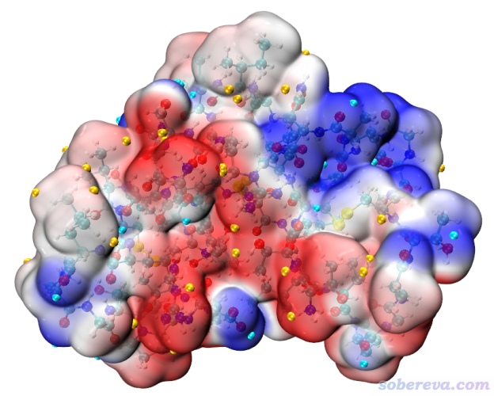

**基于原子电荷极快速绘制超大体系的分子表面静电势图**

Extremely fast plotting molecular surface electrostatic potential map of very large systems based on atomic charges

文/Sobereva@[北京科音](http://www.keinsci.com)   2022-Apr-13

## 0 前言

笔者之前写过很多和分子表面静电势分析相关的文章，汇总见<http://bbs.keinsci.com/thread-219-1-1.html>。其中，《使用Multiwfn+VMD快速地绘制静电势着色的分子范德华表面图和分子间穿透图》（<http://sobereva.com/443>）介绍的分子表面静电势图绘制方法已经广为流行。这种做法需要依赖于体系的电子波函数信息来计算电子密度和静电势。由于Multiwfn本身计算的高效率和《巨幅降低Multiwfn结合VMD绘制分子表面静电势图耗时的一个关键技巧》（<http://sobereva.com/602>）里介绍的特殊加速手段，在一般计算条件下对于好几百个原子的体系绘制表面静电势图都不难。但是，对于超大体系，诸如动辄上千原子的生物分子体系，且不说表面静电势图的绘制，就连量子化学计算得到波函数的过程都几乎算不动（除非是用比如半经验层面的GFN-xTB理论）。对这类体系的表面静电势图的绘制，一个可行的方法是通过原子坐标计算准分子（promolecular）密度来构造近似的电子密度的0.001 a.u.等值面，并将基于原子电荷计算的静电势投影上去。当然，这样的表面静电势图的质量肯定不如基于波函数计算得到的，因为准分子密度等同于各个原子孤立状态下电子密度的简单叠加，没有考虑电子转移、成键、极化等效应造成的电子密度改变，而且没有哪种原子电荷能精确重现分子表面静电势分布。不过，对于特大体系，通常对于表面静电势图的精度要求也不高，能半定量正确也就够了。本文就结合具体例子讲解怎么通过Multiwfn结合VMD程序以上述方式对特大体系超快地绘制出表面静电势图。这种做法是完全普适的，同样的做法显然也可以直接挪用到其它体系上，请读者在理解例子里每一步含义的基础上举一反三。

## 1 关于计算分子表面静电势用的原子电荷

需要注意的是，计算分子表面静电势用的原子电荷应当是能够对静电势较好重现的原子电荷，比如拟合静电势电荷（如MK、CHELPG、RESP等），用ADCH也可以。参考《原子电荷计算方法的对比》（DOI: 10.3866/PKU.WHXB2012281）文中第7节的讨论。然而，这些基于波函数信息计算的原子电荷对于巨大体系由于太昂贵而无法得到。

那么，用于绘制表面静电势图目的的原子电荷怎么来得到比较合适？这要看具体体系。对于蛋白质和核酸，在分子动力学模拟程序比如GROMACS里用pdb2gmx处理后，或在AMBER程序里用leap处理后，会自动赋予特定的分子力场定义的原子电荷，这些原子电荷对静电势的描述都不错（要不然这些力场也不可能合理地描述分子动力学模拟过程中的静电相互作用）。而对于其它杂七杂八的大型体系，诸如有机聚合物，原子电荷可以用Multiwfn计算EEM电荷，例子看手册4.7.5节，它只需要依赖几何结构，能瞬间对上千原子体系算出来所有原子的电荷，而且结合Multiwfn默认的参数得到的电荷对静电势的描述也不错，只不过此方法支持的元素种类有限，详见Multiwfn手册3.9.15节的说明。

如果你对静电势的准确度要求很宽松，那也可以用半经验（如PM6）或者GFN-xTB方法进行计算，特别是后者支持周期表绝大多数元素，对于个人电脑算个两、三千原子的单点任务无压力，可以用顺便得到的Mulliken电荷来计算静电势。但半经验和GFN-xTB方法本身对电子结构的描述就很糙，再加上Mulliken电荷对静电势重现性很一般，这么得到的表面静电势图的可靠性就不敢恭维了，但如果实际作出来的图你觉得没大问题那也可以凑合用。

## 2 例子体系

本文要对下面这个crambin蛋白质绘制分子表面静电势图。这个蛋白质是使用GROMACS在水环境中做过限制性动力学的结构，质子化态对应pH=7的状态，总共642个原子。

下面例子涉及到的所有文件（除了Multiwfn自带的）都可以在这里下载：<http://sobereva.com/attach/639/file.rar>。

读者请使用2022-Apr-12及以后更新的Multiwfn，否则文件包里没本文提到的脚本。Multiwfn可以在官网<http://sobereva.com/multiwfn>免费下载。本文用的VMD是1.9.3 32bit Windows版，可以在<http://www.ks.uiuc.edu/Research/vmd/>免费下载。对于特别大的体系，按下文步骤产生的cub文件可能非常大，如果运行作图命令后在VMD自动载入cub文件时VMD崩溃（通常由于可用内存不够所致），应尝试用64bit版VMD。本文所有操作假定在Windows下实现。

## 3 产生chg文件

chg文件是Multiwfn私有的记录原子坐标和原子电荷的文件。为了用Multiwfn+VMD绘制基于原子电荷和准分子密度的表面静电势图，应当先得到此文件。chg文件格式的定义非常简单，例如水分子，此文件内容应为：  
O 0.000000 0.000000 0.119308 0.301956  
 H 0.000000 0.758953 0.477232 0.150977  
 H 0.000000 0.758953 0.477232 0.150977  
这5列分别是元素名，X、Y、Z坐标（埃），原子电荷。chg文件怎么准备看实际情况，只要你知道原子坐标和原子电荷，很容易就能手动通过文本编辑器或者依靠Linux下的awk等命令整理成这种格式。

上面的蛋白+水共9366个原子的GROMACS做完限制性动力学后即将做正式动力学的tpr文件是本文文件包里的md.tpr，用的力场是CHARMM36。对于此例，我们要把蛋白质部分的元素、坐标、原子电荷搞成chg格式，具体做法如下：

首先运行gmx editconf -f md.tpr -o all.pdb，得到的all.pdb里最后一列是元素，原子坐标也在文件中体现了。只保留ATOMS开头的蛋白质原子对应的行而删除其它的，最后剩下642行。然后Ultraedit等文本编辑器的列模式，把每一行整理成[元素名] [X坐标] [Y坐标] [Z坐标]的形式，命名为protein.chg。

然后按照《将GROMACS的原子电荷信息读入VMD的方法》（<http://sobereva.com/365>）里的方法，从tpr文件里提取各个原子的电荷到txt文件中，再用文本编辑器的列模式把原子电荷粘贴到protein.chg的最后一列，chg文件就准备好了，在本文的文件包里已经提供了。

## 4 计算电子密度和静电势格点数据

启动Multiwfn，输入以下内容  
protein.chg  //输入实际路径  
5  //计算格点数据  
1  //准分子密度  
4  //设置格点间距  
0.3  //0.3 Bohr  
2  //导出准分子密度格点数据为当前目录下的density.cub  
0  //返回主菜单  
5  //计算格点数据  
8  //基于原子电荷算的静电势  
4  //设置格点间距  
0.3  //0.3 Bohr  
2  //导出静电势格点数据为当前目录下的nucleiesp.cub

然后把density.cub改名为density1.cub，把nucleiesp.cub改名为ESP1.cub，都挪到VMD目录下。

上面输入的格点间距越小图像越光滑，但计算和导出格点数据的耗时越高、导出的cub文件越大、载入VMD后占内存越大。由于计算准分子密度和基于原子电荷算静电势很便宜，以上计算过程在我的8核笔记本上才花了不到15秒钟！

如果嫌上述过程步骤多，可以把Multiwfn目录下的examples\drawESP\atmchg目录下的ESPiso_atmchg.bat和ESPiso_atmchg.txt拷到Multiwfn可执行文件所在目录下，把bat文件里的输入文件名和VMD目录设成实际情况，然后双击ESPiso_atmchg.bat，即可自动完成上述的操作。

## 5 在VMD里绘制分子表面静电势图

请读者务必先阅读《使用Multiwfn+VMD快速地绘制静电势着色的分子范德华表面图和分子间穿透图》（<http://sobereva.com/443>）了解怎么依靠我提供的VMD作图脚本十分便捷地在VMD里显示出静电势着色的0.001 a.u.电子密度等值面图，并恰当配置好vmd.rc文件。由于当前VMD目录下density1.cub和ESP1.cub分别对应准分子密度格点数据和原子电荷计算的静电势格点数据，启动VMD后在文本窗口里直接输入iso命令，即得到我们想要的图了，如下所示。

其中白色是静电势基本为0的区域。越红静电势越正，越蓝静电势越负。作图脚本ESPiso.vmd里默认的色彩刻度范围是-0.03 ~ 0.03 a.u.。

当前这个图几乎非红即蓝，颜色差异太大，导致难以分辨红色区域以及蓝色区域内不同位置的相对静电势大小。这主要是因为当前体系里有很多带电残基，对表面静电势贡献很大，导致它们附近的表面静电势绝对值也往往很大。为了不同区域差异能从颜色上更好地分辨，在VMD的Graphics - Representation界面里选择对应Isosurface的那项，在Trajectory标签页里的两个文本框里分别输入-0.06和0.06然后按回车。现在图像如下，可见颜色的层次更清楚了

之后，可以自己把Graphics - Colors - Color Scale界面里的色彩刻度条挪到静电势图上并标上上、下限的数值。

## 6 显示表面静电势极值点位置

在《使用Multiwfn+VMD快速地绘制静电势着色的分子范德华表面图和分子间穿透图》（<http://sobereva.com/443>）里演示过怎么把分子表面静电势极大点和极小点通过Multiwfn得到并在VMD中显示出来。对于本文的情况也可以实现。把examples\drawESP\atmchg目录下的ESPext_atmchg.bat和ESPext_atmchg.txt拷到Multiwfn可执行文件所在目录下，把这两个文件里的input.chg改成protein.chg，把.bat文件里的VMD目录改成当前实际路径。然后双击ESPext_atmchg.bat运行之，将会调用Multiwfn产生记录表面极值点信息的surfanalysis.pdb文件并自动挪到VMD目录下。注意这个脚本计算出来的极值点只包含静电势为正区域的极大点和静电势为负区域的极小点，而静电势为负的极大点和静电势为正的极小点没输出（因为本来大体系表面极值点就很多，所以意义不大的极值点就不输出了，免得太乱）。

在VMD的文本窗口里输入ext，之前窗口里显示的静电势着色的分子表面图上就出现了表面极值点了。在Graphics - Representation中的surfanalysis.pdb体系设置里，适当把VDW显示方式的Sphere Scale改大到0.2，此时看到的图如下，其中青色和黄色分别为表面静电势极小点和极大点。

可见，表面静电势极小点大多在去质子化的羧基氧附近，因为它带显著负电荷；而表面静电势极大点大多在结合质子的氨基以及羟基的氢附近，因为它们带显著正电荷。这很合乎常识，体现出当前图像的合理性。

读者之后还可以按照《使用Multiwfn+VMD快速地绘制静电势着色的分子范德华表面图和分子间穿透图》里说的方法去查询表面极值点的静电势数值并自行标注在图上。

顺带一提，ESPext_atmchg.bat脚本按照ESPext_atmchg.txt里的指令调用Multiwfn干的事情就是让Multiwfn载入protein.chg，进入定量分子表面分析功能，把定义表面的函数切换为准分子密度，把映射的函数切换为基于指定的chg文件里的原子电荷计算的静电势，然后照常做定量分子表面分析。其实读者还可以手动这么操作后，在后处理菜单做整体或片段的表面静电势分布统计之类的，参考《使用Multiwfn结合VMD分析和绘制分子表面静电势分布》（<http://sobereva.com/196>），以及获得分子表面静电势相关的各种描述符，参考《使用Multiwfn的定量分子表面分析功能预测反应位点、分析分子间相互作用》（<http://sobereva.com/159>）。

## 7 总结

本文介绍了怎么仅仅基于原子坐标和原子电荷在极短的时间内获得分子表面静电势图。虽然此做法不及基于波函数来算准确，但图像定性正确，且耗时极低。本文的做法若用于几千个原子的情况，在普通个人计算机上的耗时也就是几分钟的事。

值得一提的是，还有一种获得表面静电势的方法是基于原子电荷和半径信息基于离散格点求解Poisson-Boltzmann (PB)方程，此时可以指定蛋白内和溶剂区域的介电常数，最终求解出的静电势格点数据可以明确考虑溶剂效应。这种做法的原理比本文的方法明显更复杂，而且普适性明显不及本文的做法。本文的例子没有明确考虑溶剂效应，溶剂效应实际上已经等效地体现在了CHARMM36力场对氨基酸定义的原子电荷里（可以认为已经等效考虑了溶剂水的极化作用，也因此此力场适合模拟水中的蛋白质）。

本文的方法也完全可以用于周期性体系，做法和本文介绍的没有丝毫的不同，也是提供记录元素、坐标和原子电荷的chg文件就行了。
