**注**：对18碳环另一种重要衍生物C18-Br6的理论研究工作介绍见《不寻常的环[18]碳前驱体C18Br6的电子结构和芳香性》（<http://sobereva.com/664>）。

**深入揭示18碳环的重要衍生物C18-(CO)n的电子结构和光学特性**

Deeply revealing the electronic structure and optical properties of C18-(CO)n, an important derivative of cyclo[18]carbon

文/Sobereva@[北京科音](http://www.keinsci.com)  2022-Apr-28

## 0 前言

2019年Kaiser等人首次在凝聚相中观测到18碳环（cyclo[18]carbon）的存在后，原本只停留在理论假想的而且几何和电子结构十分特殊的碳环体系立刻得到了理论化学家们的广泛关注。笔者之前利用量子化学计算和波函数分析已发表过一系列18碳环相关的理论研究工作，文章汇总和大量相关博文见[**http://sobereva.com/carbon_ring.html**](http://sobereva.com/carbon_ring.html)，十分推荐对碳环类体系和对波函数分析感兴趣的读者阅读。近期北京科音自然科学研究中心的卢天和江苏科技大学的刘泽玉等人，又对18碳环的重要衍生物C18-(CO)2、C18-(CO)4、C18-(CO)6的成键、电子离域、芳香性、稳定性、电子光谱和非线性光学等特征进行了研究，结果已发表在Chem. Eur. J.和Phys. Chem. Chem. Phys.期刊上，欢迎读者阅读和引用：

Bonding Character, Electron Delocalization, and Aromaticity of Cyclo[18]Carbon (C18) Precursors, C18-(CO)n (n=6, 4, and 2): Focusing on the Effect of Carbonyl (-CO) Groups, *Chem. Eur. J.*, **28**, e202103815 (2022) <https://doi.org/10.1002/chem.202103815>  
可免费在此阅览：<https://chemistry-europe.onlinelibrary.wiley.com/doi/epdf/10.1002/chem.202103815>

Photophysical property and optical nonlinearity of cyclo[18]carbon (C18) precursors, C18-(CO)n (n = 2, 4, and 6)-Focusing on the effect of carbonyl (-CO) groups, *Phys. Chem. Chem. Phys.*, **24**, 7466 (2022) <https://doi.org/10.1039/d1cp05883e>

在下文中，笔者将对上面两篇论文中的主要内容和研究思想进行深入浅出的介绍，还将对研究涉及到的许多计算和分析细节、方法进行附加说明，帮助读者重复出文中的数据和图片，并从而能够将类似的研究手段运用到其它体系的研究上。下文的数据和图片都来自上面论文的正文或者补充材料。下文关于电子结构方面的讨论会涉及到18碳环的两套pi电子，即平行于碳环的in-plane pi电子和垂直于碳环的out-of-plane pi电子（以下简称为pi-in和pi-out电子），不了解的话非常建议先阅读《谈谈18碳环的几何结构和电子结构》（<http://sobereva.com/515>）和笔者之前发表的Carbon, 165, 468 (2020)中关于18碳环电子结构的讨论以了解这方面的背景知识。

## 1 C18-(CO)n是什么？

到目前为止还没有办法通过化学的手段产生出大量的18碳环。在凝聚相中观测到18碳环的Science, 365, 1299 (2019)文章中，作者是首先合成前驱体C18-(CO)6，然后通过针尖施加电压脉冲，使C18-(CO)6脱羰基成为C18-(CO)4，再变为C18-(CO)2，最后成为C18碳环。实际上，C18-(CO)6并不是这篇文章首次合成的分子，早在1991年，J. Am. Chem. Soc., 113, 495 (1991)就已经合成了C18-(CO)6，而且还通过X光衍射测定了其晶体结构，只不过这个工作受到的关注程度不高，那时的研究者们也没想到如今能靠针尖施加偏压的方式基于C18-(CO)6产生出奇特的18碳环。

相对于很难产生的18碳环，其衍生物C18-(CO)n，特别是C18-(CO)6，容易制备得多得多，因而更具有实际应用意义。而且和18碳环类似的是，C18-(CO)n也有能够在整个碳环上大范围离域的pi电子，因而它应当具备与常见有机体系明显不同的特性。而且，羰基数目如何影响体系的电子结构、光谱等特征，或者说羰基数如何调控这些特征，是很有意思的问题。因此，C18-(CO)n这种18碳环衍生物很值得进行专门的探究。此外，研究C18-(CO)n的价值也不仅在于这类物质本身，研究中得到的许多信息对于认识其它18碳环衍生物，如近期已合成出来的C18-Br6，也很有帮助。值得一提的是，其它类型18碳环衍生体系笔者之前也做过研究，见《理论设计由18碳环与锂原子构成的电场可控的光学开关》（<http://sobereva.com/630>）和《一篇文章深入揭示外电场对18碳环的超强调控作用》（<http://sobereva.com/570>）里的介绍。

## 2 C18-(CO)n的几何结构

笔者之前的一系列18碳环的研究已经证明ωB97XD泛函结合def2-TZVP基组对于优化18碳环及衍生物的几何结构是很好的选择。因此前述文章中笔者也用这个级别利用Gaussian程序优化了C18-(CO)2、C18-(CO)4、C18-(CO)6，得到的结构如下，前两者点群为C2v，C18-(CO)6为D3h。

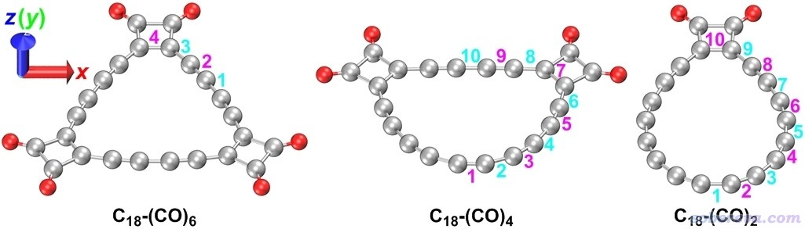

从上面的结构可见，CO是一对一对，以(CO)2形式结合在18碳环上的。不仅CO和18碳环形成C-C键，彼此间也形成C-C键。引入的每一对CO都会造成本来是圆形的18碳环局部发生显著扭曲，但体系总是保持严格的平面。

由于二阶Jahn-Teller畸变效应，18碳环具有长-短键交替而非所有键等长的结构特征。当18碳环引入CO后，碳链部分依旧保持了这种特征，这从下图C18-(CO)6里标注的键长上可以直接看出来。下图里不带括号的值是文中理论优化的几何参数，括号里的是前述的1991年JACS文章通过X光衍射测定的实验值，可见二者相符得十分理想，再次体现出ωB97XD对于优化碳环类体系衍生物的几何结构是很好的选择。

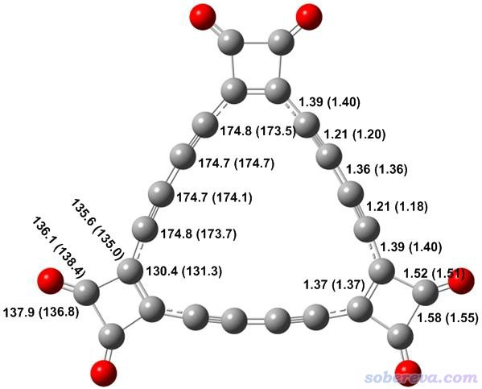

## 3 C18-(CO)n的成键特征

化学键有大量角度可以考察，Multiwfn（<http://sobereva.com/multiwfn>）提供的相关的功能极为丰富，就像大型武器库，使得用户有大量分析手段可以使用，参见《Multiwfn支持的分析化学键的方法一览》（<http://sobereva.com/471>）。其中很多方法都可以用来讨论C18-(CO)n中的成键特征。

Multiwfn程序具有非常方便的模拟扫描隧道显微镜图像的功能，详细介绍见《使用Multiwfn模拟扫描隧道显微镜(STM)图像》（<http://sobereva.com/549>）。考虑到C18-(CO)n是纯平的，很适合绘制STM，故上述Chem. Eur. J.文章里使用这个功能对三种C18-(CO)n体系都模拟了STM图，如下所示。绘制采用常高模式，对分子平面上方0.7埃的平面进行绘制，使用的-3.5 V偏压是比较常用范围。

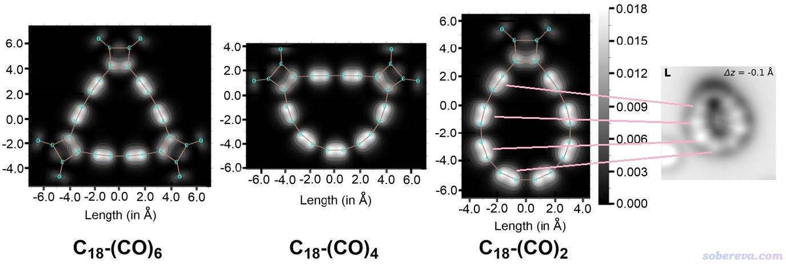

从上面的图像中可明显看出，相对于比较长的碳碳键，在较短的碳碳键上方有明显更丰富的pi电子（更准确来说是能量相对较高的占据的pi轨道在这种区域概率密度更大），由此导致隧道电流更大、相应区域在图上显得较亮。上图最右侧是Science, 365, 1299 (2019)文中通过原子力显微镜对C18-(CO)2的成像，从粉线所标示的对应关系可见，理论模拟的STM图和实验的AFM图的特征十分吻合。

在《使用Multiwfn计算Bond length/order alternation (BLA/BOA)和考察键长、键级、键角、二面角随键序号的变化》（<http://sobereva.com/501>）文章里专门介绍了怎么用Multiwfn对特定路径十分方便地计算各个键长、键级并作图。Chem. Eur. J.文中对三种C18-(CO)n都计算了所有C-C键的键级，其中C18-(CO)2的键长以及三种常见的键级如下所示，键的序号和上文第2节里标注的数字相对应。如果不了解这里涉及的Mayer键级、模糊键级和笔者提出的拉普拉斯键级的话，参看<http://sobereva.com/471>中的键级介绍部分。

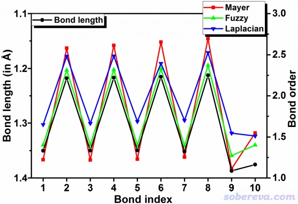

由上图可见，像是2、4、6号等较短的C-C键，三种键级都能达到2.5左右，体现出键很强。假设sigma电子贡献键级为1左右，则键级中1.5左右是来自于pi电子的作用，由于数值显著大于1，必然这种C-C键像乙炔的C-C键一样存在双重pi作用特征。上图中1、3、5等较长的C-C键的总键级不到1.5，暗示必定存在一定pi作用；但具体来说是单重pi作用，还是很弱的双重pi作用，则需要从另外角度分析考察。

在《使用IRI方法图形化考察化学体系中的化学键和弱相互作用》（<http://sobereva.com/598>）介绍的IRI方法原文里，笔者提出了IRI-π函数，这是通过实空间方式考察pi作用的重要利器，不了解的话建议先阅读一下此博文。Chem. Eur. J.文中绘制了三种C18-(CO)n的pi电子密度着色的IRI-π等值面图，以及分子平面上的填色图，分别如下图左侧和右侧所示

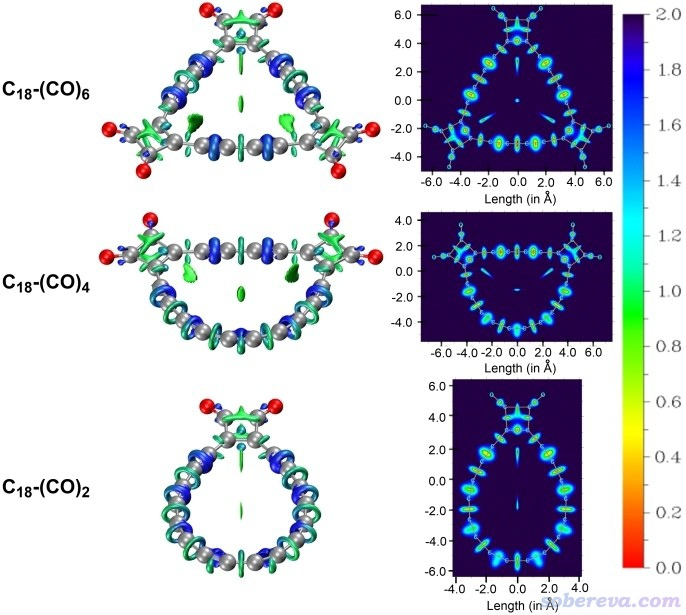

上图的IRI-π等值面上越蓝的区域pi电子密度越大，暗示pi作用越强；越绿则pi电子密度越小，暗示pi作用越弱。因此通过颜色可以明确、直观地对不同作用区域的pi作用强度进行区分。另外，在IRI原文里我曾指出，如果IRI-π等值面围绕键轴是环状，说明存在双重pi作用，如果在键上下方分别各有一块等值面，则是单重pi作用。由上图可见，碳链上的C-C键都呈现双重pi作用，而且pi作用基本上是强弱交替的。而且，最蓝的环状等值面出现在碳链近乎直线部分的较短C-C键上，体现出相对于碳环弯曲区域，碳链平直区域的C-C的pi作用整体更强。另外，上图的等值面形状还明确体现出，两个CO之间、CO与碳环之间，以及与CO相邻的碳环上的C-C键上，都只存在单重pi作用。也因此，可以判定18碳环存在的pi-in电子的离域在羰基出现的地方被截断。上面的分析是IRI-π方法的一个很好的应用范例，充分展现出IRI-π能清晰直观地揭示pi相互作用方面的重要信息，因此笔者很鼓励读者们将这种分析手段应用于更多体系的研究上。

## 4 C18与(CO)n的轨道相互作用

笔者在《使用Multiwfn做电荷分解分析(CDA)、绘制轨道相互作用图》（<http://sobereva.com/166>）中介绍了怎么用Multiwfn绘制轨道相互作用图，这种图也被Chem. Eur. J.文中用于考察C18-(CO)n中18碳环与(CO)2部分的相互作用上。

下图左边和右边分别是(CO)2部分和畸变结构下18碳环的片段分子轨道，中间是C18-(CO)n整体的分子轨道，由此图可以清楚地看出通过(CO)2的呈现平面内pi特征的轨道与18碳环的pi-in轨道的混合，构成了能表现C18与(CO)n之间sigma键作用特征的分子轨道。本身18碳环的pi-in电子可以在整个碳环上离域，然而在C18-(CO)n中这些电子不少被用于与(CO)2形成定域性很强的sigma键，无疑这会使得18碳环原本的pi-in电子的离域性极大程度地丧失。

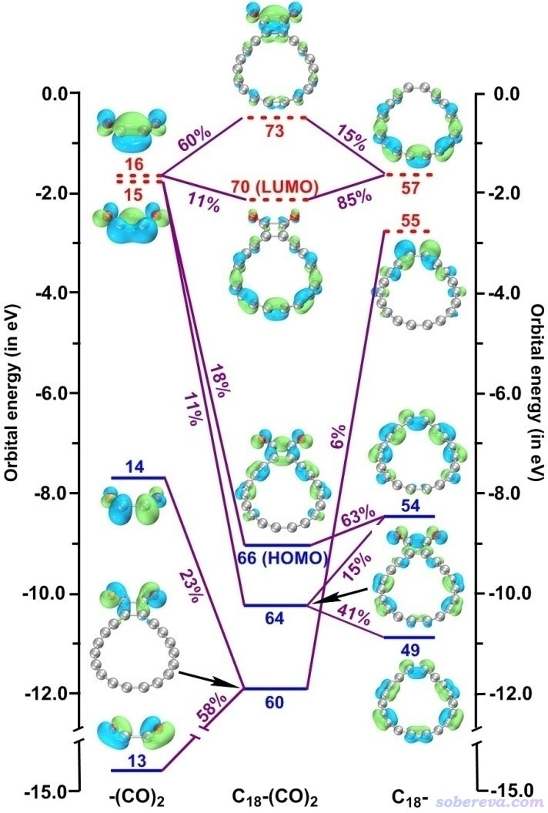

实际上，哪怕C18不和(CO)2形成sigma键，光是(CO)2与C18结合时导致C18结构的扭曲也会明显降低其pi-in电子的离域性。《在Multiwfn中单独考察pi电子结构特征》（<http://sobereva.com/432>）中专门介绍过怎么用Multiwfn单独考察pi电子特征，如果计算多中心键指数（MCI）时只考虑pi-in电子，则C18极小点结构下和扭曲的C18结构下的MCI将分别为4.8E-5和3.7E-5，这明显的差异明确体现了结构扭曲降低了pi-in电子的离域性。

值得顺带一提的是C18-(CO)n的(CO)2部分相当于变形了的OCCO分子，在Chem. Eur. J., 4, 2550 (1998)的研究中指出OCCO是个基态是单重态的会自发解离的分子。它本身不能直接存在，而通过成键作用，18碳环将之稳定住了。

## 5 电子离域性分析

Chem. Eur. J.文中专门对C18-(CO)2、C18-(CO)4、C18-(CO)6的离域性通过不同方法进行了详细的分析。在《使用Multiwfn计算AV1245指数研究大环的芳香性》（<http://sobereva.com/519>）中专门介绍了适合用于定量考察较大环状体系电子离域性的AV1245指数。在非常灵活的Multiwfn中，如果计算前先利用主功能6的子功能26里将pi-in轨道以外轨道的占据数清零，则计算出的就是pi-in电子的AV1245（AV1245-pi_in）。类似地可以计算描述pi-out电子离域性的AV1245-pi_out。这篇Chem. Eur. J.相当于AV1245-pi_in和AV1245-pi_out指数的原文，读者使用Multiwfn对其它体系计算它们时建议引用。AV1245-pi_in和AV1245-pi_out，以及考虑所有电子的AV1245，都列于下表了。计算时是对18个碳构成的碳环来计算的，数值越大，体现电子越容易沿着整个碳环离域。

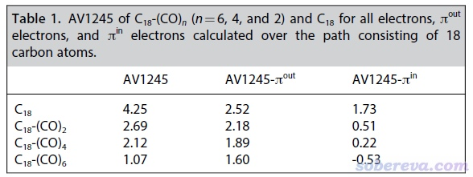

从上面的表格中可见，C18哪怕带上一个(CO)2都会使其整体电子离域性大幅下降，而且带的(CO)2单元越多电子离域程度降低得越多。将pi-in和pi-out电子区分分析有助于抓住电子离域降低的主要本质。上表中的AV1245-pi_in数值具体地体现出C18结合哪怕一个(CO)2后pi-in电子的离域性都会巨幅降低，这也印证了前面根据轨道相互作用所做出的引入(CO)2会显著阻断C18的pi-in电子离域的推断。而随着结合(CO)2单元数目的增加，pi-out电子的离域性虽然也会不断降低，但远没有pi-in电子降低得那么夸张，而且哪怕是结合三个(CO)2的C18-(CO)6还是具有明显的pi-out电子的离域特征。

LOL-pi可以非常直观地将pi电子离域路径和离域程度展现出来，绘制方法参考《在Multiwfn中单独考察pi电子结构特征》（<http://sobereva.com/432>）和《谈谈18碳环的几何结构和电子结构》（<http://sobereva.com/515>）。考虑到LOL-pi的重要价值，除了定量考察电子离域程度外，Chem. Eur. J.文中还对pi-in和pi-out电子绘制了LOL-pi的等值面图和平面图，如下所示。pi-in的填色图绘制的是分子平面，pi-out的填色图绘制的是分子平面上方0.5埃位置。

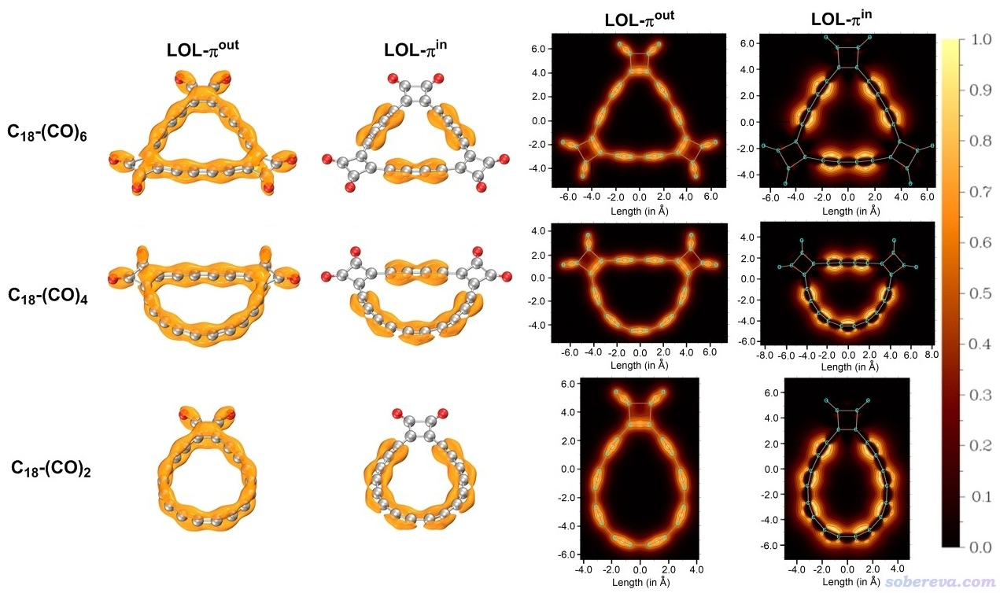

从上图可以看出即便引入了(CO)2，pi-out电子在碳环上的离域性依然维持着，而pi-in的离域则在(CO)2处明显被截断，这和AV1245-pi_in数值所体现的信息完全一致。

还应当注意的是，pi-out电子虽然在碳环上整体离域，但离域的程度远不像诸如苯环那样的理想芳香性体系那么强。从pi-out电子的LOL-pi图上可看到颜色顺着碳环有明显的深浅交替变化，这体现出电子离域的不均衡性，或者说在较短的C-C键上具有一定程度的定域性，这是由于当前体系长-短键交替特征所导致的。在这一点上，C18-(CO)n体系和C18是具有共性的。

文中还使用了一种名为EDDB的方法考察了C18、C18-(CO)n以及C18处于所有键长相等的过渡态结构下的离域性，具体细节请读者阅读Chem. Eur. J.原文。EDDB的分析结论和上面通过AV1245和LOL-pi图所展现的完全一致。

## 6 C18-(CO)n对外磁场的响应

由于C18-(CO)n中的pi-out电子具有在C18环上全局离域的能力，而且这个环具有18个pi-out电子，满足休克尔芳香性判断规则，因此可以预期此体系具有一定芳香性。体系对外磁场的响应和体系的芳香性有密切关联，详见《衡量芳香性的方法以及在Multiwfn中的计算》（<http://sobereva.com/176>）里的介绍。其中ACID、GIMIC以及ICSS方法都被Chem. Eur. J.文中用于直观地考察C18-(CO)n的芳香性。这些方法的介绍见《使用AICD 2.0绘制磁感应电流图》（<http://sobereva.com/294>）、《考察分子磁感生电流的程序GIMIC 2.0的使用》（<http://sobereva.com/491>）和《通过Multiwfn绘制等化学屏蔽表面(ICSS)研究芳香性》（<http://sobereva.com/216>）。

ACID图可以体现外加磁场时感生电流出现的主要区域和方向。各个体系的AICD图如下所示，外磁场由下垂直于体系平面朝上施加。为了看得比较清楚，文中根据AICD程序绘制出的描述电流方向的小箭头，把电流主要形成的路径和方向用粉色更明确地标注了。

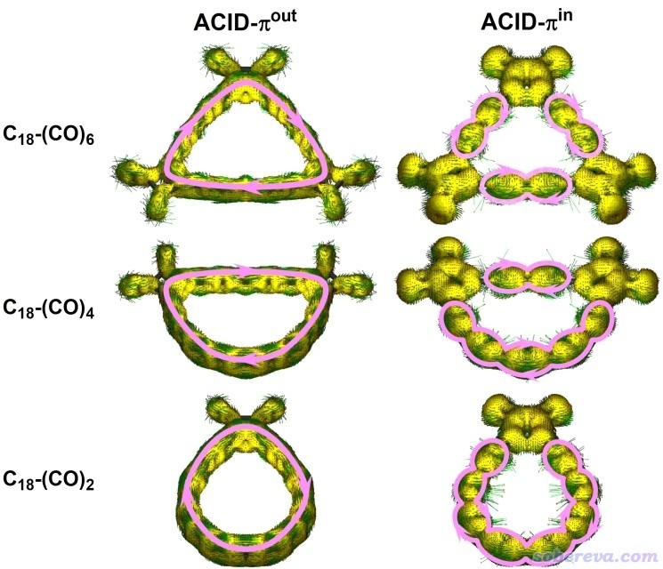

由ACID-pi_out图可清楚地看出在C18部分由于有可以离域的pi-out电子，在相应区域形成了鲜明的顺时针的磁感生电流，充分体现了C18-(CO)n系列体系具有pi-out芳香性。而从ACID-pi_in图则可以看出pi-in电子在每一对(CO)2之间的碳链上可以发生离域并绕着这部分形成的环电流，但无法产生跨越(CO)2形成整体的环电流，这进一步体现引入(CO)2对pi-in电子整体离域的破坏。

ICSS_ZZ图体现的是体系对三维空间各个位置在Z方向（垂直于环方向）打来的外磁场的屏蔽情况。在某处外磁场如果被屏蔽（削弱），则此处ICSS_ZZ为正，如果被去屏蔽（加强），则ICSS_ZZ为负。具有芳香性的环的共性是在环内ICSS_ZZ为正而在环外为负，这也是磁感生环电流的方向所导致的必然现象。Chem. Eur. J.文中对C18-(CO)n绘制了ICSS_ZZ图，如下所示，红色和蓝色分别对应屏蔽和去屏蔽区域。等值面图是用Multiwfn产生的ICSS_ZZ格点数据在VMD程序中绘制的，平面图是Multiwfn直接画出来的，具体操作参考前面提到的我写的ICSS介绍博文。

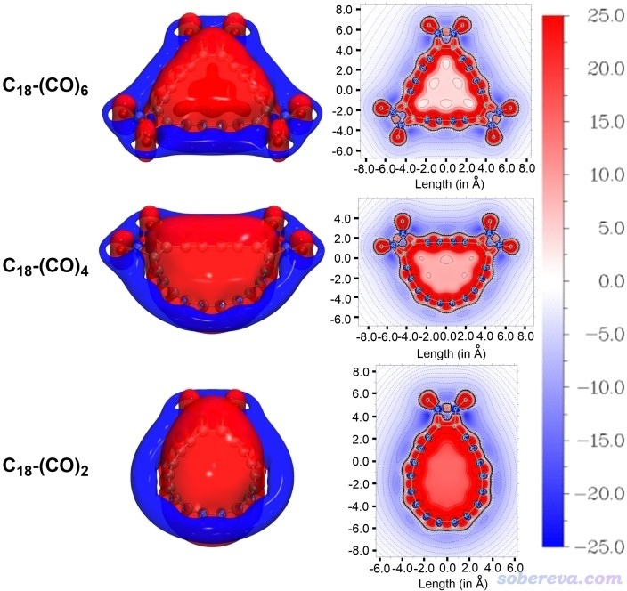

从上图所展示的环内屏蔽而环外去屏蔽的特征可以很直观地看出C18-(CO)2、C18-(CO)4、C18-(CO)6都是芳香性的，这点和单独的18碳环是一致的。从平面图中央区域的颜色上可以明显看出，随着(CO)2引入得逐步增多，环内对Z方向磁场的屏蔽越来越弱，充分体现了芳香性的逐步降低。

NICS_ZZ(1)是非常常用的考察芳香性的定量指标，它是环中心上方1埃处磁屏蔽张量在垂直于环方向的分量的负值，数值越负说明芳香性越强。在环中心上方1埃处的ICSS_ZZ正等价于NICS_ZZ(1)的负值。ICSS_ZZ图便于定性、全面、直观考察芳香性，而NICS_ZZ(1)则更适合定量对比芳香性。计算发现C18-(CO)2、C18-(CO)4、C18-(CO)6的NICS_ZZ(1)分别为-14.7、-8.8、-5.4 ppm，而18碳环则为-23.7 ppm，最典型的芳香性分子苯为-29.9 ppm。相比之下，C18-(CO)n的芳香性虽然明显但从绝对程度上算不上很强，远弱于苯。而且，C18-(CO)n相对于18碳环的芳香性也弱得多，这主要是由于18碳环的pi-in和pi-out电子的全局离域使之具有双芳香性（虽然每一套pi电子对芳香性的贡献算不上多大），而C18-(CO)n的pi-in电子对芳香性的贡献由于(CO)2的引入而基本失去了。

## 7 C18-(CO)n的羰基消除的热力学和动力学

2019年Science的文章的实验中是通过施加偏压以针尖诱导方式令C18-(CO)n强行脱羰基最终形成18碳环，这个体系中羰基本身结合的强度如何？不靠外界作用直接脱羰基的难易程度如何？为了探究这个问题，从而更全面地认识C18-(CO)n的特性，在Chem. Eur. J.文中还考察了C18-(CO)n逐步脱羰基的过程。先用Gaussian在ωB97XD/def2-TZVP下优化了过渡态并作了振动分析，然后用ORCA在高精度的DLPNO-CCSD(T)/cc-pVQZ级别下计算了电子能量，最后通过《使用Shermo结合量子化学程序方便地计算分子的各种热力学数据》（<http://sobereva.com/552>）介绍的笔者开发的Shermo程序计算了常温下的自由能垒和反应自由能，如下所示

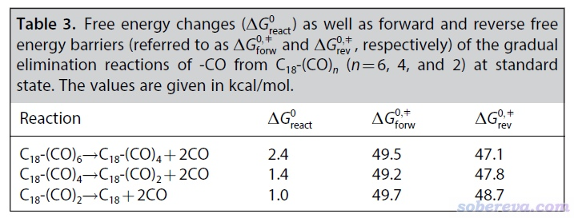

上面三个反应对应的过渡态的虚频和相应的振动模式如下所示

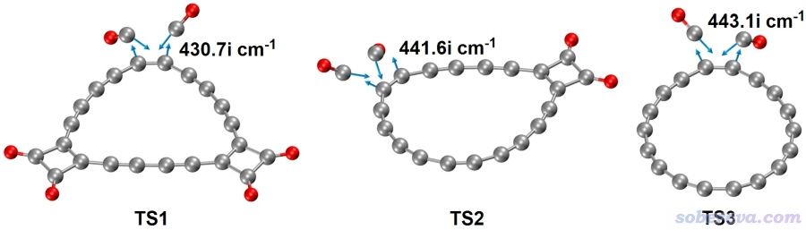

由上可见，C18-(CO)n脱羰基一次脱两个，是协同过程。每脱一对CO所需要跨越的自由能垒，以及反应的虚频，基本不受当前所带(CO)2单元数目的影响。从反应自由能可见自发脱羰基在常温下从热力学上是不利的，而且自由能垒将近50 kcal/mol，因此(CO)2在碳环上结合得相当稳定。与此同时，逆反应的势垒同样很高，体现出两个CO同时向18碳环的加成也显著不可能在常温下自发出现，哪怕CO的浓度很高。如果你不了解怎么通过自由能垒判断反应发生难易，看《谈谈如何通过势垒判断反应是否容易发生》（<http://sobereva.com/506>）。

下面的内容将简要介绍前述的Phys. Chem. Chem. Phys., 24, 7466 (2022)中关于C18-(CO)n的电子激发、电子光谱、非线性光学方面的研究。

## 8 C18-(CO)n的电子激发和光谱特征

在《使用Multiwfn绘制电荷转移光谱(CTS)直观分析电子光谱内在特征》（<http://sobereva.com/628>）介绍过笔者提出并在Multiwfn中独家实现的电荷转移光谱（CTS）分析方法，可以将总的电子吸收光谱分解为电子激发时各个自定义片段内电子重排的贡献以及不同片段间电子转移的贡献。PCCP文中将这种方法应用到了C18-(CO)n体系上以深入认识其电子光谱的内在本质。C18-(CO)2、C18-(CO)4、C18-(CO)6的总吸收光谱，以及通过CTS方法将它分解出的各种成份如下所示，CTS光谱数据在计算时将C18和(CO)n定义成了两个片段。电子激发是在ωB97XD/def2-TZVP级别下用Gaussian通过TDDFT方法计算的。

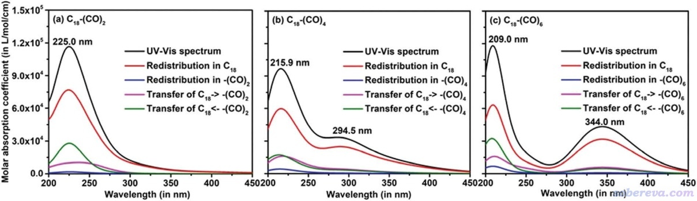

上图中四条彩色的CTS曲线加和等于总光谱曲线（黑线），总光谱曲线中的最大吸收峰位置也标注在了图上，其精确数值可以在Multiwfn绘制光谱时直接从屏幕上读取，见《使用Multiwfn绘制红外、拉曼、UV-Vis、ECD、VCD和ROA光谱图》（<http://sobereva.com/224>）。由于C18片段内电子重排曲线（红线）和黑色曲线接近，可知C18-(CO)n的吸收光谱主要来自于C18片段内的局域激发特征，而(CO)n片段内的局域激发特征对吸收光谱的贡献微乎其微。而从上图的紫色和绿色曲线来看，C18-(CO)n的吸收光谱在一定程度上也来自于C18与(CO)n间的电荷转移激发。

空穴-电子分析在《使用Multiwfn做空穴-电子分析全面考察电子激发特征》（<http://sobereva.com/434>）里详细介绍过，这是已经很流行的而且十分重要的考察电子激发特征的方法。对于上图里C18-(CO)2、C18-(CO)4、C18-(CO)6各自激发能最低的吸收峰（225.0, 294.5, 344.0 nm）主要对应的电子激发，PCCP文中对它们都绘制了空穴和电子的等值面叠加图，如下所示。空穴和电子分布区域分别用蓝色和绿色表示。

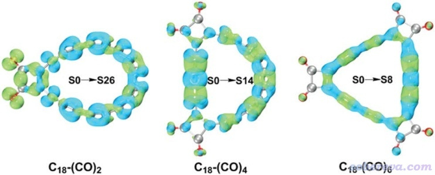

根据空穴-电子分析理论，电子激发时，电子是从“空穴”分布区域转移到“电子”分布区域的。由上图可见，C18-(CO)2的225.0 nm吸收峰主要体现18碳环片段内激发，但同时也伴随着18碳环向(CO)2的电荷转移激发。而上图中C18-(CO)4和C18-(CO)6的激发则基本只涉及到C18部分。

## 9 C18-(CO)n的非线性光学特征

PCCP文中在ωB97XD/aug-cc-pVTZ(-f,-d)级别下通过Gaussian用CPKS方法计算了不同C18-(CO)n的各向同性极化率（σiso）、第一超极化率在偶极矩方向的投影（βvec）以及平均第二超极化率（λ||）在静态和动态外场下的值。静态外场情况的结果如下所示。这些量都可以按照《使用Multiwfn分析Gaussian的极化率、超极化率的输出》（<http://sobereva.com/231>）的方法用Multiwfn直接基于Gaussian的polar任务的输出文件计算得到。

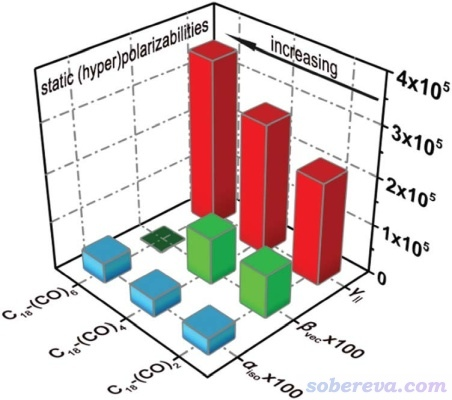

从上图可见，极化率受C18-(CO)n带的羰基数影响不很大，而高阶响应属性λ||则随着CO的增加而非常显著增加。即便是C18-(CO)2，其λ||也比18碳环自身大50%，体现出C18-(CO)n系列物质作为非线性光学材料的潜质，并且通过改变引入的羰基的数目可以对非线性光学特性进行调控。上图中C18-(CO)6的βvec精确为0，是由于体系结构特征所致。

我之前在《电子空间范围<r^2>和电子径向分布函数的含义以及在Multiwfn中的计算》（<http://sobereva.com/616>）专门介绍过<r^2>这个等效衡量电子空间延展范围的参数与极化率之间的关系，对同类体系二者之间往往有近似线性的正相关性。在PCCP这篇文章中也给出了C18-(CO)n的<r^2>和实际计算出的极化率之间的关系，如下所示。由图可见，随着羰基数的增加，电子整体空间分布范围变得更大，体现在<r^2>越大上，也相应地对应极化率的增加。这充分展现了电子空间分布广度与体系电荷的可极化特征的内在密切关联性。

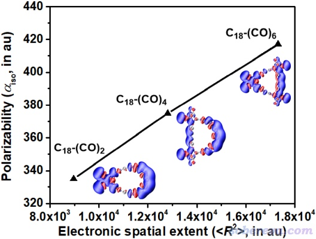

我在《使用Multiwfn通过单位球面表示法图形化考察（超）极化率张量》（<http://sobereva.com/547>）中介绍的Multiwfn可以实现的单位球面表示法是直观展现分子极化率和各阶超极化率的各向异性特征非常有用的方法，不了解的话建议先阅读此文。在PCCP这篇文章里对三种C18-(CO)n的静态（超）极化率绘制了这种图，视角垂直于分子平面，如下所示，具体讨论请见PCCP原文相应部分。简单来说，（超）极化率的各向异性体现在图中箭头长度和方向不以体系中心为球对称分布，由图可见除了C18-(CO)6的极化率和第二超极化率外，在分子平面上（超）极化率的各向异性都是很明显的。下图为了清楚起见，还在第一超极化率的图上手动根据球面上的小箭头标注了粉色和蓝色的大箭头。当两个电场同时顺着蓝色和粉色箭头方向施加时，会导致分别在相反和相同方向出现诱导偶极矩，这更是体现了C18-(CO)n体系尤为鲜明的非线性光学各向异性特征。

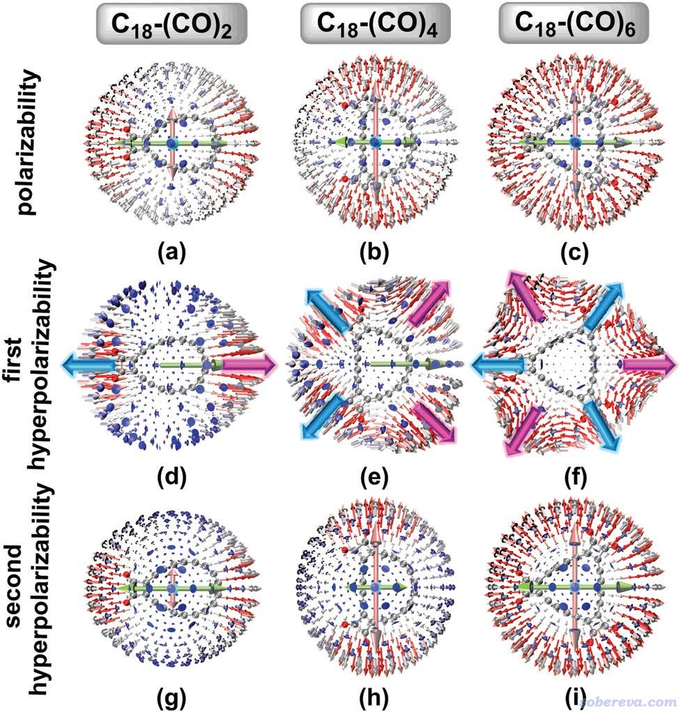

除以上内容外，PCCP文中还通过《使用Multiwfn计算（超）极化率密度》（<http://sobereva.com/305>）所介绍的方法直观展现了三维空间中不同位置以及C18和(CO)n片段对（超）极化率的贡献。文中还考察了实验常用的外场频率1907, 1460, 1340, 1180, 1064 nm下的动态（超）极化率，并发现随着外场频率的增加，C18-(CO)n体系的超极化率会有很显著的增加。

Donor-pi-acceptor（D-pi-A）类型的分子的晶体常被作为有机非线性光学材料。作为对比目的，PCCP文中最后还将C18-(CO)n的非线性光学特征与与它非氢原子数相仿佛的一个典型的D-pi-A分子trans-4-nitro-4'-aminostilbene (C14H12N2O2)的情况进行了对比讨论。虽然发现C18-(CO)n的极化率和第二超极化率的总大小与这个D-pi-A分子相仿佛，但D-pi-A分子的各向异性远比C18-(CO)n显著得多，即在顺着分子轴方向的极化率和第二超极化率分量远大于垂直于分子轴的方向。在第一超极化率方面，C18-(CO)n中数值最大的C18-(CO)2也小于此D-pi-A分子一个数量级。可见，C18-(CO)n的非线性光学特征与常见的D-pi-A型共轭分子截然不同，这也体现出18碳环衍生物类型的分子晶体在非线性光学方面的应用可能会对传统有机非线性光学材料起到明显的补充作用。

## 10 总结

本文介绍的Chem. Eur. J., 28, e202103815 (2022)和Phys. Chem. Chem. Phys., 24, 7466 (2022)两篇文章对重要的18碳环衍生物C18-(CO)n做了全面的研究，包括几何结构、成键特征、电子离域性、芳香性、电子吸收光谱、电子激发本质、非线性光学特性等。这些研究的意义不仅限于C18-(CO)n这类物质本身，对于认识其它碳单环化合物的特征也有启发性，很多结论也可以推广到其它基团与碳环形成sigma键的体系上。例如在J. Am. Chem. Soc., 142, 12921 (2020)中合成了另一种18碳环的前驱体C18-Br6，其几何和电子结构就与上文研究的C18-(CO)6有高度的相似性。

碳单环体系本身极难产生并稳定化，而很多碳环的衍生物则容易合成且稳定，上文的研究已经体现了C18-(CO)n在非线性光学方面有独特的应用潜力，算是给碳环衍生物性质的探索开了个头，预计在未来更多形式的碳环衍生物在各种方面的应用将会被很多研究者们探究。

上面介绍的两篇文章充分利用了Multiwfn（<http://sobereva.com/multiwfn>）程序提供的非常强大、丰富的分析功能，是波函数分析以及Multiwfn程序的典型应用范例。如Chem. Eur. J.文中所展示的，Multiwfn计算的各种键级、IRI-π、LOL-π、MCI-π、AV1245-π、ICSS_ZZ、轨道相互作用图等，对于深入探究含有pi大共轭特征体系的电子结构极有帮助，能得到全面且深入的视角。而在光学性质相关方面，如PCCP文中所展示的，可以利用电荷转移光谱、空穴-电子分析、单位球面表示法、（超）极化率密度等方法进行探究。上文里对研究中涉及的这些分析手段都给了笔者之前撰写过的很详细的原理介绍+操作实例的博文，很鼓励读者们仔细阅读并在研究中广泛应用，也推荐将上述的Chem. Eur. J.和PCCP文章作为这些方法的应用范例在论文中引用。
