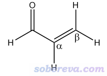
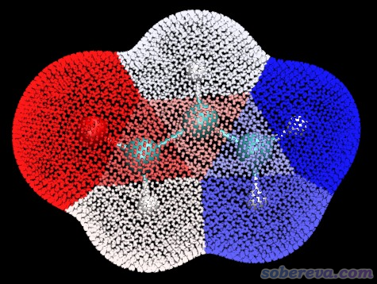
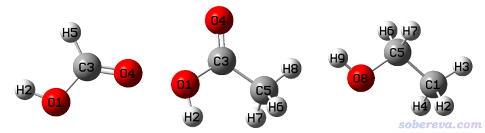

**谈谈怎么计算化学体系中“原子的静电势”**

On the calculation of "electrostatic potential of atoms" in chemical systems

文/Sobereva@[北京科音](http://www.keinsci.com)   2022-May-29

## 0 前言

在网上经常有人问我怎么计算原子的静电势。“原子的静电势”是一个非常含糊不明的词。静电势是一个三维函数，空间中不同的点有不同的数值，显然静电势不是对原子来说的，而是对具体坐标来说的。但有人就是想计算something like“原子的静电势”的量，那怎么算？本文我介绍三种比较有实际意义的基于静电势计算的对原子而言的值，读者可以看看哪种是自己真正想要算的，根据实际情况决定算哪种。本文会举一些计算例子，用到的Multiwfn可以在主页<http://sobereva.com/multiwfn>免费下载，不了解相关常识者建议看《Multiwfn FAQ》（<http://sobereva.com/452>）和《Multiwfn入门tips》（<http://sobereva.com/167>）。

如果你对静电势都完全不了解，切勿稀里糊涂急于计算，至少要知道静电势的定义和基本相关常识，否则都不知道自己到底想得到什么，对算出来数据也都是瞎讨论。静电势基本相关知识看《静电势与平均局部离子化能相关资料合集》（<http://bbs.keinsci.com/thread-219-1-1.html>）。

## 1 原子的拟合静电势电荷

关于拟合静电势电荷，我在《RESP拟合静电势电荷的原理以及在Multiwfn中的计算》（<http://sobereva.com/441>）中已经做了大量介绍，并且提供了许多相关资料和诸多计算实例，读者仔细一看就能充分了解了。简单来说，原子电荷是位于原子核位置的点电荷，是一种简单描述化学体系中电荷分布的方式。拟合静电势是一种计算原子电荷的思想，使得基于原子电荷粗略计算出的分子范德华表面附近区域（通过一批拟合点来表示）的静电势和基于电子密度以更严格的方式算的这些区域的静电势尽可能一致。拟合静电势电荷有不同的具体实现，比如Merz-Kollman、CHELPG、RESP等，都可以用Multiwfn基于量子化学程序计算产生的波函数文件计算，具体做法看<http://sobereva.com/441>，本文就不再举例了。从计算思想可知，某原子的拟合静电势电荷的数值直接取决于这原子周围范德华表面附近的拟合点。在这些点上静电势整体越正，这个原子的拟合静电势电荷通常就越正，反之就越负。

## 2 原子局部范德华表面的静电势平均值

分子的范德华表面上的静电势经常通过作图来直观考察，例如《使用Multiwfn+VMD快速地绘制静电势着色的分子范德华表面图和分子间穿透图》（<http://sobereva.com/443>）。在这个表面上基于静电势算的统计量，比如平均值、方差、最大/最小值等，也有很多实际用处，见比如《使用Multiwfn预测晶体密度、蒸发焓、沸点、溶解自由能等性质》（<http://sobereva.com/337>）里用到的量和《谈谈如何衡量分子的极性》（<http://sobereva.com/518>）中的MPI指数，这些量的具体定义看Multiwfn手册3.15.1节。分子空间可以划分成一个个原子空间来研究分子中原子的特征，类似地，笔者曾提出“局部分子表面分析”的思想，把分子范德华表面划分成一个个原子（或一批原子构成的片段）所属的区域。通过计算这种“原子局部范德华表面”上静电势相关的统计量，就可以了解许多跟原子有关的信息。这种分析方法在Multiwfn程序中可以实现，下面就用给个具体例子。

此例是丙烯醛，结构如下。如图所示，此体系碳原子有三个，羰基碳、alpha碳、beta碳原子，已知羰基碳最容易受到硬亲核试剂进攻而发生反应。此例我们着重看看能否通过这些原子的局部范德华表面上静电势平均值的差异来说明这一点。

用Multiwfn做局部分子表面分析需要先得到波函数文件，做法见《详谈Multiwfn支持的输入文件类型、产生方法以及相互转换》（<http://sobereva.com/379>）。在B3LYP/6-31G**级别下通过Gaussian程序产生的此体系的波函数文件已经在Multiwfn文件包里提供了，是examples目录下的acrolein.wfn。

启动Multiwfn，然后输入  
examples\acrolein.wfn  
12  //定量分子表面分析  
0   //开始分析  
瞬间就分析完了。默认是以电子密度=0.001 a.u.的等值面定义分子表面（对应于Bader对范德华表面的定义），默认分析的是分子表面上的静电势。此功能的相关知识看《使用Multiwfn的定量分子表面分析功能预测反应位点、分析分子间相互作用》（<http://sobereva.com/159>）。

当前看到一个后处理菜单，选择选项11 Output surface properties of each atom，然后瞬间就看到了下面这些信息

Note: Minimal and maximal value below are in kcal/mol  
  Atom#    All/Positive/Negative area (Ang^2)  Minimal value   Maximal value  
      1     23.00966     0.00000    23.00966    -35.19343001     -0.36509775  
      2      4.33009     3.67503     0.65506     -5.46462950     11.48235449  
      3      4.54073     3.06665     1.47409     -1.73335086      7.66399279  
      4     15.69303    13.78753     1.90549    -17.69011113     19.13728594  
      5     16.53855    14.76842     1.77013    -20.37979596     16.57402636  
      6      3.74578     2.94182     0.80396     -1.67072249     10.11939827  
      7     15.01908    15.01908     0.00000      2.90973611     22.71210240  
      8     16.73671    16.73671     0.00000      1.14063472     22.64517642

Note: Average and variance below are in kcal/mol and (kcal/mol)^2 respectively  
  Atom#    All/Positive/Negative average       All/Positive/Negative variance  
      1   -24.35460        NaN  -24.35460           NaN        NaN   72.73909  
      2     4.65693    5.74623   -1.45429       9.79732    9.01640    0.78092  
      3     1.30960    2.36409   -0.88412       2.70939    2.46010    0.24929  
      4     8.37226   10.35882   -6.00183      36.74779   17.22575   19.52204  
      5     7.07178    8.68115   -6.35535      50.00159   25.34554   24.65605  
      6     2.21582    3.02333   -0.73900       5.15677    4.95386    0.20291  
      7    15.34361   15.34361        NaN           NaN   22.85750        NaN  
      8    14.68585   14.68585        NaN           NaN   25.92939        NaN

Note: Internal charge separation (Pi) is in kcal/mol, nu = Balance of charges  
  Atom#           Pi              nu         nu*sigma^2  
      1         7.134251             NaN             NaN  
      2         3.227929        0.073354        0.718674  
      3         1.715103        0.083543        0.226349  
      4         5.171843        0.249024        9.151075  
      5         5.533206        0.249952       12.498021  
      6         2.049430        0.037801        0.194929  
      7         3.976506             NaN             NaN  
      8         4.188833             NaN             NaN

以上信息告诉你分子范德华表面上对应各个原子的局部区域中各种基于静电势计算的统计值。例如如上All/Positive/Negative area (Ang^2)下面的内容可见，2号原子的局部范德华表面总面积为4.33 Å^2，其中静电势为正和为负的面积分别为3.67和0.65 Å^2。再比如，从如上Minimal value   Maximal value下面的值可见在2号原子的局部范德华表面中，静电势最小和最大值分别为-5.46和11.48 kcal/mol。All/Positive/Negative average下面的值分别是各个原子局部范德华表面上静电势平均值、其中静电势为正区域的静电势平均值、其中静电势为负区域的静电势平均值。此外还有variance（静电势的方差）、Pi指数、nu指数、nu*sigma^2指数，也都是对各个原子局部范德华表面进行的计算，这些指数在Multiwfn手册3.15.1节都有说明。

当前体系羰基碳、alpha碳、beta碳分别是2、3、6号原子（在Multiwfn载入波函数文件后，进主功能0就可以看到原子序号），由以上信息可见它们局部范德华表面上静电势平均值分别为4.656、1.309、2.215 kcal/mol，明显羰基碳最容易吸引硬碱分子亲核进攻它而发生反应。

以上信息中有些量是NaN，代表Not a number，是因为无法计算所致。比如7号H原子局部范德华表面中静电势为负区域的静电势平均值就是NaN，这是因为它的局部范德华表面上静电势全为正，根本不存在静电势为负的区域（也体现在了它的静电势为负的区域面积为0上）。

还值得一提的是，那些被严重包埋的原子是没有对应的局部范德华表面的。比如C60富勒烯里包夹一个小分子，此时范德华表面完全在C60的外表面上，被包夹的小分子的原子对范德华表面没有任何贡献，也因此不可能对这些原子计算局部范德华表面上的信息。对这些原子，Multiwfn在输出以上信息时是直接略过的。

Multiwfn具体是如何判断范德华表面各个区域属于哪个原子的，在Multiwfn手册3.15.2.2节有说明。如果你想图形化观看一下，以人为检验范德华表面划分得是否合理，在选择完上述的11 Output surface properties of each atom选项后，输入y，然后Multiwfn就会在当前目录下输出locsurf.pdb文件。范德华表面上的各个顶点在此文件里作为碳原子记录，倒数第二列记录的B因子信息的数值是相应顶点对应的原子序号。因此，把locsurf.pdb载入VMD程序，根据B因子数值进行着色，就可以通过颜色区分各个原子所属的局部范德华表面区域了，具体做法看Multiwfn手册4.12.3节。此例绘制的结果如下。可见此图淡红色、肉色和亮紫色小圆点分别是羰基碳、alpha碳和beta碳的局部范德华表面上的顶点，它们的分布很合理，确实能很好地对应相应原子，也因此前面给出的这三个碳的局部范德华表面的静电势平均值能合理反映出它们的特征。

## 3 原子核位置的静电势

对三维空间中各个点都可以计算静电势，显然在原子核位置也可以算，但这样的位置静电势是无穷大的，这从静电势计算公式的原子核电荷贡献部分的数学形式便知。但计算某原子核处静电势时把这个原子核对静电势的贡献忽略掉，静电势就不是无穷大，而且是有实际意义的。下面说的“原子核处的静电势”指的都是这种定义。如果你看到的文献里讨论了原子核处的静电势，一般也都是这种定义。

这里着重说一下氢原子的原子核处的静电势，实际意义相对较明显。对于氢来说，原子核处的静电势和它作为质子解离的难易程度有密切关系，也即可以用它来对类似物质估计pKa的相对大小。这是因为氢原子核处的静电势等同于它的原子核（即一个质子）与体系其它部分的静电作用能，显然数值越负，静电势吸引作用越强，质子就越不容易解离，pKa就可能越大。需要注意的是，这和这个体系的真空中的质子解离能的负值并不等价，因为实际中质子解离后，阴离子部分的电子结构和几何结构会发生弛豫，这部分能量变化也会体现在质子解离能里。此外，溶剂效应对不同体系间的pKa的相对大小也有明显影响。因此，氢核处的静电势和相应位点的pKa只有较松散的相关性，只能反映影响pKa因素中的一部分。

作为例子，下面对甲酸、乙酸、乙醇体系的几个氢来计算原子核处的静电势，结构如下

这几个体系的波函数文件可以在<http://sobereva.com/attach/641/file.rar>里得到，都是在B3LYP/6-311G**级别下用Gaussian做优化任务时产生的。

先计算甲酸。启动Multiwfn，输入  
formic_acid.fch  
1  //计算一个点的属性  
a2  //计算2号原子的原子核位置的属性，这个原子是甲酸羧基上的氢  
从屏幕上输出的信息中可找到下面的内容：

Total ESP without contribution from nuclear charge of atom     2:  
 -0.9477863132E+00 a.u. ( -0.2579058E+02 eV, -0.5947454E+03 kcal/mol)

即曰，这个氢原子核位置的静电势（扣除其自身原子核电荷的贡献）为-0.9478 a.u.，也即在当前几何和电子结构下，这个氢原子核与体系其它部分的静电作用能为-0.9478 a.u.。

之后再输入a5，就得到了甲酸的与碳相连的H5的原子核位置的静电势，结果为-1.0628 a.u.。相对于羧基上的H2，显然这个数值明显更负，体现出H5原子核被体系束缚得明显更牢，故更不容易解离掉，这和化学常识一致。

类似地，基于前述文件包里的acetic_acid.fch计算乙酸羧基氢上的原子核处的静电势，结果为-0.9589 a.u.。其数值比甲酸的羧基氢的更负，说明这个质子更不容易脱离。这也和水中的pKa的关系一致，乙酸的pKa是4.756，明显比甲酸的3.745更大。

再用文件包里的ethanol.fch计算乙醇羟基氢的原子核处的静电势，结果为-1.0153 a.u.，可见比乙酸的羧基氢负得多得多，这也对应了羟基氢远没有羧基氢易于作为质子解离的事实。乙醇在水中的pKa是15.9。

最后，值得一提的是拟合静电势电荷和原子局部范德华表面的静电势平均值在原理上存在一定正相关性，而原子核处的静电势和它们没密切联系，除非是原子所处的化学环境类似。
