**使用concvar程序求解复杂化学反应中物质的浓度随时间的变化**

Using concvar program to solve the change of concentration of substances with time in complex chemical reactions

文/Sobereva@[北京科音](http://www.keinsci.com)  （非正式版）

## 1 前言

最近有人在计算化学公社论坛问“请问常温下像是如下述两条路径的反应，哪个更优势”，他给的图如下所示。

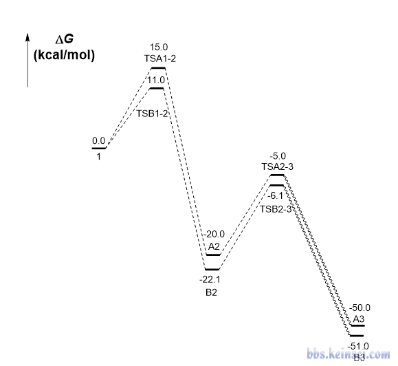

这个问题光凭感觉不容易给出绝对可靠的答案，而这类问题在通过计算化学研究化学反应相关问题时却又容易遇到。实际上这种问题可以根据每一步的反应速率常数直接模拟反应的进行来得到，这样的模拟可以给出浓度随时间的变化。给反应物设置一定初始浓度，并经过足够长时间的模拟后，哪个是主产物自然就知道了。

目前并没有免费、灵活、易用的程序实现上述这种模拟，而这样的程序对于涉及化学动力学的研究问题又非常重要，于是笔者开发了名为concvar的程序弥补这一空白。用户只需要提供整个反应涉及的各个极小点和过渡态结构的自由能，并设置模拟条件，程序就能开始模拟，输出各个物质浓度随时间的变化。

concvar程序的Windows和Linux版可执行文件，以及很详细的手册，可以在<http://sobereva.com/soft/concvar>免费下载。

concvar的介绍文章已经发表在了ChemRxiv上（<https://doi.org/10.26434/chemrxiv-2022-r6rh8>），研究文章中使用了concvar程序的话必须进行引用（注意确保DOI号在文献列表里确实显示了出来），格式例如：Tian Lu, concvar: A program solving time-dependent concentration variation for complex reactions, *ChemRxiv* (2022) DOI: 10.26434/chemrxiv-2022-r6rh8。

## 2 concvar简介

concvar程序的细节、具体使用方法请读者自行看手册和发表在ChemRxiv上的原文，在这一节仅对concvar的特征做很简要的说明。

一个复杂反应包含多个基元反应。concvar主要目的是求解复杂反应中涉及的各个物质（指反应物、中间体、产物，后同）各个时刻的浓度。需要从t=0时刻基于给定的初始浓度在特定温度下进行模拟，直到达到预设的步数上限，或者满足预设的某个浓度条件为止。每一步concvar按照下式令各个物质浓度c发生变化，其中t是当前时刻，Δt是模拟步长，t+Δ是下一时刻

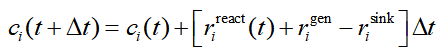

上式中r是反应速率，包含三个来源。其中r_react体现的是相关的基元反应产生的贡献，如下所示。这里假设基元反应是单分子的情况，concvar也支持双分子。其中j循环与当前物质i相邻的其它物质。k(j→i)是相邻物质j变成i的反应速率常数，k(i→j)是i变成相邻物质j的反应速率常数。

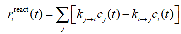

k可以让concvar根据输入文件里各个体系（“体系”指极小点和过渡态，后同）的自由能直接根据标准的过渡态理论自动算出来。对于有特殊情况时（如需要考虑隧道效应、变分过渡态理论），k也可以根据《基于过渡态理论计算反应速率常数的Excel表格》（<http://sobereva.com/310>）或使用其它程序自行计算，然后写在输入文件里提供给concvar。

上面物质浓度变化的式子里还有c(gen)和c(sink)，这是由于外部原因导致物质浓度生成（generation）和下降（sink）的速率。这两项在输入文件里可设可不设，默认为0。concvar也允许令特定物质浓度恒定在特定值。concvar还能强行让一批物质的浓度在每一步都彼此间满足Boltzmann分布。

模拟步长的选取是个重要问题。模拟的总时间长度等于步数和步长的乘积，跑特定时间长度的模拟，显然步长越大，所需步数越少，模拟耗时也因此越少。但步长不能太大，否则会造成结果不精确甚至明显不合理。假设所有基元反应都是单分子反应，或者虽然有双分子反应但其中一个反应物浓度为1 M（M是mol/L的意思），则以s（秒）为单位的步长应小于0.1/k_max，其中k_max是模拟涉及的基元反应中最大的k（对单分子以/s为单位，对双分子以/M/s为单位）。这等同于让物质浓度每一步的变化不超过当前浓度的10%。concvar在计算一开始会直接列出各个基元反应的k，并给出以此式估计的最大可接受步长，用户可以以此为参考设置输入文件里的步长。

## 3 concvar的应用实例

下面给出concvar程序的一些应用实例，由此读者可以快速了解concvar都能干什么，有什么实际意义，以及输入文件的形式是怎样的。具体输入文件的写法请大家自行看手册里的详细说明。下文的例子的完整的输入、输出文件在程序文件包里的examples目录下都提供了。concvar非常灵活，请读者基于这些例子举一反三研究自己的实际问题。

### 3.1 基元反应

在使用concvar研究复杂情况之前，先看一个最简单的情况，基元反应，能量折线图如下所示，蓝字是体系序号（标注顺序随意，这决定了$G字段里定义能量的顺序）。由于逆反应能垒很高，因此逆反应可以忽略不计。

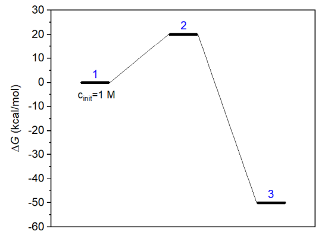

我们要对此反应在298.15 K下模拟200秒，看看反应物和产物浓度是怎么变化的。此例的concvar输入文件如下所示（创建一个文本文件，把以下内容粘贴进去即可，末尾至少要有一个空行。$打头的代表字段，不同字段间必须有至少一个空行）。

temper= 298.15  
 stepsize= 1E-4  
 nstep= 2000000  
 outfreq= 1000  
 ioutfmt= 2

$G  
 0  
 20  
 -50

$link  
 1,2,3

$cinit  
 1 1.0

上面temper是模拟温度（K），stepsize是模拟步长（秒），nstep是模拟步数上限，outfreq是往输出文件中输出各物质当前浓度的频率，ioutfmt控制输出的浓度的格式（1是科学计数法，2是小数）。$G字段设置各个体系在当前温度下的标准态浓度的自由能（kcal/mol）。由于能量折线图上我们把反应物、过渡态、产物分别标记为1、2、3号体系，因此$G里也要按照反应物、过渡态、产物的顺序输入。自由能可以通过量子化学方法很容易地计算，参考《使用Shermo结合量子化学程序方便地计算分子的各种热力学数据》（<http://sobereva.com/552>）。$link里每一行定义一个基元反应的反应物、过渡态、产物的体系序号。$cinit设置物质的初始浓度，当前将反应物（1号体系）浓度被设为1 M，没设的默认为0。

启动concvar，输入输入文件的路径（Windows版可以直接把文件图标拖到concvar窗口里免得手写路径。如果路径两边自动出现了双引号要去掉），然后按回车，就可以看到如下模拟状态信息，然后程序开始进行模拟。从以下信息中可看到各个物质的自由能，以及每个基元反应的自由能垒和根据过渡态理论估计的反应速率常数。还可以看到concvar建议步长应当小于7.36秒，当前我们用的步长0.0001秒远小于这个，所以模拟结果肯定是相当精确的。

 Temperature:  298.150 K  
  Simulation stepsize: 1.000E-04 s  
  Number of simulation steps:     2000000  
  Total simulation time:    200.000000 s (    3.333333 min)  
  Output frequency: per    1000 steps ( 0.100000 s)

 Number of systems:    3  
  Number of minima:     2  
     1 #  System index:    1,  G:    0.00 kcal/mol,  c(init):    1.000000 M  
     2 #  System index:    3,  G:  -50.00 kcal/mol,  c(init):    0.000000 M

 Number of reactions:    2  
     1 #  System    1 to    3,  G barr:   20.00 kcal/mol,  k:  1.358867E-02 s^-1  
     2 #  System    3 to    1,  G barr:   70.00 kcal/mol,  k:  3.040630E-39 s^-1  
 Maximum k is  1.358867E-02 s^-1  
 Stepsize is suggested to be smaller than 7.36E+00 s for present situation

在模拟进行过程中，程序每隔outfreq步就会往当前目录下的conc.txt里输出当前的步数、时间、各个物质的浓度以及总浓度。模拟期间用户可以随时打开此文件，看看当前浓度已经变化成什么样了。在笔者的Intel i7-10870H普通CPU上仅花费了3秒就跑完了设定的200万步。最后conc.txt的内容如下所示。

   Step      Time(s)       1          3        Total  
          0  0.0000E+00  1.0000000  0.0000000  1.0000000  
       1000  1.0000E-01  0.9986421  0.0013579  1.0000000  
       2000  2.0000E-01  0.9972860  0.0027140  1.0000000  
       3000  3.0000E-01  0.9959317  0.0040683  1.0000000  
 ...略  
    1997000  1.9970E+02  0.0662937  0.9337063  1.0000000  
    1998000  1.9980E+02  0.0662037  0.9337963  1.0000000  
    1999000  1.9990E+02  0.0661138  0.9338862  1.0000000  
    2000000  2.0000E+02  0.0660240  0.9339760  1.0000000

可见在反应进行200秒之后，反应物（1号体系）的浓度仅有0.066 M，产物浓度为0.934 M，模拟期间总浓度始终为1 M。

可以将浓度变化曲线画出来直观考察浓度变化过程。启动Origin，把conc.txt往里面一拖，然后把第二列作为横坐标数据，第3、4列作为纵坐标数据，绘制曲线图，结果如下，可见反应物浓度逐渐下降，产物浓度逐渐上升

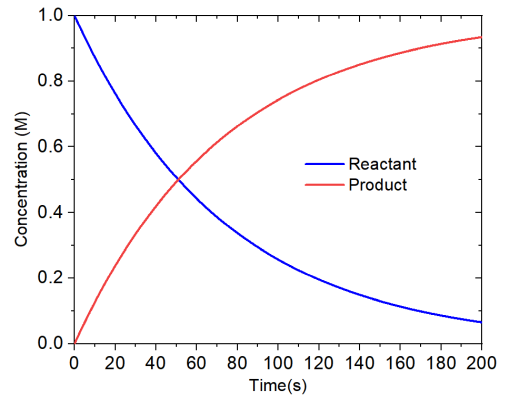

下面，我们用concvar考察一下这个反应的半衰期，也就是反应物浓度下降到一半的时候所花费的时间，这可以给输入文件添加以下内容来实现。这代表当1号体系浓度下降到0.5 M以下时模拟就立刻停止。  
$conccrit  
 1 < 0.5

用新的输入文件重新进行模拟，模拟会中途结束，并显示以下信息。即曰，模拟到了51.0092秒的时候就满足了浓度判断条件，显然当前的反应半衰期就是51.0092秒。

 Simulation is stopped because concentration of    1 < 0.500000 M has been satis  
 fied at step    510092 (   51.00920000 s). Current concentration: 5.0000E-01 M

单分子基元反应的半衰期是有解析解的，即ln(2)/k。从concvar载入输入文件后显示的信息中可看到当前的正向反应的k是1.358867E-02 s^-1，因此精确的半衰期是ln(2)/1.358867E-02=51.0092秒，这和concvar模拟出来的精确吻合！体现出当前模拟是完全合理的。实际上，当前模拟用更大步长也完全可以，比如模拟步长从0.0001设大到0.001秒的话，就只需要1/10的模拟耗时，此时得到的半衰期是51.009秒，依然很精确，只不过在有效位数上轻微微打了折扣。

### 3.2 包含多个基元步的复杂反应

此例使用concvar对下面的能量折线图描述的情况进行模拟。可见有三个基元反应，1和7号分别是反应物和产物，2、4、6号是过渡态，3和5是中间体。每个基元反应的正向和逆向势垒都分别是15和20 kcal/mol。

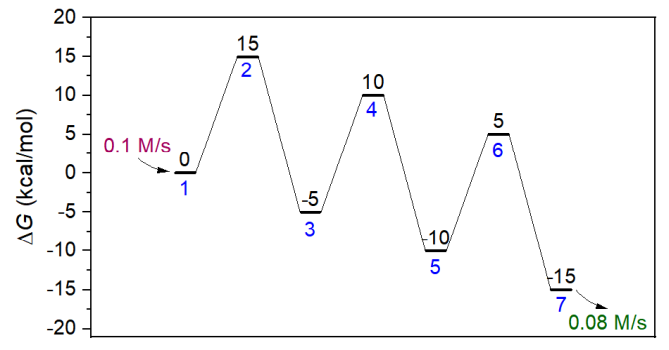

此模拟假定所有物质的初始浓度都为0，反应物的生成速率为0.1 M/s，而产物的消耗速率是0.08 M/s。模拟的反应将在250 K下进行50秒。输入文件如下所示，$G按照体系序号的顺序来写。顺带一提，$G定义的是相对自由能，相对于谁都可以，只有自由能之差影响模拟结果，习俗上将反应物作为自由能零点来定义。由于有三个基元反应，所以$link里定义了三条连接关系。$gen和$sink分别定义反应物和产物的生成和消耗速率。注意消耗速率具体来说是最大消耗速率，每一步消耗量不会超过剩余量（当某一步某物质浓度为负时，concvar自动会将其浓度设为0）。

temper= 250  
 stepsize= 1E-4  
 nstep= 500000  
 outfreq= 100  
 ioutfmt= 2

$G  
 0  
 15  
 -5  
 10  
 -10  
 5  
 -15

$link  
 1,2,3  
 3,4,5  
 5,6,7

$gen  
 1 0.1

$sink  
 7 0.08

使用concvar载入上面的输入文件进行模拟，一开始会显示以下信息。建议用户总是仔细看一下这里显示的模拟参数，确保输入文件书写和载入正确。

Number of systems:    7  
 Number of minima:     4  
    1 #  System index:    1,  G:    0.00 kcal/mol,  c(init):    0.000000 M  
    2 #  System index:    3,  G:   -5.00 kcal/mol,  c(init):    0.000000 M  
    3 #  System index:    5,  G:  -10.00 kcal/mol,  c(init):    0.000000 M  
    4 #  System index:    7,  G:  -15.00 kcal/mol,  c(init):    0.000000 M

Generation and consumption rates:  
    1 #  System index:    1,  gen.:  0.100000 M/s,  consump.:  0.000000 M/s  
    2 #  System index:    3,  gen.:  0.000000 M/s,  consump.:  0.000000 M/s  
    3 #  System index:    5,  gen.:  0.000000 M/s,  consump.:  0.000000 M/s  
    4 #  System index:    7,  gen.:  0.000000 M/s,  consump.:  0.080000 M/s

Number of reactions:    6  
    1 #  System    1 to    3,  G barr:   15.00 kcal/mol,  k:  4.018411E-01 s^-1  
    2 #  System    3 to    1,  G barr:   20.00 kcal/mol,  k:  1.710605E-05 s^-1  
    3 #  System    3 to    5,  G barr:   15.00 kcal/mol,  k:  4.018411E-01 s^-1  
    4 #  System    5 to    3,  G barr:   20.00 kcal/mol,  k:  1.710605E-05 s^-1  
    5 #  System    5 to    7,  G barr:   15.00 kcal/mol,  k:  4.018411E-01 s^-1  
    6 #  System    7 to    5,  G barr:   20.00 kcal/mol,  k:  1.710605E-05 s^-1  
 Maximum k is  4.018411E-01 s^-1  
 Stepsize is suggested to be smaller than 2.49E-01 s for present situation

输出的concvar.txt开头部分如下所示，可见反应物、中间体、产物的浓度随时间的变化都输出了。

   Step      Time(s)       1          3          5          7        Total  
          0  0.0000E+00  0.0000000  0.0000000  0.0000000  0.0000000  0.0000000  
        100  1.0000E-02  0.0009980  0.0000020  0.0000000  0.0000000  0.0010000  
        200  2.0000E-02  0.0019920  0.0000080  0.0000000  0.0000000  0.0020000  
        300  3.0000E-02  0.0029820  0.0000179  0.0000001  0.0000000  0.0030000  
 ...略

对concvar.txt里的浓度变化进行绘图，得到下图。可见随着反应物的不断产生，反应物、第一个中间体（体系3）、第二个中间体（体系5）的浓度依次累积起来，但到了20秒后基本就不变了，处于饱和了。产物的浓度在10.7秒之前都为0，这是因为自设的产物的消耗速率0.08 M/s在此之前都比它的产生速度更快。在反应进行20秒之后，产物的浓度以0.02 M/s的速率线性增加，这是因为此时第二个中间体的浓度已经恒定不变了，而且反应物的生成速度（0.1 M/s）比产物的消耗速度（0.08 M/s）更大。

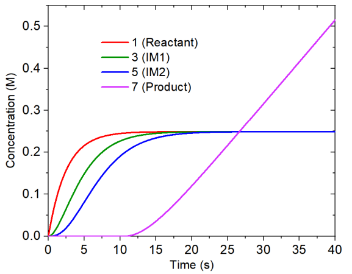

### 3.3 含有竞争反应的例子

下面这个能量折线图里各个体系的自由能就是本文一开始的那张图里的，存在彼此竞争的两个反应路径。此例我们靠concvar做模拟来研究一下哪个产物是主产物、反应的选择性如何。

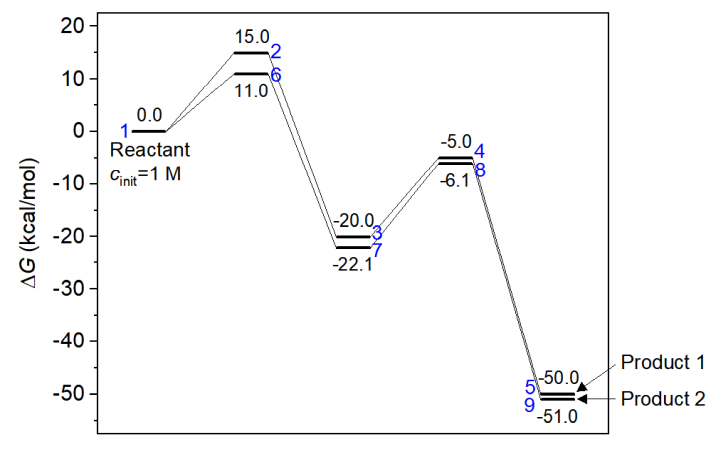

这个反应假定在常温下进行，反应物初始浓度设1 M。模拟步长用1E-6秒，跑100万步，因此模拟总时间为1秒。前面说了，concvar会直接在屏幕上显示最大可接受步长，模拟用的步长明显比那个小就可以保证模拟精度。至于需要跑多少步，大家可以反复尝试。如果跑的步数太少，导致模拟的总时间长度不够，可能产物都还没怎么生成，就没法判断主产物了，此时可以把步数增加后重新跑。此例的输入文件如下所示。可见在$link里反应物（体系1）同时在两个基元反应中被涉及。

temper= 298.15  
 stepsize= 1E-6  
 nstep= 1000000  
 outfreq= 1000  
 ioutfmt= 2

$G  
 0  
 15  
 -20  
 -5  
 -50  
 11  
 -22.1  
 -6.1  
 -51

$link  
 1,2,3  
 3,4,5  
 1,6,7  
 7,8,9

$cinit  
 1 1.0

这次的模拟输出文件如下所示

   Step      Time(s)       1          3          5          7          9        Total  
          0  0.0000E+00  1.0000000  0.0000000  0.0000000  0.0000000  0.0000000  1.0000000  
       1000  1.0000E-03  0.0000000  0.0010982  0.0000699  0.9875062  0.0113257  1.0000000  
       2000  2.0000E-03  0.0000000  0.0010313  0.0001367  0.9760981  0.0227339  1.0000000  
       3000  3.0000E-03  0.0000000  0.0009685  0.0001996  0.9648217  0.0340102  1.0000000  
 ...略  
     997000  9.9700E-01  0.0000000  0.0000000  0.0011681  0.0000093  0.9988226  1.0000000  
     998000  9.9800E-01  0.0000000  0.0000000  0.0011681  0.0000092  0.9988227  1.0000000  
     999000  9.9900E-01  0.0000000  0.0000000  0.0011681  0.0000091  0.9988228  1.0000000  
    1000000  1.0000E+00  0.0000000  0.0000000  0.0011681  0.0000090  0.9988229  1.0000000

5号和9号分别是产物1和产物2。从以上信息可见，在模拟结束后，1 M反应物几乎完全变成了产物2（0.9988 M），而产物1的浓度几乎可以忽略不计（约0.0012 M）。当前反应已经进行得很充分了，因为反应物（体系1）、中间体（体系3和7）的浓度都基本为0。因此，此模拟证明产物2是主产物，而且反应的选择性非常强。

### 3.4 验证Curtin–Hammett原理

化学动力学领域有个知名的Curtin–Hammett原理。它说如果有一对反应物彼此可以快速相互转换，每个反应物都各通向一个产物而且逆反应可以忽略，则产物分布由两个反应的过渡态的能量相对高低所决定，过渡态能量低的那个路径对应的是主产物。Curtin–Hammett原理可以通过推导来证明，而这一节我们设计一个模型，用concvar做模拟来验证。下面的能量折线图对应的情况是Curtin–Hammett原理适用的典型情况，体系3和5是两个反应物，它们之间的变换势垒非常低，因此常温下二者转换很快且总能达到热力学平衡状态。两个反应物通向产物的势垒都较高，并且产物能量显著低于反应物，故逆反应可忽略。按照Curtin–Hammett原理的说法，由于TS 1显著低于TS 2，产物1应当是主产物（尽管根据波尔兹曼分布，反应物2的浓度总比反应物1要高，且尽管产物2相对于产物1是明显热力学上更有利的产物）。

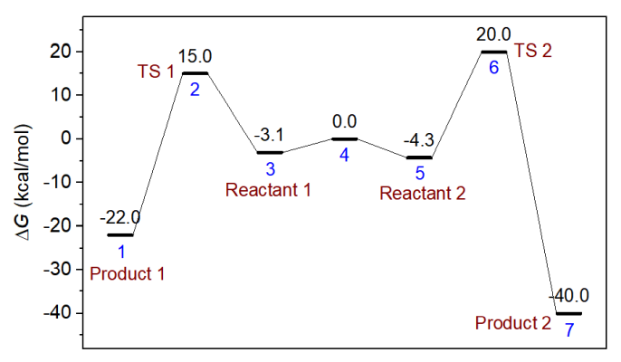

本节我们在298.15 K下对上图的模型进行模拟来试图验证Curtin–Hammett原理对主产物的预测。输入文件如下所示。这里有很关键的一点是不能将两个反应物之间的相互转换反应以常规方式进行考虑，即不能在$link里写上3,4,5，否则由于这样的基元反应的k很大，必须用非常小的模拟步长（1E-12秒的数量级）才行，而此时为了模拟足够长时间以观测到产物出现足够的浓度（需几百秒，因为此例的反应势垒较高），所需要的模拟步数要达到1E14数量级，明显不可能算得动。考虑到两个反应物之间的转换极快，二者总能达到热力学平衡，因此在此例输入文件里用了$Boltzmann字段，直接要求它俩的浓度关系在模拟的每一步总是满足Boltzmann分布（或者说，每一步都将二者的总浓度按照Boltzmann分布关系进行分配）。如果不了解Boltzmann分布的话看《根据Boltzmann分布计算分子不同构象所占比例》（<http://sobereva.com/165>）。此时，这两个反应物各自的浓度随便设，只有浓度之和是有意义的，这里将二者浓度都设为了0.5 M，即总反应物浓度是1 M。

temper= 298.15  
 stepsize= 1E-3  
 nstep= 500000  
 outfreq= 100  
 ioutfmt= 2

$G  
 -22  
 15  
 -3.1  
 0  
 -4.3  
 20  
 -40

$link  
 1,2,3  
 5,6,7

$Boltzmann  
 3,5

$cinit  
 3 0.5  
 5 0.5

用以上输入文件进行模拟，反应总共进行了500秒，实际发现到了200秒之后浓度就不再明显变化了，因此下图只把前200秒的浓度变化曲线绘制了出来。

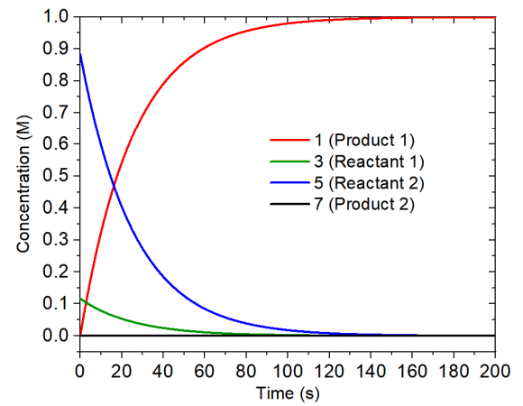

由上图可见两个反应物的浓度随反应进行不断下降，由于定义了$Boltzmann，二者的比率始终为0.131:1。产物2的浓度始终基本为0，而产物1的浓度则增加得很快，因此是占绝对主导的产物，这和Curtin–Hammett原理做出的预测完全相同。

### 3.5 确定决速态

这里说的决速态是指它的自由能对整个反应速率起决定作用的过渡态，它的自由能轻微降低就可以令反应速率有明显的提升。目前有直接观看能量折线图判断决速态的方法，见J. Chem. Educ., 58, 32 (1981)和ChemPhysChem, 12, 1413 (2011)，而本节我们通过concvar从数值模拟的角度来确认决速态，这是严格而且普适的。

本节考察下图的模型，1号体系是反应物，经过两个过渡态到达产物（体系5）。这两步正向反应势垒都是30 kcal/mol，哪个是决速态？为了研究这个问题，创建如下输入文件，假设模拟发生在350 K，反应物初始浓度为1 M。由于这两个基元反应都很慢，为了让产物能有明显的浓度，需要跑较长的模拟。concvar运行后会显示步长建议不超过55.9 s，因此这里用10秒作为步长（留有一定余量，因为之后还要稍微降低过渡态势垒后重新模拟，届时最大可接受步长会更小）。总共模拟10000000步，相当于反应进行100000000秒（3.17年）。

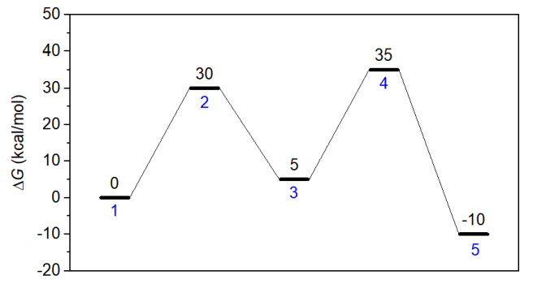

模拟后得到的concvar.txt内容如下所示，可见最终产物（体系5）浓度为0.096783 M。

   Step      Time(s)       1          3          5        Total  
  0.0000E+00 0.0000E+00 1.0000E+00 0.0000E+00 0.0000E+00 1.0000E+00  
  1.0000E+04 1.0000E+05 9.9915E-01 7.5375E-04 1.0122E-04 1.0000E+00  
 ...ignored  
  1.0000E+07 1.0000E+08 9.0254E-01 6.8087E-04 9.6783E-02 1.0000E+00

将第一个过渡态的浓度降低1 kcal/mol，即把$G里的30改写为29，然后重新做模拟，发现模拟后产物浓度为0.096836 M，相对于之前基本没变，体现出总反应速度对这个过渡态的能量敏感性极低。

将过渡态1的自由能恢复为原先值，而把第二个过渡态的自由能降低1 kcal/mol成为34 kcal/mol，再次重做模拟，发现最后产物浓度为0.34796 M，这比原先浓度大得多。可见，第二个过渡态明显可判断为决速态。这个结论和前面提到的观看能量折线图进行判断的方法得到的结论是一致的。

### 3.6 含有双分子基元反应的复杂反应

前面例子里的模拟只涉及到单分子基元反应，concvar也可以支持含有双分子反应物和双分子产物的基元反应情况的模拟，这一节就给出具体例子。需要注意的是，concvar根据输入的自由能自动计算k的公式适合单分子基元反应以及液相下的双分子基元反应，如果你的模拟涉及到双分子气相基元反应，则相应的k必须自己在$link中直接定义，见concvar手册3.3节。双分子气相基元反应的k可以通过《基于过渡态理论计算反应速率常数的Excel表格》（<http://sobereva.com/310>）里的表格直接基于自由能垒得到。

本节模拟对应的能量折线图如下所示。第一个基元反应是双分子反应物，而第二个基元反应是双分子产物。下图的体系2被视为加入分子看待，体系7被视为离去分子看待，在concvar中它们和其它极小点等同视之。记住只有自由能垒影响模拟结果，比如对于第一步基元过程的正向反应，只有G(3)-G(1)-G(2)影响结果，因此只有俩反应物的自由能之和有意义。习俗上，把加入和离去分子的自由能定义为0。

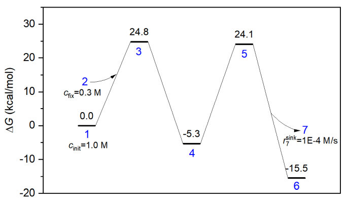

本次模拟用的输入文件如下。反应在400 K下进行10000秒，反应物的初始浓度被设为了1 M。此模拟假定加入分子的浓度始终恒定为0.3 M，如下所示这通过$fix字段来实现。另外，离去分子的消耗速率假定最大为0.0001 M/s，因此用了$sink字段。怎么定义双分子反应物和双分子产物在下面的输入文件也明确体现了，要用&符号分隔两个反应物和两个产物的体系序号。

temper= 400  
 stepsize= 1E-2  
 nstep= 1000000  
 outfreq= 1000  
 ioutfmt= 2

$G  
 0  
 0  
 24.8  
 -5.3  
 24.1  
 -15.5  
 0

$link  
 1&2,3,4  
 4,5,6&7

$cinit  
 1 1.0

$fix  
 2 0.3

$sink  
 7 1E-4

整个模拟过程中各物质浓度变化如下图所示。由于反应物和中间体浓度在一开始变化极快，所以横坐标用了个间断使得整个过程的各个物质浓度变化都能清楚展现出来。

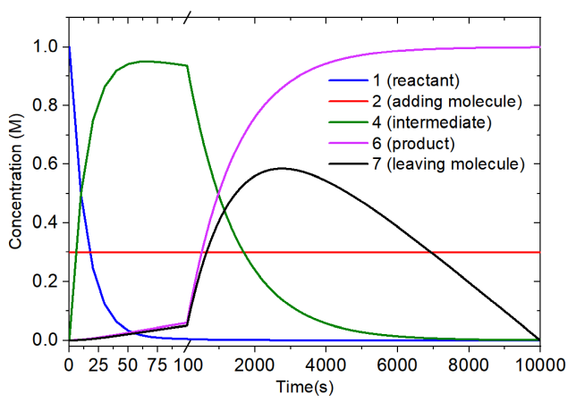

由上图可见，在模拟开始后几十秒内，反应物几乎完全变成了中间体，而加入分子的浓度始终恒定在0.3 M。随着反应的进一步进行，中间体的浓度逐渐下降并形成了产物。在10000秒反应结束后，1 M的反应物完全变成了产物。离去分子浓度在约2800秒的时候达到了顶峰。而由于此后中间体的浓度较低了，导致由中间体生成产物&离去分子的速度比人为设置的离去分子消耗速度更慢，因此离去分子的浓度不断下降，并在模拟的最后都消耗光了。

## 4 总结&其它

concvar是一个免费、灵活、普适的研究复杂反应中各种物质浓度随时间变化的程序，对于量子化学研究者来说极为友好，只需要把算出来的自由能输进去并设置模拟条件即可进行模拟。concvar有很大的实际意义，如前面的例子所见，反应的半衰期、反应的主产物和分支比、决速态等都可以通过concvar做模拟来研究。而且仔细考察浓度在反应过程中的变化细节、检验浓度变化如何受模拟设置的影响，还可以更好地认识反应的内在特征，认清影响反应进行的因素。大家做量子化学计算研究化学反应的时候可以把concvar模拟的浓度变化纳入到文章的讨论中，可使得研究更有深度、分析讨论更充实。另外，concvar对于物理化学中的化学动力学这部分的教学也很有好处，通过让学生实际做模拟，可以使他们更好地理解过渡态理论、物质间的变化、反应速率常数、决速态、半衰期、竞争反应等重要概念以及Curtin–Hammett等原理。

最后顺带一提的是，有些复杂反应路径上有一些势垒很低、反应很快的基元过程，为了照顾它们需要用很小的步长，导致难以在有限的模拟时间内观察到真正关心的物质出现明显的浓度。对这种情况可以考虑对整条反应路径做适当简化，将一些浓度没什么考察意义的中间体和相邻的过渡态忽略掉。

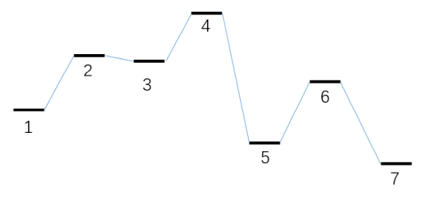

concvar也可以用于模拟催化循环过程中物质浓度的变化。通常将催化剂与被催化物质的结合作为第一步基元反应，让催化完成并释放催化剂对应最后一步基元反应，令最后一步对应催化剂的物质的序号等于第一步的催化剂序号，就构成了首尾相接的催化循环了。
