**使用Multiwfn计算分子和晶体中孔洞的直径**

Using Multiwfn to calculate cavity in molecule and
crystal

文/Sobereva@[北京科音](http://www.keinsci.com)   2022-Jun-30

## 0 前言

化学研究中经常涉及到孔洞尺寸的问题，这和分子吸附、化学物质分离、分子识别等很多问题有关。Multiwfn有展现化学体系孔洞并计算其体积的功能，见《使用Multiwfn图形化展示分子动力学模拟体系中的孔洞、自由区域》《<http://sobereva.com/539>）和《使用Multiwfn可视化分子孔洞并计算孔洞体积》（<http://sobereva.com/408>）。在很多研究中，都利用孔洞的直径这个特别简单的参数来说明孔洞的尺寸大小，这可以用于讨论多孔物质的吸附分子能力等问题。如果结合《谈谈分子半径的计算和分子形状的描述》（<http://sobereva.com/190>）和《使用Multiwfn计算分子的动力学直径》（<http://sobereva.com/503>）介绍的分子半径/直径，还可以讨论某些分子是否能够穿越孔洞、是否有可能结合到孔洞里。

有些情况计算孔洞的直径比较简单，比如富勒烯的内部直径，可以直接测量穿过球心彼此在对面的两个碳原子的距离，再减去两个碳原子的范德华半径即可。但有很多情况孔洞形状是不规矩的，或者看似规矩，却找不到合适的可借助的原子用于计算孔洞直径。为了令孔洞直径的计算尽可能准确且方便，笔者在Multiwfn程序中加入了计算孔洞直径的功能，将在下文进行介绍，读者会发现使用特别容易和灵活，而且借助VMD程序还能通过绘制圆球很清楚地可视化孔洞。

读者务必使用2022-Jun-25及以后更新的Multiwfn程序，否则没有本文介绍的功能。Multiwfn可以在主页<http://sobereva.com/multiwfn>免费下载，不了解着建议参看《Multiwfn FAQ》（<http://sobereva.com/452>）和《Multiwfn入门tips》（<http://sobereva.com/167>）。使用本文介绍的功能时请读者按照程序要求恰当引用Multiwfn原文。

## 1 原理

Multiwfn的计算孔洞半径或直径的思想很简单。首先在整个体系中选择围绕孔洞出现的一批原子，然后再设一个球心（通常可以用那批原子的几何中心），并计算它与那批原子的范德华球表面相接触的半径，如下图左侧橙色圆球所示，绿点是球的中心。多数情况不能直接用这个半径当做孔洞的半径，因为如果恰当调节球心位置，球的半径还可以变得更大，从而更真实地描述孔洞实际半径。Multiwfn会通过最陡上升法反复迭代调节球心位置使得球的半径能够尽可能变大。当球心位置收敛时（位移小于0.01埃），球的直径就是孔洞的直径了。此算法要求每一步的球心位置最大变化不超过0.3埃，即所谓的置信半径。

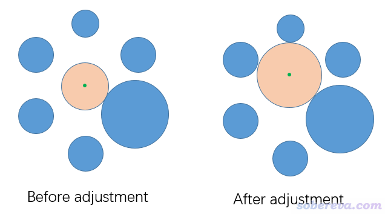

用上述的方法确定孔洞直径，最终结果和初始的球心位置有关。根据算法原理很容易理解，如果体系有多个孔洞，哪怕孔洞间甚至有一定交叠，只要令一开始的球心位置处在特定孔洞区域内，那么最终Multiwfn给出的就是那个孔洞的直径。

计算的孔洞直径和原子范德华半径的选用显然存在直接联系，Multiwfn用的是最常用的Bondi范德华半径，见J. Phys. Chem., 68, 441 (1964)。

这个功能虽然名义上是计算孔洞半径/直径，但也完全可以计算环状体系的内径，但应当结合实际情况决定是否有必要让Multiwfn调节球心位置，以及如果调节的话，允许往哪个方向调节。Multiwfn中可以要求不做调节，或者只往X或Y或Z方向，或者只在XY或XZ或YZ平面上调节。例如有个环状体系基本处在XY平面上，你想得到它的内径，那就应当只允许在XY平面上调节球心位置，因为如果一旦允许在Z方向调节的话，由于每当球心Z坐标增加或减小时球的半径就可能变大（视体系结构特征而定），因此球就会逐渐跑到Z无穷大或无穷小的地方去。如果你要计算的环不平行于某个笛卡尔平面，也可以先用Multiwfn的几何变换功能让这部分平行于某个笛卡尔平面，然后再计算孔洞，具体看《Multiwfn中非常实用的几何操作和坐标变换功能介绍》（<http://sobereva.com/610>）里面的相应功能的介绍。

## 2 使用

使用Multiwfn的这个功能可以用任意含有几何信息的格式作为输入文件，如pdb、xyz、fch、gjf、cif、mol2、mwfn等等，详见《详谈Multiwfn支持的输入文件类型、产生方法以及相互转换》（<http://sobereva.com/379>）。此功能明确支持周期性体系。

启动Multiwfn，载入输入文件，进入主功能100的子功能21后，再输入cav即可进入此功能。也可以直接在Multiwfn的主界面直接输入cav快捷进入。之后需要输入一批用来检测接触从而确定圆球半径的原子的序号，然后再设置球心的初始位置，以及选择对球心调节的方式。通常结果迅速就会计算出来。

Multiwfn在给出孔洞半径和直径后，还会输出在VMD程序里绘制圆球的命令。VMD是十分流行的可视化程序，可以在<http://www.ks.uiuc.edu/Research/vmd/>免费下载。将pdb、xyz等VMD支持的结构文件载入VMD后，再把Multiwfn在窗口里显示的VMD作图命令复制到VMD的文本窗口执行，就可以看到一个透明的圆球直观地展现了孔洞。如果你不知道怎么从Multiwfn的文本窗口中复制出来文本信息，看Multiwfn手册5.4节的说明。

读者也可以参考《详谈Multiwfn的命令行方式运行和批量运行的方法》（<http://sobereva.com/612>）里的做法，写脚本批量调用Multiwfn进行计算。对于分子动力学轨迹，还可以通过脚本让Multiwfn计算每一帧的孔洞大小，从而了解孔洞尺寸随时间的变化情况。

## 3 实例

下面通过一些例子演示使用Multiwfn对各种体系计算孔洞直径。用到的文件可以在<http://sobereva.com/attach/643/file.zip>里得到。

### 3.1 例1：计算开口富勒烯衍生物的富勒烯部分的孔洞直径

Org. Chem. Front., 9, 320 (2022)中报道了一些开口富勒烯衍生物，本例要考察的分子的晶体结构如下所示，将要对绿色所示的富勒烯部分计算其孔洞直径。本例就不再对其结构做优化了，其结构文件是本文文件包里的open_fullerene.pdb。提示：在GaussView里，按住r键拖动划框将这些原子选为黄色，然后在Tools - Atom selection里就能快速得到这部分的原子序号，为1,12-20,23-67,101。

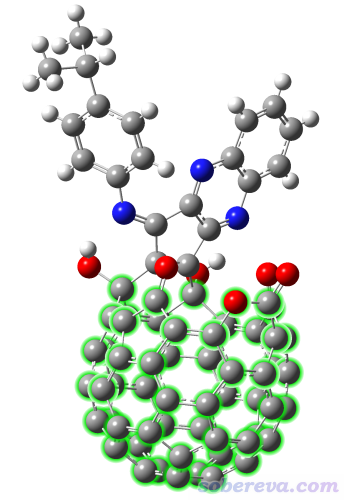

启动Multiwfn，然后输入  
open_fullerene.pdb  //输入实际路径  
cav  //进入孔洞直径计算功能  
1,12-20,23-67,101  //将包围孔洞的那些原子用于判断接触以确定球的半径  
1  //使用上面输入的那些原子的几何中心作为球心初始位置  
1  //允许球心位置在各个方向自发调节

瞬间就算完了，从屏幕上看到以下信息

 X/Y/Z of initial geometry center are    3.901518    3.594304   11.835946 Angstrom  
 Initial sphere radius is    1.677086 Angstrom

 Step    1  
 Current coordinate:    3.901518    3.594304   11.835946 Angstrom  
 Gradient:        0.100734   -0.067365    0.157089  Norm    0.198399  
 Displacement:    0.026653   -0.017824    0.041564  Norm    0.052494 Angstrom  
 Goal: displacement norm <  0.01000000 Angstrom  
 Not converged, new coordinate:    3.928171    3.576480   11.877510 Angstrom  
 Sphere radius at new coordinate:    1.690599 Angstrom

...略

 Step    5  
 Current coordinate:    3.939857    3.615266   11.899052 Angstrom  
 Gradient:        0.009072    0.022419    0.013652  Norm    0.027772  
 Displacement:    0.002400    0.005932    0.003612  Norm    0.007348 Angstrom  
 Goal: displacement norm <  0.01000000 Angstrom

 Converged after     5 iterations

 Final X/Y/Z of sphere center:    3.942257    3.621198   11.902664 Angstrom  
 Radius is    1.707257 Angstrom  
 Diameter is    3.414514 Angstrom  
 Volume is   20.844205 Angstrom^3

从以上信息可见，初始球心位置是3.901518 3.594304 11.835946 埃，对应于我们选中的那批原子的几何中心，并且球的初始半径是1.677埃。之后程序开始迭代，在第5步时位移小于了0.01埃，宣告收敛。最终球心位置是3.942257 3.621198 11.902664 埃，半径是1.707埃，比自发调节之前更大了。最终的孔洞直径是半径的两倍，即3.414埃，若将孔洞近似为理想圆球，体积是20.844埃^3。然后，屏幕上显示了以下内容，这是在VMD里绘制圆球展示孔洞要用的命令。

color Display Background white  
draw material Transparent  
draw color yellow  
draw sphere {    3.942    3.621   11.903 } radius   1.707 resolution 100

启动VMD，将open_fullerene.pdb拖入VMD Main窗口载入，在Graphics - Representation里将Drawing Method设为CPK，再把Sphere Scale设小到0.7。然后将以上四行命令粘贴到VMD文本窗口里并按回车，就能看到下图

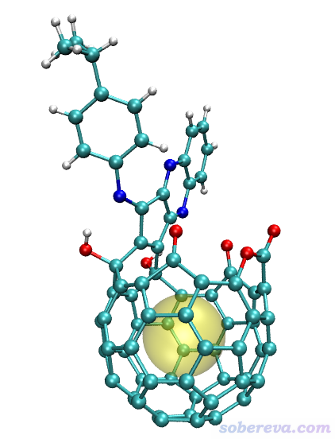

可见上图中黄色圆球将孔洞很好地表现了出来。

### 3.2 例2：计算分叉碳纳米笼的直径

在Chem. Sci., 4, 84 (2013)中有人合成了下图右侧所示的三分叉碳纳米笼，相当于三分叉碳纳米管的连接部分。此例我们计算这个纳米笼的直径。此论文补充材料直接给的坐标对应的结构文件是本文文件包里的carbon_nanocage.xyz。

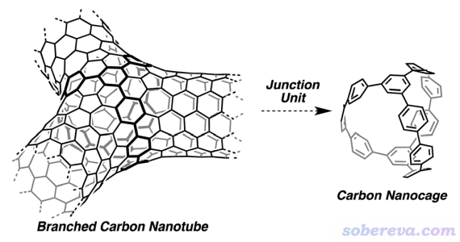

启动Multiwfn，然后输入  
carbon_nanocage.xyz  
cav  
[按回车]  //把所有碳原子用于判断接触以确定球的半径  
1  //使用上面输入的那些原子的几何中心作为球心初始位置，当前等同于整个分子的几何中心  
1  //允许球心位置在各个方向自发调节

得到直径为14.255埃。按上一节的步骤，用Multiwfn给出的命令在VMD里作图结果如下，非常清楚

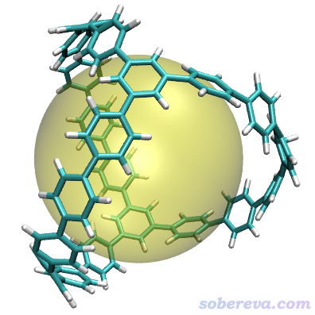

### 3.3 例3：计算18碳环衍生物的孔洞直径

笔者对18碳环（cyclo[18]carbon）及其衍生物做过广泛的研究，汇总见<http://sobereva.com/carbon_ring.html>。其中，对于结合着羰基的18碳环C18-(CO)n的研究在《深入揭示18碳环的重要衍生物C18-(CO)n的电子结构和光学特性》（<http://sobereva.com/640>）中还做了专门的介绍。此研究中涉及到一个C18-(CO)4同时脱两个一氧化碳变成C18-(CO)2的过程，其过渡态如下所示。从坐标轴可见，整个体系基本是在XY平面上

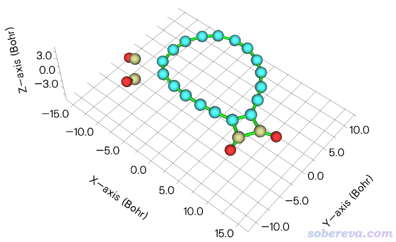

这一节我们对上图中青色标注的碳环区域计算孔洞半径，也相当于环的最大内径。由于这个环的形状非常不规矩，不用本文介绍的Multiwfn的功能的话是很难准确得到内径的。上图中青色的原子是1到18号原子。

启动Multiwfn然后输入  
C18-(CO)4_TS.xyz  
cav  
1-18  //用碳环部分的原子判断接触以确定球的半径  
1  //使用上面输入的那些原子的几何中心作为球心初始位置  
5  //只允许在XY方向调节球心位置（由于球心在Z方向不断向上或向下移动过程中都会导致球的半径越来越大，因此这里故意不让球心自动在Z方向调节）

得到的孔洞直径是2.974埃。还是按照前面的例子，在VMD里载入体系结构并用Multiwfn给出的命令画出孔洞示意图，如下所示，可见结果很合理。

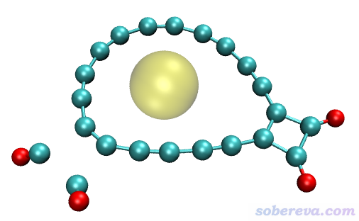

### 3.4 例4：计算MIL125晶体的孔洞直径

本文文件包里MIL125.cif是MIL125的晶体结构文件。MIL125是一种基于Ti的MOF体系，有较大的孔洞，其结构如下所示

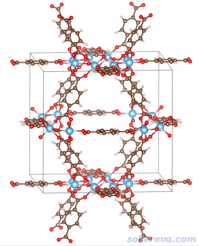

下面我们来计算它中心区域的孔洞。

启动Multiwfn，然后输入  
MIL125.cif  
cav  
[按回车]  //用体系里所有原子检测接触以确定球半径  
3  //使用晶胞中心作为球心初始位置  
1  //允许球心位置做调整

从屏幕上的提示可见球心位置的调整仅1轮迭代就收敛了，相当于没做调整。这是因为当前晶体里原子位置是相对于晶胞中心对称的，而且恰好晶胞正中心正是最大孔洞的中心。屏幕上显示的孔洞直径为12.442埃。

之后在VMD里把描绘孔洞的圆球显示出来，这里有一些细节需要注意。VMD，起码是笔者目前用的1.9.3版，不支持载入cif文件，因此必须转成VMD可以支持的格式。另外，即便转换成能记录晶胞信息的pdb格式，VMD自己也不支持显示出位于边界的原子的周期镜像，因此边缘如同缺了原子，显得不太美观。好在Multiwfn不仅可以用来把cif转成pdb格式，同时还支持把边界原子的镜像原子添加到体系中，从而能让VMD显示出来，下面就演示一下。

返回Multiwfn的主菜单，然后进入主功能300的子功能7，选择选项27，屏幕上显示加入了64个边界原子，之后进选项0在图形界面里预览一下，可以看到没问题。关闭图形窗口后，再选-2将当前结构导出为pdb文件。导出的MIL125.pdb文件在本文的文件包里已经提供了。

将MIL125.pdb载入VMD，然后在文本窗口输入pbc box把晶胞边框显示出来，再输入以下计算孔洞后Multiwfn在屏幕上提示的命令  
color Display Background white  
draw material Transparent  
draw color yellow  
draw sphere {    9.462    9.462    8.978 } radius   6.221 resolution 100  
再把显示方式设成Licorice，并把Bond Radius改为0.1，再在VMD Main窗口里选Display - Orthographic用正交视角后，看到的图像如下，可见清楚地将MIL125中心的孔洞展现了出来

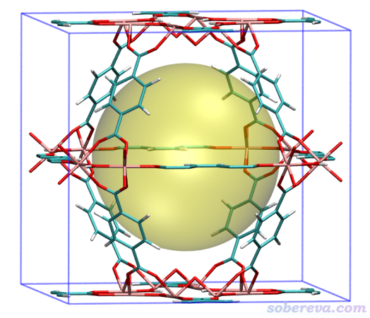

一个晶体里可能有不止一种类型的孔洞，直径也有所不同。MIL125这个体系中虽然只有一种孔洞，但晶胞里各个角落实际上也都是孔洞的一部分。这里再演示一下怎么把MIL125边角的孔洞进行计算和绘制。

启动Multiwfn，然后输入  
MIL125.cif  
cav  
[按回车]  //用体系里所有原子检测接触以确定球半径  
4  //手动输入初始球心位置的分数坐标  
0,0,0  //考察中心位于分数坐标(0,0,0)的孔洞  
1  //允许球心位置做调整

这次得到的孔洞直径还是12.442埃，而这回球心位于(0,0,0)。然后，重复上面的步骤进行绘制，看到下图，可见清楚地把边角位置的孔洞展现了出来。这里把坐标轴也显示了出来，红、绿、蓝分别对应X、Y、Z方向

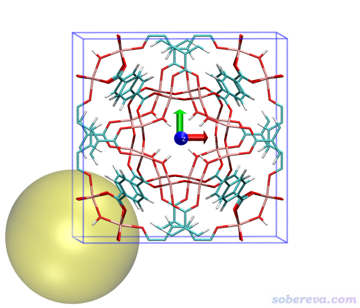

读者若想同时绘制多个孔洞当然也可以。每次给Multiwfn提供不同的球心初始位置，得到绘制不同球心所用的VMD的绘图命令，然后依次使用即可。绘制不同类型的孔洞前，还可以把draw color yellow里的颜色改成其它的，从而通过颜色区分不同类型的孔洞。

## 4 其它

有一些用户问，为什么他算出来的孔洞半径是负值，为什么用Multiwfn给的命令在VMD里画不出圆球来。这明显都是对本文介绍的方法的原理缺乏理解，而且头脑里也没有范德华半径的基本概念所致。

比如对下图左图所示的环己烷，就明显不能用本文的功能计算其中的孔洞直径。进入Multiwfn主功能0后，把Ratio of atomic size设为4.0时，原子球半径就等于范德华半径，对应的图就是下图的右图。可见，环己烷中间区域根本没有空白，显然没法计算孔洞直径。

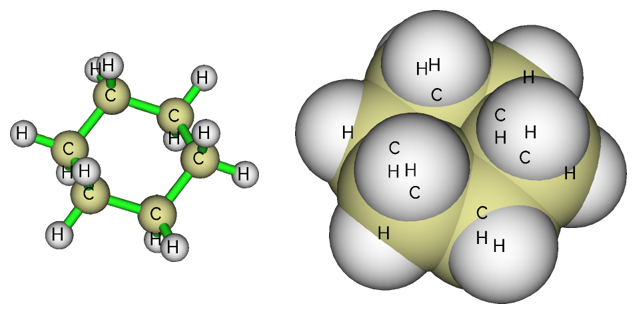
