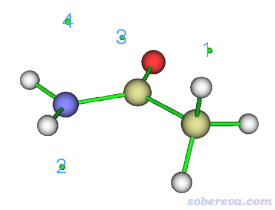
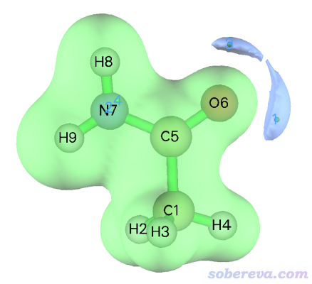
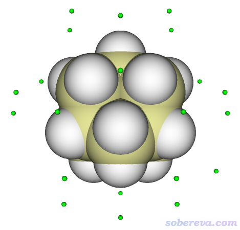
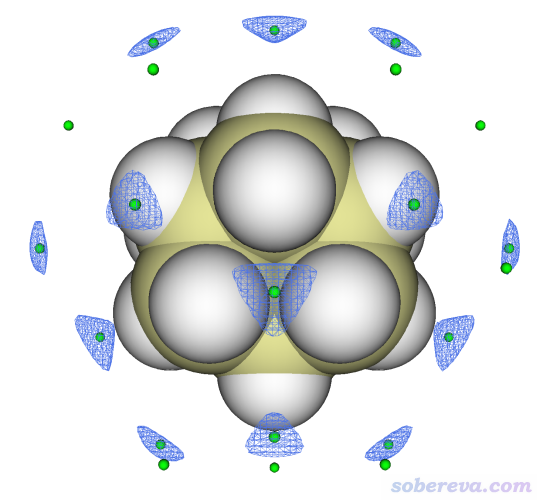
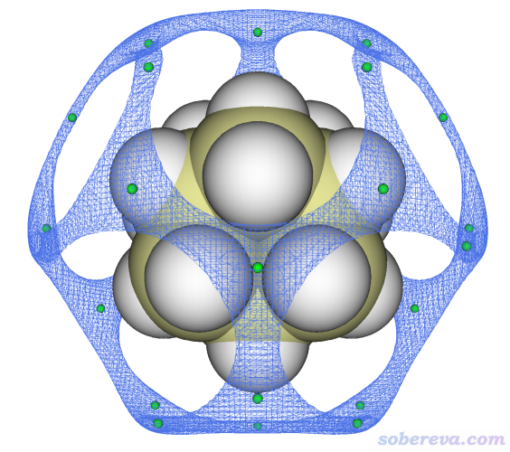
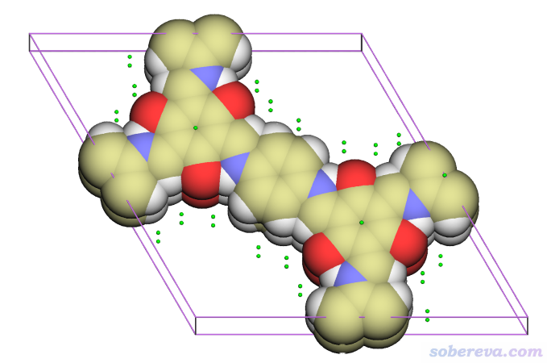
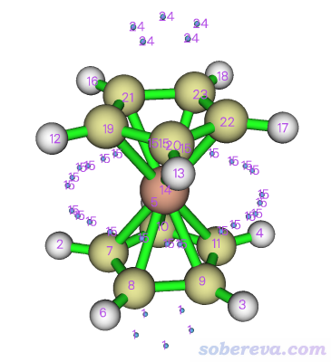
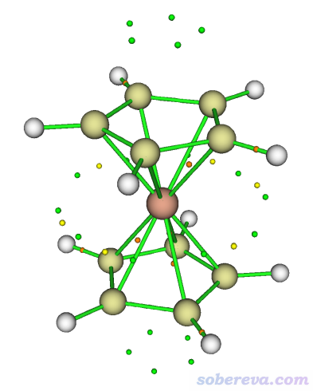
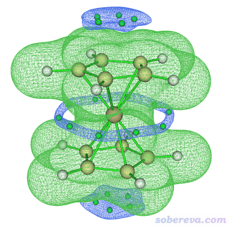

**使用Multiwfn对静电势和范德华势做拓扑分析精确得到极小点位置和数值**

Using Multiwfn to perform topology analysis for electrostatic potential and van der Waals to exactly obtain positions and values of their minima

文/Sobereva@[北京科音](http://www.keinsci.com)   2022-Jul-4

## 0 前言

静电势和笔者在J. Mol. Model., 26, 315 (2020)中提出的范德华势都是分析化学体系与其它分子相互作用的重要方法。静电势的极小点（指全空间内的极小点，而不是<http://sobereva.com/159>和<http://sobereva.com/443>等文章介绍的常被讨论的分子表面上的静电势极小点）有重要的意义，比如J. Comput. Chem., 39, 488 (2017)指出静电势极小点能说明孤对电子位置、朝向，其数值和分子与其它Lewis酸的相互作用能有线性相关性。J. Phys. Chem. A, 123, 10139 (2019)还指出静电势极小点处静电势的Hessian矩阵本征值和体系的芳香性存在联系。范德华势在《绘制静电势全局极小点+等值面图展现孤对电子位置的方法》（<http://sobereva.com/493>）里有详细介绍，它的极小点也有重要意义，其位置体现出体系在什么位置和探针原子的范德华净吸引作用最强（这里说的“净”是指交换互斥势和色散吸引势抵消后的净效果），其位置和数值大小对于预测和解释体系与其它分子的范德华作用出现的倾向性和强度极为重要。尽管范德华势的等值面图很直观，但准确、定量对某体系内不同位点或者不同体系的类似位点间进行对比，还是要用到范德华势极小点的具体数值的。

波函数分析程序Multiwfn（<http://sobereva.com/multiwfn>）的盆分析模块十分强大和普适，对任何三维实空间函数都可以基于均匀分布的格点数据搜索出函数的极大点和极小点的位置，并给出这些位置的函数值。之前笔者在《绘制静电势全局极小点+等值面图展现孤对电子位置的方法》（<http://sobereva.com/493>）中介绍了如何通过盆分析得到静电势极小点位置和数值，在《谈谈范德华势以及在Multiwfn中的计算、分析和绘制》（<http://sobereva.com/551>）也介绍了如何通过盆分析得到范德华势的极小点位置和数值。靠盆分析考察静电势和范德华势的极小点的关键不足在于定位精度很有限。盆分析给出的极值点位置的精度完全取决于格点间距，因为它给出的极值点对应的是某个格点。假设用的格点是立方格点，格点间距为d，那么盆分析给出的极值点位置的误差最大可以达到(√3)/2*d。常用的格点间距在0.1~0.2 Bohr范围，假设取0.15 Bohr，那最大定位误差约0.07埃。对精度要求高的话这误差就不算很小了。而如果通过减小格点间距来提升定位精度，一方面会造成计算格点数据耗时大幅增加（尤其是对昂贵的静电势来说），另一方面会导致储存格点数据的内存占用量大幅提高，内存不够的话Multiwfn就会崩溃。计算耗时和内存占量都是以格点间距的三次方呈反比的。

Multiwfn的拓扑分析模块十分普适，原理上可以对任何三维实空间函数搜索各种临界点。此功能最常被用来搜索电子密度的各种临界点（即AIM拓扑分析干的事），也常用来搜索电子定域化函数（ELF）的极大点，见《使用Multiwfn做拓扑分析以及计算孤对电子角度》（<http://sobereva.com/108>）。在本文，将介绍怎么利用Multiwfn的拓扑分析功能来搜索静电势和范德华势的极小点。相对于靠前述的盆分析来找它们的极小点，本文的做法关键好处在于极小点定位精度相当高。拓扑分析模块搜索极值点是通过各种局部优化算法实现的，定位精度原理上没有上限，关键取决于你设的位移收敛限，对于静电势和范德华势的极小点搜索通常设0.00001 Bohr，这绝对足够精确了。另外，拓扑分析模块搜索极值点时不会储存占内存明显的数据，因此也不必担心对大体系做盆分析时内存不够记录格点数据的情况。拓扑分析的缺点是无法保证所有极大、极小点都能被毫无遗漏地找到。根据算法原理可知，盆分析所用的格点数据涵盖的空间范围里的极大、极小点位置一定能被（粗糙地）定位，而拓扑分析能找到哪些极值点，则取决于初猜位置是否恰当，这在后文会有更多说明。

下文第1、2节将分别给出通过拓扑分析模块搜索静电势和范德华势极小点的具体例子，第3节将会再介绍一种将盆分析和拓扑分析联用的方法，虽然此做法步骤略多，但既可以保证极小点定位精度够高，又可以确保所有极小点都找全。读者请务必使用2022-Jul-4及以后更新的Multiwfn，否则情况将和本文所述不同。Multiwfn可以在<http://sobereva.com/multiwfn>免费下载，不了解者参看《Multiwfn FAQ》（<http://sobereva.com/452>）和《Multiwfn入门tips》（<http://sobereva.com/167>）。如果读者不怎么了解Multiwfn的拓扑分析功能，建议好好看看《使用Multiwfn做拓扑分析以及计算孤对电子角度》（<http://sobereva.com/108>）以及Multiwfn手册4.2节里的丰富的拓扑分析例子以了解一些必知必会的知识，相关常识性知识就不在本文累述了。

## 1 通过拓扑分析找静电势的极小点

这一节通过乙酰胺作为例子搜索它的静电势极小点。启动Multiwfn，然后输入  
examples\CH3CONH2.fch  
2  //拓扑分析  
-11  //选择被分析的函数  
12  //静电势

注意，默认的拓扑分析搜索算法是Newton法，用这种方法可以搜索所有类型的静电势临界点，包括(3,-3)、(3,-1)、(3,+1)、(3,+3)型，其中(3,+3)型临界点相当于静电势极小点。而当前我们只需要搜索静电势极小点。为此，既可以用Newton法搜索出所有临界点，然后只考察(3,+3)型临界点，也可以改用专门搜索极小点的最陡下降法，它只会给出极小点。Newton法搜索静电势极值点的例子在Multiwfn手册4.2.9节给出了，这里我们演示最陡下降法。接着输入

-1  //修改临界点搜索设置  
12  //修改搜索算法  
4  //最陡下降法

从当前菜单的选项3、4可以看到临界点搜索的梯度模和位移的收敛限目前分别默认为1E-4 a.u.和1E-5 Bohr。对于当前的目的是比较适合的，定位精度足够高了。接着输入

0  //返回拓扑分析界面  
6  //在球形区域内随机撒初猜点方式搜索  
11  //设置每个球内撒点数  
10  //撒10个点  
-1  //依次以每个原子核为球心撒位置随机的初猜点并开始搜索

现在Multiwfn开始计算了，并且很快就算完。这里谈一些细节问题。由于当前体系一共9个原子，因此会撒9*10=90个初猜点做最陡下降法找极小点。每个原子附近撒的初猜点越多，一次性找全所有极小点的概率就越大，但无疑耗时也越高（耗时和撒点数基本呈正比）。使用最陡下降法时，由于初猜点不会像使用Newton法时也有收敛到(3,+1)、(3,-1)、(3,-3)型临界点的可能，再加上平均每个原子附近静电势极小点数目很有限，再考虑到静电势计算耗时颇高，因此撒点数不需要也不适合设太多，大多数体系像此例这样每个原子周围撒10个点就可以。如果根据化学直觉发现有的静电势极小点还没找到，可以再次选择-1再找一次，由于每次初猜点位置都是随机的，可能再次找的时候就找到了。而如果想一次运行就尽可能找全，那可以每个原子球内撒的点数多设点，比如设50。还值得一提的是，如果当前体系较大，而你感兴趣的静电势极值点只出现在少量原子附近，可以选-2来代替上面的-1，此时程序会让你输入只在哪些原子附近撒点，显然耗时比在各个原子附近都撒点要低得多。

当前从屏幕上可以看到以下结果  
 Index                       Coordinate               Type  
     1     0.61612569     4.34058094    -0.01350434   (3,+3)  
     2    -2.11862035    -1.61451335    -2.67603347   (3,+3)  
     3    -2.72454650     3.62685881    -0.00415595   (3,+3)  
     4    -2.01812136    -1.10844406     2.86125056   (3,+3)  
 Totally find     4 new critical points

由于这四个临界点类型都显示是(3,+3)，因此总共找到了4个静电势极小点。

接下来看看这些极小点的分布。输入-9返回拓扑分析界面，然后再选0，在图形界面里右侧点CP labels复选框把临界点标签显示出来，此时看到的图像如下

可见在氧的两侧各有一个静电势极小点，在氮的上下方也各有一个静电势极小点。假设想查询上图氮下方的2号临界点的属性，就点击图形窗口右上角的RETURN窗口关闭，然后输入

7  //考察临界点的属性  
2  //临界点序号

然后看到的和静电势有关的信息如下

[无关信息略...]  
 ESP from nuclear charges:  0.7979843111E+01  
 ESP from electrons: -0.8016388860E+01  
 Total ESP: -0.3654574897E-01 a.u. (-0.9944604E+00 eV,-0.2293282E+02 kcal/mol)

Note: Below information are for total ESP

Components of gradient in x/y/z are:  
 -0.2849942504E-07  0.1657229909E-07 -0.1321709409E-06  
 Norm of gradient is:  0.1362204681E-06

Components of Laplacian in x/y/z are:  
  0.2959173774E-01  0.2559900521E-01  0.7778392722E-01  
 Total:  0.1329746702E+00

Hessian matrix:  
  0.2959173774E-01  0.2699237708E-02  0.2283944908E-02  
  0.2699237708E-02  0.2559900521E-01  0.5050204699E-02  
  0.2283944908E-02  0.5050204699E-02  0.7778392722E-01  
 Eigenvalues of Hessian:  0.2400095784E-01  0.3057397167E-01  0.7839974065E-01  
 Eigenvectors(columns) of Hessian:  
  0.4111466295E+00  0.9100899397E+00  0.5191098824E-01  
 -0.9090369814E+00  0.4050974512E+00  0.9771295428E-01  
  0.6789856765E-01 -0.8736335986E-01  0.9938598633E+00  
 Determinant of Hessian:  0.5753009073E-04

可见，此处静电势数值为-0.994 eV。如果考察上图氮上方的4号临界点，静电势数值只有-0.144 eV。这差异和氮的孤对电子分布有关。如果用Multiwfn绘制ELF等值面图（参考Multiwfn手册4.5节的海量例子），会发现在氮的下方孤对电子分布得相对更多一些，这也直接导致氮下方的静电势极小点的静电势更负。如果考察氧旁边的静电势极小点，则会发现它们都能达到负二点几eV，绝对值比氮附近的更大。这一方面在于氧在相应位置有显著的孤对电子，而且氧又不像氮那样旁边有带着显著正电荷的氢。

上面的输出中还给出了被考察的静电势极小点处的静电势的梯度（可见数值很接近0，这是极值点应满足的条件）、静电势的拉普拉斯值、静电势的Hessian矩阵及其本征值和本征矢。三个本征值都为正，即各个方向静电势的曲率都为正，体现出这确实是静电势极小点。

最后，我们把静电势等值面给画出来，并和静电势极小点位置进行对照，以更直观地了解静电势分布特征。输入以下命令

-10  //返回主界面  
5  //计算格点数据  
12  //静电势  
2  //中等质量格点  
-1  //观看等值面

将等值面数值调到0.085 a.u.，可以清楚地看到静电势数值为-0.085 a.u.的两个蓝色等值面分别包围了我们找到的氧旁边的两个静电势极小点，如下所示。这俩极小点也分别是这俩等值面内部空间里静电势最负的位置。如果把等值面数值改小，还可以再显示出围绕氮附近静电势极小点出现的等值面。

下面给读者留个练习，对一氧化碳（examples\CO.fch）搜索静电势极小点，并且指出它们的静电势数值，判断一氧化碳哪里静电势是最负的，并结合ELF图对结果进行讨论。

最后告诉大家一个技巧。前面演示的静电势极小点搜索过程做了不少设置，包括选择被分析的函数、选择临界点搜索算法、设置撒点数、进入子功能6，这些都可以简化为在拓扑分析界面里输入vmin。即对一般情况，载入波函数文件后，搜索静电势极小点可以简化为依次输入：  
2  
vmin  
-1

怕有读者不知道，这里提醒一下，拓扑分析找到的临界点都可以用拓扑分析界面里的选项-4里的相应子选项把临界点导出为pdb文件，从而在VMD里绘制。

## 2 通过拓扑分析找范德华势的极小点

范德华势极小点也可以用最陡下降法找到。这里用金刚烷为例演示一下。范德华势的探针原子用的是默认的碳。

启动Multiwfn，然后输入  
examples\adamantane.xyz  //B3LYP/6-31G*下优化的结构  
2  //拓扑分析  
-11  //选择被分析的实空间函数  
25  //范德华势

此时如屏幕所示，程序自动把搜索用的算法设成最陡下降法了。进入选项6，从屏幕上的提示可见当前对每个球形区域内默认撒100个初猜点，这对于搜索范德华势极小点通常是合适的。然后选-1在以每个原子核为中心的球形区域内撒点找极小点。很快，屏幕上会提示找到了27个(3,+3)临界点，即极小点。

选-9返回拓扑分析界面，然后进选项0观看临界点，并把Ratio of atomic size设为4.0（此时的原子球半径对应范德华半径），并且也把Ratio of CP size设大到2.0使得极小点看得更清楚。当前看到的图像如下所示，看起来很正常，合乎期望

也可以像上一节例子那样，进入选项7然后输入临界点序号来考察其属性，从屏幕上的输出中可以看到范德华势的具体数值，以及它的梯度、Hessian信息。

下面把范德华势等值面也显示出来以更好地认识极小点的分布。返回Multiwfn主菜单，然后输入  
20  //图形化分析弱相互作用  
6  //观看范德华势  
3  //高质量格点  
3  //观看范德华势等值面

在出现的图形界面里，把isovalue设为-0.7，取消选择Show both sign复选框。在顶端的Isosurface style里把显示风格设为mesh，再选Exchange positive and negative colors，看到的图像如下所示，蓝色等值面对应的是范德华势为-0.7 kcal/mol的等值面

上图的等值面和极小点的关系完全符合期望，证明极小点找得的确没问题。此体系的范德华势极小点有两类，上图中还有一类极小点没被等值面包围，这是因为它们的范德华势比-0.7 kcal/mol更正。如果将等值面数值设为-0.62，则那些极小点也会被等值面包围，如下所示

顺带强调一下，Multiwfn里范德华势可以对周期性体系计算，而且拓扑分析也完美支持周期性体系，因此如果你的输入文件能给Multiwfn提供盒子信息，比如cif等文件（详见《使用Multiwfn非常便利地创建CP2K程序的输入文件》<http://sobereva.com/587>里的说明），就可以对周期性体系寻找范德华势极小点，操作步骤和前面分析分子体系的情况精确相同。比如examples\COF_12000N2.cif是一个共价有机框架化合物的cif文件，用上面的步骤找范德华势极小点的结果如下，可见很合理。这里用了正交视角，晶胞边框也显示了。

## 3 盆分析和拓扑分析联用找极小点

这里再介绍一个盆分析与拓扑分析联用找极小点的方法。具体来说，此方法是先用盆分析功能粗略定位极小点，然后以这些位置作为拓扑分析的初猜位置来找精确的极小点。由于此时的初猜离实际极小点非常近，而且又没有遗漏，因此这种方法可以确保所有极小点都能精确找到。Multiwfn手册里4.2.7节搜索自旋密度的临界点就用了这种做法，《使用IRI方法图形化考察化学体系中的化学键和弱相互作用》（<http://sobereva.com/598>）里提到的IRI官方教程里搜索IRI-pi的极小点用的也是这种做法。如果你不了解Multiwfn的盆分析功能，用此方法前建议先看看《使用Multiwfn做电子密度、ELF、静电势、密度差等函数的盆分析》（<http://sobereva.com/179>）。

什么时候适合用这种联用的做法？实际上这种方法什么时候都可以用，而最有必要用的是极小点附近的函数分布是狭长的情况（形状类似于很狭窄的山谷）。在这种情况下，最陡下降法特别容易震荡，当随机分布的初猜位置离极小点较远时，可能得花好几百步才能满足收敛。这已明显超过Multiwfn搜索临界点的默认步数上限，因此搜索会失败。虽然你也可以在拓扑分析界面的选项1里用相应子选项把步数上限设大，但是花大几百步才收敛，对于静电势极小点搜索明显不划算。让Multiwfn用Newton法搜索临界点时震荡问题远没最陡下降法严重，但如果此时极小点很多，想要找全的话需要令初猜点数目很多，对于静电势而言会导致搜索耗时颇高。这种情况明显不如用盆分析+拓扑分析联用的方法划算和省心。下面要演示的对二茂铁的静电势搜索极小点就是个很典型应当用联用法的例子。

examples\ferrocene.mwfn是B3LYP/6-31G*&lanl2DZ计算得到的二茂铁的波函数文件。启动Multiwfn并载入之，然后输入  
17  //盆分析  
1  //产生盆  
12  //静电势  
1  //低质量格点。对于粗略获得静电势极小点的目的这样的格点精度足矣

计算静电势格点数据耗时是比较高的，尤其是对大体系、大基组、CPU性能较弱的情况而言。如果你的机子里有Gaussian，可以让Multiwfn调用cubegen更快地静电势格点数据，详见<http://sobereva.com/435>（这需要输入文件是fch格式。当前是mwfn格式，可以先用主功能100的子功能2转成fch，再用它作为输入文件）。

算完后，可以进选项0看一下当前的静电势极值点分布情况，如下所示，蓝球是极小点。在原子核位置附近还有静电势极大点，被原子球挡住了所以看不到。

检查没问题后，关闭图形窗口，选择选项-4，再选3 Export coordinates and function values of all attractors as attractors.txt。然后当前目录下就出现了attractors.txt文件，每一列的含义在导出文件时屏幕上提示得清清楚楚。

之后选-10从盆分析界面返回主菜单，然后输入  
2  // 拓扑分析功能  
-11  //设置被分析的函数  
12  //静电势  
1  //从给定的一批初猜点搜索临界点  
4  //将txt文件里记录的坐标作为初猜点  
[按回车]  //用将当前目录下的attractors.txt

然后如屏幕上的提示所示，Multiwfn依次以attractors.txt里各个坐标当初猜寻找临界点，很快就完成了。之后选0返回拓扑分析界面，再选0观看临界点，当前图像如下。绿色是极小点，黄色和橙色分别是(3,+1)和(3,-1)临界点。

由于静电势极小点的分布完全满足体系对称性，所以凭直觉就知道所有极小点都找全了。感兴趣的话还可以再结合等值面图考察。为此，输入

-10  //返回主菜单  
13  //格点数据处理  
-2  //观看内存里格点数据的等值面（当前内存里的格点数据就是之前做盆分析时算静电势格点数据时留下来的）

把等值面数值设为0.025，用mesh方式显示，现在看到下图（由于我之前在拓扑分析功能的选项0的图形界面里把(3,-1)和(3,+1)临界点的显示都关掉了，所以下图只显示了静电势极小点）

可见，体系上下两端都有静电势为负的区域，这是由于茂环的丰富的pi电子对静电势明显的负贡献所致。每一块这样的等值面里都有5个简并的静电势极小点。在体系中部，环绕着铁原子还有一个大环状的静电势为-0.025 a.u.的等值面，里面共有10个对称分布的静电势极小点。这样的静电势分布区域就是前面我说的狭长区域，最陡下降法往这里面的静电势极小点收敛时特别容易强烈震荡。不按此例这样通过盆分析+拓扑分析联用的话很难将这些静电势极小点全都没有遗漏地找全。

在《全面探究18碳环独特的分子间相互作用与pi-pi堆积特征》（<http://sobereva.com/572>）一文中给出了18碳环的静电势等值面图（这篇博文里是用盆分析方式搜索的静电势极小点，因此定位精度略糙）。由图可见，在碳环外围绕着每个较短的碳碳键有环状的静电势为负的区域，其中的静电势极小点也是属于处在狭长山谷的情况，和上面的二茂铁的例子一样也应当用组合方法来定位极小点。

## 4 总结&其它

本文详细介绍了使用Multiwfn的拓扑分析功能对两个重要的函数，静电势和范德华势，做拓扑分析寻找它们的极小点的过程。Multiwfn对任何函数都可以做拓扑分析寻找包括极大/极小点在内的各类临界点，极其灵活、普适。只不过，对不同函数搜索不同类型的临界点时，做拓扑分析的最佳流程可能不同。

Multiwfn手册里还有多例子，例如4.2.11节介绍了怎么对《使用IRI方法图形化考察化学体系中的化学键和弱相互作用》（<http://sobereva.com/598>）里介绍的IRI函数做拓扑分析。很多弱相互作用是不存在键临界点的，因此没法用AIM拓扑分析根据相应的点的特征来考察，而所有弱相互作用总是有对应的IRI极小点，可以根据它的属性讨论弱相互作用。Multiwfn手册4.2.7节还演示了对自旋密度做拓扑分析。Multiwfn甚至灵活到只要提供某个函数的格点数据文件就能对此函数做拓扑分析（基于B-spline插值出的函数），例如Multiwfn手册4.2.8节给出了对密度差做拓扑分析的例子。按照《通过Multiwfn绘制等化学屏蔽表面(ICSS)研究芳香性》（<http://sobereva.com/216>）和《使用AICD 2.0绘制磁感应电流图》（<http://sobereva.com/294>）介绍的方式产生的ICSS和AICD的格点数据，也同样可以用Multiwfn做拓扑分析寻找精确的极值点以便准确地定量讨论。注意，由于不同函数的分布特征不同，有时候需要恰当调节搜索设置才可能能成功搜索到临界点，如搜索算法、收敛限、初猜方式等，必须在理解搜索原理的基础上随机应变。
