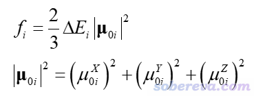
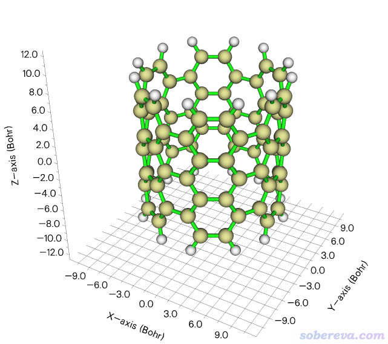
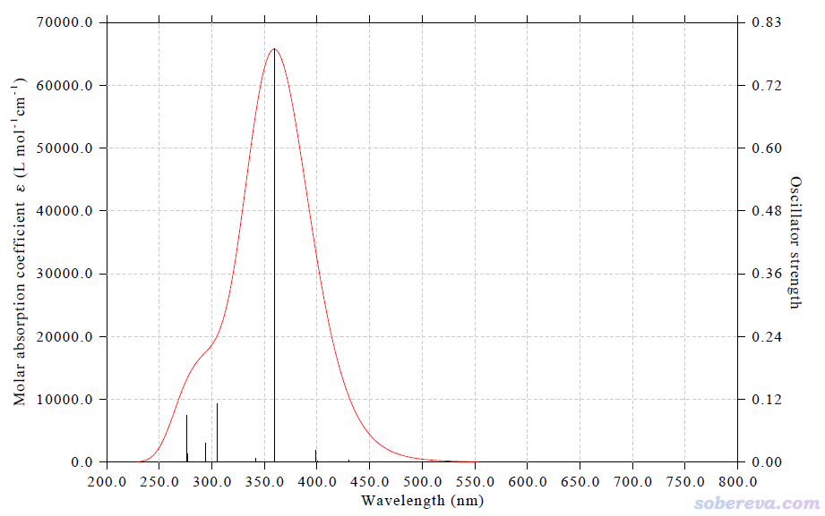
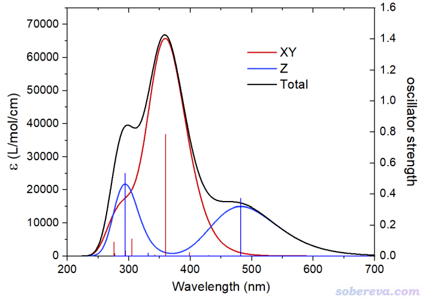

**使用Multiwfn计算特定方向的UV-Vis吸收光谱**

Simulating UV-Vis absorption spectrum in specific directions using Multiwfn

文/Sobereva@[北京科音](http://www.keinsci.com)

First release: 2022-Jul-8   Last update: 2024-May-14

## 0 前言

通过量子化学或第一性原理计算，得到理论UV-Vis光谱的原理在《使用Multiwfn绘制红外、拉曼、UV-Vis、ECD、VCD和ROA光谱图》（<http://sobereva.com/224>）里有专门的说明。UV-Vis光谱的光学吸收主要来自于入射的电磁波对应的震荡电场与体系的相互作用，使体系能从电子基态跃迁到激发态。通常模拟的理论UV-Vis光谱是假定物质与震荡电场的作用在各个方向都是均等的，但对于很多体系，单独考察其UV-Vis谱中不同笛卡尔分量的贡献是很有意义的，这使得我们可以更充分地了解光谱的本质、弄清楚不同波长的光学吸收到底来自于体系和什么方向的震荡电场的相互作用。对于排列有序的晶体，其光学吸收特征也和光的入射方向或偏振方向有关（见比如Acta Cryst., E70, o1090 (2014)），因此考察特定方向的UV-Vis谱也很有实际意义。

Multiwfn有强大灵活的绘制UV-Vis光谱的功能，见<http://sobereva.com/224>以及其中引用的其它博文的介绍。从2022-Jul-8更新的版本开始，Multiwfn支持了绘制用户指定方向的UV-Vis谱，这在程序中被称为directional UV-Vis spectrum。下面将会对这种光谱的原理做简要介绍，然后给出一个实际例子说明绘制操作和实际意义。如果你还不了解Multiwfn绘制常规UV-Vis谱的做法，请先阅读《使用Multiwfn绘制红外、拉曼、UV-Vis、ECD、VCD和ROA光谱图》（<http://sobereva.com/224>）。

Multiwfn可以在其主页<http://sobereve.com/multiwfn>免费下载，不了解此程序者建议看《Multiwfn FAQ》（<http://sobereva.com/452>）和《Multiwfn入门tips》（<http://sobereva.com/167>）。使用本文的方法绘制光谱若用于发表文章，请按《Multiwfn FAQ》里的说明进行恰当的引用。

## 1 原理

UV-Vis谱体现的基态向激发态i跃迁对应的强度（正比于吸收峰的积分面积）对应于振子强度f_i。下式的ΔE_i是激发能，μ_0i是跃迁偶极矩矢量

由上式可见，跃迁偶极矩的模的平方等于X、Y、Z三部分贡献之和。比如其中的X部分，和体系与X方向震荡的电场的相互作用相关。平时我们绘制的UV-Vis谱用的是上式定义的振子强度，X、Y、Z方向都考虑了进去，也因此得到的UV-Vis谱体现的是对各个方向入射强度相同的非偏振光的吸收。如果我们要考察体系对特定方向射入或者特定方向偏振的光的吸收，计算振子强度涉及的跃迁偶极矩的模方时就应当只考虑特定分量了。

例如，如果计算XY方向的UV-Vis吸收光谱，计算振子强度中的跃迁偶极矩的模方时就只考虑X和Y部分。这样的吸收光谱体现的是体系与XY平面上震荡的电场相互作用导致的吸收。由于电磁波的传播方向与电场变化方向是垂直的，因此也可以认为是体系对Z方向射入的非偏振光的吸收。再比如，如果计算Z方向的UV-Vis光谱，则跃迁偶极矩的模方就等于跃迁偶极矩Z分量的平方，这体现的是体系与Z方向震荡的电场相互作用导致的光学吸收，也可以说是体系对XY平面方向打来的Z方向偏振的光的吸收。XY方向的光谱和Z方向的光谱的累加，就是通常所绘制的各向同性的UV-Vis谱。

## 2 特定方向UV-Vis谱在Multiwfn中的绘制

Multiwfn绘制特定方向UV-Vis谱所用的输入文件和《使用Multiwfn绘制红外、拉曼、UV-Vis、ECD、VCD和ROA光谱图》（<http://sobereva.com/224>）里说的绘制普通UV-Vis谱基本相同，可以用Gaussian、ORCA、CP2K程序的激发态计算任务的输出文件作为输入文件。

绘制特定方向的UV-Vis谱的过程就是先载入输入文件，进入绘制光谱的主功能11，选择-3，然后选择绘制什么方向，可以选X、Y、Z、XY、XZ、YZ、自定义方向。其它的绘制操作、设置，和绘制普通UV-Vis谱完全相同。当前情况下Multiwfn不是直接读输入文件里的振子强度，而是读激发能和跃迁偶极矩矢量的X、Y、Z分量，然后根据你选的绘制的方向，在计算振子强度时只考虑跃迁偶极矩的特定成份。若选择自定义方向，如果输入比如(1,0,0)，就等同于选择X，如果比如输入(0,1,0)，就等同于选择Y，而如果输入比如(1,1,0)，由于它对应的归一化的矢量为（1/√2,1/√2,0），因此计算振子强度用的跃迁偶极矩的模方就等于(1/√2*μ_ij_x)^2+(1/√2*μ_ij_y)^2，这里μ_ij_x和μ_ij_y分别是跃迁偶极矩的X和Y分量，结果相当于选择X和选择Y时候的平均。

## 3 绘制实例

这一节，笔者用一个边缘用氢饱和的碳纳米管片段（也相当于碳纳米带）为例演示绘制特定方向的UV-Vis谱。此体系如下所示，管道方向精确冲着Z方向。

Multiwfn文件包里的examples\spectra\CNT66_TDDFT.out是Gaussian用TDDFT计算这个体系激发态的输出文件，用的是PBE0/6-31G*级别，算了100个态。结构之前用B3LYP/6-31G*级别对基态优化过。

我们先绘制XY方向的UV-Vis谱。启动Multiwfn，然后输入  
examples\spectra\CNT66_TDDFT.out  
11  //绘制光谱  
-3  //绘制特定方向的UV-Vis谱  
4  //XY方向  
0  //绘制光谱

现在光谱图就出来了，但会发现坐标轴的数值不太整齐，不太好看，因此点右键关闭图像，然后接着输入  
3  //修改横坐标  
200,800,50  //下限、上限、标签间隔  
4  //修改左侧纵坐标  
0,70000,10000  //下限、上限、标签间隔  
y  //按比例地调整右侧纵坐标

现在看到的图像，即XY方向的UV-Vis谱。如下所示

之后，再以上面相同方式绘制Z方向的UV-Vis谱，步骤同前，只不过选择方向的时候改为输入3。

为了便于将XY和Z方向的UV-Vis谱进行对比，前面绘制时都用菜单中的选项2将吸收曲线和离散竖线数据导出成文本文件。我已提供在了<http://sobereva.com/attach/648/file.rar>里，其中XY_curve.txt和Z_curve.txt分别是XY和Z方向的吸收曲线数据，XY_line.txt和Z_line.txt分别是XY和Z方向的离散竖线数据。将这些数据导入到Origin里，并合并到恰当的表格里。对吸收曲线数据表格再增加一列叫total的列，定义为XY和Z数据之和。最后，将曲线数据和离散竖线数据都以line方式来绘制，就可以得到下图。笔者怕有些Origin用得不熟的读者不知道怎么设置，遂把Origin 2021绘制下图的opju文件也提供在了file.rar里了。

上图的黑色曲线是常规的UV-Vis谱，XY和Z方向的谱分别用红色和蓝色所示。由上图可见，在360 nm左右的最强的吸收峰来自于XY平面上的震荡电场与体系的相互作用所致。X和Y方向的跃迁偶极矩分量的平方和越大，则吸收强度越大。而300 nm和480 nm左右的吸收则主要来自于Z方向（顺着纳米管方向）的震荡电场与体系的相互作用，也体现了只有这些波长的电子激发才有较大的Z方向的跃迁偶极矩。

通过上面的例子可见，对于各向异性特征显著的体系，通过Multiwfn绘制特定方向的UV-Vis谱明显有助于认识其吸收光谱的内在本质，因而鼓励大家在实际研究中恰当地使用，以增加讨论深度。
