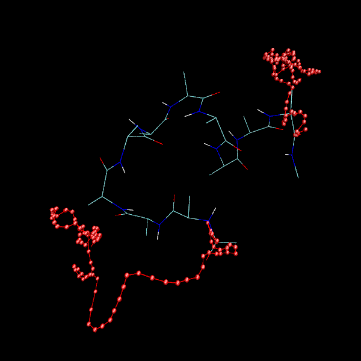
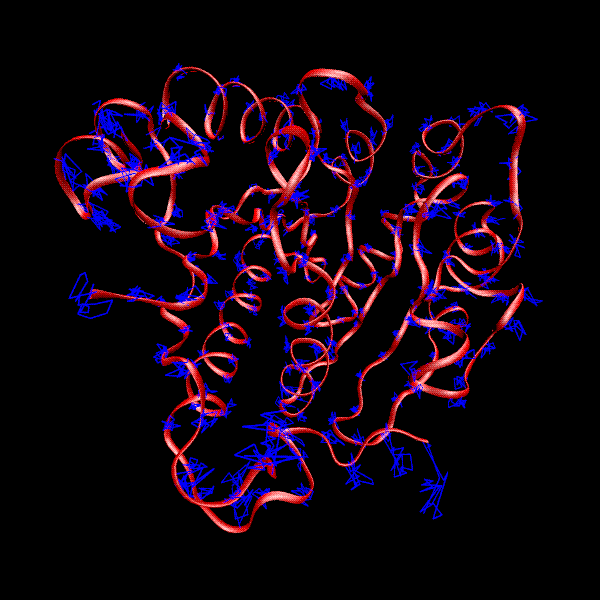

**显示粒子运动轨迹的VMD脚本**VMD script to display particle motion trajectories  
  
文/Sobereva@[北京科音](http://www.keinsci.com)   2010-Jun-29

  
  
经常需要通过将运动轨迹连线来描绘粒子的运动路径，此脚本可以实现这个目的  
  
proc showtrj {fps1 fps2 space selection} {  
 set selnow [atomselect top $selection frame $fps1]  
 set selnext [atomselect top $selection frame $fps1]  
 set num [$selnow num]  
 for {set fps $fps1} {$fps<$fps2} {incr fps $space} {  
 $selnow frame $fps  
 $selnext frame [expr $fps+$space]  
 $selnow update  
 $selnext update  
 for {set i 0} {$i<$num} {incr i 1} {  
 draw line [lindex [$selnow get {x y z}] $i] [lindex [$selnext get {x y z}] $i]  
 draw sphere [lindex [$selnext get {x y z}] $i] radius 0.12  
 }  
puts "Frame $fps done"  
 }}  
  
**使用方法：showtrj 最初帧 最末帧 帧数间隔 选择范围**  
  
下图是VMD自带的alanine轨迹的1至95帧中两末端的C的轨迹，首先运行draw color red设定轨迹为红色（默认为蓝色），然后执行showtrj 1 95 1 "index 1 61" 即可。圆点是每一帧两原子的位置，图中的结构是第95帧的情况。可见alanin最初的alpha螺旋结构发生了很大变化，两端最后缩到一起，成了C形构象。  
  

  
  
下图是某蛋白平衡状态1ns内的CA原子的运动轨迹。不想绘制显示每帧的圆球只需将脚本中draw sphere [lindex [$selnext get {x y z}] $i] radius 0.12这句去掉。由于轨迹帧数较多(1000帧)，每帧都绘制一次不仅速度很慢，而且线条太密，所以改成每50帧绘制一次。运行showtrj 0 1000 50 "name CA"得到下图  
  

