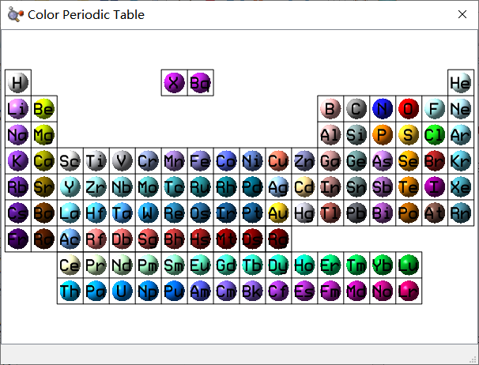
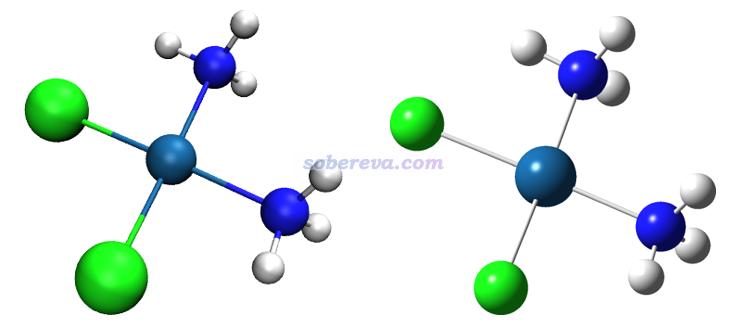
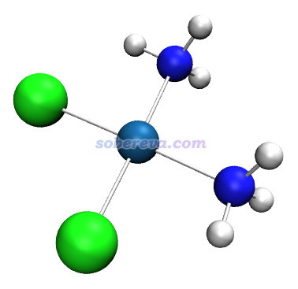

**在VMD中使用GaussView的元素着色的方法**

Using GaussView element coloring scheme in VMD

文/Sobereva@[北京科音](http://www.keinsci.com)   2022-Sep-16

GaussView的元素配色总体上来说不错，而且对所有元素都定义了唯一的颜色，在File - Preference - Colors - Element Colors中可以看到所有元素的颜色，如下所示

VMD是免费、灵活、强大而且超级流行的化学体系可视化工具。在VMD里也可以按照元素着色，见《在VMD程序里对不同元素的原子用不同颜色显示的方法》（<http://sobereva.com/624>）。然而，至少对于笔者撰文时的最新的正式版1.9.3版来说，VMD自带的元素着色定义很少，对绝大多数元素都是统一用的褐色，导致很多情况下没法区分不同元素，而且颜色也不美观。这里介绍在VMD里使用GaussView里元素颜色定义的做法。

从<http://sobereva.com/attach/652/gview_color.tcl>下载gview_color.tcl文件，将之放到VMD目录下（即VMD启动后在文本窗口里输入pwd命令后显示的目录），然后在VMD的vmd.rc文件末尾加入一行proc gview {} {source gview_color.tcl}。如果你不了解vmd.rc文件的话，看《VMD初始化文件(vmd.rc)我的推荐设置》（<http://sobereva.com/545>）。

启动VMD后，在文本窗口里输入gview，就可以把默认的元素着色方案替换成和GaussView相同的了。之后载入个含有元素信息的结构文件（比如pdb、xyz等），然后在Graphics - Representation里把Coloring Method设为Element即可看到按元素着色的效果。如果想和GaussView显示的图像特征尽可能接近，将Drawing Method设为CPK，Bond Radius设为0.2，Material设为AOShiny。对顺铂体系显示效果如下，左边是VMD的，右边是GaussView的

上图还可以看到在键的着色方面有差异，VMD的键的两边的颜色分别对应两个原子的，而GaussView都是白色的。如果想让VMD在这点和GaussView统一，可以把当前的Representation里的Bond Radius设为0使得键不显示，然后再建立一个Representation，用CPK，把Sphere Scale设0，Bond Radius设0.15，Coloring Method选ColorID并指定为白色，之后效果如下所示，可见和GaussView显示的很接近了

再把原子半径、光源方向、材质微调一下，就更像GaussView的效果了。不过，GaussView里对多重键的显示效果是VMD里怎么设都模仿不来的。
