**2024-Dec-10注**：今天我从网友处听闻名字里有一个字拼音是ye的服务器经销商在宣传信息中称我的这个服务器是从他那里买的，并以此作为宣传噱头，我在此明确表示我这个服务器的经销商的名字里没有哪个字拼音是ye！我对于这种厚脸皮蹭我文章知名度的经销商表示谴责和鄙视！

**淘宝上购买的双路EPYC 7R32 96核服务器的使用感受和杂谈**

文/Sobereva@[北京科音](http://www.keinsci.com)  2022-Oct-13

## 1 前言

五年前我曾写过《淘宝店购买双路2696v3服务器的过程、使用感受和杂谈》（<http://bbs.keinsci.com/thread-6310-1-1.html>），当时购买的双路XEON 2696v3 36核机子笔者一直在用，但在如今性能已经比较过时了，特别是跑大体系长时间的AIMD很吃力。于是在2022年9月末笔者入了台96核（物理核心）的双路AMD EPYC 7R32服务器，性价比极高，在本文就谈谈使用感受和一些相关经验。并且借本文的机会，在文末再次劝读者尽量不买“大品牌”服务器。

## 2 配置和价格

我在大约近一年的《计算化学购机配置推荐》（<http://sobereva.com/444>）里一直推荐的顶级双路服务器配置是双路XEON 8375C，很多人看了这博文后也都买了并感到满意。本来笔者原本也打算入这个配置，但近期8375C涨价不少（也许和我这博文的推荐有一定关系，导致8375C卖得快），在高性能CPU范畴内其性价比已经不是首选。笔者在反复谨慎对比和斟酌后，最终决定入比较冷门的7R32。

EPYC 7R32的知名度不高，这是给亚马逊特供的CPU。属于EPYC二代（Roma核心），有48个物理核心，96个逻辑核心，支持八通道DDR4-3200。基础频率为2.8GHz，是EPYC二代中>=48核产品中基础频率最高的。关HT时全核满载时我实测稳定在3.3GHz。其功耗是EPYC二代中最高的，TDP为280W。

在淘宝上有个北京的老字号卖组装服务器的淘宝店有现成的双路7R32服务器，基础配置原价22000，笔者做了如下改动：  
(1)把标配的单条DDR4-2666 16GB内存改成了16条32GB镁光DDR4-2666，加了8800。用16条是为了用满两个CPU的总共16条内存通道，配较大的512GB内存是考虑到以后跑DLPNO-CCSD(T)等耗内存高任务的时候能用尽可能多的核并行。7R32最高支持DDR4-3200，但标配内存改成16条32GB DDR4-3200则要加12600，相当于DDR4-2666提升到DDR4-3200需多花3800元，笔者认为不值得，而且对于笔者常用的计算程序和任务来说DDR4-2666的内存带宽大多数时候不至于构成瓶颈。  
(2)硬盘从标配的三星256GB M.2固态换成了三星PM9A1 2TB M.2（PCI-E 4.0）固态，加了1300。笔者把原先笔记本淘汰下来的影驰500GB SATA3固态用来装系统和程序，而PM9A1纯粹用来当读写临时文件的苦力盘，写入量榨干了也没关系。选择PM9A1是因为其读写速度是目前市售的固态硬盘中最快之一，选择较大的2TB是考虑到后HF任务相当耗硬盘，特别是并行核数很多时用ORCA跑DLPNO-CCSD(T)、DLPNO-STEOM-CCSD的情况。爱折腾的话也可以考虑淘宝上U.2的Intel、三星等牌子的工包或拆机的企业级固态硬盘，4TB的都不太贵，写入量上限比消费级的大得多，不过水有点深。另外，如果读者需要储存大量数据，以及许多人共用，建议再入个希捷8TB企业级机械硬盘，1250元（笔者是把以前2*2696v3机子上的希捷4TB企业级机械硬盘挪到了新机子上）。  
(3)电源标配的是廉价的长城1300W，长城电源由于其廉价也是很多淘宝上服务器商家的标配。虽然也不能把诸如此类低端牌子的所有型号一棒子打死（有些型号素质还不错，用起来也没啥问题），但笔者始终对这些牌子持鄙夷态度，而且在电源上图便宜是很不明智的（电源是服务器所有部件里最容易坏的之一），所以换成了海韵FOCUS GX1000（额定1000W），为此多加了500元。海韵是口碑最好的电源品牌之一，笔者之前双路2696v3原配的台达650W电源用了几年坏掉后也是替换的GX1000，感觉良好。而且GX1000还有个好处是长度很短（14cm），这使得在机箱下方能够有空间加装风扇，见后文。额定1000W的电源对于双路7R32绰绰有余，绝对没必要用1300W的浪费钱。值得一提，如果读者之后有加装高端GPU诸如RTX4090做GPU加速计算的可能，可以用海韵或振华1600W的电源。

最终，笔者买的机子共32600元，配置如下，所有东西都是全新的：  
CPU：2*EPYC 7R32（96核192线程，满载3.3 GHz）  
主板：技嘉MZ72-HB0（支持1~3代EPYC，官方支持280W CPU）  
显卡：主板集显  
内存：16*32GB=512GB 镁光DDR4-2666 ECC REG  
硬盘：三星PM9A1 2TB  
电源：海韵FOCUS GX1000  
机箱：追风者614PC  
散热器：见后文  
声卡：无（主板也没有集成，笔者也不需要）

关于技嘉MZ72-HB0主板的介绍，可以参看官网介绍<https://www.gigabyte.com/us/Enterprise/Server-Motherboard/MZ72-HB0-rev-30-40>和测评<https://www.anandtech.com/show/16825/the-gigabyte-mz72hb0-motherboard-review-dual-socket-3rd-gen-epyc>。

这个商家挺不错，整个购买过程中和客服交流顺利，各种问题都在15秒内回复，水平也比较专业，也没有乱推荐、乱出主意。整套配置报价相当良心，淘宝上应该没有明显能做到价格更低的了。敲定配置和价格后，当即笔者就用支付宝付款。上述价格已经包含了北京地区送货上门费用。然后过了两天，机子就送到家了。

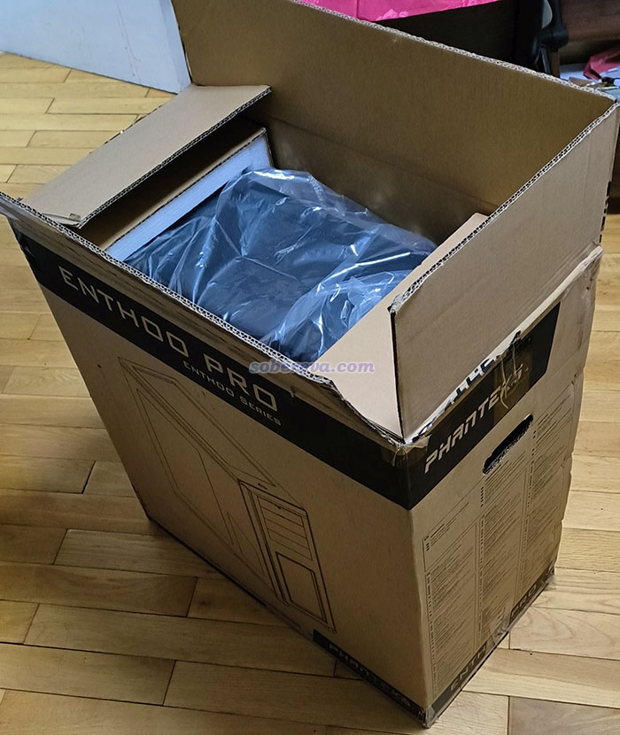

顺带一提，为了避免牵扯利益关系，读者请勿向笔者询问卖家信息，感兴趣的读者可以根据本文的配置自行在淘宝上搜合适的卖家。

## 3 机子照片

下图是机子照片，风扇吹风方向如红色箭头所示。商家配了5个利民TL-C14X 14cm机箱风扇，单价120块。商家配的CPU散热器是猫头鹰NH-U12S TR4-SP3（5热管散热器，原配1个猫头鹰NF-F12 12cm风扇，又再加装了一个NF-F12风扇），这样一个散热器淘宝上卖600多块。商家在散热上很重视而且挺舍得的，在散热上的成本就差不多2000块钱了。这家淘宝店值得好评，配件完全属实，没有任何猫腻，而且如下图可见，机子装得不错，理线弄得都很好。

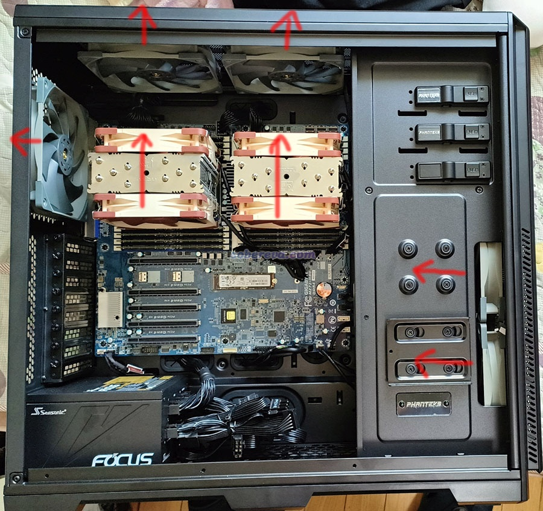

可见同一个散热器的两个风扇通过猫头鹰的Y型线转成一个4pin。此主板有两个4pin CPU风扇口。

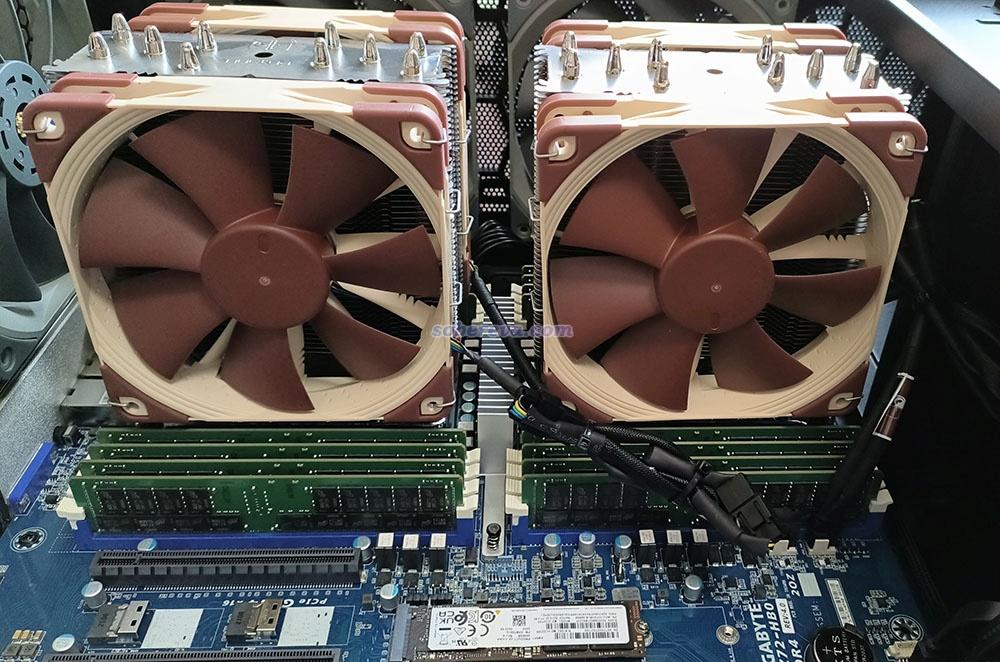

追风者614PC是个很好的机箱，设计很科学，上下前后都能装机箱风扇，背部走线的地方还自带了粘扣，给理线带来了极大方便。

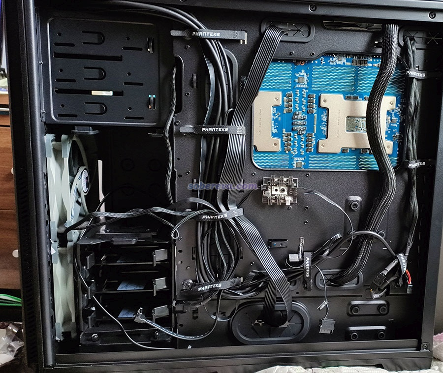

在机箱前后走线的窟窿的地方有橡胶片使线材固定，是个很好的设计

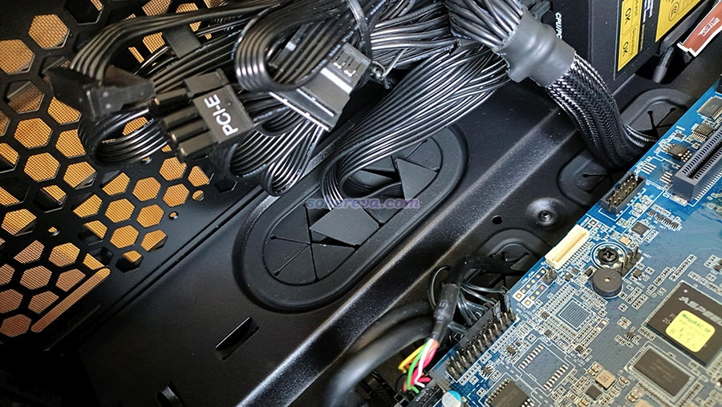

机箱前面没啥特殊的，四个USB，一个耳机口一个Mic，一个硬启按钮。机箱上面是能发光的开机键，旁边是个小的硬盘读写指示灯。下图中机箱上的金属logo和文字是商家自己粘的。

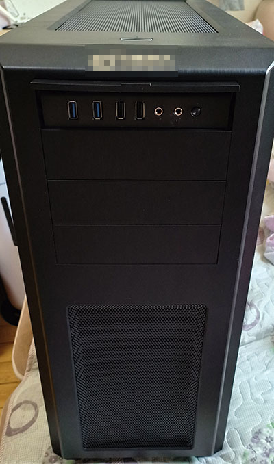

机箱前面板可以用力拽开

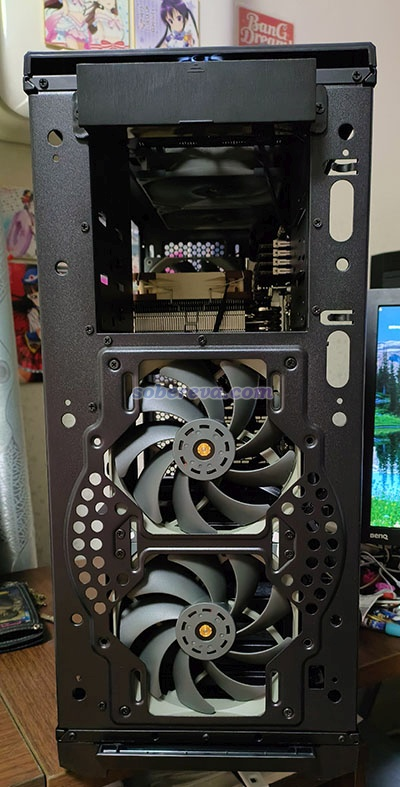

拽开前面板之后就可以把上面掀开

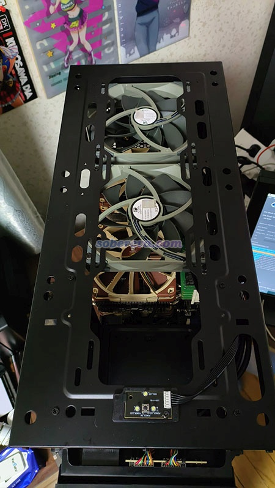

机箱下面前后有两个滤网，可以方便地抽出来。如果在下面加装风扇吸风，时间长了积了灰时就可以方便地抽出滤网清洁。

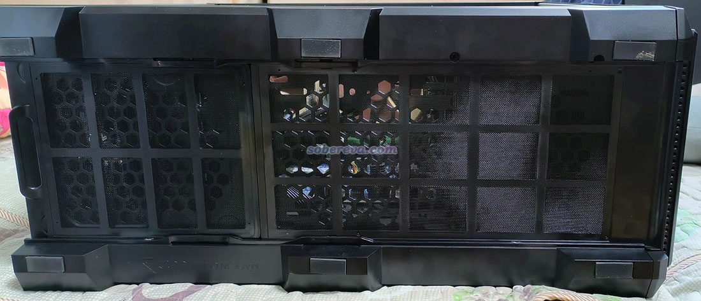

机箱背部，一个串口，两个USB，两个LAN口（技嘉MZ72-HB0提供的是俩万兆网口，是个亮点），一个管理LAN口，一个VGA口，还有个带LED的ID button。如果你不额外加装GPU，显示器又没VGA口，记得买个转换器。

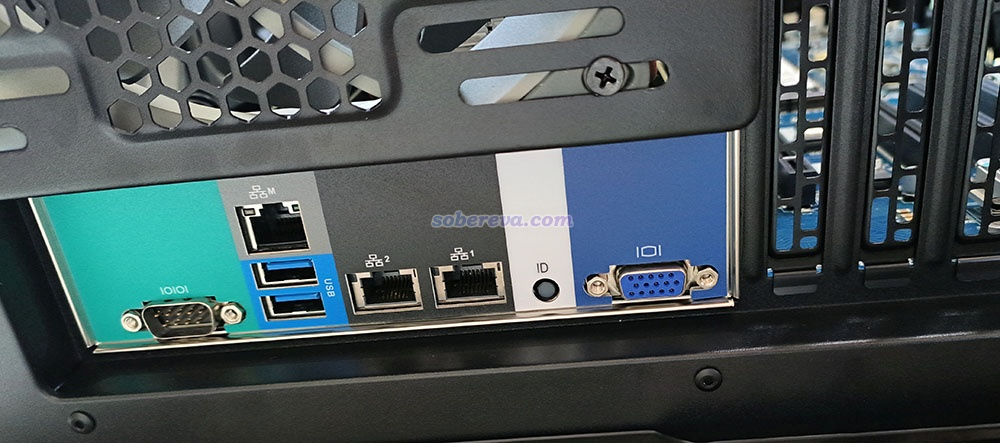

PM9A1固态硬盘。此硬盘较早的批次（GXA7301Q固件）有掉速问题，被一些人所顾忌，而如今较新的，包括我这个GXB7601Q，都没这个问题了。注意MZ72-HB0只有一个M.2口，要是有俩就更好了。

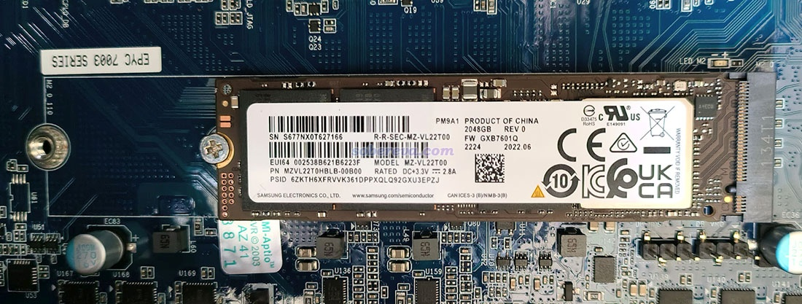

内存

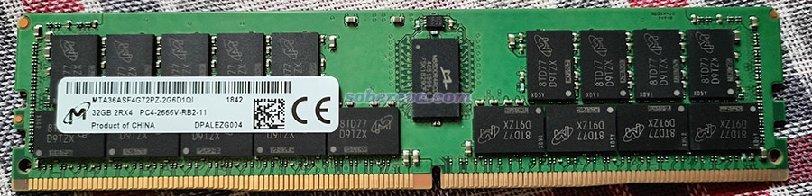

这台机子相当沉，是一般女生搬不动的程度，比我以前用先马泰坦机箱的双路2696v3机子至少多重1/3。主要应该是追风者614PC这机箱比先马泰坦更沉的缘故，高度略微更高，长度也明显长一截。

## 4 散热、噪音、功耗

7R32作为大功率CPU，大家必然十分关心发热以及机子噪音问题。在环境温度约27度时，AIDA64压力测试全核满载15分钟后，CPU温度稳定在73度。温度确实控制得很理想，但是噪音令我很不满意。由于这机子我是放在距离自己一米远的地方用，显然声音不能太大。买之前我特意问了商家，商家说这个机子噪音不大，但是插上电刚开机时感觉声音相当大。进系统后风扇转速自动降低了之后还行，但是用AIDA64的压力测试功能全核满载运行时，声音又是相当的大，不是能长时间忍受的程度。为了尽可能降低噪音，同时又不显著令散热效果降低，我花了很大精力鼓捣。

首先考虑降低机箱风扇的噪音。原配的5个利民TL-C14X风扇高转速时噪音颇大（标称最高转速为1800rpm，全核满载期间会达到1650rpm），我发现其实用5个完全是多余的。如上一节所示的CPU风扇吹风方向可见，风是从下往上吹的，给机箱前面板加风扇没必要（本身风还会被硬盘架子挡一部分）。而且机箱后侧风扇也完全多余，满载时吹出的风都是凉的。于是我就把前面板两个风扇和后侧一个风扇都摘了，果然满载时温度几乎没变，而噪音有明显减小。我又发现当前用的海韵GX1000电源比较短，机箱下方有装14cm风扇的空间，于是就把摘下来的一个风扇装到了下面往上吹风，满载温度平均降低了1.5度（效果不明显，可有可无）。此时的风向如下所示

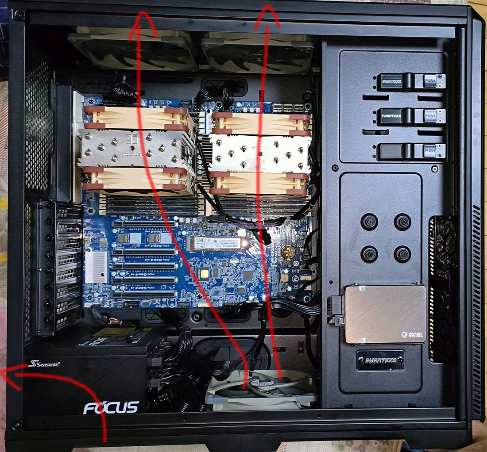

我认为像这样从下向上走风比起从前往后走风好得多，此时两个CPU的温度是基本一致的，不像从前往后走风会导致后面那个CPU温度比前面的明显更高。而且热风从上面出，满载运算时在冬天可以把手放在机箱上方暖手（亲测有效）。不过机箱上面就不能放东西了。

如上处理后，满载运行声音依然不小，毕竟现在还有的4个猫头鹰NF-F12风扇和3个利民TL-C14X风扇。我原本打算买到闲鱼上入手猫头鹰的减速线NA-RC7或调速器NA-FC1降低风扇转速，后来发现在技嘉MZ72-HB0主板的通过网页浏览器访问的MegaRAC SP-X网络管理界面里可以细腻地根据CPU温度控制风扇转速百分比，彻底解决了噪音大的问题。

具体来说，把网线插到服务器的管理LAN口上，进BIOS后，进入Server Mgmt - BMC network configuration，恰当设置IP地址，比如我设Static地址，并指定地址为192.168.5.100。之后保存BIOS设置并重启。之后在同一网段的另外的机子的网页浏览器里输入192.168.5.100，就可以进入服务器的管理界面了。登录的用户名是admin，密码在主板的贴纸上，如下所示，密码是3/A/后面的字符串，即LH4PA800228。

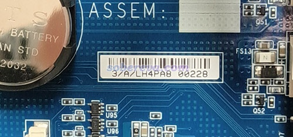

登录后在界面左侧选Settings，再选Fan Profile，就可以添加风扇运转策略，比如我增加了balance、silent、ultra_silent三种，当前启用的是ultra_silent，如下所示

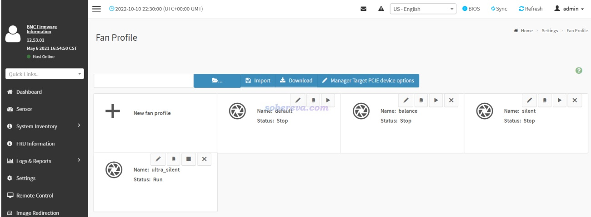

我是下图这样定义ultra_silent策略的，能令室温下CPU满载温度维持在不太高的情况下用尽可能低的转速，读者可以效仿。如图所示，传感器数据定义为两个CPU的温度，对主板所有风扇口（两个CPU风扇口和4个机箱风扇口）控制转速。由下图右上角的示意图可见，温度低于30度时风扇20%转速，30~77度之间转速从20%缓慢线性提升至40%。超过77度就算稍高了，因此在77~90度之间转速从40%较快地变化到90%。超过95度就危险了，达到CPU可承受的上限，所以>=95度时就令风扇全力全开了。

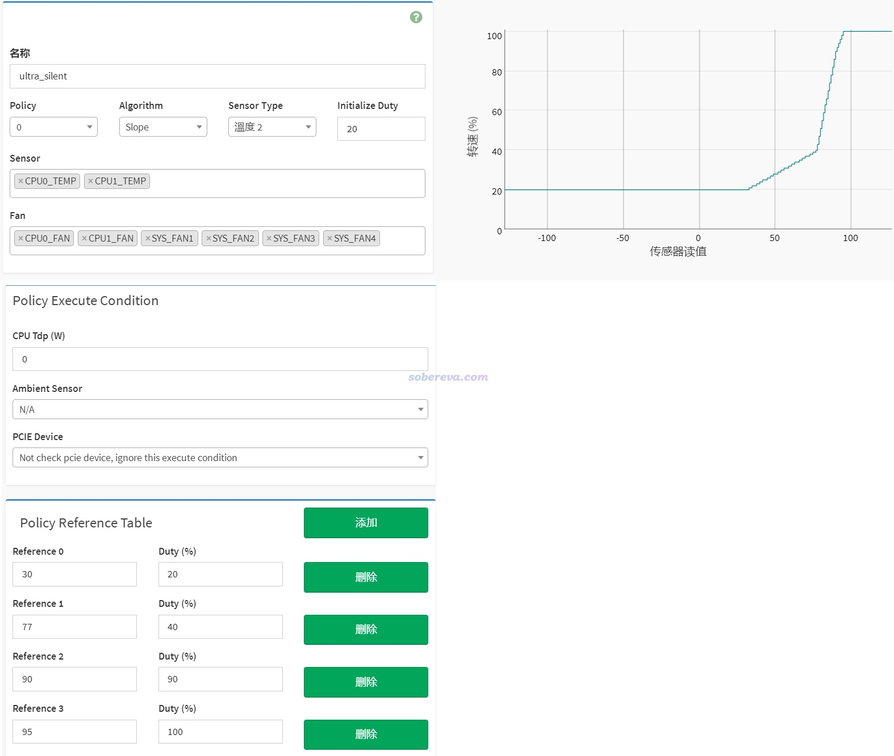

值得一提的是技嘉MZ72-HB0的网络管理界面做得相当不错，功能和设置很多，所有传感器的信息在Sensor页面里都能一览无余地看到，并且还提供随时间变化的动态变化图。例如从下图可见CPU温度、风扇转速、电压等的变化情况。

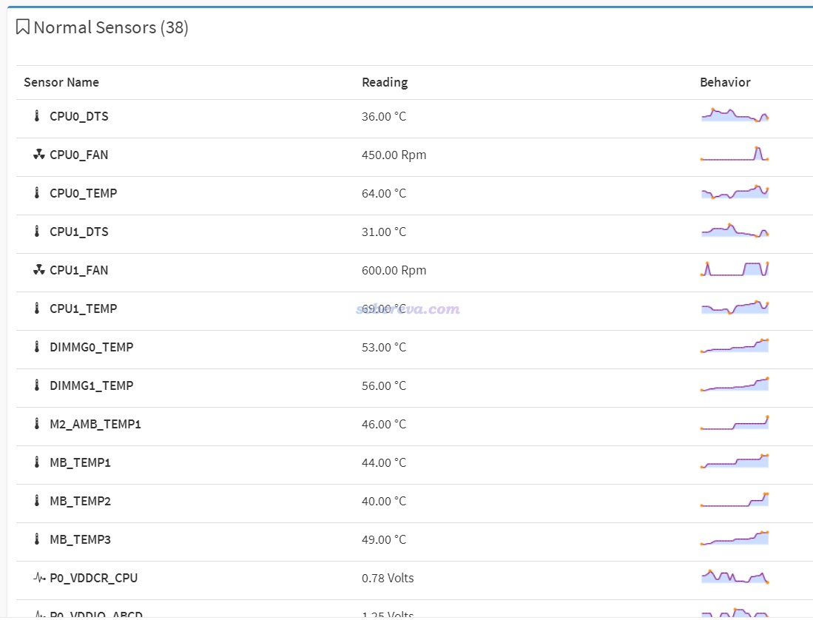

经过如上调教后，环境温度为27度时，全核满载温度在78~80度波动，期间猫头鹰风扇在750~900rpm范围波动，机箱风扇转速维持在1200rpm。此时的噪音很令我满意了，放在距离我一米远的地方运行不觉得吵，噪音甚至比我在<http://bbs.keinsci.com/thread-6310-1-1.html>里介绍的那台双路2696v3的机子还小一点点。7R32这机子刚拿来的状态下距离一米处满载34分贝，经过调教后只有20分贝出头一丁点了（我手头没专门的噪音测试仪，只是用手机app测了一下，所以绝对值肯定不准，但相对值能说明问题）。另外，调教后这个机子在待机状态下相当安静，CPU温度维持在30度出头，猫头鹰风扇转速只有300rpm，机箱风扇450rpm。

如果满载时还想更静音甚至还有余地，即允许让CPU满载温度更高（如达到85度）换来更低的风扇转速。还可以在机箱盖里面贴一层吸音棉（淘宝有卖。一些以静音为卖点的机箱也是这样做的）。PS：按上述处理后，敞着机箱盖运行不会令温度有丝毫降低。网上有人说在机箱盖上贴吸音棉会影响散热，起码这对于当前机子不适用，因为此机子满载时两侧的机箱盖并无明显温热感，对散热无贡献，只有机箱上头的出风处的金属网会被热风吹得很热。

之前有人在计算化学公社论坛里专门讨论主板MOS管散热问题，有的上水冷有的用小风扇吹，而当前这机子完全不需要顾虑这个，不需要任何额外的辅助散热就能在室温下长期稳定运行。

关于风扇再多说几句。在机箱风扇方面，如前所述，这机子的14 cm机箱风扇有上面两个、下面一个就够，而且机箱风扇对于CPU温度影响很有限，故机箱风扇没必要用利民TL-C14X那么贵的，用诸如60块钱的ARCTIC F14 PWM PST就行了，价格只有TL-C14X的一半。虽然ARCTIC F14 PWM PST的最大转速和风量都更小，但即便如此也绰绰有余，都完全用不着满速运行。在CPU风扇方面，根据网上的一些测试，对于满载的CPU，NF-U12S用俩风扇比单风扇温度也就低三度左右，因此如果你对噪音敏感的话，用原配的一个风扇足矣，而且还少花钱。顺带一提，NF-U12S原配的NF-F12在12 cm风扇范畴内已经几乎是最静音的了，没有比之明显更好的选择。猫头鹰的NF-U14S散热器也有适合EPYC的版本NF-U14S TR4-SP3，搭配的是单个14 cm风扇NF-A15，在同样散热能力下转速能比NF-F12更低因而更静音，但以当前主板俩CPU的间距来说，装俩NF-U14S是不可能的。

这双路7R32和双路2696v3目前我并排放置使用，之间相距只有两厘米，如下所示。两台机子同时满载时我都感觉噪音不大，所以噪音问题完全不必担心。两台机子挨着放也完全没有相互影响散热。

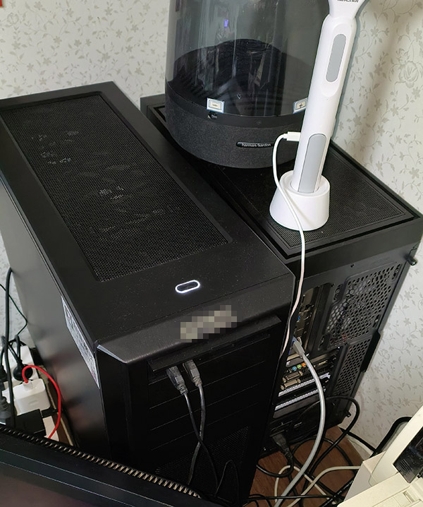

输入功耗方面，根据计量插座显示，关机状态13瓦，win 11、Rocky Linux 9.0下待机80~90瓦，AIDA64压力测试（stress CPU/FPU/cache/system memory都选上）时是640W左右，如下所示。考虑到功率转换效率，输出功率此时也就不到580W，显然电源用额定1000W的GX1000绰绰有余。用较好牌子的额定850W的电源也够。这机子的功耗比起以前我帖子里说的双路2696v3满载时的输入功率455W大了近200W。按照北京地区居民电价，满载一天不到8块钱。

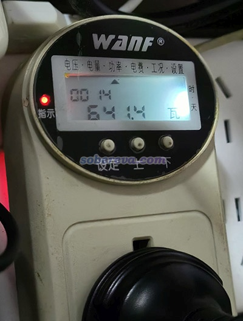

## 5 软件安装和运行

我的研究做的计算都是在Linux下跑的，Linux系统肯定是我自己根据实际需要装的，不打算让商家装，但毕竟商家测试机子也得有个系统。商家问我装什么系统时，就姑且先让装了Win11，也便于我跑Cinebench R23、AIDA64、CrystalDiskMark等一些Windows下的测试程序。

CentOS是我以前一直推崇的操作系统，后来变成stream形式了，失去了原有的灵魂，后来我就转向了以鲁棒为重的CentOS正统的继任者Rocky Linux，和CentOS的界面和体验完全没有区别。Rocky Linux我装的是最新的9.0，去<https://rockylinux.org>下载DVD iso，然后用rufus制作安装U盘（顺带一提，别用UltraISO制作，否则没法顺利安装），插上服务器并启动就可以照常顺利安装了。作为计算用服务器，建议选成Workstation，然后把GNOME Applications、Legacy UNIX Compatibility、Developement Tools、System Tools、Graphical Administration Tools都选上。前面说了，我给这机子添了个以前留下的500GB固态硬盘，Rocky Linux就装在了这里。机子是我私用的，硬盘配置方面给必须设的UEFI分区设了200MB，其它空间就都挂载到了/，用ext4文件系统，由于内存已经很大了就没设swap分区。

由于之前PM9A1 2TB上商家已经装了Win11，所以Rocky Linux 9装完后再重启就可以看到启动菜单，可以选进入哪个系统。由于Windows对我没用，所以后来就把PM9A1这个硬盘格掉了，把Gaussian、PSI4等程序的临时文件目录都设在了这个硬盘上。

Rocky Linux 9.0和当前这机子完全兼容，安装和使用过程完全没有出现任何问题。Multiwfn 3.8(dev)、Gaussian 16、ORCA 5.0.3、CP2K 2022.1、PSI4 1.6.1、xtb 6.5.1，以及OpenMPI 4.1.1和FFTW 3.3.8在这个机子上安装/编译和使用都非常顺利。需要注意的是系统没有自动装gfortran，编译OpenMPI之前记得用yum装上gfortran，否则之后ORCA没法正常并行。原本要装的是经典的GROMACS 2018.8，可能是由于Rocky Linux 9.0自带的gcc 11.2.1与老版本GROMACS语法兼容性的缘故编译失败，因此就装了目前最新的2022.3，顺利安装，而且也正确识别出了AVX2。

肯定有人顾虑用AMD CPU的兼容性问题，至少安装和使用上述程序时我没碰到任何兼容性问题。安装过程严格按照这些文章所述进行：《Gaussian的安装方法及运行时的相关问题》（<http://sobereva.com/439>）、《量子化学程序ORCA的安装方法》（<http://sobereva.com/451>）、《CP2K第一性原理程序在CentOS中的简易安装方法》（<http://sobereva.com/586>）、《GROMACS的安装方法（含全程视频演示）》（<http://sobereva.com/457>）。

此机子运行十分稳定，已经用了十几天，没任何问题。最长连续计算是用CP2K满载跑AIMD跑两天，毫无问题。

## 6 性能测试

在Win11下用Cinebench R23测试，结果如下。在双路2696v3上得分是多核23391，单核745，可见双路7R32这机子理论性能约为其3.5倍。当然，受制于实际计算程序的并行效率等原因，在大多数量子化学、第一性原理程序上比2*2696v3的优势不会显著到这种程度。

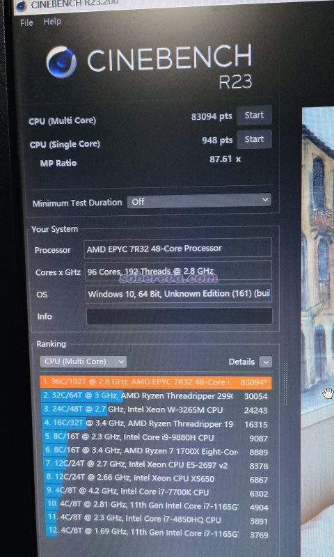

我在网上看到的双路8375C的R23多核得分是72071，可见2*7R32虽然目前比2*8375C明显更便宜，全核性能却还更好（7R32单核性能会吃亏一些，但毕竟96核对64核，优势还是明显的）。不过考虑到实际量子化学、第一性原理程序的常规任务的并行效率大多达不到R23的程度，实际计算中比2*8375C的优势不会多明显。

也测了一下PM9A1在这机子上的表现，如下所示，发挥出了应有的水准，读写速度十分理想

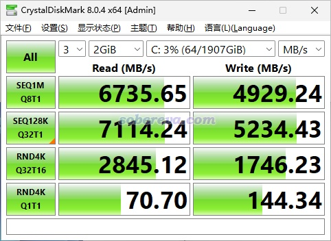

下面是一些量子化学和第一性原理程序的性能测试。我发现如果开着HT，满载频率是3.0 GHz左右，关了之后可稳定在3.3 GHz。在《正确认识超线程(HT)技术对计算化学运算的影响》（<http://sobereva.com/392>）里我说过，计算用的核数不应超过物理核心数，因此HT是摆设。虽然一般没必要刻意关，但对于7R32，不关的话满载频率会降低1/10而有损性能，所以下面的测试若未注明我都是关了HT测的，平时也都关了HT用。关HT的方法是：进入BIOS，选AMD CBS - CPU Common Options - Performance - CCD/Core/Thread Enablement，选Accept，把SMT Control设Disable。

下面是Gaussian 16 C.02 AVX2版测试。使用Gaussian自带的test0397，是化学组成为H90C54N6O18共168原子的普通有机体系，关键词设为b3lyp/def2svp force scf=novaracc g09default。在其他人的《g16在8375C和7T83的表现小测评》（<http://bbs.keinsci.com/thread-28607-1-1.html>）里使用的也是同样的测试任务，大家可以对照性能。我的测试结果如下，测试时是用%nproc设的并行核数：  
2*2696v3：8m4s(484s)  
2*7R32用48核：3m40s(220s) 是2*2696v3的2.2x  
2*7R32用64核：3m12s(192s)  
2*7R32用96核：2m46s(166s) 是2*2696v3的2.9x  
2*7R32用96核开HT：3m7s(187s)  
 把基组改为更大的def2-TZVP，结果为：  
2*2696v3：78m25s(4705s)  
2*7R32用48核：31m23s(1883s) 是2*2696v3的2.5x  
2*7R32用64核：25m52s(1552s)  
2*7R32用96核：22m30s(1350s) 是2*2696v3的3.5x  
2*7R32用96核开HT：23m11s(1391s)

可见，在大基组时才能把7R32相对于2696v3的优势展现得更充分。也可以明显看出，96核只跑一个任务很亏，同时跑两个划算得多。也要注意提交方式的问题。比如对一个H22B18C4Co1共45个原子的团簇体系在B3LYP/def2-TZVP下算单点，几种计算方式的耗时如下：  
2*7R32同时跑两个48核任务，靠%cpu=0-47和%cpu=48-95分别绑在两个不同CPU上：442s  
2*7R32同时跑两个48核任务，用%nproc=48：484s  
2*7R32跑一个48核任务，用%nproc=48：430s  
可见2*7R32这机子同时跑俩48核任务时应当记得绑定避免性能损失，但即便如此也没只跑一个48核任务快。原理见《NUMA策略对Gaussian运算速度影响的小研究》（<http://bbs.keinsci.com/thread-19773-1-1.html>）。

下面是ORCA 5.0.3的测试，计算的是《使用Molclus结合xtb做的动力学模拟对瑞德西韦(Remdesivir)做构象搜索》（<http://bbs.keinsci.com/thread-16255-1-1.html>）一文里研究的瑞德西韦，关键词用比较贴地气的wB97M-V/def2-TZVP RIJCOSX strongSCF。  
2*2696v3：483s  
2*7R32用48核：241s 是2*2696v3的2.0x  
2*7R32用96核：174.6s 是2*2696v3的2.8x  
ORCA的这种比较典型的任务表现的并行效率不及G16用大基组做DFT时。所以，2*7R32机子上也是同时跑两个或多个任务更划算，此时也要注意绑定的问题，做法见《通过设置CPU内核绑定降低ORCA同时做多任务的耗时》（<http://sobereva.com/553>）。

下面是CP2K 2022.1的测试。算的是SiO2超胞，共576原子，使用常用的PBE结合较大的TZV2P-MOLOPT-GTH基组，开OT算单点。输入文件见此：<http://sobereva.com/attach/653/SiO2.inp>。  
2*2696v3：平均SCF每轮14s，共493s  
2*7R32只用48核：平均SCF每轮6.4s，共225s  
2*7R32只用64核：平均SCF每轮5.1s，共180s  
2*7R32只用81核：平均SCF每轮4.9s，共174s，是2*2696v3的2.8x  
我用全部96核时，SCF每轮速度比用81核时没可查觉的优势，而且偶然性地个别SCF步的耗时会最多增加到14s，导致总耗时还更高，原因不明（也许是MPI的问题，也许是内存带宽用满的问题），因此跑单个任务的话用81核比较保险。考虑到超过48核后性能提升就很不显著了，为了最有效利用2*7R32计算能力，我建议同时跑两个48核CP2K任务为宜。记得一定要分别绑定在两个CPU上跑。如果直接mpirun -np 48 cp2k.popt提交两个任务，SCF每轮的速度很不稳定（暗示可能内存访问方面打架），平均每轮9点几秒，最终351秒跑完。如果提交两个的时候分别绑定在两个CPU上，每轮SCF稳定在大约8.1秒，最终288s跑完。绑定方法见前述的《通过设置CPU内核绑定降低ORCA同时做多任务的耗时》，也是mpirun结合-rf实现。

我还对比了CP2K用杂化泛函PBE0结合TZVP-GTH计算含64个水的水合电子体系单点的速度，2*7R32能达到2*2696v3的三点几倍，比起纯泛函计算时性能优势明显得多。

## 7 总结

本文介绍了笔者近期从淘宝上网购的性价比极高的适合计算化学的双路EPYC 7R32服务器，对于量子化学和第一性原理计算都是十分适合的。对于内存需求量不很大的情况，16条16GB就够，此时远不到3万就能买一台96个物理核心而且主频中等偏上的服务器，可谓超值！对于笔者撰文时的情况，双路7R32是组建高性能CPU计算服务器的几乎最理想选择。但我估计7R32的货源不多，可能本文发布之后不久就卖光了，或者涨价。这令我想起当年我的《淘宝店购买双路2696v3服务器的过程、使用感受和杂谈》一文发布后，有好一阵子2696v3还涨价了很多，没准是那篇文章明显促进了2696v3的销量。本文的这些讨论不限于7R32，对于读者购买和使用其它计算服务器也是有参考价值的。在未来购买什么配置合适可以看隔一段时间就会更新一次的《计算化学购机配置推荐》（<http://sobereva.com/444>）。

## 附：再次劝读者尽量不要花冤枉钱买“大品牌”服务器

再次强调，如果能不买所谓的大品牌服务器（我就不点名了），就别买那些牌子！我在<http://sobereva.com/444>里已经非常非常非常着重强调了这点了。跟我这3万块钱的2*7R32的机子性能相当的配置，那些“大品牌”卖到十几万都极其正常（例：<http://bbs.keinsci.com/thread-32672-1-1.html>），报价可谓离谱至极，而且这不是极少数情况而是极多数情况。3万块钱从“大品牌”那里买只能买个鸡肋，也就是“垃圾佬”服务器的性能水平。还有人觉得买那些“大品牌”是为了售后完善，难道再好的售后值这机子N倍的价钱？前述我的2*2696v3的购机贴里就已经充分体现了在淘宝上靠谱的卖家那里买机子根本就没什么风险，这次购机再次充分体现这一点。店家都把机子测试好了（靠谱的商家都会经过长时间拷机）、系统装好了（要Linux也给装），直接插了电源、鼠标键盘、显示器、网线之后上来就能用，买方对软硬件一窍不通也无妨（需要组建集群另谈）。就算花N倍价钱买所谓大品牌的机子，我相信绝大多数售后也不会贴心服务到会给你编译CP2K之类的。靠谱的淘宝服务器商家都有像样的售后，和所谓大品牌没多大差异，诸如我买的这家在我拍之前在阿里旺旺上我已经问清楚了保修条款（商家原话粘贴过来）：

*主板 内存 固态 电源 显卡 希捷企业级硬盘 西数机械硬盘 保三年*  
 *希捷普通机械硬盘保两年*   
 *CPU 散热器 机箱 保一年*  
 *注：以上均为免费质保（非人为、无烧伤、无外伤、无进水等）*

以上质保已经足够充分了。等以后过了保，即便出了问题，肯花钱的话店家肯定也给你弄。把服务器用顺丰直接寄回去，换个配件，处理完了再寄回来就完了，就算是异地的来回一般也就一个礼拜的事。

还总有“大品牌”服务器商家谎称淘宝上组装的服务器质量不好，这是利用买方对硬件知识的极度匮乏进行欺骗。诸如本文说的7R32机子，用的海韵是最好的电源品牌之一，用的技嘉是最好的主板品牌之一，用的猫头鹰是最好的散热器品牌之一，用的三星是最好的固态硬盘品牌，用的追风者614PC这机箱的设计也基本无可挑剔，根本没有任何可被贬损的余地。完全不懂硬件的读者切勿随便听信“大品牌”的客服/销售说的话。

至于配件的兼容性，虽然“大品牌”的服务器肯定没兼容性的问题，但这并不是优势，因为靠谱的卖家卖的配置，尤其是那些销量较大、用的人较多的配置，都不会有兼容性或不稳定的问题，要不然早就在测试中发现或者有其他客户向他们反馈了。

肯定有人说，由于购买渠道的限制，只能花大价钱买价格离谱的“大品牌”机子。这只能自己想办法解决，未必没有变通的空间，应积极主动联系卖家想办法。
