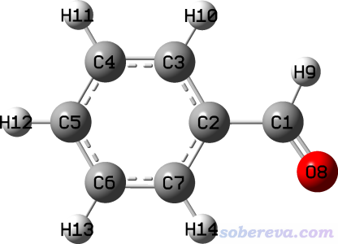

**谈谈记录化学体系结构的mol2文件**

Introduction to the mol2 format for recording chemical structures

文/Sobereva@[北京科音](http://www.keinsci.com)  2022-Dec-31

## 1 mol2文件简介

mol2文件是计算化学领域非常常用的记录分子结构的格式，被很多程序所支持和利用。例如VMD、GaussView、Chem3D、OpenBabel、AmberTools里的Antechamber等程序都可以导出mol2文件，笔者开发的Multiwfn（<http://sobereva.com/multiwfn>）可以基于mol2文件计算EEM原子电荷，笔者开发的Sobtop（<http://sobereva.com/soft/Sobtop>）可以基于mol2文件产生GROMACS的拓扑文件，等等。

相对于非常常见的在《谈谈记录化学体系结构的xyz文件》（<http://sobereva.com/477>）中介绍的xyz格式，mol2格式关键优点在于可以记录成键信息，即谁与谁成什么形式的键，这对于判断原子所处的化学环境非常重要，比如Sobtop需要有这样的成键信息才能自动指认GAFF原子类型，Multiwfn计算EEM原子电荷时需要有这样的信息才能判断各个原子要用的EEM参数。另外mol2文件还可以记录其它诸多信息（距离约束、可旋转的键、原子类型和电荷等等），对于分子模拟、QSAR、化学信息学等一些方面有特殊的意义。

mol2格式略微复杂，不同程序产生的mol2文件有所出入，有的程序产生的mol2文件还不规矩，导致经常有人由于用的mol2文件有问题而无法用Sobtop和Multiwfn等程序正常处理，甚至导致程序崩溃。我遂觉得有必要写一篇文章介绍一下mol2格式，便于读者了解怎么读取mol2文件的信息、判断自己手头的mol2文件是否规范，以及拿到不标准的mol2文件时怎么修改。

mol2文件是文本格式，包含大量的字段，每个字段各有各的用处和定义规范。mol2文件的详细说明可以下载此文档查看：<http://sobereva.com/attach/655/Tripos_Mol2_File_Format.pdf>。这些字段并不是全都需要出现的，常见的字段只有几个而已，每个字段涉及的信息中往往也只有其中少部分会经常涉及到，将在下文进行介绍，若想更全面详细了解mol2格式可阅读上述文档，共54页。

本文提到的程序的版本是VMD 1.9.3、Multiwfn 3.8(dev, 2022-Dec-18)、Sobtop 1.0(dev3.1)、GaussView 6.0.16、OpenBabel 3.1.1。其它版本可能与本文相同也可能不同。

## 2 mol2文件的例子和解读

OpenBabel程序产生的mol2格式相对来说是属于比较规矩的，这里结合OpenBabel程序产生的苯甲醛的mol2文件的内容进行讲解。我先用一个可视化程序画了一个苯甲醛的结构，保存为了benzaldehyde.pdb文件，然后用obabel benzaldehyde.pdb -O benzaldehyde.mol2命令用OpenBabel把pdb格式转成了mol2格式的benzaldehyde.mol2文件，其内容如下，GaussView载入此文件后显示的结构图也给出了以便于对照

@<TRIPOS>MOLECULE  
 benzaldehyde.pdb  
  14 14 0 0 0  
 SMALL  
 GASTEIGER

@<TRIPOS>ATOM  
       1  C          1.9920    0.4700   -0.0000 C.2     0  UNK0        0.1502  
       2  C          0.5340    0.2150   -0.0000 C.ar    0  UNK0        0.0142  
       3  C         -0.3610    1.2920   -0.0000 C.ar    0  UNK0       -0.0515  
       4  C         -1.7360    1.0600    0.0000 C.ar    0  UNK0       -0.0611  
       5  C         -2.2160   -0.2520    0.0000 C.ar    0  UNK0       -0.0617  
       6  C         -1.3250   -1.3310   -0.0000 C.ar    0  UNK0       -0.0611  
       7  C          0.0460   -1.1010   -0.0000 C.ar    0  UNK0       -0.0515  
       8  O          2.8450   -0.3960    0.0000 O.2     0  UNK0       -0.2957  
       9  H          2.2730    1.5470    0.0000 H       0  UNK0        0.1081  
      10  H          0.0250    2.3090   -0.0000 H       0  UNK0        0.0624  
      11  H         -2.4300    1.8950    0.0000 H       0  UNK0        0.0618  
      12  H         -3.2860   -0.4350    0.0000 H       0  UNK0        0.0618  
      13  H         -1.7060   -2.3480   -0.0000 H       0  UNK0        0.0618  
      14  H          0.7610   -1.9170   -0.0000 H       0  UNK0        0.0624  
 @<TRIPOS>BOND  
      1     1     2    1  
      2     1     8    2  
      3     1     9    1  
      4     2     3   ar  
      5     2     7   ar  
      6     3     4   ar  
      7     3    10    1  
      8     4     5   ar  
      9     4    11    1  
     10     5     6   ar  
     11     5    12    1  
     12     6     7   ar  
     13     6    13    1  
     14     7    14    1

首先要知道mol2文件里以#作为第一列的是注释行，空行也被完全无视。mol2文件是自由格式，因此空格数目完全随意。

第一列以@开头的叫做字段，从上面的benzaldehyde.mol2可见，当前文件有@<TRIPOS>MOLECULE、@<TRIPOS>ATOM、@<TRIPOS>BOND三个字段。一般来说这三个字段都是必须出现的，一起提供了描述一个分子最起码的信息。

### 2.1 MOLECULE字段

@<TRIPOS>MOLECULE字段记录了体系的基本信息，包括：  
第1行：体系的名字。可见OpenBabel把转换出mol2文件的源文件的名字benzaldehyde.pdb当做了当前体系的名字  
第2行：五个数字分别是体系中的原子数、化学键数、子结构数、特征数、set数。对于单纯记录体系结构信息，只要提供前两者就够了，后三个可以省略。所谓的子结构是指体系中的一个部分，比如每个分子、每个残基、蛋白质的每条链等等都可以在@<TRIPOS>SUBSTRUCTURE字段里定义为一个子结构。所谓的set是指基于体系中的一些原子/键/子结构根据特定规则和需要定义的集合，可以在@<TRIPOS>SET里具体定义。  
第3行：体系的类型。可以为SMALL（小分子）、BIOPOLYMER、PROTEIN、NUCLEIC_ACID、SACCHARIDE  
第4行：原子电荷。如果mol2文件没记录原子电荷信息这里就为NO_CHARGES。而在产生当前benzaldehyde.mol2文件的时候OpenBabel自动计算了Gasteiger电荷，因此此处写的是GASTEIGER。还可以为MULLIKEN_CHARGES（Mulliken电荷）、MMFF94_CHARGES（MMFF94力场定义的电荷）等等，不同种类电荷都有固定名字。如果记录的原子电荷是比如Multiwfn算的ADCH、RESP、1.2*CM5等电荷，在mol2格式规范中没有对应的名字，则这里应当写USER_CHARGES。

### 2.2 ATOM字段

@<TRIPOS>ATOM字段每一行定义一个原子的信息，每一列记录的信息为：  
(1)原子序号（整数）  
(2)原子名（字符串）  
(3)X坐标（埃）  
(4)Y坐标（埃）  
(5)Z坐标（埃）  
(6)原子类型（atom type。字符串）  
(7)原子所属的子结构序号（整数），可省略  
(8)原子所述的子结构名字（字符串），可省略  
(9)原子电荷（浮点数），可省略

原子名部分可以为比如C2、H4等等，完全随意。记录生物分子结构时通常用IUPAC定义的各种残基中的原子名。

原子类型部分可以记录做分子模拟用的力场中此原子实际对应的原子类型。mol2格式自己也有一套原子类型定义，见前述的Tripos_Mol2_File_Format.pdf文档的末尾，比如sp3杂化的碳的原子类型是C.3，C.ar代表芳香碳，Any代表任意，Hal泛指卤素，Cl代表氯，Ca代表钙，H代表氢，H.spc特指SPC水模型的氢，LP代表孤对电子（lone pair），Du代表虚原子（dummy），等等。

一定要特别注意，mol2格式虽然定义了一大堆字段，但（居然）没有一个地方是专门用来记录元素的，这在我来看是mol2格式的严重不足！！！mol2记录的原子名和原子类型信息可以与元素名相同也可以不同，不同程序产生的mol2文件的情况各有不同。例如如此例可见，OpenBabel产生的这个mol2文件里原子名恰等于元素名，原子类型是根据mol2格式自己定义的原子类型指认的。而在GaussView产生的mol2文件中，原子名是给元素名后面加了数字（因此不会有重名的原子），而原子类型恰等于元素名。由于情况混乱，所以一个程序在读取mol2文件的时候并没有严格的办法能准确判断元素，只能靠猜。Multiwfn和Sobtop在读取mol2文件时是根据原子类型的字符串判断元素的：如果字符串中没有.，就直接将之当做元素名来判断元素；如果有.，比如是C.3，就把.前面的内容当做元素名判断元素。因此，读者应该知道Multiwfn和Sobtop没判断对元素时该怎么办了，最简单的做法就是手动修改mol2文件以让@<TRIPOS>ATOM字段每一行的第6列对应元素名。

由于子结构信息在原子电荷前面，因此即便你不想定义原子所属的子结构信息而只想定义原子电荷，也必须随便写上子结构序号和子结构名字来占位，比如此例用0  UNK0来占位。

### 2.3 BOND字段

@<TRIPOS>BOND字段每一行定义一个键的信息，其每一列记录的信息为：  
(1)键的序号（整数）  
(2)第1个原子的序号  
(3)第2个原子的序号  
(4)键的类型

键的类型有以下这些  
• 1 = 单键  
• 2 = 双键  
• 3 = 三键  
• am = 酰胺的N-C键（这种键有一定pi共轭作用，这是为什么mol2格式里特意用am来与单键区分）  
• ar = 芳香环（aromatic）上的键，以下简称芳香键  
• du = 虚键  
• un = 未知/无法判断  
• nc = 不相连（俩原子不成键就没必要在BOND字段出现，但可以靠nc强调某两个原子间就是没成键）  
绝大多数程序产生的mol2文件里没有du、un、nc。

有的程序产生的键的类型名不规矩。比如GaussView对于芳香环上的键（具体来说，是图形窗口里看到一个实线+一个虚线的那种键）用的类型是Ar，但按照mol2规范应当是ar，因此这会导致一些程序无法识别（而Sobtop在读取时已经考虑到了GaussView的这个bug，因此用户不用自己做替换）。GaussView还自行给mol2格式做了扩展，把图形窗口里看到是一个虚键的那种键记录为Wk代表Weak，而这可能导致很多程序无法正常识别和载入。

不同程序对成键的指认也往往有很大不同。比如甲酰胺，Avogadro产生的它的mol2里把N-C键记录为am，严格符合mol2格式的要求。而GaussView则无法将之记录为am，而是可能记录为单键也可能记录为Ar（取决于当前图形窗口里显示的成键方式）。另外，我之前在《谈谈原子间是否成键的判断问题》（<http://sobereva.com/414>）中说过GaussView是根据原子半径和原子间距离判断成键形式的，导致很有可能判断出的成键方式很不“经典”，甚至很违背化学常识，比如可能显示一个碳原子连着一个双键和两个单+虚键。而如果把结构保存成pdb然后再用OpenBabel转成mol2格式，则成键方式就很经典了，因为OpenBabel能够自动让成键方式满足经典Lewis式且同时识别芳香区域。

VMD程序里如果载入了xyz、gro、pdb等不含成键关系信息的文件（虽然pdb有CONECT字段，但VMD不利用），保存出的mol2文件将没有BOND字段，明显是不符合规范的。在同时载入拓扑文件以提供拓扑信息后，保存出的mol2文件才是有BOND字段的（与此同时也有了原子类型、原子电荷、原子所属的残基号和残基名信息）。VMD如果载入的是mol2文件，也可以从中获取成键信息，使得保存出的mol2文件里也有BOND部分。但是VMD并不能记录芳香键，而且它自己也没有像OpenBabel那样根据几何结构和元素就能判断出芳香区域的能力，因此即便载入的是本例的benzaldehyde.mol2，保存出的mol2里苯环上的键也都会简单地记录成单键。

还值得顺带一提的是有个叫mol的格式，介绍见<https://en.wikipedia.org/wiki/Chemical_table_file>。不要将它和mol2混淆，二者格式截然不同。mol也能像mol2一样记录键的存在性及其类型。GaussView产生的mol文件中会把芳香键用4来记录，这正是mol标准格式中的芳香键的类型序号，而OpenBabel在产生mol文件时则会把芳香环描述成单双键交替的形式。

## 3 关于记录晶胞信息

mol2文件通常用来记录孤立体系，但实际上此格式也定义了记录晶胞信息的字段@<TRIPOS>CRYSIN，在其下一行写晶胞的a、b、c三个边长（埃）以及alpha、beta、gamma夹角（度），每个值之间以逗号分隔。例如：  
@<TRIPOS>CRYSIN  
3.785,3.785,9.514,90,90,90  
Sobtop和Multiwfn在载入mol2文件时都会试图载入晶胞信息以考虑周期性。GaussView有很好用的对周期性体系建模的功能，但即便在图形窗口里能看到晶胞边框，代表当前是周期性体系，其保存出的mol2文件里也没有@<TRIPOS>CRYSIN字段，因此需要自行补充。在VMD 1.9.3里，即便当前有晶胞信息，保存的mol2文件里也没有以上字段。VMD 1.9.3载入mol2时也不会从以上字段中载入晶胞信息。
