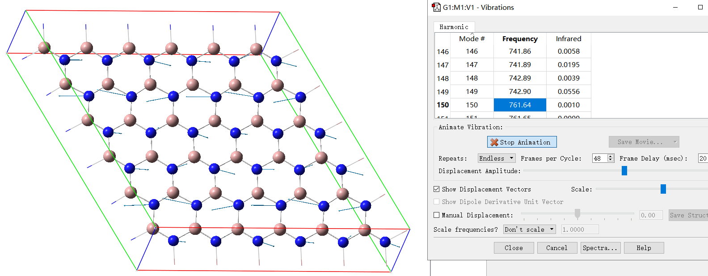

**使CP2K计算的振动模式可以被GaussView观看的程序：MfakeG**

MfakeG: A tool that enables vibration modes calculated by CP2K to be viewed with GaussView

文/Sobereva@[北京科音](http://www.keinsci.com)   2023-Jan-22

GaussView在观看振动模式方面非常好用，可以方便地显示振动矢量，播放和保存振动动画，还可以沿特定的振动模式对结构进行位移，但GaussView只支持Gaussian程序的振动分析输出文件。之前我写过一个程序OfakeG，见《OfakeG：使GaussView能够可视化ORCA输出文件的工具》（<http://sobereva.com/498>），可以把ORCA程序振动分析的输出文件转化成类似Gaussian的格式，从而能通过GaussView来可视化。CP2K是非常强大且免费的第一性原理程序，为了也能借助GaussView便利地观看其振动模式，我写了叫MfakeG的程序，在此进行介绍。笔者讲授的北京科音CP2K第一性原理计算培训班（<http://www.keinsci.com/workshop/KFP_content.html>）里非常详细讲授怎么用CP2K计算分子和周期性体系的红外和拉曼光谱，其中也会充分利用MfakeG程序。

MfakeG可以在主页[**http://sobereva.com/soft/MfakeG**](http://sobereva.com/soft/MfakeG)免费下载，Windows和Linux版都有。

CP2K的振动分析任务的输入文件里在&VIBRATIONAL_ANALYSIS字段中加入以下内容就可以在振动分析结束时输出后缀为.mol的Molden文件，默认文件名为[项目名]-VIBRATIONS-1.mol。  
  &PRINT  
     &MOLDEN_VIB  
     &END MOLDEN_VIB  
   &END PRINT  
如果你用Multiwfn按照《使用Multiwfn非常便利地创建CP2K程序的输入文件》（<http://sobereva.com/587>）介绍的方式产生CP2K振动分析的输入文件，默认也会产生.mol文件。注意这个.mol文件和常见的记录分子结构和键连关系的.mol文件完全是两码事。

.mol文件里面有许多字段，记录了元素、坐标、振动频率、描述振动矢量的正则坐标、红外强度。MfakeG干的事情就是把.mol转换为GaussView能认的类似Gaussian振动分析输出文件的形式。

启动MfakeG后，输入.mol文件的路径，就会在相同目录下产生与之同名但带了-fake后缀的.out文件，之后载入到GaussView里就可以照常用Results - Vibrations界面观看振动信息了。

CP2K一般都是用来算周期性体系的。为了能让GaussView显示出来晶胞边框，对周期性体系需要自行编辑.mol文件，在里面第二行插入[Cell]字段，比如  
 [Cell]  
 19.25142628     0.00000000     0.00000000  
 -9.62562669    16.67336579     0.00000000  
  0.00000000     0.00000000    15.00000000  
三行内容是晶胞的三个矢量，单位为埃。这样MfakeG转出来的伪Gaussian输出文件的原子坐标部分最后会多出来三个原子信息，对应晶胞矢量。

在MfakeG的example目录下freq.inp是CP2K对GaN超胞做振动分析的输入文件，算完后产生了freq-VIBRATIONS-1.mol，用MfakeG转换后就是freq-VIBRATIONS-1_fake.out。用GaussView的振动分析界面看到的是下面的效果，可见效果很好。

实际上笔者原本是打算把CP2K的输出文件转化成伪Gaussian格式的。但之所以后来决定转化.mol格式，是因为其格式比CP2K输出文件更简单，而且这样更有通用性，读者可以自己写个小程序把任意其它计算化学程序做振动分析得到的结果写成.mol格式，之后都可以借助MfakeG用GaussView观看。
