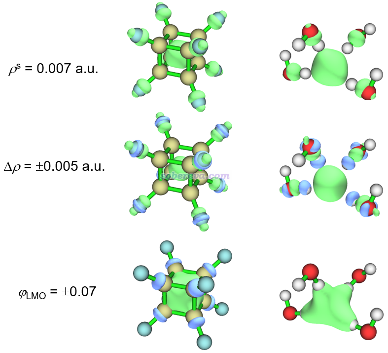
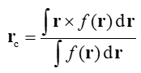
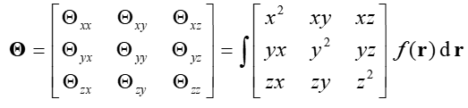
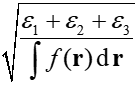
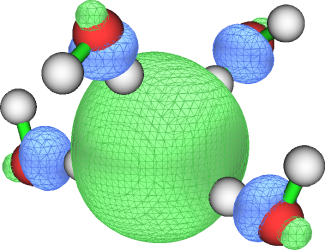

**使用Multiwfn展现过剩电子（excess electron）并计算它的回转半径**

Using Multiwfn to exhibit excess electrons and calculate their radius of gyration

文/Sobereva@[北京科音](http://www.keinsci.com)   2023-Jan-30

## 1 过剩电子的展现

化学领域里的过剩电子（excess electron）通常是指定有电子比较集中地出现在化学体系的某一块区域。过剩电子没有唯一展现方式，有很多手段都可以展现其分布，比如电子密度差（参考《使用Multiwfn作电子密度差图》<http://sobereva.com/113>）、自旋密度（参考《谈谈自旋密度、自旋布居以及在Multiwfn中的绘制和计算》<http://sobereva.com/353>）、ELF或LOL（参考《ELF综述和重要文献小合集》<http://bbs.keinsci.com/thread-2100-1-1.html>）、定域化轨道（参考《Multiwfn的轨道定域化功能的使用以及与NBO、AdNDP分析的对比》<http://sobereva.com/380>）、对UKS波函数做双正交化后的SOMO轨道（参考《用于非限制性开壳层波函数的双正交化方法的原理与应用》<http://sobereva.com/448>），等等，这些都可以通过波函数分析程序Multiwfn（<http://sobereva.com/multiwfn>）轻易地考察。不了解Multiwfn的话看《Multiwfn FAQ》（<http://sobereva.com/452>）和《Multiwfn入门tips》（<http://sobereva.com/167>）。

下面给出两个带有过剩电子体系的例子，一个是8个氟取代的立方烷的阴离子，一个是四个水分子结合一个额外电子构成的水合电子团簇，下图用三种不同方式对过剩电子的分布做了展现，都是Multiwfn直接绘制的图。ρs代表自旋密度，Δρ是阴离子的电子密度减去相同结构下中性状态的电子密度得到的密度差，φLMO是指轨道定域化得到的能量最高的定域化alpha占据轨道。波函数是用Gaussian在ωB97XD/6-311++G**级别下得到的，结构是在这个级别下对阴离子优化得到的，计算时用Gaussian 16默认的IEFPCM模型表现了水环境。相关的Gaussian输入输出文件和fchk文件都可以在<http://sobereva.com/attach/658/file.rar>下载。

由上可见，三种不同方式给出的图像虽然不同，但共性都很明显，即体系中央有一坨显著的电子分布，体现了过剩电子的存在。但过剩电子并不是100%完全定域在体系最中央的，由图可见在其它部分也有一定程度的离域。

之所以以上两个体系的过剩电子比较集中分布在中央，是因为体系中央区域的静电势相对更正，对额外加入的电子束缚能力比其它地方更强。具体来说，C8F8体系中每个F-C键键轴对面区域的碳上有个sigma-hole区域，体现局部缺电子特征，也因而在相应方向电子对C的核电荷的势场屏蔽较弱。而体系又有多达8个F-C键，自然使得笼中央的静电势非常正。除了从静电势角度考察外，读者也可以直接用Multiwfn打开文件包里的C8F8.fchk（中性的C8F8）然后按《使用Multiwfn观看分子轨道》（<http://sobereva.com/269>）说的去看LUMO轨道，会发现LUMO的分布主体也是笼中央区域，这体现出如果忽略轨道弛豫效应，外来一个电子的话必定主要分布在笼中央。(H2O)4外来一个电子后倾向于分布在四个水中央也是类似的原因。其当前结构下四个水都有氢朝向体系中央，水分子里的氢是带明显正电荷的，四个水朝着同一个方向时自然会令相应区域静电势很正、容易被外来电子优先占据。

## 2 过剩电子的回转半径

为了定量描述过剩电子的分布广度，特别是其束缚在受限环境中的情况，很多文章都使用回转半径（radius of gyration）这个指标。回转半径越大，过剩电子分布得越弥散。对上述各种描述过剩电子的实空间函数都可以按照本节说的方式计算函数的回转半径，并将其视为过剩电子的回转半径用于定量讨论。

对于一个三维实空间函数f，它的分布中心定义如下

下面的3*3矩阵叫做函数的二阶矩，其中x,y,z是积分坐标相对于函数分布中心的坐标的三个分量

然后利用二阶矩的本征值ε1、ε2、ε3就可以计算回转半径了：

<r^2>也是展现函数分布广度的一个常用的量，笔者在《电子空间范围<r^2>和电子径向分布函数的含义以及在Multiwfn中的计算》（<http://sobereva.com/616>）中有专门的介绍。<r^2>就是二阶矩的三个对角元简单的加和而已，对应于回转半径公式里的分子项。

如果f是有正有负的函数，而且正负部分积分值的数量级相仿佛，上面各式中的f最好取其绝对值来计算，从而避免正负抵消造成的影响。如果不取绝对值有时候还会使得结果毫无意义，比如考察单重态双自由基体系的自旋密度，正负部分积分会正好抵消，回转半径的分母就为0了，根本没法计算中心位置。

## 3 基于自旋密度计算过剩电子回转半径的例子

这里以前面说的水合电子体系为例，演示用Multiwfn基于自旋密度计算其过剩电子的回转半径。本文用的Multiwfn是2023-Jan-30更新的3.8(dev)版，更老的版本与本文情况存在一定不符。

启动Multiwfn，然后输入  
file\H8O4-.fchk  
200  //主功能200  
11   //计算函数中心、一阶、二阶矩和回转半径。此功能使用的是Becke多中心格点积分方法，默认设置下精度就已经很高了  
3   //选择被考察的函数  
5   //自旋密度  
2   //计算函数中心  
从屏幕上可看到函数的积分值和中心位置。  
Integral of the function:  9.99842011E-01 a.u.

Center of the function:  
X=     -0.09360685 Y=      0.03381961 Z=     -0.47523227 Angstrom

然后输入y，将这个中心当做之后算各种量所用的参考中心位置。之后选1计算各种量，从屏幕上可见回转半径的数值：  
Radius of gyration:  4.29967591E+00 Bohr   2.27529051E+00 Angstrom

2.275埃这个值和水合电子研究文献（如J. Phys. Chem. Lett., 8, 2055 (2017)）里普遍报道的值是差不多的。定量上肯定有一定差异，不同文章给出的值也都有出入，这和体系模型、计算级别、对过剩电子回转半径的定义等方面都有关。

## 4 基于轨道概率密度计算过剩电子回转半径的例子

当过剩电子几乎能恰好被一个轨道描述时，从轨道概率分布的角度也可以考察过剩电子分布。前面举例的C8F8-和水合电子体系，用UKS方式计算后其alpha的HOMO轨道分布正好就比较充分体现了过剩电子分布，其0.05等值面图如下所示

这种情况可以对这个轨道的概率密度计算回转半径，并作为过剩电子的回转半径，下面就用水合电子举个例子。注意用alpha-HOMO考察过剩电子的做法不总是普适的，用Multiwfn做轨道定域化或者双正交化得到的轨道考察过剩电子更为严格。

启动Multiwfn，然后输入  
file\H8O4-.fchk  
6   //修改波函数  
26   //修改轨道占据数  
0   //选择所有轨道  
0   //占据数设为0  
21   //alpha-HOMO轨道的序号（进入Multiwfn主功能0的时候在文本窗口就会告诉你HOMO的序号）  
1   //电子数设为1。此时总电子密度就正好对应于alpha-HOMO的概率密度了  
q   //返回  
-1   //回到主菜单  
200  //主功能200  
11   //计算函数中心、一阶、二阶矩和回转半径  
2   //计算函数中心。默认的函数就是总电子密度  
y   //将算出来的中心坐标作为后续计算的参考中心  
1   //计算各种量  
此时得到的回转半径为  
Radius of gyration:  4.28690202E+00 Bohr   2.26853086E+00 Angstrom  
可见和之前基于自旋密度得到的回转半径几乎完全一致，也体现出这两种做法对此体系都是得当的。

## 5 基于密度差计算过剩电子回转半径的例子

这一节通过本文第一张图里的密度差（Δρ）的分布计算水合电子体系过剩电子的回转半径。这个方法步骤最多，但相对来说最为普适。比如体系原本是一个二重态体系，额外来了一个电子后变成闭壳层状态，要用回转半径考察额外电子的分布显然就不能基于自旋密度来算了（处处为0），而可以基于阴离子态与中性状态的密度差来算。

先把Multiwfn目录下的settings.ini里的iuserfunc设为-1，此时用户自定义函数（user-defined function）将对应于格点数据插值产生的函数。之后计算密度差格点数据，启动Multiwfn，然后输入  
file\H8O4-.fchk  
5  //计算格点数据  
0   //自定义运算  
1   //有一个文件将要与当前体系相运算  
-,file\H8O4.fchk   //让当前波函数的属性减去H8O4.fchk记录的中性波函数的属性  
1   //属性是电子密度  
3   //高质量格点

此时可以看到如下所示的当前格点数据的积分值，包括所有值、正值部分、负值部分的积分。  
Summing up all value and multiply differential element:  
  0.997642151563456  
 Summing up positive value and multiply differential element:  
   1.17292565123273  
 Summing up negative value and multiply differential element:  
 -0.175283499669268  
总积分值越接近阴离子与中性状态电子数的差值1.0说明格点数据越理想。当前的偏差很小，就算可以接受了。还可以看到密度差数据的负值部分积分值-0.175没小到可以忽略，因此之后基于密度差来得到函数的分布中心、回转半径时应当对函数的绝对值进行计算，避免正负部分抵消的影响。

注意对于更大的体系，建议自己手动输入格点间距以确保格点间距足够小，否则之后的回转半径计算不准确，详见《Multiwfn FAQ》（<http://sobereva.com/452>）的Q39。

现在密度差格点数据就已经在内存里了。接着输入  
0  //返回主菜单  
200  //主功能200  
11   //计算函数中心、一阶、二阶矩和回转半径  
3   //选择被考察的函数  
100   //用户自定义函数  
5   //基于函数的绝对值来计算函数中心  
y   //将算出来的中心坐标作为后续计算的参考中心  
-1  //之后计算各种统计量的时候用函数的绝对值代替原本函数值  
1   //计算各种量

结果如下  
Radius of gyration:  4.80321486E+00 Bohr   2.54175184E+00 Angstrom  
这个方法得到的回转半径比前面基于自旋密度和轨道概率密度得到的稍大，也是合理数值。

本节基于格点数据插值作为被考察的函数的方式也可以用于其它格点数据。比如某个计算程序无法产生被Multiwfn支持的波函数文件，但是直接给你了记录xxx函数的格点数据的cub文件（或其它Multiwfn支持的格点数据格式，如.dx、.grd、CHGCAR等），也同样可以先把iuserfunc设为-1，然后载入这个cub文件使里面的格点数据读到内存里，之后跳过本节产生格点数据的过程，直接进入主功能200做后续的分布特征的计算。

## 6 总结&其它

本文通过图形方式结合两个简单体系介绍了过剩电子的概念，并着重介绍了怎么利用Multiwfn基于不同函数计算回转半径，用来衡量过剩电子的分布广度。本文的例子也充分体现了Multiwfn在设计上的灵活性。

很多文章都通过从头算分子动力学考察含有过剩电子体系的动态行为（PS：北京科音的CP2K培训班里就有液态水中水合电子形成过程的动力学模拟例子），并分析过剩电子回转半径随时间的变化，以及回转半径数值的分布情况。实现这种目的只要把本文的内容与《详谈Multiwfn的命令行方式运行和批量运行的方法》（<http://sobereva.com/612>）里说的相结合就可以轻易做到。具体来说，比如ORCA和CP2K做从头算动力学可以每隔一定帧数产生一个molden文件，动力学跑完之后，自己写个脚本调用Multiwfn依次处理各个molden文件，用grep、awk之类的命令自动提取数据，就OK了。<http://sobereva.com/612>里都给了现成的对整条轨迹做波函数分析的例子，稍微改改就能实现自己的目的。

本文举例的过剩电子束缚在阴离子体系笼状区域中央仅仅是含有过剩电子体系的一类，过剩电子还可以以其它形式出现。比如碱、超碱原子的电离能非常小、很容易转移走，将它们掺杂进中性体系往往可以给原体系引入被束缚较弱的过剩电子，并给体系带来显著的非线性光学特征，可以看J. Comput. Chem., 38, 1574 (2017) DOI: 10.1002/jcc.24796中的相关讨论。
