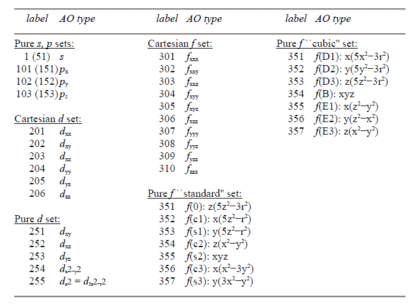

**NBO程序的.31至.40文件格式及转换为.wfn文件的方法**The .31 to .40 file format of the NBO program and the method of converting them to a .wfn file  
  
文/Sobereva @[北京科音](http://www.keinsci.com/)  
First release: 2010-Jul-12   Last update: 2011-Aug-4

  
  
我曾经写过《高斯fch文件与wfn波函数文件的介绍及转换方法》一文，见<http://sobereva.com/55>，本文是对那篇文章内容的拓展，重复的内容就不再介绍了，建议先回顾一下。  
  

## 1 .31至.40文件简介

想获得某种轨道的解析表达式，进而研究轨道特点，需要两类信息：1 基函数信息 2 轨道的组合系数。在.wfn和.fch文件中都有这两类信息。NBO程序产生的一系列plot文件也包含这样的信息，后缀由.31到.40，这两类信息不在同一个文件中。其中.31文件只包含基函数信息，是绘制各种轨道图形所必需的，.32至.40只储存了各种轨道向.31记录的基函数的展开系数，各个后缀名记录的轨道为：  
32 PNAO  
33 NAO  
34 PNHO  
35 NHO  
36 PNBO  
37 NBO  //最重要  
38 PNLMO  
39 NLMO  
40 MO  //这就是普通的分子轨道  
  
只要将.31文件的基函数信息和.32至.40文件中的组合系数信息相结合，就能计算相应轨道的各种属性，最一般的自然就是获得空间各点波函数数值，由此可以做出轨道图形（故曰plot文件）。观看NBO产生的各类轨道可以通过官方指定软件NBOview（收费）以及笔者开发的Multiwfn 1.5（免费）、Chemcraft（收费）等，它们都需要载入这样的文件。  
  
plot文件可以由NBO或GENNBO生成。NBO程序分为两种，一种是挂着ESS(electronic structure system，即各种量化程序)的，作为子程序来用，输入是通过内部调用传过去的，比如高斯的L607.exe。而GENNBO(General NBO)是可以独立使用的NBO，不需要挂着ESS，输入靠.47文件。GENNBO的功能由于没有ESS提供的一些信息或功能而不得不受限，比如自然能量分解(NEDA)、删除轨道、一些与单、双电子积分或自洽场迭代相关的功能等等。  
  
如果用高斯的NBO模块生成plot文件，在route section里面写上pop=nboread，说明要从输入文件末尾读入传给NBO模块的指令。然后分子坐标部分末尾空一行写上比如$nbo plot file=c:\sob $end，这样运行后就得到了plot文件，从c:\sob.31到c:\sob.40（尽管还有.41，但此文不涉及）。  
  
如果用GENNBO生成plot文件，需要先获得GENNBO输入文件.47。在route section里面写上pop=nboread，然后分子坐标部分末尾空一行上比如$nbo archive file=c:\sob $end，运行后就得到了c:\sob.47，在此文件开头的$NBO和$END之间写上plot，用GENNBO运行之就得到了plot文件。  
  
  

## 2 .31的文件格式

.31文件的内容是.47文件的子集，在NBO程序手册上虽然没对.31文件格式有明确解释，但通过对.47文件的介绍容易猜测到.31文件的格式。  
  
.31文件开头的三行没用，  
第4行：原子数 壳层数 原始层数  
这里说的原始层是指《高斯fch文件与wfn波函数文件的介绍及转换方法》一文的图中橘红色水平细线，每个壳层包括了多个原始层，每个原始层对应一种轨道指数和收缩系数。  
  
第6行开始：元素序号，XYZ坐标（埃）  
  
之后是类似下面的内容，有多少个壳层就有多少个类似的内容  
      1     6    11     1  
    201   204   206   202   203   205  
其中的第一行是层所在的原子序号、层中基函数的数目、层中的第一个原始层的序号 收缩度  
其中的第二行是此层里面每个基函数的类型的label，由于此例的层中有6个基函数，所以这里有6项。  
各种label的含义见此图  
  

  
可见s的label为1，p、d、f、g轨道以100、200、300、400（g的情况在图中没列出）为基准然后依次递增序号，对于球谐型d、f高斯函数则是从250、350开始递增。此文中只考虑笛卡尔型GTF的情况。  
  
.31文件的科学记数法记录的内容分为五大部分，内容分别是原始壳层的指数、s型GTF的收缩系数、p型GTF的收缩系数、d型GTF的收缩系数、f型GTF的收缩系数，较新NBO版本生成的.31文件还会有g型GTF的收缩系数。每个部分的项数显然就是总原始层数。注意收缩系数是已经乘了GTF的归一化系数的，不像.fch里记录的是没乘归一化系数的收缩系数。如果用的基函数不含SP壳层，同一原始层内将不会有不同类型的基函数，此时同一项不可能在多个部分同时不为0；如果包含SP壳层，同一原始层会同时包括s和p型基函数，所以此时同一项可以在s、p收缩系数部分同时不为0。  
  
有一点要特别注意，对于d函数，相同原始层内（即具有相同的指数）的XX、YY、ZZ的归一化系数是相同的，XY、XZ、YZ的归一化系数也是相同的，然而第一种归一化系数却不同于第二种。对于.31文件里的d壳层的收缩系数，其中包含的归一化系数是XX、YY、ZZ的，因此对于XY、XZ、YZ来说，想获得正确的收缩系数，就必须将收缩系数除以XX的（或YY、ZZ的）然后再乘以XY的（或XZ、YZ）。对于f函数，.31文件中收缩系数中的归一化系数是XXX、YYY、ZZZ的，获得其它f函数的正确的收缩系数也需要像d函数那样处理，即除一次再乘一次。  
  
  

## 3 .32至.40的文件格式

.32至.40文件记载了每个轨道向.31文件记录的基函数的展开系数。每5个数据换行一次，达到基函数数目后，即此轨道信息记录完毕，即便此行没到5个数据也换行，然后开始记录下一个轨道。轨道数目与基函数数目一致。对于NBO(.37)、NLMO(.39)，在末尾还有些关于轨道特点的信息，包括占据数。  
  
开壳层时，.34至.40文件内的不同自旋的轨道分别记录，先记录完所有ALPHA SPIN的再记录BETA SPIN的，对于PNAO/NAO(.32,.33)不同自旋不分开记录。注意开壳层体系Gaussian03的NBO3.1模块输出的.32和.33文件有bug，缺失了前三行，而GENNBO5.0生成的.32和.33文件格式是正确的。  
  
  

## 4 读入plot文件的代码

这里介绍read31子程序的写法，实际上这就是Multiwfn 1.5的sub.f90中的一个子程序，它能读入.31以及.32至.40文件中的一个。和之前文章介绍的readfch子程序目的相似，要把读入的文件内容转换为.wfn文件里的信息的形式，这样也方便计算属性。read31的工作也就是要完成给以下变量赋值的任务：  
nmo 总轨道数  
nprims 总GTF数目  
ncenter 总原子数  
CO(:,:) 系数矩阵，第i,j个元素代表第i个轨道在第j个未归一化的GTF上的展开系数  
a(:) 储存原子信息的数组，它是自定义类型，其中a%name,a%index,a%charge分别是相应原子的名称、在周期表中的序号、核电荷数（使用赝势时数值小于在周期表中的序号），a%x,a%y,a%z是原子XYZ坐标  
b(:) 储存每个GTF的信息的数组，b%exp,b%center,b%functype分别是相应GTF的指数、所在中心序号、函数类型标识。  
MOocc(:) 记录轨道的占据数。只有.37、.39文件中才记录了这样的信息而能被读取。  
还有几个信息在plot文件中并没有，也没法算，但为了与.wfn文件中的信息一致，也要赋值，但内容是随意的，包括totenergy=总能量；virialratio=维里系数；nelec=总电子数；MOene(:)=记录轨道能量的数组；  
另外MOtype(:)数组用来记录相应轨道是什么类型，这在编写其它代码时会用到，0代表双占据轨道，1是alpha自旋轨道，2是beta自旋轨道。  
  
read31子程序代码如下：  
subroutine read31(name)  
use define !此module包括如上所示的要被赋值的内容，各数组都是allocatable的状态。  
character(len=*) name !传入的.31文件的文件名  
character :: name2*200=" ",chartemp*80 !name2用来装.32至.40文件名，chartemp是作为临时判断之用的字符串  
logical alive  
integer i,j,k,nbasis,nshell,nprimshell !nbasis=总基函数数目，nshell=总壳层数，nprimshell=总原始层数  
integer bastype2func(415) !将NBO的基函数的label转换为.wfn文件中的类型编号，415是最大的轨道序号，即ZZZZ型的g函数  
integer,allocatable :: shellcon(:),shell2atom(:),shellnumbas(:),shell2prmshl(:),bastype(:) !壳层收缩度、壳层所在原子、壳层内基函数数目、壳层中第一个原始层的序号、基函数的label  
real*8,allocatable :: orbcoeff(:,:),prmshlexp(:),cs(:),cp(:),cd(:),cf(:),cg(:) !以.31中基函数为基的轨道系数矩阵、原始层的指数、原始层中GTF类型为s,p,d,f,g时的收缩系数（已乘了归一化系数）  
  
!对照上面图中label与GTF类型的对应关系，以及.wfn文件中如下所示的各类型的标识：  
!1/2/3/4/5/6/7/8/9/10=S/X/Y/Z/XX/YY/ZZ/XY/XZ/YZ   
!11/12/13/14/15/16/17/18/19/20=XXX/YYY/ZZZ/XXY/XXZ/YYZ/XYY/XZZ/YZZ/XYZ  
!可以得到label到wfn类型标识的转换关系  
bastype2func(1)=1 !s  
bastype2func(101)=2 !x  
bastype2func(102)=3 !y  
bastype2func(103)=4 !z  
bastype2func(201)=5 !xx  
bastype2func(202)=8 !xy  
bastype2func(203)=9 !xz   
bastype2func(204)=6 !yy  
bastype2func(205)=10 !yz  
bastype2func(206)=7 !zz  
bastype2func(301)=11 !xxx  
bastype2func(302)=14 !xxy  
bastype2func(303)=15 !xxz  
bastype2func(304)=17 !xyy  
bastype2func(305)=20 !xyz  
bastype2func(306)=18 !xzz  
bastype2func(307)=12 !yyy  
bastype2func(308)=16 !yyz  
bastype2func(309)=19 !yzz  
bastype2func(310)=13 !zzz  
!.wfn文件没有对g函数标识有统一的定义，以下20~35的序号顺序设为与Gaussian的fch文件一样。  
bastype2func(401)=35 !XXXX  
bastype2func(402)=34 !XXXY  
bastype2func(403)=33 !XXXZ  
bastype2func(404)=32 !XXYY  
bastype2func(405)=31 !XXYZ  
bastype2func(406)=30 !XXZZ  
bastype2func(407)=29 !XYYY  
bastype2func(408)=28 !XYYZ  
bastype2func(409)=27 !XYZZ  
bastype2func(410)=26 !XZZZ  
bastype2func(411)=25 !YYYY  
bastype2func(412)=24 !YYYZ  
bastype2func(413)=23 !YYZZ  
bastype2func(414)=22 !YZZZ  
bastype2func(415)=21 !ZZZZ  
  
write(*,*) "Input filename with suffix from .32 to .40 (e.g. ltwd.35)" !读入.32至.40文件  
do while(.true.)  
    read(*,*) name2  
    inquire(file=name2,exist=alive)  
    if (alive.eqv..true.) exit  
    write(*,*) "File not found, input again"  
end do  
  
tmplen=len_trim(name2) !输出当前读入的轨道类型  
if (name2(tmplen-1:tmplen)=="32") write(*,*) "Loaded .32 file(PNAO)"  
if (name2(tmplen-1:tmplen)=="33") write(*,*) "Loaded .33 file(NAO)"  
if (name2(tmplen-1:tmplen)=="34") write(*,*) "Loaded .34 file(PNHO)"  
if (name2(tmplen-1:tmplen)=="35") write(*,*) "Loaded .35 file(NHO)"  
if (name2(tmplen-1:tmplen)=="36") write(*,*) "Loaded .36 file(PNBO)"  
if (name2(tmplen-1:tmplen)=="37") write(*,*) "Loaded .37 file(NBO)"  
if (name2(tmplen-1:tmplen)=="38") write(*,*) "Loaded .38 file(PNLMO)"  
if (name2(tmplen-1:tmplen)=="39") write(*,*) "Loaded .39 file(NLMO)"  
if (name2(tmplen-1:tmplen)=="40") write(*,*) "Loaded .40 file(MO)"  
  
open(10,file=name,access="sequential",status="old")  
read(10,*) !.31的前三行没用  
read(10,*)  
read(10,*)  
read(10,*) ncenter,nshell,nprimshell  
!读入原子数、壳层数、原始层数，之后就可以对数组分配内存了。但目前并不知道到底有多少基函数，但bastype由于马上要用，所以取上限来分配内存，即假设最高角量子数的类型为g，又由于假设为笛卡尔型(15g)，故分配nshell*15。  
allocate(a(ncenter),shellcon(nshell),shell2atom(nshell),shellnumbas(nshell),shell2prmshl(nshell))  
allocate(prmshlexp(nprimshell),cs(nprimshell),cp(nprimshell),cd(nprimshell),cf(nprimshell),cg(nprimshell))  
allocate(bastype(nshell*15))  
read(10,*)  
do i=1,ncenter !读入原子信息  
    read(10,*) a(i)%index,a(i)%x,a(i)%y,a(i)%z  
    a(i)%charge=a(i)%index !.31并没将核电荷数与原子在周期表中序号分别记录，故直接将它们设为相同  
end do  
a%name=name2ind(a%index) !根据原子序号给原子赋上元素符号，name2ind数组在define module内定义。  
a%x=a%x/b2a !.31内的坐标以埃为单位，转换为波尔，b2a在define module内定义，为0.529177249D0  
a%y=a%y/b2a  
a%z=a%z/b2a  
read(10,*)  
j=1  
do i=1,nshell !读入每个壳层的信息  
    read(10,*) shell2atom(i),shellnumbas(i),shell2prmshl(i),shellcon(i)  
    read(10,*) bastype(j:j+shellnumbas(i)-1) !读入此层中每个基函数的label  
    j=j+shellnumbas(i)  
end do  
read(10,*)  
read(10,*) prmshlexp !读入每个原始层的轨道指数。用自由格式读入。  
read(10,*) !空行  
read(10,*) cs !读入每个原始壳层中GTF为s型时的收缩系数，接下来为p,d,f时的。  
read(10,*)  
read(10,*) cp  
read(10,*)  
read(10,*) cd  
read(10,*)  
read(10,*) cf  
!较新的NBO程序输出的.31还有cg段落记录GTF为g型时的收缩系数，有则读入。  
read(10,"(a80)",iostat=ierror) chartemp  
if (ierror==0) then  
    backspace(10)  
    read(10,*) cg  
end if  
close(10)  
  
totenergy=0.0D0 !由于plot文件未记录总能量、维里系数，故都设为0  
virialratio=0.0D0  
nbasis=sum(shellnumbas) !每个壳层内基函数数目加起来为总基函数  
nprims=0  
do i=1,nshell  
    nprims=nprims+shellcon(i)*shellnumbas(i) !壳层内基函数乘以壳层收缩度并加和就是总GTF数。  
end do  
  
open(10,file=name2,access="sequential",status="old") !开始读.32至.40文件  
read(10,*)  
read(10,*)  
read(10,*)  
read(10,"(a80)") chartemp !进行试探，如果此行内容是 ALPHA SPIN，说明是开壳层体系（但.32和.33并不区分体系类型）  
if (chartemp(1:11)==" ALPHA SPIN") then  
    wfntype=4 !代表这是开壳层  
    nmo=2*nbasis !开壳层时轨道数为基函数数目二倍  
    allocate(orbcoeff(nmo,nbasis),MOocc(nmo),MOene(nmo),MOtype(nmo),b(nprims),co(nmo,nprims))  
    MOocc=1.0D0 !占据数这么设当然毫无道理，仅是示意  
    MOtype(1:nbasis)=1 !前nbasis个轨道是alpha轨道  
    read(10,*) ((orbcoeff(iorb,ibasis),ibasis=1,nbasis),iorb=1,nbasis) !把alpha轨道组合系数读入系数矩阵的前nbasis行。  
    if (name2(tmplen-1:tmplen)=="37".or.name2(tmplen-1:tmplen)=="39") read(10,*) MOocc(1:nbasis) !如果是.37/.39文件，还有占据数信息可读入  
    MOtype(nbasis+1:nmo)=2 !后nbasis个轨道是beta轨道  
    call loclabel(10," BETA  SPIN") !loclabel见之前文章的介绍，此子程序用于将当前读写位置定位到文件中含有" BETA  SPIN"的行的行首  
    read(10,*) !跳过" BETA  SPIN"字样的行。  
    read(10,*) ((orbcoeff(iorb,ibasis),ibasis=1,nbasis),iorb=nbasis+1,nmo) !把beta轨道组合系数读入系数矩阵的后nbasis行。  
    if (name2(tmplen-1:tmplen)=="37".or.name2(tmplen-1:tmplen)=="39) read(10,*) MOocc(nbasis+1:nmo)  
else  
    wfntype=3 !代表这是闭壳层  
    nmo=nbasis !闭壳层时轨道数等于基函数数目  
    allocate(orbcoeff(nmo,nbasis),MOocc(nmo),MOene(nmo),MOtype(nmo),b(nprims),co(nmo,nprims))  
    MOocc=2.0D0  
    MOtype=0 !轨道类型接设为无自旋型  
    backspace(10) !回退一行，弥补读入chartemp造成读写位置的下移。  
    read(10,*) ((orbcoeff(iorb,ibasis),ibasis=1,nbasis),iorb=1,nmo)  
    if (name2(tmplen-1:tmplen)=="37".or.name2(tmplen-1:tmplen)=="39) read(10,*) MOocc  
end if  
close(10)  
MOene=0.0D0 !plot文件无轨道能量信息，都设为0  
nelec=0  
if (name2(tmplen-1:tmplen)=="37".or.name2(tmplen-1:tmplen)=="39) nelec=sum(MOocc) !为.37/.39文件时，MOocc有有意义值，故计算总电子数。否则设为0。  
  
!下面把以.31内的基函数为基的系数矩阵orbcoeff变换到以GTF为基的系数矩阵CO，循环过程与fch转wfn的过程类似。并且给记录GTF信息的b向量赋值。  
iGTF=1 !用于记录当前GTF序号  
ibasis=1 !用于记录当前基函数序号  
do i=1,nshell !循环每一壳层  
    b(iGTF:iGTF+shellcon(i)*shellnumbas(i)-1)%center=shell2atom(i) !同一壳层中GTF所属中心相同，故把这一壳层中所有GTF所属中心都设好  
    do j=1,shellnumbas(i) !循环壳层内每个基函数  
        b(iGTF:iGTF+shellcon(i)-1)%functype=bastype2func(bastype(ibasis)) !同一基函数中的GTF类型都一样，一次性设好。bastype(ibasis)是当前基函数的label，通过bastype2func数组转换到wfn文件中的类型标识。  
        do k=1,shellcon(i) !循环组成当前基函数的每个GTF  
            iprmshlpos=shell2prmshl(i)+k-1 !代表当前GTF所在原始层的序号  
            b(iGTF)%exp=prmshlexp(iprmshlpos) !给当前GTF以相应的指数  
            if (bastype(ibasis)==1) then !根据当前基函数的label的不同，选择类型对应的收缩系数向量，将其中对应的原始层的收缩系数取出。  
                contract=cs(iprmshlpos)  
            else if (bastype(ibasis)<=200) then !p函数  
                contract=cp(iprmshlpos)  
            else if (bastype(ibasis)<=300) then !d函数  
                contract=cd(iprmshlpos)  
            !202,203,205对应的是XY,XZ,YZ型GTF。上一行得到的收缩系数contract对XX,YY,ZZ是正确的（见本文第二节最后一段），下面将之转换为对于XY,XZ,YZ正确的收缩系数  
                if (bastype31(ibasis)==202.or.bastype31(ibasis)==203.or.bastype31(ibasis)==205) then  
                    valnorm31=normgau(5,prmshlexp(iprmshlpos)) !normgau函数用于计算归一化系数，这里获得XX的归一化系数  
                    valnormnew=normgau(8,prmshlexp(iprmshlpos)) !获得XY的归一化系数  
                    contract=contract/valnorm31*valnormnew !将XX,YY,ZZ的收缩系数变成XY,XZ,YZ的  
                end if  
            else if (bastype(ibasis)<=400) then !f函数  
                contract=cf(iprmshlpos)  
            !类似对d函数的处理，上一行得到的contract只是对XXX,YYY,ZZZ正确，下面将之转换成其它类型f函数的收缩系数  
                if (bastype31(ibasis)/=301.and.bastype31(ibasis)/=307.and.bastype31(ibasis)/=310) then !XXX,YYY,ZZZ以外的函数  
                    valnorm31=normgau(11,prmshlexp(iprmshlpos)) !XXX,YYY,ZZZ的归一化系数  
                    if (bastype31(ibasis)==302.or.bastype31(ibasis)==303.or.bastype31(ibasis)==304&  
                    .or.bastype31(ibasis)==306.or.bastype31(ibasis)==308.or.bastype31(ibasis)==309) then  
                        valnormnew=normgau(14,prmshlexp(iprmshlpos)) !XXY,XXZ,XYY,XZZ,YYZ,YZZ的归一化系数  
                    else if (bastype31(ibasis)==305) then   
                        valnormnew=normgau(20,prmshlexp(iprmshlpos)) !XYZ的归一化系数  
                    end if  
                    contract=contract/valnorm31*valnormnew  
                end if  
            else if (bastype(ibasis)<=500) then  
                contract=cg(iprmshlpos)  
            !类似对d,f函数的处理，对收缩系数进行转换。上一行得到的contract只是对XXXX,YYYY,ZZZZ正确  
                if (nt/=401.and.nt/=411.and.nt/=415) then  
                    valnorm31=normgau(21,prmshlexp(iprmshlpos)) !XXXX,YYYY,ZZZZ的归一化系数  
                    nt=bastype31(ibasis)  
                    if (nt==402.or.nt==403.or.nt==407.or.nt==410.or.nt==412.or.nt==414) then  
                        valnormnew=normgau(22,prmshlexp(iprmshlpos)) !XXXY,XXXZ,XYYY,XZZZ,YYYZ,YZZZ的归一化系数  
                    else if (nt==404.or.nt==406.or.nt==413) then  
                        valnormnew=normgau(23,prmshlexp(iprmshlpos)) !XXYY,XXZZ,YYZZ的归一化系数  
                    else if (nt==405.or.nt==408.or.nt==409) then  
                        valnormnew=normgau(27,prmshlexp(iprmshlpos)) !XYZZ,XYYZ,XXYZ的归一化系数  
                    end if  
                    contract=contract/valnorm31*valnormnew  
                end if  
            end if  
            CO(:,iGTF)=orbcoeff(:,ibasis)*contract !轨道向当前基函数的展开系数乘以当前GTF在此基函数中的收缩系数就是轨道向当前GTF的展开系数  
            iGTF=iGTF+1 !更新当前的GTF的序号  
        end do  
        ibasis=ibasis+1 !更新当前的基函数的序号  
    end do  
end do  
!输出汇总信息  
if (nelec==0) write(*,"(' There are',i6,' atoms,',i6,' basis,',i6,' orbitals')") ncenter,nbasis,nmo  
if (nelec/=0) write(*,"(' There are',i6,' atoms,',i6,' basis,',i6,' orbitals,',f10.4,' electrons')") ncenter,nbasis,nmo,nelec  
if (wfntype==4) then  
    write(*,*) "This is open-shell system"  
    write(*,"(' Orbitals from 1 to',i6,' are alpha spin, from',i6,' to',i6,' are beta spin')") nbasis,nbasis+1,nmo  
end if  
end subroutine
