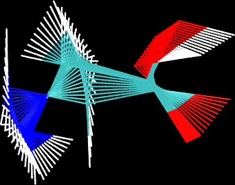

**sobNEB：产生CP2K的NEB的插点的方便的工具**

sobNEB: A convenient tool of generating interpolation points for NEB task of CP2K

文/Sobereva@[北京科音](http://www.keinsci.com)  2023-Feb-28

## 1 介绍

CP2K有很好用的NEB功能可以得到反应路径，靠CI-NEB还可以同时得到过渡态结构，用法在北京科音CP2K第一性原理计算培训班（<http://www.keinsci.com/workshop/KFP_content.html>）里讲得很详细。虽然CP2K的NEB功能自己就能自动线性插点，但是偶有bug（有的初始间距是其它的两倍），而且没法人为控制自己提供的中间结构对应哪个点，也不便于预览初始点。

我开发的sobNEB在插点时可控性更强。虽然也是线性插点，但有以下好处  
(1)可以直接控制自己提供的结构对应哪个初始点，其它点都在相邻的提供的结构之间线性插入  
(2)可直接产生对应CP2K的&BAND部分中的信息便于写NEB输入文件  
(3)会将用户提供的点和所有额外插的点的结构一起写入traj.xyz文件以在VMD中观看所有初始点构成的轨迹，以便判断插点是否合适。

sobNEB的下载地址：<http://sobereva.com/soft/sobNEB_1.0.zip>。有.exe后缀的是Windows版，无后缀的是Linux版。

注意sobNEB不会对输入的结构自动消除平动转动。

## 2 用法

用户只需编辑sobNEB目录下的sobNEB.ini，指定自行提供的各个xyz文件的路径以及对应的点的序号（之间以冒号分隔），在启动程序后就会开始处理。只有始、末端的结构是必须自己提供的，中间的结构可以不提供也可以提供一个或者多个。

下面是sobNEB.ini文件的例子，涉及到的三个xyz文件在sobNEB目录下都提供了。conf1.xyz和conf2.xyz是分子的两个构象，分别作为始、末端。TS_guess.xyz是自己摆的过渡态初猜结构，其点号位于始末、端点号的正中央。

conf1.xyz : 1  
TS_guess.xyz  : 11  
conf2.xyz : 21

启动sobNEB后会看到以下信息

 sobNEB: Generate interpolated .xyz files and CP2K input for NEB calculation  
 Programmed by Tian Lu (sobereva[at]sina.com)  
 Version 1.0, release date: 2023-Feb-19

 Loading sobNEB.ini...  
  3 structures are given

 Generating interpolated structures between given systems  1 and  2  
 Generating point   2 : 2.xyz  
 Generating point   3 : 3.xyz  
 Generating point   4 : 4.xyz  
 Generating point   5 : 5.xyz  
 Generating point   6 : 6.xyz  
 Generating point   7 : 7.xyz  
 Generating point   8 : 8.xyz  
 Generating point   9 : 9.xyz  
 Generating point  10 : 10.xyz

 Generating interpolated structures between given systems  2 and  3  
 Generating point  12 : 12.xyz  
 Generating point  13 : 13.xyz  
 Generating point  14 : 14.xyz  
 Generating point  15 : 15.xyz  
 Generating point  16 : 16.xyz  
 Generating point  17 : 17.xyz  
 Generating point  18 : 18.xyz  
 Generating point  19 : 19.xyz  
 Generating point  20 : 20.xyz

 Done! .xyz file of each point has been generated in current folder  
 Corresponding &BAND field of NEB task of CP2K has been exported to BAND.txt in  
current folder  
 traj.xyz is the trajectory file containing all points for previewing purpose

可见产生了2-10号、12-20号，共18个插点结构，当前目录下出现了相应序号的xyz文件。

当前目录下出现的BAND.txt内容如下，可以直接粘贴到&BAND字段里  
    &REPLICA  
      COORD_FILE_NAME conf1.xyz  
    &END REPLICA  
    &REPLICA  
      COORD_FILE_NAME 2.xyz  
    &END REPLICA  
    &REPLICA  
      COORD_FILE_NAME 3.xyz  
    &END REPLICA  
    &REPLICA  
      COORD_FILE_NAME 4.xyz  
    &END REPLICA  
    &REPLICA  
      COORD_FILE_NAME 5.xyz  
    &END REPLICA  
    &REPLICA  
      COORD_FILE_NAME 6.xyz  
    &END REPLICA  
    &REPLICA  
      COORD_FILE_NAME 7.xyz  
    &END REPLICA  
    &REPLICA  
      COORD_FILE_NAME 8.xyz  
    &END REPLICA  
    &REPLICA  
      COORD_FILE_NAME 9.xyz  
    &END REPLICA  
    &REPLICA  
      COORD_FILE_NAME 10.xyz  
    &END REPLICA  
    &REPLICA  
      COORD_FILE_NAME TS_guess.xyz  
    &END REPLICA  
    &REPLICA  
      COORD_FILE_NAME 12.xyz  
    &END REPLICA  
    &REPLICA  
      COORD_FILE_NAME 13.xyz  
    &END REPLICA  
    &REPLICA  
      COORD_FILE_NAME 14.xyz  
    &END REPLICA  
    &REPLICA  
      COORD_FILE_NAME 15.xyz  
    &END REPLICA  
    &REPLICA  
      COORD_FILE_NAME 16.xyz  
    &END REPLICA  
    &REPLICA  
      COORD_FILE_NAME 17.xyz  
    &END REPLICA  
    &REPLICA  
      COORD_FILE_NAME 18.xyz  
    &END REPLICA  
    &REPLICA  
      COORD_FILE_NAME 19.xyz  
    &END REPLICA  
    &REPLICA  
      COORD_FILE_NAME 20.xyz  
    &END REPLICA  
    &REPLICA  
      COORD_FILE_NAME conf2.xyz  
    &END REPLICA

可以用VMD检查当前目录下同时产生的traj.xyz。里面21帧同时叠加显示时如下所示，可见初始点的分布是合理的，在两个构象间变化，可以用于NEB计算。

