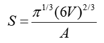
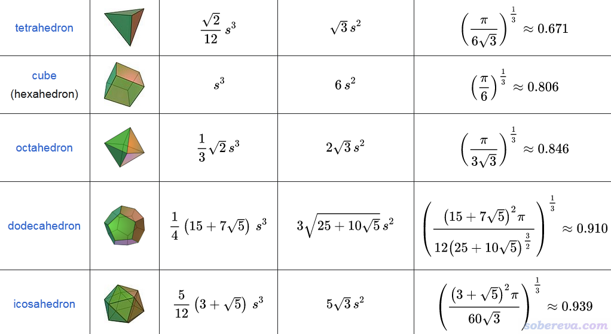
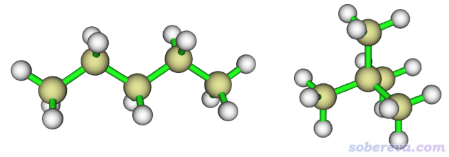
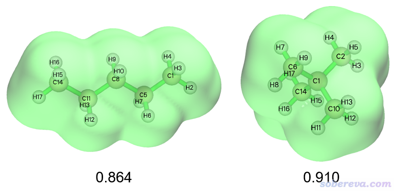
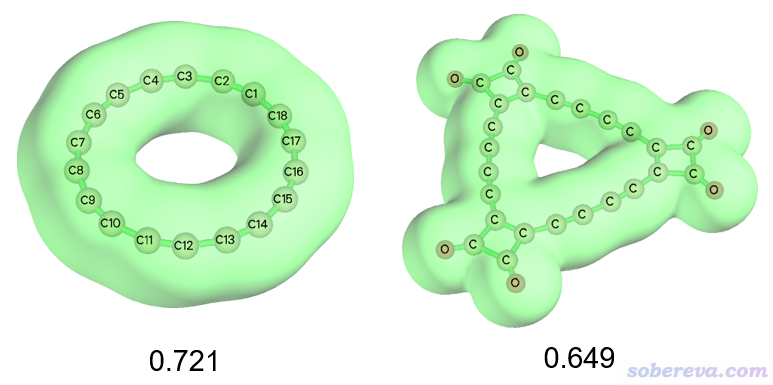

**使用Multiwfn计算分子的球形度（sphericity）**

Calculating sphericity of molecules using Multiwfn

文/Sobereva@[北京科音](http://www.keinsci.com)  2023-Mar-21

最近有人在计算化学公社论坛发帖问有没有办法度量一个分子的“球形度”，正好笔者开发的功能全面的波函数分析程序Multiwfn有现成的功能，这里就写个小文介绍一下，并以度量正戊烷和新戊烷的球形度差异作为例子。Multiwfn可以在<http://sobereva.com/multiwfn>免费下载，读者必须使用2021-Mar-16及以后发布的Multiwfn版本。不了解Multiwfn者参见《Multiwfn FAQ》（<http://sobereva.com/452>）。

## 1 原理

物体的球形度（sphericity）没有唯一的衡量方法，一个比较知名的方法是用下式计算。

式中A是物体表面积，V是物体的体积。这种球形度的定义原理是：众所周知同等体积下理想球体的表面积是最小的。上式中分子项是具有与当前体系相同体积的理想球体的表面积，分母项是当前体系的实际表面积，显然S越接近于1，体系越接近理想球体，而S越小说明体系偏离球体越显著。这种定义只考虑体系的外形，而不考虑内部密度分布。显然这种定义也不适用于体系内部存在孔洞的情况。

<https://en.wikipedia.org/wiki/Sphericity>上给出了不同形状的物体的球形度的对比：

将这种定义用于衡量分子的球形度时，可以将分子的电子密度的等值面的面积以及里面包围的体积代入到式中。一般可以用电子密度=0.001 a.u.的等值面，这常被用于描述分子在孤立状态下的范德华表面，这样的等值面非常光滑。

## 2 例子：正戊烷和新戊烷的球形度计算

正戊烷（n-pentane）和新戊烷（neopentane）分别如下图左侧和右侧所示，下面用Multiwfn基于上一节介绍的原理计算它们的球形度。

Multiwfn的定量分子表面分析功能在《使用Multiwfn的定量分子表面分析功能预测反应位点、分析分子间相互作用》（<http://sobereva.com/159>）中有专门的介绍，在基于电子密度等值面构造分子表面的过程中球形度会顺带输出。为了使用此功能，用户需要提供含有波函数信息的文件作为Multiwfn的输入文件，例如mwfn、fch、wfn、molden等，产生方式在《详谈Multiwfn支持的输入文件类型、产生方法以及相互转换》（<http://sobereva.com/379>）里有详细的介绍。这里使用Gaussian在B3LYP/6-31G*级别对这两个分子做几何优化产生的fch文件作为输入文件，可以在<http://sobereva.com/attach/661/file.rar>里直接下载，相应任务的Gaussian输入文件也给了。

启动Multiwfn，载入正戊烷的fch文件n-pentane.fchk，然后输入12进入定量分子表面分析功能，再选择6产生分子表面而不考虑任何映射到表面的函数（默认对应于0.001 a.u.电子密度等值面），然后立马就算完了，从屏幕上可以找到球形度的值：  
Sphericity:  0.8640  
还可以看到等值面的表面积和里面的体积的具体数值：  
Volume:   909.20194 Bohr^3  ( 134.72983 Angstrom^3)  
 Estimated density according to mass and volume (M/V):    0.8892 g/cm^3  
 Overall surface area:         525.31567 Bohr^2  ( 147.10337 Angstrom^2)

之后如果想看一下当前的电子密度等值面，可以在后处理菜单选选项-3。

以相同方法对新戊烷的波函数文件neopentane.fch进行计算，得到球形度为0.910。

为便于对比，两个分子的0.001 a.u.电子密度等值面和球形度如下图所示。可见新戊烷的球形度比正戊烷更高，分子表面整体也确实更接近球形。可能有人觉得二者的球形度的差异没有想象中的大，这一方面在于当前用的球形度的数值对形状本身的敏感性就不是特别大，比如正方形的球形度也能有0.806。另一方面在于新戊烷的球形度实际上也算不上很高，从下图可见新戊烷的甲基之间有明显凹陷。

## 3 总结&其它

本文介绍了Multiwfn支持的一种既简单又易于理解的分子球形度的定义，并结合实例对计算方法做了演示。Multiwfn可以计算大量分子描述符，见《Multiwfn可以计算的分子描述符一览》（<http://sobereva.com/601>），无疑球形度在特定场合可以作为一种分子描述符来使用。

笔者对18碳环（cyclo[18]carbon）做过诸多理论研究，见<http://sobereva.com/carbon_ring.html>，也对其衍生物C18(CO)6做过专门的研究，见《深入揭示18碳环的重要衍生物C18-(CO)n的电子结构和光学特性》（<http://sobereva.com/640>）里面介绍的笔者的工作。这里笔者也计算了它们的球形度，如下所示，可见C18和C18(CO)6的球形度都很低。这很理所应当，毕竟它们跟球体相差很大。相比之下C18(CO)6的球形度明显更低，这完全符合期望，因为C18(CO)6的形状明显更为突兀。此例体现了前文介绍的球形度的定义很有普适性。

