**通过量子化学计算和Multiwfn程序预测化学物质的颜色**

Predicting color of chemical substances through quantum chemistry calculations and Multiwfn program

文/Sobereva@[北京科音](http://www.keinsci.com)   2023-Mar-26

## 1 前言

颜色无疑是化学物质极其重要的特征，理论预测化学物质的颜色对于从头设计和改良化学物质有重要意义。通过量子化学计算可以模拟分子的UV-Vis光谱、通过第一性原理计算可以模拟固体和液体的UV-Vis谱，在原理上可以进而预测物质对应的颜色。一个很常见、很粗糙的预测颜色的方式是：在可见光波长范围内（一般取380-760 nm）考察吸收峰位置，根据其波长和对应的颜色的关系判断物质吸收的光的颜色，然后根据补色图得到它的补色，这就是物质实际显现的颜色，即反射或者透射光对应的颜色。每次我在北京科音初级量子化学培训班（<http://www.keinsci.com/workshop/KEQC_content.html>）里讲电子激发计算的时候也都举例介绍这种做法。这种做法虽然简单，但是准确度很有限，而且仅对于在一个波长处有简单的吸收峰的时候才适合。如果可见光区有不止一个吸收峰，或者需要考虑谱带形状对吸收的影响，这种做法无疑就不适用了。所以这种做法适合作为教学目的，而用于实际研究目的、试图准确预测化合物的颜色的时候，明显应当用更严格的做法。

本文将介绍Multiwfn支持的将物质的UV-Vis吸收光谱转化为物质显现的颜色的方法，具有极高的实用性，解决了很多人研究的实际困难。此方法原理严格，在Multiwfn中使用超级简单方便，只需要敲几下键盘，颜色就能立刻呈现在屏幕上！用户可以直接将诸如Gaussian、ORCA、CP2K等程序做TDDFT等电子激发计算得到的输出文件作为输入文件，从而“从头”预测物质的颜色，也可以将实验或者其它方式得到的UV-Vis光谱曲线数据作为输入文件来预测颜色。

本文在第2节将介绍光谱曲线转化为对应的颜色的原理。第3节将以预测靛青染料水溶液的颜色演示如何在Multiwfn中操作，输入文件是Gaussian程序在TDDFT下对其做电子激发计算的输出文件。第4节将示例如何用通过Multiwfn将网络上搜索到的诱惑红的实验UV-Vis谱转化为它对应的颜色，

读者必须使用在2023-Mar-26及以后更新的Multiwfn版本，否则没有本文说的功能。Multiwfn可以在官网<http://sobereva.com/multiwfn>免费下载，若用于发表文章必须按程序网站、手册里的明确要求以正确方式引用Multiwfn。不了解Multiwfn者可参看《Multiwfn FAQ》（<http://sobereva.com/452>）。

本文的例子涉及到的文件都可以在这里下载：<http://sobereva.com/attach/662/file.rar>。

## 2 由吸收光谱转化为颜色的方法

本节内容较长，如果只希望无脑地得到结果，直接看后面的例子就完了。

一种颜色对应于色彩空间里的一个点。色彩空间（color space）有不同的定义，常见的有CIE1931 XYZ、CIE xyY、CIELAB、CIE RGB、sRGB（standard RGB）、Adobe RGB、CMYK等。在这些色彩空间中，每种颜色通过特定的坐标描述，例如sRGB和Adobe RGB都用R（红）、G（绿）、B（蓝）作为分量表示，是范围为(0-255,0-255,0-255)的整数，但每个分量也经常用0到1范围的分数表示。CIE1931 XYZ通过X、Y、Z作为坐标表示颜色，CIE xyY通过x、y、Y表示颜色，CIELAB通过a*、b*、L*表示颜色。CIE各种色彩空间的分量的定义见<https://en.wikipedia.org/wiki/CIE_1931_color_space>和<https://en.wikipedia.org/wiki/CIELAB_color_space>。

下图是CIE色度图，里面的完整区域是人眼可识别的各种颜色。弧线轮廓上不同位置的颜色对应的是不同波长的单色光，而图内侧区域的颜色是不同波长的单色光混合所产生的颜色。图中横、纵坐标分别对应的是CIE xyY的x和y分量，二者一起体现的是色度（chromaticity），而Y分量对应的是亮度（luminance）。如果亮度为0，那么不管x和y是什么值颜色都为黑。亮度足够大时，图中(1/3,1/3)位置对应白色，而如果亮度不够，则这个点对应的是灰色。

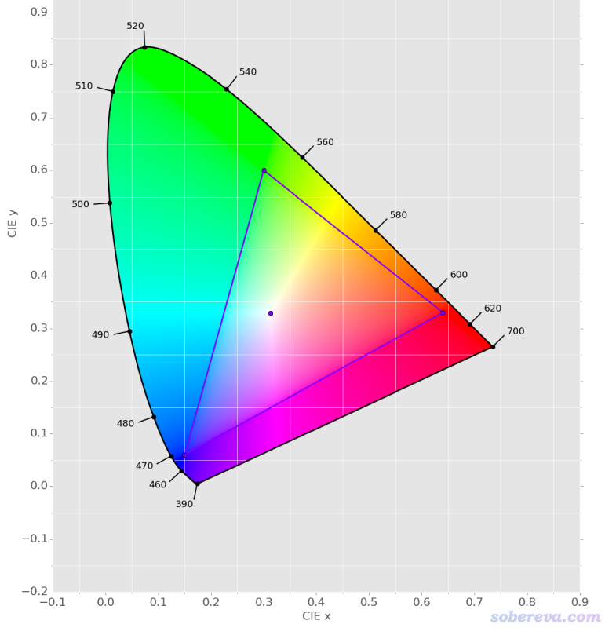

并不是所有人眼可以感受的颜色都是可以在屏幕上显示出来的，也没有任何屏幕能显示出来上图里的完整色域里的所有颜色。上图中三角形包围的区域是sRGB色域，也是绝大多数消费级显示器能显示出的颜色范围。Adobe RGB色域也是上图中的一个三角形的子集，但比sRGB包围的面积更大。现在有越来越多的中档显示器能显示出Adobe RGB色域的大部分颜色，因而比只支持sRGB色域的显示器能显示出更丰富的颜色。考虑到大多数人用的显示器还是sRGB色域的，而且绝大多数图片里的颜色也是基于sRGB色域记录的，因此预测化学物质的颜色并在屏幕上呈现出来，重点就是怎么得到物质吸收的光所对应的sRGB色域里的RGB值，之后再取其补色是很简单的事。

肯定有人会问，为什么我的显示器是sRGB色域的，但上图里在三角形以外还是显示了颜色？这是因为此图是把CIE色度图转化到了sRGB空间下，在三角形以内的颜色是你的屏幕上能如实显示的，因而其中不同位置的颜色在你的屏幕上能够区分。而在三角形以外的区域（sRGB色域无法表现的区域），上图在作图时做了特殊处理。具体来说，这些区域的x,y坐标（结合特定的Y）直接转化成sRGB色域的(R,G,B)时，会出现数值为负或者超过255的分量值，将负值取0处理、超过255的当255处理之后就得到了上图。因此上图的三角形以外区域的颜色在你的屏幕上呈现的并不是其实际的颜色，而只是对应了sRGB色域三角形区域里边界位置的颜色。

下面来说一下有了UV-Vis吸收光谱曲线后，怎么得到吸收的光对应的RGB值（下文一律说的是sRGB色彩空间的情况）。更多细节参看：  
<https://www.oceanopticsbook.info/view/photometry-and-visibility/chromaticity>  
<https://www.oceanopticsbook.info/view/photometry-and-visibility/from-xyz-to-rgb>  
<https://support.hunterlab.com/hc/en-us/article_attachments/201533555/an-1002b.pdf>

下面的公式用于把依赖于波长λ的光谱曲线Λ(λ)转化为CIE1931 XYZ的X、Y、Z值（三刺激值，tristimulus values），可见算每个值就是求一维积分而已。式中Km是发光效率，是个常数。式中带上横线的x、y、z叫做三刺激值函数（tristimulus function），或称配色函数（color-matching function）。

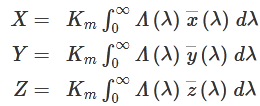

CIE1931 2º三刺激值函数如下所示，列表数据可以在<http://cvrl.ucl.ac.uk/cmfs.htm>下载。显然上式就是求光谱在这仨函数上的投影来得到X、Y、Z分量。

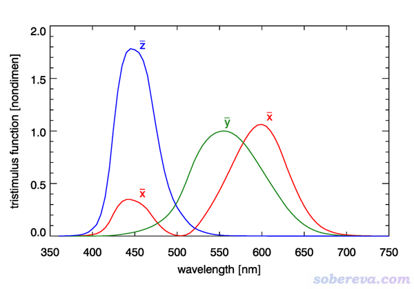

通过红、绿、蓝三种单色光并不能组合出所有人眼可以识别的颜色，但是通过以上三种三刺激值函数所分别对应的非单色光的混合则可以产生，因此任何人眼可识别的颜色都可以用X、Y、Z坐标来表示。

有了X、Y、Z后就可以按下式计算色度坐标x、y、z。这相当于对坐标做了归一化，从而去除了对光谱强度的依赖性。由于x+y+z=1，因此只有x和y是独立的，这两个值就是前述的CIE1931 xyY色彩空间的色度值，用于描述独立于亮度的颜色。CIE1931 xyY里的Y直接对应上面说的三刺激值里的Y，靠它的大小来体现亮度。

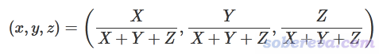

现在有了x和y，对照CIE色度图中的相应位置，就知道光谱曲线对应的什么颜色了。当然，若要与人眼感受到的颜色相对应，还需要再额外指定亮度值Y。

光谱曲线对应的x、y色度值经常超过sRGB色域而无法在sRGB色域的显示器上显示出来，因此实际中得把X、Y、Z转化为sRGB的R、G、B坐标，这只需要按下式做一个线性变换即可。各种色域颜色之间的变换关系见<http://brucelindbloom.com/index.html?Eqn_RGB_XYZ_Matrix.html>。注意此处的X、Y、Z坐标被scale到了0至1之间。

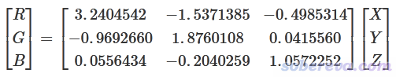

注：人眼对亮度的响应不是线性的，对深色的差异比对浅色的差异更敏感。因此很多程序将XYZ转换为RGB时还自动做Gamma校正使得RGB值被拉伸，使得0-255数值范围内能更充分地展现出人眼能分辨的颜色。具体做法是R<=0.0031308时将R替换为12.92*R，R大于0.0031308时将R替换为1.055*R^(1/2.4)-0.055，其中2.4是gamma值。对G、B分量也都这么处理。对于本文的目的这个转换没必要，反倒有碍取补色，Multiwfn也不考虑这个校正。

这么转化之后的R、G、B如果都在0到1之间，那么再乘上255并取最近的整数，就直接可以输入到比如Windows的画图、Photoshop等程序的调色板里，在显示器上显示光谱对应的颜色了。但如上转换后大概率会发现RGB的一个或多个分量小于0或大于1，也即超过了sRGB的色域范围，这时候只能做近似处理得到sRGB色域能表达的颜色。比如乘了255并取整数后，发现数值是(-358,59,266)，就得把负值当成0，超过255的当成255，即取为(0,59,255)。或者在把B调回255的同时让G也按照特定规则减小，比如等比例减小，没有唯一的做法。

如上将物质的UV-Vis吸收光谱转化为RGB坐标后，再取补色（complementary color）就是此物质展现出的颜色了。下面的图叫补色图，互相处在对面位置的两种颜色彼此构成补色。一个颜色的补色是与之对比最强烈的颜色，也可以叫相反色。图中标注的度数称为色调（hue），红、绿、蓝分别是图中0、120、240度的三个对称位置。典型的颜色对应的RGB值在图中也标注了。例如图中的海蓝色是210度的位置，在其对面位置（30度）的地方就是其补色，即橙色。

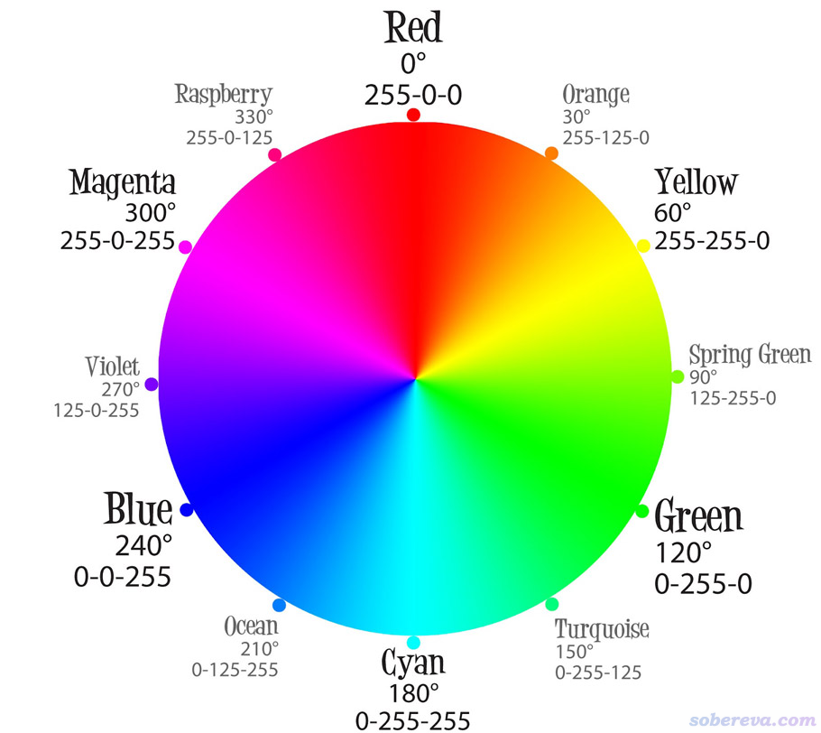

从算法上计算某个(R,G,B)值对应的颜色的补色很简单，补色颜色为(255-R,255-G,255-B)。例如红色是(255,0,0)，其补色就是(0,255,255)，即黄色。另外还要注意亮度问题。例如(255,255,155)是浅黄色，直接算出来的补色是(0,0,100)，对应的是深蓝色，二者不仅在色度上有差别，在亮度上也有极大的差别。如果要得到亮度相同而仅在色调上有差异的补色，需要平移补色的RGB值使其最大分量与原颜色相同，对此例也即给(0,0,100)各分量都增加155成为(155,155,255)使得最大分量和之前一样同为255，此颜色对应的是淡蓝色。上面的补色图中的所有颜色的亮度都是相同的，因为最大分量都是255。注意亮度值有不同计算方式，这里取最大分量值作为亮度的衡量标准是Hue Saturation and Brightness (HSB)色彩模型所使用的，其亮度（B）参数定义为max(R,G,B)/255*100%。

一种化学物质对光的吸收整体越强，由于反射和折射光越弱，无疑看到的颜色就越暗，反之亦然。因此考察其展现的颜色看似应当按(255-R,255-G,255-B)直接取补色。但实际中并无法得到物质透射和反射光的绝对的亮度，故考察物质显现的颜色时在取补色时只需要体现色调的差异就够了，可以把RGB最大分量都统一平移到255。

至此，从物质的吸收光谱转化到其展现的颜色涉及的知识讲述完毕，下面就是具体例子了。

## 3 实例：通过理论计算从头预测靛青染料的颜色

下图给出了靛青（indigo）的结构、水溶液的实际颜色、水溶液的实验光谱（下图中虚线）。下面就要基于量子化学计算和上一节介绍的原理在Multiwfn中从头预测它的颜色，看看和实际是否相符。

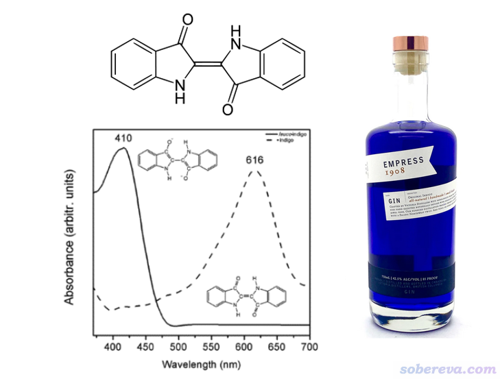

此例的量子化学计算使用非常常用的Gaussian 16，通过最主流的TDDFT方法做电子激发计算，其输出文件用于给Multiwfn绘制光谱并预测颜色。如果读者对量子化学计算和光谱的模拟缺乏常识知识，请先参看《Gaussian中用TDDFT计算激发态和吸收、荧光、磷光光谱的方法》（<http://sobereva.com/314>）和《使用Multiwfn绘制红外、拉曼、UV-Vis、ECD、VCD和ROA光谱图》（<http://sobereva.com/224>）。如文中所述，用Gaussian不是必须的，还有很多其它选择，比如ORCA、CP2K等。用户还可以把任意程序计算的激发能和振子强度写成标准的文本文件作为Multiwfn的输入。凡是能用于Multiwfn绘制UV-Vis光谱的输入文件一律都可以用来预测颜色。

本文的文件包里indigo_S0opt.gjf是靛青分子在IEFPCM模型表现的水环境下在常用的B3LYP/6-311G*级别下做基态的优化和振动分析的输入文件，从相应的out文件可见没有虚频，体系是完全平面的。基于优化完的结构创建TDDFT的输入文件indigo_TDDFT.gjf，使用B3LYP/def2-TZVP级别做TDDFT算最低20个激发态，依然用IEFPCM表现水环境。其输出文件indigo_TDDFT.out在本文的文件包里提供了。

启动Multiwfn，载入indigo_TDDFT.out，然后输入  
11   //绘制光谱  
3   //UV-Vis  
25   //基于光谱计算颜色

现在在屏幕上会看到在CIE1931 2º三刺激值函数有定义的360到830 nm区间内的UV-Vis吸收光谱，如下所示，在可见光范围内吸收峰约在590 nm

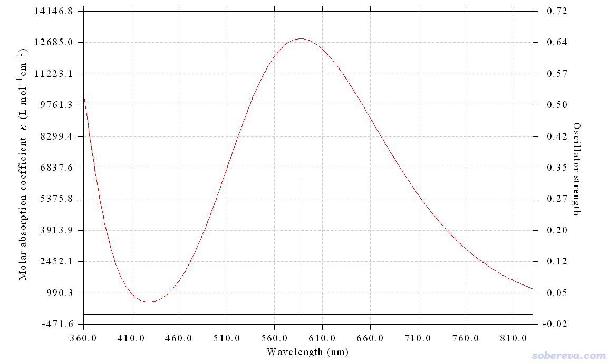

在图上点右键关闭光谱图，然后马上就蹦出来下图。color是光谱对应的颜色，complementary color是其补色。下面的Maximum brightness of above colors是上面两种颜色的RGB最大值都平移到255的情况，使得光谱颜色和补色只有色度的差异而没有亮度的差异。对于基于吸收光谱预测物质颜色，一般就看上图的右下角的颜色即可。上图说明，水中的靛青吸收的是黄色光，显现出的颜色是蓝色，这和实际中靛青的颜色完全一致，**靠理论计算预测靛青的颜色大成功！**

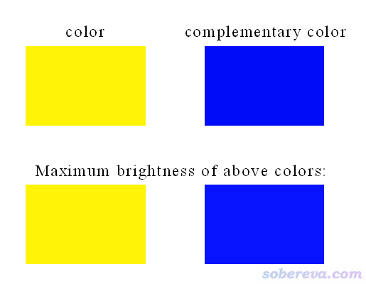

此时在Multiwfn的文本窗口还显示了颜色相关的具体数值，如下所示。可见由XYZ直接转化成的RGB值超过了sRGB色彩空间，因此Multiwfn自动做了处理。  
 CIE1931 XYZ:              1077992.509       1123653.902        188673.482  
  Fractional CIE1931 XYZ:      0.9593634718      1.0000000000      0.1679106720  
  CIE1931 xy:              0.4509825283      0.4700851571  
  Note the R,G,B values show below correspond to standard RGB (sRGB) color space  
  RGB (0-1):    1.487926  0.953110  0.026876  
  RGB (0-255):   379   243     7  
  Note: The color exceeds sRGB color space! Now the R,G,B values are scaled into  
 valid range:  
  RGB (0-1):    1.000000  0.953110  0.026876  
  RGB (0-255):   255   243     7  
  RGB of complementary color:     0    12   248  
  RGB of original color (maximum brightness):        255   243     7  
  RGB of complementary color (maximum brightness):     7    19   255

在显示颜色的窗口上点右键关闭后，Multiwfn会问你是否把这些颜色保存成图像文件，如果选y，则当前目录下就会出现以DISLIN为开头的图像文件，内容和窗口里显示的一致。

如果在此之后再选0让Multiwfn绘制光谱，看到的光谱将和预测颜色功能顺带给出的光谱相一致，因为使用选项25时Multiwfn自动会将横坐标设为360到830 nm（与此同时绘制的点数设为了471，因此点的间隔为1 nm）。

## 4 使用Multiwfn对任意方式得到的UV-Vis光谱计算对应的颜色

为了让Multiwfn基于光谱曲线预测颜色的功能有最大程度的灵活性和普适性，我令Multiwfn也能够基于任意方式获得的光谱曲线预测颜色，用户只需要提供记录光谱曲线的文本文件作为输入文件即可，第一列为是以nm为单位的横坐标，第二列是吸收曲线值。作为例子，此例用Multiwfn基于诱惑红（Allura red）的实验UV-Vis曲线预测它的颜色。

首先要获得诱惑红的UV-Vis光谱数据文件。用Google的图片搜索功能搜Allura red UV-Vis，马上就能找到好多此体系的UV-Vis谱，随便点开一个，比如下图

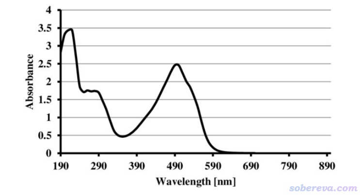

然后用WebPlotDigitizer（<https://apps.automeris.io/wpd/>）在线工具获得此光谱曲线的XY数据点。做法是：  
(1)先把搜到的光谱图保存下来，然后拖到WebPlotDigitizer的窗口里，依次点Align Axes、Proceed按钮  
(2)依次点击坐标轴这些位置：(190,0)、(890,0)、(190,0)、(190,4)，然后点击网页右边的Complete按钮，把X-axis的Point 1和Point 2分别设为190和890，Y-axis的Point 1和Point 2分别设为0和4，然后点OK  
(3)在网页右边的颜色方块上点左键，选择黑色（即光谱图中曲线的颜色），然后点Done。网页右边点Box，然后在图片上拖拽一个方框以把图片中曲线部分完全框住  
(4)在网页右下侧的Algorithm里选择X Step w/ Interpolation，ΔX Step设2，Smoothing设100，然后点Run。此时会看到下图，可见光谱曲线被充分采样了

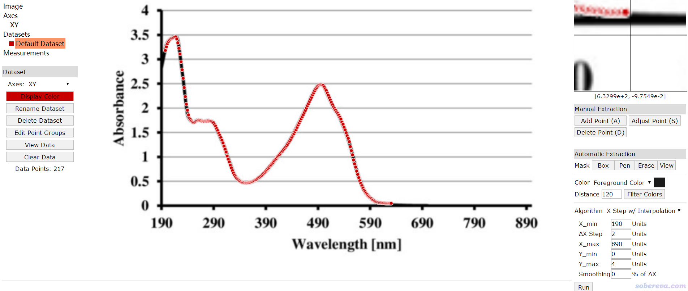

点击网页左边的View Data，在新窗口里点击Copy to Clipboard，然后把数据粘贴到文本文件里，保存为光谱曲线数据文件spectrum.txt。此文件已经提供在了本文的文件包里。当前这个曲线数据对应190-890 nm，数据点间隔为2 nm。Multiwfn对用户提供的曲线数据的数据范围和数据点间隔没有强制要求，在预测颜色的过程中会自动插值得到所需要的位置的光谱值。

启动Multiwfn，载入spectrum.txt，然后依次输入11、0，马上预测出的光谱就显示出来了，如下所示。与此同时具体颜色参数值也在文本窗口里显示了。

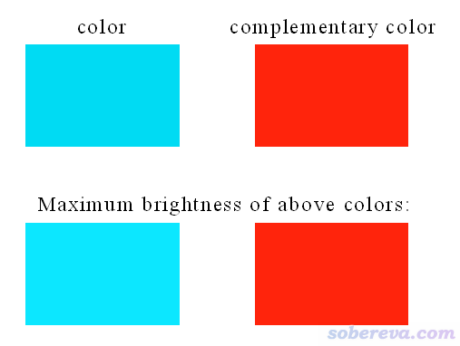

上图显示出诱惑红的吸收光谱曲线对应的补色是红色，和诱惑红的实际颜色完全一致！

## 5 总结&其它

本文介绍了基于物质的UV-Vis吸收光谱预测其颜色的原理，并介绍如何通过Multiwfn极其简单方便地实现这个目的。由本文的例子可见整个过程容易极了，还不需要任何额外耗时。对于经常做电子激发计算的理论化学研究者，如果发现自己研究的物质在可见光区域内有吸收，都不妨用此文的方法预测颜色并且在文中提及，可以令文章的信息更加充实。本文的方法也可以指导研究者理论设计染料、色素类物质。

本文介绍的预测颜色的方法也非常有教学意义。在讲量子化学计算时，如果能让学生体会到靠简单的步骤就能得到物质的准确的颜色，绝对会令他们很有快感和成就感。

本文虽然以分子体系为例，但同样的过程也完全可以用于预测晶体等周期性体系的颜色，比如可以用CP2K做周期性体系的TDDFT计算的输出文件作为Multiwfn的输入文件然后按前例操作。CP2K做TDDFT的计算介绍见《使用CP2K结合Multiwfn对周期性体系模拟UV-Vis光谱和考察电子激发态》（<http://sobereva.com/634>），笔者在北京科音CP2K第一性原理培训班（<http://www.keinsci.com/workshop/KFP_content.html>）里也都有详细讲授。

从本文的例子可见用Multiwfn预测颜色的原理严格，但得到真实的物质颜色的前提之一是做电子激发用的体系的几何和计算模型和实际有可比性。如果体系同时存在多种比例不小的构象，而且不同构象的UV-Vis光谱在可见光区域差异不小，就必须考虑构象权重平均才可能得到靠谱的颜色，参看《使用Multiwfn绘制构象权重平均的光谱》（<http://sobereva.com/383>）。和Multiwfn常规方式绘制构象权重平均光谱一样，用multiple.txt作为输入文件，然后依次输入11、3、25让Multiwfn预测颜色即可。

考虑振动耦合有助于得到更准确的光谱曲线，某些情况下对于预测的颜色有不可忽视的改进。但由于考虑振动耦合又麻烦又耗时，故本文第3节的例子没考虑此问题，感兴趣的读者可以看《振动分辨的电子光谱的计算》（<http://sobereva.com/223>）。Gaussian等程序做这种计算给出的考虑振动耦合的光谱曲线数据改写成两列的txt数据后就可以直接作为Multiwfn的输入文件按照第4节的例子预测颜色了。

本文的例子说的都是基于吸收光谱预测物质的颜色，取的是Multiwfn窗口中给出的complementary color下面的颜色。显然也可以用Multiwfn预测物质发射的光的颜色。比如要预测荧光的颜色，可以按照《Gaussian中用TDDFT计算激发态和吸收、荧光、磷光光谱的方法》（<http://sobereva.com/314>）里面说的绘制荧光的方法操作，只不过在绘制光谱界面里最后不是选0来绘制光谱图，而是选25得到光谱曲线对应的颜色，届时直接取Multiwfn给出的图中的color下面的颜色即可（而此时一起给出的补色就不用管了）。

最后提醒一下，使用Multiwfn做任何事情，包括按本文预测颜色，请不要忘了恰当引用Multiwfn的原文。
