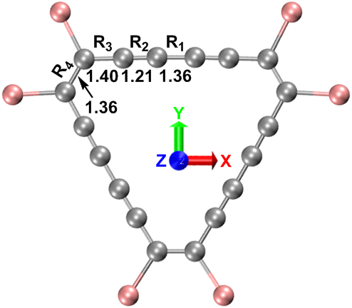
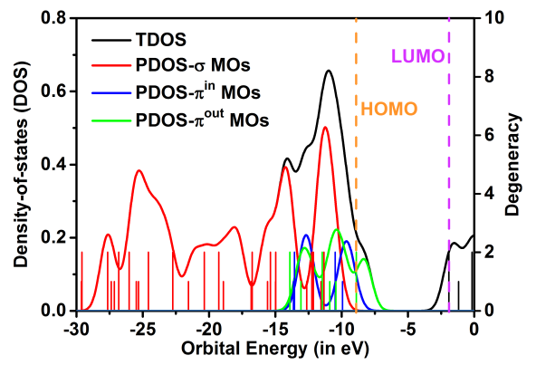
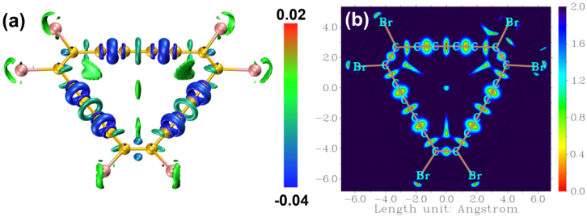
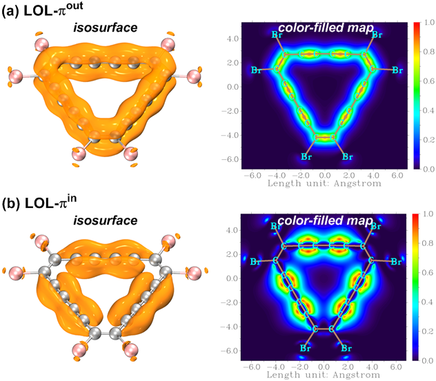
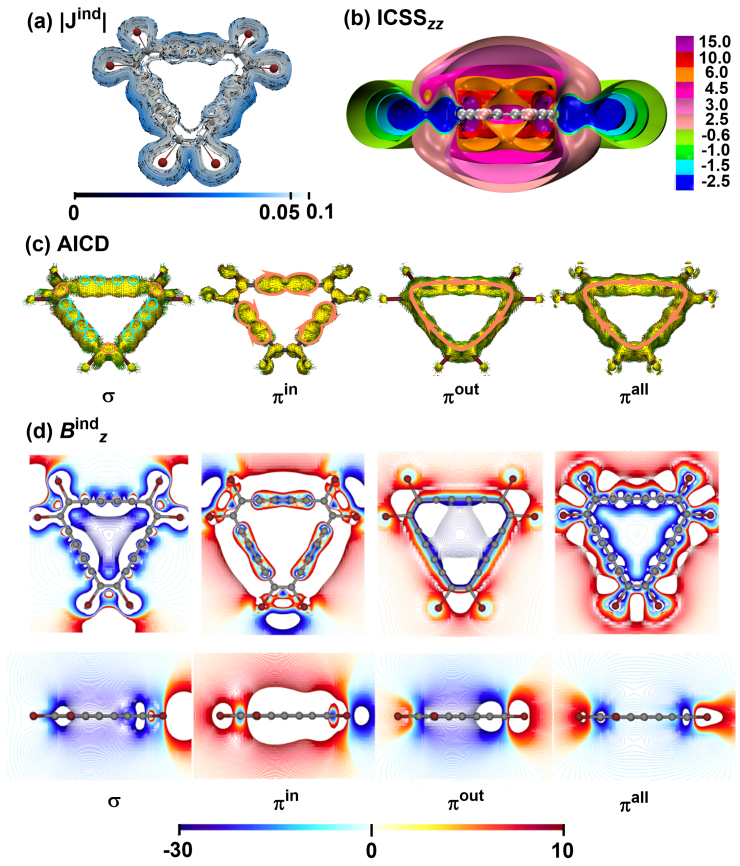

**注**：本文是江苏科技大学的刘泽玉、北京科音自然科学研究中心的卢天等人2023年在欧洲化学刊物发表的Electronic Structure and Aromaticity of an Unusual Cyclo[18]carbon Precursor, C18Br6, *Chem. Eur. J.*, e202300348 (2023) <https://doi.org/10.1002/chem.202300348>一文的主要内容的译文，本文章由刘泽玉翻译和提供。欢迎在阅读本文后进一步阅读原文和引用。

更多的18碳环及相关体系的理论研究工作参见[**http://sobereva.com/carbon_ring.html**](http://sobereva.com/carbon_ring.html)中的汇总。

**不寻常的环[18]碳前驱体C18Br6的电子结构和芳香性**

**Electronic structure and aromaticity of the unusual cyclic[18]carbon precursor, C18Br6**

王霞，刘泽玉*，汪娇娇，卢天*，熊维伟，闫秀芬，赵梦迪，Mesías Orozco-Ic*

**摘要**：本文通过分子轨道（MO）、态密度（DOS）、键级（BO）和相互作用区指示符（IRI）等方法，对稳定的环[18]碳（C18）前驱体C18Br6的电子结构和成键特征进行了全面的表征。利用定域化轨道定位函数（LOL）和电子定域函数（ELF）研究了成键区平面外和平面内π电子（分别记为πout和πin）的离域特性。通过计算磁感应电流密度（Jind）、等化学屏蔽表面（ICSS）、感应电流密度的各向异性（AICD）、感应磁场（Bind）和分子对外部磁场的磁响应来研究C18Br6的芳香性问题。所有这些分析表明C18Br6是一种比环[18]碳芳香性低的全局芳香分子， -Br取代基对平面内π-共轭（记为πin-共轭）的破坏是分子芳香性减弱的根本原因。

## 引言

环[18]碳（C18）是由18个sp杂化的碳原子依次连接而成的全碳分子，其作为一种新型碳同素异形体，长期以来备受关注。2019年和2020年，这种环状分子在凝聚相中通过扫描隧道显微镜（STM）/原子力显微镜（AFM）被两次制备并结构表征。随后，C18及其类似物的性质便引发了理论分析和预测的研究热潮。

首次合成环[18]碳是在5K下通过对Cu(111)/双层NaCl表面上的环碳前驱体分子进行原子操作，通过一步或多步从环碳氧化物前驱体C18(CO)6中消除-CO基团完成的。而第二次成功合成是通过对溴环碳前驱体C18Br6进行脱卤实现的。两个开创性实验中的反应前驱体C18-(CO)n（n = 6, 4和2）和C18Br6都是具有高度对称性的平面环状结构，属于富碳分子范畴。与因具有高活性而难以捉摸的C18相比，这四种前驱体分子在环境条件下是稳定的，其中一些甚至已经通过X射线衍射被确定了结构。事实上，早在1991年就有证据表明气相反应中存在类似或相同的中间体。基于这一现实，至少在现阶段，探索富碳前驱体C18-(CO)n（n = 6、4和2）和C18Br6的物理化学性质和应用前景更具有现实意义。

电子离域和芳香性通常是闭环分子的主要研究主题，特别是当它们具有良好的平面性和高度对称性时。Baryshnikov和其同事证明了基态环[18]碳的顺时针感应环电流主要来自于分别位于分子平面外和分子平面内的两套互相垂直的π电子系统，证明了该碳环具有双重芳香性。Charistos和Muñoz-Castro通过分析C4n+2环的面外π分子轨道（称为πout-MOs）和面内π分子轨道（称为πin-MOs）对感应磁场的贡献，也得出了相同的结论。此外，Dai等人报道的工作揭示了C18在其最低激发态T1时是反芳香性的。最近，我们通过量子化学计算结合多种波函数分析方法，对C18及其类似物的各种性质和潜在应用进行了广泛的研究，包括C18的两组π电子系统引起的双重芳香性以及前驱体C18-(CO)n（n = 6, 4和2）芳香性的取代基依赖性，见《深入揭示18碳环的重要衍生物C18-(CO)n的电子结构和光学特性》（<http://sobereva.com/640>）。其他一些环[18]碳的衍生物也被认为在外磁场作用下会产生削弱环内区域磁场的感应环电流，显示出芳香性特征。在本工作中，我们对另一种重要的C18前驱体C18Br6的电子结构和芳香性进行了理论计算和分析，并着重揭示了它们的本质。

## 计算细节

采用Gaussian 16(A.03)程序，在ωB97XD/def2-TZVP水平下对C18Br6进行了几何优化和频率分析，在同一理论水平上计算分子对外部磁场的磁响应研究该前驱体的芳香性特征。基于Gaussian程序的输出文件，利用AICD程序实现感应电流密度各向异性（AICD）分析，并通过POV-Ray渲染生成图片。基于Gaussian程序的格点文件，通过GIMIC代码完成磁感应电流（GIMIC）分析，并通过ParaView可视化程序绘制图形和动画。通过对流经一个或多个化学键的垂直平面的电流密度进行积分计算感应环电流强度（Jind）。此外，我们还利用Aromagnetic程序计算了感应磁场（Bind）。利用自然化学屏蔽（NCS）分析结合去除价电子（RVE）方法计算核心和σ电子磁响应，获得了它们的轨道贡献。外加磁场平行于最高对称性分子轴施加，由于分子处于XY平面上，该轴与分子Z轴重合。因此，z分量对Bind（Bindz）是最重要的贡献，并且Bind分析只需要关注Bindz分量。众所周知，核独立化学位移（NICS）可以使用三个笛卡尔方向的外部磁场的Bind的平均强度来解释。因此，在这些条件下，NICS的Z分量（NICSzz）等同于Bindz。波函数分析在ωB97XD/def2-TZVP计算结果的基础上用Multiwfn 3.8(dev)代码进行。各种实空间函数的等值面由VMD软件根据Multiwfn导出的cube文件进行渲染。各种实空间函数的彩色填充图通过Multiwfn代码直接绘制。

## 结果与讨论

C18Br6在ωB97XD/def2-TZVP计算水平下的基态几何结构如图1所示，相应的笛卡尔坐标见表S1。在气相中优化的C18Br6是具有D3h对称性的严格平面结构。值得一提的是，C18Br6的单晶结构已经在CS2溶液中生长出来，X射线分析显示，C18Br6分子在堆积环境中只有较低的C2对称性，这与其气相分子几何结构不同。

图1气相中ωB97XD/def2-TZVP水平下优化的C18Br6几何结构。原子颜色：C，灰色：Br，粉红色。

### 电子结构

正则分子轨道（MOs）分析表明，C18Br6具有三组价分子轨道，即σ-分子轨道、πout-分子轨道和πin-分子轨道。关于环碳及其衍生物的三种类型的MOs的讨论见文献[14,17,20]。

MOs的态密度（DOS）图可以清晰地显示轨道的能量分布。C18Br6的占据分子轨道总的DOS（TDOS）和部分DOS（PDOS）曲线如图2。计算得到的最高占据MOs（HOMO）和最低未占据MOs（LUMO）之间的能量差，即HOMO-LUMO 能隙为6.50 eV，略小于在相同水平下计算得到的C18的能隙（6.75eV）。σ-MOs的能量远低于π型轨道的能量，而πin-MOs和πout-MOs的能级相当。DOS图中尖峰的高度表明相当多的MOs是双简并的，这是由于C18Br6具有高对称性结构。此外，在HOMO水平之上有一个小的PDOS-πout峰，这可以被认为是一个小的浅层陷阱，并可能导致热调节的导电性能。

图2 C18Br6的TDOS和PDOS（曲线）及其简并度（竖线）

### 成键特性

键级（BO）是化学键分析中的一个重要概念，它可以量化键的多重性及强度。计算的C18Br6的Mayer、Fuzzy和Laplacian BOs以及相应的键长显示在图S1中。分子的键长与BOs之间有很好的相关性，描述成键特征的各种BOs的结果在定量上是一致的。C18Br6被证明是一个像C18环一样具有长短C-C键交替的多炔结构。由于其长键和短键的BOs分别明显偏离整数值1和3，因此不能简单地将长键和短键视为理想的单键和三键，这恰恰说明分子中C-C键上存在着电子离域现象。

相互作用区域指示函数（IRI）是一个直观且有用的实空间表示工具，能够揭示化学键的存在和种类以及原子或分子片段之间的弱相互作用。如图3（a）所示，编号为R1和R2的C-C键周围的π-MOs的IRI等值面（标记为IRI-π）是环状的，就像C18中的长键和短键一样，表明它们表现出双重π共轭特性。然而，与-CBr基团相邻的C-C键，即R3和R4，周围的IRI-π等值面并没有形成一个封闭的环形带，而是只分布在分子平面的上、下两侧。这种π离域特性归因于典型的单组π电子分布，根据等值面的位置判断这应该属于πout系统。显然，Br原子的存在破坏了全碳原子C18分子的πin电子共轭，导致不同化学环境下C-C键的π电子构型不同。从IRI-π等值面可以推断出，C18Br6骨架中C-C键的π电子密度大小顺序为R2（强）> R1（弱）> R3和R4（部分截断）。图3 (b)中显示的环上0.5 Å处的IRI-π的彩色填充图，为等值面内部的特征提供了更深入的了解。

图3 C18Br6的IRI-π：（a）等值面图和（b）环上0.5 Å处的彩色填充图。等值为1.2 a.u.以及颜色条的刻度以a.u.给出

### 电子离域

定域化轨道定位函数（LOL）和电子定域函数（ELF）是流行的用于显示三维空间中化学系统电子离域程度的实空间函数。在这一节中，LOL和ELF函数都被用来图形化地揭示C18Br6的电子离域。

πout-和πin- MOs（分别记为LOL-πout和LOL-πin）的LOL函数等值面和填色图如图4所示。通过与C18的相关图比较，发现图4（a）中的πout电子离域与分子上没有-Br取代基时的πout电子离域一致，而图4（b）中的πin电子离域在-Br取代位置处明显被截断。在LOL-πout和LOL-πin的等值面和平面填色图中可以分别看到沿碳骨架的等高线宽度和颜色的交替变化，这反映了C18Br6两个π系统的不均匀离域，即长C-C键上的电子离域不如短C-C键上的电子离域明显，就像C18环所表现的那样。

图4 C18Br6的LOL-π：(a) 环上0.5 Å处的LOL-πout的等值面和平面填色图； (b) 环平面上LOL-πin的等值面和平面填色图。等值线为0.5 a.u.。颜色条的刻度以a.u.给出

我们还绘制了C18Br6 πout-和πin-系统的ELF函数(分别记为ELF-πout和ELF-πin)，其化学意义与LOL函数不同，但也可以描述分子骨架中的电子离域现象，如图S2所示。ELF-π的等值面和彩色填充图都指向与LOL-π分析得到的相同结论。不同之处在于ELF等值面比LOL的要宽得多，显得臃肿，这正好有利于定量分析。计算了C18Br6中长C-C键的二分值，且ELF-πout和ELF-πin的二分值分别不超过0.55和0.45。在相同计算水平下C18的对应值均在0.55左右，说明C18Br6的πin电子离域强度明显弱于C18，但两者的πout电子离域强度相似。

AV1245指数是研究电子离域的定量指标。我们已将其应用于C18及其环氧碳化合物前驱体C18-(CO)n (n = 2, 4, 6)的研究，并获得了有用的见解。计算得到C18Br6的πout和πin电子在18个碳原子轨道上的AV1245值分别为1.90和-0.26。从AV1245的值可以明显看出，πout电子的AV1245值较大，表明碳环上存在显著的πout电子离域，而πin电子的AV1245值较小，意味着πin全局离域的程度可以忽略不计。AV1245的计算结果定量地证实了上述关于C18Br6电子离域的论断。

### 芳香性

对于处于外部磁场中的芳香分子，负责芳香性的电子倾向于产生顺时针感应环电流，这反过来又会诱导与外部磁场相反的二次感应磁场。观察图5（a）中的磁感应电流密度（Jind）的结果，确认了C18Br6的整体芳香性，因为它对沿碳骨架和Br原子周围流动的各向异性环形电流做出了反应。环电流强度沿着与R1（或R4）键相交的平面的积分导致净电流为8.21 nA/T。在支持信息中，我们提供了磁感应电流密度流线的动画，显示了感应环电流的动态通量。图5(b)显示了C18Br6在垂直于环形平面的外部磁场诱导下不同等值的等化学屏蔽图（通常称为ICSSzz）。C18Br6内部突出的屏蔽区和环周围的圆形去屏蔽等值面进一步证实了C18Br6是芳香族的结论。图S3中ICSSzz的彩色填充图清楚地显示了环内磁屏蔽效应和环外的去屏蔽效应的平滑过渡。图5(c)中π电子的AICD图（表示为AICD-π）显示，环电流是由πout电子引起的，而πin电子只在R2键周围形成局部电流回路。所以，Bindz计算得出C18Br6环内部和上方的Bindz值为负，且在环上方显示出一个所谓的屏蔽锥。由于强环电流的通量，这种远距离屏蔽锥是平面和三维芳香分子的典型特征。由于核心电子对有机分子的磁响应没有显著影响，对感应磁场的轨道贡献分析表明σ-和πout电子主导着C18Br6上的磁屏蔽，如图5(d)所示。然而，这并不意味着σ电子对环电流有贡献。如AICD-σ图所示，σ电子仅对编号为R4的C-C键上的局部环形电流有响应。从数值上来看，C18Br6的Bindz(1)计算值约为-5.0 ppm，明显小于C18的相应值（-23.7 ppm），与前驱体C18(CO)6的（-5.4 ppm）相似，这意味着C18Br6的芳香性应该与C18(CO)6的芳香性相近，但弱于环[18]碳的芳香性。因此，C18Br6只有πout芳香性，而不像环[18]碳那样具有双重（πout + πin）芳香性，这与轨道相互作用分子、定域化轨道定位函数以及电子定域化函数分析得到的化学键特征和电子离域图像一致。最后，可以合理地解释C18Br6的芳香性相对于C18降低，这是由于C18具有两组全局π电子共轭系统，而C18Br6和C18(CO)6的πin共轭由于取代基的存在而被阻断。

图5 C18Br6对外部磁场的磁反应：(a)C18Br6平面附近的|Jind|的图(1 a.u. = 100.63 nA/T/Å2)。箭头表示电流密度的方向。(b)C18Br6的轨道AICD图，和(c)在C18Br6平面（顶部）和横向滑动（底部）绘制的总的和它们的(core +σ)-，πout，和πin电子轨道贡献的Bindz的彩色填充图。由负值（或正值）包围的白色区域对应于屏蔽（或去屏蔽）量级大于为色标选择的数值的区域。外部磁场垂直于环形平面并指向上方

## 结论

我们从定性和定量分析的角度对一种不寻常的C18前驱体C18Br6的电子结构和芳香性进行了理论研究。分子几何优化和键级分析确定了C18Br6的环碳骨架结构具有交替的长、短C-C键，与环[18]碳和C18(CO)n (n = 6, 4和2)相似。MOs分析显示，C18Br6有三组由不同类型电子组成的轨道系统。IRI分析确定，这三种MOs以不同的方式分布在长短C-C键上。在-Br取代后，πout系统保持不变，但πin轨道在环碳骨架上的-Br取代基附近被破坏，这导致C18Br6中πout系统整体离域，而πin电子只在局部区域离域。该推断被实空间函数定域化轨道定位函数和电子定域化函数分析进一步所证实。电子定域化函数的二分值和AV1245指数量化了πout和πin电子系统在C18Br6中的离域程度。磁响应计算结果表明，C18Br6表现出沿碳骨架和Br核周围流动的顺时针感应环电流，并推断其具有全局芳香性。这一结论得到了ICSSzz分析的进一步支持。对电流感应密度的各向异性和诱导磁场的轨道贡献揭示了πout电子是C18Br6的芳香性的原因。由于-Br取代基的存在导致π共轭的破坏，降低了C18Br6环碳骨架的整体芳香性，导致其分子芳香性弱于环[18]碳，与C18(CO)6相当。本工作的相关结果有助于进一步理解富碳环状分子的芳香性，并为引入取代基对电子离域的影响提供了新的见解。
