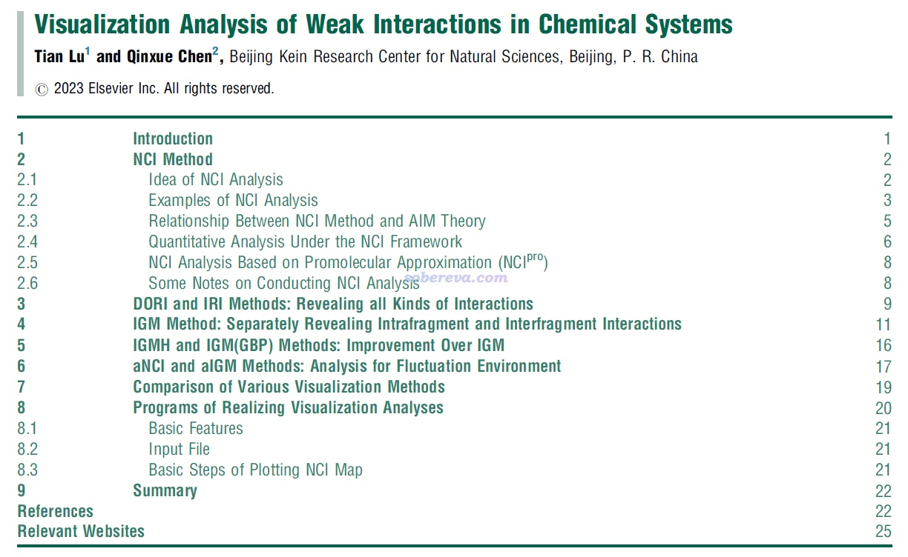
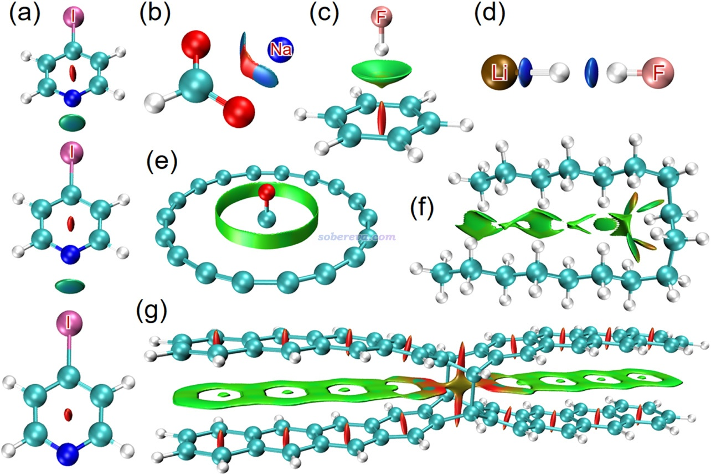
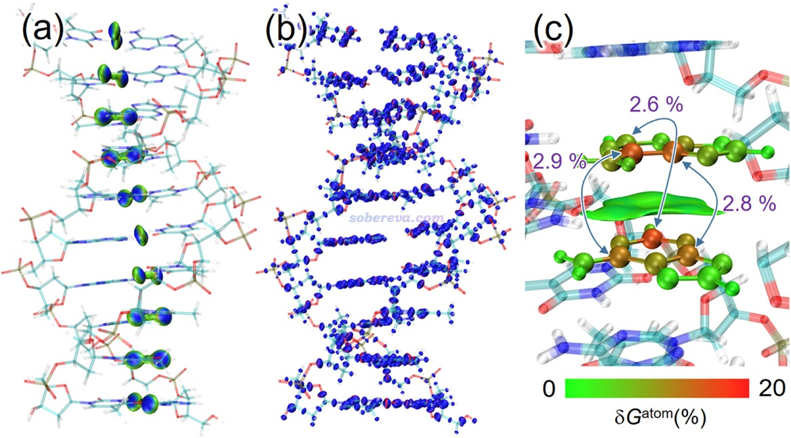
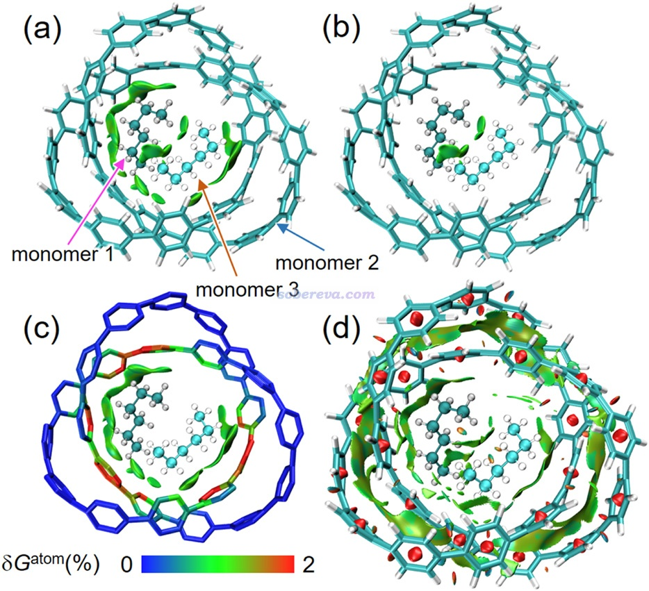
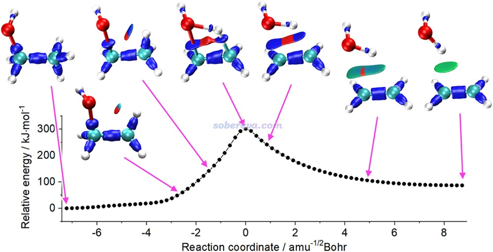

**2025-7-11补充**：《Angew. Chem.上发表了全面介绍各种共价和非共价相互作用可视化分析方法的综述》（<http://sobereva.com/746>）介绍的笔者发表的综述文章也包含大量弱相互作用可视化分析方法的介绍，和本文内容有极大的互补性，非常推荐阅读！

**一篇最全面介绍各种弱相互作用可视化分析方法的文章已发表！**

The most comprehensive article introducing various visual analysis methods of weak interactions has been published

文/Sobereva@[北京科音](http://www.keinsci.com)

First release: 2023-May-31    Last update: 2023-Dec-1

弱相互作用研究是21世纪化学领域研究的重点和热点之一。自从2010年NCI（也称RDG）弱相互作用可视化分析方法诞生以来，弱相互作用的可视化分析迅速得到了非常广泛的应用，已经是研究弱相互作用的标准方法之一。在此之后，各种弱相互作用可视化方法得到了不断发展，诞生了aNCI、DORI、IGM、IRI、IGMH、aIGM等分析方法，不同方法各具特色，衍生出了各种概念。另外，经典的Atoms-in-molecules理论中的拓扑分析也与这些方法有着紧密联系。这些分析方法全都实现在了强大、高效的波函数分析程序Multiwfn（<http://sobereva.com/multiwfn>）中。

在Paul Popelier教授的邀请下，北京科音自然科学研究中心的卢天和陈沁雪编写了Elsevier即将出版的Comprehensive Computational Chemistry丛书当中第3部The Analysis of Chemical Bonding and the Interpretation of Wave Functions中的一章，篇名为Visualization Analysis of Weak Interactions in Chemical Systems，这是目前最全面、最完整、最系统、最详尽的介绍迄今所有弱相互作用可视化分析方法的文章。此文内容十分丰富，包含超过16000词和17副图片，将各种方法的思想、原理、内在联系、优缺点、适用场合、实现程序、计算要点等方面做了十分完整的介绍和归纳，使得广大化学研究者在阅读后能充分了解这些分析方法的背景知识并恰当利用他们研究各种弱相互作用问题。文中给出了巨量应用实例，涵盖小分子团簇、配合物、主-客体复合物、分子晶体、层状固体、固体表面、溶液、配体-蛋白质复合物、核酸、化学反应路径等等，充分展现出弱相互作用可视化分析方法在研究化学问题上的不可替代的关键性价值。此外，文章在撰写时力求深入浅出，只要是具有量子化学入门水平的研究者就可以读懂。

非常欢迎大家阅读此文！访问地址为[**https://doi.org/10.1016/B978-0-12-821978-2.00076-3**](https://doi.org/10.1016/B978-0-12-821978-2.00076-3)，链接：<https://pan.baidu.com/s/1snPEcX2PiY7KazxROT-PdA?pwd=lo0n>。Multiwfn用户在使用Multiwfn做各种弱相互作用可视化分析时，除了引用Multiwfn原文和相应分析方法原文外，**也非常推荐一同引用此文**，引用方式（可根据期刊格式要求酌情修改）：  
Tian Lu and Qinxue Chen, Visualization Analysis of Weak Interactions in Chemical Systems. In: Yanez, Manuel and Boyd, Russell J. (eds.) *Comprehensive Computational Chemistry*, vol. 2, pp. 240-264. Oxford: Elsevier (2024) <http://dx.doi.org/10.1016/B978-0-12-821978-2.00076-3>

本文的预印版：<http://sobereva.com/attach/Visualization_Analysis_of_Weak_Interactions_in_Chemical_Systems.pdf>

下为本文的目录

随便贴文中的四幅图

笔者之前写过大量弱相互作用可视化分析的博文，如下所示，侧重于讲授怎么结合Multiwfn程序实现各种分析，与上面提到的文章互为补充，也非常欢迎阅读。

《使用IRI方法图形化考察化学体系中的化学键和弱相互作用》（<http://sobereva.com/598>）  
《使用Multiwfn做IGMH分析非常清晰直观地展现化学体系中的相互作用》（<http://sobereva.com/621>）  
《使用Multiwfn结合CP2K通过NCI和IGM方法图形化考察固体和表面的弱相互作用》（<http://sobereva.com/588>）  
《全面揭示各种碳环与富勒烯之间独特的pi-pi相互作用！》（<http://sobereva.com/727>）  
《8字形双环分子对18碳环的独特吸附行为的量子化学、波函数分析与分子动力学研究》（<http://sobereva.com/674>）  
《直观解释分子间相互作用如何影响不对称催化：Nature Chemistry上一个很好的IGMH分析范例》（<http://sobereva.com/700>）  
《用Multiwfn+VMD做RDG分析时的一些要点和常见问题》（<http://sobereva.com/291>）  
《绘制有填色效果的用于弱相互作用分析的RDG散点图的方法》（<http://sobereva.com/399>）  
《使用Multiwfn图形化研究弱相互作用》（<http://sobereva.com/68>）  
《使用Multiwfn做aNCI分析图形化考察动态过程中的蛋白-配体间的相互作用》（<http://sobereva.com/591>）  
《使用Multiwfn研究分子动力学中的弱相互作用》（<http://sobereva.com/186>）  
《通过独立梯度模型(IGM)考察分子间弱相互作用》（<http://sobereva.com/407>）  
《使用Multiwfn做Hirshfeld surface分析直观展现分子晶体和复合物中的相互作用》（<http://sobereva.com/701>）  
《使用Multiwfn图形化展现原子对色散能的贡献以及色散密度》（<http://sobereva.com/705>）  
《Multiwfn结合VMD绘制AIM拓扑分析图》（<http://sobereva.com/207>）  
《使用Multiwfn做拓扑分析以及计算孤对电子角度》（<http://sobereva.com/108>）  
《一篇最全面介绍各种弱相互作用可视化分析方法的文章已发表！》（<http://sobereva.com/667>）

此外，Multiwfn还支持很多其它弱相互作用分析方法，其中也有不少可以以图形化方式展现和讨论，例如静电势、范德华势、ETS-NOCV等等，这些方法在《Multiwfn支持的弱相互作用的分析方法概览》（<http://sobereva.com/252>）中都有全面的介绍。

笔者讲授的“**量子化学波函数分析与Multiwfn程序培训班**”（<http://www.keinsci.com/workshop/WFN_content.html>）中的“弱相互作用的分析”一节超级完整透彻讲解利用Multiwfn探究弱相互作用的各种手段，其中也包括以上图形化分析方法，非常推荐参加！
