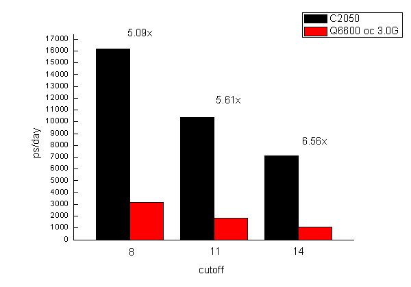
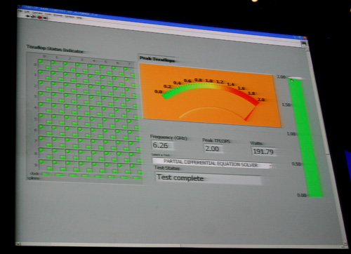

**小测Tesla C2050在Amber 11上的性能**

Simple test of GPU acceleration performance of Tesla C2050 on Amber 11

文/Sobereva @[北京科音](http://www.keinsci.com/)  2010-Aug-13

nVidia正在做tesla免费试用活动，国内由AMAX负责，提供5个小时的测试时间，通过SSH远程登陆，机子是XEON 5520*2, 16GB, Tesla C2050*2。用它们的机子测了下Tesla C2050在amber11下的性能，基本与amber官网上的数据吻合，略微偏低一点。下面数据中测Tesla时的Amber11的pmemd.cuda（即GPU加速版pmemd）是那边预先编译好的，所用编译器、数学库未知，pmemd.cuda是SPDP模式，即单精度运算为主，双精度运算为辅，此模式在不使精度有明显损失下尽可能迎合当前Tesla单、双精度相对运算能力以达到最好的性能；测Q6600时用的是MKL+ifort编译的Amber10和内部版本的Amber11（性能估计和正式版应该没区别），mpich2 4核并行，Fedora7。  
  
测试的是Amber官方提供的测试包中的三个体系。  
  
(1)JAC_NPT, 23558 atoms  
这是个比较典型的蛋白+显式水体系，参数为  
 &cntrl                                                                          
   ntx=5, irest=1,                                                               
   ntc=2, ntf=2,                                                                 
   nstlim=25000,                                                                 
   ntpr=500, ntwx=1000,                                                          
   ntwr=10000,                                                                   
   dt=0.002, cut=8.,                                                             
   ntt=1, tautp=10.0,                                                            
   temp0=300.0,                                                                  
   ntb=2, ntp=1, taup=10.0,                                                      
   ioutfm=0,                                                                     
 /   
由计算时间估算的每天能跑的长度如图所示  

  
C2050性能是Q6600 oc 3.0G的5.09倍。cutoff加大后性能衰减得都比较厉害，cutoff=14时速度只有=8时的一半。但cutoff越大，加速比越大，cutoff=14时前者是后者性能6.56倍。虽然pmemd.cuda利用GPU加速，但运行时也占满一个CPU核心的计算量，所以GPU加速时的运算能力不能100%算在GPU上，CPU多少会影响整体性能，AMAX机子上C2050性能稍逊于amber官方数据和CPU的差异也不免有一定关系。  
  
上面的图中Q6600是在Amber10下面的pmemd跑的，但amber11的pmemd性能并没有提升，所以上述对比是公平的。  
Q6600 oc 3.0,cut=8   amber10(pmemd) 3176ps/day  
Q6600 oc 3.0,cut=11  amber10(pmemd) 1846ps/day  
Q6600 oc 3.0,cut=14  amber10(pmemd) 1083ps/day  
Q6600 oc 3.0,cut=8   amber11(pmemd) 3153ps/day  
Q6600 oc 3.0,cut=11  amber11(pmemd) 1838ps/day  
Q6600 oc 3.0,cut=14  amber11(pmemd) 1079ps/day  
  
目前amber11不支持多GPU加速是一个遗憾。不过，可以调用不同的支持CUDA的设备同时跑多个任务，只需要在执行的命令后用-gpu x参数即可，x是CUDA设备的ID号，由0~32，x=-1是默认的，即调用显存最多的CUDA设备。考虑到多CUDA设备执行时显存与内存的数据交换量比单CUDA设备执行时更大，可能对带宽造成些压力，成为瓶颈，遂测试两个pmemd.cuda任务同时执行时的性能，即分别用-gpu 0和-gpu 1来执行：  
pmemd.cuda -gpu 0  16119ps/day  
pmemd.cuda -gpu 1  16000ps/day  
单pmemd.cuda  16179ps/day  
可见，两个pmemd.cuda任务同时执行时性能与单pmemd.cuda任务执行时几乎无异，降低只有1%左右，至少说明在此平台上对于同时发挥两个C2050的能力不构成瓶颈。  
  
虽然官方称轨迹使用binpos比使用mdcrd运行速度更快而建议用binpos，不过在C2050的测试中速度优势只有1%，当然这与ntwx有很大关系。  
  
(2) Myoglobin_GB, 2492 atoms  
这是个GB模型下小蛋白体系，参数为  
 &cntrl                                                                          
  imin=0,irest=1,ntx=5,                                                          
  nstlim=500000,dt=0.002,ntb=0,                                                  
  ntf=2,ntc=2,tol=0.000001,                                                      
  ntpr=1000, ntwx=1000, ntwr=50000,                                              
  cut=9999.0, rgbmax=15.0,                                                       
  igb=1,ntt=0,nscm=0,                                                            
 /    
结果为  
c2050  46426ps/day  
Q6600 oc 3.0, amber10(pmemd) 2298ps/day  
Q6600 oc 3.0, amber11(pmemd) 2304ps/day  
在隐式溶剂模型下GPU加速性能提升得明显比显式溶剂更大，加速后是之前性能的20.15x，算是质的飞跃。但是，隐式溶剂模型终究适用范围小，在无关紧要的地方炫耀性能的提升意义不大。然而，作为硬件销售者nVidia，自然喜欢炫耀这性能20倍的提升来吸引更多眼球。  
  
  
(3) Nucleosome_GB, 25095 atoms  
更大的在GB模型下的体系，参数为  
 &cntrl                                                                          
  imin=0,irest=1,ntx=5,                                                          
  nstlim=10000,dt=0.002,ntb=0,                                                   
  ntf=2,ntc=2,tol=0.000001,                                                      
  ntpr=100, ntwx=200, ntwr=50000,                                                
  cut=9999.0, rgbmax=15.0,                                                       
  igb=1,ntt=0,nscm=0,                                                            
 /  
结果为  
c2050  1003ps/day  
Q6600 oc 3.0, amber10(pmemd) 21ps/day  
Q6600 oc 3.0, amber11(pmemd) 21ps/day  
靠CPU完全跑不起来。此时GPU加速性能优势更加凸显，是纯CPU运算时速度的47.76倍！明显，GB下体系越大GPU加速优势越明显。不过，应当冷静地认识这夸张的数据的实际价值，不应被冲昏头脑，目前pmemd.cuda的局限性还不少，很重要的就是还不支持cutoff，或者说cutoff必须大于体系尺寸，所以例子用的都是cutoff=9999.0。在常用的cutoff范围中，比如=15，提升幅度又能有多少呢？从显式水的测试中也看到了，加速比与cutoff是正相关的。  
  
  
(4) Cellulose 408609 atoms  
此体系很大，参数为：  
&cntrl  
   ntx=5, irest=1,  
   ntc=2, ntf=2, tol=0.000001,  
   nstlim=10000,   
   ntpr=1000, ntwx=1000,  
   ntwr=10000,   
   dt=0.002, cut=8.,  
   ntt=0, ntb=1, ntp=0,  
   ioutfm=1,  
 /  
 &ewald  
  dsum_tol=0.000001,  
  nfft1=256,nfft2=128,nfft3=128,  
 /  
执行时一开始即提示显存不够，运算不能。C2050尽管有3G显存，却仍然不能满足要求。然而官网上拥有4G显存的C1060却能正常运行。我很怀疑如果C2050显存也是4G，能否正常运行，我感觉未必能行。这显示出当前CUDA加速的一个问题，即遇见大体系显存不足就根本不能跑，而且对显存容量要求量远比使用CPU运行时内存要求量要大，纯CPU跑这个体系，四核并行时有2G内存就足够了。  
  
其实Fermi架构的Tesla相对于价格是其1/10的、单精度运算能力相同的同核心Geforce从性能上来说，比如C2050相对于GTX 470来说，优势就是1.显存大（GTX470为1.25GB） 2.有专用的双精度运算单元，性能达到单精度的1/2（Fermi系列核心的Geforce产品专用的双精度单元被屏蔽，只能靠SFU做双精度运算，性能为单精度的1/8，GTX460由于SFU相对数量有所增加，为1/6）。显存不够就不能跑的这个问题，虽是弊病，倒也成了增加Tesla销量，避免用户图便宜选择Geforce的触媒。  
  
Fermi架构的Tesla双精度运算能力的优势目前没派上太大用场，虽说GPU不支持双精度则pmemd.cuda就完全不能跑（即便是全部计算使用单精度的SPSP模式，但SHAKE部分还是需要有双精度运算能力），但G200系列核心及之后的nvidia卡从高端到低端都支持双精度，而且动力学可接受的精度要求不高，适当的优化就避免对双精度运算能力的要求。对双精度要求最大的是量化软件，但是目前这方面还不给力，彻头彻尾的支持CUDA加速的TeraChem用过的人甚少，且尚处萌芽期，而且收费，曾免费发放过的beta版也无从下载。Firefly虽然目前在微扰等计算上能支持，但毕竟能被加速的功能还很少，有待成熟。与AMAX的人沟通时据说是有不少用户希望Gaussian支持了GPU加速再买他们的产品，的确，这将是有诱惑力的，但据称Frisch是很守旧的人，若是nVidia的人不主动与他们联姻，恐怕Gaussian14出了都未必能支持GPU加速，而其它主流量化软件开发者透露明确意图支持GPU加速的寥寥。总之，nVidia要想靠Tesla双精度运算能力来说服计算化学工作者购买，必须得更加重视量化这一块。  
  
  
也跑了跑AMAX机子上自带的NAMD测试脚本（NAMD为2.7b），结论如下  
2*XEON5520 0.476ns/day  
2*c2050 2.353ns/day  
加速比与显式水下的pmemd.cuda差不多。  
  
  
最后谈谈现阶段对购买Tesla的看法。  
  
如果用来跑amber，且体系不太大，比如在十万个原子以内，而且是个人用，没有必要用Tesla C2050，买一块1G版本的GTX460就行了，目前一千五上下。而个别厂商，比如铭瑄的GTX460就有2G版本，价格也就高出二三百元，更值得购买（尽管这牌子比较寨）。如果多人用或同时跑多个任务，可以多买几块，目前双路XEON通常搭配的5520芯片组可以支持PCI-E 2.0 4*8x，即最多四块同时使用。C2050现在零售差不多18500人民币（如果是购买搭配Tesla的AMAX公司的服务器产品，从报价上看一块C2050大概合27000元），跑动力学软件性能并不会比同核心的GeForce更好，价格却是其10倍，也只有很大体系当GTX460显存不足时才能发挥优势（相对于其2G版本优势就更小了）。而这20000元如果自己攒的话，购买两台双路8核机子了，而且支持的软件、功能不受局限。虽然C1060已经是过时产品，没有C2050的专用的双精度单元、没有显存ECC、没有DVI-I输出端等新加入的杂项功能，单精度性能比GTX460还差，但是显存大(4G)，价格相对C2050便宜很多，零售约八千多，如果要跑几十万原子大体系，也可以考虑。  
  
至于想通过Tesla来加速量化软件，购买时机还远未成熟，估计2年后应该会有一些主流量化程序的某些关键性模块支持GPU加速，那时，一方面目前产品价格会降下来，另一方面新的Tesla的双精度运算能力应该还会有所加强，而且是否那时Tesla比Geforce对量化程序加速能力强大到值得多花那么多钱还不好说。另外，那个时候格局不好预测，虽然CUDA先走一步，但是在量子化学这方面的作为却明显迟于MD、Docking、序列对比等软件，没有优先占领有利地形。AMD虽然在GPU加速方面显著落后一步（尽管在N年前GPU加速Folding@HOME时先走一步），但随着OpenCL、DirectCompute的成熟，届时或许有量化程序用OpenCL支持GPU加速，而使其目前用途很有限的FireStream系列产品用于GPU加速也很有竞争力，Tesla或许将不是唯一的选择。而且Intel也酝酿着Larrabee系列产品（尽管不时有计划搁浅的消息传出，但仍在进行），基于Atom的48核已经提供给一些研究单位试用，由于基于x86架构，若是能早日推出，哪怕性能输于同时代不少，若是价格合理，由于量化代码无需改动就能用，明显会有更强的竞争力。所以需要拭目以待，不要急于出手。  
  
  

PS: 想当年参加IDF2007的时候现场看到Intel 80核峰值性能飙到2T，但3年后却只看到悄悄发布一个弱化的48核版本，Larrabee一再延期，2年内能推出就很不错了。

