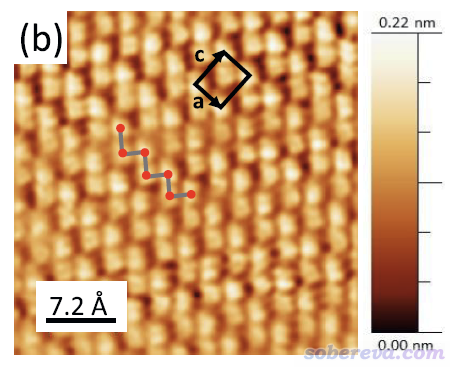
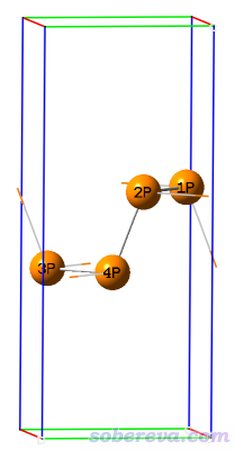
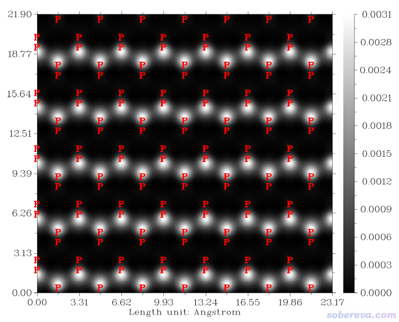
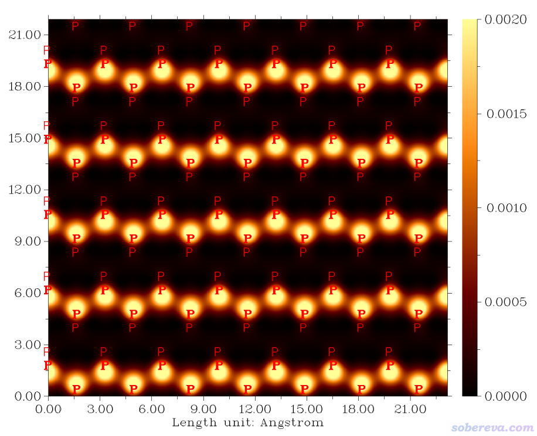
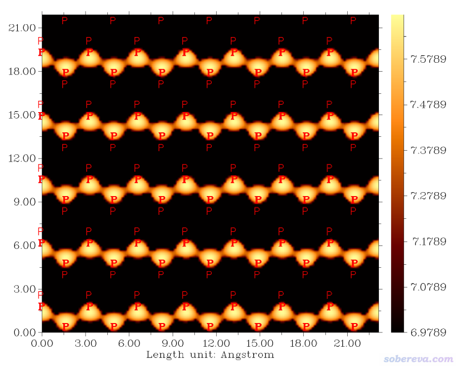

**使用Multiwfn结合CP2K的波函数模拟周期性体系的隧道扫描显微镜（STM）图像**

Simulating scanning tunneling microscope (STM) images of periodic systems using Multiwfn in combination with wavefunction produced by CP2K

文/Sobereva@[北京科音](http://www.keinsci.com)    2023-Jun-4

## 1 前言

强大的波函数分析程序Multiwfn（<http://sobereva.com/multiwfn>）有非常方便好用的模拟隧道扫描显微镜（STM）图像的功能，模拟的原理以及Multiwfn中此功能的用法我在《使用Multiwfn模拟扫描隧道显微镜(STM)图像》（<http://sobereva.com/549>）里有专门说明，但那篇博文是以孤立体系为例。Multiwfn支持对CP2K产生的周期性体系波函数进行大量的分析，在北京科音CP2K第一性原理计算培训班（<http://www.keinsci.com/workshop/KFP_content.html>）里我做了很多介绍，其中包括模拟周期性体系的STM图。本文的目的是举一个完整的例子，能令甚至之前没用过CP2K的人都能轻易使用Multiwfn模拟周期性体系的STM图。没读过<http://sobereva.com/549>的读者必须要先仔细阅读此文。不了解Multiwfn的话建议看《Multiwfn FAQ》（<http://sobereva.com/452>）和《Multiwfn入门tips》（<http://sobereva.com/167>）。值得一提的是，CP2K自己也有模拟STM的功能，但远没有Multiwfn来得好用和方便，所以这里就不多说了。

2D Mater., 6, 015005 (2019)文中给出了几层厚度的黑磷薄片表面的0.7 V偏压下的常电流模式的STM图，如下所示，本文将对黑磷计算同样条件下的STM图并与之对照。

本文为了节约时间只用单层黑磷，而且图省事直接从三维晶体中截出来一层结构直接做单点计算得到波函数。严格来说应该用多层模型，并且固定最下层黑磷并令上层的自发弛豫。

本文的例子涉及的文件都可以在<http://sobereva.com/attach/671/file.rar>中得到。读者务必使用2023-Jun-4及以后更新的Multiwfn版本，否则情况与本文所述不同。

## 2 得到单层黑磷的molden文件

如《详谈使用CP2K产生给Multiwfn用的molden格式的波函数文件》（<http://sobereva.com/651>）所述，用Multiwfn分析CP2K的波函数必须让CP2K产生记录波函数信息的molden文件。这一节我们就对单层黑磷做一个单点计算来得到此文件。

本文文件包里的Phosphorus-black.cif是黑磷的晶体结构，用GaussView打开，只保留中间的单层部分而删除其它原子，如下所示，然后保存为Phosphorus-black.gjf。

Multiwfn有极其便利的创建CP2K输入文件的功能，见《使用Multiwfn非常便利地创建CP2K程序的输入文件》（<http://sobereva.com/587>），这里我们用Multiwfn创建产生molden文件的单点任务文件。由于CP2K没法产生考虑k点时的molden文件，因此必须构造超胞用gamma点计算。当前的晶胞参数是a=3.31埃、b=4.38埃，在a方向复制为7倍、b方向复制为5倍后两个方向都有>20埃，此时只考虑gamma点是可以接受的。当前模拟STM用的偏压为正，此时能量最低的一个或多个空轨道对STM会产生贡献，因此必须要求CP2K求解出一些空轨道才行，几十个就够了。模拟STM用的偏压越大应当计算的空轨道越多，因为越高的空轨道会被涉及。

启动Multiwfn，载入Phosphorus-black.gjf，然后输入  
cp2k   //产生CP2K输入文件  
SP.inp  //将要产生的CP2K输入文件名  
-7  //设置周期性  
XY  //XY二维周期性  
-2  //产生molden文件  
-11  //进入结构编辑界面  
19  //产生超胞  
7  //a方向复制的倍数  
5  //b方向复制的倍数  
1  //c方向（垂直于表面的方向）不变  
-10  //返回  
-9  //其它设置  
12   //计算空轨道  
20  //算最低20个空轨道  
0  //返回  
0  //产生输入文件

此时SP.inp就产生在当前目录下了，在本文的文件包里提供了，计算级别是Multiwfn默认的PBE/DZVP-MOLOPT-SR-GTH。用CP2K运行SP.inp，在我的2*EPYC 7R32双路服务器上不到10秒钟就算完了。之后按照《使用Multiwfn非常便利地创建CP2K程序的输入文件》（<http://sobereva.com/587>）所述，把晶胞信息和价电子信息手动加入.molden文件，即在开头插入以下字段。本文文件包里的SP-MOS-1_0.molden是已经改好的。

 [Cell]  
  23.17000000     0.00000000     0.00000000  
   0.00000000    21.90000000     0.00000000  
   0.00000000     0.00000000    12.11600000  
  [Nval]  
  P 5

## 3 用Multiwfn模拟黑磷常距离模式的STM

首先模拟一下常距离模式的STM。启动Multiwfn，载入SP-MOS-1_0.molden，然后输入  
300  //其它功能 Part 3  
4  //模拟STM  
2  //设置偏压  
0.7  //0.7V，和文献里的相同  
0   //开始计算

默认计算的是Z最大值原子上方0.7埃的XY平面，X和Y方向计算范围和当前晶胞的X和Y方向的跨度一致。瞬间就算完了，在新出现的作图设置菜单里输入0绘图，图像如下所示

可以再做一些调整，只让最上层的P用粗体字标注，下层的用细体字显示以作区分，并且用和文献里相似的配色，并且调整坐标轴让刻度整齐。为此，把图像关闭后，接着输入  
4  //修改显示原子标签的距离阈值  
0.71 A //在图上显示距离作图平面0.71埃以内的原子的标签  
y  //将距离作图平面更远的原子的标签以细体字显示  
9  //修改色彩变化方式  
13   //黑-橙-黄  
7  //修改标签间隔  
3,3,0.0005  
8  //修改色彩刻度  
0,0.002  //下限和上限  
1  //保存图像

此时的图像如下所示

此图的效果已经很好了。和实验STM图像展现出的信息近似一致。

## 4 用Multiwfn模拟黑磷常电流模式的STM

这次模拟常电流模式的STM，这与文献里的STM图对应。启动Multiwfn，载入SP-MOS-1_0.molden，然后输入  
300  //其它功能 Part 3  
4  //模拟STM  
2  //设置偏压  
0.7  //0.7V，和文献里的相同  
1  //切换模式为常电流模式  
0   //开始计算  
3   //绘制STM图像  
0.0009   //常电流值（反复尝试，取一个图像效果较好、和实验图像较接近的即可）  
4  //修改显示原子标签的距离阈值  
2.6 A  //在图上显示距离被计算区域顶端2.6埃以内的原子的标签（计算的区域顶端的z坐标是计算开始之前界面里7 Set range in Z direction选项后面显示的第二个值。当前设2.6埃可以只把顶层磷原子纳入进来）  
y  //将距离更远的原子的标签以细体字显示  
9  //修改色彩变化方式  
13   //黑-橙-黄  
7  //修改标签间隔  
3,3,0.1  
1  //保存图像  
现在看到下图，和常高模式的STM图展现出的信息基本一致

## 5 其它

本文的例子充分体现出用Multiwfn+CP2K绘制周期性体系表面的STM真是又快又方便，鼓励大家应用在实际当中。请别忘了恰当引用Multiwfn。作为练习，大家可以绘制一下单层MoS2和石墨炔的STM图。

对于无gap的体系，如金属表面（包括吸附小分子后），绘制STM有一点需要注意。这种情况一般都是开smearing的，此时费米能级附近的轨道占据数不为整数，导出的molden文件里的轨道占据数也是如此，此时Multiwfn没法直接绘制STM（Multiwfn会以为是记录自然轨道的多组态波函数）。解决方法是先进入主功能300的子功能9（计算费米能级功能），此功能会将电子按照轨道能量由低到高以整数方式填充来修改轨道占据数，相当于0 K的占据方式。此外，在此功能里输入当前的温度，程序会给你费米能级值，将之记下来。退出此功能后，就可以照常进入STM绘制界面，届时再把费米能级值输入进选项3 Set Fermi level即可。另外值得一提的是，用Multiwfn创建CP2K输入文件时开启smearing的话，产生的输入文件里自动就会有计算空轨道的设置，就不用自己再单独设置了。
