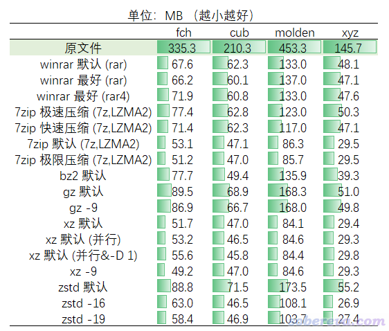
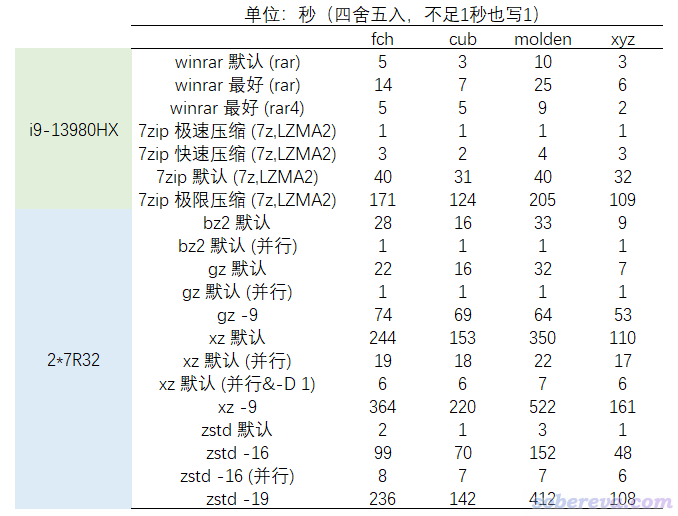

**计算化学研究者应当了解的文件压缩的常识**

Common sense about file compression that computational chemistry researchers should know

文/Sobereva@[北京科音](http://www.keinsci.com)

First release: 2023-Jun-10    Last update: 2023-Jun-11

## 0 前言

笔者每天在网上回答各种计算化学问题时，经常看到有计算化学研究者对文件压缩真是毫无概念。比如分享好几百兆甚至1GB以上的fch、cub文件时居然都不压缩！又浪费自己上传文件的时间，又浪费他人下载文件的时间，还浪费自己硬盘上的储存空间。而且在论坛里直接上传很大的文本型文件还造成宝贵的论坛服务器空间的严重浪费。今天答疑时又看到这种情况，忍不住写一个科普文章，强调一下文件压缩的重要性。

## 1 文件压缩的基本概念

文件压缩的目的是为了减小原文件的尺寸，原文件尺寸除以压缩后的尺寸称为压缩率。根据压缩的目的，分为两类：  
(1)特定目的的压缩：比如视频压缩、音频压缩、图像压缩  
(2)通用目的的压缩：可用于所有文件  
文件压缩又分为有损和无损压缩，前者会降低原文件承载的信息的质量，无法复原；后者完整保持原文件里的信息，在解压后可以复原。

压缩算法学问很深，但最简单的一些压缩思想也很好理解。比如视频压缩，原视频需要记录每一帧图像的完整信息，而在压缩时可以只记录每一帧相对于上一帧有显著变化部分的信息，自然能节约大量储存空间，特别是当视频里没有大量大幅色彩变化的情况。再比如无损压缩文本文件，假设原文件有个部分内容是222222222，压缩时可记录为9*2，自然也节约了巨大空间。有损压缩由于允许信息的牺牲，因而在压缩后的质量能保证满足实际要求的情况下，原理上能够比无损压缩达到更高的压缩率。针对特定目的压缩算法由于能考虑原数据信息的特征并加以利用，也能做到比通用目的的压缩更高的压缩率。

一些压缩文件格式例子：  
针对图像的有损压缩：jpg、gif  
针对图像的无损压缩：png、tif  
针对音频的有损压缩：mp3、ogg  
针对音频的无损压缩：flac  
针对轨迹的有损压缩：GROMACS的xtc格式（相对于全精度的trr而言）  
针对cube文件的无损压缩：bqb（TRAVIS支持）  
通用的无损压缩：zip、rar、bz2、gz、zst、xz、7z

格式和压缩算法不总是同一个概念，比如7z格式支持LZMA、LZMA2、bzip2等算法，zip格式支持Deflate、LZMA、bzip2等算法。也有的格式就只对应一种算法，比如rar格式（rar算法）、bz2格式（全称bzip2，特有算法）、gz格式（全称gzip，基于Deflate算法）、xz格式（基于LZMA2算法）、zst格式（Zstandard算法）。由于某些压缩格式允许用不同的算法，因此不能简单说这种格式的压缩率如何，必须具体到压缩算法。而且对于同一种压缩算法，压缩率还取决于一些参数，比如字典越大可能得到越高的压缩率，但压缩和解压时的耗时和耗内存也越高。

不同压缩算法的压缩率、压缩/解压过程的运算量和内存消耗、流行程度、能实现的程序都有所不同。对于支持同一种算法的不同的容器格式，其提供的特性也各有不同。

计算机文件分为文本型和二进制型两种：  
(1)文本型文件：通过文本编辑器打开后看到的都是人能阅读的信息。在计算化学领域里包括Gaussian的fch文件、通用的记录波函数信息的mwfn/wfn/wfx/molden文件、记录格点数据的cube文件、记录化学体系坐标的pdb/xyz/mol/mol2文件、GROMACS的gro/mdp/top文件、AMBER的mdcrd/prmtop文件、CP2K的restart文件等等，以及各种程序的输入和输出文件（如Gaussian的gjf和out文件）  
(2)二进制文件：用文本编辑器打开后会看到许多乱码。在计算化学领域里包括Gaussian的chk文件、GROMACS的trr/xtc/tpr/cpt文件、dcd轨迹文件、AMBER的binpos文件等等。  
用二进制方式记录数值为主的信息，比如动力学轨迹、轨道展开系数等，会比文本型文件尺寸小得多。所有前述的压缩文件格式也都是二进制文件。

对于同一种算法来说，比如rar，对于不同文件的压缩率是不同的，往往相差极其悬殊，这和被压缩的文件里记录的信息特征有关，可以称为“油水”。文本型文件一般总是有巨大的油水，像是好几百MB甚至上GB的fch、cube文件，你通过网络传给别人时如果不压缩，会显得是非常没常识的行为。如果你是通过慢如龟速的百毒网盘（对免费用户来说）分享这样的文件，不压缩更是不可理喻的行为，倘若下载文件的对方稍微有一点文件压缩的常识都会在心里吐槽你。至于二进制文件有多少压缩的油水那不一定，比如说压缩一个H.264编码的mp4视频文件、mp3音频文件、png文件，无论你用哪种压缩算法，如bzip2、rar、LZMA2等，肯定尺寸都没有明显减小，因为这样的文件根本就没什么油水，因为那些文件内容本身就已经是被压缩过的，因此给别人发这些文件时还刻意去压缩也是显得很没常识，别人还得再解压一次，完全多此一举。不要以为用一种算法压缩后再换一种算法压缩就能再次减小很多，因为大量压缩思想在不同算法之间都是共通的，油水在初榨的时候已经被利用掉了。如果二进制文件是“生”的，那可能有压缩的价值，使具体文件而定。比如Gaussian计算直接产生的chk经过压缩后普遍能减小非常多尺寸。GROMACS的trr轨迹的油水一般，压成比如rar后往往能减小几分之一。而GROMACS的xtc轨迹的话本身就已经是有损压缩了，再压缩就没有什么油水了。如果不清楚某种文件的油水的话，找个典型文件压缩试试便知，以后就有经验了。

## 2 Linux下压缩/解压文件的方法

Windows下文件压缩和解压没什么好说的，Winrar（收费）、7zip（免费）都是主流的文件压缩/解压程序，有图形界面，小学生都会用。做计算化学的人总和Linux打交道，这里对Linux下的压缩做一个快速的扫盲，给出一些很简单的例子，更多的用法自行看help或google。其中tar命令是Linux系统自带的（太老的系统里的版本不支持zst格式）

### 2.1 基本用法

• 解压文件（程序自动根据后缀判断怎么解压）  
tar -xf [压缩文件名]

• 把指定的文件或整个目录压缩成new.tbz（tbz是tar.bz2的简写）  
tar -caf new.tbz [文件名或目录名]

• 把指定的文件或整个目录压缩成new.tgz（tgz是tar.gz的简写）  
tar -caf new.tgz [文件名或目录名]

• 把指定的文件或整个目录压缩成new.tar.xz  
tar -caf new.tar.xz [文件名或目录名]

• 把指定的文件或整个目录压缩成new.tar.zst  
tar -caf new.tar.zst [文件名或目录名]

以上-caf选项等同于同时写-c -a -f。-c代表压缩，-a代表根据后缀自动判断以什么方法压缩，-f代表指定文件名。以上写文件名的地方可以一次写多个文件名，以空格分隔，也可以用通配符，比如*.chk *.fch代表把当前目录下所有.chk和.fch文件都打包并压缩。

7z、zip、rar格式能够包含多个被压缩的文件，而bz2、gz、xz、zst这些格式本身只能记录单个文件。tar是一种可以由tar程序产生的打包格式，多个文件（或目录）可以合并成一个.tar文件，这个过程不改变文件的总尺寸。上面提到的诸如.tar.xz是先把被压缩的文件用tar打包然后再压缩成xz格式的产物。因此，如果被压缩的文件只有一个，上面的.tar.xz可以简化为.xz，而如果涉及多个文件就必须写成.tar.xz。

### 2.2 并行压缩

文件很大时，而且用的又是复杂度较高的压缩算法，在压缩时耗时会很高。以上方式压缩都是只用单线程压缩，下面也说一下怎么并行压缩以显著节约时间。

以上面方式用tar命令在压缩时，对bz2、gz、xz、zst实际上是分别调用bzip2、gzip、xz、zst程序进行的压缩。这些程序也有相应的并行版，分别为pbzip2、pigz、pxz、pzst，自动会用尽量多的核来多线程处理。可以手动直接运行它们，也可以在用tar命令的时候通过-I明确指定用这些程序来做压缩。这些并行版压缩程序不一定在安装系统时就自动装了，如果运行时提示找不到命令的话可以手动装。例如在Rocky Linux 9上，首先用dnf install epel-release，然后再运行dnf install pxz，就把pxz装好了。下面是使用例子

• 并行压缩成tar.xz格式  
tar -I pxz -cf new.tar.xz [文件名或目录名]  
如果发现压缩过程中CPU占用率太低而没法充分靠并行节约时间，可以带上-D 1，如下所示（-D 1是传递给pxz程序的参数，代表把每个线程压缩上下文尺寸设为字典的1倍而非默认的3倍大小。此时并行效率可能提升很多而大幅节约时间，但压缩率有时会有一定下降）  
tar -I 'pxz -D 1' -cf new.tar.xz [文件名或目录名]

• 并行压缩成tar.zst格式  
tar -I pzstd -cf new.tar.zst [文件名或目录名]

• 并行压缩成tbz格式  
tar -I pbzip2 -cf new.tbz [文件名或目录名]

• 并行压缩成tgz格式  
tar -I pigz -cf new.tgz [文件名或目录名]

### 2.3 压缩质量的设置

有的压缩程序可以接上控制压缩质量的选项，在相应命令后面加上--help即可查看，并且用tar明确调用这些程序时在-I中可以加上相应的选项。不管什么算法，选最低压缩质量的话总是速度非常快。

• 压成.tgz情况的选项：-1是最快，-9是最好，默认是-6。例如以最好质量并行压缩  
tar -I 'pigz -9' -cf new.tgz [文件名或目录名]

• 压成.tar.xz情况的选项：-0是最快，-9是最好。一般用默认的-6就足够好了，用更高质量时耗时会提升非常多，压缩率也没什么显著的提升。例如以-5质量并行压缩  
tar -I 'pxz -5 -D 1' -cf new.tar.xz [文件名或目录名]

• 压成.tar.zst情况的选项：-1是最快，-19是最好。默认的-3时的压缩率比较烂。例如以质量和耗时权衡较好的-16质量并行压缩：  
tar -I 'pzstd -16' -cf new.tar.zst [文件名或目录名]

我比较推荐并行压缩成默认质量的tar.xz格式，压缩率够高，耗时也不高，常用的winrar也能解压。如果你是为了输入命令时尽量省事，也懒得装pxz程序，可以压缩成tbz，winrar也能解压。

### 2.4 关于zip和unzip命令

主流Linux系统也自带了zip命令和unzip命令用于压缩成zip文件和解压zip文件。前面说了，zip格式的一个好处是能直接包含多个文件而不需要tar。此外，不是很老的Windows系统还可以直接访问zip里的内容。

压缩一个或多个文件成为sob.zip：  
zip  sob [一个或多个文件名]  
如果其中包含目录名，需要加上-r，这样才能把目录里所有内容都包含进去。  
在压缩过程中默认会显示所有被压缩的文件名，加上-q可以避免显示。  
zip命令默认使用原始且压缩率较低的deflate算法，如果用压缩率更高但也更贵的bzip2算法需要再加上-Z bzip2选项。

解压zip文件：unzip sob.zip

## 3 几种计算化学领域的大文件的压缩效果对比

为了体现不同压缩方式对于计算化学研究者的实际意义，以及不同压缩方式的压缩率和耗时差异，笔者选了4个有代表性的测试文件：  
(1) fch文件（343 MB）：笔者在Phys. Chem. Chem. Phys. (2023) DOI: 10.1039/D3CP01896B里研究了OPP和两个18碳环构成的主-客体复合物，共260原子。此文件是这个体系opt freq任务产生的chk文件转成的fch文件  
(2) cube文件（215 MB）：是基于上面这个fch文件，通过Multiwfn（<http://sobereva.com/multiwfn>）计算的电子密度格点数据文件  
(3) molden文件（464 MB）：这是北京科音CP2K第一性原理计算培训班（<http://www.keinsci.com/workshop/KFP_content.html>）里我讲授用Multiwfn对WO3晶体计算态密度所使用的CP2K导出的molden文件  
(4) xyz文件（149 MB）：这是北京科音CP2K第一性原理计算培训班里我讲使用CP2K做蛋白质+水体系分子力场几何优化任务产生的记录优化过程每一帧的xyz文件，有8047个原子，292帧

测试的方法包括利用tar命令将各个文件压缩成gz、bz2、xz、zst格式的情况，用的是Rocky Linux 9所对应的程序版本，这些测试在双路EPYC 7R32机子上完成，96个物理核心，512GB内存，PM9A1固态硬盘，此机子介绍见《淘宝上购买的双路EPYC 7R32 96核服务器的使用感受和杂谈》（<http://sobereva.com/653>）。另外还测试了Winrar 6.22 beta 1 64bit（压缩成rar格式）和7zip 23.0 64bit（LZMA2算法压缩成7z格式）的情况，都是默认的并行方式，此部分测试是在Intel i9-13980HX（24个物理核心）CPU的笔记本上跑的，64GB内存，PM9A1固态硬盘，Windows 11操作系统。由于解压的耗时远远低于压缩的耗时，因此解压速度就不做对比测试了。

下表是压缩后的文件尺寸对比

下表是文件压缩耗时的对比

由上可见  
(1)Winrar压缩成rar的速度很快，但压缩率很平庸。用rar格式的“最好”压缩质量会令耗时比默认时增加至少一倍，而并没有令压缩率有多少提升，极个别情况压缩率反倒还轻微下降。用rar4格式的“最好”压缩质量相对于默认不怎么影响耗时，但压缩率也没提升。所以rar只推荐用于Windows下快速压缩目的。  
(2)7zip程序用LZMA2算法在默认设置下压缩成7z格式的速度远不如rar，但压缩率高得多，因此很适合看重压缩率的人。用“极限压缩”设置时耗时提升甚巨，而压缩率提升极为有限，所以用默认设置足矣。如果用“快速压缩”，耗时比winrar默认压缩时还更低，而压缩率至少不输于之。“极速压缩”的耗时非常低，而压缩率依然说得过去，因此非常推荐追求速度的时候用。PS：7zip压缩的时候如果选择xz格式，在相同的算法和设定下，耗时和压缩率和用7z格式是相同的，用xz的好处是在Linux下能直接用tar -xf解压，但缺点是只支持单文件。  
(3)tar在默认设置下压缩成bz2和gz文件的耗时相仿佛，而bz2的压缩率明显高一些，因此相对来说更推荐bz2。二者用并行版本程序压缩时耗时极低，对所有的测试文件在一秒左右就能压缩完。压缩gz时用最高质量的-9没必要，耗时增加很多但对压缩率改进甚微。  
(4)xz格式用的是LZMA2算法，和7zip压缩成7z默认用的算法相同，因此xz的压缩率也与之差不多，都是当前测试里表现得最好的。由于这种算法压缩耗时相当高，因此强烈建议用pxz并行压缩并且结合-D 1选项。虽然此时比并行压缩成bz2和gz的耗时还是高得多，但对于大文件已经完全是立等可取的范畴了。压缩xz时用最高质量的-9没必要（除非你痴迷于压缩率），耗时增加几分之一而对压缩率改进甚微。  
(5)默认设置下zst的压缩耗时极低，但压缩率也倒数第一，如果你很看重压缩速度而对压缩率要求很低的话这是适合使用的。zstd结合-16的时候压缩率不错，已经比bz2明显更好了，但耗时也比之高很多。-19的时候耗时极高，快赶上默认设置的xz了，但压缩率则明显不如之，而且相对于pxz结合-D 1的时候pzstd在速度上也没优势。所以zst格式基本主要就是低质量压缩时在效率方面有独特长处，对压缩率但凡有些要求的时候就不如用pzstd -D1。

总结一下，有下面的关系，读者可根据对速度和压缩率的要求择情选用压缩方法。gz没用处。  
• Windows下  
速度：7z(LZMA2,极速) > 7z(LZMA2,快速) > rar(标准) > 7z(LZMA2,标准)  
压缩率：7z(LZMA2,标准) > 7z(LZMA2,快速) >= rar(标准) ≈ 7z(LZMA2,极速)  
• Linux下  
速度：zst(默认) > bz2 >= gz > xz(默认）  
压缩率：xz(默认）> bz2 > gz > zst(默认)

以上的测试也充分体现了，哪怕用耗时很低的很廉价的压缩方式，如zst（默认）和7z(LZMA2,极速)，对于计算化学领域常见的文本型文件也能干掉一多半体积。所以再次强调，该压缩的时候一定要想着压缩！如果你是要分享一个要被很多人下载的大文件，或者要把文件放到一个硬盘空间很紧张的地方，那么建议使用压缩率较高的方式压缩，比如基于LZMA2算法在默认设置下的xz或7z格式。如果文件只是用于临时性的一对一传输，想通过压缩节约传输时间，那只需要用很快速的方法压缩一下就够了，若把过多的CPU运算时间花在对压缩率的追求上就得不偿失了。
