**注**：在本文研究的基础之上，又更进一步研究了C18与OPP结合作为双转子体系的可能性，文章发表于Chem. Commun., 59, 9770 (2023)，深入浅出的介绍见《理论设计新颖的基于18碳环构成的双马达超分子体系》（<http://sobereva.com/684>），欢迎阅读！

**8字形双环分子对18碳环的独特吸附行为的量子化学、波函数分析与分子动力学研究**

Quantum chemistry, wavefunction analysis and molecular dynamics study of the unique adsorption behavior of 8-shaped bicyclic molecule to cyclo[18]carbon

文/Sobereva@[北京科音](http://www.keinsci.com)   2023-Jun-30

## 0 前言

18碳环于2019年首次在凝聚相实验中被观测到后，其独特的几何和电子结构引发了学术界的巨大关注，笔者对18碳环及其衍生物做了大量、系统的理论研究工作，论文汇总以及深入浅出的介绍文章见<http://sobereva.com/carbon_ring.html>。2022年Angew. Chem., 134, e202113334 (2022)新合成出一种具有两个大环的整体看上去像8字形的分子，每个大环都由一串苯环相连构成，此体系以下简称oligoparaphenylene (OPP)，如下图最下侧的结构所示。此文实验发现OPP可以稳定结合两个C60或C70富勒烯。另外，由下图所示意的，11个苯环构成的环状分子[11]CPP也已知可以吸附C70。

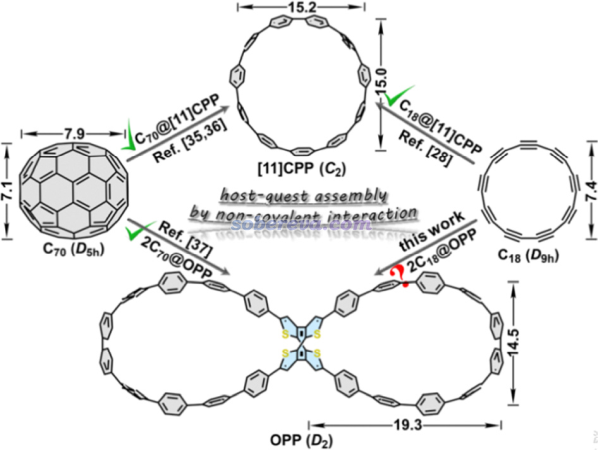

考虑到18碳环的直径和C70富勒烯相近（如上图所标注的），OPP是否也有可能吸附18碳环分子来实现18碳环的富集？此外，18碳环本身不稳定、易反应，若利用OPP吸附来保护住的话，还有可能实现18碳环的稳定化，无疑这很有实际意义。受到这个想法的启发，笔者和江苏科技大学的刘泽玉等人通过量子化学、波函数分析和分子动力学对OPP吸附18碳环的可能性从各个角度做了全面深入的探究，并在近期发表了通讯文章，非常欢迎读者们阅读和引用：

Molecular assembly with a figure-of-eight nanohoop as a strategy for the collection and stabilization of cyclo[18]carbon, *Phys. Chem. Chem. Phys.*, **25**, 16707 (2023) <https://doi.org/10.1039/d3cp01896b>

在下文中，笔者将对这篇研究工作的主要内容和研究思想进行深入浅出的介绍，还将同时还做许多扩展讨论和细节说明，图片来自于上文以及其补充材料（有的图略有差异，版本不同）。希望本研究能对读者研究类似问题有所启发、将本文的研究手段应用于相似问题的研究上。如果大家不了解18碳环的基本特征的话，建议阅读《谈谈18碳环的几何结构和电子结构》（<http://sobereva.com/515>）和笔者之前发表的Carbon, 165, 468 (2020) <https://doi.org/10.1016/j.carbon.2020.04.099>中关于18碳环电子结构的讨论以了解这方面的背景知识。

## 1 吸附形成的结构

文中首先研究OPP吸附一个和两个18碳环后的结构。几何优化和振动分析使用Gaussian 16在wB97XD泛函下进行，因为在Carbon, 165, 468 (2020)文中证明了此泛函可以很好地描述18碳环的结构，而且此泛函又可以合理地描述弱相互作用，故拿来优化2C18@OPP复合物很适合。2C18@OPP多达260个原子，而优化+振动分析任务又很昂贵，因此这个环节用的基组不能太贵，文中对包含224个原子的OPP部分使用6-31G*，对更重要但占较小部分的C18使用更大的6-311G*。顺带一提，对C18不能图便宜也用6-31G*，因为如《我对一篇存在大量错误的J.Mol.Model.期刊上的18碳环研究文章的comment》（<http://sobereva.com/584>）里介绍的论文所示，6-31G*都不足以合理描述C18的几何结构。优化后的带一个和两个18碳环的OPP结构如下所示

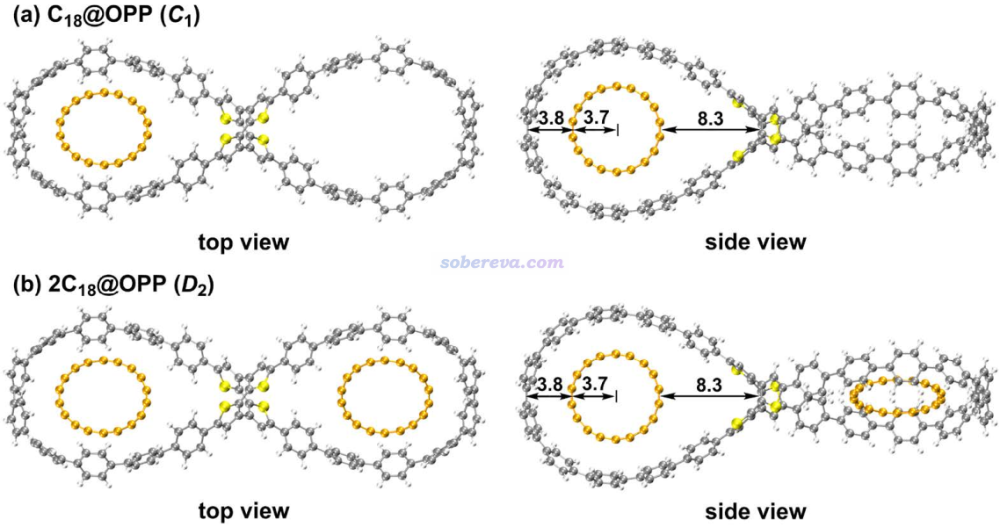

从上图可见由于尺寸匹配，18碳环能非常理想地嵌入进OPP的大环中，C18环平面和大环的平面平行。此外，C18的吸附基本不改变大环原有的形状。

## 2 吸附的热力学

为了从热力学角度探究吸附的可行性，文中对OPP吸附一个18碳环的结合能ΔG进行了计算，并且为了更进一步探究焓和熵所产生的贡献，根据ΔG=ΔH-TΔS，文中将焓变ΔH（结合焓）和熵增对结合自由能的贡献（-TΔS）项分别给了出来。同时为了考察温度对吸附的影响，文中利用《使用Shermo结合量子化学程序方便地计算分子的各种热力学数据》（<http://sobereva.com/552>）中介绍的非常方便的Shermo程序一次性得到了各个温度下的热力学量，从而绘制了下图。

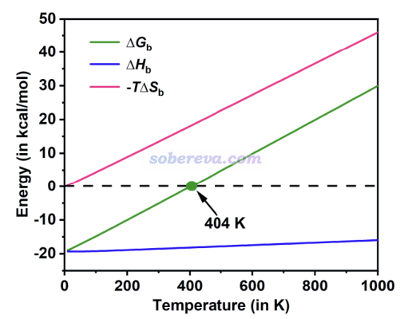

从上图可见，结合焓受温度影响相对不大，是个明显的负值，这是C18能够与OPP结合的驱动力。而分子间结合会造成熵的显著降低，因此-TΔS总为正，且温度越高这项越正，越不利于结合，是C18与OPP结合的阻碍。这两部分共同决定结合自由能。在404 K以下，结合自由能为负，C18能够与OPP结合，而在此温度以上则热力学上无法结合；即便之前C18已经吸附了，也会发生脱附。由于这一点，可以通过温度来实现OPP对C18的可控的吸附和释放。即低温下吸附，高温下释放。

以上数据的计算有两点值得说明：

(1)文中使用Shermo基于Grimme提出的准RRHO模型计算热力学校正量中的熵，这一点非常重要，Gaussian用的RRHO模型会严重高估诸如C18@OPP这种含有很低频体系的熵。所以哪怕不靠Shermo考察热力学量随温度的影响，也不要直接用Gaussian给出的熵和自由能热校正量而应当用Shermo来计算它们。

(2)为了准确地计算结合自由能、结合焓，以上数据中涉及的电子能量是使用ORCA在wB97M-V/def2-QZVPP下开着RIJCOSX计算的，这个级别算弱相互作用相当准确，而且是算当前这种较大体系最理想的选择。同时由于wB97M-V是长程100% HF成份的长程校正泛函，自相互作用误差较小，因此可以和具有同等特征的wB97XD一样正确描述18碳环。由于def2-QZVPP很昂贵，故直接算C18@OPP这样两百多原子的体系算不动，因此文中使用了半边模型， 如下所示，是在C18@OPP结构基础上把和吸附无关的那一头的大环去掉并用氢封闭的结构。由于另一头的大环距离吸附的C18甚远，因此这种处理不会影响计算结合能的精度。

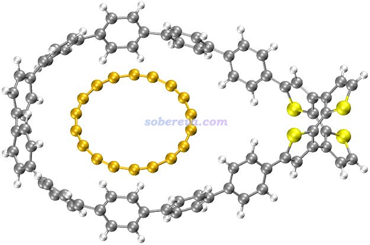

## 3 吸附作用的本质

什么样的机制导致了OPP能够吸附C18？为了考察这一点，本文绘制了如今已被广泛使用的笔者所推广的分子表面静电势穿透图，利用Multiwfn结合VMD可以按照《使用Multiwfn+VMD快速地绘制静电势着色的分子范德华表面图和分子间穿透图（含视频演示）》（<http://sobereva.com/443>）中所示的过程非常容易地绘制，结果如下，是在wB97XD/6-311G*级别绘制的，色彩刻度条单位为kcal/mol。由图可见，18碳环与OPP的范德华表面存在一定程度的穿透，这是两个分子结合后在平衡结构下会出现的典型特征。此图也体现出18碳环的形状着实和OPP的大环吻合得很好，匹配得很完美。由图还可以看出，18碳环表面的静电势非常小，这点在《全面探究18碳环独特的分子间相互作用与pi-pi堆积特征》（<http://sobereva.com/572>）介绍的文章中我也专门指出过。OPP表面静电势虽然比C18更大，但也仅在较小的数值区间内。通过表面静电势的特征就可以看出C18与OPP之间的静电作用是甚微的，不可能对结合起主导作用。

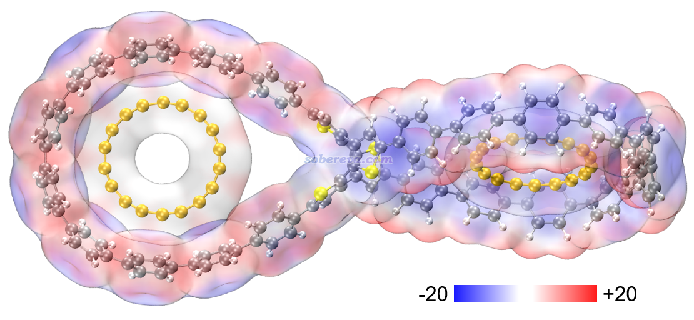

下图是按<http://sobereva.com/443>博文说的做法用Multiwfn+VMD绘制的OPP分子表面极值点数值（kcal/mol），可以把OPP表面静电势分布情况展现得更清楚。青色小球是表面静电势极小点，橙色是极大点。

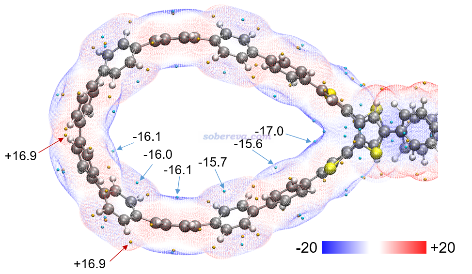

然后我们再关注OPP与18碳环之间可能存在的范德华作用。笔者提出的范德华势是研究这种问题绝佳的手段，介绍见《谈谈范德华势以及在Multiwfn中的计算、分析和绘制》（<http://sobereva.com/551>）、使用《Multiwfn对静电势和范德华势做拓扑分析精确得到极小点位置和数值》（<http://sobereva.com/645>）。以碳原子作为探针原子（对应18碳环上的原子），OPP的-1.2 kcal/mol的范德华势等值面如下图所示。可见OPP产生的范德华势最负的区域，也即它的范德华作用对碳原子吸引最强的部分，正好与C18原子在吸附后出现的区域相重叠。这充分体现出OPP对18碳环必定有显著的范德华吸引作用，这应当是OPP对18碳环吸附的最主要本质。当前体系是范德华势分析的很好的应用实例。

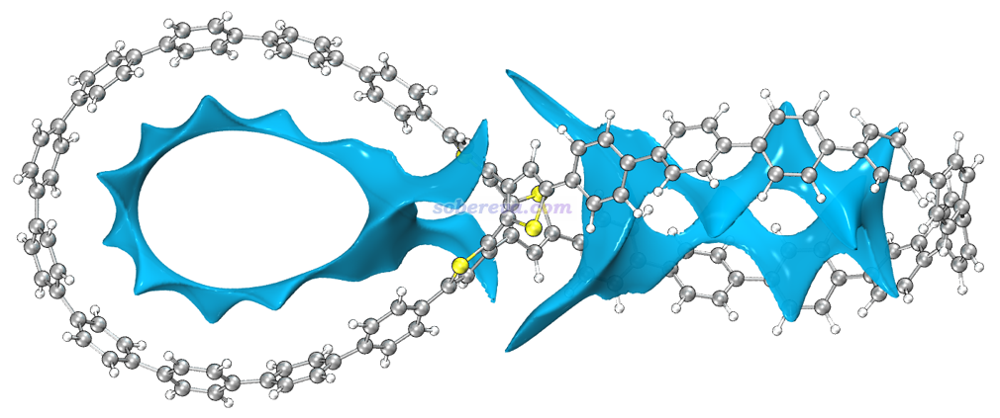

文中进一步使用Multiwfn结合VMD使用笔者提出的IGMH方法展现了OPP与18碳环的相互作用，对[2C18@OPP](mailto:2C18@OPP)绘制的0.002 a.u.的分子间的IGMH等值面如下图所示。IGMH的介绍见《使用Multiwfn做IGMH分析非常清晰直观地展现化学体系中的相互作用》（<http://sobereva.com/621>）和《一篇最全面介绍各种弱相互作用可视化分析方法的文章已发表！》（<http://sobereva.com/667>）。IGMH的等值面非常清晰地把OPP与18碳环之间的相互作用展现了出来，而且其颜色完全为绿色，说明作用区域电子密度很低，而且等值面又很扁且广阔，这明显是色散吸引主导的相互作用的特征。再加上18碳环具有in-plane pi电子，在吸附进OPP后正好与OPP大环的苯环的pi电子分布区域对着，因此可以明确指出18碳环与OPP与形成了显著的pi-pi堆积作用。值得强调的是，靠in-plane电子形成pi-pi堆积，这是碳环体系所独有的特征，非常具有个性。

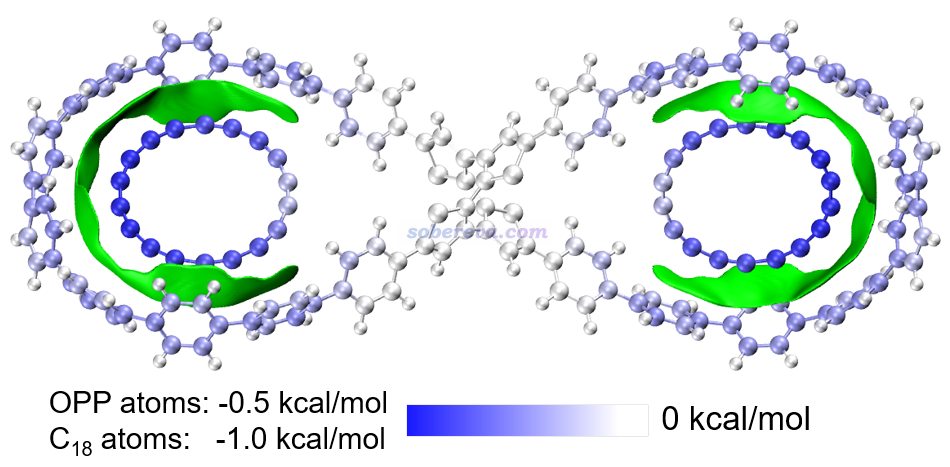

本文还使用笔者提出的基于力场的能量分解方法EDA-FF考察了各个原子对C18与OPP结合产生的贡献。EDA-FF的介绍见《使用Multiwfn做基于分子力场的能量分解分析》（<http://sobereva.com/442>）。此文的EDA-FF完全基于GAFF力场实现。由于C18的原子电荷均为0，所以此分析中没有静电作用项而只有范德华作用部分。EDA-FF计算的平衡结构下C18与OPP的相互作用能为-26.0 kcal/mol，这与高精度wB97M-V/def2-QZVPP计算的-20.3 kcal/mol相差并不很大，因此EDA-FF分析结果完全能说明问题。在上图中，各个原子对C18-OPP结合能的贡献通过原子着色予以了展示。由于C18和OPP上的原子对相互作用贡献的数量级差异较明显，因此用了不同的色彩刻度。由上图可清楚看出，C18上每个原子对相互作用能的贡献在-0.7至-1.0 kcal/mol的范围，离OPP中心（pi-linker部分）越远的原子由于与OPP大环上的原子帖得越近，因而贡献也越大。相应地，OPP大环上的原子与C18离得越近的那些原子对相互作用贡献也越大。而在OPP两个大环之间的pi-linker附近的原子则对结合的贡献基本为0。通过此例可见通过EDA-FF能非常清楚地展现出各个原子对结合所起到的作用，极具实用性。

## 4 吸附的分子动力学

为了准确地从动态角度考察完整的吸附过程，此文使用GROMACS程序基于经典力场做了吸附过程的分子动力学模拟。在300K下C18进入OPP的总共2000 ps的模拟轨迹的完整视频可在此观看，情况一目了然（其中18碳环的一个原子用红色高亮以便于观察18碳环的旋转情况）：[**http://sobereva.com/attach/674/C18_enter_OPP_2ns_300K.mp4**](http://sobereva.com/attach/674/C18_enter_OPP_2ns_300K.mp4)

下面说明一下研究C18进入过程的具体细节。

由于OPP是结构很特殊的体系，绝对不能直接用诸如GAFF力场去模拟OPP，否则实测结构会严重变形，两个大环区域会几乎成为严格的圆形而不是液滴状。为了能通过力场合理地描述OPP，就必须利用笔者开发的sobtop程序（<http://sobereva.com/soft/Sobtop>）在拓扑文件构建方面提供的灵活性，即允许一部分用刚性参数，一部分用柔性参数。本研究将两个大环之间的相对刚性的pi-linker部分用量子化学计算的Hessian矩阵通过mSeminario方法计算出的力常数和平衡参数来描述，而大环部分则用GAFF力场参数描述，这样可以允许其中的苯环部分发生应有的旋转。另外，模拟C18用的C-C键的参数也都是sobtop基于Hessian矩阵严格算出来的。实测发现，使用这种方式构建的拓扑文件通过GROMACS做能量极小化得到的C18@OPP构型与量子化学优化得到的相当吻合，见下图的对比，蓝色是wB97XD优化出来的，棕色是基于分子力场做能量极小化得到的。

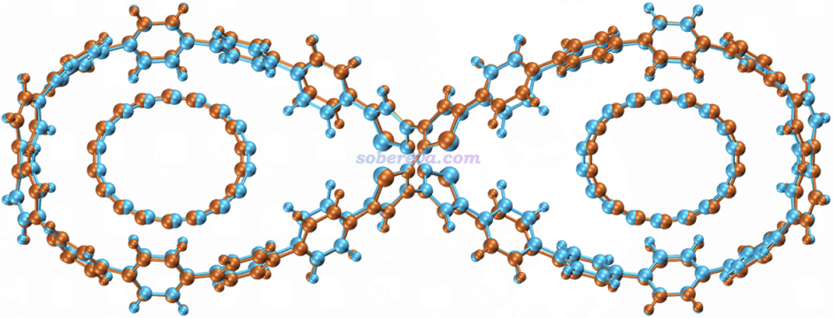

基于以上方式得到的参数，在模拟时，笔者将C18@OPP四周扩了一定区域设立了一个大的周期性盒子，将两个18碳环随机插入在其中，然后在300 K下进行了模拟。下图将碳环进入过程的一些关键时间区间通过多帧叠加方式予以了展现，每个时间区间内碳环按照白到黄的方式着色来清楚区分不同时刻所在的位置，图像通过VMD绘制。下面三幅子图只显示了感兴趣的OPP右半边的情况。第一个C18在模拟才到200 ps时就已经进入OPP了，下图就只关注进入得晚一些的第2个C18的情况。由图可见，852-884 ps时间内C18从OPP外部擦着它的外沿顺利滑入大环空腔，而之前就已经进入另一侧大环中的C18还在原处晃悠没受什么影响。在884-1448 ps期间，刚进入的C18自发贴到大环的内壁倾斜地呆了一阵子。在1448-1460 ps期间，原本贴着大环内壁的亚稳的吸附构型发生了改变，C18自发变得平行于大环。在1460ps到模拟结束（2000 ps）期间内，在大环里躺平的C18就一直稳定地呆在那了，也说明这是在300 K下能够稳定存在的吸附结构。

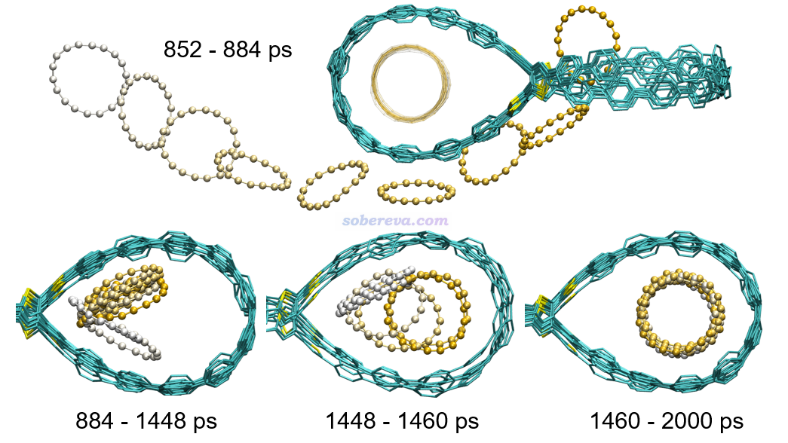

下图还对C18进入过程做了细致的几何参数分析，包括C18与OPP大环的中心之间的距离，即下图(a)，以及C18与OPP大环之间的夹角，即下图(b)。图中对两个C18的情况都做了统计，分别是红线和蓝线。结合这些几何参数的变化和轨迹，文中将OPP吸附C18的过程分为三个阶段：(1)wander，即C18在OPP周围漫游的过程 (2)adsorption，即C18进入OPP并处于亚稳态构型的过程 (3)equilibrium，即C18在OPP大环中处于完全平衡状态。拿第2个C18为例，下图可见当它处于真空区中游荡而没撞上OPP的时间内，它与OPP大环的距离和夹角都在反复大幅波动，在刚吸附到大环里成为亚稳态时，其夹角和中心间的距离和最终稳定状态都存在一定差异。第1个C18进入过程也是分为这么三个阶段，只不过恰好阶段2非常短暂，即这个C18刚吸附进大环后迅速就躺平达到稳定构型了。这些阶段出现的时刻、长短，都有一定随机性，直接受到初始结构里C18所处的位置、初速度的影响。笔者通过大量重复模拟，都验证了以上描述的C18进入OPP的过程是普遍现象。

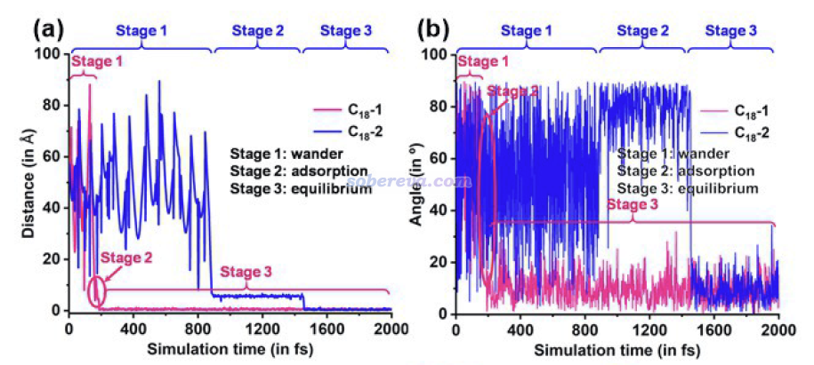

下图是模拟过程中C18与OPP的相互作用能的变化，可见吸附时相互作用能有大幅增加（变得更负），并且从C18在大环里倾斜的亚稳态构型变成躺平的稳定构型过程中相互作用能又有所增加。明显体现出这些过程都是能量降低所驱动的。

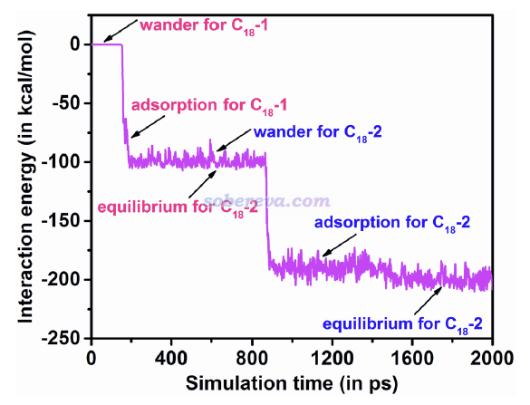

## 5 吸附受电子激发的影响

本文研究的OPP的位于中央的pi-linker已知在激发态下具有Baird芳香性，因此电子激发会导致结构发生明显的变形（开口更大、更接近平面），无疑这可能明显影响大环的形状以及对C18的吸附行为。为了探究这一点，本文对OPP的最低单重激发态S1使用TDDFT结合wB97XD泛函做了几何优化，S1结构如下图粉色所示，基态S0结构如下图蓝色所示。可见确实电子激发明显影响了OPP的结构，令pi-linker开口更大了、大环部分变得更圆了。

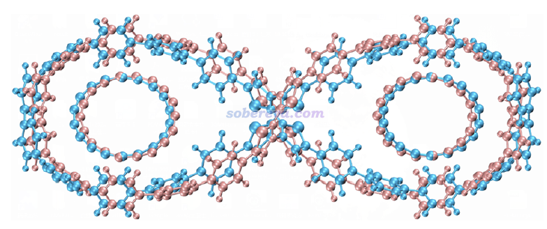

电子激发计算发现S0-S1跃迁由HOMO到LUMO+8的跃迁所主导，贡献达到86.8%，这两个轨道如下图所示，通过Multiwfn结合VMD按照《用VMD绘制艺术级轨道等值面图的方法（含演示视频）》（<http://sobereva.com/449>）介绍的方法绘制。可见都在pi-linker部分，是高度定域化的激发，而大环部分几乎没受影响。这也体现出为什么电子激发能对pi-linker的结构有显著影响。

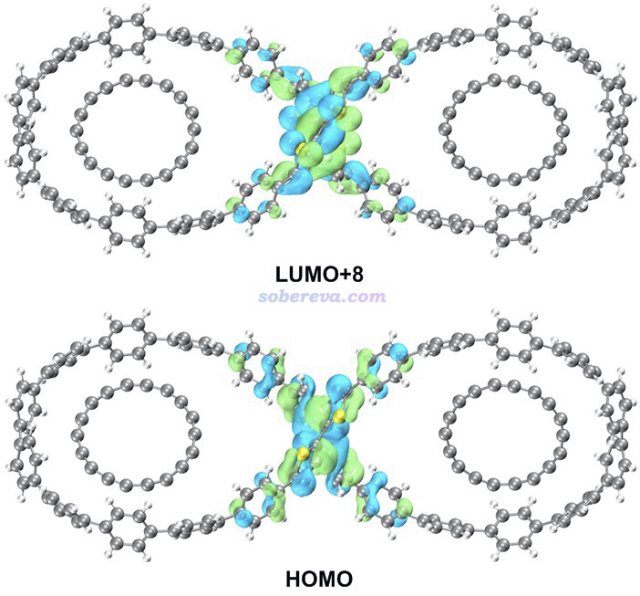

本文还对2C18@OPP复合物用TDDFT做了几何优化，之后计算了结合能。S0态的结合能为-18.8 kcal/mol，而S1态为-17.1 kcal/mol，说明S1态下OPP对18碳环的吸附变弱了。虽然结合能的改变幅度不算很大，但毕竟吸附的平衡常数受结合自由能影响很大，因此在OPP能够吸附C18的临界温度（前述的404 K）附近，OPP对C18的吸附在一定程度上会受到光控制。

对S1态2C18@OPP复合物，文中也用IGMH方法直观展现了相互作用情况，和前面S0态的图一样也是用的0.002 a.u.绘制。相比之下，可以看出在S1态下等值面往OPP pi-linker部分的延伸程度有所减小，体现出S1态下由于pi-linker开口更大，使得靠近pi-linker的大环原子与C18之间的相互作用明显变弱，这解释了为什么S1态下OPP与C18的结合能的大小变小了。

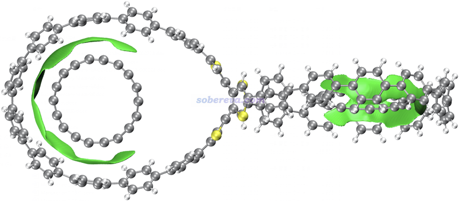

## 6 吸附对红外和UV-Vis光谱的影响

文中还考察了OPP吸附18碳环如何影响红外和UV-Vis光谱，如下图所示。可见OPP吸附一个18碳环后会在379.6和2122.0 cm-1处出现新的峰，前者对应碳环的C-C-C键角弯曲振动，后者对应于C-C键伸缩振动。而再吸附第二个C18之后，虽然峰的波数没有进一步变化，但18碳环所引入的峰明显变得更强了。关于碳环的振动特征，强烈建议阅读《揭示各种新奇的碳环体系的振动特征》（<http://sobereva.com/578>）里的介绍。

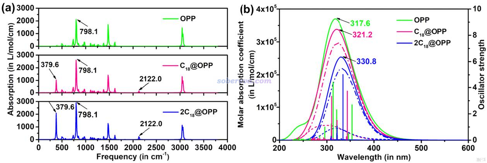

从上图的UV-Vis吸收光谱中可以看到，OPP吸附越多的C18分子，吸收峰越红移，吸收强度越低。

根据以上所示的OPP吸附不同数目的C18所对应的明显不同的红外和UV-Vis光谱，实验化学家可以通过光谱技术检测C18是否吸附到了OPP，以及吸附的量如何。

## 7 总结

本文介绍了近来笔者在Phys. Chem. Chem. Phys., 25, 16707 (2023)上发表的很有意思的具有8字形双环结构的OPP与新颖独特的18碳环相吸附形成1:2 主-客体复合物的研究。文中利用量子化学计算、波函数分析和分子动力学模拟，从各个角度全面揭示了吸附的本质和特点，还考察了光激发对吸附的影响。本文也是波函数分析与Multiwfn程序研究实际问题的很好范例。相信本文的研究工作的思想和手段能对其他人通过理论化学研究吸附问题产生启发作用。

另外，如果你对pi-pi研究感兴趣，强烈建议阅读《谈谈pi-pi相互作用》（<http://sobereva.com/737>）。
