**使用Multiwfn通过局部电子附着能(LEAE)考察亲核反应位点、难易及弱相互作用**

Using Multiwfn to investigate preferential site and difficulty of nucleophilic reactions as well as weak interactions through local electron attachment energy (LEAE)

文/Sobereva@[北京科音](http://www.keinsci.com)

First release: 2023-Jun-4   Last update: 2025-Oct-28

## 0 前言

平均局部离子化能（average local ionization energy, ALIE）是波函数分析领域里很常用的实空间函数，它衡量三维空间中特定位置的电子发生电离的难易程度，数值越小体现电子被体系束缚得越弱、越容易发生亲电反应（被亲电进攻）。ALIE也体现局部的亲核性。ALIE的分析可以使用波函数分析程序Multiwfn（<http://sobereva.com/multiwfn>）非常容易地实现，相关介绍见《使用Multiwfn的定量分子表面分析功能预测反应位点、分析分子间相互作用》（<http://sobereva.com/159>）、《使用Multiwfn和VMD绘制平均局部离子化能(ALIE)着色的分子表面图（含视频演示）》（<http://sobereva.com/514>）、《亲电取代反应中活性位点预测方法的比较》（<http://www.whxb.pku.edu.cn/CN/abstract/abstract28694.shtml>），以及《静电势与平均局部离子化能相关资料合集》（<http://bbs.keinsci.com/thread-219-1-1.html>）中的相关综述。

ALIE可以用来预测和解释亲电反应的区域选择性和快慢，由于它很有用，而且通过Multiwfn实现分析特别容易，使得其如今已经很流行。是否有与之用途类似的函数能够考察亲核反应？答案是Y。有两个函数专门衡量局部的亲电性，都能够拿来讨论化学体系发生亲核反应的位点和反应速率，且和ALIE一样都是基于分子轨道波函数和轨道能级定义的。其中一个是J. Mol. Model., 9, 342 (2003)中提出的local electron affinity（局部电子亲和能，LEA），另一个是J. Phys. Chem. A., 120, 10023 (2016)中提出的local electron attachment energy（局部电子附着能，LEAE）。相对来说LEAE更好一些，在于LEA计算时依赖于所有空轨道，导致它的基组敏感性很强，特别是基组带弥散函数时得到的结果往往没有意义。而LEAE计算时只依赖于能量低于0的空轨道，对基组敏感性小得多，更皮实，**但必须保证至少LUMO的能量是低于0的****（否则没法用LEAE！）**。LEAE原文建议使用B3LYP/6-31+G**产生的波函数做LEAE计算，此时总能保证这一点。本文只介绍LEAE，如果读者对LEA感兴趣，参看Multiwfn手册4.12.13节的介绍和例子。

下文第1节先介绍LEAE的定义和实用价值，第2节将介绍怎么用Multiwfn给出分子表面上LEAE极小点的位置和具体数值，这是定量分析的关键。第3节介绍怎么利用脚本便利地实现Multiwfn结合VMD绘制分子表面的LEAE着色图，这对于通过图像直观讨论非常重要。

## 1 局部电子附着能的概念

### 1.1 局部电子附着能的定义

LEAE可表示为下式

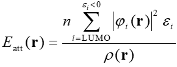

其中ρ是总电子密度，|φ_i|^2是分子轨道i的概率密度，ε是轨道能量。循环考虑从LUMO开始的所有能量低于0的空轨道。对限制性闭壳层波函数，n为2，对非限制性开壳层波函数，n为1。在Multiwfn中LEAE对应于第-27号自定义函数，可以使用Multiwfn对其像对其它实空间函数一样做各种形式的分析、绘图。

LEAE较负的地方，说明在此处有能级较负的空轨道出现，也因此这个地方比较亲电，即倾向于与带负电的物质相结合，同时也说明这种地方倾向于被亲核进攻。当同一个分子有多个LEAE较负的地方，谁越负谁越亲电、被亲核进攻的优先级越高（忽略位阻、溶剂效应等外部因素）。LEAE还可以在不同体系之间对比，即对于一批类似分子，发生反应的位点的局部分子表面区域的LEAE越负，发生亲核反应的速率常数通常越大。

通常LEAE是像ALIE那样投影到分子表面上考察的。可以用类似《使用Multiwfn+VMD快速地绘制静电势着色的分子范德华表面图和分子间穿透图（含视频演示）》（<http://sobereva.com/443>）和《基于Multiwfn产生的cube文件在VMD和GaussView中绘制填色等值面图的方法》（<http://sobereva.com/402>）所述的方式绘制分子表面LEAE着色图来一目了然地展现不同位置的LEAE大小。也可以使用比如J. Mol. Graph. Model., 38, 314 (2012)中我提出的定量分子表面分析算法寻找LEAE在分子表面上的极小点，根据它们大致对应的原子以及具体数值讨论亲核反应。还可以用我在Multiwfn中独家实现的“局部分子表面分析”计算各个暴露的原子在分子表面上的局部区域中的LEAE的平均值讨论，这样即便某个原子附近没有LEAE的表面极小点出现也照样能用LEAE来分析，参考下文以及《谈谈怎么计算“原子的静电势”》（<http://sobereva.com/641>）中与局部分子表面分析有关的介绍。

特别要注意的是，虽然静电势、ALIE通常都是投影到电子密度为0.001 a.u.的等值面（Bader定义的气态分子的范德华表面）上进行分析的，但LEAE原文里作者建议将LEAE投影到0.004 a.u.等值面上进行分析，结果更好。因此后文的例子都遵循原文的这个做法。

讨论亲核反应的方法还有很多，比如LUMO分布、福井函数f+、轨道权重福井函数fw+、Hirshfeld原子电荷、分子表面静电势等，《预测亲核反应位点方法的比较》（<https://link.springer.com/article/10.1007%2Fs11426-015-5494-7>）里面有很多介绍和对比。这里说说LEAE和它们的关系：  
• 相对于靠前线轨道理论根据LUMO分布来预测亲核反应位点，LEAE的好处在于考虑的不仅仅是LUMO。当空轨道能级非常接近（近简并）的情况，只拿LUMO说事会有严重误导，而LEAE则没有这个问题。  
• 相对于福井函数f+，LEAE的一个好处是只需要对一个电子态进行计算，而不用算两个电子态再将其密度求差，因而更省事（不过按照《使用Multiwfn超级方便地计算出概念密度泛函理论中定义的各种量》<http://sobereva.com/484>说的用Multiwfn来计算f+也极其简单），而且可以在不同体系间对比。  
• 《通过轨道权重福井函数和轨道权重双描述符预测亲核和亲电反应位点》（<http://sobereva.com/533>）中介绍的轨道权重福井函数当中的fw+与LEAE有较大相似性，即都基于非占据分子轨道计算且又不止考虑LUMO，而二者的思想又有所不同。fw+是基于人为设定的权重函数决定最低一批空轨道各自的权重，而LEAE中各空轨道的权重隐含地体现在了轨道能量里。fw+和LEAE没法说谁更好，毕竟考察方式不一样：fw+通常绘制等值面图考察，而且由于是归一化的函数，可以讨论各个原子的贡献百分比，而LEAE通常是对比它在分子表面上不同区域的数值。LEAE比fw+有一个明确的优点是它可以直接在不同分子间对比绝对大小，不限于fw+和f+那样只能在单个分子内对比。  
• 在《TCA上的一篇对比不同原子电荷预测反应位点、亲电/亲核性的文章》（<http://bbs.keinsci.com/thread-15512-1-1.html>）里我提到过Hirshfeld原子电荷是讨论亲核位点和反应速率的很有用的量，《预测亲核反应位点方法的比较》（<https://link.springer.com/article/10.1007%2Fs11426-015-5494-7>）的测试也体现了这一点。LEAE和Hirshfeld电荷在这方面谁更好不一定，我还没见过全面的对比测试，在我来看二者都可以同时使用来相互印证。Hirshfeld电荷是一个原子一个值，虽然在讨论原子的特征上显得比LEAE更方便，但它没法像LEAE那样考察特定局部区域的亲电性（如化学键、sigma穴、pi穴区域等），而且没法画成LEAE那样直观的分子表面着色图（顶多是按照《使用Multiwfn+VMD以原子着色方式表现原子电荷、自旋布居、电荷转移、简缩福井函数》<http://sobereva.com/425>的做法对原子着色来图形化展现），所以二者有互补性。  
• 静电势在讨论亲核反应上有一定用处，分子表面上静电势越正的地方被认为越亲电、越容易发生亲核反应。LEAE和静电势在考察形式上相近。但如LEAE下文中所展现的，在分析亲核反应方面静电势远不如LEAE可靠。

### 1.2 局部电子附着能在研究亲核反应上的用处

LEAE原文给了不少例子，这里挑几个说说。

下图a是五氟硝基苯的分子表面（对于LEAE分析来说指0.004 a.u.电子密度等值面，后同），其中最负的部分（< -2.05 eV）的区域为红色。可以看到硝基临位和对位各有一块红色，其中对位碳的表面LEAE极小值为-2.21 eV，临位为−2.11 eV。这体现出五氟硝基苯倾向于在临位和对位发生亲核反应。确实，实验上此体系是选择性地在临、对位发生亲核芳香取代反应的。在图上硝基的氮上也能看到一丢丢红色区域，相应的表面LEAE极小点数值为-2.06 eV，说明N的pi区域有亲电性（所谓的pi穴）。

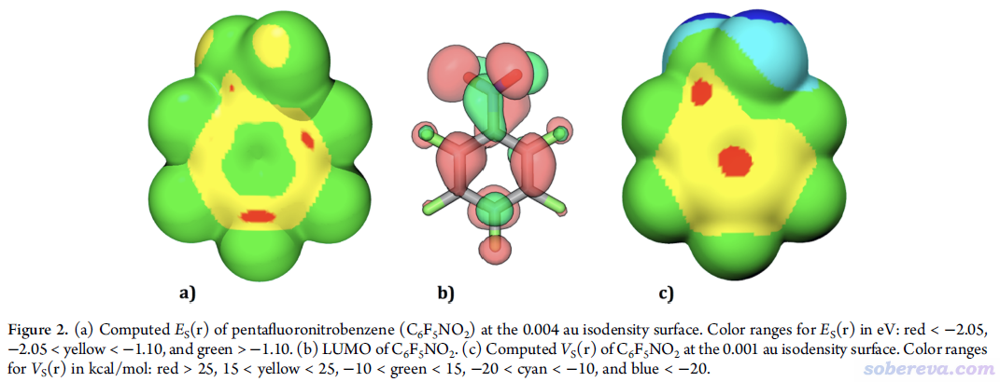

上图b是五氟硝基苯的LUMO等值面图，可见LUMO在间位的碳上也有非常明显的分布，因此LUMO对此体系的邻、对位发生选择性亲核反应的特点表现得不够充分，远不如LEAE。上图c是表面静电势图，红色是最正的部分（>25 kcal/mol），根本都没体现出邻、对位的碳在发生亲核反应时比间位的碳有任何优势，因此对预测亲核位点完全失败。之所以苯环正上方区域静电势为正，这是因为当前苯环连的都是吸电子基团，导致苯环pi电子密度较低，对核电荷对静电势的正贡献抵消减弱所致；另一方面，根据计算公式可知，静电势是有跨空间效应的，某个碳的pi电子的减少会影响到附近区域的静电势，各个碳的这个效应叠加导致静电势最正的区域出现在了它们的中央。

下图是一系列氟取代的杂环体系，LEAE都正确预测对了发生亲核芳香取代的位点，并且图中把相应位点的表面LEAE极小值与反应速率常数k的ln之间的关系绘制了出来，可见有很好的线性相关性，即反应位点处分子表面LEAE越负，发生亲核反应的速率常数越大。

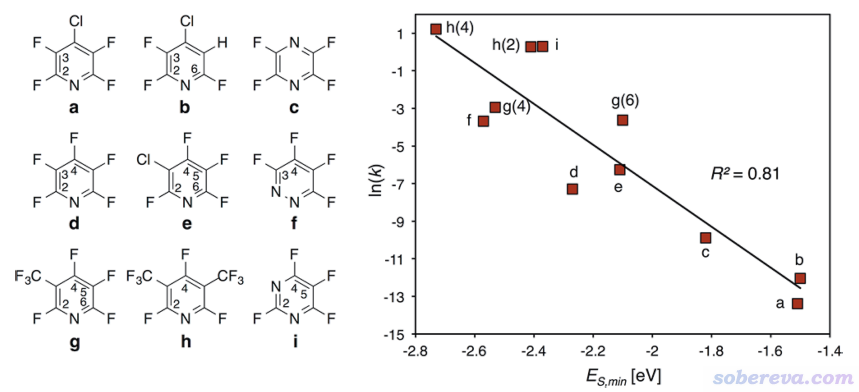

LEAE原文考察了不同方式取代的硝基二苯乙烯，如下图所示，发现表面LEAE极小值出现的位置都在β碳上，正对应于HOCH2CH2S-与它们发生亲核加成的位置。并且这些极小值与ln(k)有极好的线性关系。这再次体现出LEAE在判断亲核反应位点和难易方面很有用。一旦拟合出这种关系后，R3、R4为其它基团时的k就能较准确且很方便地预测出来。

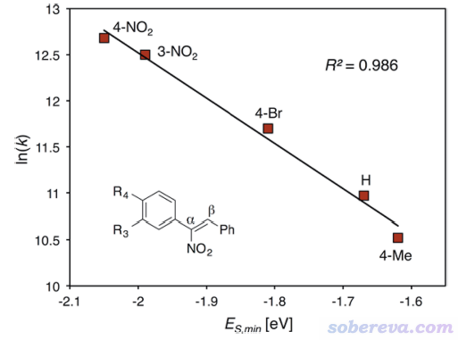

### 1.3 局部电子附着能在研究弱相互作用上的用处

下图左侧是溴代甲烷分子表面的LEAE，最负的地方是红色，较负的地方是黄色，可见LEAE一方面展现了Br的显Lewis酸性的sigma-hole区域，一方面把CH3部分能被SN2亲核进攻的地方展现了出来。顺带一提，亲核进攻方向还可以用《通过电子定域化函数(ELF)、价层电子密度分析讨论亲核进攻的方向》（<http://sobereva.com/606>）介绍的方法讨论。

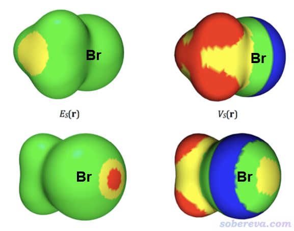

静电势在讨论静电效应对分子间相互作用的控制方面用得极其普遍，例如《静电效应主导了氢气、氮气二聚体的构型》（<http://sobereva.com/209>）、《全面探究18碳环独特的分子间相互作用与pi-pi堆积特征》（<http://sobereva.com/572>）。上图右侧是分子表面静电势，由最负到最正按照蓝-绿-黄-红变化，可见静电势和LEAE反应的信息既有共性也有差异。静电势除了把Br的sigma-hole展现出了以外，还把Br原子的一圈孤对电子导致的Lewis碱性区域（蓝色部分）展现了出来。在CH3一侧，静电势较正的区域除了能受到SN2进攻的部分外，还有带正电的氢的部分。因此相对于静电势比较完整地展现分子表面各区域的亲核亲电特征来说，LEAE仅展现出亲电部分，而且还仅限比较“软”（易发生电子转移和极化）的亲电部分。因此在研究弱相互作用方面，LEAE与静电势有明显互补性。

下图是不同的卤代甲烷形成卤键的位点的表面LEAE极小值和相互作用能之间的关系，可见线性相关性极好。这充分体现出LEAE不仅能用来讨论亲核反应，在研究弱卤键作用方面也颇有价值（用于磷键、碳键等其它以hole作为Lewis酸形成的静电主导的相互作用方面应当也有类似的价值）。

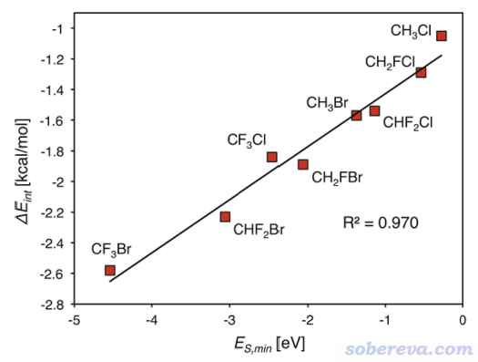

LEAE原文发现卤原子表面的LEAE极小值与静电势极大值有较高相关性，但也有一定互补性，如果将二者同时作为变量构建与相互作用能的关系的话，可以得到更理想的线性关系。下图的卤代苯形成的卤键相互作用能就是例子，红线标注的式子里E_S,min是卤原子表面LEAE极小点数值，V_S,max是其表面静电势极大点数值。

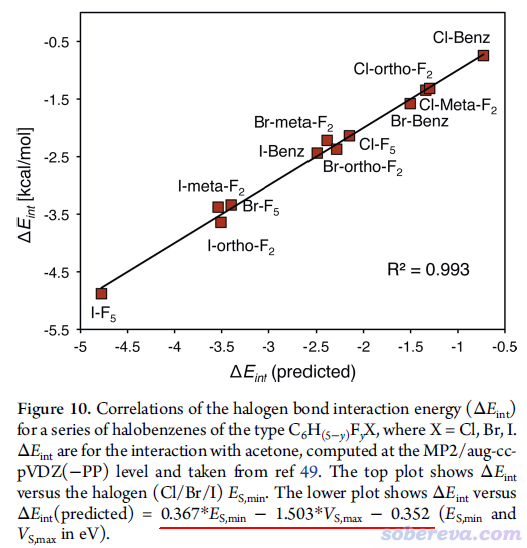

## 2 使用Multiwfn计算分子表面上局部电子附着能的极值点

这一节就以五氟硝基苯（C6F5NO2）为例具体介绍如何通过Multiwfn计算分子表面上LEAE极值点位置和数值，其实操作和《使用Multiwfn的定量分子表面分析功能预测反应位点、分析分子间相互作用》（<http://sobereva.com/159>）里介绍的非常相似。本文例子涉及的所有文件在<http://sobereva.com/attach/676/file.zip>里都有。坐标都是用LEAE原文里用的B3LYP/6-31G*级别优化的，.fch波函数文件都是Gaussian 16在B3LYP/6-31+G**下算单点产生的。

读者一定要使用2023-Jul-4及以后更新的Multiwfn。Multiwfn可以在官网<http://sobereva.com/multiwfn>免费下载。对Multiwfn不了解者参见《Multiwfn入门tips》（<http://sobereva.com/167>）、《Multiwfn FAQ》（<http://sobereva.com/452>）、量子化学波函数分析与Multiwfn程序培训班（<http://www.keinsci.com/workshop/WFN_content.html>）。如果你还不知道怎么产生Multiwfn做波函数分析所需的输入文件如.fch，看《详谈Multiwfn支持的输入文件类型、产生方法以及相互转换》（<http://sobereva.com/379>）。注意，计算LEAE所用的波函数文件必须带有空轨道信息，因此不能用比如.wfn这种不含空轨道信息的格式当Multiwfn的输入文件。

本文文件包里的C6F5NO2.gjf是在B3LYP/6-31G*优化的结构上做B3LYP/6-31+G**计算的Gaussian输入文件，用Gaussian运行之，得到C6F5NO2.chk。然后用formchk将之转成fch格式，所得的C6F5NO2.fch在本文的文件包里已经提供了。启动Multiwfn，载入此文件，然后输入  
12  //定量分子表面分析  
2  //选择映射的函数  
-4   //LEAE（如果选4则是LEA）。注意之后Multiwfn自动把分子表面的定义从默认的0.001 a.u.电子密度等值面切换为了0.004 a.u.  
0  //开始分析

电子密度和LEAE计算耗时极低，当前体系又小，Multiwfn的效率又非常高，因此一瞬间就算完了。注意屏幕上显示了分子表面上LEAE的各种统计量，以及所有极小点和极大点坐标和数值。我们感兴趣的只有表面极小点，结果列在了下面，以各种单位表示的LEAE值都给出了，带星号的是表面最小点数值

 The number of surface minima:    23  
    #       a.u.         eV      kcal/mol           X/Y/Z coordinate(Angstrom)  
      1 -0.06045870   -1.645165  -37.938437      -2.053417  -0.331424  -3.315850  
      2 -0.06891843   -1.875366  -43.247002      -1.507986   1.481935   1.357405  
      3 -0.07754516   -2.110111  -48.660361      -1.469940  -1.570369  -0.320762  
      4 -0.06736260   -1.833030  -42.270707      -1.470715  -1.465427   1.483792  
 *    5 -0.08159589   -2.220337  -51.202240      -1.484711   0.007741   2.216138  
      6 -0.07346095   -1.998974  -46.097480      -1.500188   1.473500  -0.336122  
      7 -0.07536621   -2.050819  -47.293049      -1.074943   0.940426  -1.922978  
      8 -0.01117322   -0.304039   -7.011307      -0.827293   3.377774  -1.353531  
      9 -0.01055470   -0.287208   -6.623180      -0.614413  -3.455994  -1.378276  
     10 -0.01339108   -0.364390   -8.403035      -0.039211  -3.526215   2.507591  
     11 -0.06047453   -1.645596  -37.948370      -0.024936  -2.058019  -3.319430  
     12 -0.01491144   -0.405761   -9.357077      -0.017163  -0.002495   4.539262  
     13 -0.06052520   -1.646974  -37.980166       0.048059   2.074908  -3.302895  
     14 -0.01339150   -0.364401   -8.403302       0.058848   3.544428   2.473038  
     15 -0.01054264   -0.286880   -6.615611       0.589544   3.454318  -1.406822  
     16 -0.01117424   -0.304067   -7.011948       0.868346  -3.349096  -1.351258  
     17 -0.07520552   -2.046446  -47.192218       1.155106  -0.842080  -1.924120  
     18 -0.06890413   -1.874977  -43.238030       1.510073  -1.490657   1.329452  
     19 -0.07346343   -1.999042  -46.099037       1.508220  -1.439197  -0.339503  
     20 -0.08158888   -2.220146  -51.197836       1.484706   0.011734   2.216151  
     21 -0.06734033   -1.832423  -42.256728       1.467340   1.488012   1.473255  
     22 -0.07751511   -2.109293  -48.641507       1.473641   1.590240  -0.223002  
     23 -0.06050316   -1.646375  -37.966336       2.049444   0.308546  -3.302895

在后处理菜单里选择0，会进入观看结构和极值点的图形界面。将窗口右侧的Ratio of atomic size设大到3.0，取消选择Maximum position复选框来隐藏极大点，然后选中Minimum label复选框以显示极小点序号，通过Size of labels适当调整标签的大小，此时看到的图像如下所示

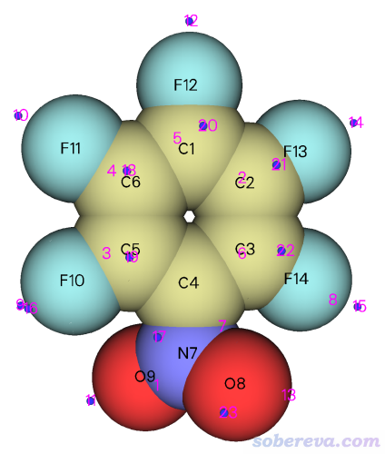

上图中蓝色小球是表面LEAE极小点位置，可见在邻、间、对位碳的上方都有极小点。对照文本窗口显示的数值，可知对位碳的表面LEAE极小点（20号）的值是-2.22 eV，和LEAE原文里给出的几乎精确一致。两个临位碳的极小点是19和22号，数值分别为-2.00和-2.11 eV，实际讨论时可以取平均值。在两个间位碳上也有极小点，是18和21号，数值分别为-1.87和-1.83 eV，明显比临、对位的更正，体现出间位不是亲核反应发生的优先位点。17号极小点与氮相对应，这也正体现前述的氮的pi-hole的存在。

这里也顺便对LEAE做一下我提出的局部分子表面分析，具体介绍可以看Multiwfn手册3.15.2.2节，这比起仅仅考察极值点一个位置的数值更能全面地展现原子的特征。在Multiwfn后处理菜单选择11，马上看到各个原子局部表面上的LEAE的统计量，其中一部分如下所示，这体现的是各个原子局部表面上LEAE所有值/正值部分/负值部分的平均值（由于没有负值部分，所以这部分为NaN，即not a number）。可见对位碳（1号）局部表面上LEAE平均值为-1.455 eV，是所有原子最负的，肯定特别容易发生亲核反应。临位碳（3号和5号）其次，约-1.31 eV，而间位碳2和6号原子为-1.29 eV，比邻、间位更正，故最不容易发生亲核反应。此结论和基于表面极小点进行分析是一致的。

Atom#    All/Positive/Negative average  
     1    -1.45512        NaN   -1.45512  
     2    -1.28606        NaN   -1.28606  
     3    -1.31096        NaN   -1.31096  
     4    -1.06736        NaN   -1.06736  
     5    -1.30834        NaN   -1.30834  
     6    -1.28796        NaN   -1.28796  
     7    -0.84143        NaN   -0.84143  
     8    -0.57892        NaN   -0.57892  
     9    -0.58036        NaN   -0.58036  
    10    -0.30322        NaN   -0.30322  
    11    -0.34908        NaN   -0.34908  
    12    -0.39730        NaN   -0.39730  
    13    -0.34974        NaN   -0.34974  
    14    -0.30276        NaN   -0.30276

## 3 使用Multiwfn结合VMD绘制分子表面的局部电子附着能

本节介绍怎么在Windows下基于Multiwfn和VMD方便地绘制漂亮的LEAE着色的分子表面图。本文用的VMD是1.9.3版，可以在<http://www.ks.uiuc.edu/Research/vmd/>免费下载。这里利用了Windows批处理文件以简化操作，阅读《详谈Multiwfn的命令行方式运行和批量运行的方法》（<http://sobereva.com/612>）可以充分了解利用批处理文件运行Multiwfn的原理。

先进行准备工作：将Multiwfn目录下的examples\scripts\local_EA子目录下的LEAE_isoext.txt和LEAE_isoext.bat都拷到Multiwfn可执行文件所在目录，将LEAE_isoext.vmd拷到VMD目录下（即VMD启动后在文本窗口输入pwd命令显示的目录）。

此例绘制1-溴-3,5-二氟苯。其波函数文件是本文file文件包里的C6F2H3Br.fch，产生此文件用的Gaussian输入文件C6F2H3Br.gjf也一起给出了。进行以下操作：  
(1)C6F2H3Br.fch拷到Multiwfn可执行文件所在目录  
(2)在LEAE_isoext.bat上点右键，选“编辑”，第一行Multiwfn后面的文件名改成C6F2H3Br.fch。然后把此文件里2、3、4行的VMD目录改成你机子里VMD的实际目录，之后保存文件  
(3)双击LEAE_isoext.bat批处理文件运行。此时它会把LEAE_isoext.txt里记录的命令传递给Multiwfn进行运算，产生的userfunc.cub、density.cub、surfanalysis.pdb会自动被挪到VMD目录下  
(4)启动VMD，输入source LEAE_isoext.vmd来运行作图脚本，然后马上看到下图

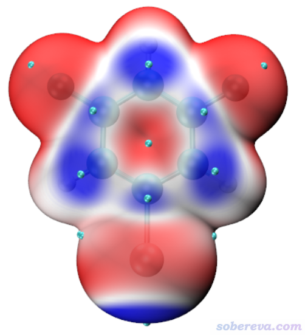

此图展现了电子密度=0.004 a.u.对应的分子表面的LEAE。脚本默认的色彩刻度是-0.03到0.0 a.u.（1 a.u.=27.2114 eV，故对应-0.82到0.00 eV）按照蓝-白-红变化，即越蓝的地方LEAE越负、亲电性越强、越易发生亲核反应。从此图可以清楚地看出溴的sigma-hole区域很亲电，以及溴的邻、对位的碳的亲电性比间位的碳更强。图中青色小球是表面极小点位置。

如果在默认的色彩刻度范围下分子表面只有一种颜色，或者颜色区分不开的话，需要自行调节色彩刻度范围，比如在VMD文本窗口输入mol scaleminmax 0 1 -0.04 0.0就可以把色彩刻度改为-0.04到0.0。在LEAE_isoext.vmd脚本里也可以直接改默认的色彩刻度。

关于色彩刻度条的显示问题，参考《使用Multiwfn+VMD快速地绘制静电势着色的分子范德华表面图和分子间穿透图（含视频演示）》（<http://sobereva.com/443>）里相应部分。

想查询各个表面极小点数值的话，点击VMD的图形窗口激活之，再点击键盘上的0进入VMD的查询模式（此时光标会变成十字），然后点击一个表面极小点对应的圆球的正中心，文本窗口里如果显示比如index 36，就在文本窗口输入[atomselect top "index 36"] get beta然后回车，此时显示的数值就是以eV为单位的LEAE值。

按照以上说明，把色彩刻度轴添加、把表面LEAE极小点数值标注，并且把色彩刻度设为-1.0至0.0 eV （-0.0367至0.0 a.u.）后，看到的图像如下所示，可见效果很好。

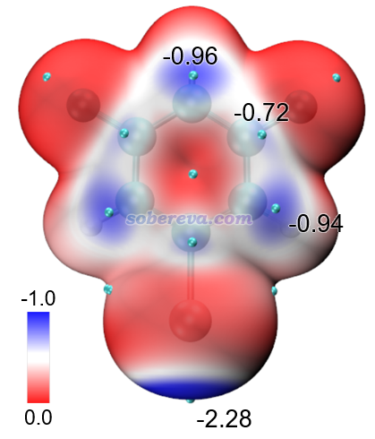

作图脚本默认是对等值面使用EdgyGlass材质，大家如果想修改显示效果，可以进入VMD的Graphics - Materials界面，选择EdgyGlass，然后调节各种材质属性，比如透明度等。

值得一提的是，此例也反映出LEAE比起只靠LUMO分析亲电位点的一个明显优点。下图是按照《使用Multiwfn观看分子轨道》（<http://sobereva.com/269>）绘制的此体系的LUMO和LUMO+2等值面图。可见LUMO完全在苯环上，如果只拿LUMO说事，根本体现不出Br的sigma-hole的亲电特征，而LUMO+2才把sigma-hole给体现出来。在当前计算级别下，LUMO到LUMO+3的能量都低于0，因而都被LEAE所纳入了，这是为什么LEAE能同时展现出sigma-hole和芳环上的亲电区域。

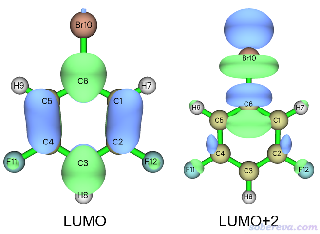

本文的文件包里还有个benzylidenemalononitrile.fch，下面是对这个体系作的LEAE图以及对各个表面极小点标注的LEAE值，色彩刻度用-0.08至0.0 a.u.。图中最蓝的地方是β碳，正对应于此体系能发生亲核反应的位置。取代基的临、对位碳上LEAE比其它碳更负，也正对应于这俩位置是选择性发生亲核芳香取代的位点。

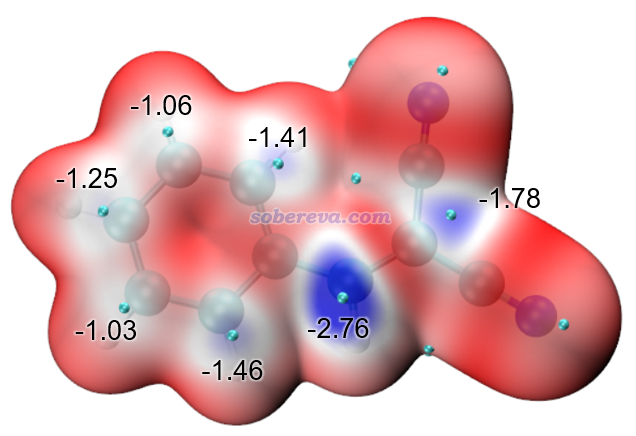

## 4  总结

本文对局部电子附着能（local electron attachment energy，LEAE）的定义、特点做了介绍，并且讨论了它与其它有类似用途的分析方法的异同。从本文的例子可见，LEAE不仅能用于预测/解释一个分子中的亲核反应位点，还能横向对比类似分子发生同类亲核反应的难易，而且还能用于讨论卤键、碳键、磷键等通过局部显Lewis酸特征的hole形成的弱相互作用。通过Multiwfn，可以非常便利、快速地实现LEAE的分子表面定量分析，还能结合VMD绘制美观、直观又很能说明问题的LEAE着色的分子表面图像。LEAE无疑像平均局部离子化能（ALIE）和静电势一样是非常有实用价值的实空间函数，值得在实际研究中利用。分子表面LEAE极小值也可以视为一种有意义的分子描述符，给《Multiwfn可以计算的分子描述符一览》（<http://sobereva.com/601>）介绍的Multiwfn能算的众多描述符中又增加了新的一员。本文中的这些分析手段对于ALIE、静电势同样适用，前面文中引用的博文里都有详细说明。

**使用Multiwfn做LEAE分析请务必记得按照程序包里的How to cite Multiwfn.pdf中的说明对Multiwfn的原文进行恰当引用。如果涉及到讨论分子表面LEAE极值点，也请同时引用J. Mol. Graph. Model., 38, 314 (2012)，其中详细介绍了Multiwfn做定量分子表面分析、搜索表面极值点的算法。**

补充：有读者看完本文后，在使用Multiwfn做LEAE分析时发现没有结果。要么是输入文件没用对（不含波函数信息，或者不含空轨道），要么就是LUMO的能量为正，这不满足本文明确说的计算LEAE的要求。LUMO能量为正时，确保基组用的是LEAE原文建议用的6-31+G**（或者其它带弥散函数的基组，如ma-def2-TZVP），并且结合B3LYP或者与之HF成份差不多的泛函如PBE0。如果此时LUMO能量也为正，那就没法用LEAE了，只能靠别的方式来考察，比如上文提及的福井函数或轨道权重福井函数fw+。
