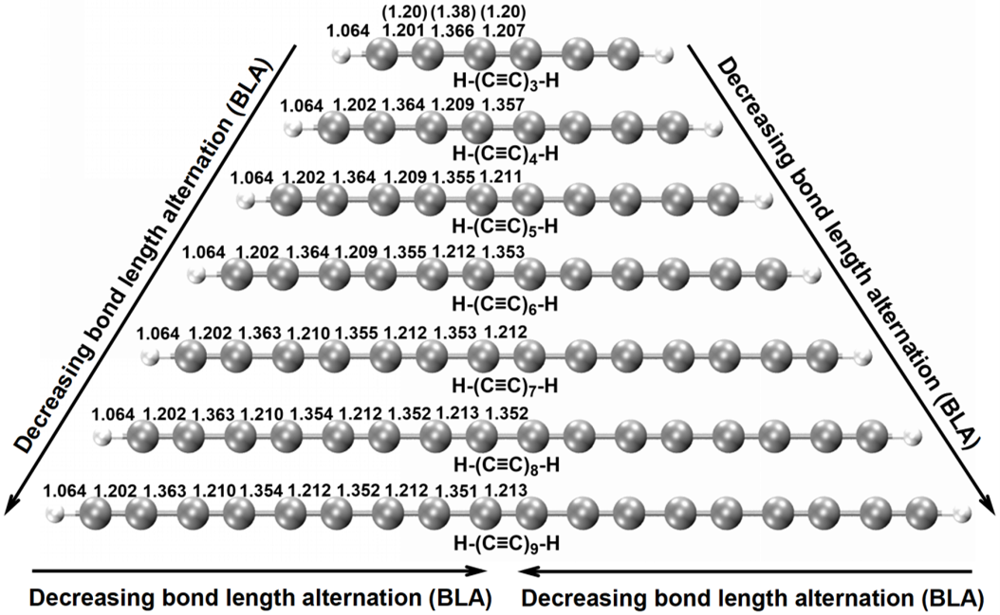
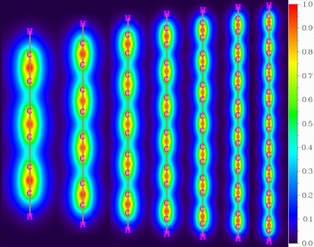
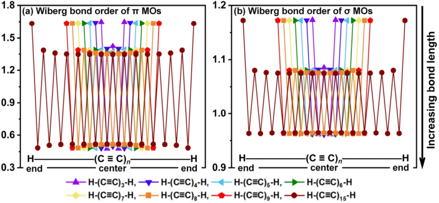
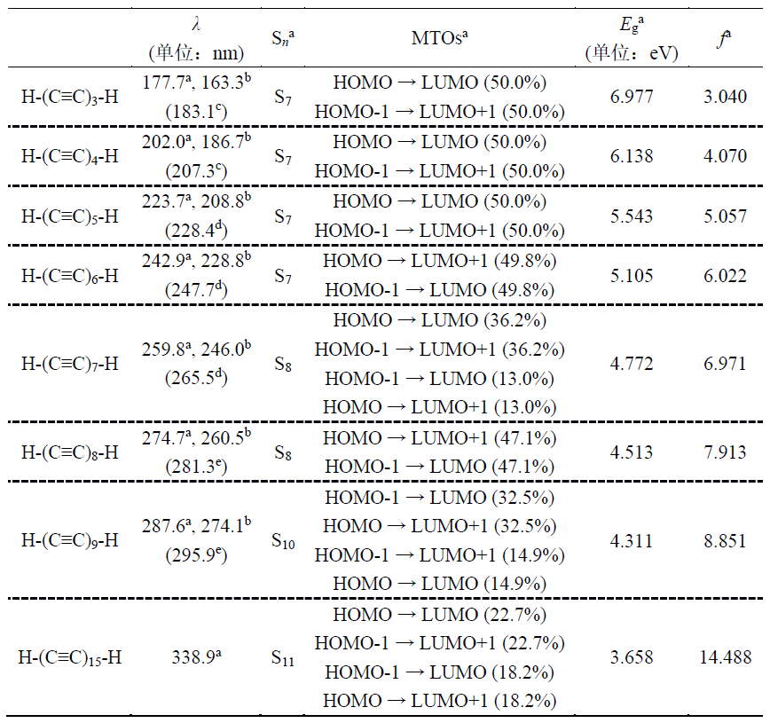
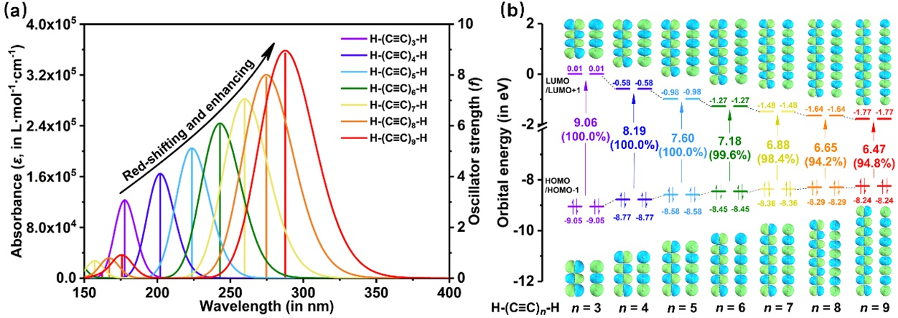
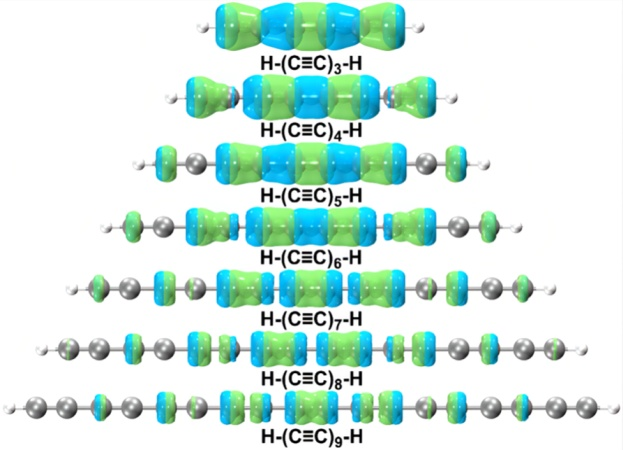
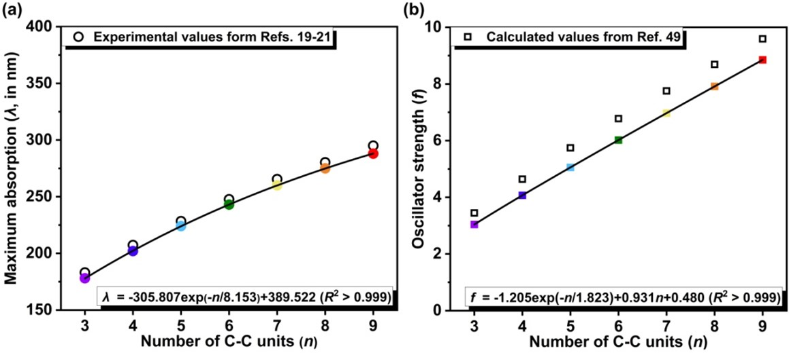

江苏科技大学的刘泽玉等人和北京科音自然科学研究中心的卢天等人近期发表了一篇非常系统性的通过理论计算研究碳链体系的电子光谱文章：

Jiaojiao Wang, Zeyu Liu,* Qing Zhou, Tian Lu,* Xia Wang, Xiufen Yan,* Mengdi Zhao, Aihua Yuan, Size dependence of electronic spectrum for H-capped carbon chains, H-(C≡C)n-H (n = 3–9, 15): Analysis of its nature and prediction for carbyne, *Comput. Theor. Chem.*, **1227**, 114255 (2023) DOI: 10.1016/j.comptc.2023.114255

<https://pan.baidu.com/s/1S8-wURaxp9_VEbUN1q-H_g?pwd=x2e1>

下文是此文的中文版，欢迎阅读和引用。本文研究的碳链体系和18碳环（cyclo[18]carbon）有非常紧密的联系，18碳环的相关理论研究工作汇总见<http://sobereva.com/carbon_ring.html>

文中使用的LOL-pi分析的介绍见《在Multiwfn中单独考察pi电子结构特征》（<http://sobereva.com/432>），文中用的空穴-电子分析介绍见《使用Multiwfn做空穴-电子分析全面考察电子激发特征》（<http://sobereva.com/434>），文中用的BLA、BOA分析见《使用Multiwfn计算Bond length/order alternation (BLA/BOA)和考察键长、键级、键角、二面角随键序号的变化》（<http://sobereva.com/501>）。

**氢封端碳链H-(C≡C)n-H (n = 3-9, 15)的电子光谱的尺寸依赖性：性质分析及对碳炔的预测**

Size dependence of the electronic spectrum of the hydrogen-terminated carbon chain H-(C≡C)n-H (n = 3-9, 15): Property analysis and prediction for carbyne

## 摘要

碳链的电子光谱的本质迄今还没有得到很好的理解，值得进一步研究。在本工作中，采用（含时）密度泛函理论TDDFT研究了H-(C≡C)n-H (n = 3-9)的几何结构、电子结构以及11Σu+ ← X1Σg+电子跃迁。计算的几何参数和垂直激发能与已知的实验观测完全一致。通过对碳链电子激发的波函数分析，深入解释了碳链的电子和光学特性的尺寸依赖性，并对它们进行了数据拟合和外推，通过n = 15的特定分子证实了拟合公式的准确性。根据提出的外推公式，可以估算出碳链分子电子和光学特性在链长增加时呈现出的特性，甚至获得sp杂化碳同素异形体碳炔的极限值。

**关键词**：碳链，聚炔，碳炔，电子光谱，尺寸依赖性

## 1. 前言

碳链是由sp杂化的碳原子连接的一维线性分子，通式为R-(C≡C)n-R。氢封端的H-(C≡C)n-H是各种末端取代的碳链的最简单形式。在文献中，它们有时被称为聚乙炔，这是错误的，因为分子式为(H-C≡C-H)n的聚合物才是聚乙炔，而H-(C≡C)n-H的确切名称应该是聚炔。

早期的探索发现，氢封端的碳链与密集星际云化学有关，这些高度不饱和的聚合物对星际介质的天体化学演化有显著贡献[1]。此外，还检测到它们是形成多环芳烃和富勒烯的中间体[2]。最近通过凝聚相实验[3，4]成功合成并表征了环[18]碳，这唤起了碳链的另一个长期隐藏的身份，即它们可能是此类化学性质不稳定的碳原子环的开环产物[5]。在对环[18]碳及其类似物和衍生物[6-18]进行理论研究的同时，我们也对不同长度碳链的性质感兴趣。由于环状碳簇的电子光谱已经得到了广泛研究[6，8，10]，具有类似电子结构的链状分子H-(C≡C)n-H的相关性质就成为一个值得研究的课题。

在气相（n = 1-13）[19-21]、溶液（n = 2-10，12）[19，22]和氖（n = 6-12）[23]等不同介质中的实验已经观察到了几种H-(C≡C)n-H链的吸收光谱，并证明了它们的电子和光学特性与尺寸有关。此外，还有对氢封端碳链的结构特征、电子激发能和振子强度的尺寸依赖性进行的一些理论研究[24-27]。但是，也许是受当时分析手段的限制，几乎所有的报道都仅仅是关于吸收带的位置和分布的，对碳链尺寸依赖的光学特性还缺乏全面的理解和分析。此外，通过外推有限长度碳链性质的尺寸依赖性来预测假想的碳同素异形体碳炔的相关性质具有重要的理论和实际意义。

延续我们对具有特殊拓扑结构的材料分子的研究兴趣[6-18,28-32]，本文详细考察了碳链H-(C≡C)n-H (n = 3-9, 15)在气相中的光学激发性质，并在电子结构水平上揭示了其尺寸依赖性的本质。所提出的电子和光学特性的拟合公式可以推广到更长的碳链上，并有望用于预测sp杂化碳同素异形体碳炔的性质。

## 2. 计算细节

我们最近的研究发现，ωB97XD/def2-TZVP水平可以很好地再现实验观测以及UCCSD/def2-TZVP水平上[7,9,16]计算得到的环[18]碳的几何结构，这也保证了其对当前具有相同sp杂化构型的体系的优化具有准确性和稳健性。因此，本工作在气相条件下，使用ωB97XD交换相关泛函[33]和def2-TZVP基组[34]，通过密度泛函理论（DFT）对碳链H-(C≡C)n-H (n = 3-9, 15)的几何结构进行了优化。所有优化的几何结构都是键长交替的线型结构，并且是没有虚频的势能面极小点。碳链的激发能通过含时密度泛函理论（TD-DFT）计算得到，与几何优化的计算水平ωB97XD/def2-TZVP相同。

上述所有量子化学计算均采用Gaussian 16 (A.03)程序包[35]完成。此外，我们还利用ORCA软件[37]进行了高精度的STEOM-DLPNO-CCSD/def2-TZVP计算[36]以验证TDDFT电子激发计算的可靠性。本文还使用Multiwfn 3.8(dev)进行了电子结构分析[38]。基于Multiwfn导出的文件，通过VMD软件[39]绘制了分子轨道（MO）和实空间函数的等值面图。

## 3. 结果与讨论

### 3.1 几何和电子结构

碳链H-(C≡C)n-H具有11Σg+基态，且具有闭壳层电子构型[20,25]。在ωB97XD/def2-TZVP水平上优化的碳链H-(C≡C)n-H (n = 3-9)基态几何结构如图1所示，H-(C≡C)n-H (n = 3-9)的笛卡尔坐标见表S1。

**图1.** 在ωB97XD/def2-TZVP水平上优化的碳链H-(C≡C)n-H (n = 3-9)的基态几何结构。图中还显示了计算的（括号外）和实验的（括号内）[40]键长（单位：Å）。

如图1所示，基态碳链H-(C≡C)n-H (n = 3-9)是具有中心对称性的长短C-C键交替的线型结构，属于D∞h点群。这种键长交替（BLA）的结构被以前关于碳链体系的光学和理论研究所认可[21,26,27,40-44]，这种对称性降低的变形可以理解为Peierls畸变的结果[26,45]。从数值上看，计算出的H-(C≡C)3-H的C-C键长为1.201/1.366/1.207 Å，与仅有的实验观察结果1.20/1.38/1.20 Å一致[40]。

完全基于π分子轨道计算的定域化轨道定位函数（LOL）[46]，即LOL-π，是一个用于揭示分子中π电子的离域情况的非常流行的实空间函数[6,11,13,47]。由于其独特的sp杂化电子构型，碳链被认为有两套类似于环碳的相互垂直的π共轭系统[6]。表S2列出了碳链H-(C≡C)n-H (n = 3-9)的两组π分子轨道编号。图2和图S1分别显示了在链上方0.5 Å的平面上的一组π系统（LOL-πx）和在包含链的平面上的另一组系统（LOL-πy）的LOL-π的填色图。尽管π电子的整体离域作用是显著的，但由于长C-C键的性质更类似于单键，因此LOL-π在短C-C键附近的分布比在长C-C键附近的分布要充分得多，这很大程度上体现了长C-C键附近的电子离域作用的受阻。

**图2.** 碳链H-(C≡C)n-H (n = 3-9)的LOL-πx在碳链上方0.5 Å平面上的填色图，原子核位置用粉红色字母标出，化学键用棕色直线标出。

Wiberg键级反映了两个成键原子共享电子对的平均数目，通过它可以确定成键特性[48]。对于所研究的碳链H-(C≡C)n-H (n = 3-9)，Wiberg键级可以进一步分解为π分子轨道贡献和σ分子轨道贡献以研究它们各自的特性。图3(a)和(b)分别绘制了计算得出的碳链π和σ分子轨道的Wiberg键级。可以看出，虽然长C-C键的π轨道的Wiberg键级明显小于短C-C键，这表明长C-C键的π共轭作用较差，但长C-C键的π电子离域绝不能被轻易地忽略，因为相应的π-Wiberg键级达到了约0.48，是个不小的值。从链末端到链中心，π分子轨道的键级和σ分子轨道的键级都略有下降。尤其是最末端的C-C键（短键）的键级颇大，这显然是参考文献[26]中描述的末端效应造成的。碳链的键级分析结论与前面提到的通过BLA和LOL-π进行的键长和轨道离域性的分析是一致的。

**图3**. 碳链H-(C≡C)n-H (n = 3-9, 15)的 (a) π分子轨道和 (b) σ分子轨道贡献的Wiberg键级。

### 3.2 11Σu+ ← X1Σg+激发的电子光谱

除了红外（IR）光谱，电子光谱是检测和确定分子存在的另一种方法[49]。根据选择规则，sp杂化碳链的允许跃迁被归结为11Σu+ ← X1Σg+激发。本文采用两种理论方法计算了碳链H-(C≡C)n-H (n = 3-9, 15)的50个最低激发态的激发能和振子强度。由TD-ωB97XD/def2-TZVP和非常稳健但昂贵得多的STEOM-DLPNO-CCSD/def2-TZVP计算获得的相关数据以及11Σu+ ← X1Σg+跃迁的实验值列于表1中。

**表****1.** 计算的（括号外）和实验的（括号内）吸收波长（λ）、碳链H-(C≡C)n-H (n = 3-9, 15) 11Σu+ ← X1Σg+跃迁所涉及的激发态（Sn）、主要跃迁轨道（MTOs）、跃迁能（Eg）和振子强度（f）

a 本工作，TD-ωB97XD/def2-TZVP水平。  
b 本工作，STEOM-DLPNO-CCSD/def2-TZVP水平。  
c 参考文献[19]。  
d 参考文献[20]。  
e 参考文献[21]。

从表1可以看出，对于所研究的碳链，两种理论方法得到的11Σu+ ← X1Σg+波长的趋势一致，两者的系统偏差为14.3 ± 1.0 nm。在TD-ωB97XD/def2-TZVP水平上，11Σu+ ← X1Σg+波长的计算值与所有实验观测值惊人地一致。具体而言，相对于实验值，模拟的波长总体小了5.6 ± 1.8 nm。这种一致性证实了我们计算方式的可靠性，并确保了所有后续特性分析的准确性。

虽然表1中的STEOM-DLPNO-CCSD结果也显示出理想的精度，但其性能轻微劣于TD-ωB97XD。我们认为，ωB97XD在全局离域聚炔的TD-DFT计算中表现如此出色的关键原因之一在于它在长程极限（100%）时的Hartree-Fock成分非常高，这极大地避免了严重影响大范围共轭体系描述精度的自相互作用误差问题。本研究中采用的非常有效的TD-ωB97XD/def2-TZVP水平对于研究具有类似一维共轭特性的其它系统也很有适用性。

运用TD-DFT计算的结果模拟这些聚炔的吸收光谱如图4(a)所示。结果表明，碳链H-(C≡C)n-H (n = 3-9)的11Σu+ ← X1Σg+吸收带都是由基态S0到较高激发态Sn（n = 7、8或10）的跃迁产生的。随着链长的增加，吸收带明显地向长波方向移动。碳链中11Σu+ ← X1Σg+跃迁的振子强度也随着链长的增加而增大，这正如Vuitton和Scemama等人在他们的理论工作中所发现的[24,49]。振子强度之所以呈现出如此变化的趋势，原因有以下两点：(1)我们的计算结果清楚地表明，碳链的激发能随着链长的增加而降低，而激发能是振子强度的分母；(2)由于参与跃迁的轨道在整个碳链上离域，如图4(b)所示，碳链越长，跃迁偶极矩越大，振子强度与跃迁偶极矩的模的平方成正比。巧合的是，我们计算的H-(C≡C)n-H (n = 3-9)的振子强度值非常接近链中的n值，且整体略小于相应的半经验结果[49]。值得一提的是，环[18]碳在相同计算水平下的振子强度为f = 3.02[6]，远小于相近尺寸碳链的振子强度。

**图3.** (a)碳链H-(C≡C)n-H (n = 3-9)的电子光谱（曲线）和振子强度（竖线）。采用半峰半宽（HWHM）为0.333 eV的高斯函数将理论计算的数据展宽为光谱曲线。(b)碳链H-(C≡C)n-H (n = 3-9)在各自关键激发态的主要分子轨道（等值面为0.006）。绿色和蓝色区域分别表示正和负轨道相位。

如表1所示，所研究体系在紫外范围内的强吸收几乎都是由前线分子轨道HOMO-1/HOMO → LUMO/LUMO+1之间的电子激发产生的，它们都对应于典型的π-π*激发。由于碳链H-(C≡C)n-H (n = 3-9, 15)的对称性，分子的HOMO-1/HOMO和LUMO/LUMO+1分别在能量上相互简并。在图4(b)中，占据的前线分子轨道（HOMO-1/HOMO）和未占据的前线分子轨道（LUMO/LUMO+1）的能级分别随着链长的增加而增加和减小，导致分子的前线分子轨道能隙显著减小。能隙的减小反映了较长碳链中电子相关性的增加，在其他π共轭低聚物中也观察到了相同的行为[8,50-52]。可以预期其它分子轨道能级也会以与这些前线分子轨道相同的方式发生变化，因此随着碳链的增长，吸收带会发生明显的红移。值得注意的是，随着链长的增加，HOMO-1/HOMO → LUMO/LUMO+1电子跃迁对最大吸收的贡献逐渐减小，这表明在较长的碳链中有更多的其它轨道参与了11Σu+ ← X1Σg+跃迁，这是前线分子轨道的能级分布随着碳链长度的增加而变得更密集的必然结果。顺带一提，在氖介质和溶液中通常可以观察到相对于气相中吸收波长的相当恒定的红移，这与链的大小没有明显的关系[21-23]。关于非真空中电子跃迁的讨论不属于本工作的研究范围。

非常流行的空穴-电子分析方法可以更具体地展示电子跃迁过程的特征[6,8,10,17,28,53]。关于空穴-电子分析方法的相关描述，参见参考文献[6]。各种碳链的关键的电子激发的空穴-电子分布如图5所示，由此图展现的特征我们可以再次确定，所有碳链的最大吸收都是由π-π*跃迁引起的，因为涉及11Σu+ ← X1Σg+激发的相应空穴和电子都环绕分布在C-C键周围，相关特性与环碳分子的电子跃迁特性相一致[6,8]。图5还显示，在11Σu+ ← X1Σg+激发过程中，空穴和电子的分布相对更加局域化，即集中在碳链的中心，而不是沿整个碳链均匀分布。这说明碳链中间的π电子共轭比两端的强，这与前面讨论的它们的几何特征一致。此外，高度重叠的空穴和电子分布与环[18]碳[6]的相关特征极其相似，这解释了碳链具有超强吸收，即巨大的振子强度的原因。

**图5.** 碳链H-(C≡C)n-H (n = 3-9, 15)在11Σu+ ← X1Σg+激发（等值面为0.005 au）的空穴和电子分布的实空间表示。绿色和蓝色区域分别表示空穴和电子分布。

### 3.3 预测碳炔的结构和激发特性

由于长链聚炔在一般条件下具有很高的反应活性，因此很难在实验室中合成，更不用说难以捉摸的碳的同素异形体碳炔了。因此，它们的几何和光学特征并不容易获得。考虑到上文讨论的碳链特性随其长度发生规律性变化的特点，将相关性质准确外推到更长尺寸可以为未来可能会发现的更长的碳链甚至为预测sp杂化的碳炔的特性提供参考。对于一条特定的碳链，正如之前的DFT计算所揭示的那样[25,43]，长C-C键和短C-C键的长度差从链的两端向中心逐渐减小，图S2中的BLA图更清楚地表明了这一点。对于不同的碳链，随着链长的增加，分子中相应位置的长C-C键和短C-C键分别有逐渐缩短和增长的趋势。然而，C-H键并没有随着链的增长而发生明显改变，这也与之前的理论研究报道一致[25,43]。虽然在目前研究的有限长度碳链中，上述两点关于BLA的规律性似乎并不特别显著，但可以想象，当链的长度无限增加时，这些规律的积累效应必然会非常明显。可以预期无限长碳链上的所有长短C-C键会分别收敛到一个恒定值。根据Scemama等人给出的碳链H-(C≡C)n-H中C-C键长度的外推公式[49]，可以推断出无限长碳链中长C-C键和短C-C键的长度分别约为1.329和1.229 Å。

以往的研究表明，11Σu+ ← X1Σg+跃迁波长与碳链中碳原子的数量之间存在线性或非线性的关系[21,24]。图3(a)展示的不同碳链H-(C≡C)n-H (n = 3-9)的允许的电子跃迁的演变过程清楚地表明碳链的11Σu+ ← X1Σg+吸收波长并不随碳链长度的增加而线性增加。图6(a)显示了11Σu+ ← X1Σg+跃迁的波长与C-C单元数量的关系。将ωB97XD/def2-TZVP水平得到的吸收波长用指数函数进行拟合可得到：

λ(nm) = -305.807exp(-n/8.153) + 389.522               (1)

该方程与之前相关性质的理论研究[25,49]保持了相同的形式，R2 > 0.999，拟合质量相当完美。将n = 15代入拟合方程得到的数值结果为341.0 nm，这与DFT直接计算得到的结果（338.9 nm）也非常吻合。因此，此处拟合的方程是可靠的，并可用于预测任意长度碳链的11Σu+ ← X1Σg+吸收波长。根据公式(1)的推断，无限长碳链的渐近值为389.5 nm。该值与之前半经验计算的结论（384 nm）相当一致[49]。通过修正计算值和实验值之间5.6 nm的系统误差，我们可以推断，碳炔-(C≡C∞)-的最大吸收将收敛到约395.1 nm。由于其绝大部分吸收带可能位于可见光区域之外，可推断碳链H-(C≡C)n-H应该像环[18]碳[6]一样是无色的，至少对于那些不是很长的碳链来说是这样。值得一提的是，我们之前对环[2N]碳（N = 3-15）光物理性质的研究表明，环碳分子中N的奇偶性不同，电子能谱的尺寸依赖性也遵循不同的规律[8]，而具有奇数和偶数C-C单元的碳链H-(C≡C)n-H (n = 3-9, 15)的变化特征则是一致的。

**图6****.** 碳链H-(C≡C)n-H中11Σu+ ← X1Σg+电子跃迁的最大波长(a)和振子强度(b)随链中C-C单元的变化。

参照参考文献[49]中的方程形式，我们提出了振子强度随碳链H-(C≡C)n-H中C-C单元数变化的外推公式：

f = -1.205exp(-n/1.823) + 0.931n + 0.480               (2)

如图6(b)所示，拟合方程的相关系数为R2 > 0.999。通过n = 15得到的外推振子强度为14.445，与DFT计算出的结果（14.488）完全一致。

## 4. 结论

本文通过(TD-)DFT计算，研究了具有广泛π电子离域的碳链H-(C≡C)n-H (n = 3-9, 15)的几何和电子结构以及吸收光谱。在所有研究的碳链中都发现了键交替现象，但随着碳链长度的增加，长C-C键和短C-C键之间的差异逐渐减小。所研究的每条碳链都有一个可观测到的吸收带，其振子强度非常大，与π-π*跃迁相对应。吸收波长和强度随碳链长度的变化而有规律地变化。对电子结构的深入分析表明，碳链的强吸收归因于电子激发过程中空穴和电子的高度重叠分布。对于较长的碳链，本文还得出了HOMO-LUMO gap、允许的11Σu+ ← X1Σg+吸收波长和振子强度的外推公式，准确性通过特定分子H-(C≡C)15-H进行了证实。这一工作比以往对碳链电子激发特性的研究更加系统和深入，有助于在实验中针对特定性质的需要合理设计不同长度的碳链。

## 参考文献

[1] J. Cernicharo, The polymerization of acetylene, hydrogen cyanide, and carbon chains in the neutral layers of carbon-rich proto-planetary nebulae, Astrophys. J., 608 (2004) L41-L44.  
[2] D.K. Bohme, PAH and fullerene ions and ion/molecule reactions in interstellar and circumstellar chemistry, Chem. Rev., 92 (1992) 1487-1508.  
[3] K. Kaiser, L.M. Scriven, F. Schulz, P. Gawel, L. Gross, H.L. Anderson, An sp-hybridized molecular carbon allotrope, cyclo[18]carbon, Science, 365 (2019) 1299-1301.  
[4] L.M. Scriven, K. Kaiser, F. Schulz, A.J. Sterling, S.L. Woltering, P. Gawel, et al., Synthesis of cyclo[18]carbon via debromination of C18Br6, J. Am. Chem. Soc., 142 (2020) 12921-12924.  
[5] D. Huang, S.L. Simon, G.B. McKenna, Chain length dependence of the thermodynamic properties of linear and cyclic alkanes and polymers, J. Chem. Phys., 122 (2005) 084907.  
[6] Z. Liu, T. Lu, Q. Chen, An sp-hybridized all-carboatomic ring, cyclo[18]carbon: Electronic structure, electronic spectrum, and optical nonlinearity, Carbon, 165 (2020) 461-467.  
[7] Z. Liu, T. Lu, Q. Chen, An sp-hybridized all-carboatomic ring, cyclo[18]carbon: Bonding character, electron delocalization, and aromaticity, Carbon, 165 (2020) 468-475.  
[8] Z. Liu, T. Lu, A. Yuan, X. Wang, Q. Chen, X. Yan, Remarkable size effect on photophysical and nonlinear optical properties of all-carboatomic rings, cyclo[18]carbon and its analogues, Chem. Asian. J., 16 (2021) 2267-2271.  
[9] Z. Liu, T. Lu, Q. Chen, Comment on "Theoretical investigation on bond and spectrum of cyclo[18]carbon (C18) with sp-hybridized", J. Mol. Model., 27 (2021) 42.  
[10] X. Wang, Z. Liu, X. Yan, T. Lu, H. Wang, W. Xiong, et al., Photophysical properties and optical nonlinearity of cyclo[18]carbon (C18) precursors, C18-(CO)n (n = 2, 4, and 6): Focusing on the effect of the carbonyl groups, Phys. Chem. Chem. Phys., 24 (2022) 7466-7473.  
[11] X. Wang, Z. Liu, X. Yan, T. Lu, W. Zheng, W. Xiong, Bonding character, electron delocalization, and aromaticity of cyclo[18]carbon (C18) precursors, C18-(CO)n (n = 6, 4, and 2): Focusing on the effect of carbonyl (-CO) groups, Chem. Eur. J., 28 (2022) e202103815.  
[12] T. Lu, Z. Liu, Q. Chen, Accurate theoretical evaluation of strain energy of all-carboatomic ring (cyclo[2n]carbon), boron nitride ring, and cyclic polyacetylene, Chin. Phys. B, 31 (2022) 126101.  
[13] Z. Liu, T. Lu, Q. Chen, Intermolecular interaction characteristics of the all-carboatomic ring, cyclo[18]carbon: Focusing on molecular adsorption and stacking, Carbon, 171 (2021) 514-523.  
[14] Z. Liu, T. Lu, Q. Chen, Vibrational spectra and molecular vibrational behaviors of all-carboatomic rings, cyclo[18]carbon and its analogues, Chem. Asian J., 16 (2021) 56-63.  
[15] T. Lu, Q. Chen, Ultrastrong regulation effect of the electric field on the all-Carboatomic ring cyclo[18]carbon, Chem. Phys. Chem., 22 (2021) 386-395.  
[16] T. Lu, Z. Liu, Q. Chen, Comment on “18 and 12 – Member carbon rings (cyclo[n]carbons) – A density functional study”, Mat. Sci. Eng. B, 273 (2021) 115425.  
[17] Z. Liu, X. Wang, T. Lu, A. Yuan, X. Yan, Potential optical molecular switch: [Lithium@cyclo[18]carbon](mailto:Lithium@cyclo[18]carbon) complex transforming between two stable configurations, Carbon, 187 (2022) 78-85.  
[18] X. Wang, Z. Liu, J. Wang, T. Lu, W. Xiong, X. Yan, M. Zhao, M. Orozco-Ic, Electronic structure and aromaticity of an unusual cyclo[18]carbon precursor, C18Br6, Chem. Eur. J., 29 (2023) e202300348.  
[19] E. Kloster-Jensen, H.-J. Haink, H. Christen, The electronic spectra of unsubstituted mono- to penta-acetylene in the gas phase and in solution in the range 1100 to 4000 Å, Helv. Chim. Acta, 57 (1974) 1731-1744.  
[20] C. Apetrei, R. Nagarajan, J.P. Maier, Gas phase 11Σu+ ← X1Σg+ electronic spectra of polyacetylenes HC2nH, n = 5-7, J. Phys. Chem. A, 113 (2009) 11099-11100.  
[21] T. Pino, H. Ding, F. Güthe, J.P. Maier, Electronic spectra of the chains HC2nH (n = 8–13) in the gas phase, J. Chem. Phys., 114 (2001) 2208-2212.  
[22] R. Eastmond, T.R. Johnson, D.R.M. Walton, A General Synthesis of the Parent Polyyens H(C=C)nH (n = 4-10,12), Tetrahedron, 28 (1972) 4601-4616.  
[23] M. Grutter, M. Wyss, J. Fulara, J.P. Maier, Electronic absorption spectra of the polyacetylene chains HC2nH, HC2nH-, and HC2n-1N- (n = 6-12) in neon matrixes, J. Phys. Chem. A, 102 (1998) 9785-9790.  
[24] V. Vuitton, A. Scemama, M.-C. Gazeau, P. Chaquin, Y. Benilan, IR and UV spectroscopic data for polyynes: predictions for long carbon chain compounds in titan's atmosphere, Adv. Space Res., 27 (2001) 283-288.  
[25] C. Zhang, Z. Cao, H. Wu, Q. Zhang, Linear and nonlinear feature of electronic excitation energy in carbon chains HC2n+1H and HC2nH, Int. J. Quantum Chem., 98 (2004) 299-308.  
[26] X. Fan, L. Liu, J. Lin, Z. Shen, J.-L. Kuo, Density functional theory study of finite carbon chains, ACS Nano, 3 (2009) 3788-3794.  
[27] C.D. Zeinalipour-Yazdi, D.P. Pullman, Quantitative structure-property relationships for longitudinal, transverse, and molecular static polarizabilities in polyynes, J. Phys. Chem. B, 112 (2008) 7377-7386.  
[28] Liu Z, Lu T. Optical properties of novel conjugated nanohoops: Revealing the effects of topology and size. J Phys Chem C,124 (2020) 7353-7360.  
[29] Liu Z, Lu T, Hua S, Yu Y. Aromaticity of Hückel and Möbius topologies involved in conformation conversion of macrocyclic [32]octaphyrin(1.0.1.0.1.0.1.0): Refined evidence from multiple visual criteria. J Phys Chem C, 123 (2019) 18593-18599.  
[30] Liu Z, Lu T. Controllable photophysical and nonlinear properties in conformation isomerization of macrocyclic [32]octaphyrin(1.0.1.0.1.0.1.0) involving Hückel and Möbius topologies. J Phys Chem C, 124 (2020) 845-853.  
[31] Liu Z, Yan X, Li L, Wu G. Theoretical investigation of the topology and metalation effects onthe first hyperpolarizability of rosarins. Chem Phys Lett., 641 (2015) 5-8.  
[32] Liu Z, Hua S, Wu G. Extended first hyperpolarizability of quasi-octupolar molecules by halogenated methylation: Whether the iodine atom is the best choice, J Phys Chem C, 122 (2018) 21548-21556.  
[33] J.D. Chai, M. Head-Gordon, Long-range corrected hybrid density functionals with damped atom-atom dispersion corrections, Phys. Chem. Chem. Phys., 10 (2008) 6615-6620.  
[34] F. Weigend, R. Ahlrichs, Balanced basis sets of split valence, triple zeta valence and quadruple zeta valence quality for H to Rn: Design and assessment of accuracy, Phys. Chem. Chem. Phys., 7 (2005) 3297-3305.  
[35] M.J. Frisch, G.W. Trucks, H.B. Schlegel, G.E. Scuseria, M.A. Robb, J.R. Cheeseman, et al., Gaussian 16 Rev. A.03, (2016).  
[36] M. Nooijen, R. J. Bartlett, A new method for excited states: Similarity transformed equation-of-motion coupled-cluster theory, J. Chem. Phys., 106 (1997) 6441-6448.  
[37] F. Neese, Software update: The ORCA program system, version 4.0. WIREs: Comput. Mol. Sci., 8 (2018), e1327.  
[38] T. Lu, F. Chen, Multiwfn: A multifunctional wavefunction analyzer, J. Comput. Chem., 33 (2012) 580-592.  
[39] W. Humphrey, A. Dalke, K. Schulten, VMD: Visual molecular dynamics, J. Mol. Graph., 14 (1996) 33-38.  
[40] R. Hoffmann, Extended Hückel theory-v cumulenes, polyenes, polyacetylenes and Cn, Tetrahedron, 22 (1966) 521-538.  
[41] Q. Fan, G.V. Pfeiffer, Theoretical study of linear Cn (n=6-10) and HCnH (n=2-10) molecules, Chem. Phys. Lett., 162 (1989) 472-478.  
[42] T.D. Poulsen, K.V. Mikkelsen, J.G. Fripiat, D. Jacquemin, B. Champagne, MP2 correlation effects upon the electronic and vibrational properties of polyyne, J. Chem. Phys., 114 (2001) 5917-5922.  
[43] A. Scemama, P. Chaquin, M.-C. Gazeau, Y. Benilan, Theoretical study of the structure and properties of polyynes and monocyano- and dicyanopolyynes: Predictions for long chain compounds, J. Phys. Chem. A, 106 (2002) 3828-3837.  
[44] S. Szafert, J.A. Gladysz, Carbon in one dimension: Structural analysis of the higher conjugated polyynes, Chem. Rev., 106 (2006) PR1-PR33.  
[45] S, Suhai, Bond alternation in infinite polyene: Peierls distortion reduced by electron correlation. Chem. Phys. Lett., 96 (1983) 619-625.  
[46] H.L. Schmider, A.D. Becke, Chemical content of the kinetic energy density, J. Mol. Struct., 527 (2000) 51-61.  
[47] T. Lu, Q. Chen, A simple method of identifying π orbitals for non-planar systems and a protocol of studying p electronic structure, Theor. Chem. Accounts, 139 (2020) 25.  
[48] K.B. Wiberg, Application of the pople-santry-segal CNDO method to the cyclopropylcarbinyl and cyclobutyl cation and to bicyclobutane, Tetrahedron, 24 (1968) 1083-1096.  
[49] A. Scemama, P. Chaquin, M.-C. Gazeau, Y. Benilan, Semi-empirical calculation of electronic absorption wavelengths of polyynes, monocyano- and dicyanopolyynes. Predictions for long chain compounds and carbon allotrope carbyne, Chem. Phys. Lett., 361 (2002) 520-524.  
[50] S.S. Zade, N. Zamoshchik, M. Bendikov, From short conjugated oligomers to conjugated polymers. Lessons from studies on long conjugated oligomers, Acc. Chem. Res., 44 (2011) 14-24.  
[51] S. Hemmatiyan, D.A. Mazziotti, Unraveling the band gap trend in the narrowest graphene nanoribbons from the spin-adapted excited-spectra reduced density matrix method, J. Phys. Chem. C, 123 (2019) 14619-14624.  
[52] Z. Liu, X. Yan, L. Li, G. Wu, Modulation of the optical properties of D-π-A type azobenzene derivatives by changing the π-conjugated backbones: A theoretical study, J. Theor. Comput. Chem., 14 (2015) 1550041.  
[53] S. Zhang, Y. Wang, H. Xu, A new naphthalimide-picolinohydrazide derived fluorescent “turn-on” probe for hypersensitive detection of Al3+ ions and applications of real water analysis and bio-imaging, Spectrochim. Acta A Mol. Biomol. Spectrosc., 275 (2022) 121193.
