**后记**：后来又写了《用Multiwfn+VMD做RDG分析时的一些要点和常见问题》（<http://sobereva.com/291>），是对本文内容的极其重要的补充，务必在看完本文后阅读！另外也推荐之后阅读《绘制有填色效果的用于弱相互作用分析的RDG散点图的方法》（<http://sobereva.com/399>）、《使用Multiwfn研究分子动力学中的弱相互作用》（<http://sobereva.com/186>）、《使用Multiwfn做aNCI分析图形化考察动态过程中的蛋白-配体间的相互作用》（<http://sobereva.com/591>）。后来Multiwfn已经完美支持了对周期性体系做RDG分析，研究周期性体系的人一定要看此文：《使用Multiwfn结合CP2K通过NCI和IGM方法图形化考察固体和表面的弱相互作用》（<http://sobereva.com/588>）。

**后记2**：2021年笔者提出了IRI方法，详细介绍和实例见**《使用IRI方法图形化考察化学体系中的化学键和弱相互作用》（****http://sobereva.com/598****）**。IRI与RDG在展现弱相互作用方面效果是等同的，而IRI有个关键性的好处是可以把化学键作用区域一起直观地展现出来！因此可以一目了然地图形化考察体系当中存在的所有类型相互作用，极有价值，读者务必仔细看一下这篇IRI的介绍文章。**由于IRI可以展现更丰富的信息，所以笔者建议使用IRI代替RDG！**

2022年笔者又提出了IGMH方法，详细介绍和实例见**《使用Multiwfn做IGMH分析非常清晰直观地展现化学体系中的相互作用》（****<http://sobereva.com/621>****）**。IGMH极其灵活，可以任意定义片段来专门图形化考察片段间和片段内的弱相互作用，还能给出原子和原子对对片段间相互作用的贡献，而且不像RDG等值面那么容易出现锯齿，因此IGMH比RDG强大得多！由于有了IGMH和IRI，**本文介绍的RDG方法如今已经基本没有什么用处了，如果没有特殊原因，不建议用RDG方法！**

**另：十分推荐阅读**《一篇最全面介绍各种弱相互作用可视化分析方法的文章已发表！》（<http://sobereva.com/667>）和《Angew. Chem.上发表了全面介绍各种共价和非共价相互作用可视化分析方法的综述》（<http://sobereva.com/746>）介绍的笔者两篇重要的综述文章，其中对NCI、IRI、IGMH及各种相关方法有非常深入透彻的介绍并给了大量应用例子，使用Multiwfn做弱相互作用图形化分析的时候，除了必须引用Multiwfn启动时提示的原文外，也很建议同时引用这两篇综述。

**注**：本文是启发式文章，帮助你从本质理解RDG方法的原理和细节，要读就读完整，绝对不要断章取义，更绝对不要才读了前几节就急急忙忙算！如果你特别着急要算出结果，建议别看此文，而直接看Multiwfn手册3.23.1节的例子，写得明显更简练、直白，并且吐血建议直接看这个演示视频：《使用Multiwfn做NCI分析展现分子内和分子间弱相互作用》（<https://www.bilibili.com/video/av71561024>），几分钟之内就能学会操作！ 

**使用Multiwfn图形化研究弱相互作用**  
Visual study of weak interactions by Multiwfn

文/Sobereva @[北京科音](http://sobereva.com/北京科音)  
First release: 2010-Aug-28  Last update: 2020-Jun-10

杨伟涛课题组2010年在名为Revealing Noncovalent Interactions (JACS,132,6498-6506)一文中提出了一种的可视化研究弱相互作用的方法，称为RDG或NCI方法。其概念简单清晰，具有广泛意义，很有实用价值，本文目的之一在于介绍、推广这一方法，但与原文的角度有一些不同。本文目的之二就是结合实例介绍Multiwfn做这种分析时的操作方法，Multiwfn在这种分析上特别强大、高效和好用。

这种分析方法的研究对象从距离上讲是中、长程相互作用，属于弱相互作用范畴，包括诸如氢键/卤键/二氢键/pi-pi堆积/普通范德华作用等，也能展现位阻作用。虽然原文作者称这种研究方法的对象是非共价相互作用，笔者认为称为弱相互作用更为妥当，文中将使用这种称呼。弱相互作用相关的基本知识在《谈谈“计算时是否需要加DFT-D3色散校正？”》（<http://sobereva.com/413>）一文中有讲解和辨析。

本文所用的Multiwfn是免费、方便、灵活且功能极为全面强大的波函数分析程序，可以从<http://sobereva.com/multiwfn>下载最新版本，入门资料见《Multiwfn入门tips》（<http://sobereva.com/167>）、《Multiwfn FAQ》（<http://sobereva.com/452>）、《Multiwfn波函数分析程序的意义、功能与用途》（<http://sobereva.com/184>）。

本文介绍的方法仅仅是Multiwfn支持的一大波弱相互作用分析方法当中的一种，Multiwfn还能实现很多非常有价值的弱相互作用分析，见《Multiwfn支持的弱相互作用的分析方法概览》（<http://sobereva.com/252>）。

本文用到的所有输入文件可在此下载：<http://sobereva.com/attach/68/file.rar>。

## 1. 用RDG函数等值面显示弱相互作用区域

此方法的主要目的在于凸显出体系中涉及弱相互作用的区域，以便直观地了解到分子中哪些区域与弱相互作用有关。也就是定义一个实空间函数，使其数值能够区分开体系中具有不同特征的区域。此方法使用的是约化密度梯度函数(Reduced density gradient, 下文称RDG)，其表达式为1/(2*(3*π^2)^(1/3))*|▽ρ(r)|/ρ(r)^(4/3)，其中▽是梯度算符，|▽ρ(r)|即电子密度梯度的模。实际上前面的常数项（其值为0.16162）可以忽略掉，只考察|▽ρ(r)|/ρ(r)^(4/3)部分。一个分子体系主要由以下四部分构成：

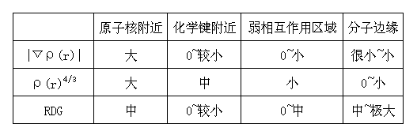

图1

表格中的大、小的标准比较模糊，只是定性的。如果我们想要找弱相互作用区域，利用RDG函数的数值大小差异就可以将“原子核附近”和“分子边缘”区域去掉，但“弱相互作用区域”和“化学键附近”的RDG函数值、|▽ρ(r)|值都比较小，区分不开，但ρ(r)存在一定差异。所以，结合使用RDG函数和ρ(r)函数，就可以确定分子中哪些区域涉及弱相互作用。

如果设定立方网格，使网格中的点能够覆盖整个体系，做这些点上ρ(r) vs. RDG的散点图，就可以把上述概念图形化且定量地表述出来。下面来做甲烷二聚体的这种图。

首先要产生Multiwfn可以识别的含有波函数信息的输入文件，Multiwfn支持的这样的文件的类型很多，比如wfn、mwfn、fch、molden等等，详见《详谈Multiwfn支持的输入文件类型、产生方法以及相互转换》（<http://sobereva.com/379>），用哪种文件做RDG计算结果原理上都一样。此例我们用Gaussian跑一个甲烷二聚体来得到wfn文件，关键词写# B3LYP/6-311G* opt em=GD3BJ out=wfn，坐标后面空一行写上.wfn文件的输出路径。此任务代表使用B3LYP-D3(BJ)/6-311G*级别对甲烷二聚体进行优化，最终结构对应的波函数将产生为.wfn文件。附件里的methanedimer.gjf是已写好的，用Gaussian执行后得到methanedimer.wfn。

先把multiwfn目录下的Settings.ini里的RDG_maxrho设为0.0（注意等号后面要留空格。改这个仅限此节的例子，帮助你由浅入深启发式了解RDG方法的原理，**此节例子算完后应把它的数值改回默认值****0.05**，其原因看了后文就会明白）。然后启动Multiwfn，依次输入：  
c:\methanedimer.wfn   //输入文件的路径  
100   //功能100，其中包含Multiwfn中比较杂的功能  
1    //绘制“函数1 vs. 函数2”散点图并生成相应格点文件  
1,13  //输入函数1和函数2的序号，分别作为散点图的横轴和纵轴。在Multiwfn支持的函数中ρ(r)是第1号，RDG函数是第13号。  
 2   //用中等质量的网格，总共约512000个点，x,y,z方向的具体点数通过使x,y,z方向格点间距相等来自动确定。网格的区域自动往分子外延展6 bohr。  
现在开始计算格点数据。格点数越多、体系所含Gauss函数越多，计算速度越慢，计算时间与二者都成正比。计算完毕后，输入  
4   //设定散点图X轴  
0,0.35 //X轴上下限的值  
5   //设定散点图Y轴  
0,2 //Y轴上下限的值  
-1  //绘制散点图  
很快ρ(r) vs. RDG的散点图就弹出来了，如图2左图所示。在图上点右键可以关闭，然后选功能1可以将图保存到当前目录下。如果对图的效果不满意，可以选功能2将数据导出到当前目录下output.txt，然后用origin、sigmaplot等程序作散点图。如屏幕上提示所示，其中前三列是数据点的坐标，后两列是两个函数的值，将后两列分别作为散点图的X和Y轴数据即可，注意要调节好坐标轴范围。使用Origin基于Multiwfn的输出文件绘制散点图的过程我录制了一个视频，不会操作者可以参考下，见<https://www.bilibili.com/video/av27535384/>。

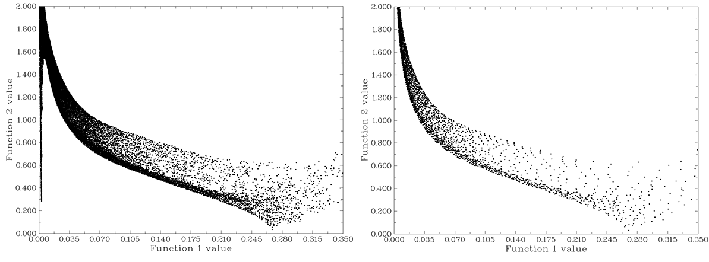

图2

按上述步骤绘制甲烷孤立状态的散点图得到图2右图（设定网格时选3，用高质量网格）。从图2可以看出，体系中存在与不存在弱相互作用时散点图最主要区别在于图中最左侧是否有一个竖条，在原文中这被称为spike。这个竖条上的点正是弱相互作用区域“RDG数值为0~中，ρ(r)^(4/3)数值为小”所对应的点；在右侧也有一个区域RDG 值接近0，这是C-H键区域“RDG数值为0~较小，ρ(r)^(4/3)数值为中”所对应的格点；图中坐标轴范围的更右侧就是原子核附近区域的点；图中左上角的尖峰再往上继续延伸就是分子边缘的区域，虽然离分子越远的地方|▽ρ(r)|和ρ(r)^(4/3)都越小，但后者比前者减小得更快，所以离分子越远RDG值越大，并直至无限大，可自行调整坐标轴观看。不同体系的散点图的成键、原子核附近、分子边缘区域都是类似的，一个体系中是否含有弱相互作用，就是看在ρ(r)较小区域是否有spike出现，这是此分析方法的要点。当然，网格不能太稀疏，如果在弱相互作用区域恰好没有点，spike也不会出现。

接下来，要用等值面确定这些对应于弱相互作用区域的点在实空间上的位置。在计算完格点后的那个菜单中，输入7，然后输入想看的等值面数值就可以观看第2个函数（即RDG函数）的等值面。其0.5的等值面如图3左图所示

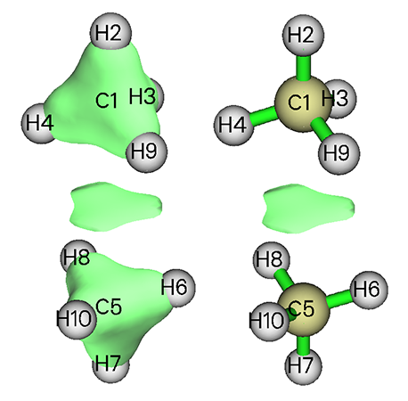

图3

图上在两个甲烷中间出现了封闭的等值面，描绘的正是二者间的范德华作用，但是在分子上也出现了三角形封闭的等值面。这是因为成键区域和弱相互作用区域的RDG函数数值范围有很大程度的重叠，如果在图2左图上做一个y=0.5的直线，会发现这条直线不仅贯穿spike，还贯穿成键区域，所以相应的RDG=0.5的封闭等值面不止一个，而在成键区域附近也会出现。这也是前面所说，必须再通过ρ(r)函数区分开成键和弱相互作用区域。

屏蔽掉成键区域，也就是将ρ(r)值稍微大一些的区域，比如ρ(r)=0.05以上的RDG函数的数值设得很大，比如设成100，这样在散点图上y=0.5的直线就不会经过那个区域了，等值面也就只剩下弱相互作用区域。具体做法是在之前的菜单中选择-3，然后输入0,0.05，再输入100，这就表明将ρ(r)的范围在[0,0.05]以外区域的点的RDG函数数值设为100。重新绘制散点图，得到了图4的结果，等值面也变为了所期望的图3右图的情况。

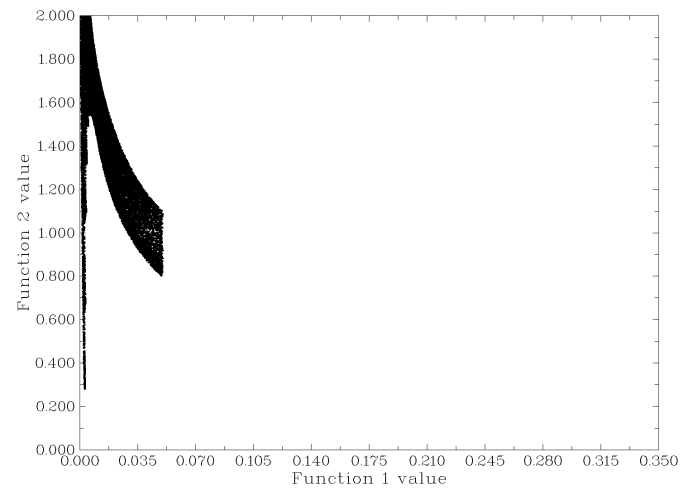

图4

一般来讲，观看RDG函数一般观看的是0.5的等值面，这没有什么严格的物理意义，只是等值面大小比较适中。由于弱相互作用区域的ρ(r)一般不会越过0.05，散点图上y=0.5的直线在ρ(r)<=0.05的区域内也只与spike相交，所以每次作弱相互作用等值面图时没必要再考察散点图，只需直接将ρ(r)>0.05的点的RDG函数值设为较大数值就行了。由于这个步骤经常要做，为了方便，Multiwfn在settings.ini里面有一个RDG_maxrho参数，凡是涉及到计算RDG函数的功能，只要某个点的ρ(r)大于这个参数，这个点的RDG值就自动被设为100，这个参数默认被设定为0.05。所以用户就不需要再考虑屏蔽掉成键区域了，这已由Multiwfn自动完成。当然，在后文中作完整的散点图时、或者就是想通过RDG函数研究成键区域时，应当关闭这个功能，将RDG_maxrho设为0.0就代表关闭此功能。

## 2. 合理地设定网格

Multiwfn计算格点时默认将网格根据原子x,y,z坐标的最大值和最小值往外延展6 bohr，留出一定余地，避免等值面被截断。不过，对于通过RDG函数显示弱相互作用区域来说，这显得浪费了，因为弱相互作用区域是在整个体系内侧，这就导致很多格点白白用于描述没用的区域。如果格点质量不够高，作一些弱相互作用等值面还会有麻烦，比如直接用中等质量格点作苯二聚体的弱相互作用区域RDG=0.6的等值面会得到图5左侧结果，可见薄片状等值面千疮百孔，与原文中的图明显不同，这是因为这个区域格点太稀疏，对RDG函数描述得不够精细。

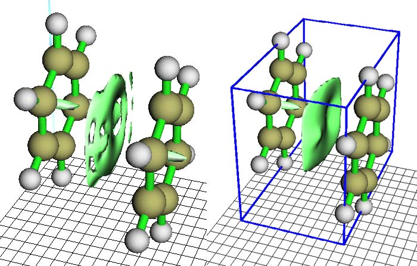

图5

如果将原本被浪费掉的格点利用起来，加强对分子内部区域的描述，将得到更好的等值面。下例将绘制苯二聚体弱相互作用等值面，并自定义延展距离。由于此例只对RDG函数感兴趣，用Multiwfn的功能5（计算格点文件并显示等值面）即可，不需要像前例中用功能100中的子功能1同时把ρ(r)也算出来。启动Multiwfn进行如下操作：

benzenedimer.wfn //已在附件中，几何结构来自原文补充材料，为B3LYP/6-31G*波函数  
5  //功能5  
13  //RDG函数  
-10  //设定延展距离  
0  //延展距离为0 bohr，即网格范围紧贴着体系。此时会看到功能-10条目上显示的current:变为了0。  
 2  //用中等质量格点  
4  //设定等值面数值  
0.6  //等值面数值设为0.6  
-1  //观看等值面  
此时图像显示出来，如图5右侧所示，点击Show data range复选框可以用蓝线显示格点数据涵盖的区域。点Return关闭图像后，选功能2，格点文件就会被输出到当前目录下的RDG.cub中。

由于总格点数没变，但涵盖的空间范围减小了，所以数据点更密，对弱相互作用区域描述得更精确，等值面的窟窿都不见了，好看了许多，很直观地表现出两个苯之间的π-π相互作用区域。如果点击界面右侧的Show data range，会用蓝框将网格包含的范围显示出来。虽然苯分子之间相互作用好看了，但是由于网格没有延展，导致苯环中间的体现位阻效应（见后文）的梭形的等值面被截断了一半。此例之所以观看的不是0.5的等值面，是因为0.5的等值面上也有窟窿，将等值面数值加大可以使等值面范围扩张，补上窟窿，使图像好看。

当然，绝不意味着有窟窿就说明是格点不够精细所致，因为等值面随数值由小到大的变化过程是：一堆点->一堆小等值面->带窟窿的大等值面->没窟窿的面，如果等值面数值取得较小，必然带窟窿。用Multiwfn绘制此体系的对称平面上的RDG函数填色图将易于理解这一点。在Multiwfn里输入以下命令即可绘制。为得到完整的图，先把RDG_maxrho设为0.0（别忘了当前例子做完之后一定要改回默认的0.05）。

benzenedimer.wfn  
4  //功能4，绘制平面图  
13  //RDG函数  
1   //填色图  
按回车使用默认的格点数(200,200)  
0  //设定延展距离。默认延展4.5 bohr，对于RDG函数偏大了  
 2   //改为只延展2 bohr  
1  //绘制XY平面  
0  //XY平面的Z值为0  
图像很快就弹出来了。如下图所示

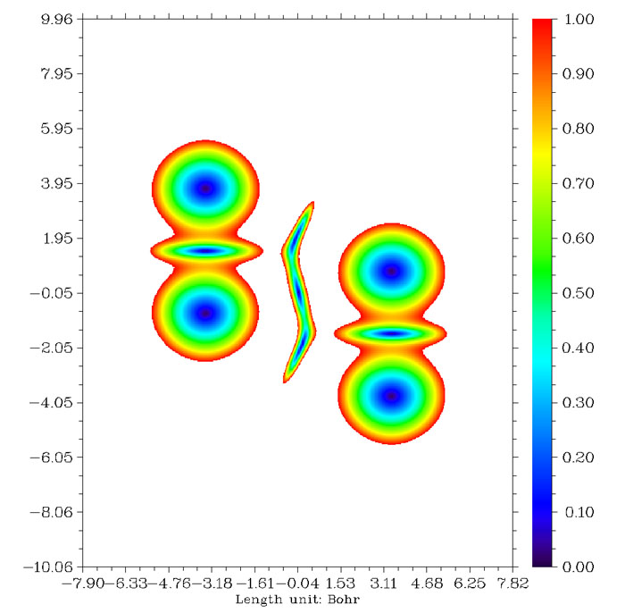

图6

在分子边界以外没有弱相互作用的区域RDG值很大，远超过1，这样区域都显示为白色。图中央的区域正是描述苯二聚体弱相互作用区域扁片等值面的截面，如果等值面的数值不够大，等值面只能包围每个蓝色区域，显然彼此不相连，如果增大到对应绿色区域的值，孤立区域将会相连接，构成整个扁片等值面。如果继续增大到红色区域对应的值，则苯环中间代表位阻效应区域的等值面将与分子相连而无法区分。

由于原子间存在弱相互作用时（严格来说是指能被RDG函数等值面表现出来的作用）它们的距离一般不会太远，所以一般能猜到哪些区域可能有弱相互作用，而且有时人们只对诸多弱相互作用区域中的某个一感兴趣，此时网格只需要覆盖那个小区域即可，即便网格点数较少，由于密度大，所以也能描述得较精确，可以节省计算时间。然而确定网格空间位置比较麻烦，Multiwfn在网格设置中提供了一个选项方便研究局部弱相互作用。例如图7中苯酚二聚体之间只有一小块区域相接触，若将网格中心设定在1号和14号原子之间，然后向四周延展一定距离，网格就能覆盖弱相互作用区域。

phenoldimer.wfn //已在附件中，几何结构来自原文补充材料，波函数在B3LYP/6-31G*下产生  
5 //功能5  
13 //RDG函数  
7 //将两个原子的中点作为网格中心  
1,14 //两个原子序号分别为1和14  
40,40,40 //由于网格范围小，用较少的格点数就够了  
3,3,3 //各个方向延展距离皆为3 bohr  
4 //设等值面  
0.5 //设等值面数值为0.5  
-1 //观看等值面  
此时得到图7的结果。

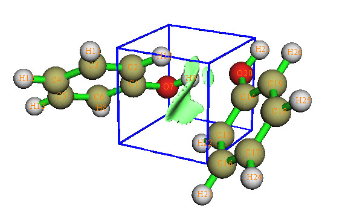

图7

## 3 判别弱相互作用的强度与类型

这种分析方法不仅可以指出哪里存在弱相互作用，还可以可视化地了解弱相互作用的强度与类型。

弱相互作用强度一般以相互作用能来衡量，但这是一个全局的量，应用到可视化分析中必须通过局域函数（实空间函数）。在AIM理论中，弱相互作用的临界点的ρ(r)是衡量相互作用强度的重要指标之一，其数值和键的强度存在正相关性，因而也被用来定义键级。实际上，此文的分析方法在某种程度上可以视为AIM方法的扩展，RDG封闭的等值面一般包围着相应的临界点，如果某个弱相互作用在其临界点处ρ(r)较大，由于ρ(r)的连续性，一般在周围区域ρ(r)也会较大。所以，将ρ(r)的数值大小以不同的色彩映射到RDG等值面上，相互作用的强度就一目了然。

ρ(r)只能反映出强度，但类型需要由sign(λ_2)函数来反映，这个函数是电子密度Hessian矩阵的第二大的本征值λ_2的符号，在AIM理论中键临界点的sign(λ_2)=-1，环、笼临界点的sign(λ_2)=+1，在接近临界点的区域其值与临界点处一般相同。可以将sign(λ_2)函数用不同色彩投影到RDG等值面上，用来表现某一个区域的相互作用类型。

若将ρ(r)和sign(λ_2)函数相乘而得的sign(λ_2)ρ函数投影到RDG等值面上，则弱相互作用的位置、强度、类型都能一目了然地显现出来。

原文中色彩刻度被设为蓝->绿->红，色彩刻度一般设为[-0.04,0.02]或[-0.03,0.02]，对于个别体系为了色彩效果更好，可以进行调整。不同颜色所代表的ρ(r)、λ_2数值以及所对应的相互作用类型可以用下面这个图来表示（对应的高清图是Multiwfn目录下的examples\RGB_bar.png，笔者允许大家在自己的文章里直接使用这个图，请届时引用<http://sobereva.com/598>里介绍的IRI方法的原文，IRI原文里面有和这个差不多的色彩刻度图）

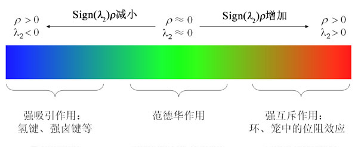

图8

蓝色区域ρ(r)大、sign(λ_2)=-1，表现较强、起吸引作用的弱相互作用，符合这个特征的最常见的就是氢键，还包括较强的卤键等作用。当然如果把ρ(r)更大的，即成键区域也算进去，其等值面也是蓝色。绿色区域的ρ(r)很小，说明相互作用强度很弱，范德华作用区域符合这个特征。由于这样区域电子密度很小，λ_2的符号较为不稳定，所以可正可负。红色区域ρ(r)较大、sign(λ_2)=+1，对应于在环、笼中出现的较强的位阻效应区域（也被称为nonbonded overlap），产生张力，因而红色等值面周围原子间起互斥效应。

图9是甲酸二聚体的sign(λ_2)ρ vs. RDG的散点图和填色等值面图。如果将这个散点图的左边折叠到右边去，就还原为ρ(r) vs. RDG图。

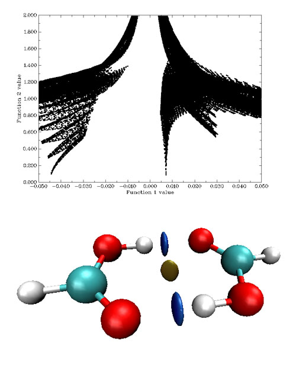

图9

散点图左边的spike的sign(λ_2)ρ很负，对应很强的氢键，因而相应的等值面为蓝色。这个spike在散点图上看起来像是一条一条地有规律地组成的，并不致密，这是因为落在这个空间区域的格点偏少，由于格点是均匀、规则地以立方形式排列的，所以函数值变化起来比较有规律，如果增加这个区域格点密度，这个spike会更为致密。右侧的spike的sign(λ_2)ρ为较小正值，对应于图中棕色圆片等值面，体现了微弱的位阻效应。比较下面的例子会看到，这种靠弱相互作用结合的复合物，即便之间有位阻效应出现也不会太强，否则将不足以被弱相互作用抵消掉。至于只靠范德华这种很弱作用力结合的复合物，在平衡状态下不会有位阻区域产生，除非是很强的范德华作用，如π-π堆叠，才可能有微弱的对应位阻效应的区域出现。下面的例子是邻氯苯酚

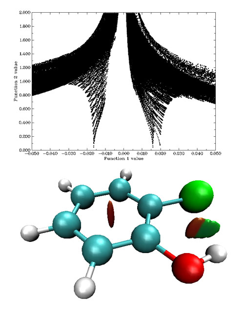

图10

在苯环中间有红色梭形区域，体现较强位阻效应，对应散点图最右边的spike。羟基与氯原子之间RDG等值面一小半橘红色，一大半绿色，在散点图上分别对应着spike尖端x值约为+0.016和-0.017的spike。如果横坐标不是sign(λ_2)ρ而只是ρ(r)，则这两个spike是合并在一起的，无法区分究竟代表什么类型的作用，而引入sign(λ_2)使其本质一目了然。这个等值面说明羟基与氯原子间既存在着位阻效应，也存在着弱氢键作用，互斥和吸引效应并存。如果做AIM分析，会发现橘红色区域里面是一个(3,+1)临界点，绿色区域里面是一个(3,-1)临界点，两个临界点扩展后连成一个等值面，但各自区域的特征仍然能够靠颜色分辨。

估计会有人存在疑问，羟基与氯原子之间有一大半区域是绿色，从色彩刻度条上看应该对应范德华作用，为何说是弱氢键？一方面，从散点图上看，范德华作用的spike尖端的ρ(r)不会达到这么大，在原文中作者建议将是否ρ(r)小于0.005作为相互作用是否属于范德华作用的评判标准。另外O-H----Cl这样的构成也符合形成氢键的条件。这种情况实际上理应显示成淡蓝色，但由于色彩刻度上下限的设定有一定随意性，导致同一个色彩刻度范围未必对每个体系都很合适。如果不同体系不用同一个上下限，在横向比较作用强弱的时候又会缺乏基准，而且需要每次手动调整，略微麻烦，一般来说还是按照原文，色彩刻度统一使用[-0.04,0.02]范围为好。但遇到颜色与期望的差异较大时，最好还是看看散点图上相应spike的位置来确认。色彩刻度的随意性是这种分析方法的一个弊端，不同色彩刻度下得到的此体系的等值面如下图所示，差异是很明显的。另外屏幕对比度、可视化程序中分子与光源的相对朝向等诸多问题都可能影响色彩，给定量比较带来些麻烦。

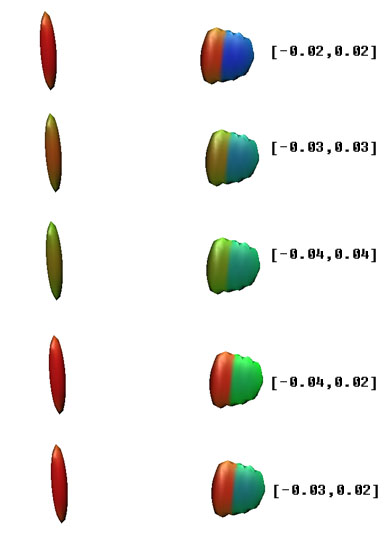

图11

下图的四个体系分别是：1. 环氧乙烷与氟化氯通过卤键形成的复合物 2.二环[2,2,1]庚烷 3.gauche构象的苯乙胺 4.直立构象的甲基环己烷。这些留给读者自行分析，在原文的补充材料中也有很多例子，值得一看。

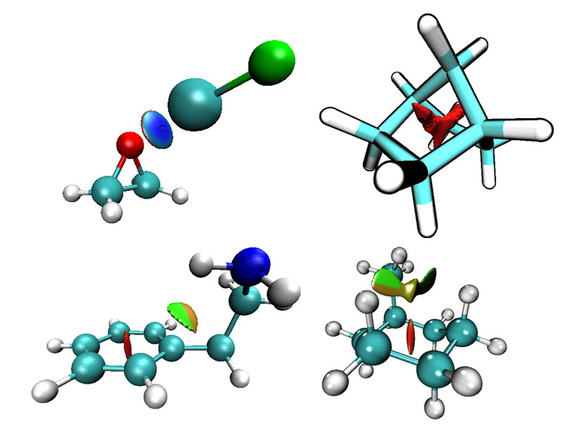

图12

## 4 实例

这里以苯酚二聚体为例介绍如何绘制sign(λ_2)ρ函数填色的RDG等值面图。如果你已做了前面的例子，注意检查一下RDG_maxrho是否已经改回原先默认的数值0.05了。

phenoldimer.wfn  //文件名  
100  //功能100  
1    //绘制“函数1 vs. 函数2”散点图并生成相应格点文件  
15,13  //sign(λ_2)ρ是第15号函数，RDG是第13号函数  
-10  //设定延展距离  
0  //延展距离为0 bohr  
 2  //用中等质量格点  
当选取的函数1和函数2分别为sign(λ_2)ρ和RDG时，散点图的x,y坐标轴范围会分别自动调到[-0.05,0.05]和[0.0,2.0]，所以直接用功能-1就能看到合适的散点图了，如下图上方所示。之后选择选项3将函数1和函数2的高斯类型格点文件输出到当前目录下func1.cub和func2.cub。

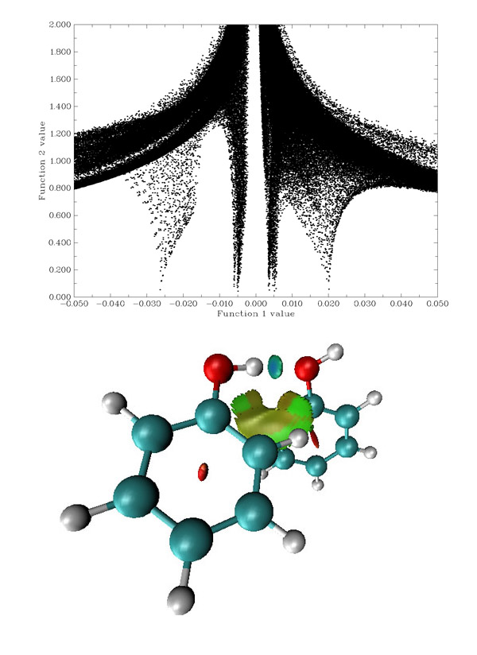

图13

虽然能显示高斯类型格点文件的等值面的程序很多，但支持将一个函数数值用不同颜色填到另外一个函数的等值面上的可视化程序比较有限，常用的GaussView虽然支持，但操作不便而且不够强大。VMD是观看、分析分子动力学结果最重要的软件之一，它在映射颜色和显示等值面方面也很好用，等值面又光滑又有光泽，填色的色彩变化细腻，调整等值面也比较容易，而且运行流畅。VMD可以免费在<http://www.ks.uiuc.edu/Development/Download/download.cgi?PackageName=VMD>下载。

首先安装VMD，然后将func1.cub和func2.cub复制到VMD安装后的目录下，即vmd.exe所在路径。然后在此目录下编写一个文本文件，后缀为.vmd，比如ltwd.vmd。在里面填上如下内容：  
mol new func1.cub  
 mol addfile func2.cub  
 mol delrep 0 top  
 mol representation CPK 1.0 0.3 18.0 16.0  
 mol addrep top  
 mol representation Isosurface 0.50000 1 0 0 1 1  
 mol color Volume 0  
 mol addrep top  
 mol scaleminmax top 1 -0.04 0.02  
 color scale method BGR  
保存文件后，启动VMD，选File-Load State，选择ltwd.vmd，图13下方的图就显示来了。若想把背景改成白色，选Graphics-Colors-Display-Background-8 White。图中的弯曲的片状等值面边缘略有锯齿，可以通过增加此处格点密度来改善。从颜色上可看出，弯曲的片状等值面描述的是二聚体之间范德华作用，但部分区域也有微弱的位阻效应。圆片等值面只有中间呈蓝色，说明H与O之间形成了氢键，但并不像甲酸二聚体的氢键那么强。

VMD里面每个操作对应一条语句，载入.vmd本质上就是让.vmd文件中的语句全部执行，这就免得每次都手动执行载入文件、设定参数的一系列繁琐步骤。比如mol new func1.cub的含义就是读入当前路径下func1.cub文件（默认的当前路径一般就是vmd.exe所在路径），mol scaleminmax top 1 -0.04 0.02代表将1号representation（对应于显示填色等值面的那个图层）色彩刻度的下上限分别设为-0.04和0.02，color scale method BGR代表将色彩刻度由小到大设为蓝->绿->红。将背景设为白色的命令是color Display Background white，若将此命令添加到.vmd里面就能在载入.vmd文件时顺便执行，使背景自动设为白色。这些命令在VMD手册上都有解释。这些命令也可以在VMD的控制台下直接运行，控制台通过Extensions-Tk Console进入，比如想把色彩刻度改为从-0.05到0.05，就在控制台执行mol scaleminmax top 1 -0.05 0.05。有很多命令在VMD的GUI上有相应的选项，其中有些通过GUI操作会容易得多，比如调整等值面数值，可以在Graphics-Representations里面的列表中选定第二个显示模式（即Style为isosurface的那个），然后将下方Range的下上限分别设为比如0和1，点回车，之后拉动滑条就能在0~1范围内改变等值面。

另外，Chemcraft也可以实现相同功能，对初学者来说使用更简单，不过效果不如VMD，而且收费。使用方法：  
先打开func2.cub，再点左下角Add cube，选择func1.cub。将Contour value设为0.5，敲回车，然后点Show isosurface。然后把Map other:选为2，再把Values range分别填-0.04和0.02，敲回车。

如果你想让散点图也有填色效果，便于将散点图的spike和等值面图通过颜色相互对应，判断spike对应的等值面位置，用gnuplot可以很容易做到，看此文：《绘制有填色效果的用于弱相互作用分析的RDG散点图的方法》（<http://sobereva.com/399>）。

这种分析方法也可以用于分析晶体间内部弱相互作用。虽然Gaussian的PBC功能并不给力，但是简单的PBC计算还是可以胜任的。由于Gaussian的PBC计算是以高斯型函数作为基函数，所以波函数信息可以直接被Multiwfn读入并进行分析。这里将以金刚石晶体作为例子。

还是先获得波函数文件。Gaussian的输入文件就是压缩包里的pbc_diamond.gjf。运行之后，用formchk将.chk转化为.fch文件。当然，用.wfn作为Multiwfn的波函数输入也可以。由于计算的是素晶胞，波函数信息也只含有两个碳原子的，获得的等值面显然体现不出周期性，然而计算复晶胞又太费时。在Multiwfn里提供了一个晶胞波函数平移复制功能，可以将这素晶胞波函数信息扩展为足够大的复晶胞波函数。复制次数越多，体系中高斯函数越多，计算格点时越慢，为避免计算格点时间太长，这里只向各方向平移复制两次。

启动Multiwfn后输入：  
c:\pbc_diamond.fch  
6 //修改波函数功能  
32 //平移复制体系  
4.7523,0,0 //第一个平移向量。平移向量在输出文件中的PBC vector段落，或者查看.fch中的Translation vectors字段。不要用输入文件中的平移向量，因为Gaussian可能自动改动坐标，平移向量也就变了。  
1 //单位为bohr  
 2 //复制两次。接下来再对另外两个方向做相同的平移复制。  
32  
 2.3762,4.1156,0  
1  
 2  
32  
 2.3762,1.3719,3.8802  
1  
 2  
0 //平移复制已完毕，保存当前波函数到当前目录下new.wfn，也就是压缩包中的pbc_diamond_dup.wfn。

由于得到的体系是斜着的，把所有原子都纳入立方网格中必将造成很多格点落在体系外而浪费掉。实际上只要取体系中间一个原子（28号）作为网格中心，然后向四周延展一些距离，所得等值面就足够体现周期性了。现在生成格点文件，依次输入  
pbc_diamond_dup.wfn  
100  
1  
15,13  
7  //用两个原子的中点作为网格中心  
 28,28   //当输入的两个原子序号相同，则以此原子为中心向四周延展。Multiwfn默认延展距离是6 bohr，对此例子比较合适，不用修改。  
80,80,80  //各方向格点数  
6,6,6 //各方向延展距离皆为6 Bohr  
算完后，用功能3保存格点文件，按照上例方法，用VMD显示结果如下。可见，由于碳原子间距离较近，原子空穴间充满红色等值面，体现很强的位阻效应。

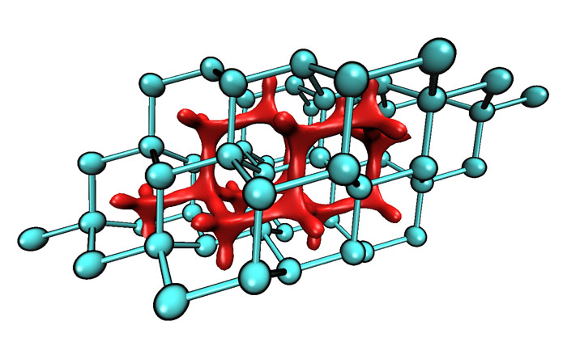

图14

## 5 波函数质量产生的影响

在前面的例子中用的是B3LYP波函数，必定有人会认为用B3LYP计算以范德华作用为主的弱相互作用体系很不合理，但实际上计算能量的精度和计算电子密度的精度没有必然关系，原文作者认为使用这种分析方法时用B3LYP/6-31G*级别的电子密度就够了，这样计算量也小，而且改为更昂贵的MP2/6-311+G**后等值面并没有什么改变。甚至电子密度粗糙到只用自由电子密度叠加（promolecular近似的密度）都能得到定性合理的结果，所以这种分析方法对电子密度的质量很不敏感，使之用于大体系成为了可能。

## 6 Promolecule近似及对结果产生的影响

使原子坐标保持在形成分子时的状态，将自由原子密度叠加得到的密度称为Promolecule密度，可以视为在形成分子前，电子密度尚未驰豫的电子密度。构建这种密度不需要量子化学计算，只要有分子结构文件和自由原子密度就能十分容易地构建。由于在弱相互作用区域Promolecule密度和实际密度差异并不像在成键区域那么显著，Promolecule密度在此分析方法中可以近似代替实际电子密度，等值面的基本形状不会有太大差异，但是定量上，也即等值面细部特征会有一定差异，因为电子密度驰豫后会在吸引作用区域聚集，尤其是会在位阻效应区域疏散以减小斥力，位阻效应越强，改变量越大。

原子在自由状态的真实电子密度是球对称的，但是对于比如基态氧原子，p轨道一个是双占据两个是单占据，量化算出来的电子密度不是球对称的，这将导致分析结果出现不应有的取向性，所以需要将之球对称化。球对称化方法不是唯一的，比如可以简单地对三个p轨道占据数取平均，也有人利用GVB方法解决，原文的方法是用s型STO函数拟合B3LYP/6-31G*原子密度，第一、二、三周期的原子分别用1、2、3个STO拟合，以对应壳层数。这不仅解决了球对称问题，还有另一个好处，就是描述原子密度的函数大大减少了，6-31G*描述氧原子用28个GTO，而拟合后只用2个STO，这使得计算RDG函数、sign(λ_2)ρ的速度也大大加快。实际上STO用的少主要在于双电子积分时的困难，由于STO能正确地表现原子轨道波函数随r增大的收敛行为和原点处Cusp的特征，如果研究内容不涉及到双电子积分，比如这种只依赖ρ(r)的分析方法，用STO又便宜又好。

在Multiwfn中使用Promolecule密度计算RDG与sign(λ_2)ρ函数，只需在选择要计算的函数的界面中选择后面带着"with Promolecule approximation"的相应函数即可。对于前三周期的原子，使用的是原文通过STO拟合的原子在自由状态下的密度。而对于其它元素，原文没有对密度进行拟合，并且本人发现对超过第三周期的元素通过STO也几乎没法拟合好。于是在Multiwfn中它们的密度通过对程序内置的高精度计算的原子的电子密度进行插值来得到，最高支持到Ra。超过Ra的元素暂时不支持promolecular近似。由于Promolecular近似下做计算不涉及到波函数信息，只要将分子结构传递给Multiwfn就可以，所以既可以通过.wfn、.fch等文件将分子结构传入Multiwfn，也可以通过Multiwfn支持的.pdb、.xyz等文件导入分子结构。在Promolecule近似下苯酚二聚体的散点图和等值面图如下所示

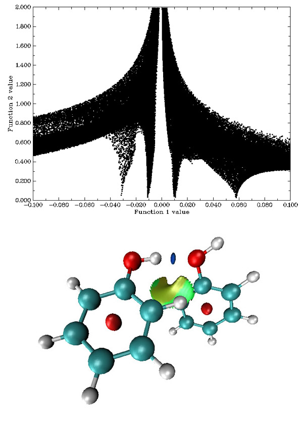

图15

与B3LYP/6-31G*波函数下的散点图相对比，在Promolecule近似下，主要区别是对应位阻效应的spike明显靠右，这说明芳香环中间的电子密度在形成分子后显著降低以减小互斥效应。并且Promolecule的散点图整体分布比较靠下。所以在观看Promolecule近似下的等值面就必须用与之前不同的等值面数值和电子密度屏蔽范围，如果仍只保留sign(λ_2)ρ在[-0.05,0.05]区域，则最右边的spike将会被截掉很大部分；如果观看的等值面仍为0.5，则y=0.5的直线在散点图中将与一大片范围相交。所以建议保留sign(λ_2)ρ在[-0.1,0.1]区域的点，并观看RDG=0.25的等值面，这样只有这四个spike对应的区域被保留了下来，并且y=0.25的直线只与它们相交。这样得到的填色等值面如图15下方所示，色彩刻度范围设为了[-0.04,0.03]，可见和B3LYP/6-31G*下的图没有太大差别，只是芳香环中间的梭形区域变成椭圆。

虽然靠实际电子密度分析时需要保留的sign(λ_2)ρ的范围有比较通用的值[-0.05,0.05]，但是在Promolecule近似下情况比较复杂，spike的位置变化范围较大，应保留的范围不好确定，所以最好每次都考察一下散点图确定保留范围。在Multiwfn中默认的保留范围是[-0.1,0.1]，可以通过修改settings.ini里的RDGprodens_maxrho参数来改变，当sign(λ_2)ρ小于-RDGprodens_maxrho或者大于RDGprodens_maxrho的点的RDG值将被自动设为100。若此参数设为0.0，则不自动作屏蔽。

## 7. 用于生物大分子体系

由于在Promolecule密度下就能得到可靠结果，计算函数时速度很快，也不再需要量子化学软件计算波函数，使得这种分析方法又快又方便，能够容易地用于蛋白质、核酸等生物大分子体系。

此例将绘制DNA双螺旋结构的某一部分的RDG填色等值面图。由于这种分析方法所用的分子结构应当尽量接近平衡构型，获得这样的结构最简单的方法就是从RCSB数据库(<http://www.rcsb.org/pdb/home/home.do>)里面找相应的晶体结构，然后加氢。也可以自行建立DNA结构，这样序列可以自定义，可以用比如Ambertools里的NAB工具实现，之后再做能量最小化。附件里的DNA.pdb是已建好的含10个腺嘌呤-胸腺嘧啶碱基对儿的DNA片段，已通过Amber在ff99SB力场、GB溶剂模型下优化，细节见<http://ambermd.org/tutorials/basic/tutorial1/>。为了视觉上比较清楚，将要研究的区域是分子结构边缘区域，如下图灰色方框所示。其中黄色圆球所示的是第84、565号原子，将它们的中点作为网格中心并往外延展一定区域就能使网格涵盖感兴趣的范围。如果不清楚延展多少比较合适，可以先设定一个预期的延展范围，然后用粗糙格点计算一下，看看延展范围是否合适，再做高质量格点的计算。

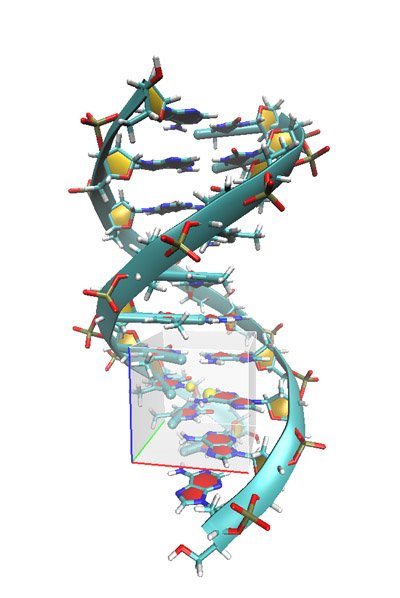

图16

操作步骤如下  
DNA.pdb //此文件已在压缩包里。假设读入某个pdb文件时提示发现未知元素，说明原子名有问题，应进行修改。  
100 //功能100  
1 //子功能1  
16,14 //Promolecule近似下的sign(λ_2)ρ函数与RDG函数  
7 //通过两原子中心定义网格中心  
84,565 //两原子序号为84和565  
120,120,120 //由于网格范围较大，所以用较多格点  
9,9,9  //各方向延展9 Bohr  
现在开始计算，计算完毕后选3将格点文件导出并用VMD作图，如图17所示。若有兴趣也可以看一下散点图，由于网格内涉及的弱相互作用较多，所以spike比较多。

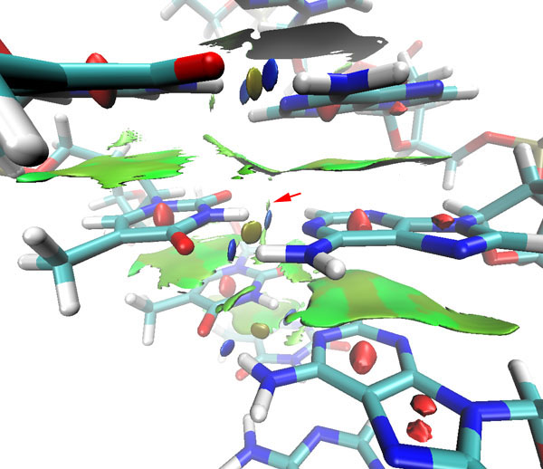

图17

从RDG的填色等值面图上看，上下相邻的碱基之间存在着π-π堆叠作用。腺嘌呤和胸腺嘧啶之间形成的两条氢键很清楚地通过两个蓝色圆片显现出来，在之间还存在着土黄色圆片，对应着很弱的位阻效应。红色箭头所指的是C-H---O氢键，其强度已称不上是氢键，只是范德华作用的级别。

## 8. 原子密度cutoff对速度的影响

在Promolecule近似下计算每个格点RDG和sign(λ_2)ρ函数时原本会计算所有原子的电子密度的贡献，当体系较大、原子较多时，比如上面例子中的体系，耗时会比较长，除非人为地将不感兴趣的区域原子删掉，但操作麻烦，还可能带来截断误差。为了进一步加快Promolecule近似下的计算，在Multiwfn中使用了原子密度cutoff的方案，对于C、H、O、N原子（由于它们最为常见），如果其电子密度在当前要算的格点位置上的数值小于1E-5，则忽视掉它，判断标准是事先推算的距离判据。这使得计算大体系时速度显著提升，对结果不会产生能查觉得到的影响。如果出于特殊原因想关掉此设定，在settings.ini里把atomdenscut设为0即可。

使用i7-2630QM的CPU，计算高质量格点下苯酚二聚体RDG和sign(λ_2)ρ函数的总耗时：  
B3LYP/6-31G*波函数 33s  
Promolecule近似 1s  
可见使用Promolecule近似时比使用B3LYP/6-31G*波函数时速度提升了30倍，如果基组更大，提升幅度会更大。

计算前文DNA例子的情况：  
Promolecule近似 54s  
Promolecule近似+原子密度cutoff 8s  
由于体系越大，能够少算的原子就越多，原子密度cutoff带来的加速越明显。如果不做cutoff，在计算DNA下侧的格点时还得计算所有在DNA上侧原子的贡献，白费很多时间。

## 9. 用RDG等值面研究成键

笔者曾在《电子定域性的图形分析》（<http://sobereva.com/63>）一文中介绍了拉普拉斯值函数、ELF函数、LOL函数，这三个函数对研究成键、孤对电子、原子壳层结构很有用处，但是无法用于弱相互作用分析，RDG函数分析方法是对它们重要的补充，使可视化分析能涵盖更广的范围。实际上，RDG函数对成键分析也有一定用处，从散点图上看，成键区域可看做是ρ(r)比较大的spike，在图上做横线也会与这个spike相交，因而不对ρ(r)的范围做屏蔽时也会在成键区域出现RDG等值面。具体的分析将另文讨论，这里只以典型分子吡嗪作为例子，图18上半部分是吡嗪的RDG=0.2的等值面图，下半部分是LOL=0.6的等值面图。可见，RDG函数等值面也描绘出了化学键，但是形状基本是以键轴为对称的，并且没像LOL等值面体现出共轭π键，另外RDG等值面没有描绘出氮原子的孤对电子区域。所以，RDG等值面图虽然可以用于分析成键，但并不能体现出像ELF、LOL函数那么丰富的特征，有一定局限性。

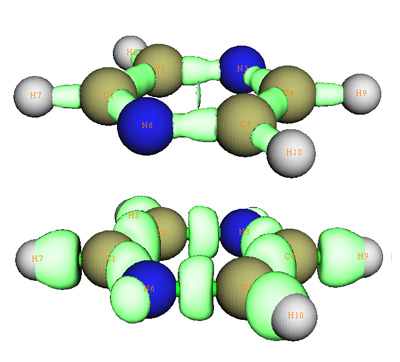

图18

吡嗪分子平面的RDG函数图如下所示，由此图可以想象RDG等值面轮廓随等值面数值由小到大是如何变化的，最初等值面是从最黑的（RDG=0）位置开始出现，也相应于AIM的临界点。黑线表示的是0.2的等值线，可以与上面等值面图相互对照。

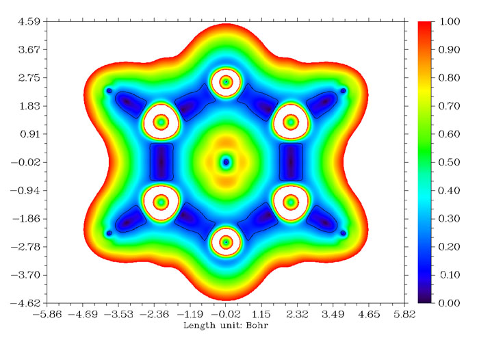

图19

由于在形成分子后，电子密度在成键区域变化较大，所以用此方法研究成键问题时不要使用Promolecule密度。

## 10. 填色等值面的艺术

在各种各样的体系中，使用不同的函数，通过调整等值面、色彩刻度、显示方式，多个等值面再加以组合，时常会得到一些漂亮的图形（尽管图形未必有什么物理意义），能够激发想象力，在比如设计Logo时往往能从中获取灵感。如同分形一样，这是科学与艺术的结合。举一个偶然发现的不错的例子：

首先确认settings.ini里RDGprodens_maxrho已设为了0.1，也即默认值，然后在Multiwfn里输入：  
 benzene.wfn  //已在压缩包里  
100  
1  
16,14  
-10  
 2   //网格延展2 bohr  
4   //由用户输入各方向格点数，网格范围涵盖整个分子。  
150,150,100  //X,Y,Z方向格点数，因为苯分子在XY平面，Z轴长度短于X,Y，所以Z方向格点数少些  
3  //保存格点文件  
然后用VMD显示RDG填色等值面图，等值面用0.47，材质用Glossy，色彩刻度设为[-0.04,0.06]，得到下图，像什么东西请大胆发挥想象。

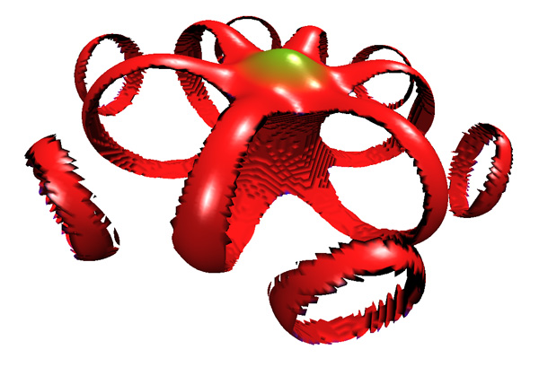

图20

之前都是做ρ(r)或sign(λ_2)ρ vs. RDG的散点图，在Multiwfn里也可以做其它函数之间的散点图，偶尔也会遇到有趣的图，记得曾做过一个大抵是ELF、LOL函数与RDG间的散点图，十分像鹰的头部。

## 11. 其它问题

### 11.1 RDG等值面的含义

要注意，有RDG函数等值面的区域说明一定有某种不很弱的相互作用跨过这个区域，但两个原子间如果没有RDG等值面，决非两原子间不存在相互作用。例如范德华作用虽然随r^-6减小，衰减得比较快，但分子离得很远时并不是完全没有范德华作用，此时RDG等值面却不会出现。比较甲烷二聚体在平衡状态下和拉远时（碳原子间相距10埃）两个碳原子直线上RDG函数的变化可以了解其原因。

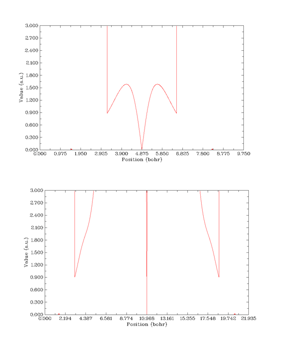

图21

由于已将电子密度在0.05以上的区域的RDG值设为100而屏蔽掉，所以图的两侧没有显示。X轴上的红点代表碳原子的位置。在图21的上图所示的平衡状态时，甲烷分子中间RDG函数曲线有个V字型区域，最下端为RDG=0，即AIM临界点。做一条y=0.5的横线，与RDG曲线的两个交点之间有一定距离，所以能看到一定大小的RDG=0.5的等值面。前面已经提到，由分子边缘开始往外越远的地方RDG数值越大，所以在两分子远离状态时，两分子中间会夹着一块RDG值很大的区域，虽然临界点肯定仍然存在，但是V字型区域已经变得非常窄，与y=0.5的两个交点几乎碰上，所以从等值面图上看不到这过于微小的等值面。

由于静电作用能随r^-1衰减，衰减速度较慢，对于带有净电荷的分子间相互作用，在远距离时即便相互作用可能并不小，但出于同样原因也不会显示出等值面。

### 11.2 坐标应处于平衡状态

要注意使用这种分析方法时体系坐标应当处于，至少是接近平衡状态，否则将会得到明显错误的结论。例如下图

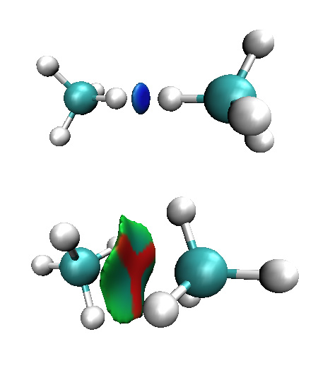

图22

令两个甲烷分子的C-H键对着对方，然后使之离得很近，从图上看形成了很强的吸引作用。若以另一种朝向相互接近，当很近时弱相互作用等值面上出现了红色区域，显示强烈位阻效应。这两个图都没正确表现出甲烷二聚体之间是通过范德华作用结合的，尤其前者完全是误导。不真实的结构在关键位置产生了不真实的密度，不真实的密度就导致分析结果不真实。所以直接搭建的初始结构应当进行优化再做分析，即便是很大体系也至少要在合适的力场下做分子力学级别的优化。所有基于图形化分析方法，也包括AIM分析，都要注意这点。

### 11.3 spike、等值面与AIM临界点的关系

本文在介绍RDG填色等值面方法时将spike、等值面与AIM临界点联系地进行了讨论。但要注意，有些时候散点图上spike并不接触x轴，所以相应的等值面也不是从临界点扩张而来，比如前文例子中直立构象的甲基环己烷的甲基与环己烷之间的位阻区域内部就没有临界点，然而所示的填色等值面却很迎合我们的期望结果，说明了其合理性。这种情况并不少见，将另文讨论。

### 11.4 RDG填色等值面分析中所谓的“位阻效应”

关于这种分析所显示的位阻效应值得再具体说一下。一般说的位阻效应是指每个原子都会占据一定空间，除了成键原子外，其它原子不会从以任何方向、任何形式与之靠得太近，否则会导致能量升高并产生斥力，只有当某种其它因素存在，强到能克服斥力时，体系才能在位阻效应存在的情况下保持稳定。这种情况一般就是指以成键方式（如苯环）或者以较强的弱相互作用方式（如甲酸二聚体）构成带有张力的环或笼，这种情况在位阻效应产生的区域λ_2总是大于0，所以RDG填色等值面图分析方法指出在红色或偏红色区域是存在位阻效应的地方。然而，这话不能反着说。因为存在位阻效应的区域的等值面未必λ_2一定大于0，所以未必会被填上红色或者偏红色。例如在图22中，两个氢原子之间距离过近，产生了位阻效应，由于二者中点存在(3,-1)，故附近区域λ_2<0，所以等值面显示为蓝色，表示为成键，这显然是错误的。当然，图中的情况由于不是平衡结构因此结论没有意义，但假设有某种形式的外力能够维持这种状态稳定，即这种状态就是当前最稳定的状态，RDG填色等值面分析就给出了错误的结论。但这种例子极少，所以不必太担心，只要明白这种分析方法体现的位阻效应究竟是什么含义就行了。

### 11.5 RDG中ρ(r)^(4/3)的含义

实际上，|▽ρ(r)|并不一定必须除以ρ(r)^(4/3)才能区分分子边缘和弱相互作用区域，也可以将ρ(r)^(4/3)改成比如ρ(r)、ρ(r)^(5/3)，相应的散点图如下所示（摘自原文的补充材料，注意系数1/(2*(3*π^2)^(1/3))没有被乘上）

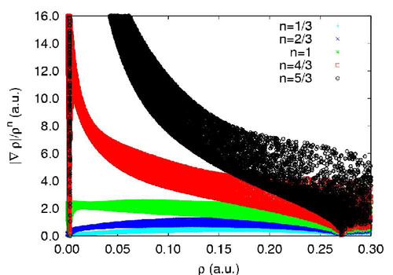

图23

n=5/3时，虽然也很好地区分开分子边缘与弱相互作用区域，但是数值范围太大，显示合适的、相同大小的等值面需要比RDG等值面用更大的函数数值。n=1时，由于远离分子时ρ(r)的收敛速度不像ρ(r)^(4/3)那样快，所以散点图中对应分子边缘区域的左上角的峰没那么明显。如果继续减小n，则弱相互作用与分子边缘区域就难以区分，数据点都一起缩到图中左下角。RDG函数原本是用在GGA密度泛函中表达电子密度梯度项，这也正是其名字的含义，之所以不是|▽ρ(r)|而要除以ρ(r)^(4/3)，是为了消掉|▽ρ(r)|的量纲，使梯度的模成为无量纲的量。而RDG函数，即n=4/3的情况用在分析弱相互作用上最合适，是属于巧合。

## 12. 总结

RDG填色等值面分析方法是十分方便、有用的分析方法，原理简单易懂、适用范围广，在Promolecule近似下只需要提供分子坐标就能很快地得到结果，值得大力推广。Multiwfn对这种分析方法投入实际应用提供了极大便利，操作傻瓜化，不涉及到任何复杂的理论、概念。此方法也存在一些不足，也因此可能有进一步改进或发展的余地，比如等值面数值的选取、色彩刻度的上下限设定有一定随意性，那么是否有可能将这种分析定量化？其等值面面积和包围的体积是否也有一定意义？此分析方法的提出纯粹是从可视化便利的角度出发的，是否能找出其背后与ELF/LOL等函数的理论联系，进而组合、衍生出一个能分析更广泛问题的函数？笔者曾在《电子定域性的图形分析》一文中浅谈了实空间函数图形化分析方法的优点，本文的RDG填色等值面分析方法进一步显现了这类分析方法的用处，这类方法在未来必将得到进一步发展，并逐渐流行起来，也希望读者多加实践。
