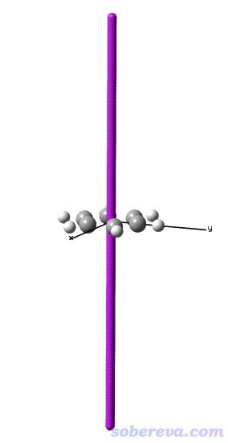
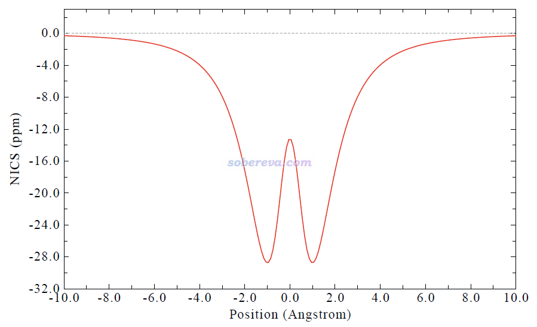
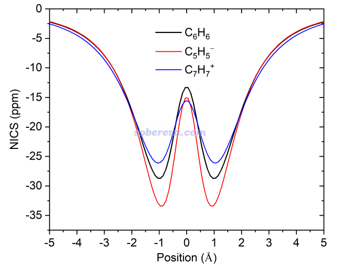
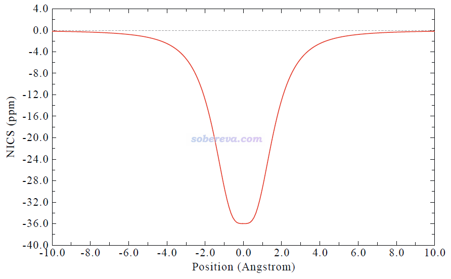
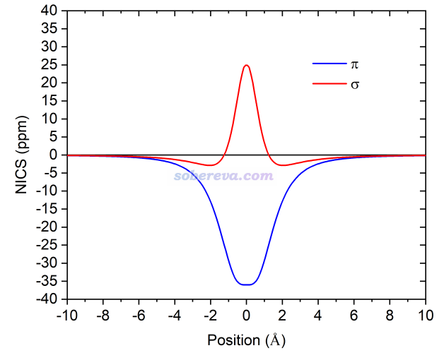
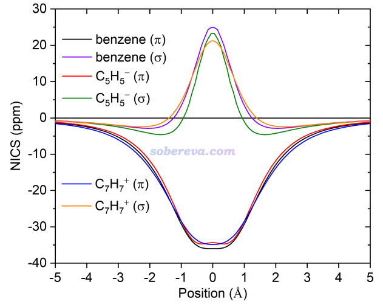
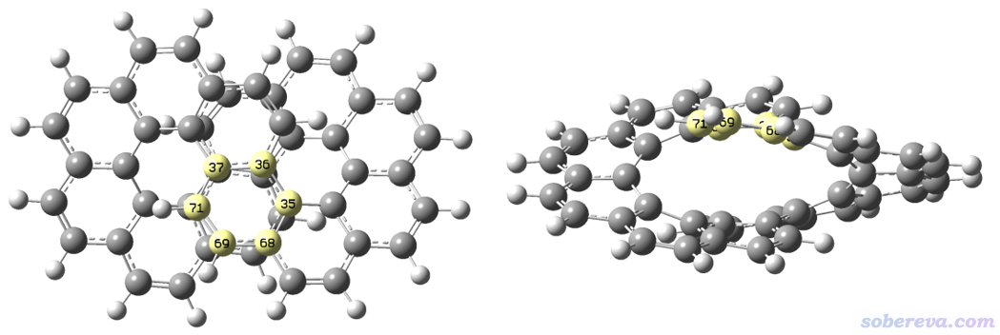
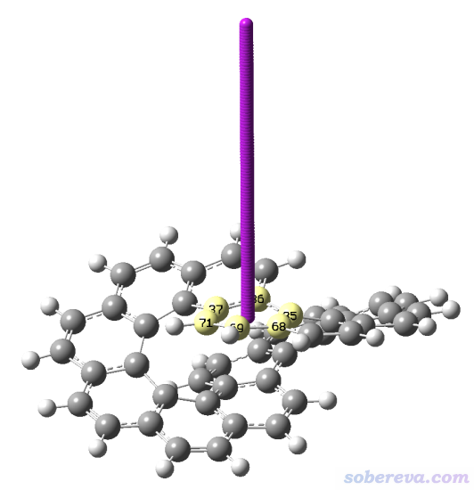
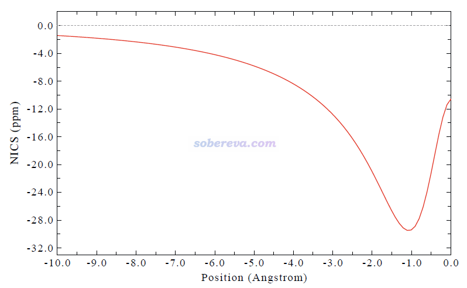

**使用Multiwfn绘制一维NICS曲线并通过积分衡量芳香性**

Using Multiwfn to plot one-dimensional NICS curve and measure aromaticity by its integration

文/Sobereva@[北京科音](http://www.keinsci.com)

First release: 2023-Aug-6   Last update: 2024-Aug-21

## 1 关于NICS曲线及其积分

NICS是一种非常流行的基于磁性质衡量芳香性的方法，在《衡量芳香性的方法以及在Multiwfn中的计算》（<http://sobereva.com/176>）里有专门的详细介绍，不了解的话务必先阅读此文的相关部分。NICS大多数情况是考察特定点（如环中心或环中心上/下方1埃处）的磁屏蔽情况。在J. Phys. Chem. A, 123, 3922 (2019)中作者建议从环中心开始在垂直于环方向上对NICS_ZZ（此处Z指垂直于环方向）进行扫描，并将这一维NICS_ZZ曲线进行积分，文中认为此积分值比诸如NICS(0)ZZ、NICS(1)ZZ那样只考察个别的点在衡量芳香性上更严格和可靠。而且通过考察NICS曲线无疑能比只计算个别位置的NICS获得更多信息，有助于不同体系间横向讨论和对比。在J. Phys. Chem. A, 126, 3433 (2022)中另外的研究者将这种NICS积分的分析思想应用在氨基酸侧链苯环的芳香性研究上，并将之称为integral NICS (INICS)指数。类似于常见的NICS(1)ZZ，垂直穿越某环的NICS_ZZ曲线积分值为明显负值、接近0、明显正值说明相应的环表现芳香性、非芳香性和反芳香性。

本文将通过例子介绍如何用强大且易用的Multiwfn波函数分析程序结合Gaussian量子化学程序方便地计算、绘制特定直线上的一维NICS曲线并得到其积分值，也即INICS。无论被考察的环是平行于笛卡尔平面还是歪斜、扭曲的，无论是简单环状体系还是结构复杂的体系，此功能都能方便地使用。可以还可以把NICS分解为特定轨道贡献以了解更深入信息，用于比如分离研究sigma和pi电子对芳香性的贡献，以及分离考察类似18碳环及衍生物体系（见<http://sobereva.com/carbon_ring.html>）那样in-plane和out-of-plane两套pi轨道对芳香性的贡献。

Multiwfn之前已支持ICSS分析方法并已得到极其广泛的应用。ICSS相当于在三维立体空间中计算各个位置的NICS（注意相差正负号），见《通过Multiwfn绘制等化学屏蔽表面(ICSS)研究芳香性》（<http://sobereva.com/216>）里的详细介绍。此文也示例了在获得ICSS三维格点数据后就可以轻易用Multiwfn通过插值方式计算和绘制任意方向上的NICS曲线，但它相对于本文介绍的功能有以下不足：  
(1)ICSS格点数据计算相当耗时，没有像样服务器的话对于中等大小的体系都算不动，而本文介绍的Multiwfn的一维NICS曲线计算功能在笔记本上也能轻易对不太大的体系完成计算  
(2)本文介绍的功能支持NICS分解成轨道贡献，这是Multiwfn的ICSS模块不支持的（其实原理上ICSS也能这么分解，只是由于技术原因无法实现：当ghost原子数较多的时候无论用Gaussian自身的AICD接口还是借助NBO 7.0的基于正则分子轨道的NCS分解都会卡住算不动）  
(3)ICSS模块不支持考察任意方向NICS分量，比如垂直于某个倾斜的环方向的分量  
另外，Multiwfn还有专门绘制二维NICS图的功能，见《使用Multiwfn巨方便地绘制二维NICS平面图考察芳香性》（<http://sobereva.com/682>）。

下面将结合具体例子讲解一维NICS曲线的绘制和积分。读者务必使用2023-Aug-5及以后更新的Multiwfn版本（注意看程序启动后显示的更新日期），Multiwfn可以在主页<http://sobereva.com/multiwfn>免费下载。不了解Multiwfn者建议参看《Multiwfn入门tips》（<http://sobereva.com/167>）和《Multiwfn FAQ》（<http://sobereva.com/452>）。本文用的Gaussian是G16。

《深度揭示互为等电子体的苯、无机苯和carborazine的芳香性的显著差异》（<http://sobereva.com/731>）中介绍的笔者的Chem. Eur. J., 30, e202403369 (2024)文章充分利用了本文介绍的方法对比了苯、无机苯和carborazine的芳香性的差异。《全面揭示16碳环（cyclo[16]carbon）非常奇特的激发态芳香性！》（<http://sobereva.com/741>）介绍的笔者的Chem. Eur. J. (2025) DOI: 10.1002/chem.202404138文章利用本文的方法深入考察了16碳环的不同电子态的芳香性极大差异的本质。**十分推荐仔细阅读这些文章，并非常欢迎作为例子引用！**

## 2 例1：计算苯、C5H5-和C7H7+垂直于环的NICS曲线

Multiwfn文件包自带的examples目录下的NICS_scan子目录下的benzene.pdb是在B3LYP/6-31G*级别下优化过的苯的结构，体系处在Z=0的XY平面上。此例对它绘制从环中心下方10埃到环中心上方10埃的NICS曲线，扫描路径垂直穿越环中心，并且考察的是垂直于环方向的NICS分量（即Multiwfn会读取Gaussian算的各个扫描点的磁屏蔽张量，取投影出的垂直于环方向的分量。本文后面说的NICS一律都是指取这个分量）。

启动Multiwfn，然后输入  
examples\NICS_scan\benzene.pdb  
25   //离域化和芳香性分析  
13   //一维NICS扫描和积分  
2    //通过一批原子定义环，将扫描的两个端点置于环中心上方和下方一定距离处，且连线垂直穿越环中心  
1-6   //用于1-6号碳原子定义环。之后屏幕上会显示通过最小二乘法拟合得到的环平面的法矢量  
[回车]  //用环上的原子的几何中心作为环中心。此处也可以自己输入其它方式得到的中心坐标，比如按照<http://sobereva.com/108>用Multiwfn做电子密度拓扑分析得到的环临界点（rcp）  
10   //一个端点位于环下方10埃处  
10   //另一个端点位于环上方10埃处。之后会从屏幕上看到扫描的起点和终点分别为0,0,-10和0,0,10  
200   //扫描的点数。此例相当于每隔约0.1埃一个点，足够精细了。点数越多计算越耗时  
1   //产生Gaussian输入文件  
examples\NICS_scan\template_NMR.gjf   //这是一个Gaussian做NMR计算的模板文件。打开它便知计算是在B3LYP/6-31+G*下进行的，和普通输入文件唯一的差异是坐标部分用[geometry]代替

现在Multiwfn在当前目录下产生了NICS_1D.gjf，可以用GaussView观看一下，如下所示，各个紫色的Bq原子是要计算NICS的各个位置（当前原子间的成键没显示出来，想显示的话，先在File - Preference - Custom Bonding Parameters里加入Bq与C之间的成键判断设置，将所有类型键的判断阈值都改为0。然后再选Edit - rebond判断成键即可）

使用Gaussian对NICS_1D.gjf进行计算，我跑好的文件是examples\NICS_scan\benzene_NICS_1D.out。有个不烂的机子话，此任务转眼就能算完。

接着在Multiwfn的窗口里输入2，然后输入benzene_NICS_1D.out的路径，Multiwfn就会把其中的各个Bq的磁屏蔽张量都载入了。在之后的界面里可以选1和2分别绘制和保存NICS曲线图像，选3可以导出数据以便在Origin等程序里更灵活地绘制（导出的文本文件里每一列是什么含义在屏幕上提示得超级清楚，别无视），选4可以计算NICS曲线的积分值，选5可以给出曲线的极小和极大点位置和数值。选-1可以设置考察NICS的哪个分量（更确切来说，是指取各个扫描点的磁屏蔽张量的什么分量），一定要记得默认是考察垂直于扫描路径上的分量，而用户也可以改成考察自定义矢量上的分量、X或Y或Z分量、各向同性值、各向异性值。

这里选1绘制NICS曲线图，看到下图。图中X=0的位置是环中心位置。可见在分子上方和下方大约1埃处对垂直于环平面方向的磁场的屏蔽最强（记得NICS是磁屏蔽的负值）。

同时在文本窗口也自动显示了这个NICS曲线的积分值，为-140.78 ppm*Angstrom。由于从上图看到曲线两端的数值已经几乎为0了，所以当前的积分值是准确的。通常扫平面上、下方10埃的范围就够了。如果体系两侧是对称的，只扫描单方向也可以，相应地积分值也只有一半。J. Phys. Chem. A, 123, 3922 (2019)里算的NICS曲线积分值是对于单侧扫描情况而言的。

如果在Multiwfn当前界面里选选项5，会输出如下信息，说明在环平面上方和下方0.955埃处是NICS最小值位置，数值为-28.7 ppm。  
Minimum X (Angstrom):   -0.954774  Value:   -0.28713400E+02  
Minimum X (Angstrom):    0.954774  Value:   -0.28713400E+02  
Totally found    2 minima,    0 maxima

下面再以类似方式对C5H5-和C7H7+计算一维NICS曲线。这俩物质都是和苯分子一样是6个pi电子的Huckel芳香性体系，但毕竟结构不同，芳香性会存在一定差异，这可以通过对比NICS曲线来考察。此二者的pdb文件、NICS扫描的输入和输出文件见examples\NICS_scan目录下的C5H5-和C7H7+开头的文件。按照上文做法产生它们的NICS扫描的输入文件后，在Gaussian计算之前别忘了修改里面的净电荷设置成为实际情况。

将苯、C5H5-和C7H7+的NICS曲线数据导出然后在Origin里绘制到一起，得到下图。为了便于展现差异，只显示了距离平面5埃范围内的部分。

NICS积分值为C5H5-  = -152.70 ppm*Angstrom，C7H7+ = -142.06 ppm*Angstrom。可见单从NICS扫描的角度来看，C5H5-的芳香性比苯和C7H7+都要强。这个结论其实并不准确，因为苯、C5H5-、C7H7+都是pi芳香性体系，但对于芳香性无贡献的sigma电子对距离平面较近处的NICS会产生一定影响，所以只有单独考察pi电子对NICS的贡献才能最严格地对比。下一节就演示只考察pi电子贡献的NICS曲线的绘制。

## 3 例2：计算垂直于苯环的NICS-sigma和NICS-pi曲线

在《基于Gaussian的NMR=CSGT任务得到各个轨道对NICS贡献的方法》（<http://sobereva.com/670>）中我提到，可以利用Gaussian的AICD接口来实现只考察某些轨道对磁屏蔽值贡献的方法。对于绘制苯的pi电子贡献的NICS曲线，只需要把上一节例子里的模板文件改为以下内容即可。此文件是examples\NICS_scan\template_NMR_benzene-pi.gjf。

#p b3lyp/6-31+G* nmr=csgt iop(10/93=2)  
[空行]  
template file  
[空行]  
  0  1  
[geometry]  
[空行]  
AICD.txt  
[空行]  
17,20,21  
[空行]  
[空行]

其中nmr=csgt iop(10/93=2)必须写，AICD.txt是产生的给AICD程序用的文件，当前情况不用管，文件名随意，产生后可以删掉。17,20,21是苯的当前的结构在B3LYP/6-31+G*级别波函数的pi轨道序号。想找轨道序号的话，可以在当前级别计算个单点任务得到fch文件，然后根据《使用Multiwfn观看分子轨道》（<http://sobereva.com/269>）介绍的Multiwfn主功能0自行挨个观看轨道图形判断，从HOMO开始依次查看序号更小的轨道，直到找到期望个数的pi轨道。也可以根据《在Multiwfn中单独考察pi电子结构特征》（<http://sobereva.com/432>）里的做法让Multiwfn自动判断（注意判断pi型分子轨道仅限于纯平面体系，此文明确说了）。还要注意一点，NMR=CSGT关键词要求Gaussian以CSGT方式计算磁屏蔽张量，和直接写NMR关键词默认用的GIAO方式的结果有一定定量差异，但定性一致。比如计算苯的NICS(1)ZZ，用CSGT算的是-27.13 ppm，GIAO算的是-28.76 ppm。所以两种方式算的结果不适合直接横向对比。

基于以上模板文件由Multiwfn产生的只考虑pi轨道的输入文件是examples\NICS_scan\benzene-pi_NICS_1D.gjf，Gaussian计算产生的同名的out文件也在此目录下提供了。注意当Bq多的时候，nmr=csgt iop(10/93=2)任务的计算耗时会增加非常多。不带Bq的时候在笔者的2*7R32机子上96核并行4秒钟算完，而带了当前200个Bq之后花了39秒。

在Multiwfn里载入NICS扫描输出文件的时候载入examples\NICS_scan\benzene-pi_NICS_1D.out，然后绘制NICS曲线图，如下所示。可见在上一节的图中看到的分子平面处的局部极大点没了，说明那个极大点是sigma轨道所致，当只考虑pi轨道贡献的话NICS曲线处处为负。

以类似方式，再得到sigma轨道贡献的NICS曲线，使用的模板文件里轨道序号部分写1-16,18-19。并且和上面的pi贡献曲线绘制到一起便于比较，如下所示。可见sigma电子对距离平面很近区域贡献明显为正，这充分体现出用NICS(0)ZZ讨论pi芳香性体系的芳香性非常不适合，sigma电子的影响会严重掺和进去。

以同样的方式，对C5H5-和C7H7+获得sigma和pi电子贡献的NICS曲线，和苯的曲线绘制在一起便于对比，如下所示

从上图来看，这三个体系的pi芳香性相仿佛。为了能够更准确地对比，可以看Multiwfn输出的NICS曲线积分值，如下所示。可见pi芳香性是C7H7+ >= benzene > C5H5-。  
benzene sigma:  14.82 pi: -142.45  
C5H5-   sigma:  -0.38 pi: -134.85  
C7H7+   sigma:  14.64 pi: -145.02  
值得一提的是，本文计算的结果和NICS曲线积分原文J. Phys. Chem. A, 123, 3922 (2019)里的很一致。以苯的NICS-pi曲线积分值作为100%的话，C7H7+的是101.8%，C5H5-的是94.7%，文献里是102.3%和94.7%，而文献里是基于GIAO-B3LYP/6-311+G(d)靠Gaussian结合NBO 7.0做的分解（此文献表3里的绝对数值和本文的不同，一方面是计算级别不同，一方面是文献里是从0到∞积分，而本文是[-10,10]埃范围积分。另外，文献里依靠NBO 7.0实现分解相对于本文做法的一个缺点是需要花钱购买NBO 7.0）。

以上的pi芳香性的结论通过其它方式也可以证明。比如用Multiwfn做ELF-pi的拓扑分析得到二分点数值，C7H7+为0.936，苯为0.897，C5H5-为0.803，也是C7H7+ >= benzene > C5H5-的顺序。如果你不了解怎么做这种分析的话，看《在Multiwfn中单独考察pi电子结构特征》（<http://sobereva.com/432>）。

## 4 例3：计算垂直于无穷烯中某苯环的NICS曲线

在《利用Multiwfn计算倾斜、扭曲环的NICS_ZZ》（<http://sobereva.com/261>）中介绍过Multiwfn可以对扭曲、倾斜的环计算NICS_ZZ值，Multiwfn计算一维曲线的功能也同样可以考虑这样的环。这里以无穷烯中间的环作为例子，结构文件是examples\NICS_scan\infinitene.pdb，是在PBE0/6-31G(d)级别优化过的，如下所示，给了两个不同的视角。此例要研究的是高亮的原子构成的环，这部分的环明显是斜着的而且是略微扭曲的。

由上图可见，不可能在被高亮的环上方和下方对称地进行扫描，否则其中一头扫描的点就会接触到另一侧的环了。因此，本例只从这个环的中心垂直向外侧扫描10埃距离。

启动Multiwfn，然后输入  
examples\NICS_scan\infinitene.pdb  
25   //离域化和芳香性分析  
13   //一维NICS扫描和积分  
2    //通过一批原子定义环，将扫描的两个端点置于环中心上方和下方一定距离处，且连线垂直穿越环中心  
35-37,68-69,71   //用于35-37,68-69,71号碳原子定义环，即上图高亮的那些原子  
[回车]  //用环上的原子的几何中心作为环中心  
10   //一个端点位于环中心下方10埃处  
0     //另一个端点位于环上方0埃处，也即环中心处  
[回车]   //扫描的点数用推荐的100（推荐值是以间隔0.1埃确定的）  
1   //产生Gaussian输入文件  
examples\NICS_scan\template_NMR.gjf   //Gaussian做NMR计算的模板文件

用GaussView观看在当前目录下产生的NICS_1D.gjf，如下所示。可见Bq确实出现在了期望的位置。如果对某个体系你发现Bq分布在了与预期相反方向，就把环上方和环下方的距离反过来输入重新产生输入文件即可。

为节约时间，把NICS_1D.gjf里的6-31+G*改为6-31G*，然后用Gaussian计算之，得到的文件是examples\NICS_scan\infinitene_NICS_1D.out。之后在Multiwfn里输入2，输入此文件路径，再选1绘图，看到下面的NICS曲线图（如果想让此图左右翻转，可以选选项-3）

此曲线积分值为-96.46 ppm*Angstrom。仅对环的单侧进行积分数值就已经很大了，明显大于第2节苯分子的两侧NICS积分值的一半（约-70 ppm）。其原因绝非是因为无穷烯中这个环的芳香性比苯还强，而是附近其它的环产生的磁屏蔽效果产生了叠加。使用Multiwfn计算《衡量芳香性的方法以及在Multiwfn中的计算》（<http://sobereva.com/176>）里介绍的多中心键级或者《使用Multiwfn计算AV1245指数研究大环的芳香性》（<http://sobereva.com/519>）里介绍的AV1245分析，就可以明显看到这个环的芳香性并不如苯。

顺带一提，是否带弥散函数对NICS曲线影响甚微，不带弥散函数的话耗时能巨幅降低，尤其是对于无穷烯这样较大的体系。6-31G*和6-31+G*在2*7R32 96核机子上计算当前任务分别耗时1m6s和4m37s。6-31G*和6-31+G*算的NICS积分值分别是-96.46和-96.19 ppm*Angstrom，相差微乎其微，画出图来对比也几乎没可察觉的差异。之前的例子带了弥散函数主要是考虑到要将C5H5-阴离子体系纳入对比。只是算中性体系的NICS没太大必要带弥散，哪怕要扫描到较远处。想要比6-31G*更好的结果可以用3-zeta档次的基组。

## 5 总结

本文介绍了Multiwfn扫描一维NICS曲线的功能，既可以直接作图又可以给出积分值，比只讨论环中心或上/下方1埃处的值获得的信息更充分，讨论芳香性时更严格，而且还能分解成不同轨道的贡献。从例子可见这种分析在Multiwfn里的操作非常简单。为了确保计算合理，建议在Multiwfn产生NICS扫描的gjf文件后放到GaussView里检查一下Bq的位置是否确实正确，如果和预期的不符说明在Multiwfn里输入的信息有误。

**使用Multiwfn此功能发表文章请记得按Multiwfn启动后显示的信息恰当引用Multiwfn的原文。**
