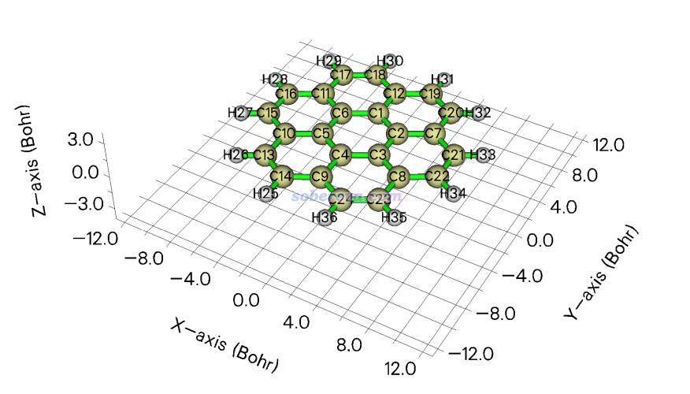
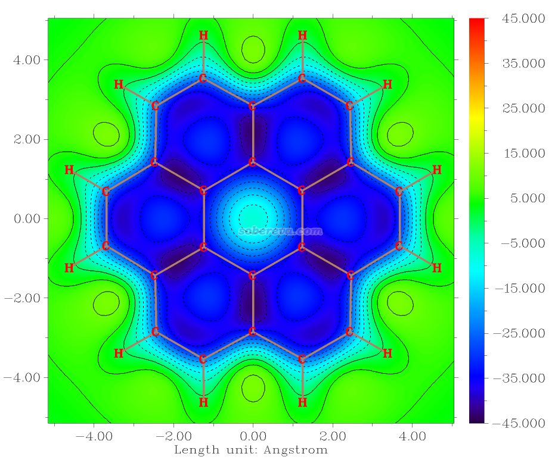
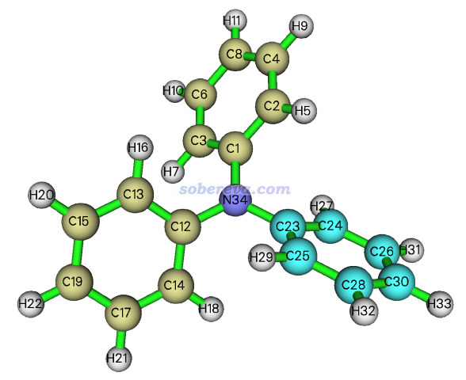
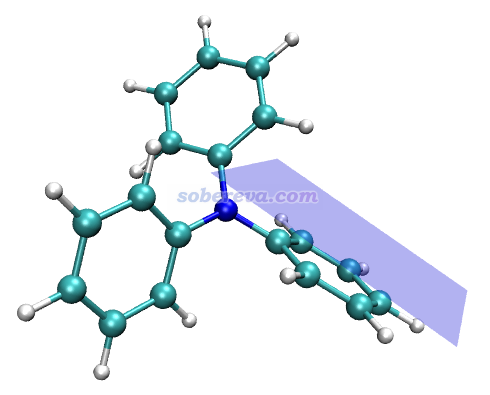
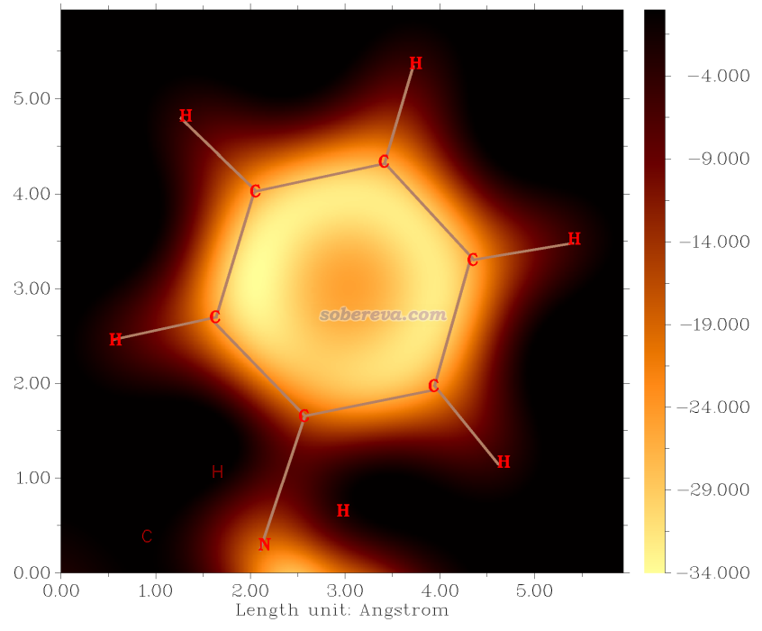
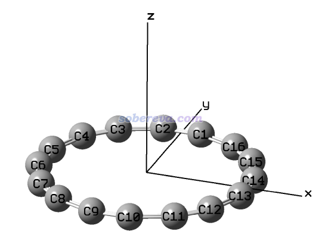
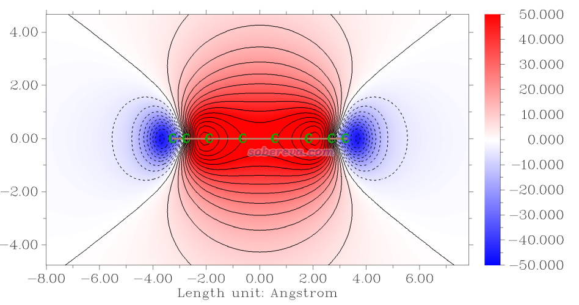

**使****用Multiwfn巨方便地绘制二维NICS平面图考察芳香性**

Using Multiwfn to easily plot two-dimensional NICS plane maps to examine aromaticity

文/Sobereva@[北京科音](http://www.keinsci.com)

First release: 2023-Aug-9   Last update: 2024-Jun-25

## 1 前言

NICS在衡量芳香性上用得很普遍，在《衡量芳香性的方法以及在Multiwfn中的计算》（<http://sobereva.com/176>）里有充分介绍，不了解者务必先阅读。强大的波函数分析程序Multiwfn具有很好用的绘制一维NICS图的功能，见《使用Multiwfn绘制一维NICS曲线并通过积分衡量芳香性》（<http://sobereva.com/681>）；此外，Multiwfn支持的ICSS分析在本质上是考察三维空间的NICS（ICSS和NICS仅相差正负号），见《通过Multiwfn绘制等化学屏蔽表面(ICSS)研究芳香性》（<http://sobereva.com/216>）。虽然如此文所示例的，利用Multiwfn的ICSS模块结合Gaussian程序产生三维ICSS格点数据后，可以利用Multiwfn以格点数据插值方式得到任意平面上的二维ICSS/NICS图，但如果你的目的仅仅是绘制二维NICS图，那么为此很耗时地计算三维ICSS格点数据明显是不划算的。本文就演示Multiwfn里新加入的专门绘制二维NICS图的功能，仅需要借助Gaussian计算分布在作图平面上的格点即可，耗时比计算三维ICSS格点数据低一、两个数量级。

读者请务必使用2023-Aug-7及以后更新的Multiwfn版本，可以在官网<http://sobereva.com/multiwfn>免费下载。对Multiwfn不了解者建议阅读《Multiwfn入门tips》（<http://sobereva.com/167>）和《Multiwfn FAQ》（<http://sobereva.com/452>）。本文用的Gaussian是G16 C.02。

## 2 例1：绘制晕苯平面上方1埃处NICS_ZZ平面图

Multiwfn程序包里的examples\NICS_scan\coronene.pdb是B3LYP/6-31G*级别优化的晕苯的结构文件，如下所示，分子在Z=0的XY平面上。此例绘制分子上方1埃处的平面的NICS_ZZ的填色图。注意本文里的NICS_ZZ值是指垂直于被考察的环平面的磁屏蔽张量分量的负值，而非特指笛卡尔Z轴方向的分量，后同。

启动Multiwfn，然后输入  
examples\NICS_scan\coronene.pdb  
25   //离域性与芳香性分析  
14   //绘制NICS二维平面图  
1   //填色图  
[回车]  //用默认的格点数，即两个方向都是100个点，因此要计算100*100=10000个Bq  
0   //设置延展距离  
1  //1 Bohr。对当前体系用比默认小得多的延展距离便足以，免得图中有过多的体系外围的不感兴趣的区域。不知道什么叫延展距离的话看《Multiwfn FAQ》（<http://sobereva.com/452>）的4.2节  
1   //XY平面  
1a   //Z=1埃  
1   //产生Gaussian的NICS二维扫描的输入文件  
examples\NICS_scan\template_NMR.gjf   //这是Gaussian做NMR计算的模板文件，里面原子坐标部分用[geometry]代替，会被自动替换

现在当前目录下产生了NICS_2D.gjf。可以根据实际情况进行修改，比如修改净电荷、自旋多重度、基组等等，不懂的地方别乱改。这里把基组设为6-31G*，其它的不变。之后用Gaussian计算之，在2*7R32机子96核并行情况下花了1m50s算完。相应的输入和输出文件是examples\NICS_scan\目录下的coronene_NICS_2D.gjf和coronene_NICS_2D.out。

然后在Multiwfn界面里输入2选择载入Gaussian输出文件，然后输入其路径examples\NICS_scan\coronene_NICS_2D.out。程序问你要获得哪种NICS，可以选各向同性值、各向异性值、平行于笛卡尔X或Y或Z方向的分量值、顺着特定矢量的分量值。这里选择5，即平行于Z方向的值。由于当前体系平行于XY平面，因此这么选得到的对应于一般意义的NICS_ZZ。

然后图像马上就蹦出来了，同时文本窗口显示了平面数据最负和最正数值，如下所示，可见作图平面上NICS_ZZ最负值为-43.3 ppm。可以根据此值恰当地设置色彩刻度上下限范围  
The minimum of data:  -43.3034000000000  
The maximum of data:   11.3487000000000

关闭图像，输入以下命令修改作图效果  
4   //显示原子标签  
1  //红色  
8    //显示化学键  
14  //棕色  
17   //设置显示标签的距离阈值  
5   //距离作图平面5 Bohr以内的原子标签才显示出来  
y   //更远的原子用细体字显示标签  
1   //修改色彩刻度范围  
-45,45  
-8   //坐标轴改为以埃为单位  
-2   //修改坐标轴刻度  
2,2,10  
2   //显示出等值线  
3   //修改等值线设置  
8   //按等差数列生成等值线数值  
-50,5,21  //起始值，步长，步数  
y  //替换原有的等值线数值。之后等值线数值为-50,-45,-40...略...40,45,50  
1   //保存并返回  
-1  //重新作图

现在看到下图

此图颜色越深说明NICS_ZZ越负，即对垂直于体系平面方向的磁场屏蔽效应越强。此图中外围六元环的颜色明显比中间的六元环更深，体现出外围六元环有更强的芳香性。用其它芳香性指标也能体现这一点，比如用Multiwfn计算多中心键级的话，会发现中间的环的六中心键级是0.022，而外围的是0.034，也展现出外围的六元环的芳香性相对更强。

在后处理菜单还可以选-7用来给平面数据乘上一个因子，如果设-1，则数据的符号就会反转，之后绘制的相当于ICSS平面图。

顺带一提，老有人不好好看本文，居然用Gaussian的NICS的输出文件当Multiwfn启动后的输入文件，然后问我为什么图上一大块矩形区域都是一个颜色，真匪夷所思！！！！！！！！！！！！！！！！！！！！输出文件里那么多Bq原子，原子标签显示出来当然把图都遮盖住了！**好好看清楚例子里Multiwfn在启动后载入的是什么文件！**

## 3 例2：绘制三苯胺的苯环上方1埃处的NICS_ZZ平面图

在B3LYP/6-31G*下优化的三苯胺的结构文件是examples\NICS_scan\N(phenyl)3.pdb，如下所示，可见环都是倾斜着的。此例绘制23,24,26,30,28,25原子组成的环（已高亮显示）的上方1埃平面处的NICS_ZZ平面图，取垂直于环方向的磁屏蔽张量分量。

启动Multiwfn，然后输入  
examples\NICS_scan\N(phenyl)3.pdb  
25   //离域性与芳香性分析  
14   //绘制NICS二维平面图  
1   //填色图  
[回车]  //用默认的格点数100*100  
8   //绘制某些原子构成的拟合平面的上方或下方的平面  
23,24,26,30,28,25   //环中的原子  
注意此时在屏幕上显示了这6个原子拟合的平面的单位法矢量：  
The unit normal vector is    0.33076524    0.57300118    0.74984265

接着在Multiwfn里输入  
1   //绘制的是与拟合平面相平行而在它上方1埃的平面。如果输入负值代表在下方  
6   //绘图平面的边长为6埃

此时在Multiwfn窗口中显示了在VMD程序里绘制作图平面区域的命令：  
draw triangle {   2.495   2.581  -1.739} {  -1.211  -0.235   2.047} {   6.776  -1.451  -0.547}  
draw triangle {  -1.211  -0.235   2.047} {   6.776  -1.451  -0.547} {   3.070  -4.266   3.239}  
draw material Transparent  
如果将N(phenyl)3.pdb载入VMD，然后在文本窗口里输入以上命令，恰当修改显示方式后就可以看到下图，蓝色透明区域对应实际作图平面，由此可以检验作图平面设定得是否合理，当前显然是合理的。被选择的六个原子的几何中心在作图平面上的投影位置对应于作图平面的正中心。

接着在Multiwfn里输入  
1   //产生Gaussian的NICS二维扫描的输入文件  
examples\NICS_scan\template_NMR.gjf   //Gaussian做NMR计算的模板文件

当前目录下产生了NICS_2D.gjf。将基组改为6-31G*，然后让Gaussian运行，在2*7R32 96核机子上2m5s算完。相应的输入和输出文件分别是examples\NICS_scan\目录下的N(phenyl)3_NICS_2D.gjf和N(phenyl)3_NICS_2D.out。

接着在Multiwfn里输入  
2  //载入Gaussian的NICS扫描的输出文件  
examples\NICS_scan\N(phenyl)3_NICS_2D.out  
0   //对各个点，取NICS在特定矢量上的投影  
0.33076524    0.57300118    0.74984265   //之前Multiwfn显示的拟合平面的单位法矢量

之后可见当前的作图平面上的数据的最负和最正值：  
The minimum of data:  -34.0268462149550  
The maximum of data:   4.05938599881831

关闭图像，然后输入  
4   //显示原子标签  
1  //红色  
8    //显示化学键  
14  //棕色  
17   //设置显示标签的距离阈值  
5   //距离作图平面5 Bohr以内的原子标签才显示出来  
y   //更远的原子用细体字显示标签  
1   //修改色彩刻度范围  
-34,0  
-8   //坐标轴改为以埃为单位  
-2   //修改坐标轴刻度  
1,1,5  
19   //修改色彩变化方式  
19   //黄-橙-黑  
-1  //重新作图

由图可见在环平面上方的六元环内区域的NICS_ZZ很负，体现出这个环的显著芳香性。更具体来说，环中心正上方不是最负的，靠近C-C键的内侧区域是稍微更负的。这样的NICS分布是普遍现象。

## 4 例3：绘制C16的垂直于环平面的NICS_ZZ平面图

笔者之前对18碳环体系（<http://sobereva.com/carbon_ring.html>）做过大量研究，其中包括其芳香性。其类似物16碳环（C16）最近也被合成了出来。16碳环的in-plane和out-of-plane两类pi轨道都有16个电子，满足Huckel反芳香性规则，因此可以预期C16具有双反芳香性特征。这里使用Multiwfn对垂直于它环平面的截面绘制NICS_ZZ图，以考察分子由内到外不同区域对垂直于环方向磁场的屏蔽效果。wB97XD/def2-TZVP优化过的C16的结构文件是examples\NICS_scan\C16.pdb，如下所示，可见绘制X=0的YZ平面或者Y=0的XZ平面都可以满足当前目的。

启动Multiwfn，然后输入  
examples\NICS_scan\C16.pdb  
25   //离域性与芳香性分析  
14   //绘制NICS二维平面图  
1   //填色图  
[回车]  //用默认的格点数，即两个方向都是100个点  
0   //设置延展距离  
9  //9 Bohr。把延展距离设得比默认更大以展现更广阔区域的磁屏蔽情况  
2   //XZ平面  
0   //Y=0  
1   //产生Gaussian的NICS二维扫描的输入文件  
examples\NICS_scan\template_NMR.gjf   //Gaussian做NMR计算的模板文件

之后把计算级别改成wB97XD/def2-TZVP，因为笔者在Carbon, 165, 468 (2020)里证明了这个级别可以描述好碳环的结构，而常用的B3LYP则绝对不能用，《谈谈量子化学研究中什么时候用B3LYP泛函优化几何结构是适当的》（<http://sobereva.com/557>）中也提到了这点。而且《我对一篇存在大量错误的J.Mol.Model.期刊上的18碳环研究文章的comment》（<http://sobereva.com/584>）里也说了6-31G*无法合理描述碳环类体系的电子结构，因此这里用的基组质量比前面的例子更好。

此例的NICS扫描的输入输出文件是examples\NICS_scan\目录下的C16_NICS_2D.gjf和C16_NICS_2D.out。在Multiwfn当前的界面里选2，输入C16_NICS_2D.out的路径载入之，然后输入5选择读取ZZ分量。关闭图像后用以下命令调节作图设置  
4   //显示原子标签  
12  //深绿色  
8   //显示化学键  
14   //棕色  
17   //设置显示标签的距离阈值  
50   //距离作图平面50 Bohr以内的原子标签才显示出来  
y   //更远的原子用细体字显示标签  
1   //修改色彩刻度范围  
-50,50  
-8   //坐标轴改为以埃为单位  
-2   //修改坐标轴刻度  
2,2,10  
2   //显示出等值线  
3   //修改等值线设置  
8   //按等差数列生成等值线数值  
-80,5,33  //起始值，步长，步数  
y  //替换原有的等值线数值  
1   //保存并返回  
19  //设置色彩变化  
8    //蓝-白-红  
-1  //重新作图

看到的图像如下。可见在环中央及其上下方区域NICS_ZZ都为非常显著的正值，Multiwfn显示的平面上最正值都达到了72.3 ppm，说明C16有极强的反芳香性。

上图可以跟《通过Multiwfn绘制等化学屏蔽表面(ICSS)研究芳香性》（<http://sobereva.com/216>）里列举的Carbon, 165, 468 (2020)文中的18碳环截面的ICSS二维图进行对比，可见特征一样但符号相反（再次注意ICSS和NICS相差正负号），也即C16和C18的芳香性特征正好是相反的。

## 5 总结

本文介绍了Multiwfn的非常简单易用的绘制二维NICS平面图的功能，定义作图平面的方式非常灵活，作图设置丰富，效果极好，在像样的机子上用Gaussian计算绘制这种图所需的磁屏蔽张量数据的耗时一般也比较低（在较好的服务器上算不很大的体系属于立等可取的耗时），非常推荐在研究芳香性问题时恰当地使用。

**使用本文的功能绘制NICS平面图用于发表论文时必须按照Multiwfn启动时的提示恰当引用Multiwfn的原文，给别人代算时也必须需明确告知对方这一点。**
