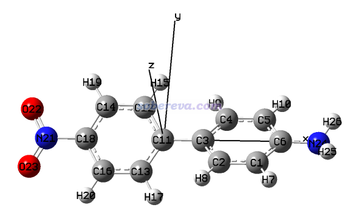
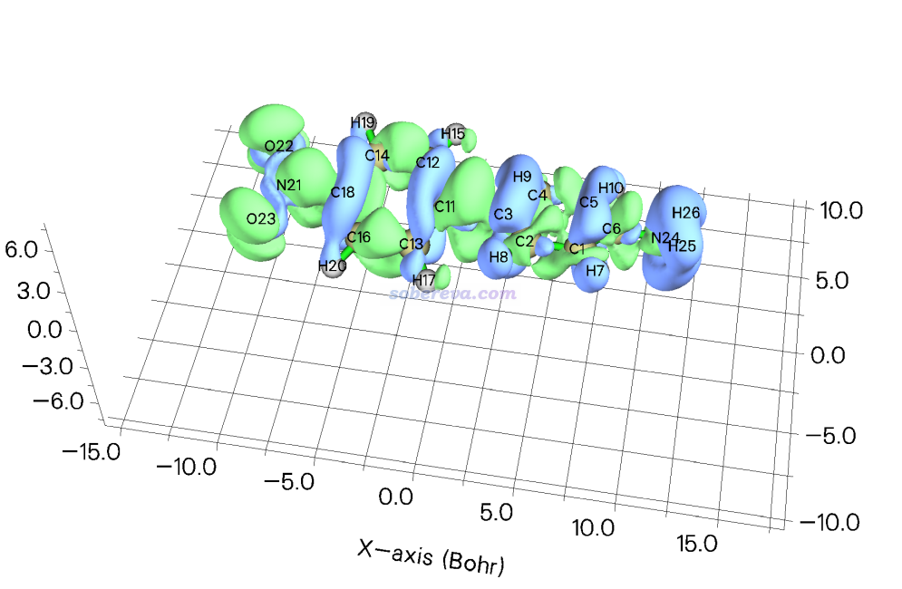
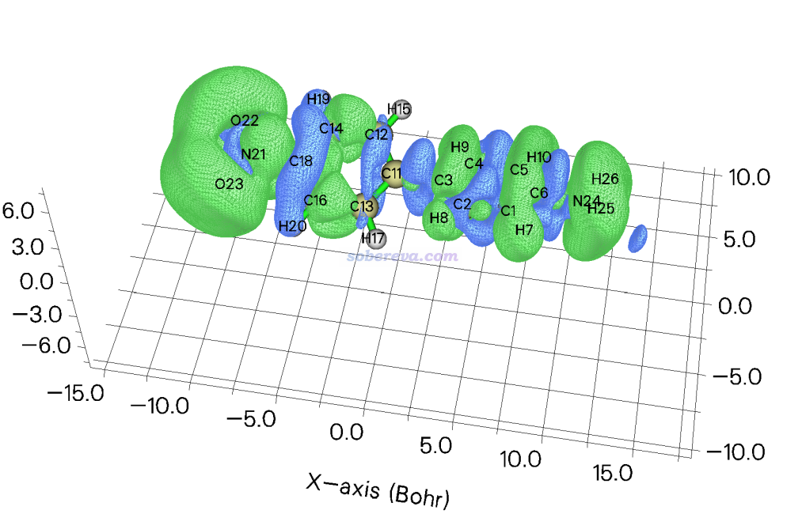
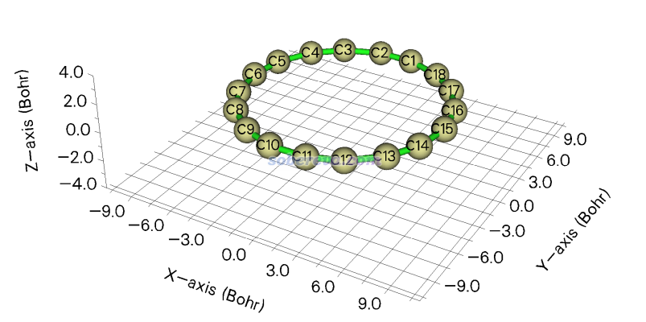
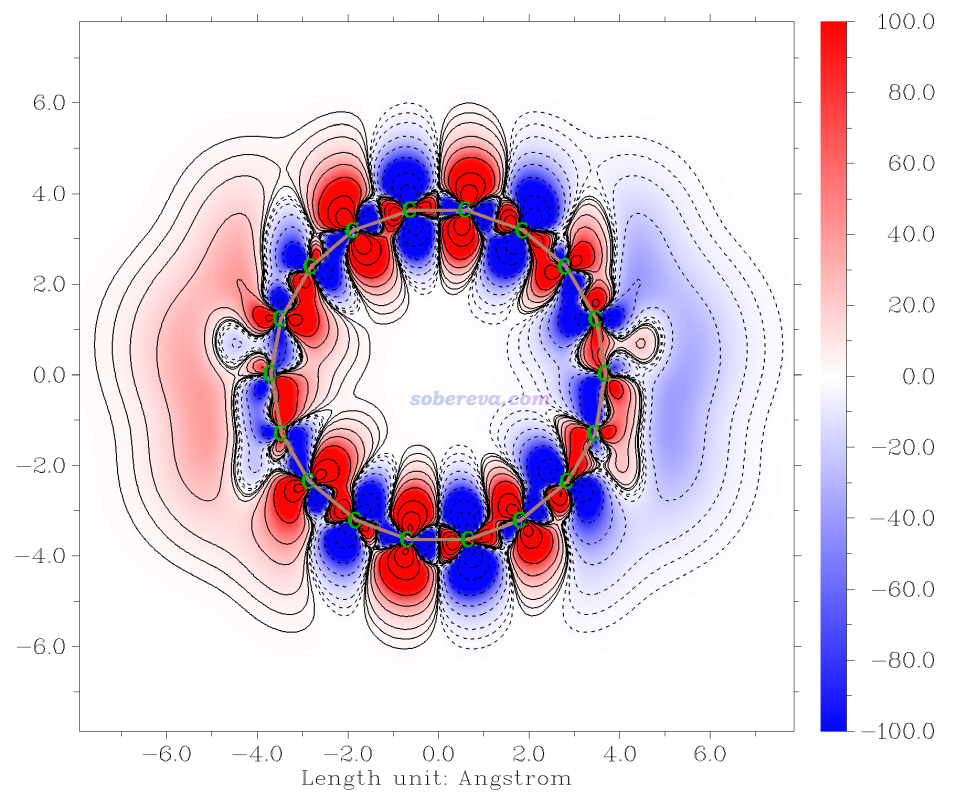

**使用Multiwfn极为方便地绘制(超)极化率密度和三维空间对(超)极化率的贡献**

Using Multiwfn to extremely conveniently plot (hyper)polarizability density and the contribution of three-dimensional space to (hyper)polarizability

文/Sobereva@[北京科音](http://www.keinsci.com)   2023-Aug-11

## 1 前言

（超）极化率密度是一种非常重要的直观分析化学体系（超）极化率内在本质的方法，由此可进一步得到三维空间各个位置对（超）极化率的贡献，这种分解分析对于讨论和对比（超）极化率的大小和符号，以及深入了解体系不同区域对外电场的响应，都有重要意义。笔者之前在《使用Multiwfn计算（超）极化率密度》（<http://sobereva.com/305>）介绍了如何利用强大灵活的波函数分析程序Multiwfn以纯手动的方式计算(超)极化率密度，此方法已经在大量文章中得到了广泛的应用。但这种做法操作起来很费事，计算流程也容易忘，经验不足的用户还可能犯错误，在一定程度上制约了(超)极化率密度的普及。

2023-Aug-11更新的Multiwfn版本中加入了非常方便省事的计算（超）极化率密度以及三维空间对(超)极化率的贡献的功能，可以直接绘制等值面图和平面图，令这种分析的流程极大地简化，也充分避免了初学者在操作过程中犯错的可能，在本文就介绍一下这个功能的用法。《使用Multiwfn计算（超）极化率密度》（<http://sobereva.com/305>）里介绍的操作方法就可以彻底弃了，但如果你对（超）极化率密度的背景知识不了解、不知道怎么分析的话，则一定要先读一下这篇文章里的相关介绍和讨论，我假定读者已经看过了此文。

Multiwfn可以在官网<http://sobereva.com/multiwfn>免费下载。如果你对Multiwfn不了解，建议阅读《Multiwfn入门tips》（<http://sobereva.com/167>）和《Multiwfn FAQ》（<http://sobereva.com/452>）。本文介绍的功能需要结合Gaussian使用，本文例子用的是Gaussian 16 C.02版，至少不能用比G09 B.01更老的版本。

下文涉及的文件都可以在<http://sobereva.com/attach/683/file.zip>中找到。

## 2 实例1：D-pi-A体系第一超极化率密度的绘制

此例要对下面这个D-pi-A型体系绘制第一超极化率密度的XX分量（ρxx），以及三维空间对第一超极化率的贡献（-x*ρxx）。在Multiwfn可执行文件包里examples\excit\D-pi-A.fchk文件记录的结构信息对应的是此体系的优化过的基态的结构，如下图所示。

启动Multiwfn，然后输入  
examples\excit\D-pi-A.fchk   //Multiwfn将从中读取结构信息。用.xyz、.pdb、.gjf等其它记录了结构信息的文件格式也都可以，详见《详谈Multiwfn支持的输入文件类型、产生方法以及相互转换》（<http://sobereva.com/379>）  
24   //各种（超）极化率相关的分析  
3   //（超）极化率密度分析  
2  //计算第一超极化率密度  
1   //X方向  
1  //产生不同电场下的Gaussian单点任务的输入文件

现在当前目录下就有了X-1.gjf、X_0.gjf和X+1.gjf。Multiwfn用的电场的有限差分步长是0.003 a.u.，这很适合用于计算（超）极化率密度，也因此比如X-1.gjf和X+1.gjf就分别对应向X的负方向和正方向加0.003 a.u.电场，X_0.gjf是不加外电场的情况。输入文件里默认用的是PBE0/aug-cc-pVTZ进行计算，这对于大多数分子的（超）极化率的计算都是适合的级别，如果想改成其它的自己改就完了。输入文件里还有一些关键词是用来尽可能避免因为带弥散函数较多时电子积分求解精度差和KS矩阵构建不精确而导致SCF难收敛的，不懂就别乱改。nosymm关键词也自动加上了，由此避免Gaussian自动把体系搞到标准朝向下，不理解的话看《谈谈Gaussian中的对称性与nosymm关键词的使用》（<http://sobereva.com/297>）。从gjf文件内容还可以看到这些任务会产生与输入文件同名的.wfx格式的波函数文件。

使用Gaussian运行这三个.gjf文件，分别得到X-1.wfx、X_0.wfx和X+1.wfx。如果你不知道怎么批量用Gaussian运行一堆gjf文件的话，看《使用Gaussian时的几个实用脚本和命令》（<http://sobereva.com/258>）。

接着，在Multiwfn的窗口里输入2，并输入这些wfx文件所在目录（如果是在当前目录下则直接按回车），它们就都被读取了。之后看到新菜单，选项的含义都提示得非常明白，可以对（超）极化率密度和三维空间对（超）极化率的贡献计算格点数据（之后可以绘制等值面图或者导出cub文件），也可以对它们绘制成平面图。由于一开始我们选的是第一超极化率和X方向，所以此菜单的选项里的first hyperpolarizability density当前显然指的是ρxx，而spatial contribution to first hyperpolarizability显然对应-x*ρxx。

下面绘制ρxx的等值面图。在Multiwfn里输入  
1   //计算（超）极化率密度的格点数据  
3   //高质量格点。不懂格点怎么选的话看《Multiwfn FAQ》（<http://sobereva.com/452>）的Q39

之后屏幕上给出了积分值（-1.721222 a.u.）。选1后蹦出了ρxx的等值面图。等值面数值设为2后看到的图像如下，绿色和蓝色分别为正值和负值等值面

关闭窗口后还可以选2导出cub文件，然后可以用《在VMD里将cube文件瞬间绘制成效果极佳的等值面图的方法》（<http://sobereva.com/483>）介绍的方法在VMD里绘制出效果更好的等值面图。

接下来绘制-x*ρxx的等值面图，输入  
0   //返回  
2   //计算三维空间对（超）极化率密度贡献的格点数据  
3   //高质量格点

屏幕上显示格点数据的积分值为7803.891517 a.u.，这对应基于立方格点积分-x*ρxx算的βxxx值。选1后蹦出了-x*ρxx的等值面图。等值面数值设为5时看到的图如下（这里还改成了solid+mesh风格显示以让图更有立体感）。可见图里大部分地方数值为正，是此体系βxxx很大的主要原因。

选0返回后还可以选3和4分别绘制ρxx和-x*ρxx的平面图，操作和设置方式与Multiwfn的主功能4绘制平面图完全一样，如果你不熟悉用Multiwfn绘制平面图的话参看Multiwfn手册4.4节的海量例子。平面图的绘制在下一节的例子里有具体体现。

在本文的文件包里的D-pi-A目录里有个gamma.out，是PBE0/aug-cc-pVTZ级别对当前体系计算（超）极化率的输出文件。使用《使用Multiwfn分析Gaussian的极化率、超极化率的输出》（<http://sobereva.com/231>）介绍的方法查看βxxx会发现数值为7639.07。上面基于立方格点积分得到的值7803.89与之很接近，说明以上图像是合理、有意义的。

## 3 实例2：18碳环第二超极化率密度的绘制

18碳环（cyclo[18]carbon）是个有意思的体系，笔者对它及其类似物做了大量的研究，汇总见<http://sobereva.com/carbon_ring.html>。在Carbon, 165, 461 (2020)笔者给出了18碳环环平面上的ρxxx和-x*ρxxx的填色等值线图，这里来重现一下。优化过的18碳环的结构是本文文件包里的C18目录下的C18.xyz，如下所示，体系在Z=0的XY平面上

启动Multiwfn，然后输入  
C18.xyz  
24   //（超）极化率分析  
3   //考察（超）极化率密度  
3   //第二超极化率密度及三维空间对第二超极化率的贡献  
1   //X方向  
1  //产生不同电场下的Gaussian单点任务的输入文件  
[回车]    //净电荷为0、自旋多重度为1

当前目录下产生了X-2.gjf、X-1.gjf、X+1.gjf和X+2.gjf。如我在Carbon, 165, 468 (2020)中证明的，PBE0无法正确描述18碳环的长短键交替的结构，因此手动把这4个gjf文件里的PBE0替换成非常适合研究碳环体系的wB97XD。然后用Gaussian计算它们，得到X-2.wfx、X-1.wfx、X+1.wfx和X+2.wfx。

在Multiwfn的窗口里输入2，并输入这些wfx文件所在目录以载入它们。之后绘制ρxxx的平面图，输入  
3   //绘制（超）极化率密度的平面图  
1   //填色图  
[回车]  //用默认格点数  
1   //XY平面  
0  //Z=0

图像马上就蹦出来了。之后关闭图像，输入以下命令调节作图效果  
19   //修改色彩变化  
8  //蓝-白-红  
1   //设置色彩刻度下限和上限  
-100,100  
4  //显示原子标签  
12   //深绿色  
8   //显示化学键  
14   //棕色  
-8  //把横纵轴单位改成埃  
-2   //设置X、Y、Z（色彩刻度）轴的标签间隔  
2,2,20  
-3   //其它设置  
2   //设置X、Y、Z轴标签的小数点位数  
1  
1  
1  
0   //返回  
2   //显示等值线  
3  //修改等值线设置  
4   //删除某些等值线（这里把数值很小的删除，免得图像太乱）  
32-41  
4   //删除某些等值线  
1-10  
1   //保存并返回  
-1   //重新作图

现在得到下图，可见效果很好。-x*ρxxx的平面图也可以以类似方式绘制，选-5返回后，再选择4 Plot plane map of spatial contribution to second hyperpolarizability然后重复上面的操作即可。显然，也可以类似上一节的例子选择相应选项绘制ρxxx和-x*ρxxx的等值面图。

## 4 总结

本文演示了Multiwfn专门计算（超）极化率密度以及三维空间对（超）极化率贡献的功能，通过上面的例子可见用此功能绘制等值面图和等值线图非常方便，照着屏幕上的提示来操作就可以轻易完成，此功能使得（超）极化率密度的考察变得比以往容易得多得多，推荐大家在极化率和超极化率的研究中充分使用此功能。本文没有专门给出极化率密度和三维空间对极化率贡献的计算例子，因为操作和上面的例子完全一样，只不过进入主功能24的子功能3之后先选择1 Polarizability density and spatial contribution to polarizability即可。

Multiwfn还可以基于三维空间对（超）极化率贡献的格点数据通过模糊空间积分来得到原子对（超）极化率贡献的定量数值，做法在《使用Multiwfn计算（超）极化率密度》（<http://sobereva.com/305>）的第7节演示了，这里不再重复。怎么把格点数据导出在上面的例子里已经明确提过了。

使用Multiwfn按本文的做法进行研究时需要在写文章时引用Multiwfn启动后明确显示的Multiwfn原文。
