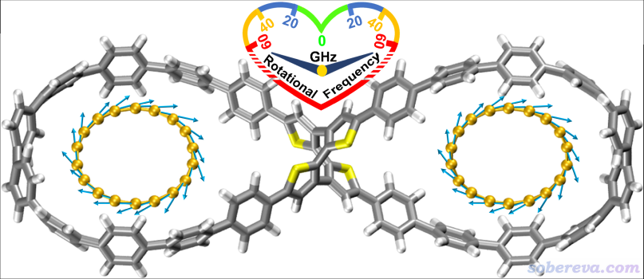
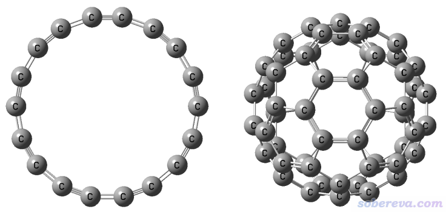
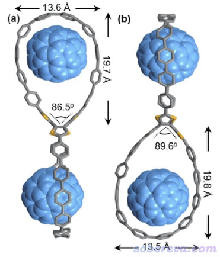
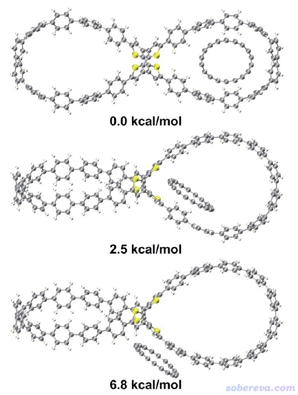
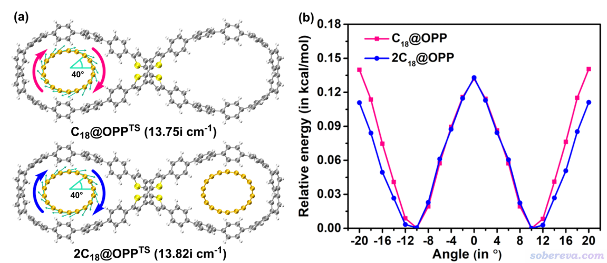
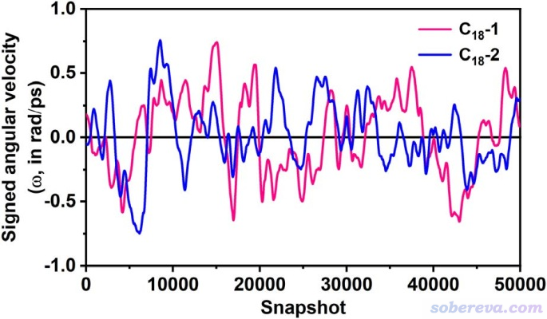
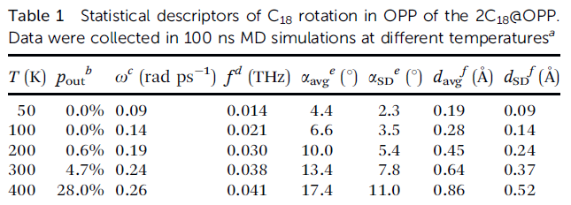
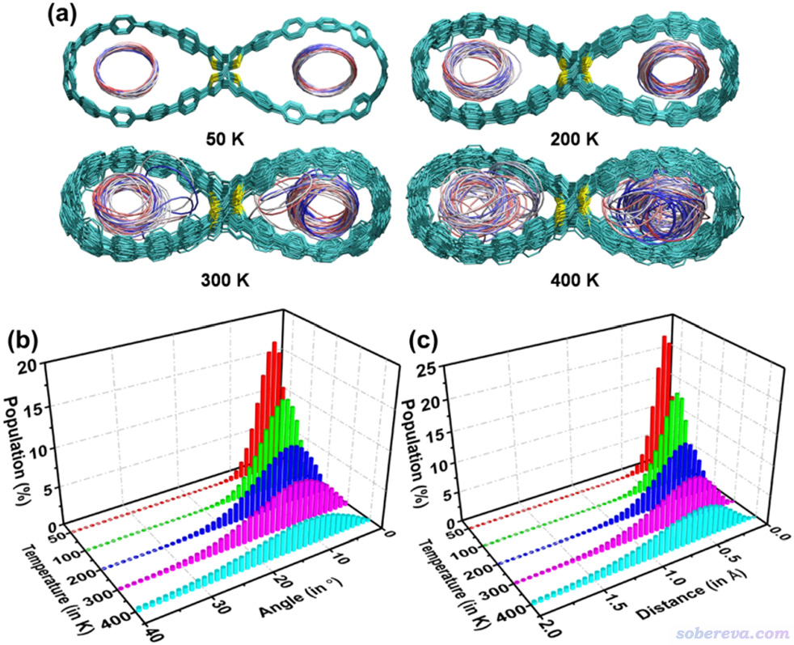

**理论设计新颖的基于18碳环构成的双马达超分子体系**

Theoretical design of a novel dual-motor supramolecular system based on cyclo[18]carbon

文/Sobereva@[北京科音](http://www.keinsci.com)   2023-Aug-14

## 1 前言

北京科音自然科学研究中心（[www.keinsci.com](http://www.keinsci.com)）的卢天和江苏科技大学的刘泽玉等人近期设计了由18碳环（cyclo[18]carbon, C18）和具有两个大环的分子（OPP）构成的非常新颖的双马达超分子体系，并做了详细的分子动力学特征的研究，相关工作已发表在知名的Chemical Communications通讯刊物上，文章信息如下，欢迎阅读和引用：  
Zeyu Liu,* Xia Wang, Tian Lu,* et al., Theoretical design of a dual-motor nanorotator composed of all-carboatomic cyclo[18]carbon and a figure-of-eight carbon hoop, *Chem. Commun.*, **59**, 9770 (2023) DOI: 10.1039/D3CC02262E  
<https://pubs.rsc.org/en/content/articlelanding/2023/CC/D3CC02262E>

链接：<https://pan.baidu.com/s/1H7AcSnDqbjBOE2ajFk-LXA?pwd=tnzv>

下面将对此文的主要研究内容和思想进行深入浅出的介绍，以有助于读者更好地理解文章内容。下图是被研究的双马达超分子体系的结构图和运动方式示意

值得一提的是，同作者之前还深入细致地考察了上文研究的OPP对18碳环的吸附和释放的动力学过程及相互作用本质，已发表于Phys. Chem. Chem. Phys., 25, 16707 (2023) DOI: 10.1039/d3cp01896b，并在《8字形双环分子对18碳环的独特吸附行为的量子化学、波函数分析与分子动力学研究》（<http://sobereva.com/674>）中做了详细介绍，推荐阅读。同作者之前还对18碳环及衍生物的各方面性质还做了非常广泛的研究，相关工作汇总见<http://sobereva.com/carbon_ring.html>。

## 2 设计思想

18碳环这个奇妙的分子虽然在半个多世纪以前就被理论预测，但直到2019年才首次在凝聚相实验观测到，并迅速引发了巨大关注。它的直径和C60富勒烯很相似，对比见下图

具有较大双环结构的OPP分子在Angew. Chem., Int. Ed., 61, e202113334 (2022)中被首次合成出来，实验上得到了它带有C60和C70富勒烯的晶体，C60@OPP的晶体结构如下所示，可见C60被嵌入在了大环里面

由以上结构特征可以想到两个C18也可以分别内嵌到OPP的两个大环中，成为2C18@OPP。倘若每个C18在OPP的大环里能够由于热的驱动而较容易地发生转动，自然就成了双马达超分子体系。这样的体系在之前的文章中是没有报道的，此体系或类似物在未来有望成为构造复杂分子机器的关键组成部分。本文介绍的Chem. Commun.这篇文章的目的就在于通过量子化学和分子动力学模拟来证实OPP与C18复合作为双马达体系的可能性并考察其特点。

## 3 基于量子化学的能量角度的研究

文中首先使用量子化学方法从能量角度对C18@OPP和2C18@OPP进行了研究。首先使用Gaussian程序通过ωB97XD泛函优化了复合物结构并做了振动分析。2C18@OPP达到了260个原子，为了节约时间，对占体系大部分原子的OPP部分用了6-31G*基组，而关键的C18部分用了更好的6-311G*基组（在<http://sobereva.com/584>中也指出6-31G*无法合理描述C18）。对相应单体也在对应的级别做了优化和振动分析。之后通过ORCA程序使用ωB97X-V/def2-TZVP级别结合counterpoise校正计算了它们的结合能（做法可参考《在ORCA中做counterpoise校正并计算分子间结合能的例子》<http://sobereva.com/542>），发现C18 + OPP以及C18 + C18@OPP的结合能分别为-18.4和-18.5 kcal/mol，一方面说明C18与OPP有较强的内在结合能力，另一方面说明C18@OPP的已进入的一个C18几乎不影响OPP对第二个C18的结合能力。之后，文中通过《使用Shermo结合量子化学程序方便地计算分子的各种热力学数据》（<http://sobereva.com/552>）介绍的Shermo程序计算了C18、OPP、C18@OPP和2C18@OPP常温下自由能热校正量，并进而得到了常温下的C18 + OPP和C18 + C18@OPP的结合自由能，分别为-6.0和-4.0 kcal/mol，明显为负值说明C18的进入是热力学上可自发的，其大小明显小于结合能是来自于分子间复合带来的熵罚效应。

审稿人问及C18是否有可能与OPP存在其它结合方式。为了说明这一点，此文的补充材料里给出了优化出的其它两个C18与OPP复合物的极小点结构，如下所示，相对于C18平行地嵌入在OPP大环内的结构的能量差也在下图给出了。可见其它两种结构都是能量更高、明显更不稳定的。在《8字形双环分子对18碳环的独特吸附行为的量子化学、波函数分析与分子动力学研究》（<http://sobereva.com/674>）介绍的PCCP文章中实际上也已经通过分子动力学模拟证明了C18没有其它的能够与OPP稳定结合的方式。

文中进一步研究了C18的旋转势垒。对C18@OPP和2C18@OPP优化的C18旋转的过渡态结构如下(a)所示，可见虚频数值非常小，暗示旋转势垒肯定很低。图中的箭头体现了虚频方向，可见明显对应的是C18的整体旋转。此图是按照《在VMD中绘制Gaussian计算的分子振动矢量的方法》（<http://sobereva.com/567>）介绍的方式绘制的。

进一步，文中对C18在OPP大环中的旋转进行了扫描（计算级别同几何优化），如上图(b)所示，其中横坐标是旋转角度，0处为过渡态结构。可见旋转势垒非常低，只有0.13 kcal/mol，这体现C18在OPP大环中的旋转必然很容易靠热运动来驱动。上图横坐标范围对应一个旋转周期，是40度，这也正对应于18碳环的极小点结构是D9h的特征。图中看上去每20度有一个极大点，这是因为18碳环是18个原子构成的环状体系，如果忽视其长-短键交替特征的话，就相当于20度一个旋转周期。

## 4 分子动力学模拟C18在OPP中的运动行为

分子动力学模拟研究是本文最关键的部分，模拟出的动力学行为是C18与OPP复合物能否作为分子马达的决定性证据。此文使用GROMACS程序通过经典力场进行动力学模拟，使用灵活的sobtop程序（<http://sobereva.com/soft/Sobtop>）构建拓扑文件，主要基于GAFF力场，部分参数利用OPP的Hessian矩阵由sobtop产生，相关细节在《8字形双环分子对18碳环的独特吸附行为的量子化学、波函数分析与分子动力学研究》（<http://sobereva.com/674>）里有描述，这里就不多提了。

2C18@OPP处于300 K的平衡状态时的200 ps动画如下所示（是在文章的补充材料里提供的）。为了能让C18的旋转特征看得清楚，其中一个原子以红色来标记。由动画可见，的确C18在OPP中能够非常顺利、自如地转动起来，充分证实了此文提出的双马达超分子体系的设想！

[**http://sobereva.com/attach/684/2C18_OPP_rotator.mp4**](http://sobereva.com/attach/684/2C18_OPP_rotator.mp4) （点击查看动画）

需要注意的是，由于原子间频繁碰撞导致的动能交换，单靠热运动驱动的C18在OPP中的旋转并非始终是单向的。300 K下模拟的50000帧（0.2 ps保存一帧，故相当于10 ns）中的2C18@OPP中两个C18的旋转角速度如下所示（数据已通过Savitzky-Golay算法利用相邻1000个数据点做了平滑化处理以消除噪音）。由图可见C18的含符号角速度不断发生变化，时正时负，时大时小，因此C18的旋转不能视为是连贯、无摩擦的。从图上两条曲线也可以看到2C18@OPP的两个C18彼此间的运动并没有什么相关性。由于它们离得远，自然也不会有什么明显的直接的耦合或者藉由OPP的结构产生的间接耦合。

## 5 分子动力学模拟C18在OPP中转动的统计行为

文中在50、100、200、300、400 K的热浴下都做了100 ns的分子动力学模拟，并通过自写的轨迹分析程序考察了C18在OPP中转动的统计行为，结果如下表所示。在温度不是很低情况的模拟过程中，偶尔C18会倾斜地倚靠在OPP的内侧，此时的体系明显不算是转子。这种情况的帧数占总模拟帧数的百分比是下表的p_out，这些帧不纳入C18转动行为的统计。可以看到从200 K开始，随着温度上升，处于这种亚稳状态的比例随之上升。

上表中ω是平均无符号转动角速度，可见随着温度越高、体系中原子的平均动能越大，C18平均旋转速度也随之上升。但是300 K变化到400 K过程中平均旋转速度增大甚微，这主要在于400 K的时候C18在OPP中的状态已经很不稳定了，过强的热运动很大程度影响了C18转动的有序性。上表中f=ω/(2π)是换算出来的转动频率，2C18@OPP属于亚THz范围的超快转子。

上表中αavg、αSD分别是C18环平面与OPP大环平面之间在模拟过程中的夹角的平均值和标准偏差，d_avg和d_SD分别是C18环中心与OPP环中心之间在模拟过程中的距离的平均值和标准偏差。从这些指标来看，随着模拟温度提升得越高，2C18@OPP偏离其极小点结构（α和d都近乎为0）的程度越高，越缺乏理想转子特征。

下图展现了VMD绘制的2C18@OPP在100 ns动力学过程中的轨迹叠加图，每1 ns绘制一次，根据帧号从前到后按照红-白-蓝着色。可见在100 K的时候由于热运动弱，体系结构基本上就是在极小点结构附近很小范围波动。到了更高的200 K后OPP的运动幅度以及C18的运动范围都显著增加了。在300 K的时候结构波动更大，还明显看到C18都偶尔侧贴在OPP大环内侧了。到了400 K的时候C18在OPP大环里的运动其实已经很大程度算是无序了，甚至仔细看轨迹都会发现C18在大环内出现了整体翻转。可以预期如果温度明显更高的话，C18甚至就能从OPP的大环中跑出去了，比如临时性跑到OPP外侧乃至飞走。

上图的(b)和(c)对不同温度下模拟的C18在OPP中的结构状态做了统计分析，包括C18与OPP大环间的夹角以及中心距离，可见这两个衡量C18在OPP中结构状态的参数的分布都是随着温度增加而显著变宽，也即在模拟过程中C18的朝向和位置的波动程度愈发增大，这和轨迹叠加图展现的信息是一致的。

## 6 总结

本文介绍了近期发表于Chem. Commun., 59, 9770 (2023)的理论设计的双转子超分子复合物结构，此工作从能量和动力学角度对体系进行了全面的研究，充分证明了此体系作为超快纳米转子的能力，并对其转子性能以及温度依赖性做了系统的考察。由于OPP和C18都已经被合成出来，因此此体系或者其变体有望成为有实际价值的分子机器的组成部分，本文的研究思想和发现对于纳米转子类体系在未来的探索也有显著的启示作用。
