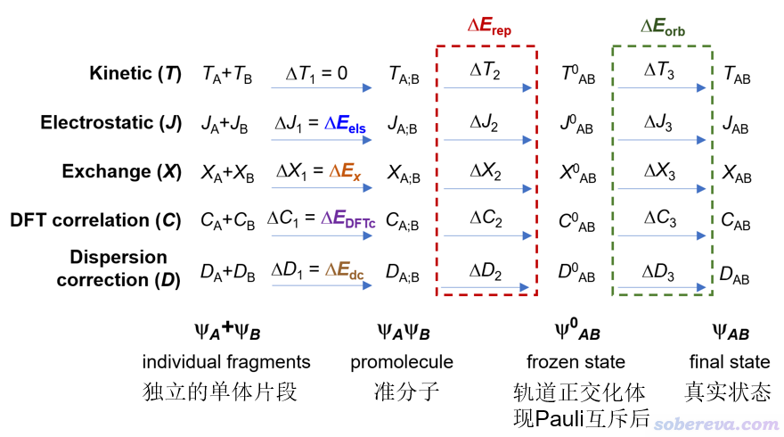
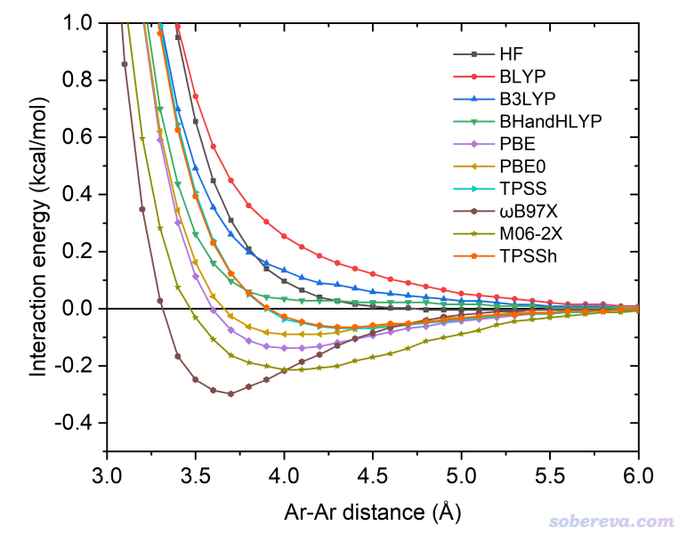
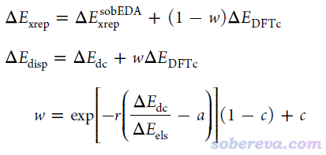
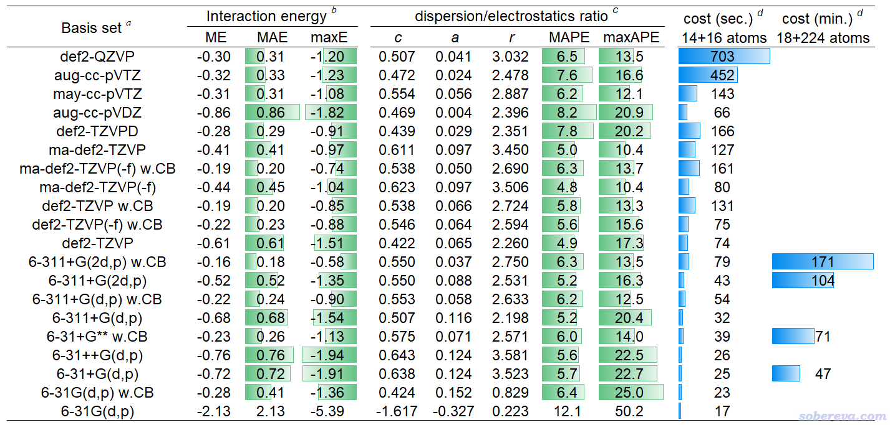
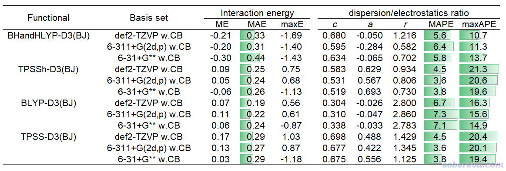
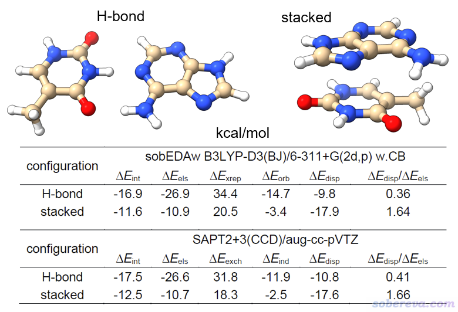
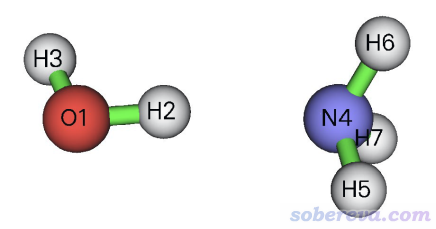

**使用sobEDA和sobEDAw方法做非常准确、快速、方便、普适的能量分解分析**

Using sobEDA and sobEDAw methods to perform very accurate, fast, convenient and universal energy decomposition analysis

文/Sobereva@[北京科音](http://www.keinsci.com/)

First release: 2023-Aug-31    Last update: 2025-Jun-1

## 1 前言

计算化学领域的能量分解分析（energy decomposition analysis, EDA）方法很多，思想各有不同，几种常见的在《Multiwfn支持的弱相互作用的分析方法概览》（<http://sobereva.com/252>）中的能量分解部分有简要介绍，在量子化学波函数分析与Multiwfn程序培训班（<http://www.keinsci.com/workshop/WFN_content.html>）里有系统的介绍。虽然也有基于分子力场的能量分解，比如《使用Multiwfn做基于分子力场的能量分解分析》（<http://sobereva.com/442>）里介绍的EDA-FF，但绝大多数能量分解方法是基于量子化学的，并且其中大多数的目的是将体系中用户自定义的两个或多个片段间的相互作用能进行分解，得到不同物理成份的贡献，从而能够深入了解片段间相互作用的主要本质（静电、色散、交换-互斥、轨道相互作用等），以及横向对比不同情况下相互作用的内在差异，例如《透彻认识氢键本质、简单可靠地估计氢键强度：一篇2019年JCC上的重要研究文章介绍》（<http://sobereva.com/513>）介绍的研究氢键的文章中使用了流行的SAPT能量分解方法充分考察不同体系中氢键的本质和差异并总结出了规律、《静电效应主导了氢气、氮气二聚体的构型》（<http://sobereva.com/209>）介绍的文章里用DFT-SAPT考察了不同构型的氢气/氮气二聚体相互作用的主导因素。

下文说的能量分解一律指基于片段和量子化学的能量分解方法。这类方法之前已经有很多，但在笔者看来各有各的缺点或局限性，尚没有一个完全同时满足耗时低、使用简单方便、普适性强、精度好、物理意义清晰的能量分解方法。特别是对于最流行的Gaussian量子化学程序的用户，目前尚没有一个不需要额外代价就能做能量分解的方法。为了解决这个难题，笔者基于如今非常流行的色散校正的DFT理论提出了名为sobEDA的能量分解方法，同时还提出了一个它专用于考察弱相互作用的变体sobEDAw。在笔者来看，这两个方法完全扫清了广大量子化学研究者做能量分解的一切障碍。此方法目前已经正式发表在JPCA上，非常建议读者仔细阅读：  
Tian Lu, Qinxue Chen, Simple, Efficient, and Universal Energy Decomposition Analysis Method Based on Dispersion-Corrected Density Functional Theory, *J. Phys. Chem. A*, **127**, 7023 (2023) <https://doi.org/10.1021/acs.jpca.3c04374>

同时，此文还给出了笔者开发的名为sobEDA.sh的Bash shell脚本，可以很容易地将非常流行的量子化学程序Gaussian和波函数分析程序Multiwfn（<http://sobereva.com/multiwfn>）相结合做sobEDA、sobEDAw能量分解。

在下文第2节，笔者将对sobEDA和sobEDAw的特点以尽量简短的语言进行介绍，使得读者能够有最低限度的知识正确理解和使用这两种方法，完整、全面的介绍和讨论请仔细阅读上述原文。第3节将会对sobEDA.sh脚本的基本用法做简要介绍。第4节将会给出一系列具体例子充分展示如何用sobEDA.sh对各种类型体系和情况做sobEDA和sobEDAw能量分解。最后在第5节将对本文进行总结。

## 2 sobEDA和sobEDAw简介

### 2.1 sobEDA/sobEDAw的主要特点

首先让大家快速了解一下sobEDA/sobEDAw方法及实现它们的sobEDA.sh脚本的关键优点，从而知道为什么sobEDA和sobEDAw极其值得推荐！

• **门槛低&方便**：只要是装有Gaussian（G16 A.03及之后）和Multiwfn程序的Linux机子就直接能跑sobEDA.sh脚本。此门槛很低，因为Gaussian是用户规模最大、使用得最普遍的量子化学程序，虽然收费但不算贵，安装也很简单。Multiwfn是用户最多的波函数分析程序，完全免费，在Linux机子上的安装也不费事。

sobEDA.sh的输入文件的创建又容易又简单。用户仅仅需要懂得Gaussian算DFT单点能的输入文件怎么写就能顺利使用，而这属于几乎所有量子化学研究者的最基本常识。

• **快**：在像样的双路服务器下，算含有几百个原子的体系都完全没问题，耗时仅比DFT算整个体系贵一倍多，也即DFT计算单点能能算得动什么体系，就能对什么体系做sobEDA/sobEDAw能量分解。而且计算过程中对内存和硬盘的消耗微乎其微。

• **普适**：两个和多个片段、闭壳层和开壳层体系、主族和含过渡金属体系、平衡结构和非平衡结构、化学键作用和弱相互作用，全都适用！

• **合理**：各种量子力学效应都充分考虑，结果准确、物理意义清楚，并且与之前广为接受的很多主流能量分解方法的结果高度吻合。

由于sobEDA、sobEDAw没有明显缺点，又有以上众多优点，因此笔者十分建议把sobEDA、sobEDAw作为做能量分解的默认的方法。此外，这两种方法的原理和实现很简单，任何其它量子化学程序也都可以非常容易地将之实现在其中。

已有人在体验过sobEDA后评论道（<http://bbs.keinsci.com/thread-39400-1-1.html>）：*在修回的文章里想添加EDA部分，本来是想用SAPT做的，结果计算速度慢只算的动SAPT0不说，有些结构还死活不收敛，弄得我心力憔悴。在Sobevera老师的推荐下在截至日期的前几天转用了他新开发的sobEDA，试用下来的效果只能用一句话形容，“令人震惊的好”！*

### 2.2 sobEDA方法简介

首先要明确一点，sobEDA及下一节介绍的其变体sobEDAw是对于特定几何结构下片段间相互作用能进行分解，因此不考虑单体的变形能（即片段从其孤立状态极小点结构变成它在复合物中的结构过程中的能量升高量）、不考虑热力学效应（比如结合过程中焓或者自由能热校正量的变化）、不考虑溶剂效应（即能量分解是对真空环境而言的）。如果要明确考虑这些效应，可以自己手动计算并作为单独的能量项予以讨论，也令能量分解给出的信息更为丰富，其过程也一点都不复杂，具体公式在前述的JPCA文章的2.1节末尾给明了，并且在《谈谈分子间结合能的构成以及分解分析思想》（<http://sobereva.com/733>）里有超级详细的关系梳理，强烈建议仔细阅读！

sobEDA和sobEDAw都是基于考虑了色散校正的DFT方法定义的。如果不了解色散校正的话，看《DFT-D色散校正的使用》（<http://sobereva.com/210>）和《谈谈“计算时是否需要加DFT-D3色散校正？” 》（<http://sobereva.com/413>）。sobEDA和sobEDAw目前只考虑了普通泛函，精度已经足够满足实际研究需要，更昂贵的双杂化泛函目前不纳入考虑。

下面来看一下sobEDA的思想、各个能量项是怎么来的。

化学体系的实际状态的波函数可以视为是由各片段的波函数经历三个步骤构成的，如下所示，这里为了表示简单只考虑了A、B两个片段。ΨA+ΨB对应的是片段之间没有任何相互作用的状态，ΨAΨB对应的是两个片段间已经出现了相互作用，但电子结构没有发生变化，因此整体的占据轨道是这两个片段占据轨道的并集，这称为准分子状态（promolecule state）。Ψ0AB是进一步考虑这俩片段的电子之间的Pauli互斥令占据轨道变形（满足正交关系）之后的波函数，也叫做冻结态（frozen state）。最后的ΨAB是真实状态波函数，也相当于常规DFT计算在SCF收敛后产生的波函数。

如上图可见，体系状态的每个变化过程都可能伴随着动能（T）、经典静电作用能（J）、交换能（X）、DFT相关能（C）、色散校正能（D）的变化。上图中彩色字对应的是sobEDA方法分解出来的相互作用中的各个物理成份，显然它们的加和精确等于色散校正的DFT方法以常规的超分子方式（即整体能量减各个片段能量）算的相互作用能ΔE_int，它可以写为

ΔE_int = ΔE_els + ΔE_x + ΔE_DFTc + ΔE_dc + ΔE_rep + ΔE_orb

sobEDA给出的以上相互作用成份的物理含义如下  
ΔE_els：片段间经典静电作用能，els代表electrostatic。可正可负  
ΔE_x：交换作用能，x代表exchange。数值为负，由DFT交换泛函贡献，对杂化泛函显然其中还牵扯到一部分HF交换能。这体现交换相关效应对片段间相互作用能的贡献  
ΔE_DFTc：DFT相关能。DFTc代表DFT correlation。一般数值为负，由DFT相关泛函贡献。体现库仑相关效应对片段间相互作用能的贡献  
ΔE_rep：Pauli互斥能，rep代表repulsion。数值为正。体现不同片段的电子间为了满足Pauli互斥原理造成的能量升高  
ΔE_orb：轨道相互作用能，orb代表orbital。数值为负。来自于片段内和片段间占据轨道与非占据轨道间混合导致的能量变化，物理上体现片段内电子分布被极化、片段间电子转移对能量的总影响，共价作用也由此项体现  
ΔE_dc：色散校正能。dc代表dispersion correction。数值为负。物理含义取决于具体情况，见下文

为了简化讨论，可以将ΔE_x与ΔE_rep相加作为交换-互斥项ΔE_xrep，这样的项在很多能量分解方法里都有。如果不需要单独讨论色散作用的话，ΔE_DFTc和ΔE_dc还可以相加作为库仑相关项ΔE_c，因为色散校正在本质上来说主要是对DFT相关泛函描述不好的长程库仑相关部分进行弥补。

在目前的sobEDA、sobEDAw实现中，色散校正项ΔE_dc是由极为流行的DFT-D3(BJ)色散校正方法来计算的，原理上也可以用其它色散校正方法，如DFT-D4（<http://sobereva.com/464>）、VV10等。特别要注意的是，仅当你用的泛函是完全无法描述色散作用的泛函，ΔE_dc才能解释为色散作用能。什么泛函是完全无法描述色散作用的？在sobEDA原文里用一些方法对Ar二聚体做了能量随距离的扫描，如下所示。众所周知Ar和Ar之间是最典型的范德华作用，色散作用就是其中起到吸引作用的部分。可见BLYP、B3LYP、BHandHLYP在势能曲线上都不存在极小点，即它们完全无法描述色散作用，因此sobEDA结合BLYP-D3(BJ)、B3LYP-D3(BJ)、BHandHLYP-D3(BJ)使用时，ΔE_dc才有明确的物理意义、可以被解释为色散作用能。

值得一提的是，sobEDA/sobEDAw给出的轨道相互作用能ΔE_orb还可以用Multiwfn进一步通过ETS-NOCV方法进行分解，能得到不同类型轨道相互作用的能量贡献以及对应的电子密度变化，对于探究片段间轨道相互作用本质极其有用！详见《使用Multiwfn通过ETS-NOCV方法深入分析片段间的轨道相互作用》（<http://sobereva.com/609>）。

sobEDA的计算耗时相当低，具体实现的细节和流程在前述的JPCA原文2.1节里说了，总共耗时仅仅是DFT计算整个体系的单点能的两倍左右。所以但凡DFT算单点没压力，sobEDA方法做能量分解也必定轻轻松松。对如今较好的双路服务器来说，基于Gaussian的DFT功能来实现sobEDA，对于好几百原子都不费劲。

### 2.3 sobEDAw方法简介

在说sobEDAw之前，先专门说一下色散作用项。一般意义上的色散作用指的是随作用距离r具有-1/r^6衰减行为的长程库仑相关作用。但是当分子间不远不近，比如在分子复合物的极小点结构下，分子间库仑相关作用既有中程的也有长程的。《使用PSI4做对称匹配微扰理论(SAPT)能量分解计算》（<http://sobereva.com/526>）中介绍的SAPT方法在对分子间弱相互作用的能量分解方面用得很普遍。SAPT（及其变体DFT-SAPT、SAPT(DFT)等）的色散作用项ΔE_disp包含了分子间全部库仑相关作用，也就是说，当分子间距离不很远时，SAPT的ΔE_disp项不仅包括了一般意义的色散作用，实际上还包含了中程库仑相关作用。因此还有人特意管ΔE_disp叫做dispersion-like（而非dispersion）项。ΔE_disp由此也在一定程度上高估了一般意义的色散作用强度。尽管SAPT的色散项不那么“纯粹”，SAPT在分子间弱相互作用的能量分解方面特别流行，而且很多文章都用SAPT给出的ΔE_disp和静电作用项ΔE_els的比值来对相互作用体系进行分类，说谁是静电主导、谁是色散主导、谁是混合型作用，比如非常知名的S66弱相互作用测试集的原文里就是这样做的。前面说了，sobEDA结合比如B3LYP-D3(BJ)时的ΔE_dc对应的是“纯”色散部分，因此在分子团簇极小点结构附近的ΔE_dc的大小势必明显小于ΔE_disp，也因此没法把sobEDA的结果和SAPT的直接对比。显然这不是因为sobEDA不合理，而是在于SAPT的色散项定义的特殊性所致。

考虑到以上问题，为了在sobEDA框架内能得到与SAPT相对比的结果，特别是令色散/静电作用的比例能与SAPT的基本吻合、消除由内在定义差异带来的明显分歧，我提出了sobEDA的变体，名为sobEDAw，其后缀w特意强调此方法和SAPT一样是专门用于对弱（weak）相互作用能进行分解的。sobEDAw的能量分解方式为

ΔE_int = ΔE_els + ΔE_xrep + ΔE_orb + ΔE_disp

其中ΔE_int、ΔE_els、ΔE_orb都和sobEDA完全一样，但sobEDAw将交换-互斥作用项ΔE_xrep和色散作用项ΔE_disp定义为

可见，sobEDAw引入了一个介于[0,1]的系数w，用来将sobEDA的ΔE_dc和一部分ΔE_DFTc组合成sobEDAw的ΔE_disp，而剩下的ΔE_DFTc和sobEDA的ΔE_xrep组成了sobEDAw的ΔE_xrep。w的计算除了依赖于sobEDA的ΔE_dc和ΔE_els外，还依赖于针对每种泛函/基组的组合而拟合的一套参数c、a、r。拟合的目标是令sobEDAw的ΔE_disp/ΔE_els比例与SAPT的尽可能一致，实际当中是对S66测试集与其文中的DFT-SAPT的数据尽可能吻合来拟合的。从sobEDA原文的图2(d)可见这个目的充分达到了，因此sobEDAw可以很好地代替昂贵的SAPT。

由上可见，sobEDAw是对sobEDA的进一步延伸，当sobEDA数据算出来后，通过非常简单的公式一瞬间就能进一步得到sobEDAw的结果。做sobEDAw分析也因此必然顺带产生sobEDA的数据。

大家都知道计算弱相互作用需要对基组重叠误差（BSSE）问题做恰当的考虑，相关介绍见《谈谈BSSE校正与Gaussian对它的处理》（<http://sobereva.com/46>）。以counterpoise方式校正BSSE问题，绝大多数情况可以在基组层面令弱相互作用能的计算精度进行提升。在sobEDA或sobEDAw能量分解计算中，如果计算每个单体都使用整个体系里所有原子的基函数，则给出的ΔE_int及其各个能量成份就都相当于是counterpoise方法校正后的。

下面的表格是前述JPCA文中的表1。表中体现了非常常用的泛函B3LYP-D3(BJ)结合不同基组对S66测试集计算的相互作用能与极高精度CCSD(T)/CBS参考值的误差（kcal/mol），MAE是平均绝对误差。w.CB代表with complex basis functions，也即计算单体时使用整个复合物的所有基函数，理解成在sobEDAw分析时考虑了counterpoise校正也可以。

从以上表格可见6-31+G** w.CB是图便宜首选，精度已经不错，MAE才区区0.26 kcal/mol。要求更好精度且可以接受更高耗时的话推荐用6-311+G(2d,p) w.CB。def2-TZVP w.CB也值得推荐，性价比虽然不及6-311+G(2d,p) w.CB，但好处是支持的元素非常多，前六个周期都有定义。嫌def2-TZVP w.CB太贵的话也可以用更便宜的def2-TZVP(-f) w.CB，这是去掉了主族元素的f极化函数的版本，精度基本没打折扣。平时就用这几个基组做sobEDAw就足够了，上表里的其它基组都没什么值得额外特别推荐的。

上表里也给出了对S66测试集用sobEDAw计算的ΔE_disp/ΔE_els比例与DFT-SAPT的平均绝对误差，以及对这些基组拟合的c、a、r参数。可见B3LYP-D3(BJ)结合上面推荐的几个基组时的平均绝对百分比误差（MAPE）才区区6%左右，表现都很理想，和昂贵的DFT-SAPT数据的吻合度相当高。

以上表格也体现了耗时情况。最后一列的18+224原子的体系是《8字形双环分子对18碳环的独特吸附行为的量子化学、波函数分析与分子动力学研究》（<http://sobereva.com/674>）里介绍的主-客体复合物体系。在《淘宝上购买的双路EPYC 7R32 96核服务器的使用感受和杂谈》（<http://sobereva.com/653>）介绍的96核机子上，笔者用B3LYP-D3(BJ)/6-31+G** w.CB对这么大的体系做sobEDAw能量分解仅仅花了71分钟，可见耗时很低。只要有耐心，这样的条件对500原子体系做能量分解都是可行的。如果是对14+16原子的体系，总共才39秒就完了事。

考虑到B3LYP-D3(BJ)并不总适合所有情况，因此笔者在JPCA文中表2里还给出了其它几种很常见、适合不同情况的泛函结合前述几种基组的c、a、r参数，以及误差统计，可见都表现良好。

从上一节中的Ar-Ar势能面扫描曲线看到，PBE、PBE0对色散作用的描述较为明显，而M06-2X对色散作用的描述更是很充分，它们从原理上就不能结合sobEDAw，笔者也发现无法对它们拟合出合理的参数。因此以上表格没有对这些也很常见的泛函进行考虑。表格里的那些的泛函已经足够用了。

### 2.4 sobEDA和sobEDAw搭配泛函和基组的建议

鉴于之前有一些用户对于sobEDA和sobEDAw分析搭配的泛函和基组有点糊涂，也有些人缺乏量子化学研究经验、不太懂泛函和基组的选择，这一节专门强调一下这个问题。

首先要明确一点，sobEDA和sobEDAw都可以用于研究弱相互作用，后者的额外好处是其色散项与流行的SAPT给出的可以相对比。对于化学键程度的强相互作用，或者片段间既有强相互作用也有弱相互作用，则只适合sobEDA，而sobEDAw和SAPT都不适合这类情况。

(1) 做sobEDAw用的泛函和基组

sobEDAw计算用的级别（泛函+基组）必须是已经有了现成的c、a、r参数的才行。在上面提到的JPCA原文的表1、2中，已经给了B3LYP-D3(BJ)结合大量基组的参数，以及其它几种知名泛函TPSS-D3(BJ)、TPSSh-D3(BJ)、BLYP-D3(BJ)、BHandHLYP-D3(BJ)结合3种值得使用的基组的参数，因此它们都可以结合sobEDAw使用。如果你非要用其它级别的，则需要自行拟合参数。拟合用的程序、数据集和做法见<http://sobereva.com/soft/sobEDAw_fit.zip>。一般完全没必要自己拟合。

先说泛函方面。非常流行的B3LYP-D3(BJ)适合作为sobEDAw一般情况下默认用的泛函。但如《谈谈量子化学研究中什么时候用B3LYP泛函优化几何结构是适当的》（<http://sobereva.com/557>）所说的，B3LYP-D3(BJ)算pi大共轭体系往往不好，算过渡金属配合物也很一般。对于pi大共轭体系建议改用离域性误差较小的BHandHLYP-D3(BJ)，对过渡金属配合物建议用通常表现更好的TPSSh-D3(BJ)。其它情况可以随机应变，例如如《简谈量子化学计算中DFT泛函的选择》（<http://sobereva.com/272>）所示，TPSS和TPSSh算Cu、Ag、Au团簇较好，因此算这种团簇对小分子的物理吸附做sobEDAw能量分解可以用TPSS-D3(BJ)和TPSSh-D3(BJ)。

再说基组方面。要求准定量准确的话，搭配6-31+G(d,p) w.CB即可，要求更高精度用6-311+G(2d,p) w.CB。若有的元素是这俩没定义的，改用def2-TZVP w.CB或更便宜的def2-TZVP(-f) w.CB。def2-TZVP(-f) w.CB的耗时和6-311+G(2d,p) w.CB差不太多。

(2) 做sobEDA用的泛函和基组

原理上sobEDA可以结合任意泛函（双杂化除外）和任意基组使用，因为sobEDA自身不依赖任何经验参数。实际用的级别只要是计算当前体系片段间相互作用能较好、耗时你能接受的即可。从实际角度来说，在泛函方面，一般用B3LYP-D3(BJ)做sobEDA就可以，如果是计算过渡金属与配体间相互作用，用TPSSh-D3(BJ)或PBE0-D3(BJ)通常更好。基组方面，对主族元素用6-311G(d,p)，过渡金属用SDD赝势结合标配基组就不错。若想要更好结果，或者对6-311G(d,p)没定义的元素，可以用def2-TZVP。更多情况的泛函和基组的推荐在本文限于篇幅没法展开介绍，请参阅这些文章里关于泛函和基组的讨论：《简谈量子化学计算中DFT泛函的选择》（<http://sobereva.com/272>）、《谈谈量子化学中基组的选择》（<http://sobereva.com/336>）、《谈谈赝势基组的选用》（<http://sobereva.com/373>）。

sobEDAw是没法用混合基组的，因为不同基组牵扯的拟合参数不同。而sobEDA可以混合基组。

sobEDA不是必须用DFT-D3(BJ)，用其它任何色散校正都可以，也包括DFT-D3(0)。JPCA原文中sobEDAw拟合参数时只考虑了DFT-D3(BJ)的情况因此只能用这个。

无论是sobEDA还是sobEDAw，都不能结合ωB97XD、CAM-B3LYP等范围分离泛函。不清楚哪些是范围分离泛函的话看《不同DFT泛函的HF成份一览》（<http://sobereva.com/282>）。这不是sobEDA/sobEDAw理论的原因，而在于Gaussian程序（至少截止到目前撰文时最新的G16 C.02为止）的Link 608模块对范围分离泛函的情况没法给出总能量当中的各种成分，也因此下面的sobEDA.sh脚本无法提取需要的信息。如果以后Gaussian改进了这点，sobEDA/sobEDAw也就没这个限制了。

### 2.5 sobEDA和sobEDAw的准确性和可靠度

在sobEDA原文的第3节里通过8个涉及截然不同情况的例子（中性和离子、闭壳层和开壳层、平衡构型和非平衡构型、二聚体和三聚体、单重键和多重键、有机/无机分子和过渡金属配合物，等等）。充分证明了sobEDA和sobEDAw的准确、可靠、普适和极高的实际应用价值。本文限于篇幅就不再复述一遍了，请读者务必阅读原文以对sobEDA和sobEDAw的实际应用有充分的认识，相信这些例子能令很多读者受到不少启发。

这里就仅仅展示原文里的一个例子，腺嘌呤-胸腺嘧啶氢键和堆积型二聚体。它有氢键和pi-pi堆积两种构型，作用强度和作用本质都不同。下图是sobEDAw和高阶的SAPT的结果的对比，其中SAPT2+3(CCD)/aug-cc-pVTZ虽然精确但极为昂贵。可见尽管二者在原理上差异极大，但不仅两个方法算的总相互作用能差异很小，而且各项都能相符得很好，ΔE_disp/ΔE_els吻合度相当高，因此便宜的sobEDAw完全可以代替很昂贵的高阶SAPT。虽然SAPT里最低阶的SAPT0相对便宜，但耗时还是显著高于sobEDAw结合合适的计算级别，同时精度还差不少。此外，做SAPT的最主流程序PSI4的SCF收敛性比Gaussian有较大差距，改用基于Gaussian+Multiwfn做的sobEDAw就没这个烦恼了。

## 3 sobEDA.sh脚本的使用

sobEDA/sobEDAw的原理非常简单，只要基于DFT的程序的开发者有意向，非常容易地就能在程序里实现。sobEDA.sh是专门结合Gaussian和Multiwfn实现sobEDA/sobEDAw分析的Bash shell脚本，在这一节以尽量简短的语言介绍一下基本使用方法。sobEDA.sh脚本文件可以在[**http://sobereva.com/soft/sobEDA_tutorial.zip**](http://sobereva.com/soft/sobEDA_tutorial.zip)下载，并且里面的pdf文档是此脚本最完整、详细的使用说明，建议读者有时间时完整看一遍。

### 3.1 使用要求

sobEDA.sh脚本的运行环境必须满足以下几点：  
(1)必须是Linux环境。不一定非得是实体Linux系统，也可以是比如Windows下用VMware虚拟机创建的Linux客户机、Windows下的WSL环境等  
(2)机子里已正常安装Gaussian，比如可以通过g16命令正常调用Gaussian 16。必须是G16 A.03及以后版本。不会装Gaussian的话见《Gaussian的安装方法及运行时的相关问题》（<http://sobereva.com/439>）  
(3)机子里已正常安装Multiwfn，比如直接输入Multiwfn命令就可以正常启动。Multiwfn可以在<http://sobereva.com/multiwfn>免费下载，**必须是2023-Jun-25以后更新的版本（如果不知道当前机子里装的Multiwfn是几几年几月几号更新的版本就看启动程序时明确显示的release date）**。图安装省事也可以装noGUI版，此时不需要额外装任何图形库，但此版本的Multiwfn不具备任何和作图有关的功能和图形界面。Multiwfn的安装方法见《Multiwfn在Linux下安装的中文说明》（<http://sobereva.com/688>）。  
(4)dos2unix命令必须可以正常使用。机子里没装的话就装上，比如Redhat/Rocky Linux/CentOS系统里用yum install dos2unix即可迅速安装上。

### 3.2 sobEDA.sh的运行方法

(1)把sobEDA.sh放在任意目录，并用chmod +x [文件路径]命令给它加上可执行权限  
(2)根据实际情况恰当修改sobEDA.sh里面的设置  
(3)将整个体系的结构保存为system.xyz并放在当前目录下  
(4)在当前目录下创建fragment.txt，在里面定义各片段的原子序号、净电荷、自旋多重度  
(5)在当前目录下创建template.gjf，作为sobEDA.sh产生Gaussian输入文件的模板文件  
(6)输入sobEDA.sh脚本的路径启动之

sobEDA.sh启动后会自动调用Gaussian和Multiwfn进行计算、提取和处理数据，最后把结果输出在屏幕上。运行中途产生的Gaussian的gjf文件、out文件、chk/fch文件都会自动保留，用户可以自行查看。用Multiwfn载入fch文件后还可以考察各个任务产生的波函数的状态，比如根据《使用Multiwfn观看分子轨道》（<http://sobereva.com/269>）的做法观看里面的轨道，根据《谈谈自旋密度、自旋布居以及在Multiwfn中的绘制和计算》（<http://sobereva.com/353>）的做法计算自旋密度和自旋布居。

下面说一下具体细节。

### 3.3 sobEDA.sh的设置

用文本编辑器打开sobEDA.sh脚本，就可以在开头部分看到各种设置，里面有非常清楚的注释，这里只说几个重点：  
• gau和mwfn变量分别对应调用Gaussian和Multiwfn用的命令，应根据实际情况设置。比如你的机子上的noGUI版Multiwfn是用Multiwfn_noGUI命令启动的，显然设为mwfn="Multiwfn_noGUI"  
• sobEDAw=0代表做sobEDA分析，=1代表在sobEDA分析后还输出sobEDAw的结果  
• iCP=0代表不用counterpoise校正，=1代表用（对应基组带w.CB后缀的情况）。分解弱相互作用的时候强烈建议用iCP=1以改进结果，分解化学键作用时则不建议iCP=1，不仅浪费很多时间，还可能令结果更差，见《计算化学键键能时考虑BSSE不仅是多余的甚至是有害的》（<http://sobereva.com/381>）。

用sobEDAw的时候必须在sobEDA.sh里设置c、a、r参数，分别对应parm_c、parm_a、parm_r变量。为了方便用户，sobEDA.sh脚本里已经自带了一批常用级别的参数（和JPCA原文里表1、2一致），默认都是被注释掉的状态（行首带#）因此不生效。例如脚本里可以看到  
# B3LYP-D3(BJ)/6-31+G(d,p) with iCP=1  
#parm_c=0.575;parm_a=0.071;parm_r=2.571  
# B3LYP-D3(BJ)/6-311+G(2d,p) with iCP=1:  
#parm_c=0.550;parm_a=0.037;parm_r=2.750  
# BHandHLYP-D3(BJ)/6-31+G(d,p) with iCP=1:  
#parm_c=0.634;parm_a=-0.065;parm_r=0.702  
...略

你用哪种级别就把哪种情况的参数取消注释，即去掉开头的#。比如要用B3LYP-D3(BJ)/6-311+G(2d,p) w.CB，就把以上部分改为  
# B3LYP-D3(BJ)/6-31+G(d,p) with iCP=1  
#parm_c=0.575;parm_a=0.071;parm_r=2.571  
# B3LYP-D3(BJ)/6-311+G(2d,p) with iCP=1:  
parm_c=0.550;parm_a=0.037;parm_r=2.750  
# BHandHLYP-D3(BJ)/6-31+G(d,p) with iCP=1:  
#parm_c=0.634;parm_a=-0.065;parm_r=0.702  
...略

显然，其它级别的参数也都可以自行定义在里面。对于sobEDAw=0的情况，就完全不用管这些sobEDAw参数设没设、怎么设的了。

### 3.4 system.xyz文件

system.xyz文件包含当前整个体系的坐标。不了解xyz格式的话看《谈谈记录化学体系结构的xyz文件》（<http://sobereva.com/477>）。产生这个文件极为简单，比如Multiwfn载入pdb、mol、mol2等主流坐标格式的文件（支持什么其它的看<http://sobereva.com/379>），或载入Gaussian/ORCA优化任务的输出文件（会读取最后一帧结构），然后在主界面输入xyz，再输入system.xyz，在当前目录下就有了这个文件了。

### 3.5 fragment.txt文件

此文件里定义能量分解有几个片段、各对应哪些原子。比如下面的例子代表sobEDA/sobEDAw分析是对3个片段间相互作用能做分解，第1个片段的净电荷为0、自旋多重度为1，原子序号为1-3,7,10-12。第2个片段的净电荷为-1、自旋多重度为1，原子序号为4-6。第3个片段的净电荷为+1、自旋多重度为1，原子序号为8,9。注意所有片段中的原子的并集必须对应整个体系。  
3  
0 1  
1-3,7,10-12  
-1 1  
4-6  
1 1  
8,9

自旋多重度写为负值时表示片段带的是beta单电子。比如下面的例子，是两个片段，片段1包含1-4号原子，是三重态，单电子为alpha自旋。片段2包含5-8号原子，也是三重态，但单电子为beta自旋。  
2  
0 3  
1-4  
0 -3  
5-8

### 3.6 template.gjf文件

这是Gaussian输入文件的模板文件，里面记录了计算过程要用的关键词。[geometry]部分会被脚本自动替换成实际要算的坐标。此文件里净电荷和自旋多重度设的是对整个体系计算时用的（算各个片段时用的是fragment.txt里定义的）。#P和nosymm关键词是必须有的。ExtraLinks=L608关键词结合此文件末尾的数字用来让Gaussian输出当前总能量中的各个成份，它们是要被sobEDA.sh脚本自动提取和处理的。

#P b3lyp/6-311+G(2d,p) em=gd3bj ExtraLinks=L608 nosymm  
  <---空行  
title line  
  <---空行  
0 1  
[geometry]  
  <---空行  
-5 5  
  <---空行  
  <---空行

上面例子末尾的-5对应当前用的泛函在Gaussian中的内部IOp参数，必须根据实际情况设置，需要查阅Gaussian IOps手册的IOp(3/74)部分，见<http://gaussian.com/overlay3/#iop_(3/74>)。一些比较常见的泛函的这个值列在这里了：-73 (MN15), -55 (M06-2X), -54 (M06), -53 (M06L), -35 (TPSSh), -13 (PBE0), -5 (B3LYP), -6 (B3PW91), -3 (BHandHLYP), 402 (BLYP), 1009 (PBE), 2523 (TPSS)。上面例子末尾第二个数字（5）不用动它，这是要求Link 608模块也用Gaussian 16做SCF过程默认用的ultrafine积分格点。

要注意一些泛函的DFT-D3(BJ)参数在Gaussian里没内置。比如TPSSh的D3(BJ)参数起码到Gaussian 16 C.02仍然不是内置的。这种情况需要按照《DFT-D色散校正的使用》（<http://sobereva.com/210>）里的做法自行定义。

为了用户方便，在<http://sobereva.com/soft/sobEDA_tutorial.zip>其中的templates目录下已经提供了几种常见的泛函的模板文件，比如template_BHandHLYP-D3(BJ).gjf就是对应BHandHLYP-D3(BJ)的情况，把它改名为template.gjf，并且修改里面的基组、电荷、自旋多重度为实际情况，就可以用了。

虽然sobEDA/sobEDAw是基于色散校正的DFT定义的，但也可以不加色散校正，即去掉em=gd3bj，此时输出的色散校正项将为0。

### 3.7 常见问题（FAQ）

这一节回答几个使用sobEDA.sh的常见问题。

(1)怎么让sobEDA.sh计算时并行？  
《Gaussian的安装方法及运行时的相关问题》（<http://sobereva.com/439>）里说了，Default.Rou里设置比如-P- 96就可以默认用96核并行，-M-可以设置用的内存上限。也可以直接在template.gjf里用%nproc和%mem里设置并行核数和内存上限。

(2)为什么sobEDA.sh最后给出的总相互作用能和我自己用整体能量减去各个片段能量得到的不符？  
原理上是必然相符的，不相符有以下常见可能：用的几何结构不一样、用的基组不一样、用的泛函不一样、影响能量的某些设置不一致（比如溶剂模型、积分格点精度）、counterpoise校正考虑得不一样、净电荷和自旋多重度设置有差异、你自己做的或者sobEDA.sh自动做的某些单点计算恰好收敛到了不稳定波函数。仔细对比自己的Gaussian输入输出文件和sobEDA.sh产生的Gaussian输入输出文件必定能找到导致差异的原因。

(3)sobEDA和sobEDAw能带溶剂模型么？  
本文2.2节一开始说了，sobEDA/sobEDAw是对真空下相互作用能做的分解，也显然不能直接在template.gjf写上scrf关键词带溶剂模型。想考虑溶剂模型要按JPCA原文2.1节末尾说的，自己计算各个体系在真空和溶剂模型下的单点能，通过简单运算得到溶剂效应对相互作用能的贡献。还没看过《谈谈分子间结合能的构成以及分解分析思想》（<http://sobereva.com/733>）的话一定要仔细看。

**(4)sobEDA.sh运行中途出错或结果明显异常怎么办？**  
首先要知道，sobEDA.sh按顺序计算这些状态：各个孤立片段（fragment[序号].gjf）、准分子态（promol.gjf）、冻结态（frozen.gjf，仅当idetail=1时计算）、以冻结态波函数为初猜的最终态（final.gjf）。只有fragment[序号].gjf和final.gjf在计算过程中需要做SCF直到收敛。脚本还利用Multiwfn产生准分子态的波函数、创建输入文件等工作。

sobEDA.sh计算过程中在干什么、做到哪一步了，在输出信息中显示得非常清楚，从中可以很容易了解到是在哪个环节上出了错。如果是调用Gaussian运行时出错，应仔细看当前目录下sobEDA.sh产生的相应任务的Gaussian的out文件末尾，结合Gaussian基本使用常识搞清楚原因。如果从提示中看到是Multiwfn执行出错，>99%的可能性是Multiwfn没有严格按《Multiwfn在Linux下安装的中文说明》（<http://sobereva.com/688>）说的正确安装，导致无法正常启动，或者由于可调用内存上限太少而无法执行。

绝对不能用太老版本的Multiwfn和Gaussian，sobEDA.sh需要用什么版本在本文3.1节明确说了。

必须确保机子里dos2unix命令能用，在本文3.1节明确说了。

经常有人由于fragment.txt里的片段设置有问题（电荷/自旋多重度/原子序号没设对，或者与system.xyz记录的结构对应关系有问题）导致计算失败。一定要认真仔细检查。

记得template.gjf里不要带着溶剂模型的关键词，不要用scf=QC或XQC，上文已经说了。用混合基组时注意template.gjf末尾部分别写错格式，空行必须正确，一定要注意参考sobEDA教程里的(CO)5CrCH2那个例子。

sobEDA.sh中途涉及用Gaussian自带的formchk和unfchk工具进行chk和fch之间的转换。如果要算几百原子的大体系，有可能由于自带的这俩程序可以调用的内存上限不够而无法转换而造成任务失败。解决方法是在用户主目录下的.bashrc里加上比如export GAUSS_MEMDEF=20GB然后重新进入终端，以使得这些Gaussian辅助程序能用的内存上限有20GB，这就足够大了。

如果死活弄不清楚为什么出错，又确信自己的输入文件肯定没毛病、Multiwfn自带的例子都能正常跑完，可以在计算化学公社论坛[http://bbs.keinsci.com](http://bbs.keinsci.com/)的“量子化学”版发帖求助（选择[综合交流]分类），上传所有给sobEDA.sh用的输入文件。

顺带一提，sobEDA.sh脚本注释得特别清楚，有点shell脚本常识就能很容易理解里面的内容，没常识的话看《详谈Multiwfn的命令行方式运行和批量运行的方法》（<http://sobereva.com/612>）里面关于shell脚本的相关介绍。sobEDA.sh做的几个主要计算在sobEDA的JPCA原文7025页左上角部分都有描述。用户也可以结合实际需要对sobEDA.sh脚本进行适当的修改和调试。

(5)用Gaussian自带的基组时sobEDA.sh能正常运行，但是使用自定义基组、混合基组，或者引用外部基组文件时sobEDA.sh中途出错怎么回事？  
显然没定义对。一定记得先仔细看《详解Gaussian中混合基组、自定义基组和赝势基组的输入》（<http://sobereva.com/60>）了解怎么正确使用gen和genecp、格式是什么样。sobEDA官方教程里“Cu+与H2O间的相互作用”都是用genecp的具体例子。如果是靠@来引用外部基组/赝势文件，记得外部基组/赝势文件末尾不要有空行，否则当此文件被展开后，相当于基组/赝势部分末尾出现了多余的空行，导致Gaussian无法读取到最末尾的比如-5 5这样的信息。

(6)我用的是双杂化泛函、M06-2X等方法算的弱相互作用能，但是sobEDAw没有这些泛函的参数怎么办？  
你可以用你想用的方法算相互作用能，而使用sobEDAw支持的级别做能量分解来得到不同物理成份对相互作用能的贡献来了解不同物理成份起到的作用，这没有任何不妥。sobEDAw支持的B3LYP-D3(BJ)算绝大多数弱相互作用足够好，比如你用M06-2X算的相互作用能是-8.7 kcal/mol，而B3LYP-D3(BJ)算出来可能就是比如-8.1 kcal/mol或9.4 kcal/mol，显然在B3LYP-D3(BJ)级别下做sobEDAw分析对相互作用能提供deeper insight是完全得当的。当然你也可以直接在文章里就拿B3LYP-D3(BJ)的相互作用能直接说事，就完全没必要再单独算M06-2X级别的相互作用能了。实际上如Mol. Phys., 115, 2315 (2017)的图35所示，B3LYP-D3(BJ)算弱相互作用二聚体的相互作用能比M06-2X还更好。即便碰上比如18碳环这样B3LYP-D3(BJ)描述不好的情况，还可以用sobEDAw直接支持的BHandHLYP-D3(BJ)，在Phys. Chem. Chem. Phys., 19, 32184 (2017)中证明了它算弱相互作用能也是很好的，如这篇文章补充材料的表20的intermol. NCIs（分子间相互作用能）所示，BHLYP-D3(BJ)（对应BHandHLYP-D3(BJ)）的误差比B3LYP-D3(BJ)还稍微小点，和M06-2X在伯仲之间。

(7)sobEDA怎么在超算上用？  
sobEDA.sh脚本在编写的时候并未特意考虑在有任务管理系统的超算上使用的情况。在超算上使用可以尝试<http://bbs.keinsci.com/thread-47947-1-1.html>给出的方法，但笔者并未测试过，有问题请联系其作者。

(8)体系有三个部分，能否对其中两两之间的相互作用能做能量分解？  
可以。去掉另外那个部分，然后当两个片段做能量分解。当然这样无法考虑到另外那部分对这两个片段产生的极化作用，但多数情况影响不大，至少对弱相互作用情况而言。

(9)SCF不收敛怎么办  
若在sobEDA/sobEDAw计算过程中遇到SCF不收敛，可以在template.gjf里自行加入帮助SCF收敛的关键词，比如scf(novaracc,noincfock,conver=6)之类的，也可以尝试其它计算级别，等等，参考《解决SCF不收敛问题的方法》（<http://sobereva.com/61>），里面说得极其全面了。但有的关键词不兼容sobEDA.sh因此不要用，包括scf=QC和scf=XQC（当前脚本不兼容二次收敛算法输出的信息），以及直接修改初猜的比如guess=AM1。

此外，如果你发现一个或多个片段计算过程中出现SCF不收敛，并且你测试发现（或你主观觉得）读取其它计算级别的（或某些特殊做法产生的）收敛的波函数当初猜能收敛，也可以在sobEDA/sobEDAw计算中实现，具体做法参看sobEDA官方教程（2025-3-25及以后更新的版本）里的第6节。但如果是准分子或最终态遇到SCF不收敛，那原理上是没法读取其它初猜波函数的。

(10)为什么sobEDA.sh给出的相互作用能和我手动用整体能量减去各片段能量得到的结果不同？  
原理上，只要计算得当、有可比性，sobEDA.sh脚本给出的相互作用能和手动计算的相互作用能应当严格相同。若发现不同，可能有以下原因  
(1)计算级别、色散校正、几何结构、溶剂效应的考虑、积分格点精度等影响电子能量的因素不精确相同  
(2)counterpoise的使用有差异  
(3)数据读错了  
(4)自己的计算或sobEDA.sh涉及的计算没有收敛到相同的波函数。自己手动计算片段和整体的能量的时候都可以通过Gaussian的stable关键词做波函数稳定性测试以及用stable=opt优化稳定的波函数，从而确保得到的片段和整体的能量对应稳定的波函数，因此手动计算相互作用能完全由可控性。若想让sobEDA.sh计算的总相互作用能能和自己手动计算的相互作用能严格对应上，考虑以下两点：  
• 确保sobEDA.sh计算各个片段时收敛到和你手动计算片段时相同的波函数。将sobEDA.sh产生的fragment[序号].out里的能量和自己计算片段时得到的能量相对比，看是否一致可检验。若发现不一致，可以按上面提到的sobEDA官方教程里的第6节，让sobEDA.sh计算片段时读取你做片段计算产生的chk文件里的收敛的波函数当初猜。  
• 确保sobEDA.sh做最终整体计算时收敛到了和你手动计算整体时相同的波函数。将sobEDA.sh产生的final.out里的能量和自己计算整体时得到的能量相对比，看是否一致，若发现不一致，说明sobEDA.sh基于片段组合波函数（promol.chk里的波函数）作为初猜没收敛到和你手动计算整体时相同的波函数。对于这种情况，可以把你自己算的整体能量与final.out中SCF过程第一次给出的能量（冻结态能量）相减作为ΔE_orb项，而其它sobEDA的能量项保持不变。

(11)Gaussian给出的能量成分无法正常显示（如输出ENTVJ=************），令sobEDA.sh无法读取数据怎么办？  
体系里有较多重原子且它们用全电子基组时可能导致绝对能量很大，超过了Gaussian输出能量成分部分的位数而出现这个情况。可以把这些原子改用赝势基组，从而极大地减小绝对能量的数量级，使数值能够正常输出。

## 4 实例

sobEDA/sobEDAw官方教程<http://sobereva.com/soft/sobEDA_tutorial.zip>里面有非常丰富而且讲解得特别清楚易懂的例子，充分涵盖了各种情况下的能量分解，全都弄懂了就可以把sobEDA.sh用得游刃有余。例子包括：  
• 对H2O...NH3相互作用在B3LYP-D3(BJ)/6-311+G(2d,p) w.CB下做sobEDA能量分解  
• 对OC-BH3相互作用在B3LYP-D3(BJ)/6-311G*下做sobEDA能量分解  
• 对Cu+与H2O间的相互作用在TPSSh-D3(BJ)/SDD&6-311G*下做sobEDA能量分解  
• 对CH3-NH2相互作用在B3LYP-D3(BJ)/def2-TZVP下做sobEDA能量分解  
• 对水四聚体的四个分子间相互作用在BHandHLYP-D3(BJ)/6-31+G(d,p) w.CP下做sobEDAw能量分解  
• 利用脚本对CH3-CN相互作用在不同间距下做sobEDA能量分解，并且绘制成“相互作用成分 vs 片段间距”曲线图  
• 利用脚本对苯...水相互作用在不同间距下做sobEDAw能量分解并且绘制成曲线图  
• 获得孤立状态→准分子态、准分子态→冻结态、冻结态→最终态这三个过程中完整的能量成分变化

此外，教程文件包里还提供了sobEDA/sobEDAw原文里的诸多例子用的原文件，包括：  
• 对18碳环...三重态氧气间的相互作用在BHandHLYP-D3(BJ)/6-311+G(2d,p) w.CB级别下做sobEDAw能量分解  
• 对(CO)5Cr=CH2配位键相互作用在TPSSh-D3(BJ)/6-311G*&SDD级别下做sobEDA能量分解  
• 对C6F6...Cl-离子相互作用在BHandHLYP-D3(BJ)/6-311+G(2d,p)级别下做sobEDA能量分解  
• 对HC-CH乙炔中的三重键在B3LYP-D3(BJ)/def2-TZVP级别下做sobEDA能量分解

在下面，就只把H2O...NH3相互作用的sobEDAw能量分解这个最简单的例子说一下，其它的请务必看sobEDA/sobEDAw官方教程里的讲解（若在这里把所有英文例子翻译成中文也没什么意思）。此体系的结构图如下所示，是经过几何优化过的

H2O...NH3在B3LYP-D3(BJ)/6-311+G(2d,p) w.CB下做sobEDAw分析能量分解用到的所有文件在官方教程文件包里的HOH-NH3目录下都提供了。system.xyz就是上图对应的结构文件，是经过优化过的水与氨气的二聚体极小点结构。template.gjf和本文3.6节示例的那个是一致的，不再累述。fragment.txt内容如下，就是定义两个片段，也没什么可说的  
2  
0 1  
1-3  
0 1  
4-7  
在此目录下的sobEDA.sh里可见iCP=1、sobEDAw=1，说明要做sobEDAw分析并且考虑counterpoise。并且可以看到parm_c=0.550;parm_a=0.037;parm_r=2.750这一行开头的#被去掉了，说明这次sobEDAw计算用这套c、a、r参数，对应于当前要用的B3LYP-D3(BJ)/6-311+G(2d,p) w.CB级别的参数。

把HOH-NH3目录下的sobEDA.sh、system.xyz、fragment.txt、template.gjf都拷到当前目录下，先运行chmod +x ./sobEDA.sh加上可执行权限，然后运行./sobEDA.sh |tee result.txt即可开始计算，并很快得到结果。结果既显示在了屏幕上，也同时输出到了result.txt里，如下所示

（计算过程输出的细节信息略...）  
*************************  
***** Final results *****  
*************************

Total interaction energy:     -7.18 kcal/mol

Physical components of interaction energy derived by sobEDA:  
Electrostatic (E_els):    -12.15 kcal/mol  
Exchange (E_x):     -6.40 kcal/mol  
Pauli repulsion (E_rep):     20.28 kcal/mol  
Exchange-repulsion (E_xrep = E_x + E_rep):     13.88 kcal/mol  
Orbital (E_orb):     -5.38 kcal/mol  
DFT correlation (E_DFTc):     -2.70 kcal/mol  
Dispersion correction (E_dc):     -0.83 kcal/mol  
Coulomb correlation (E_c = E_DFTc + E_dc):     -3.53 kcal/mol

可见总相互作用能为-7.18 kcal/mol，同时sobEDA方法定义的各个物理成份都给出得相当清楚。为了便于讨论，也把ΔE_x与ΔE_rep的加和值ΔE_xrep给出了、把ΔE_DFTc和ΔE_dc的加和值ΔE_c给出了。

然后看到的是sobEDAw的结果，如下所示。由于sobEDA和sobEDAw的相互作用能是相同的，差异仅在于物理成份的划分上，因此总相互作用能就没再输出一遍。由提示可见96.26%的ΔE_DFTc与ΔE_dc相组合得到了sobEDAw的ΔE_disp项，即0.9626*(-2.70)-0.83 = -3.43 kcal/mol。其余的ΔE_DFTc与sobEDA的ΔE_xrep组合得到了sobEDAw的ΔE_xrep项，即(1-0.9626)*(-2.70)+13.88 = 13.78 kcal/mol。sobEDAw给出的ΔE_orb和ΔE_els与前面给出的sobEDA相应项完全一致。

Variant of sobEDA for weak interaction (sobEDAw):  
Note:   96.26% DFT correlation is combined with dispersion correction to yield a SAPT-like dispersion term  
Electrostatic (E_els):    -12.15 kcal/mol  
Exchange-repulsion (including scaled DFT correlation):     13.78 kcal/mol  
Orbital (E_orb):     -5.38 kcal/mol  
Dispersion (E_disp):     -3.43 kcal/mol

由以上数据可见，HOH...NH3氢键作用是静电相互作用所主导的，ΔE_els占总吸引作用的-12.15/(-12.15-5.38-3.43)*100% = 58%。其次轨道相互作用也有不可忽视的贡献，占总吸引作用的26%。色散作用对此氢键的形成贡献最小。交换-互斥作用对结合起到了显著不利因素，抵消掉了总吸引作用的66%，这是普遍现象。

脚本运行完毕后在当前目录下还可以看到fragment1.gjf/out/fch、fragment2.gjf/out/fch、promol.gjf/out/chk/fch、final.gjf/out/chk这些中间过程产生的文件，现在已经完全没用了，可以直接删掉，感兴趣的话也可以自己查看以了解脚本都调用Gaussian做了哪些计算。

值得一提的是，《透彻认识氢键本质、简单可靠地估计氢键强度：一篇2019年JCC上的重要研究文章介绍》（<http://sobereva.com/513>）里介绍的笔者的J. Comput. Chem., 40, 2868 (2019)一文中算的42种氢键复合物中也包含了HOH...NH3氢键复合物，文中在精度很高且非常昂贵的SAPT2+(3)δMP2/aug-cc-pVTZ下得到的相互作用能为-6.47，静电、交换互斥、诱导（本质同轨道相互作用）、色散的贡献分别为-11.70、12.63、-4.16、-3.23。当前sobEDAw计算得到的这5个值分别为-7.18、-12.15、13.78、-5.38、-3.43，可见相符程度极好！SAPT2+(3)δMP2给出的色散/静电比例为0.276，此例sobEDAw给出的为0.282，相符巨好！

## 5 总结

本文全面、完整介绍了笔者提出的基于很流行的色散校正DFT理论的sobEDA和sobEDAw能量分解方法，以及基于Gaussian和Multiwfn实现这两种分析的sobEDA.sh脚本。sobEDA/sobEDAw方法分析准确度高、普适性强、耗时低，而sobEDA.sh用起来十分容易，对于量子化学初学者来说也没有什么门槛，输出信息颇为易于理解。sobEDA/sobEDAw结合sobEDA.sh可谓扫清了广大量子化学研究者做能量分解的各种困难，相信在不久的将来就会成为很流行的方法，非常推荐在大家实际研究中广泛使用sobEDA/sobEDAw并向同行积极推广！

发表的研究工作中使用sobEDA或sobEDAw方法时**请记得引用方法原文J. Phys. Chem. A, 127, 7023 (2023)**。由于sobEDA.sh脚本利用了Gaussian和Multiwfn程序，因此也请**同时按照Multiwfn官方网站上或程序启动时的提示正确引用Multiwfn的原文**，以及引用Gaussian程序。

另外，《全面揭示各种碳环与富勒烯之间独特的pi-pi相互作用！》（<http://sobereva.com/727>）介绍的笔者发表在Chem. Eur. J.上面的研究工作使用了sobEDAw考察了富勒烯与碳环分子间的弱相互作用，是此能量分解方法的很好的范例，推荐大家看看此文。
