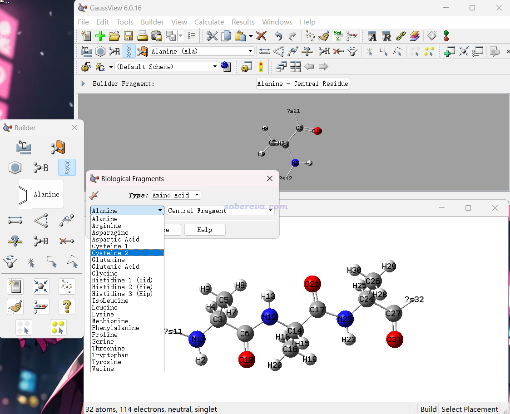
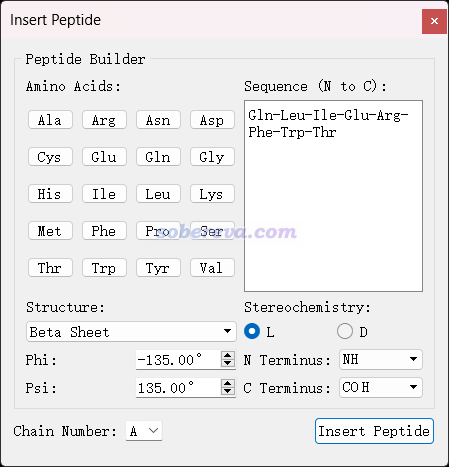
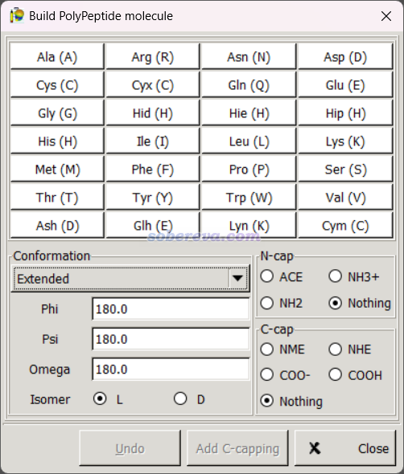

**几种基于氨基酸序列构建很简单蛋白质三维结构的工具**

Several tools for constructing three-dimensional structures of very simple proteins based on amino acid sequences

文/Sobereva@[北京科音](http://www.keinsci.com)   2023-Oct-15

经常有人问已知很简单蛋白质（小肽）的氨基酸序列，怎么得到其三维立体结构，这里就介绍几种工具。本文并不是对相关程序做完整的收集，介绍的这些已经足够满足各种实际情况的需要了。注意本文的范畴和蛋白质结构预测完全不同，那类程序是用于构造有三级结构的较复杂蛋白质用的，本文涉及的工具顶多只牵扯到二级结构。

需要注意的是，只有其中部分程序可以产生原子名符合IUPAC规范的pdb结构文件。仅对于这种情况，pdb文件才可以载入VMD后正常显示二级结构（至少得骨架重原子名满足IUPAC规范），以及能够直接被比如GROMACS的pdb2gmx所处理来产生拓扑文件。

笔者另外写了篇文章介绍通过输入序列产生DNA或RNA三维结构的工具，见《几种基于核酸序列构建三维结构的工具》（<http://sobereva.com/692>）。

## 1 ProBuilder

这是个在线程序，网址是<https://www.ddl.unimi.it/vegaol/probuilder.htm>。用户只需要输入氨基酸序列，比如RLCVVPIRLPPLRERT，并且指定要产生的二级结构的phi、psi、omega角度，就可以获得结构文件。能产生的格式很多，包括符合IUPAC命名规范的pdb文件。此程序产生的结构可以要求带和不带侧链，带侧链的情况由于不会自动做结构优化，因此侧链往往有严重重叠，后面介绍的很多程序也都是如此。

## 2 GaussView

Gaussian的官方界面程序GaussView提供了生物分子片段库，如下所示。可以选择位于链中间、N端、C端的各种氨基酸残基片段，在建模窗口点击一次出现第一个残基后，再一次一次点击肽键末端，就可以逐渐得到满足要求的肽链。

建好后可以保存成结构文件，包括pdb格式。用此程序的优点是可以自行精细修改三维结构，缺点是没法把一长串序列一下子转化为三维结构，而且这么保存的pdb文件里的原子名只是元素名而不是满足IUPAC规范的名字，里面连残基名都没有，而且也没法像ProBuilder那样直接设置对应特定二级结构的phi和psi角度（得手动一个一个调）。

## 3 Avogadro

免费的可视化程序Avogadro（<http://avogadro.cc>）的Build - Insert - Peptide界面可以构建有特定二级结构、特定序列的小肽的三维结构，界面如下所示。可以保存出许多格式，保存成pdb的话原子名和残基名都是符合IUPAC规范的。此程序还自己支持GAFF、MMFF94等力场做几何优化，可以用于把建模后侧链的不合理接触消除掉。

## 4 gabedit

启动免费的可视化程序gabedit（<http://gabedit.sourceforge.net>）后，点菜单栏的Geometry - Draw，在新窗口里点右键，选Build - PolyPeptide，就可以看到构建多肽的界面，如下所示，也可以类似于Avogadro去产生符合特定二级结构的指定序列的小肽。每点击一次氨基酸的按钮在图形窗口里就会长出来相应的残基。之后点右键选save as，就可以保存成各种格式，包括满足IUPAC原子名和残基名规范的pdb格式。

## 5 AmberTools中的leap

知名的AmberTools（<http://ambermd.org>）程序里的leap可以用于根据氨基酸序列产生线型小肽的三维结构并保存成符合IUPAC命名规范的pdb文件。

参考手册或《Amber14安装方法》（<http://sobereva.com/263>）安装AmberTools后，在命令行窗口输入诸如tleap -f leaprc.protein.ff14SB即可启动纯文本界面的leap（tleap）且同时载入AMBER14SB力场相关的氨基酸的库文件。在里面可以输入比如如下命令定义一个序列，其中残基的N结尾和C开头分别代表N端和C端残基  
TC5b = sequence { NASN LEU TYR ILE CGLN }  
之后再运行以下命令就可以把序列以三维结构保存成/sob目录下的TC5b_linear.pdb了  
savepdb TC5b /sob/TC5b_linear.pdb

## 6 PeptideBuilder

PeptideBuilder是个基于Python的轻量级构建小肽的库，网址是<https://github.com/clauswilke/PeptideBuilder>，具体介绍见原文PeerJ, 1, e80 (2013)。

在Linux下联网状态运行pip install PeptideBuilder即可安装。之后可以基于PeptideBuilder写Python脚本来构造小肽结构，可以指定psi和phi角度、有哪些残基等。此程序只产生重原子坐标，没有氢。产生的pdb文件符合IUPAC命名规范。

以下是个例子，比如保存为createQ6.py，之后运行python createQ6.py，就可以在当前目录下得到含有6个谷氨酰胺的yohane.pdb文件。

from PeptideBuilder import Geometry  
 import PeptideBuilder

geo = Geometry.geometry("Q")  
 geo.phi = -60  
 geo.psi_im1 = -40  
 structure = PeptideBuilder.initialize_res(geo)  
 for i in range(5):  
     PeptideBuilder.add_residue(structure, geo)  
 PeptideBuilder.add_terminal_OXT(structure)

import Bio.PDB

out = Bio.PDB.PDBIO()  
 out.set_structure(structure)  
 out.save("yohane.pdb")

有人基于PeptideBuilder做了扩展写了额外Python程序，能生成具有指定序列在N端加上Fmoc或ACE（乙酰）封闭、在C端加上NME（甲胺基）封闭的pdb文件。见《生成任意序列的封端短肽pdb的脚本CappedPeptideBuilder.py》（<http://bbs.keinsci.com/thread-30278-1-1.html>）。一个简单例子：先把PeptideBuilder装上，然后把CappedPeptideBuilder.py放在当前目录下，再运行python CappedPeptideBuilder.py -s KEYIN -p test，此时当前目录下就出现了test目录，其中ACE_KEYIN.pdb就是N端加了乙酰、C端加了甲氨基的序列为KEYIN的小肽结构了（没有氢）。

## 7 Tinker

动力学模拟程序Tinker有根据序列建立蛋白质三维结构的命令protein，参见计算化学公社论坛的帖子：<http://bbs.keinsci.com/forum.php?mod=redirect&goto=findpost&ptid=11478&pid=79011&fromuid=1>
