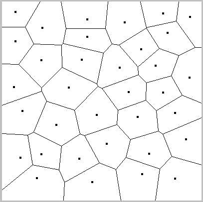
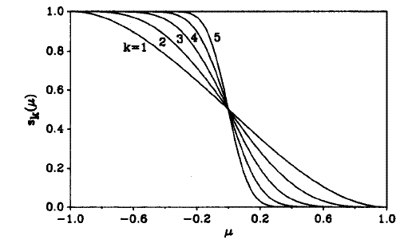
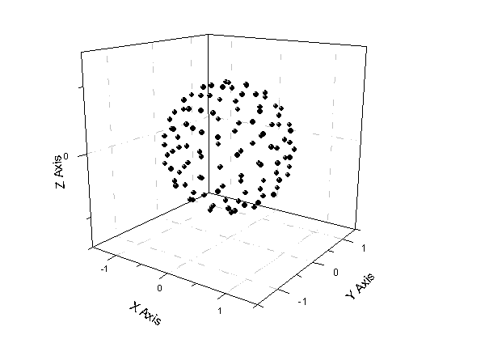
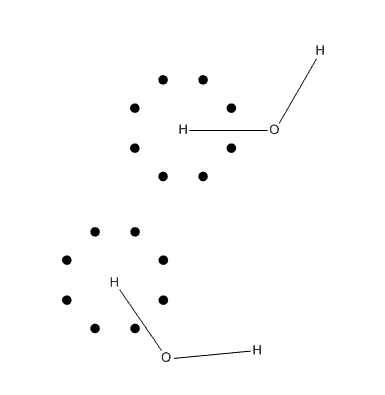

**密度泛函计算中的格点积分方法**  
Grid-based integration method in density functional calculations

文/Sobereva @[北京科音](http://www.keinsci.com/)  
First release: 2010-Sep-3  Last Update: 2011-Aug-23

本文主要介绍密度泛函计算方法中的一个重要部分--格点积分方法，并给出具体的Fortran代码，同时讨论与之相关的问题。

## 1. 简介

在密度泛函(DFT)计算中，在计算交换相关能时，需要做这样一个积分Exc[ρ]=∫ε(ρ(r))dr，积分是对全空间进行的。在Hartree-Fock计算中涉及的单、双电子积分都是通过复杂推导，使积分充分简化，再进行精确数值积分。而Exc[ρ]这个积分不得不直接求解，以容忍一定的积分误差和效率的降低为代价。这一方面是由于ε(r)的函数形式往往十分复杂，难于通过推导简化；另一方面是交换相关泛函种类太多，目前就有百余种，如果使用一个通用的积分方法，以后新的交换相关泛函就能容易地加入程序中。另外，这个积分在其它计算中也常用到，比如电子的熵也可视为ρ(r)的泛函，获得它要计算S[ρ]=∫(ρ(r)/N)Ln(ρ(r)/N)dr，其中N是体系总电子数。这类积分不仅理论意义重要，在实际中也明显影响DFT计算的速度，有不少文章对其计算方法进行了研究，试图寻找又快又准的方法，目前用得最多的方法就是本文要介绍的格点积分方法。

后文内容涉及数值积分的知识，若不了解，建议先看看数值方法书的插值求积方法部分，高斯积分在本文末的附录进行了介绍和讨论。

## 2. 积分的转化

对这个积分，Becke在1988年提出了一种很好的解决办法[JCP 88,2547]，也是本文主要介绍的。后来又有人做过诸多改进以提高效率，但是基本原理没有改变。在更早之前虽然也有人对求解这类积分做过研究，比如AIM分析中的一些积分原子盆内函数值的算法，但用在DFT计算中效率都太低。

如何更有效率地积分一个函数，要分析函数本身的特点。交换相关泛函的行为主要决定于ρ(r)的行为，例如形式最简单的交换泛函就是Slater提出的，被积函数为ρ(r)^(4/3)。为了简便，下面直接将ρ(r)作为被积函数来讨论。孤立原子电子密度在原子核处存在cusp，在核附近也很大，随着与原子核距离的增加近似呈指数衰减。在形成分子后，虽然电子密度发生了变形，但仍然可以用孤立原子电子密度的叠加来近似表达。即是说，虽然积分是全空间的，三个维度积分范围从负无穷到正无穷，但原子附近的区域需要更高的积分精度，所以直接使用笛卡尔坐标积分是很不明智的，最佳方法是以原子核为中心通过球极坐标积分，使原子附近有较高的积分格点密度，使更重要区域被更准确地积分。

当然，直接对每个中心进行球极坐标积分会使积分区间重复。最容易想到的解决办法是将分子空间划分为一个个原子空间，逐个积分再加和，于是可以将∫F(ρ(r))dr写为∑[i]∫W_i(r)*F(ρ(r))dr，W_i(r)决定了哪些区域属于第i个原子。划分的标准并不唯一，最简单的是通过Voronoi多面体方式划分，二维情况如下图所示：

在每两个原子间做中垂面，围出来的一个个多面体就是原子的空间。当然，垂面的位置也可以根据原子半径进行一定调整。对于这种离散的划分方法，在积分第i个中心时：  
W_i(r)=1  当r处于i原子空间内  
W_i(r)=0  当r处于i原子空间外

但是这种离散的划分在实际计算中有所不妥，因为下一节介绍的单中心积分最适合光滑、连续的函数，而这种划分得出的被积函数W_i(r)*F(ρ(r))在被截处呈阶梯状，不满足这个条件，所以积分并不准确。Becke提出的是模糊的划分方法。首先考虑双原子情况，编号一个为a一个为b，以a为参考原子，定义μ(a,b)=(r_a-r_b)/R(a,b)，其中r_a、r_b分别为空间某点到a、b原子核的距离，R(a,b)是a,b原子核间距离。所有μ(a,b)=0的点，即所有r_a=r_b的点，构成了a,b原子间中垂面，在a原子这半边-1<=μ<0，在b原子这半边0<μ<=1。如果以r处的μ(a,b)是否大于0作为W_a(r)等于0或1的判据，则又回归到离散的划分。

若使离散的划分变为模糊的划分，也就是允许原子空间之间可以有交叠，但保证∑[i]W_i(r)=1，就有可能让被积函数平滑，使积分精度增加。现在定义一个函数p(μ)=1.5*μ-0.5*μ^3，然后定义s(μ)=0.5*(1-p(μ))，s(μ)的图形如下图k=1的曲线所示。如果对p(μ)先进行迭代再代入s(μ)，比如说迭代两次，就得到s(μ)=0.5*(1-p(p(p(μ))))，其函数图形就是下图的k=3，每迭代一次k就增加1。从图可见，迭代次数越多图形在μ=0处变化越陡，或者说越不光滑。当k=∞时就还原为了前面提到的离散划分。所以，选取一个不很大的k值（Becke建议用k=3），将相应的s(μ)作为W(μ)就使得空间被模糊地划分了，在参考中心处格点权重为1，延伸到相邻原子处格点权重为0，在二者之间权重函数平滑过渡。由于F(ρ(r))和W_i(r)都是光滑的，所以在单中心积分时的被积函数W_i(r)*F(ρ(r))也是光滑的，能够容易地被较精确地积分。

对多原子情况，某个位置上第i个原子的实际权重等于在此处原子i与所有其它原子j之间权重的乘积，即W_i(r)=∏[i/=j]s(μ(i,j))，注意μ(i,j)是r的函数。所以当某原子被其它原子包围时，只有它附近一定区域内其权重数值比较大，离它越远处属于它的成分就越小。如果s(μ(i,j))使用的是前面离散划分的话，即μ(i,j)小于0和大于0时s分别为1和0，则W_i(r)=1的区域就是第i个原子的Voronoi胞腔。空间的模糊划分方法并不仅有Becke提出的这一种，例如Hirshfeld划分也是比较著名的[TCA 44,129]，并且有明确的物理意义，原本用在计算Hirshfeld电荷上，笔者认为也完全可以用于密度泛函积分当中，但目前未见报道。

最后，为了满足∑[i]W_i(r)=1条件，还需要做归一化：W_i(r)=W_i(r)/∑[j]W_j(r)，这样就获得了最终的W_i。

## 3. 单中心球极坐标的积分

### 3.1 简介

此节讨论怎么求单中心球极坐标积分∫W_i(r)*F(ρ(r))dr，为了省事，简写为∫f(r)dr。为避免混淆，本文中大写的W_i是指的空间划分时的权重系数，小写的w_i是指的单中心积分时的权重系数。

在球极坐标下，此积分写为：  
∫[0,2π]∫[0,π]∫[0,∞) f(r)*r^2*sinθdθdφdr  其中R是径向坐标  
选取适当的正交多项式，对被积函数进行变换，做三重高斯积分就能得到结果。将f(r)*R^2*sinθ简写为q(r)，则实际计算时的形式为：∑A_k∑A_j∑A_i*q(r_i,j,k)，其中A_i、A_j、A_k代表积分径向、θ部分、φ部分时的积分节点的权重系数，r_i,j,k代表相应的求积节点的位置。在实际计算中，事先把三个积分分量的权重系数乘在一起成为A_i,j,k并保存在一个数组里，比如叫weight；然后将相应的求积节点位置由球极坐标转换为笛卡尔坐标：  
x=R*sinθ*cosφ  
y=R*sinθ*sinφ  
z=R*cosθ  
并保存在数组里，比如叫coord。积分就成了∑[n]weight(n)*coord(n)，计算十分简单。这两个数组的大小就是三个积分方向的积分节点数的乘积，比如φ用32个点，θ用16个点（因为积分范围比φ小一倍，所以一半的点数），R用75个点，则总共要算16*32*75=38400个点。

然而这样将θ和φ部分独立积分的效率并不高。实际上对于单位球面积分有不少人专门做了研究，若不将θ和φ分离，而是一起考虑，可以用更少的点达到相同的积分精度。所以只需要把原积分变量r分离为径向和角度两部分即可，即∫f(r)dr=∫dR∫dΩ f(r)*R^2。下面具体来看如何积分角度部分，积分通式为∫q(Ω)dΩ。

### 3.2 角度部分积分

积分单位球面（半径R=1）目前用得最普遍的是Lebedev提出的方法，也是将∫q(Ω)dΩ转化成积分节点和权重的乘积，即∑[i]A_i*q(r_i)。Lebedev在一系列文章中陆续给出了能精确积分越来越高阶球谐函数的积分节点和权重，随着积分精度增加积分节点数也随之增加，从最小的可精确积分l=3的球谐函数的6个节点，到最多的可精确积分l=131的球谐函数的5810个节点，可根据对精度的要求从中选择合适的节点数。Lebedev系列的节点位置和权重都具有反演和八面体旋转不变性的特点。

有位活雷锋写了个Lebedev-Laikov.F发布到了CCL上供大家使用，其中的子程序用于生成Lebedev积分节点坐标和权重系数，见：<http://www.ccl.net/cca/software/SOURCES/FORTRAN/Lebedev-Laikov-Grids/>  
在Lebedev-Laikov.F中，生成节点的子程序名字都以LD开头，后面接着生成的点数，比如LD0170生成170个点，LD5294生成5294个点。对称唯一部分的节点的信息是以列表方式储存的，然后会通过GEN_OH子程序生成对称部分的点。下面是生成110个Lebedev节点信息的示例程序：  
program ltwd  
integer,parameter :: num=110  
real*8,dimension(num) :: x,y,z,w  
call LD0110(X,Y,Z,W,N)  //传入容量与节点数相同的一维数组接收结果。最后一个参数没什么用，随便传进一个整数即可，返回值就是生成的节点数。  
do i=1,num  
 write(1,"(4f15.10)") x(i),y(i),z(i),w(i)  
end do  
end  
运行之后节点信息会保存在当前路径下fort.1中。作散点图，如下所示

所有点的距离与原点都为1。权重系数已归一化，即sum(w)=1，也因此最后的结果要乘以4π。因为若被积函数是常数1，即每个积分节点函数值为1，乘上权重加和值为1，但实际值是4π（半径为1的球面表面积为4π）。

用Lebedev格点积分球面虽然比分别积分φ和θ部分效率更高，但也有一点点缺点，即可选的积分节点数目是离散的，比如要么取350个点，要么取434个点，没法取350至434之间的值；而且节点数有上限，Lebedev-Laikov.F里最多只有5810个点的情况，再多就没办法了。而φ和θ独立积分时节点数设定是很随意的，且积分节点和权重可以很容易地自行算出。在一些量子化学程序里角度部分积分同时支持这两种情况，比如Gaussian里自定义格点通过int=grid=mmmnnn指定，mmm指的是径向节点数，nnn是角度积分的Lebedev节点数（最多974个），如75434代表共75*434=32550个点。如果写的是-mmmnnn，则nnn指的是θ的点数，φ的点数为2*nnn，如-96032代表共96*32*64=196608个点。

### 3.3 径向部分积分

接下来具体介绍下径向部分的积分，也就是求∫q(R)*R^2 dR，区间为[0,∞)。径向部分的积分的方法很多，也被不同程序所采纳（据悉Gaussian用的是Euler-Maclaurin积分），多数是基于高斯积分，可参看JCC 24,732。在使用不同正交多项式做高斯积分时需要对被积函数做不同变换，但用哪种高斯积分更准确难有定论，在不同情况下精度相对高低并不一定。Becke最初用的是第二类Chebyshev多项式做高斯积分，这种径向积分方法用在实际计算中即便不是最好，但至少也不错，下面将具体介绍。

从本文附录中看到，用第二类Gauss-Chebyshev积分时权重函数应当为(1-x^2)^0.5，被积区间应该为[-1,1]，然而这与当前要积分的函数形式和区间都不符。所以需要变换，x∈[-1,1]与R∈[0,∞)之间可以用这个式子转化：R=(1+x)/(1-x)*P，其中P是某个常数，也可以先把它当成1，在后文才会涉及。

将R=(1+x)/(1-x)*P代入∫q(R)*R^2 dR, [0,∞)，因dR=2*P/(1-x)^2*dx，故  
原式=∫2*P^3*(1+x)^2/(1-x)^4*q(R)dx, [-1,1]。现在还没有积分时需要的权重函数(1-x^2)^0.5，但可以变换出来，式中的(1+x)^2/(1-x)^4=(1+x)^1.5/(1-x)^4.5*(1+x)^0.5*(1-x)^0.5=(1+x)^1.5/(1-x)^4.5*(1-x^2)^0.5，故  
原式=∫2*P^3*(1+x)^1.5/(1-x)^4.5*q(R) *(1-x^2)^0.5 dx, [-1,1]  
由于(1-x^2)^0.5是权重函数，所以实际被积函数就是2*P^3*(1+x)^1.5/(1-x)^4.5*q(R)。将积分节点x_i代入式子并乘上相应根的权重系数w_i加和即可，即  
原式=∑[i]2*P^3*(1+x_i)^1.5/(1-x_i)^4.5*q(R_i)*w_i，其中R_i=(1+x_i)/(1-x_i)*P  
n阶（即n个根）第二类Chebyshev多项式的每个根（即积分节点）x_i=cos(i*π/(n+1))，权重系数w_i=π/(n+1)*sin(i*π/(n+1))^2。

为了计算时方便，上式可再转化一下。由于1-x_i^2=1-cos(i*π/(n+1))^2=sin(i*π/(n+1))^2，所以w_i=π/(n+1)*(1-x_i^2)=π/(n+1)*(1+x_i)*(1-x_i)，代入原式，成为：  
∑[i]2*π/(n+1)*P^3*(1+x_i)^2.5/(1-x_i)^3.5*q(R_i)  
可以将q(R_i)前面的这一串一起作为权重系数，所以最终  
∫q(R)*R^2 dR=∑[i]w_i*q(R_i)，其中  
w_i=2*π/(n+1)*P^3*(1+x_i)^2.5/(1-x_i)^3.5  
R_i=(1+x_i)/(1-x_i)*P  
x_i=cos(i*π/(n+1))  
推导完毕。

## 4. 积分格点的调整

通过对积分格点进行调整，能使积分更有效率。

由于不同元素的原子半径不同，格点分布应当做相应调整。在R_i=(1+x_i)/(1-x_i)*P式子中，可见P为第二类Gauss-Chebyshev积分在积分区间中点(x=0)处R的值，Becke认为P应当设为原子共价半径的一半（对于氢，只设为原子共价半径），这样原子共价半径越大，径向格点分布将越往外延展，可以更好涵盖电子密度较大的区域。

s(μ)函数在自变量等于0，即两原子中垂面处为0.5，这个中垂面位置也应当根据原子共价半径做适当调整。为此，Becke将s(μ(i,j))的自变量替换为ν(i,j)，它与μ(i,j)的关系为：ν(i,j)=μ(i,j)+a(i,j)*(1-μ(i,j)^2)。目的就是找一个a(i,j)，当r_i/r_j=R_i:R_j=χ(i,j)时ν(i,j)恰为0，其中R_i和R_j为i,j原子共价半径。为此，先令ν(i,j)=0，则a(i,j)=μ(i,j)/(μ(i,j)^2-1)，在r_i/r_j=R_i:R_j时，μ(i,j)=(r_i-r_j)/R(i,j)=(r_i-r_j)/(r_i+r_j)=(χ(i,j)-1)/(χ(i,j)+1)，因此a(i,j)就确定了。推导中假设格点在i,j轴线上，所以R(i,j)=r_i+r_j。当a(i,j)小于-1/2和大于1/2时直接分别设为-1/2和1/2。笔者发现，若将所有原子设成具有相同数目的径向和角度格点，则做上述调整只会令积分精度下降，只有如下对不同原子用不同格点数目时上述调整才会提高积分精度。Becke用的是Bragg-Slater共价半径，但其中氢的半径为0.25埃，用于调整格点时显得有些过小，为得到更好结果，Becke将之改为0.35埃。

对于主量子数小的原子，可以用更少的径向格点以提高计算速度。经笔者实践，对n=1的原子用35个径向格点，每增加一个壳层增加15个格点比较合适。由于在内侧的原子周围电子密度变化比处于边缘的原子更为复杂，所以应当用更多的格点积分角度部分，边缘原子使用230个Lebedev节点、内侧原子使用434个Lebedev节点比较合适，同时内侧原子也最好增加15个径向格点。这样设定已经有很高的积分精度了，如果要求更高，可以再提高格点数目。

经过上述步骤生成的格点还可以进行裁剪(grid pruning)，在确保积分精度不明显下降的情况下合理地去掉一部分格点可以节省计算时间。裁剪方法很多，例如径向节点会有一部分点距离中心非常远，虽然这些点权重很大，但是函数数值极小，对结果的贡献微乎其微，若将距离积分中心超过10 bohr的格点一律忽略（也可以根据原子半径来调整此标准），一般能节省1/5的计算量，至少对于第三周期及以下的原子的结果几乎没有影响。再比如，离原子核较近的内层电子受分子环境影响小，所以离原子近的ρ(r)比中等距离处的ρ(r)更接近球对称分布、变化得更平滑，所以可以对内侧区域用更少的格点做角度部分积分。在Gaussian程序中的fine格点是每个原子径向部分用75个点，角度部分最多302个点做积分，原本共22650个点，经过自动裁剪后只剩约7000多个点，仅是之前的1/3。

如何调整、裁剪格点任意性比较强，因此有人提出了标准化的格点设定方法，例如SG-1、SG-0格点。使用这些格点时，角度、径向积分方法是指定的，每种元素的所用格点设定也是事先优化好的，在相同数目格点下用这样的标准格点一般能得到比随意地调整、裁剪更好的积分效果。例如使用SG-1格点设定时，径向应使用Euler-Maclaurin积分，角度应使用Lebedev积分，所有原子径向都是50个点，角度部分格点数取决于格点的径向坐标，离被积中心从近到远角度格点数分为6、38、86、194、86五个部分，分界位置取决于原子所在周期（在原文中有列表，通过考察对能量的影响获得）。无论原子的元素类型、在内侧或者在边缘，每个原子都是大约3700个点，不做任何额外的格点调整与裁剪。SG-1格点结果十分接近更昂贵的径向50、角度194格点的结果，对中等体系误差一般低于0.0003 a.u.，当然现在来看SG-1格点积分精度不高，但由于计算量小，计算大体系是合适的。后来提出的SG-0格点中径向积分改成了更好的MultiExp方法，角度格点数分界设定被更加细化，每个原子仅有约1500个点，虽然精度只是SG-1的一半，但是计算速度也快了一倍，对于诸如生物大分子体系的预计算是很合适的。

如果被积函数的行为比较有特点，最好根据其特点调整格点设定，上文已隐含地体现了这一点，比如拉普拉斯值函数由于在原子核附近剧烈波动，相对于径向变化相对平滑的ρ(r)，用更多的径向格点往往能使结果改进得更多。

## 5. 积分代码

这个子程序是笔者的Multiwfn程序中的一部分，出于本文的目的做了一定简化，是上述算法的具体实现，用来积分一个体系的ρ(r)，由此可以更清楚地了解计算流程。此程序用到了一些外部变量和子程序，在注释中已说明。

subroutine intfunc  
use function !引用外部变量与函数  
use util  
implicit real*8 (a-h,o-z)  
real*8,allocatable :: potx(:),poty(:),potz(:),potw(:) !接收Lebedev格点位置和权重的数组  
type(content),allocatable :: gridatm(:)  !content类型在别处定义的，包含x,y,z,value四个元素，都是real*8。gridatm储存格点位置和权重  
real*8 smat(ncenter,ncenter),Pvec(ncenter) !ncenter是总原子数。smat储存s(ν(i,j))，Pvec储存归一化前的w_i(r)  
integer :: bondmat(ncenter,ncenter) !成键矩阵记录两个原子间是否成键，成键为1，不成键为0

maxsph=434 !假设角度部分最多有434个格点  
maxrad=80 !假设径向最多有80个格点  
allocate(potx(maxsph),poty(maxsph),potz(maxsph),potw(maxsph),gridatm(maxrad*maxsph))

!生成成键矩阵，原子成键数超过1就说明是内部原子，要用更多格点。  
bondmat=0  
do i=1,ncenter  
 do j=i+1,ncenter  
  ! distmat是已算好的距离矩阵。covr第n个元素是周期表中原子序数为n的共价半径。这里用的共价半径来自Dalton Trans. 2008,2832。a(i)%index是第i个原子的原子序数。  
  if ( distmat(i,j) < 1.15D0*(covr(a(i)%index)+covr(a(j)%index)) ) bondmat(i,j)=1  
 end do  
end do  
bondmat=bondmat+transpose(bondmat) !成键矩阵是对称的

rintval=0 !这是将被累加的变量，由于储存最终的积分值  
covr(1)=0.35D0/b2a !对氢原子用0.35埃的共价半径。由于covr记录的是以波尔为单位，用b2a=0.529177249转换单位。  
call cpu_time(time_begin) !用于计算总耗时，便于研究积分格点设置与计算精度的关系。

do iatm=1,ncenter !循环每个原子  
 write(*,"(' Processing center',i6,'(',a2')')") iatm,a(iatm)%name !a(iatm)%name是被积分的原子的元素名  
 if (a(iatm)%index<=2) then  
  radpot=35 !设定径向格点数。radpot是外部定义的整数变量。  
 else if (a(iatm)%index<=10) then  
  radpot=50  
 else  
  radpot=65  
 end if  
 if (sum(bondmat(iatm,:))==1) then !判断此原子是在内侧还是边缘  
  sphpot=230 !设定角度部分格点数。sphpot是外部定义的整数变量。  
 else  
  sphpot=434 !内侧的原子更多的径向和角度格点  
  radpot=radpot+15  
 end if  
 if (sphpot==230) call LD0230(potx,poty,potz,potw,isphnum) !生成以0,0,0为原点，在半径为1的球面上分布的Lebedev格点坐标。  
 if (sphpot==434) call LD0434(potx,poty,potz,potw,isphnum)

 iradcut=0 !径向格点与参考中心的距离随径向格点序号增加而递减，径向格点中序号在iradcut及之前的点将被扔掉以节省时间。  
 parm=covr(a(iatm)%index)/2 !parm指的是前文(1+x_i)/(1-x_i)*P中的P  
 if (a(iatm)%index==1) parm=covr(a(iatm)%index) !对氢原子半径不除以2  
 do i=1,radpot !循环每一径向壳层。将第二类Gauss-Chebyshev积分的权重和Lebedev角度积分的权重组合。并生成每个点的笛卡尔坐标。  
  radx=cos(i*pi/(radpot+1)) !生成radpot阶第二类Chebyshev多项式的每个根，即前文的x_i。pi是外部定义的π的数值  
  radr=(1+radx)/(1-radx)*parm !由x_i生成R_i，也就是径向积分的节点  
  radw=2*pi/(radpot+1)*parm**3 *(1+radx)**2.5D0/(1-radx)**3.5D0 *4*pi !径向积分的权重系数，顺便把球面积分时要乘的4*π也乘了进去。  
  gridatm( (i-1)*sphpot+1:i*sphpot )%x=radr*potx !一次设定一层节点的坐标和权重。径向坐标radr乘上以0,0,0为原点的单位球面上的Lebedev点的笛卡尔坐标，得到的就是在半径为radr的球面上的Lebedev点的笛卡尔坐标。  
  gridatm( (i-1)*sphpot+1:i*sphpot )%y=radr*poty  
  gridatm( (i-1)*sphpot+1:i*sphpot )%z=radr*potz  
  gridatm( (i-1)*sphpot+1:i*sphpot )%value=radw*potw !将径向和角度部分的权重函数组合。  
  if (iradcut==0.and.radr<10) iradcut=i-1 !大于radr的R_i将被截掉，记录在编号为何值时截断  
 end do

 !当前积分节点是以0,0,0为中心，下面将中心转移到被积原子上  
 gridatm%x=gridatm%x+a(iatm)%x  
 gridatm%y=gridatm%y+a(iatm)%y  
 gridatm%z=gridatm%z+a(iatm)%z  
 do i=1+iradcut*sphpot,radpot*sphpot !从不被截掉的节点开始循环每个节点  
  rnowx=gridatm(i)%x !为了写的时候方便，改用rnowx,rnowy,rnowz表示  
  rnowy=gridatm(i)%y  
  rnowz=gridatm(i)%z  
  rfuncval=fdens(rnowx,rnowy,rnowz) !fdens是外部函数，计算此点的被积函数值，这里就是指ρ(r)。

  !计算这个格点的空间划分权重W_i  
  smat=1.0D0  
  do ii=1,ncenter !为计算所有的s(ν(i,j))，循环每一对儿原子  
   ri=dsqrt( (rnowx-a(ii)%x)**2+(rnowy-a(ii)%y)**2+(rnowz-a(ii)%z)**2 ) !计算r_i  
   do jj=1,ncenter  
    if (ii==jj) cycle !s矩阵对角元没用，不重新赋值，值仍为1。  
    rj=dsqrt( (rnowx-a(jj)%x)**2+(rnowy-a(jj)%y)**2+(rnowz-a(jj)%z)**2 ) !计算r_j  
    rmiu=(ri-rj)/distmat(ii,jj) !计算μ(i,j)

    !根据原子半径调整原子空间划分，也就是将μ(i,j)转化为ν(i,j)  
    chi=covr(a(ii)%index)/covr(a(jj)%index) !计算χ(i,j)  
    uij=(chi-1)/(chi+1)  
    aij=uij/(uij**2-1)  
    if (aij>0.5D0) aij=0.5D0  
    if (aij<-0.5D0) aij=-0.5D0  
    rmiu=rmiu+aij*(1-rmiu**2) !此时的rmiu就是ν(i,j)

    tmps=1.5D0*(rmiu)-0.5D0*(rmiu)**3 !做三次迭代  
    tmps=1.5D0*(tmps)-0.5D0*(tmps)**3  
    tmps=1.5D0*(tmps)-0.5D0*(tmps)**3  
    smat(ii,jj)=0.5D0*(1-tmps) !得到s(ν(i,j))=0.5(1-p(p(p(ν(i,j)))))  
   end do  
  end do   
  Pvec=1.0D0  
  do ii=1,ncenter !计算W_i(r)=∏[i/=j]s(μ_i,j)。注意因为现在smat对角元为1，乘它等于没乘  
   Pvec=Pvec*smat(:,ii)  
  end do  
  weight=Pvec(iatm)/sum(Pvec) !做归一化，得到最终的W_i(r)  
  rintval=rintval+rfuncval*weight*gridatm(i)%value !原子空间划分权重weight和单中心积分权重gridatm(i)%value之积就是此点的总权重。总权重乘上此点被积函数值，对所有中心的所有节点累加，最终得到的就是积分结果。  
 end do  
end do

!显示用时和最终结果  
call cpu_time(time_end)  
write(*,"(' Totally evaluated',i10,' points',' took',f8.2,' seconds')")  icount,time_end-time_begin  
write(*,*)  
write(*,"(' Final result:',f20.10)") rintval  
end subroutine

以3-21G下计算的一氟乙烷为例，积分电子密度期望值为26，实际积分值为26.0000073079，还是很准确的。在Multiwfn里也可以积分拉普拉斯函数，期望值为0，此体系中积分值为-0.0006034985，也还是不错的。若将所有原子都用径向75、角度770个点，积分电子密度结果为25.9999996466，积分拉普拉斯值函数结果为-0.0000250146，精度都提高了一位，但速度也慢了，要计算的点数从92130增加到了211792。注意由于Multiwfn读入的.wfn文件有效数字只有7、8位，与期望值的偏差很大程度是由于输入精度不够高造成。为了代码简洁易懂，上面代码的格点设定没有做充分的优化，大家可尝试对不同径向壳层使用不同数目的角度格点以增加积分效率。

在KS-DFT计算中为了获得KS算符矩阵元，需要算这样一个积分：V_i,j=∫η_i(r)*V(r)*η_j(r)dr，其中V(r)是交换相关势，η_i是i个基函数。积分方法与前述完全一样，只不过是将被积函数由ε(ρ(r))改成η_i(r)*V(r)*η_j(r)而已。由于矩阵元很多，这个积分也要算很多次，会很慢。但可以事先把V(r)和各个η_i(r)在积分格点上的值存起来，算不同的矩阵元的时候调用相应的已算好的值即可，速度就很快了。

## 6. 格点积分方法的一些问题

由于交换相关泛函的形式复杂，有限格点数目的格点积分不是完全精确的积分，随之带来一些问题需要注意。

因为分子的朝向是任意的（没有固定方向外场等外部因素时），所以在任何朝向下量子化学方法都应当给出完全相同的结果，称为旋转不变性。然而积分格点方法并不能完全满足这一点，尤其是在较糙的格点下，旋转不变性明显被破坏。旋转依赖性大本质上也体现了积分精度差。在径向20个、角度50个格点下，有人计算HOOF分子，某种方式旋转前后结果相差达0.001 a.u.，而一般单点计算要求收敛到0.00005 a.u.，虽然SCF收敛了，但能量的计算精度实际上根本没达到要求。

造成旋转依赖性的原因可以从下图考察，这是一个水分子体系，假设空间是二维，黑点代表积分氢原子时的一个壳层上的角度积分格点，格点十分粗糙。图中下半部分的情况相对于上半部分虽然分子转动了，但是积分格点分布并没变，没有随着分子转动而转动（不过格点的中心总在原子核上），因而相当于被积函数改变了，由于积分不是完全精确的，这层球面积分在旋转前后结果是不一样的，也因此总能量是不同的。在大体系下，由于积分次数增加，误差可能会累积，使能量的旋转依赖性从绝对值上看更显著。

虽然在量子化学程序中一般都会自动令分子处于标准朝向，也即一个分子只有一个朝向，看似没有了旋转不变性问题，但实际上只是掩耳盗铃罢了，标准朝向本质上也是任意的，积分精度太低的问题仍存在着。由于积分节点越多，积分越准，所以可以通过用更精细的格点来减轻旋转依赖性的问题。在一般量子化学程序默认的格点设置下，旋转依赖性很小，可以忽略，积分精度也能满足一般要求。但是如果要求计算精度较高，不仅要把SCF收敛限设得更严，也要用更多的积分格点，否则根本达不到目的。

在频率计算时也要注意积分格点的影响。如果对应于整体转动模式的频率不很接近于0（比如超过20/cm），则表明算出来的分子内振动的频率与真实的能量极小点处的相应振动频率偏差不小。对于非DFT计算，可以通过设严结构优化的收敛限来解决，在Gaussian中使用opt=tight一般就可以了。然而在DFT下优化并计算频率，除了设严优化收敛限外还需要使用更精细的积分格点，一方面能使优化出的结构更为正确，另一方面也使能量的二阶导数更为准确，得到的整体转动模式的频率将明显下降，一些微小的虚频也能够消除。若使用更紧的优化收敛标准时不搭配更精细的积分格点，结果可能更糟，在Gaussian中，opt=tight建议结合int=ultrafine，opt=verytight建议结合int=grid=199974。

积分精度和实际体系、被积函数是有很大关系的。用一套积分格点设定积分一个体系的某种函数能精确到比如小数点后6位，绝不意味积分另一个体系另一套函数就能达到这个精度。在积分一个新函数时，期望值一般无法事先知晓，也不知道积分能精确到什么程度，此时可以逐渐提高格点数，分析结果收敛情况，看至少用多少格点时结果与使用十分精细格点时结果之差已经小到可以接受的程度。有人担心在用一个新的交换相关泛函时是否应当提高积分格点数目，这样的担心不无道理，但不同交换相关泛函之间行为的差异绝不至于积分到相同精度时需要的积分格点数目会相差几倍的程度，一般都用相同的格点设置即可，当然谨慎一些的话也可以去分析随格点数目增加的收敛性。也有人指出Meta-GGA类型的泛函（比如M05-2X）由于其中引入了动能密度，导致对积分格点比GGA泛函更为敏感，用这类泛函时可以使用大一些的格点精度。

某种积分格点+积分方法的结果的误差有一定的系统成分，比如离核较近区域的积分误差。虽然粗糙积分的误差会比较大，但是在求差的时候可以抵消掉一部分，使化学上感兴趣的相对值并不那么差。所以，在格点不够精细时，在比较不同体系能量差的时候应当使用相同积分格点下的结果；另外在这种情况下即便是对相同体系，在不同程序中由于积分格点的设定和积分方法的不同，算出来的结果也可能有一定差异，故应当用相同程序算出的结果相对比。另：因此比较不同程序计算相同问题的结果差异时不要用DFT的结果相比较（一般HF计算结果都是一致的），除所用非格点精度很高，免得把格点设定的差异对结果的影响掺进去。

## 附录：高斯积分

一个普通的积分I=∫[a,b]w(x)f(x)dx可近似成∑[i=1,n]A(i)f(x(i))，高斯积分的目的是仅使用n个节点，就能完全精确积分能够展开为最高阶为2n-1的x的多项式的被积函数f(x)。w(x)是权重函数。

设P(x)为某n阶多项式，可以将f(x)以某种方式写成这种形式：f(x)=q(x)P(x)+r(x)。由于f(x)是2n-1阶多项式，所以q(x)和r(x)的阶数显然小于等于n-1。此积分等价于I=∫[a,b]w(x)q(x)P(x)dx+∫[a,b]w(x)r(x)dx。若P(x)选用的是在[a,b]范围内带权w(x)的正交多项式（即此条件下对任何小于其阶数的多项式正交），则∫[a,b]w(x)q(x)P(x)dx=0。这样消了I的第一项就成了I=∫[a,b]w(x)r(x)dx。

由于r是小于等于n-1阶的多项式，故这个积分一定能用n个点精确计算，即I=∫[a,b]w(x)r(x)dx=∑[i=1,n]A(i)r(x(i))，其中节点{x(i)}在[a,b]内选取是任意的，计算相应处的r(x)值，然后再根据现成公式算相应的A(i)即可。但是r(x)却是未知的，如果将节点选为P(x)在[a,b]内的n个根（根据正交多项式的性质可证明此区间内恰有n个根），则f(x(i))=q(x(i))P(x(i))+r(x(i))=q(x(i))*0+r(x(i))=r(x(i))，因此积分公式最终转化为I=∑[i=1,n]A(i)f(x(i))，可以直接算出结果，其中权重系数A(i)可以通过解线性方程组获得，也可以由此公式计算：A(i)=∫[a,b]w(x)R(x)^2dx/R(x(i))/P'(x(i))，其中P'(x)是P(x)的导数，R(x)是相应于P(x)的n-1阶多项式。

根据不同的权重函数和积分范围需要选用不同的正交多项式，例如积分∫(-∞,+∞)x^2*exp(-x^2)dr，若将exp(-x^2)当做权重函数，从数学手册上就能找到在(-∞,∞)范围内带权exp(-x^2)的正交多项式，即厄米多项式，此时积分就被称为高斯-厄米积分。x^2是二阶多项式，根据2n-1的规则，可知至少2个点才能准确积分（点数可以增多，但结果和两点结果一样）。厄米多项式的根x(i)和积分系数A(i)在数值方法的书里一般都会给出解析形式，并给出n=5以内的具体数值。如n=2时x(1)=-2^0.5/2，x(2)=2^0.5/2，A(1)、A(2)皆为pi^0.5/2，故此积分结果为A(1)f(x(1))+A(2)f(x(2))=pi^0.5/2*(-2^0.5/2)^2+pi^0.5/2*(2^0.5/2)^2=0.8862。仅用两个点就准确计算了积分，可见效率很高。常见的用于高斯积分的多项式还有第一类、第二类切比雪夫多项式、拉盖尔多项式、勒让德多项式、雅可比多项式，可参阅Handbook of Mathematical Functions with Formulas, Graphs, and Mathematical Tables高斯积分章节（第九版887页）。

如果被积函数表面上看找不到现成的正交多项式，可以考虑进行变换。比如积分范围在[0,+∞)内没有能用的正交多项式，但积分变量变换到[0,+1]下有合适的正交多项式，则可改变积分变量来调整积分范围。被积函数也可以变换形式，例如[-1,1]范围内积分k(x)*x可以变化为k(x)*x/(1-x^2)^0.5*(1-x^2)^0.5，其中k(x)为某一函数。这样(1-x^2)^0.5可以当做权重函数用第二类切比雪夫多项式来积分k(x)*x/(1-x^2)^0.5。同一个被积函数f(x)可以以不同方式变换为w(x)g(x)形式，然后根据w(x)选用相应正交多项式来积分，其变换方法不是唯一的，且注意变换被积变量来映射积分范围也会改变f(x)。如何变换更合理，要看哪种变换后g(x)能更接近于多项式展开形式，越接近则积分越准确。

还有一种办法是根据权重函数和积分区间自行构造对应的正交多项式，需要通过迭代关系由1阶开始一阶一阶升高地递推，直到得到要求的阶的多项式，然后算它的根和每个根的权重，这个过程比较麻烦，见Numerical Recipes 3ed P181。

如果用n个点计算积分，但函数不能用小于等于2n-1阶多项式完全精确地展开，则高斯积分并不是准确的，但一般也比n个点的梯形公式积分准确很多。高斯积分如果想靠增加节点来明显增加精度，函数应当尽量是光滑的，这样才容易近似展开成多项式的形式。随着节点数的增多，可以精确地积分由更高阶多项式组合的函数，被积函数形状就允许更复杂，即便仍不能精确展开，至少也能被更加精确地描述而使结果更好。如果函数不光滑、存在奇点则很不利，不易用多项式的组合展开，高斯积分的优点难以发挥，往往复化梯形公式的效果更好。如果被积函数整体有奇点，但是若将函数整体的一部分作为权重函数考虑时被积函数无奇点，则使用对应于权重函数的正交多项式就可以比较准确地积分。

几种常用正交多项式的权重函数和积分区间：  
Legendre: 1  [-1,1]  
Jacobi: (1-x)^a*(1+x)^b  (-1,1) 其中a,b>-1   
Chebyshev first kind: 1/(1-x^2)^0.5  (-1,1)  
Chebyshev second kind: (1-x^2)^0.5  [-1,1]  
Laguerre: exp(-x)  [0,∞)  
Hermite: exp(-x^2)  (-∞,∞)
