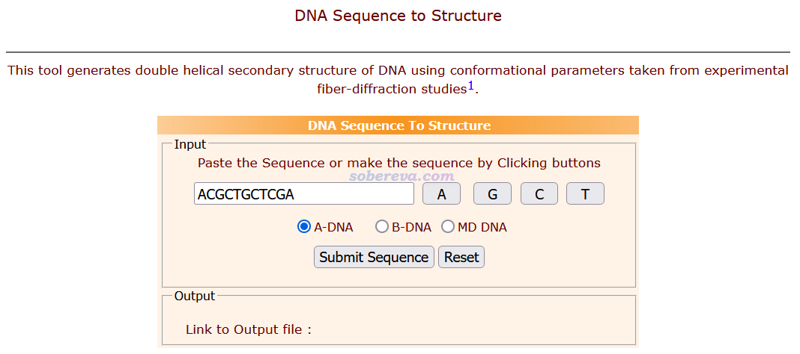
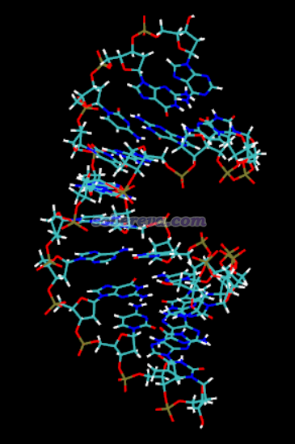
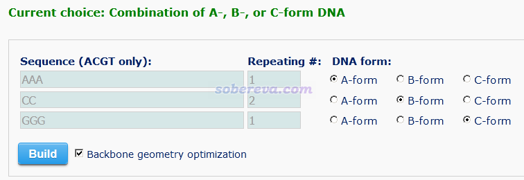
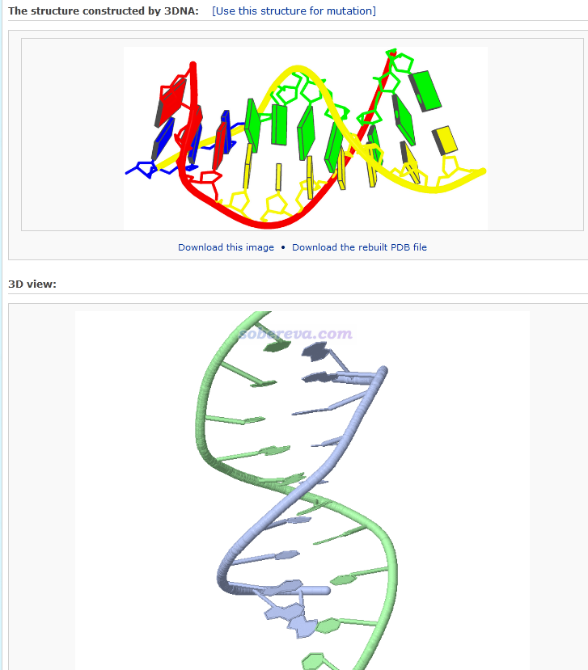
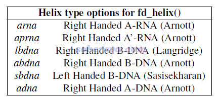
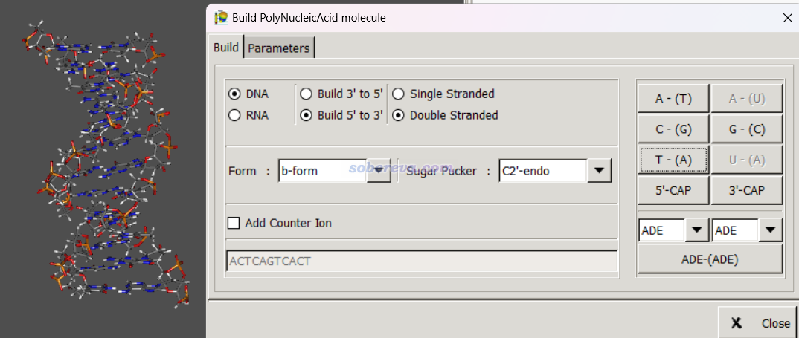
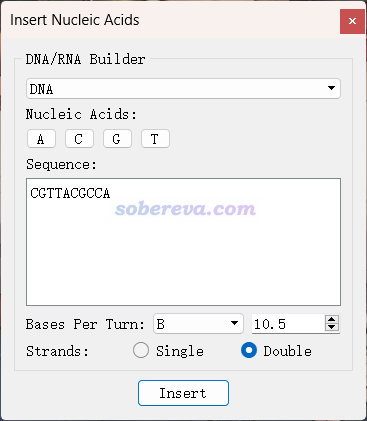

**几种基于核酸序列构建三维结构的工具**

Several tools for constructing three-dimensional structures based on nucleic acid sequences

文/Sobereva@[北京科音](http://www.keinsci.com)   2023-Dec-20

之前我在《几种基于氨基酸序列构建很简单蛋白质三维结构的工具》（<http://sobereva.com/687>）中介绍过一些基于氨基酸序列构建简单蛋白质三维结构的工具，本文将介绍几种基于核酸序列构建DNA/RNA三维结构的工具，可以用于做分子动力学模拟、分子对接等目的。虽然还有很多其它程序也可以构建，如HyperChem等，但本文提供的这些就已经足够用了，且都是免费的。这些工具在产生核酸结构时只需要指定一条链的序列，从5'端到3'端，对于产生双链结构的情况，另一条链的序列总是自动按照规范DNA中标准碱基配对方式自动确定的。这些程序都可以保存成常用的pdb文件格式，并且原子名是规范的。

### 1 在线工具DNA Sequence to Structure

地址：<http://www.scfbio-iitd.res.in/software/drugdesign/bdna.jsp>

输入DNA序列以及DNA结构类型，即可立刻返回产生的pdb结构，例如：

返回的结构用VMD查看：

### 2 在线工具web.x3dna.org

地址：<http://web.x3dna.org>

进入后，选Rebuilding - combination of A-, B-, or C-form DNA models。之后可以输入DNA序列由几段构成，比如设了3，点next，若三段内容分别按下面这样设，那么DNA序列就是AAACCCCGGG，且其中AAA部分是A-DNA形式、CCCC部分是B-DNA形式、GGG部分是C-DNA形式。

提交之后，过一会儿（有可能时间挺长），看到下图，可以点击链接下载pdb文件

### 3 AmberTools的NAB

AmberTools程序包可以在<http://ambermd.org>下载，NAB是AmberTools中的组件，AmberTools装好后NAB就可以直接用了。最简单的运行方式为nab test.nab -o test.out，这里test.nab是NAB程序的输入文件（后缀必须是nab）。NAB就像编译器一样会编译出名为test.out的可执行程序，然后运行./test.out即可使里面的指令生效。

NAB可以用于创建DNA和RNA序列。例如创建一个序列为gcgttaacgc的B-DNA结构，就创建一个文本文件比如叫genDNA.nab，里面写以下内容

molecule m;  
 m = fd_helix("abdna","gcgttaacgc","dna" );  
 putpdb( "sobDNA.pdb", m );

之后运行nab genDNA.nab -o genDNA，当前目录下就出现了名为genDNA的可执行文件。再输入./genDNA运行之，当前目录下就出现了sobDNA.pdb，是我们要的DNA的结构，DNA的骨架顺着Z轴。

从上面例子可见fd_helix函数里面跟了三个参数，第一个参数控制产生的核酸类型，第二个参数是序列，第三个参数写dna就是生成DNA、写rna就是生成RNA。

### 4 Gabedit

Gabedit是一个免费的可视化程序，可以在<http://gabedit.sourceforge.net>下载。启动后点击菜单栏Geometry - Draw，然后点右键选Build - polyNucleic Acid，之后一边点击碱基名字的按钮，三维结构一边不断产生，如下图所示。可见核酸类型和结构形式都可以自己定义。如果选上Add Counter Ion，产生的核酸结构的磷酸基旁边还会自动加上Na+作为抗衡离子。构建好后，在图形窗口上点右键选Save as，就可以选择保存成pdb格式。

### 5 Avogadro

Avogadro可视化程序可以在<http://avogadro.cc>免费下载。启动Avogadro后，点击菜单栏的Build - Insert - DNA/RNA，就蹦出了如下窗口。然后一边点击按钮输入核酸序列，一边图形窗口里就可以看到生成的核酸结构。DNA和RNA，单链和双链，结构形式都可以自由选择。

