**18碳环等电子体B6N6C6独特的芳香性：揭示碳原子桥联硼-氮对电子离域的关键影响**

The unique aromaticity of isoelectronic molecule of cyclo[18]carbon, B6N6C6: Revealing the key role of the carbon atom bridging boron and nitrogen on electron delocalization

文[/Sobereva@北京科音](http://www.keinsci.com)   2024-Jan-26

## 0 前言

由18个碳原子连接形成的环状体系18碳环（cyclo[18]carbon）具有十分特殊的几何和电子结构，自从它于2019年首次在凝聚相中被观测到后，18碳环及其衍生物就得到了化学界的广泛关注，并陆续有大量理论研究工作发表。特别是在Carbon, 165, 468-475 (2020)中，北京科音自然科学研究中心（<http://www.keinsci.com>）的卢天和江苏科技大学的刘泽玉等人证实18碳环具有明显的双pi芳香性特征，这是18碳环非常与众不同的一点。

18碳环的一种等电子体是B9N9，由B和N原子交替相连构成环状。此体系早已被研究过，被证实几乎不具备像18碳环那样的明显的芳香性。最近，卢天、刘泽玉和西班牙多诺斯蒂亚国际物理中心的Mesías Orozco-Ic发现，由6个(硼-碳-氮)重复单元依次相连构成的18碳环的另一种等电子体B6C6N6具有和18碳环很接近的芳香性。为什么在无芳香性的B9N9中掺杂进去碳原子后，或者说让碳原子桥联硼和氮后，B9N9的芳香性就能得到巨大提升？这是非常有意思的问题。于是以上研究者对B6C6N6的特征做了全面深入的理论研究，详细分析讨论了其芳香性特征和本质，成果近期在美国化学会的知名期刊Inorganic Chemistry上发表，非常推荐阅读：

Exploring the Aromaticity Differences of Isoelectronic Species of Cyclo[18]carbon (C18), B6C6N6, and B9N9: The Role of Carbon Atoms as Connecting Bridges, *Inorg. Chem.*, **62**, 19986 (2023) <https://doi.org/10.1021/acs.inorgchem.3c02675>

此研究的研究意义不仅在于讨论了B6C6N6本身，还在于揭示了碳原子桥联硼和氮原子对电子离域特征的关键性影响，这对于通过碳掺杂的方式对纯硼、氮构成的体系（如硼-氮纳米管、二维层状h-BN体系等）进行改性提供了重要启示。此研究通过强大的Multiwfn程序（<http://sobereva.com/multiwfn>）利用了各种波函数分析手段对B6C6N6进行了充分的考察并和18碳环、B9N9进行了对比，这也是充分运用波函数分析探究新颖体系的很好的范例。

下面本文就对Inorg. Chem., 62, 19986 (2023)这篇文章的主要研究思想、结论进行深入浅出的介绍，并对一些研究细节进行附加说明，以便于读者更好地理解此文，以及将此文的研究手段用于自己的研究。同作者之前还对18碳环及其衍生物的各方面特征做过充分的理论研究并得到了同行的广泛关注，成果汇总见<http://sobereva.com/carbon_ring.html>。

## 1 B6N6C6的几何结构

做B6N6C6的各方面研究之前先得得到其可靠的几何结构。18碳环及衍生物用ωB97XD/def2-TZVP级别做几何优化是很稳妥的，在Carbon, 165, 468-475 (2020)以及<http://sobereva.com/carbon_ring.html>里列举的此类体系的大量研究工作中都已经充分证明了这点。因此此文用Gaussian 16在此级别下优化了B6N6C6的结构。特别需要注意的一点是，B6N6C6基态是单重态，但是其闭壳层单重态波函数存在不稳定性，用DFT计算时需要作为对称破缺单重态来处理方可得到真正的基态，相关讨论见《谈谈片段组合波函数与自旋极化单重态》（<http://sobereva.com/82>）。因此，此文对B6N6C6基态的各种研究都是基于对称破缺单重态的结构和波函数做的。如果误当成了闭壳层单重态来算，作者发现得到的几何结构将明显不合理，而且电子结构也明显错误，比如芳香性严重偏高。实际上之前有一篇论文也算过B6N6C6，但由于那些作者没注意这一点而误当成了闭壳层计算，导致结果是没有任何意义的。此例体现出DFT计算B6N6C6这种电子结构不同寻常的体系一定要注意做波函数稳定性测试。而ωB97XD/def2-TZVP级别下的B9N9、18碳环的稳定波函数都是单重态闭壳层的。

ωB97XD/def2-TZVP级别下优化得到的无虚频的B6N6C6、B9N9和18碳环的结构如下所示，红/灰/蓝分别对应硼/碳/氮，笛卡尔坐标在文章的SI里提供了。可见B6N6C6属于C6h点群，而B9N9属于D9h点群。

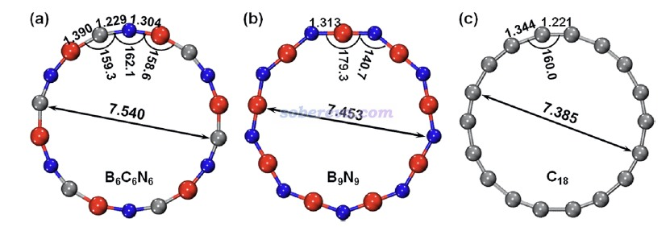

毕竟B6N6C6是一个新颖的结构，不排除静态相关很显著导致ωB97XD描述不理想的可能，故为了绝对稳妥，此文还用ORCA在CASSCF(12,12)/def2-TZVP级别下也做了几何优化。此活性空间设定下，最终会有12个占据数明显偏离整数的pi型自然轨道，而若活性空间进一步扩大到CAS(14,14)，则会再多出两个占据数接近整数的pi型自然轨道，这体现CAS(12,12)恰好足够充分描述B6N6C6的pi电子的静态相关效应。CASSCF(12,12)优化出的结构和ωB97XD的非常相近，体现出ωB97XD得到的此体系的几何结构靠谱。为了进一步体现ωB97XD计算出的波函数也合理，文中也顺带对比了一下这两个级别得到的单电子分布情况。文章按照《谈谈自旋密度、自旋布居以及在Multiwfn中的绘制和计算》（<http://sobereva.com/353>）计算了ωB97XD波函数的自旋密度，而由于CASSCF没法得到自旋密度，故文章使用《使用Multiwfn计算odd electron density考察激发态单电子分布》（<http://sobereva.com/583>）介绍的方法对CASSCF(12,12)波函数产生了单电子密度（ODD），等值面图对比如下所示。在不考虑自旋密度符号（体现在等值面颜色上，不同颜色对应单电子不同自旋方向）的情况下，可见二者展现出的单电子分布是基本吻合的，即单电子主要都分布在碳上。这在很大程度上体现出ωB97XD对称破缺计算产生的波函数也是合理的，适合用于之后的波函数分析。

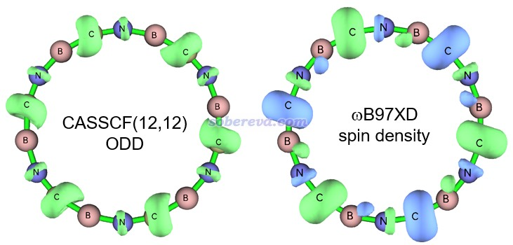

## 2 B6N6C6的电荷分布

原子电荷是定量考察化学体系中电荷分布最常用的指标之一。18碳环由于所有的碳都是等价的，显然原子电荷都为0，而对B6N6C6和B9N9计算原子电荷，可以直接考察这俩体系中不同原子带的净电量、了解二者电荷分布的差异。原子电荷计算方法并不唯一，不同方法基于不同的思想、有不同的特点，在《原子电荷计算方法的对比》（DOI: 10.3866/PKU.WHXB2012281）中有大量介绍和对比。考虑到B6N6C6电子结构的特殊性，为了得到稳妥的结论，文中用Multiwfn计算了很常用的ADCH、Hirshfeld、Hirshfeld-I、CHELPG原子电荷（它们的计算例子看Multiwfn手册4.7节）、用NBO程序计算了常见的NPA原子电荷，结果如下所示。可见虽然不同原子电荷给出的具体数值不同，但可以得到共同的结论，就是氮明显带负电，硼明显带正电，这体现出了它们显著的电负性差异。而在B6N6C6中，硼和氮的净电荷差异明显小于它们在B9N9中，这体现出碳元素在硼、氮之间的插入明显促进了体系整体电荷分布的均衡性。而B6N6C6中碳自己的原子电荷则接近于0，即没怎么受周围化学环境的影响。

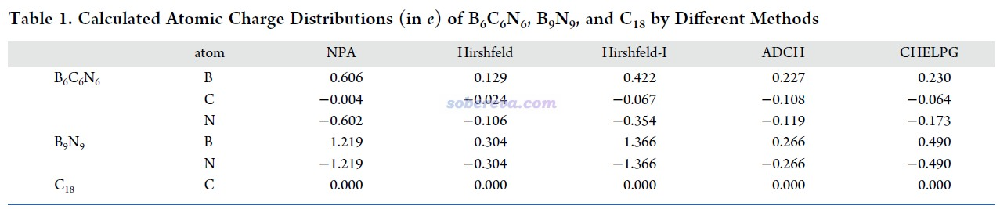

18碳环具有四类分子轨道：平面内和平面外两套π轨道，分别称为π-in和π-out，此外还有σ轨道，以及碳的内核原子轨道组成的内核分子轨道。B6C6N6和B9N9也有这四类轨道。为了深入考察各个原子上的电子是怎么分布在这些轨道上的，文中用Multiwfn基于Hirshfeld-I原子空间划分对三个体系计算了电子在这些轨道上的布居数，如下所示。具体计算方法我专门写了篇文章说明：《使用Multiwfn基于Hirshfeld-I划分计算特定类型电子在各个原子上的分布量》（<http://sobereva.com/697>）。

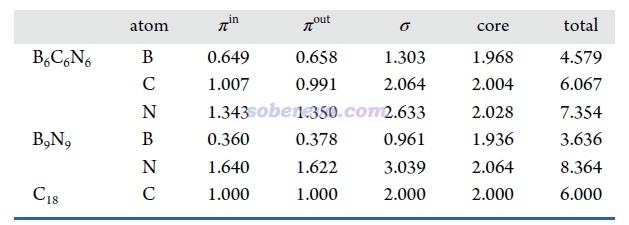

从以上数据可以看到，在每个原子上，π-in和π-out电子分布量都是基本一致的，没有什么偏向性，体现出这些体系里π-in和π-out电子特征的近似等价性。B6C6N6和18碳环中的碳的电子结构特征非常相近，π-in和π-out电子数在两种体系里都基本为1.0，明显都处于sp杂化的状态。

## 3 B6N6C6的成键情况

键级是考察化学键特征非常常见的方式，参见《Multiwfn支持的分析化学键的方法一览》（<http://sobereva.com/471>）。文中用Multiwfn对B6C6N6、B9N9和18碳环计算了流行的Mayer键级，并且分解为了不同类型轨道的贡献，如下所示。Mayer键级体现了原子间等效的共享电子对数，由数据可见，三个体系里所有键都包含典型的单个σ键特征（即σ+core电子贡献的Mayer键级接近非常接近于1），同时π-in和π-out电子都构成了一定程度的π键特征，且二者贡献相近。B6C6N6中的π作用程度是N-B ≈ C-N > B-C。B9N9中所有B-N等价。18碳环由长、短两种C-C键构成，后者的π作用显著强于前者。文中还用Multiwfn计算了模糊键级以进一步确认了这些结论，数据见补充材料。

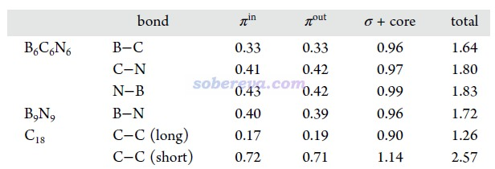

《使用IRI方法图形化考察化学体系中的化学键和弱相互作用》（<http://sobereva.com/598>）中介绍了卢天提出的IRI-π函数，可以直观地展现化学体系中π电子相互作用情况。此文对B6C6N6和B9N9绘制了IRI-π=1.2的等值面图并用sign(λ2)ρ函数着色，如下所示。可见每个键上都出现了环状的等值面，非常直观地体现出这些键都存在明显的π作用，这和Mayer键级展现出的信息相吻合。

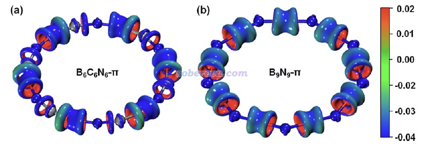

## 4 B6N6C6的芳香性

B6N6C6的芳香性是当前研究的重点。和18碳环一样，B6N6C6和B9N9的π-in和π-out电子皆为18个，都满足Hückel的4n+2芳香性规则，因此都有可能存在双π芳香性。衡量芳香性的方法非常多，在《衡量芳香性的方法以及在Multiwfn中的计算》（<http://sobereva.com/176>）里有充分的介绍。其中基于电子结构和基于磁性质的芳香性衡量方法的可靠性和普适性普遍较好，可以用于考察B6N6C6的芳香性并与18碳环和B9N9的进行对比。

AV1245*1000在《使用Multiwfn计算AV1245指数研究大环的芳香性》（<http://sobereva.com/519>）里专门介绍过，是基于波函数定义的适合用于定量考察共轭大环体系芳香性的指数。文中首先使用Multiwfn计算了AV1245*1000，结果如下。除了总值外，还分别给出了π-out电子和其它电子的贡献（注：π-in、σ、core电子对AV1245的贡献无法精确分离故没有单独给出。但显然σ和core的离域性极低，不会对AV1245有什么贡献，故“其它电子贡献”实质上等于π-in电子的贡献）。由数据可见，B6C6N6的芳香性显著强于B9N9，并且π-out的芳香性比π-in还略强一点，这可能在于体系的π-in电子的共轭程度相对略低，源自于环的曲率使得平行于环的p原子轨道彼此交叠程度低于垂直于环平面的p原子轨道。单从AV1245*1000的数值来看，B6C6N6的芳香性甚至比18碳环还要更强一点。

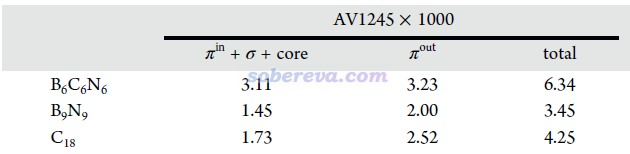

NICS是非常流行和稳健的基于磁属性衡量芳香性的指标，它的不同形式在<http://sobereva.com/176>里有专门介绍。其中NICS(0)zz对本文研究的这些环状共轭体系最为适合，结果如下所示，数值越负说明芳香性越强。为了更充分了解芳香性的来源，文中还按照《基于Gaussian的NMR=CSGT任务得到各个轨道对NICS贡献的方法》（<http://sobereva.com/670>）介绍的方法分别计算了π-in、π-out和σ+core电子的贡献。NICS(0)zz体现出B6C6N6的芳香性接近18碳环，并且π-in和π-out的贡献相仿佛。而B9N9虽然形式上也满足4n+2规则，但由于其NICS(0)zz基本为0，因此可断定是非芳香性的，这必然是由于其π电子缺乏整体离域能力所致。虽然B9N9的各个B-N键如前述Mayer键级和IRI-π所示有明显π作用，但显然不意味着其π电子能够容易地离域。对这些体系，σ和core电子都由于其高度定域性而对芳香性基本没有影响。

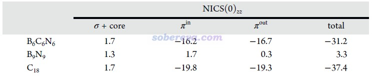

《使用AICD程序研究电子离域性和磁感应电流密度》（<http://sobereva.com/147>）和《使用AICD 2.0绘制磁感应电流图》（<http://sobereva.com/294>）介绍的AICD图是使用得较普遍的图形化直观展现化学体系磁感生电流的方法。为了进一步从磁感生电流的角度展现B6C6N6的芳香性以及和B9N9的差异，文中对这些体系的π-in、π-out以及全部π电子分别绘制了AICD图，如下所示。外磁场方向垂直于环由下朝上施加。由于等值面上的箭头太小，为了看得清楚，图中还用大的橙色箭头做了清晰的标注。此图直观体现出，B6C6N6确实存在显著的π芳香性，因为感生电流方向符合左手定则并且连贯地环绕整个体系，这正是典型的π芳香性体系具备的特征。而缺乏芳香性的B9N9则明显不具备这样的特征，感生电流几乎只是绕着原子核或原子间区域转。

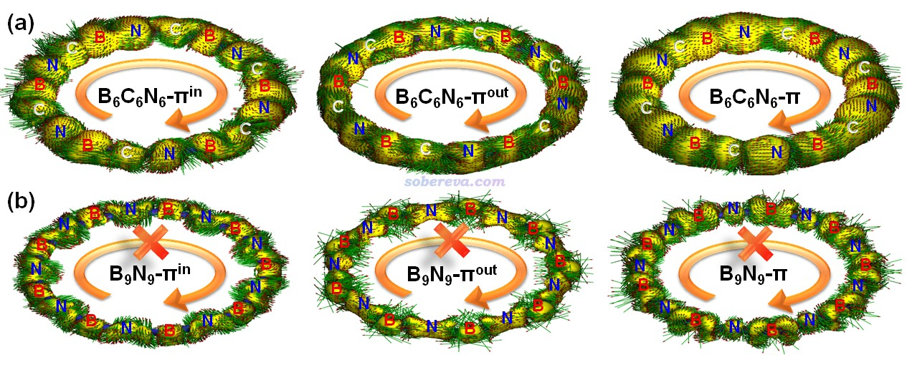

此文还按照《考察分子磁感生电流的程序GIMIC 2.0的使用（含24分钟演示视频）》（<http://sobereva.com/491>）介绍的方法绘制了GIMIC磁感生电流的动画，如下所示，更进一步地体现出芳香性明显的B6C6N6能够形成整体感生环电流而非芳香性的B9N9不具备这样的特征。  
B6C6N6：<http://sobereva.com/attach/696/B6C6N6_GIMIC.mp4>  
B9N9：<http://sobereva.com/attach/696/B9N9_GIMIC.mp4>

文中还对穿越B6C6N6、B9N9和18碳环的化学键的感生电流进行了积分，数值分别为21.64、0.70、22.50 nA/T，这定量体现出B6C6N6和18碳环的芳香性相仿佛，而B9N9完全不具备芳香性。

在《通过Multiwfn绘制等化学屏蔽表面(ICSS)研究芳香性》（<http://sobereva.com/216>）和《使用Multiwfn巨方便地绘制二维NICS平面图考察芳香性》（<http://sobereva.com/682>）中介绍了ICSS函数，它直观地体现了化学体系的磁屏蔽和去屏蔽区域的位置和强度，是NICS的重要扩展，已被非常广泛应用于讨论芳香性问题。此研究使用Multiwfn对B6C6N6和B9N9都绘制了ICSS_ZZ = 10 ppm的等值面图以及垂直于环的截面的填色等值线图，如下所示。等值面图中橙色和蓝色分别对应屏蔽和去屏蔽区域。由图可见，B6C6N6的环内部完全是屏蔽区域，环外面完全是去屏蔽区域，这种特征和苯这样的典型芳香性体系完全相同，更进一步严格地证明了B6C6N6有显著的芳香性。而且B6C6N6的ICSS的这种特征和Carbon, 165, 468-475 (2020)报道的18碳环的高度一致，体现出二者芳香性的高度共性。而B9N9的ICSS等值面图的屏蔽和去屏蔽区域彼此交错，没有形成遍及整体的连贯的等值面，体现出此体系既没有芳香性也没有反芳香性，而是非芳香性。

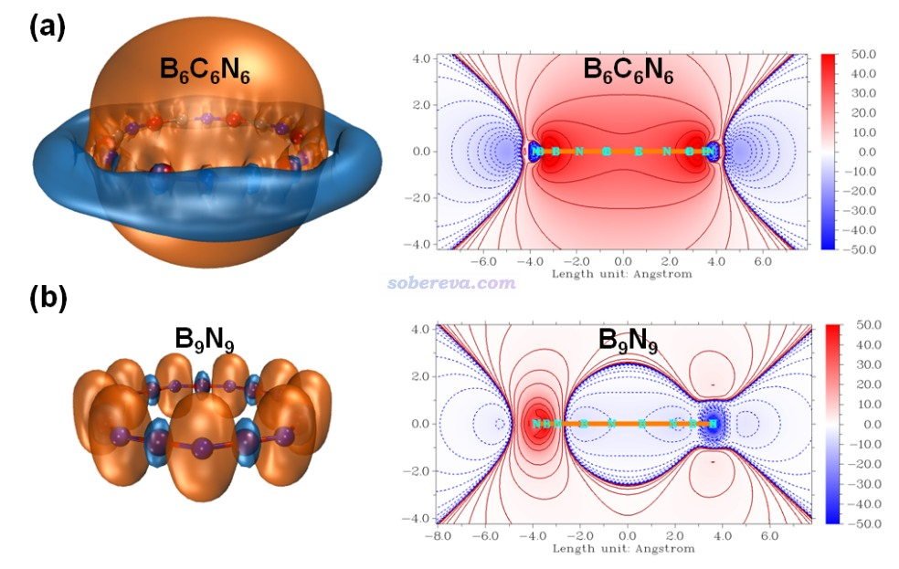

## 5 B6N6C6的电子离域性

芳香性的本质来自于电子的离域，因此文中还特意对B6N6C6的电子离域性从多方面进行了考察。在《在Multiwfn中单独考察pi电子结构特征》（<http://sobereva.com/432>）中介绍了Multiwfn可以计算和绘制的LOL-π函数，这对于考察π电子的离域情况极其有用，如今已经非常流行。下图对比了B6N6C6和B9N9的LOL-π=0.5等值面，明显可见B6N6C6的等值面比B9N9显得连贯得多，明显体现出B6N6C6的π电子有强得多的在18个原子上全局离域的能力，也一定程度解释了前者的芳香性比后者强得多的原因。

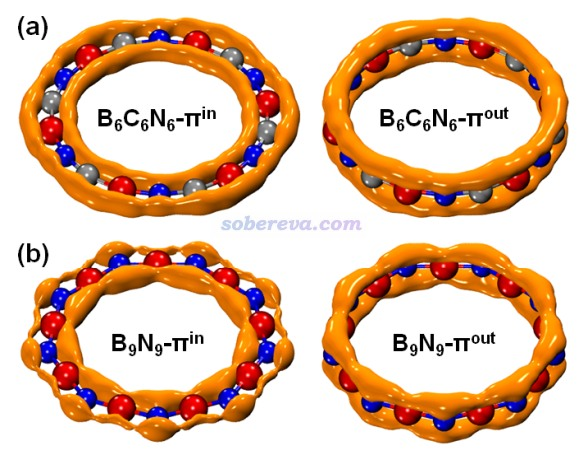

LOL-π函数比较适合直观定性考察，而《在Multiwfn中单独考察pi电子结构特征》里介绍的ELF-π函数的二分点数值则适合定量分析对比。下图是B6N6C6和B9N9的ELF-π函数等值面图，等值数值设为了令等值面刚好分裂时的数值，这被称为二分值，数值越大说明电子越容易跨越二分点区域发生离域。在图上也标注了二分点位置和二分值。由图可见，B6N6C6的π-in和π-out的二分值都明显大于B9N9的，这给B6N6C6的整体电子离域性更强又进一步提供了定量证据。

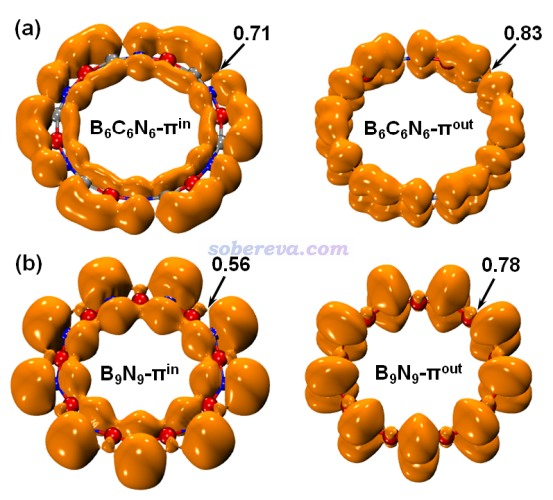

电子的费米穴是考察电子离域特征的一个重要的函数，它包含两个三维位置坐标，作图考察时通常将一个位置作为参考点，然后对另一个坐标绘图。Atoms-in-molecules理论的提出者Bader指出an electron can go where its hole goes and, if the Fermi hole is localized, then so is the electron，也就是假设一个电子出现在某个参考点位置，那么其费米穴函数明显分布在哪，这个电子就容易离域到哪去。因此，通过绘制费米穴图，可以更进一步了解体系处于不同位置的电子的离域能力。文中通过Multiwfn对B6N6C6、B9N9和18碳环分别绘制了费米穴的二维图，如下所示。参考点位置以绿色箭头标注，设在了不同原子的价层区域距离原子核特定距离的位置，此时图中的费米穴的分布就体现了这个位置的价电子容易离域到哪去。用Multiwfn绘制这种图的操作在《制作动画分析电子结构特征》（<http://sobereva.com/86>）里有相关说明。

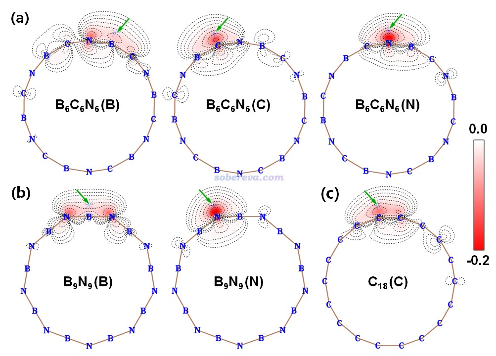

由上图等值线分布可见，B6N6C6的硼和碳的价电子的费米穴分布范围较广，体现出电子有往较远区域离域的能力，特别是其碳的费米穴分布特征和已知具有较显著全局离域性的18碳环的很接近。相比之下，B9N9的硼和氮的费米穴分布广度明显不及B6N6C6的相应元素的，等值线只分布在距离参考点较近的原子上，体现出B9N9的价电子的离域能力相对较差。

上面的等值线图适合定性讨论，为了能把以上信息转化成定量形式来更好地对比分析，文中定义了一个新的量叫做原子远程离域指数（atomic remote delocalization index, ARDI）。离域性指数（DI）在《Multiwfn支持的分析化学键的方法一览》（<http://sobereva.com/471>）里专门介绍过，是衡量特定两个原子间等效共享电子对数用的，而ARDI则是对单个原子定义的，定义为距离它两个化学键以上的原子与当前原子的所有DI之和，显然基于Multiwfn计算的所有原子间的DI可以简单地手算出来各个原子的ARDI。ARDI体现了特定原子上的电子的远程离域能力，数值越大说明远程离域能力越强。环上各个原子上的电子有显著的远程离域能力显然是这个环具备明显芳香性的前提。各原子ARDI如下所示，可见B6N6C6上的原子的ARDI都较大，平均值与18碳环的碳的相仿佛，而B9N9的硼和氮的ARDI都远小于B6N6C6相应元素的原子，这更充分体现了B9N9的电子的全局电子离域能力远不如B6N6C6，进一步展现了B9N9芳香性远低于B6N6C6的原因。

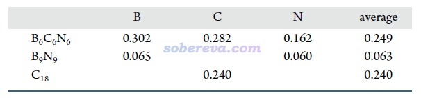

## 6 碳掺杂进B9N9使得芳香性巨幅提升的本质

根据前面的讨论，文章已经充分证明了芳香性的关系是B6C6N6 ≈ C18 ≫ B9N9。为什么将碳元素掺杂进入无芳香性的B9N9，就能使其芳香性巨幅提升、电子全局离域能力大幅增加？实际上原因并不难理解。尽管前面的Mayer键级体现出B9N9中的硼-氮之间有一定π作用，但由于硼和氮的电负性差异非常大，这无疑会导致电子倾向于在氮上定域而难以往相邻的硼上离域，至于往更远的原子上离域就更是难上加难了。而碳的电负性则正好介于硼和氮之间，显然硼-碳和氮-碳键的共价性显著强于硼-氮键，因此电子更容易离域过去，相当于碳给硼和氮之间架设了能够令电子容易离域过去的桥梁，充分调和了硼和氮之间电负性差异过大导致的电子跨键离域太难的矛盾。

为了更好地展现碳原子起到的价值，文中将垂直于环的各原子的2p原子轨道绘制了出来，π-out电子正是分布在这些p轨道上，π-out分子轨道也正是它们线性组合产生的。具体来说，由于NBO程序产生的预自然原子轨道（PNAO）可以较合理地描述分子环境中的原子轨道，因此文中按照《使用Multiwfn绘制NBO及相关轨道》（<http://sobereva.com/134>）中的做法，用Multiwfn结合VMD将相应的PNAO轨道用等值面图形式做了展示，如下所示。等值面数值选为了适合对比的0.1。图中也把PNAO的能量（eV）标注在了上面。由图可清楚地看出，B9N9中的氮和硼的p轨道的空间延展程度差异很大，而且轨道能量差异也很大，势必电子难以在它们之间离域。而从B6C6N6的图中可见，碳的p轨道延展范围和轨道能量都恰好介于硼和氮之间，它的引入无疑能够显著帮助电子离域过去。

## 7 B6N6C6异构体的芳香性

以上研究的那种以B-C-N作为重复单元排列的B6N6C6结构是否真的是B6N6C6的能量最低结构？是否B6N6C6化学组成的体系还有芳香性更强的异构体？这是个值得考察的有趣的问题。为此，文中还另外考虑了两种B6N6C6构型，优化后得到的无虚频结构如下所示，可见B6N6C6'构型让所有碳尽可能连在一起，其它部分部分保持B9N9那样硼-氮交错的结构，而B6N6C6''构型则是由三个C-C-B-N-B-N重复单元构成的结构。这两个结构的基态是闭壳层的，能量分别比前面研究的B-C-N为重复单元构成的B6N6C6结构能量低280.0和250.2 kcal/mol。这体现出B6N6C6中B-C和C-N的平均键能比B-N和C-C是要更小的。虽然前面研究的B6N6C6结构能量不是这种化学组成的能量最低结构，但并不意味着它是不稳定的。根据《使用ORCA做从头算动力学(AIMD)的简单例子》（<http://sobereva.com/576>）中介绍的方法，文中对此体系做了较高温度（500 K）下20 ps长度的基于wB97X-D3/6-311G*级别的从头算分子动力学模拟，用VMD每1 ps绘制一次的结构叠加图如下所示（颜色按照蓝-白-红变化），可见环状结构始终很好维持着，并没有发生异构化、解离等现象，体现出B6N6C6具有一定热力学稳定性。

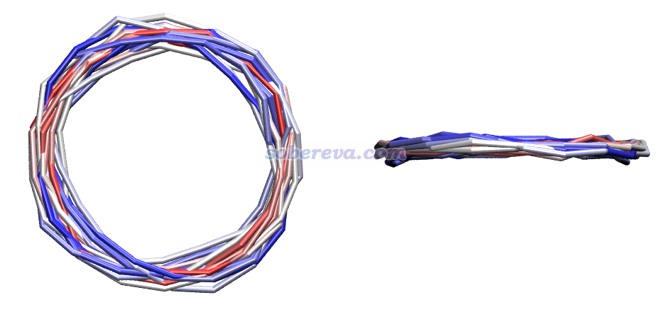

文中还对B6N6C6'和B6N6C6''构型计算了NICS(0)zz，发现分别仅有1.8和1.4 ppm，可见这俩构型没有芳香性。这说明只有让碳插入到硼和氮中间，从而以B-C-N作为重复单元时，碳才能真正起到显著提升纯硼-氮环体系的电子离域性的作用。

## 8 B6N6C6最低三重态激发态的芳香性

前面考察的都是B6N6C6的单重态基态（S0）。最后，文章还研究了B6N6C6最低三重态激发态（T1态）的芳香性。计算发现S0-T1垂直和绝热激发能分别为1.62和1.17 eV。下图(a)是优化后的T1态B6N6C6的结构，可见对称性相对于S0态发生了下降。下图(b)是按照《使用Multiwfn作电子密度差图》（<http://sobereva.com/113>）绘制的在B6N6C6的S0结构下T1态与S0态的密度差，蓝色和绿色分别为电子密度降低和增加部分。由图可见S0到T1态的电子激发是π-in → π-out的激发。由于垂直激发导致的电子密度变化破坏了B6N6C6基态的C6h对称性，这也是为什么在T1态势能面上从Franck-Condon点往极小点弛豫过程中几何结构对称性发生了下降。

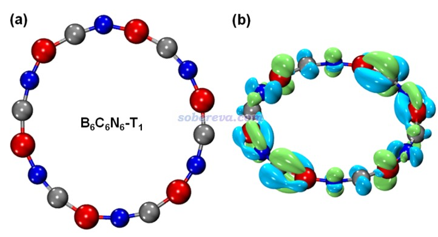

文中对B6N6C6的T1态计算了NICS(0)zz，并分解为了不同类型电子的贡献。而且为了考察几何结构弛豫的影响，在S0极小点和T1极小点分别做了这种计算，结果如下所示。可见无论在哪种结构下，T1态由于NICS(0)zz远大于0，因此是显著反芳香性的，这和Baird规则所述情况一致。Baird规则指出单重态基态满足Hückel 4n+2规则的体系的最低三重态是反芳香性的。从NICS(0)zz还看到，T1态的反芳香性特征在T1极小点结构下比S0极小点结构下更弱，这体现出B6N6C6自发减小T1态的反芳香性可能是其S0→T1垂直激发后结构弛豫的重要驱动力。

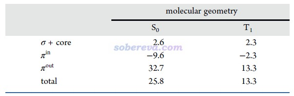

## 9 总结

此文基于量子化学计算和Multiwfn等程序做波函数分析，非常全面系统研究了18碳环的等电子体B6N6C6的几何结构和电子结构，从不同角度全面考察了其芳香性和电子离域性特征，并且和18碳环及其另外一个重要的等电子体B9N9进行了细致的对比。本文体现出以碳原子桥联硼和氮原子，可以显著提升纯硼-氮体系的电子离域性。这不仅对电子结构产生重要影响，必然也同时会影响其它性质，诸如光学性质、电子输运性质等。本文虽然研究的只是一维体系，可以预想电负性介于硼和氮之间的碳元素的掺杂必定也会对二维、三维纯硼-氮体系产生显著影响，而且掺杂方式的选取可能会对这些体系的性质起到一定调控作用。

如果读者对于18碳环及其相关体系感兴趣，非常推荐查看<http://sobereva.com/carbon_ring.html>里汇总的本文作者的巨量其它研究工作，包含大量深入浅出的论文内容和研究思想介绍文章，以及对计算技术细节的附加说明。
