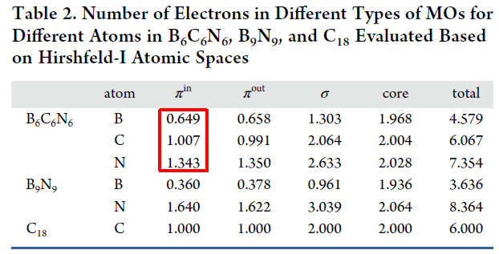

**使用Multiwfn基于Hirshfeld-I划分计算特定类型电子在各个原子上的分布量**

Using Multiwfn to calculate the distribution of specific types of electrons on each atom based on Hirshfeld-I partitioning

文/Sobereva@[北京科音](http://www.keinsci.com)  2024-Jan-26

在《18碳环等电子体B6N6C6独特的芳香性：揭示碳原子桥联硼-氮对电子离域的关键影响》（<http://sobereva.com/696>）中提到，笔者在Inorg. Chem., 62, 19986 (2023)一文考察B6C6N6分子的电荷分布时，专门计算了此分子的平面内π轨道、平面外π轨道、σ轨道和内核轨道上的电子是怎么分布在各个原子上的。原子空间定义的方法不唯一，此文用的是流行的Hirshfeld-I原子空间划分，这种方式划分的原子空间物理意义较强，可以较合理体现外环境导致的原子空间收缩和膨胀。这种分析方法对于读者研究很多其它体系也很有益处。本文就演示一下怎么用Multiwfn实现这种计算，以计算B6C6N6的平面内π电子（π-in）的分布为例。由于这个计算需要充分利用Multiwfn的灵活性，牵扯一些细节，这是为什么我专门写个文章来具体说明。

上述文章考察的B6N6C6的波函数文件是<http://sobereva.com/attach/697/B6C6N6_OS.rar>，解压后是B6C6N6_OS.fchk，是由Gaussian 16在wB97XD/def2-TZVP级别下以对称破缺方式计算得到的。本文例子用的Multiwfn是2024-Jan-21更新的版本。Multiwfn可以在<http://sobereva.com/multiwfn>免费下载，不了解者看《Multiwfn FAQ》（<http://sobereva.com/452>）。

启动Multiwfn，载入B6C6N6_OS.fchk。首先要做的是构造Hirshfeld-I原子空间，把Multiwfn的examples目录下的atmrad子目录挪到当前目录下，这是因为此目录下有各种元素不同价态的径向电子密度信息，在构造Hirshfeld-I原子空间时要用到（若缺乏计算机常识不了解什么叫“当前目录”，看<http://sobereva.com/237>）。然后在Multiwfn里依次输入

15  //模糊空间分析  
-1   //选择原子空间  
1  //开始构造Hirshfeld-I原子空间  
很快就构造完了。Hirshfeld-I原子空间权重数据现已被储存在了内存里，输入0返回主菜单。

因为我们要考察π-in分子轨道上的电子分布，故接下来需要把这类轨道以外的分子轨道的占据数都清零。可以按照《使用Multiwfn观看分子轨道》（<http://sobereva.com/269>）说的，在Multiwfn主功能0里一个一个观看占据轨道的图形判断，把π-in轨道的序号都记录下来，最终找到的序号如下。注意当前是对称破缺计算，因此两种自旋要分别考察。  
Alpha自旋的π-in占据轨道：38,41,42,45,46,48,50,53,54  
Beta自旋的π-in占据轨道：596,599,600,603,604,606,608,611,612（注意beta轨道序号在Multiwfn中的记录规则，在<http://sobereva.com/269>专门说了）

在Multiwfn里接着输入  
6   //修改波函数  
26  //修改轨道占据数  
0   //选择所有轨道  
0  //把所有轨道占据数清零  
38,41,42,45,46,48,50,53,54,596,599,600,603,604,606,608,611,612   //所有π-in轨道序号  
1  //占据数还原为原本的1.0  
q   //返回  
-1   //返回主菜单

现在就可以开始正式计算了。在Multiwfn里接着输入  
15  //模糊空间分析。进入后从选项-1的文字上可以看到当前的原子空间仍是Hirshfeld-I  
1   //对特定实空间函数在各个原子空间中积分  
1  //被积函数是电子密度。显然当前对应的是π-in电子密度

马上看到如下结果

  Atomic space        Value                % of sum            % of sum abs  
     1(B )            0.64940465             3.607804             3.607804  
     2(C )            1.00713759             5.595209             5.595209  
     3(N )            1.34345778             7.463655             7.463655  
     4(B )            0.64926116             3.607007             3.607007  
     5(C )            1.00733834             5.596325             5.596325  
     6(N )            1.34338216             7.463235             7.463235  
     7(B )            0.64944181             3.608010             3.608010  
     8(C )            1.00710182             5.595011             5.595011  
     9(N )            1.34348431             7.463802             7.463802  
    10(B )            0.64924542             3.606919             3.606919  
    11(C )            1.00734233             5.596347             5.596347  
    12(N )            1.34339152             7.463287             7.463287  
    13(B )            0.64942036             3.607891             3.607891  
    14(C )            1.00713369             5.595188             5.595188  
    15(N )            1.34344824             7.463602             7.463602  
    16(B )            0.64928283             3.607127             3.607127  
    17(C )            1.00730639             5.596147             5.596147  
    18(N )            1.34341808             7.463434             7.463434  
 Summing up above values:         17.99999847  
 Summing up absolute value of above values:         17.99999847

如上可见，B、C、N原子的π-in电子数分别是0.649、1.007、1.343，和如下所示的Inorg. Chem., 62, 19986 (2023)中的表2中的数据完全一致。

最后再提醒一下，必须按以上说明先产生Hirshfeld-I原子空间、修改轨道占据数，最后再在Hirshfeld-I原子空间里积分，而不能先修改轨道占据数然后再进入子功能15产生Hirshfeld-I原子空间并做积分。因为修改轨道占据数之后，此时的电子密度函数就不再是总电子密度了，而Hirshfeld-I原子空间在构造时用到的电子密度函数必须对应总电子密度。
