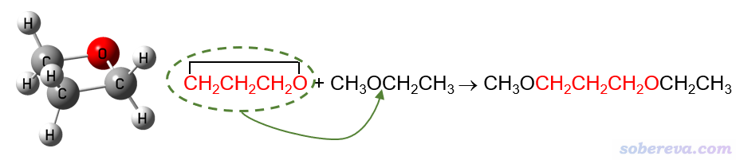
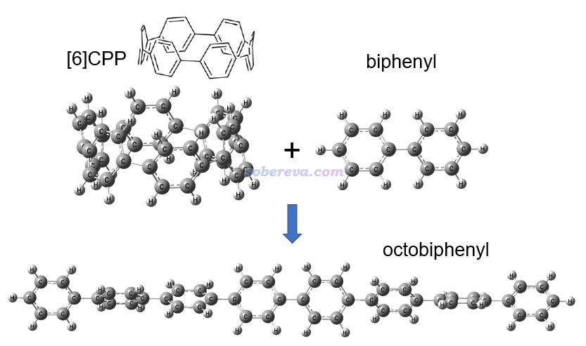
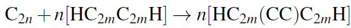
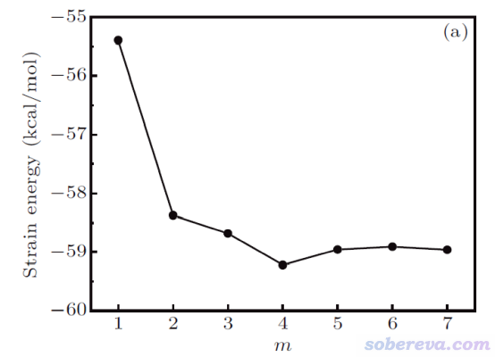
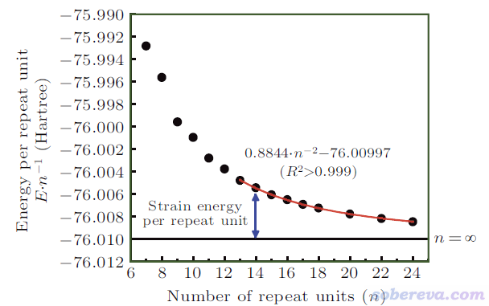
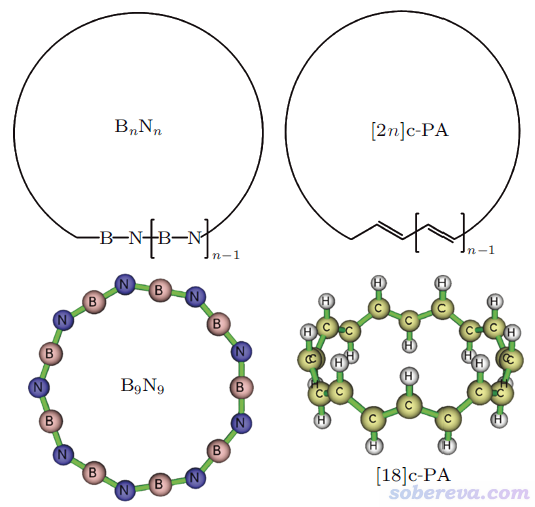

**谈谈如何计算环张力能：以CPP和碳单环体系为例**

On the calculation of ring strain energy: Taking CPP and cyclocarbon systems as examples

文/Sobereva@[北京科音](http://www.keinsci.com)   2024-Jan-29

## 0 前言

环状化学体系具有不同程度的环张力，环张力和环状体系的诸多问题紧密相关，诸如生成焓、稳定性、合成难易程度等。环张力能（strain energy, SE）是衡量环张力大小的最直接的指标，它对应当前环状结构转变为假想的没有环张力的结构过程中能量变化的负值。

北京科音自然科学研究中心（[www.keinsci.com](http://www.keinsci.com)）的卢天等人之前受邀发表了一篇专门精确考察碳环（cyclocarbon）体系环张力能的文章，文中对环张力的计算思想有详细介绍并给出了诸多讨论：  
Accurate theoretical evaluation of strain energy of all-carboatomic ring (cyclo[2n]carbon), boron nitride ring, and cyclic polyacetylene, *Chin. Phys. B*, **31**, 126101 (2022) DOI: [10.1088/1674-1056/ac873a](http://doi.org/10.1088/1674-1056/ac873a)（不方便获取者也可以看预印版<https://doi.org/10.26434/chemrxiv-2022-v8w9h>，内容基本一样）

下面，将基于此论文中的内容简要说明环张力能的计算原理并给出具体例子。感兴趣的读者请务必仔细阅读论文原文以了解更多信息，也推荐以类似方式计算其它体系的环张力能时引用此论文。另外，读者如果对碳环体系感兴趣，很建议查看同作者之前发表的此类体系的各种研究文章和相关博文：<http://sobereva.com/carbon_ring.html>。

## 1 同联反应法

设计同联（homodesmotic）反应是计算环张力能的很常用方法。这个方法设计一个化学反应，既使得环被打开使得环张力被完全释放，同时又尽可能不影响原本的成键情况，显然这个反应能的负值就对应了环张力能。

例如，要计算氧杂环丁烷的环张力能，就可以设计以下同联反应。红色部分对应具有显著环张力的氧杂环丁烷，将它插入到甲乙醚所示位置就变成了右边的产物，显然此时环张力就被完全释放掉了。与此同时，反应物和产物的成键特征并未发生变化，例如下图红字的第一个碳在反应前后始终是sp3杂化状态、始终连着一个氧原子和一个CH2，因此化学环境变化导致的成键特征的极轻微改变对这个反应能的影响可以忽略不计，也即这个反应能几乎只体现出环张力的释放。

同联反应法计算环张力能的缺点是反应的设计并不唯一，比如以上反应的甲乙醚也可以是甲醚、乙醚等等，结果或多或少会有点差异。显然反应应当设计得尽可能令各个键的特征在反应过程中不发生改变，但这并非总能很好实现，后文提到的碳环体系就是一例。

## 2 同联反应法计算实例：[6]CPP

这一节示例使用同联反应法计算[6]CPP的环张力能。此体系的几何结构，以及设计的同联反应如下所示。可见是把[6]CPP插入到了联苯中间变成了直线的八联苯，从而完全释放了环张力。

上图涉及的三个分子都在ωB97XD/6-31G*级别下用Gaussian 16程序进行了几何优化，并做振动分析确认了无虚频，输入输出文件都在<http://sobereva.com/attach/698/file.rar>里。基于输出文件里最后一次输出的电子能量，用反应物能量之和减去产物能量，就得到了环张力能：627.51*(-463.1444911-1385.7232492+1849.0260518) = 99.3 kcal/mol。这个值比C-C单键的键能还要大一些，可见其环张力是相当强的。

如果想得到更精确结果，可以基于优化完的结构在更好的级别下算高精度单点再求差，比如基组可以改用明显更好的def2-TZVP。这对结果可能造成几kcal/mol程度的影响。

在《18个氮原子组成的环状分子长什么样？一篇文章全面揭示18氮环的特征！》（<http://sobereva.com/725>）介绍的笔者的ChemPhysChem, 25, e202400377 (2024)研究文章中利用同联反应法计算了18氮环的环张力，推荐感兴趣的读者阅读了解细节。

## 3 外推法

如果被考察的环状体系是由重复单元构成的，比如前面的[6]CPP是苯环作为重复单元，就也可以用这一节介绍的外推法计算其环张力能。这个方法计算过程如下

(1)计算从小到大不同重复单元数（n）的环的每单元的能量E/n，这里E是整体能量。显然E/n是依赖于n的，n较小时环尺寸较小，自然环张力大，平均到每个单元的环张力能也大  
(2)用Origin之类程序通过恰当的函数（一般是二次函数）拟合E/n与n之间的解析关系，并外推得到n无穷大时的E/n，这对应于没有环张力时候的每单元能量  
(3)将当前考察的环状体系的E/n减去n无穷大时的E/n，就得到了当前体系的每单元环张力能（SE/n）  
(4)将当前体系的SE/n乘以当前的体系的n即是当前体系的环张力能

相较于同联反应法，外推法的优点：  
•原理非常严格  
•没有同联反应法设计反应的任意性，并可以用于同联反应法不适合的体系  
•可以顺带得到环张力能与n的解析关系，由此可以直接预测出任意重复单元数的环张力能  
缺点：  
•需要计算从小到大不同尺寸的环状体系，总耗时明显高于同联反应法  
•计算步骤略繁琐，得自己做拟合

如果你只是要考察当前一个环状体系的环张力能，而且可以设计出很合适的同联反应，那么就没必要用昂贵且略麻烦的外推法。

## 4 外推法计算实例：18碳环

2019年首次在凝聚相实验中观测到的18碳环分子由18个sp杂化的碳依次相连构成环状。由于sp杂化的碳明显倾向于形成180度键角，因此18碳环必然有显著的环张力，具体环张力能是多少非常值得研究，这正是前述Chin. Phys. B, 31, 126101 (2022)文章研究的主要内容。

此文中指出碳环类体系不适合同联反应法计算环张力能。碳环类体系是长、短C-C键交替构成，两个碳是一个重复单元，若用同联反应法计算化学式为C_2n的碳环的环张力能，可以设计如下反应式，相当于把碳环的每个重复单元插入到了一定长度的碳炔里。碳炔是sp杂化的碳形成的链状分子，两端由氢封端。PS：对碳炔感兴趣者建议阅读《氢封端碳链H-(C≡C)n-H (n = 3-9, 15)的电子光谱的尺寸依赖性：性质分析及对碳炔的预测》（<http://sobereva.com/679>）

然而，如下图可见，将18碳环的重复单元插入到不同长度（通过m体现）的碳炔里，按照同联反应算出来的环张力能有明显区别，因此靠同联反应法难以得到严格的18碳环的环张力能。

碳炔和18碳环都具有C-C键长、短交替的特征。文中还发现，不管碳炔的m取多少，处于它中央的较长的C-C键和18碳环中的较长的C-C键之间的键长差异都不可忽视，对较短的C-C键也是如此。因此原理上没法设计一个同联反应使得18碳环的C-C键特征在转移到产物时几乎完全不发生改变，这也必然导致靠同联反应法不可能对此体系得到完全精确的环张力能，也即成键特征差异造成的能量改变会不可避免地掺入到计算出的环张力能中。

由于发现了以上问题，文中使用外推法计算碳环的环张力能。为了追求尽可能好的精度，文中用ORCA程序在精度很好的DLPNO-CCSD(T)/cc-pVTZ级别下对n=7到n=24的碳环都计算了单点能（基于ωB97XD/def2-TZVP优化的结构），ORCA输出文件在<http://sobereva.com/attach/698/file.rar>里都提供了。每重复单元能量（E/n）与n的关系如下所示。由于n较小的碳环的电子结构特征有特殊性、和较大的碳环存在一定差异，因此文中只对n>=13的数据点做了二次函数的拟合，由下图的红色曲线可见拟合质量超极好，R^2近乎精确为1。

令拟合公式E/n = 0.8844/n^2 - 76.00997中的n为无穷大，就得到了无环张力对应的无穷大的碳环的每单元能量-76.00997 Hartree。每单元环张力能SE/n = E/n - 76.00997，于是有SE/n = 0.8844/n^2，也即碳环类体系的环张力能SE = 0.8844/n Hartree。18碳环的n=9，代进去就得到了其环张力能0.8844/9 Hartree = 61.7 kcal/mol。

值得一提的是，如果令前述同联反应法中碳炔的m设得很大，从而使得环张力能随m收敛，最终算出来的结果是59 kcal/mol，可见和严格的外推法的结果相比误差并不可忽略。

前述论文中也测试了用ωB97XD/def2-TZVP的能量结合外推法算碳环的环张力能，结果和上面用的昂贵的DLPNO-CCSD(T)/cc-pVTZ能量的结果没多大差别。这在一定程度上体现出ωB97XD/def2-TZVP级别算碳环类体系很不错。

文中还基于不同尺寸碳环的环张力能和键角之间的关系，推导出了适合碳环体系用的C-C-C键角力常数56.23 kcal/mol/rad^2。

此外，文中还对以下所示的18碳环的等电子体硼-氮环，以及具有单套pi共轭特征的环聚乙炔的环张力做了计算，发现硼-氮环类体系的环张力明显小于碳环类，而环聚乙炔类体系的环张力则略大于碳环类。文中利用Multiwfn程序（<http://sobereva.com/multiwfn>）做波函数分析从电子结构角度清晰解释了它们的环张力与碳环之间存在差异的原因。文中还发现用常用的B3LYP泛函算全局pi共轭的环状聚合物的合理性较差，E/n随n的变化明显不合理。这些方面这里就不多提了，请读者务必阅读论文原文。

## 5 总结

环张力是环状分子的重要特性。本文简明扼要地介绍了两种最常用的计算环状分子的环张力能的方法，并以[6]CPP和18碳环作为具体例子进行了演示。同联反应法比较方便省事，但对于一些全局pi共轭的环状体系，诸如18碳环，则更适合外推法，明显严格得多，同时外推法还很有助于探究环尺寸与环张力之间的关系。还应当注意并不是所有环状体系都能用这两种方法之一计算环张力能，比如苯分子，它存在显著的和其环状结构紧密相关的六中心键，因而环张力本来就是难以被定义的。
