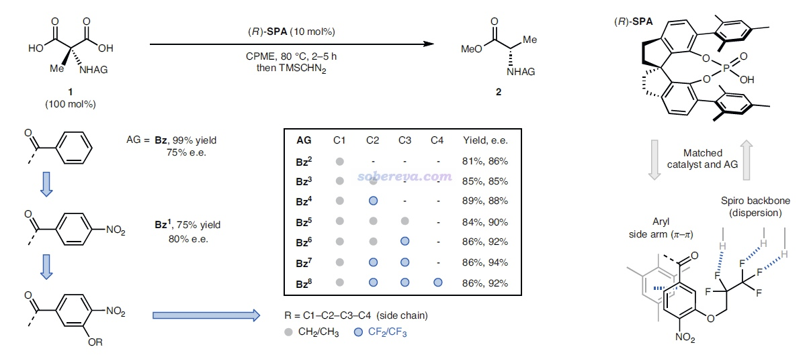
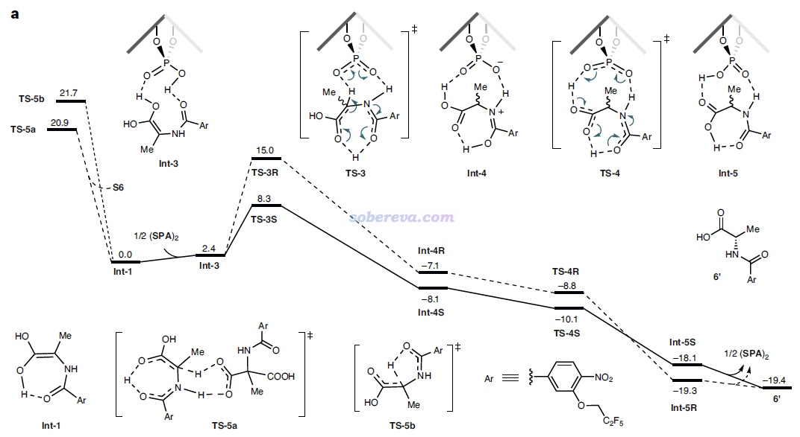
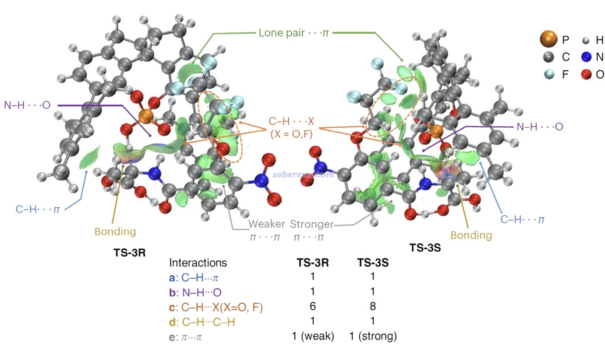
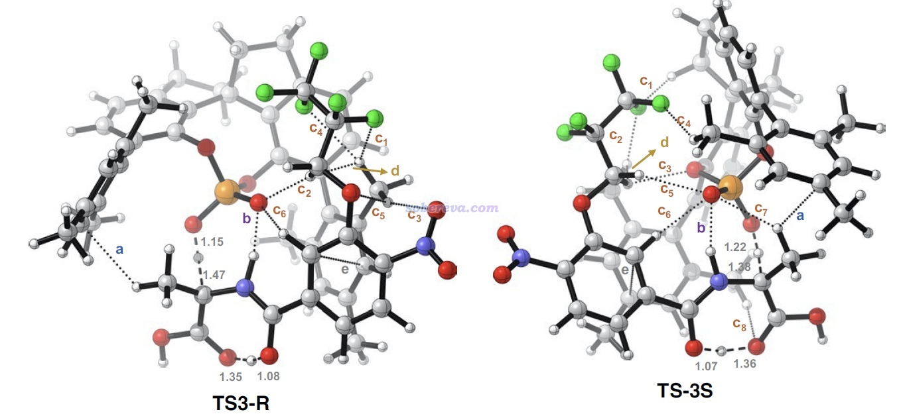

**直观解释分子间相互作用如何影响不对称催化：Nature Chemistry上一个很好的IGMH分析范例**

Intuitive explanation of how intermolecular interactions affect asymmetric catalysis: A nice example of IGMH analysis published on Nature Chemistry

文/Sobereva@[北京科音](http://www.keinsci.com)  2024-Feb-10

在《使用Multiwfn做IGMH分析非常清晰直观地展现化学体系中的相互作用》（<http://sobereva.com/621>）中介绍的我在J. Comput. Chem., 43, 539 (2022)中提出的可视化分析弱相互作用的IGMH方法目前已经很流行，在《一篇最全面介绍各种弱相互作用可视化分析方法的文章已发表！》（<http://sobereva.com/667>）和《Angew. Chem.上发表了全面介绍各种共价和非共价相互作用可视化分析方法的综述》（<http://sobereva.com/746>）介绍的综述文章里对此方法也有全面透彻的介绍。

我在去年审了一篇Nature Chemistry的文章，看到作者通过对比对应不同类型相互作用的IGMH等值面来对不对称催化的原因做了很好的解释，我觉得很值得作为IGMH分析例子说一下，对一些人可能有启发。现在这篇文章已经正式发表了：Nature Chemistry, 15, 1672 (2023)。

这是一篇实验为主理论计算为辅的文章，研究对象是下图的过程。图的左上角所示的1是个氨基丙二酸类物质，在加入下图右上角所示的有手性的SPA作为催化剂后，就可以得到脱羧后的结构2，是个有手性的氨基酸类物质。实验发现，改变底物1中的AG基团会明显影响产率和对映体过剩率e.e.，如图所示AG为Bz时是75% e.e.，改为Bz1时80% e.e.，再引入OR取代基后e.e.更高，且R的选择会进一步影响e.e.，如图中方框部分所示AG=Bz7时e.e.最高，此时对应于R为CH2-CF2-CF3。下图右边示意了这个结构的底物可以与SPA形成显著的弱相互作用，既有与SPA侧链的pi-pi堆积作用，底物上的大量的F也与SPA的骨架的C-H有显著的静电和色散混合的吸引作用，这些作用可以显著稳定化SPA对底物的结合。

上面那种AG=Bz7的结构在文中称为S6，能够自发脱羧变成下图的Int-1结构。如下图左侧所示，Int-1可以和S6实现自催化反应（经历TS-5a），也可以自己发生1-4质子转移（经历TS-5b），但势垒都较高，不是研究的重点。重点是图中所示的Int-1在SPA的作用下，会经历一系列过渡态和中间体，最终达到氨基酸类似物结构6'，产生S和R手性的这个产物经历的势垒有很大差别。图中可见TS-3是决速步，TS-3S的势垒远低于TS-3R，这是SPA催化作用下e.e.很大的关键原因。

由于反应物相同，因此TS-3S和TS-3R势垒的差异体现在这两个结构的能量差别上，差别最主要来自于SPA与Int-1分子的弱相互作用。为了说明这一点，文中用Multiwfn对这两个过渡态结构做了IGMH分析，给出了下图，对两个分子间存在的相互作用类型做了标注。其中N-H...O无疑是挺强的氢键，C-H...pi和C-H...O/F都是很弱的氢键，苯环间存在pi-pi相互作用，Bz7基团上的一堆F的孤对电子与苯环有色散主导的相互作用。图中标注Bonding的地方是Int-1与SPA之间发生氢转移而一定程度成键的地方，对TS-3S和TS-3R这个成键作用不会有什么明显差别。

上面两张IGMH图的等值面很多，在表面上看起来不太好对比相互作用强度，但如果像本文一样，把每种相互作用一一罗列出来做细致对比，是完全可以对总作用强度进行区分和解释的。如上可见，通过仔细观察等值面可发现TS-3S比TS-3R对应C-H...X作用多出来2个，并且TS-3S的pi-pi堆积作用区域的面积明显大于TS-3R的，所以前者被标注为strong而后者被标注为weak。

为了能令弱相互作用情况看得更清楚，文中还在分子结构图上直接用虚线对IGMH呈现的信息做了明确的标注，如下图所示，字母对应上面的列表里的项，诸如c1、c2...对应不同的C-H...X相互作用。从这个简化的图上能更清楚地看到TS3-S中SPA的C-H与底物的Bz7基团上的F之间的相互作用比TS3-R中的更丰富，这一定程度解释了为什么底物接上F原子较多的Bz7基团时被SPA催化时可以达到较高的e.e.。此外，下面这张图上还标记了d: C-H...C-H作用的位置，显然这是普通色散作用，这个作用在上面的IGMH等值面上肉眼不太好辨别（在VMD程序里旋转等值面时才容易识别），而像下图这么用箭头标记一下就容易令读者看清楚出现在什么位置了。

这篇文章体现出基于IGMH分析能清晰直观地对分子间相互作用导致势垒存在的差异和由此带来的实验现象予以解释，是很好的IGMH应用范例，值得在其它研究中借鉴。此文的利用弱相互作用实现e.e.的控制也是新颖的催化设计的思路。
