**使用Multiwfn做Hirshfeld surface分析直观展现分子晶体和复合物中的相互作用**

Performing Hirshfeld surface analysis by Multiwfn to visually display interactions in molecular crystals and complexes

文/Sobereva@[北京科音](http://sobereva.com/multiwfn)

First release: 2024-Feb-16   Last update: 2024-Feb-17

## 0 前言

Hirshfeld surface分析（以下简称HS分析）是展现分子晶体中一个或多个分子与周围分子间相互作用的方法，它也同样可以用于展现孤立体系中特定片段与周围原子间的相互作用。HS分析的原理容易理解，图像比较直观，在分子晶体的研究领域已经用得非常普遍。Multiwfn的主功能12中很早以前就已经实现了HS分析，如今已经被不少文章使用。本文将结合许多例子，专门详细具体讲解一下Multiwfn做HS分析的各方面细节、操作和技巧。

本文的读者请务必使用**2024-Feb-16及以后**更新的Multiwfn版本，否则与本文所述情况会有很多不同。Multiwfn可以在其主页<http://sobereva.com/multiwfn>免费下载。不了解Multiwfn者请参看《Multiwfn FAQ》（<http://sobereva.com/452>）和《Multiwfn入门tips》（<http://sobereva.com/167>）。使用Multiwfn做HS分析在写文章时请按照Multiwfn启动时的提示对程序进行恰当的引用。

另外，《Angew. Chem.上发表了全面介绍各种共价和非共价相互作用可视化分析方法的综述》（<http://sobereva.com/746>）介绍的笔者的综述文章里对HS分析有简明扼要的介绍，也推荐阅读和一起引用。

很值得一提的是，笔者提出的IGMH方法也非常适合展现分子晶体中的分子间相互作用，HS分析与IGMH分析的展现形式有明显区别且有一定程度的互补性，二者亦可以同时使用以提供更多视角。请阅读《使用Multiwfn做IGMH分析非常清晰直观地展现化学体系中的相互作用》（<http://sobereva.com/621>）和《一篇最全面介绍各种弱相互作用可视化分析方法的文章已发表！》（<http://sobereva.com/667>）提到的综述了解IGMH的相关知识，里面也专门有IGMH用于分子晶体的实际例子。

## 1 Hirshfeld surface分析的基本思想

在笔者讲授的量子化学波函数分析与Multiwfn程序培训班（<http://www.keinsci.com/workshop/WFN_content.html>）和Multiwfn手册3.15.5节对HS分析的原理有很具体、详细的讲解，下文只是把原理的最关键的部分简要介绍一下，对于正确做HS分析基本够了。

HS分析最早由Spackman等人于Chem. Phys. Lett., 267, 215 (1997)提出，后来又得到了发展，Acta Cryst., B60, 627 (2004)和CrystEngComm, 11, 19 (2009)是其两篇综述文章。HS分析关键思想是对分子晶体中的特定分子构造出Hirshfeld surface，它相当于这个分子在分子环境中的表面，然后再将一些有特殊意义的实空间函数映射到这个表面上，由此可以对分子晶体中的分子间相互作用特征进行考察。

简要说一下Hirshfeld surface是怎么定义的。Hirshfeld在Theoret. Chim. Acta (Berl.), 44, 129 (1977)最早提出了一种定义化学体系中原子空间的方式，它给每个原子定义了Hirshfeld权重函数来描述这个原子在三维空间中各个位置所占权重，数值从0到1平滑变化，0和1分别对应于此位置完全不属于和完全属于这个原子。每个位置所有原子的权重函数加和为1。这是一种典型的模糊式原子空间定义方式。具体定义细节见《原子电荷计算方法的对比》（<http://www.whxb.pku.edu.cn/CN/abstract/abstract27818.shtml>）的2.5节和Multiwfn手册3.9.1节，看完了就会知道产生Hirshfeld权重需要有各个原子的坐标，以及体系中的各种元素的原子在孤立状态下的球对称化的电子密度。将一个分子中所有原子的Hirshfeld权重函数加和就定义了这个分子的权重，因此分子晶体中各个分子都有各自的权重函数。某个分子的Hirshfeld surface就对应于它的权重函数数值为0.5的等值面。例如下图的曲线展现了某个平面上各个分子的Hirshfeld surface对应的轮廓。可见，Hirshfeld surface算是分子环境中各个分子与其它分子接触面的一种定义方式。下文所说的“表面”都是指Hirshfeld surface。

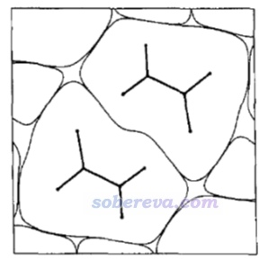

现实当中构造Hirshfeld surface是利用我在J. Mol. Graph. Model., 38, 314 (2012)介绍的Marching Tetrahedron或类似的算法实现的。这个表面被描述为大量小三角形的集合，每个三角形由三个表面顶点构成。由于构造Hirshfeld surface对应的等值面用的算法和《使用Multiwfn的定量分子表面分析功能预测反应位点、分析分子间相互作用》（<http://sobereva.com/159>）涉及的构造电子密度等值面对应的分子范德华表面的算法在本质上相同，所以Multiwfn中HS分析也是在主功能12（定量分子表面分析）中实现的。

实际中做HS分析的时候是选取一个（也允许是多个）感兴趣的分子并对它构造Hirshfeld surface进行分析，这个分子在下文管它叫“中心分子”，它周围的分子也可以称为“环境分子”。

HS分析定义了一些映射到Hirshfeld surface上的三维实空间函数，常见的有：  
• d_i：表面内部（interior）的原子（也即中心分子的原子）到当前点的最近距离  
• d_e：表面外部（exterior）的原子（也即周围分子的原子）到当前点的最近距离  
• d_norm：归一化的（normalized）分子间接触距离。由d_i、d_e和原子范德华半径计算出来。数值越小体现表面上此处附近的内、外原子有越近的接触，暗示此处的相互作用越强  
• shape index（形状指数）：数值在[-1,1]范围，越负说明此处表面越凹，反之越凸  
• curvedness（曲度）：在[-4,0.4]范围，-4对应表面此处完全平坦，越正越凸，0对应单位球面的曲度

d_norm经常用来对Hirshfeld surface进行着色来直观展现分子环境中的分子间的相互作用，d_norm数值较小的区域对应于较强烈的分子间相互作用。笔者发现用电子密度来着色也很有意义，Hirshfeld surface上电子密度越大的地方体现相互作用越强，效果比用d_norm着色时明显更好，色彩过渡更为平滑，物理意义也更强，也没有范德华半径选取的任意性。由于对大体系做量子化学计算产生比较精确的电子密度比较耗时，因此只需要用准分子近似的电子密度（promolecular density）对Hirshfeld surface着色就够了，它直接由各个原子孤立状态的电子密度叠加得到，耗时极低，我实测和使用量子化学计算的电子密度着色的效果差不多。

由于各种元素的孤立状态的电子密度以及范德华半径在Multiwfn中是内置的，故产生Hirshfeld surface以及计算以上提及的各种函数只需要原子坐标和元素信息就够了。由于HS分析依赖的信息非常简单，不牵扯基于波函数的计算，因此耗时极低，用起来也很方便。

HS分析还经常绘制指纹图（fingerprint map），是把d_i和d_e作为散点图的横轴和纵轴，然后把Hirshfeld surface上的各个顶点根据其d_i和d_e的数值绘制在指纹图上作为一个个小点。根据指纹图上散点分布的位置可以对中心和周围分子间的相互作用特征进行讨论，后文会结合具体例子来讲。

HS分析中还经常做局部接触（local contact）分析。完整的HS分析描述了中心分子的所有原子和周围分子的所有原子间的相互作用，而局部接触分析可以指定在HS分析中只考虑中心分子的哪些原子和周围分子的哪些原子的相互作用。比如可以了解在整个Hirshfeld surface中体现中心分子的氧和周围分子的H之间的相互作用的区域的位置和面积。

Multiwfn还支持Becke surface分析，是我自己提出的概念。它和HS分析的唯一差别是用Becke权重函数而非Hirshfeld权重函数的0.5等值面来定义表面。二者实际效果差别不大，一般没必要用Becke surface，但它的一个特殊好处是允许表面出现在电子密度为0的区域，此处没法定义Hirshfeld权重并构造Hirshfeld surface，详见本文的第5节。Becke权重函数的具体定义方式参见《密度泛函计算中的格点积分方法》（<http://sobereva.com/69>），它基于原子坐标和原子共价半径得到。出现在相互作用的原子间的Becke surface会离半径较小的原子较近、离半径较大的原子较远，Hirshfeld surface也有这样的特点，这是由于定义它的准分子密度分布特征所自然而然带来的。

## 2 Multiwfn的HS分析的功能

Multiwfn中做HS分析需要提供含有原子信息的文件作为输入文件，如.pdb、.xyz、.mwfn、.cif、.fch、.mol2、.gjf等等等等，详见《详谈Multiwfn支持的输入文件类型、产生方法以及相互转换》（<http://sobereva.com/379>）。

HS分析大多研究的是分子晶体，cif是最常用的记录晶体结构的格式。通常不能载入cif文件后上来就做HS分析，因为HS分析一般需要提供一个中心分子+环境分子的簇模型，这样才能靠HS分析考察中心分子与环境分子的相互作用，而cif文件记录的是晶胞里各个原子的坐标，分子往往是被截断的，中心分子或环境分子一般都不完整。因此首先需要用《Multiwfn中非常实用的几何操作和坐标变换功能介绍》（<http://sobereva.com/610>）中介绍的自动挖团簇的功能构造簇模型。如果你研究的不是分子晶体的情况，就是比如分子二聚体中两个分子间的相互作用，那么就不牵扯挖簇的过程了，直接提供含有二聚体坐标信息的文件当输入文件就行了。

HS分析在Multiwfn主功能12实现。进入这个功能后，首先选1把定义表面的方式切换为Hirshfeld surface。此时被映射到表面的函数会自动改为电子密度（对于输入文件没有波函数信息的情况具体是指准分子电子密度），你也可以选2把被映射的函数改成其它的。之后选0就开始计算了，Hirshfeld surface会被构造出来，组成它的所有表面顶点上的被映射的函数值会被计算出来，并显示出Hirshfeld surface的面积和包围的体积。然后会看到后处理菜单，里面有丰富的选项，提示得都很清楚，Multiwfn手册3.15.5节都有解释。利用后处理菜单的选项，可以导出用于在VMD程序中绘制着色的Hirshfeld surface图要用的.cub文件，还可以绘制指纹图、做局部接触分析，这些在后文的例子里都有体现。

**后文的例子涉及到的各种文件可以在**[**http://sobereva.com/attach/701/file.zip**](http://sobereva.com/attach/701/file.zip)**中获得。**

## 3 用Multiwfn对NAOB晶体做Hirshfeld surface分析实例

这一节以(Z)-4-((2-nitrophenyl)amino)-4-oxobut-2-enoic acid (NAOB)晶体为例做HS分析。NAOB的分子结构如下，其晶体在DOI: 10.1007/s13738-023-02904-9里进行了研究，文章的补充材料里给了它的cif文件的信息，是本文文件包里的NAOB.cif。

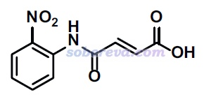

### 3.0 准备工作：构造簇模型

NAOB.cif对应的晶体结构如下，可见连一个完整的分子都没有，因此在进行HS分析之前，我们显然得先构造出中心分子+周围分子的团簇结构才行。

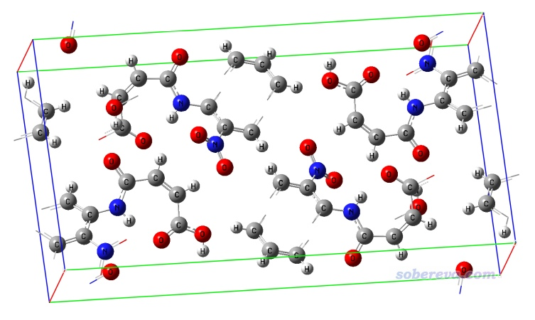

为了构造簇模型，启动Multiwfn，然后载入NAOB.cif，之后输入  
300  //主功能300  
7   //几何相关操作  
25  //构造“中心分子+临近一圈分子”的团簇  
1  //当前晶胞里1号原子所在的分子将被作为中心分子（由于NAOB晶体里所有分子都是等价的，所以当前随便输入一个原子序号即可）  
[回车]  //代表若一个周围分子与中心分子间最近原子对距离小于这俩原子的范德华半径和的1.2倍，则这个周围分子就被整个纳入团簇

Multiwfn瞬间就构造出了团簇，从屏幕上的提示可看到这个簇有375个原子，并且屏幕上还巨贴心地把中心分子中的原子序号给了出来，此例为1-10,17-19,22-25,205-210,214,215。把这个序号记下来，之后HS分析时要用到。

现在可以选当前菜单中的选项0看一眼新构造出的团簇是什么样，如下所示，可见非常理想，确实是中心分子被周围一层分子所围绕（为了中心分子看得清楚，在Multiwfn图形界面的菜单栏里选了Other settings - Set atom highlighting，然后输入了前述的中心分子里的原子序号，使中心分子用青色高亮了）。

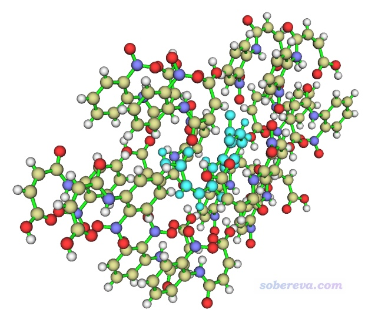

点图形界面右上角的RETURN按钮关闭图形窗口，然后选择-2 Output system to .pdb file并输入NAOB_cluster.pdb，以将当前簇结构导出为当前目录下的这个文件。这个pdb文件在本文的文件包里也提供了。

注：如《实验测定分子结构的方法以及将实验结构用于量子化学计算需要注意的问题》（<http://sobereva.com/569>）所强调的，由于X光衍射实验一般难以确定氢原子的准确位置，因此原理上做HS分析之前最好先固定重原子而优化一下所有氢原子的位置。用免费高效的CP2K程序对晶体结构优化氢原子位置然后再用Multiwfn抠团簇，或是先抠团簇再用Gaussian等量子化学程序优化氢，都是可以的。

### 3.1 绘制电子密度着色的Hirshfeld surface图

这一节演示绘制基于准分子近似的电子密度着色的Hirshfeld surface图，这是HS分析最重要的一种图。除了Multiwfn外还会用到非常流行的VMD可视化程序，可以在<http://www.ks.uiuc.edu/Research/vmd/>下载，使用笔者现在用的VMD 1.9.3版肯定没问题，用其它版本不保证能按照本文的例子正常作图。

启动Multiwfn，载入上一节产生的NAOB_cluster.pdb，然后输入  
12  //定量分子表面分析  
1  //选择定义表面的方式  
5  //Hirshfeld surface  
1-10,17-19,22-25,205-210,214,215   //中心分子的原子序号  
0  //开始分析

从屏幕上可以看到许多信息，以下两条是值得注意的，第一个是Hirshfeld surface包围的体积，相当于分子晶体中属于这个中心分子的体积，第二个是Hirshfeld surface的面积  
Volume:  1644.06256 Bohr^3  ( 243.62494 Angstrom^3)  
 Overall surface area:         859.01840 Bohr^2  ( 240.54965 Angstrom^2)

现在看到了后处理菜单。选择-2在当前目录下导出surf.cub，它是中心分子的Hirshfeld权重的格点数据。再选13，Multiwfn会计算被映射的函数的格点数据并导出为当前目录下的mapfunc.cub。在这个界面里如果选择-3也可以直接在Multiwfn里预览Hirshfeld surface，但没有着色效果。

将刚刚产生的surf.cub和mapfunc.cub以及Multiwfn自带的examples\scripts\目录下的hirsh_rho.vmd作图脚本一起拷到VMD目录下（即启动VMD后在其文本窗口里运行pwd命令看到的目录）。启动VMD，在文本窗口里输入source hirsh_rho.vmd来执行作图脚本，然后就看到了下图。

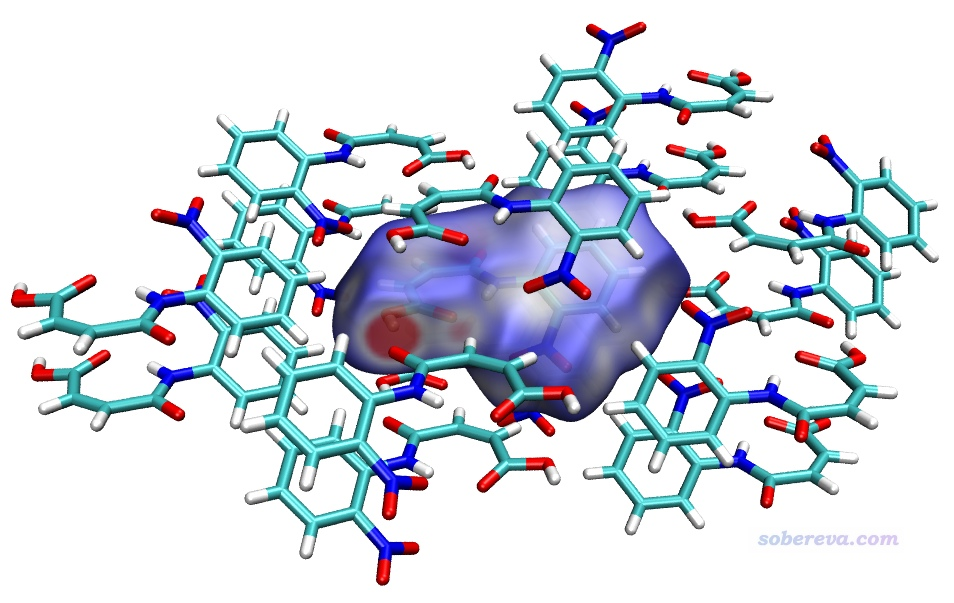

上图显示出了中心分子的Hirshfeld surface，并根据电子密度进行了着色。通过hirsh_rho.vmd脚本里的mol scaleminmax top 1 0.0 0.015这条命令可知，默认用的色彩刻度范围的下限和上限分别为0和0.15。根据脚本里color scale method BWR这行命令可知，当前用的色彩变化是蓝-白-红，色彩变化示意图在Graphics - Colors - Color Scale里可以看到。因此上图中越红的地方就是Hirshfeld surface上电子密度越大的地方，无疑对应于越强的相互作用。上图中有一块非常大的红色，这对应于中心分子羧基的O-H作为氢键给体、周围一个分子的O作为氢键受体形成的显著的氢键作用区域。它的旁边还有一小块淡红色区域，对应于中心分子的羧基氧作为氢键受体与周围分子的C-H形成的弱氢键。上图中还有一些发白的区域，在VMD里旋转图像仔细观察的话可以看到对应的是比较远距离的C-H...O-N很弱氢键，以及pi-pi堆积和普通色散吸引作用显著的区域。这些特征区域都可以自行用powerpoint之类画个箭头标注在图上便于读者看清楚。上图还有很多偏蓝色的区域，这些地方电子密度接近0，因此不牵扯任何值得一提的分子间相互作用。特别蓝的地方也往往对应于分子晶体中的孔洞区域，这种地方电子密度自然特别低，非常建议感兴趣的读者按照《使用Multiwfn计算晶体结构中自由区域的体积、图形化展现自由区域》（<http://sobereva.com/617>）介绍的方法作图考察。

要注意中心分子与各个方向的周围分子都有相互作用，光是靠一张图的话很难展现完整，因此文章中可以多给几张图展现不同视角的Hirshfeld surface图。

下面再说一下怎么改进作图效果。Hirshfeld surface图的效果受到多方面影响：  
(1)光源。可以通过VMD的Display菜单里的Lighting选项设置打开哪些光源。如果选Mouse - Move light，然后在图形窗口中拖动，还可以移动特点光源的位置。  
(2)材质。hirsh_rho.vmd默认对等值面用Translucent材质，可以自行在Graphics - Materials界面里对这个材质的具体定义进行调节。  
(3)Graphics - Representation界面里的作图设置。里面可以创建更多Rep，每个Rep都可以独立设置颜色和材质，并且通过选择语句可以定义各个rep显示的原子，不懂选择语句怎么写的话参考《VMD里原子选择语句的语法和例子》（<http://sobereva.com/504>）。特别值得一提的是，当前的图中每个分子都有一个独立的residue编号并被分子中所有原子所共享，因此可以利用residue选择特定分子。若想查询某个分子的residue号，就选Mouse - Query，然后点击这个分子上任意一个原子的正中央，在VMD的文本窗口中就能看到它的residue号了。

为了让上面例子的图像效果更好，我在VMD的Graphics - Representation里做了些修改：把第1个rep设为了residue 0专门用于显示中心分子，用CPK方式显示并把Bond Radius设为了0.5。点击Create Rep按钮新增一个Rep，选择语句用residue 7 11 5使得三个与中心分子作用显著的分子显示出来，Material设Edgy，Drawing Method用Licorice，把Bond Radius设成0.1。点击用来显示Isosurface的那个Rep，再选择Trajectory标签页，在里面把色彩刻度上限设为0.012（注意文本框只显示两位小数，输入0.012后按回车会如实设为0.012），使得着色的色彩显得更鲜明。在Display菜单里把所有四个光源都打开。最后选File - Render，选择Tachyon(Internal)进行渲染。之后在图像上展现特征作用的地方通过powerpoint进行标注，并且把Graphics - Color - Color Scale里显示的色彩刻度条挪到图上并适当拉伸、标记上色彩刻度上下限。最终得到下图，可见对相互作用展现得非常直观清楚。

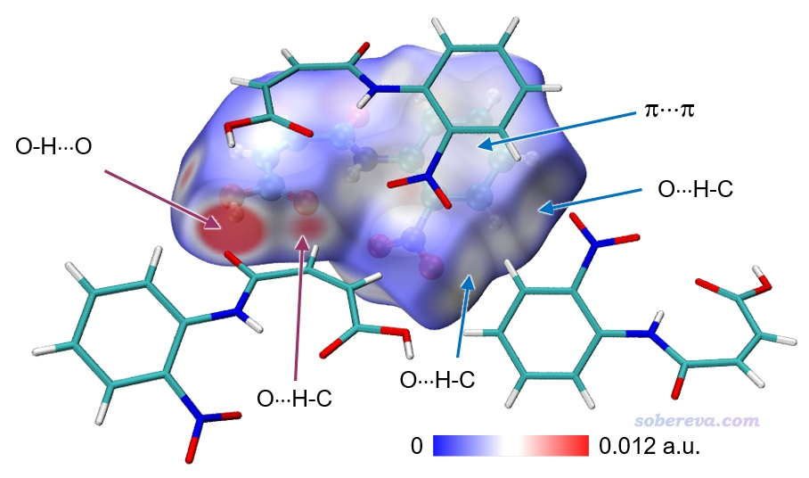

如果要绘制d_norm着色的Hirshfeld surface图，与上面的例子只有两个差别  
(1)进入主功能12并选择用Hirshfeld surface方式定义分子表面后，选择2 Select mapped function，再选d_norm。然后再开始分析  
(2)作图使用Multiwfn目录下examples\scripts\里的hirsh_dnorm.vmd代替hirsh_rho.vmd  
由于d_norm着色的图明显不如电子密度着色的图色彩变化平滑，在很多地方有颜色的突越不好看，故这里就不多说了。

Multiwfn还可以给出Hirshfeld surface上被映射的函数（当前为电子密度）的极大点的位置和数值，便于定量对比讨论。在Multiwfn后处理菜单中选8 Export all surface vertices and surface extrema as vtx.pqr and extrema.pqr，此时当前目录下就出现了vtx.pqr和extrema.pqr，分别记录了所有表面顶点和表面极值点的坐标和被映射的函数数值。如屏幕上的提示所示，extrema.pqr里碳和氧原子分别用于记录表面极大点和极小点，此文件在本文的文件包里也提供了。按前文用hirsh_rho.vmd作图后，将extrema.pqr载入VMD，将其显示方式设为VDW并把Sphere Scale设为0.2，颜色用黄色，此时看到下图，每个黄色小球都对应Hirshfeld surface上电子密度极大点位置。

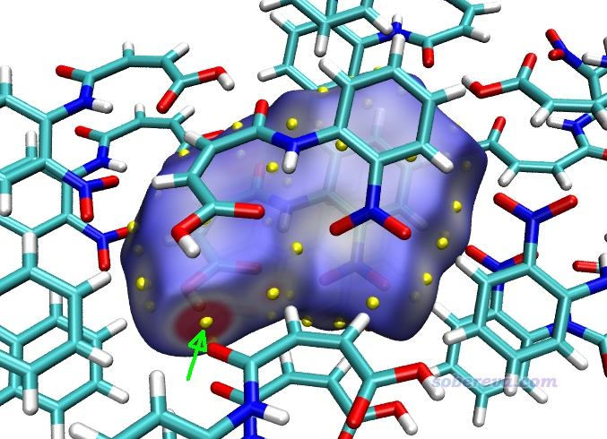

若想查询表面极值点处的电子密度数值，就在VMD里选Mouse - Query，然后点击要考察的黄球的正中心，文本窗口就出现了它的index号，从0开始记。上图箭头所指的那个对应O-H...O作用的极值点的index为9，相当于从1开始记的编号为10。打开extrema.pqr，找到对应10号碳的下面这一行，倒数第3列的数值0.04228468就是此处的电子密度了，单位为a.u.。  
HETATM   10  C   MOL A   1      -1.214   3.606   5.014   0.04228468   1.0000 C  
以类似的方式查询旁边那个C-H...O氢键对应的Hirshfeld surface上的电子密度极大点，数值为0.01093053，可见作用显著弱于O-H...O。

### 3.2 绘制指纹图

这一节绘制HS分析中很常见的指纹图。先按上一节的过程做HS分析并进入到主功能12的后处理菜单，然后输入  
20  //指纹图与局部接触分析  
0  //开始分析  
计算很快就完成了，然后看到一个新的后处理菜单，里面的选项不言自明。直接选0就会在屏幕上显示完整的指纹图，选1就会把指纹图保存为当前目录下的pdf文件（程序用pdf格式是因为它可以无损缩放、线条平滑），此pdf文件已经提供在了本文的文件包里（NAOB_HS.pdf）。当前的图像如下

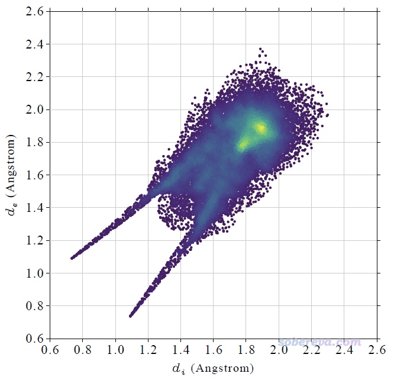

这个指纹图里每一个小点都是一个Hirshfeld surface上的顶点，并且根据点在指纹图上的分布密度进行了着色，越密的地方颜色越黄，越稀疏的地方颜色越紫。Multiwfn自动根据指纹图上的最大分布密度设置色彩变化范围的上限。Multiwfn画指纹图用的这种色彩过度方式称为viridis，用Google搜图功能一搜viridis就能找到相应的色条。

上图在左下角有两个显著的尖儿（spike。儿化音明确体现这是个名词），是图像的特征区域，相当于“指纹”。靠左的那个尖儿的顶端大约是d_i≈0.7、d_e≈1.1位置，此处d_e显著大于d_i，这是此体系具有氢键给体特征的体现（如上一节所示此体系的羧基氢确实是氢键给体）。为什么这个尖儿的存在能体现此分子存在氢键给体？因为这说明在Hirshfeld surface的这个区域，中心分子的原子到表面的最近距离（d_i）显著小于周围分子的原子到表面的最近距离（d_e），只有当氢键跨越这个区域，半径很小的氢在表面内、半径较大的重原子在表面外的时候才会出现这种情况，如下图所示。

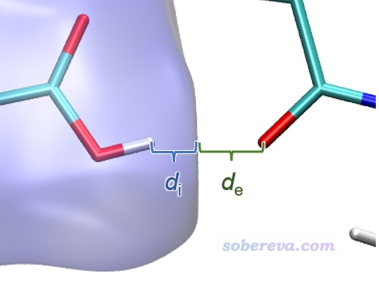

显然不难理解前面的指纹图中靠下的那个在d_e≈0.7、d_i≈1.1的尖儿体现的是中心分子作为氢键受体与周围分子形成的氢键跨越了Hirshfeld surface。所以指纹图说明当前研究的NAOB分子同时作为氢键给体和氢键受体。

指纹图还蕴含了更多信息，但当前的指纹图的中间区域密密麻麻一片，很难直接讨论，进一步考察就需要利用下一节的局部接触分析了。

顺带一提，如果你想改变指纹图上的点的密度，可以在主功能12里做分析之前先选择3 Spacing of grid points for generating molecular surface修改格点间距，格点间距越小则产生的Hirshfeld surface上的点就越多，指纹图也会越密。

### 3.3 局部接触分析与局部指纹图

这一节演示一下怎么对中心分子特定的原子与周围原子特定的原子进行局部接触分析并绘制与之对应的指纹图。作为例子，这里考察中心分子的氧与周围分子的氢的局部接触情况。

按照上一节说的进入到主功能12的后处理菜单中的20 Fingerprint plot and local contact analyses选项后，输入以下内容  
1  //设置内部原子范围。默认是所有中心分子的原子都包括  
[回车]  //代表对原子序号不做限制  
O  //必须是氧元素  
现在中心分子的所有氧原子都纳入到了要考虑的内部原子范围了。然后再输入  
2  //设置外部原子范围。默认是所有周围分子的原子都包括  
[回车]  //代表对原子序号不做限制  
H  //必须是氢元素  
现在周围分子的所有氢原子都纳入到了外部原子要考虑的范围了。

选择0开始分析，算完后屏幕上显示以下信息，告诉你当前考察的这种接触面积是61.5 Angstrom^2，占Hirshfeld surface总面积的25.57%。  
The area of the local contact surface is    61.504 Angstrom^2  
 The area of the total contact surface is   240.550 Angstrom^2  
 The local surface occupies   25.57% of the total surface

然后在后处理菜单选择绘制指纹图，看到下图（对应本文文件包里的NAOB_HS_O-H.pdf）。此图中只有对应于当前考察的局部接触面上的顶点才被绘制为彩色，可见指纹图中d_e≈0.7、d_i≈1.1的尖儿确实对应于内O与外H的接触。

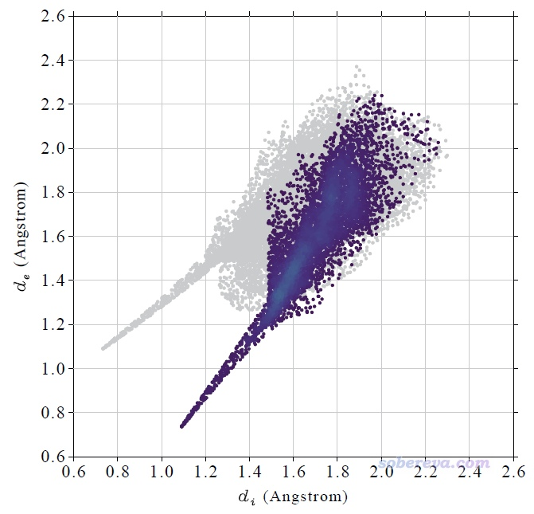

这种局部接触还可以在立体结构图上体现。在当前界面里选择4 Export surface points to .pqr file in current folder，然后当前目录下就产生了finger.pqr和finger_all.pqr，它们都提供在了本文的文件包里。前者记录的是当前指定的局部接触表面上的顶点，后者记录的是完整的Hirshfeld surface上的顶点。它们可以用文本编辑器打开，可以看到每个表面顶点在pqr文件里用一个碳原子表示，倒数第三列记录的是Charge属性，当前被用来记录表面顶点上被映射的函数数值，对当前来说就是准分子电子密度，单位为a.u.。

为了得到同时展现体系结构和局部接触表面的图，现在将NAOB_cluster.pdb载入VMD并恰当设置显示方式，再把finger.pqr载入VMD，在Graphics - Representation里将它的Drawing Method设为Points并恰当设置Size，Coloring Method设为Charge（即根据Charge属性着色），在Trajectory标签页里把色彩刻度设成与之前绘制等值面图用的相同的0到0.012。确保Display - Rendermode已经设为了GLSL。在Graphics - Colors - Color Scale里把色彩刻度设为与之前相同的BWR，现在看到的图如下，确实这些局部表面只对应中心分子的氧和周围分子的氢的接触。

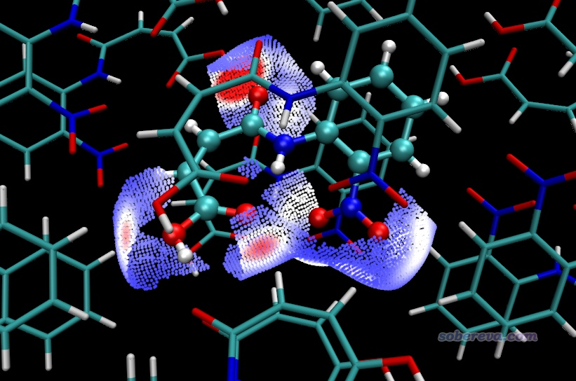

也可以先用hirsh_rho.vmd照常绘制完整的Hirshfeld surface图，然后再载入finger.pqr，把Drawing Method设为VDW并把Sphere Scale设为0.1，并且对Charge属性用0到0.012色彩刻度范围着色，此时看到的图像如下，局部接触部分以小球形式着重展现了。

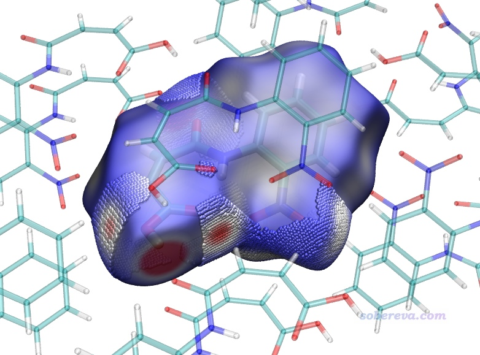

下面再做个演示，对中心分子的芳环和周围分子的芳环之间考察局部接触，展现它们之间的pi-pi堆积。在GaussView里，或者在VMD里使用我在《在VMD中显示原子序号的方法》（<http://sobereva.com/197>）中提供的脚本，都可以在它们载入NAOB_cluster.pdb后显示出原子序号，可以看到中心分子的芳环的原子序号是7-9,205,207,209。与中心分子芳环较近因而有pi-pi堆积作用的周围分子的芳环有两个，原子序号为11,13,15,112,114,116,201-203,356-358。因此，进入前述的Multiwfn的20 Fingerprint plot and local contact analyses选项后，输入  
1  //设置内部原子范围  
7-9,205,207,209  //原子序号范围  
[回车]  //对元素不做限制  
2  //设置外部原子范围  
11,13,15,112,114,116,201-203,356-358  //原子序号范围  
[回车]  //对元素不做限制  
0  //开始分析  
4   //导出finger.pqr和finger_all.pqr

然后按照上一节的方法，用hirsh_rho.vmd绘制出Hirshfeld surface，再将finger.pqr载入VMD并恰当设置显示方式。显示体系结构的rep的选择语句写residue 0 1 11，其中residue 0是中心分子，residue 1和11对应与它有pi-pi堆积作用的上、下两个分子。然后在Display - Material里把Translucent材质的Opacity改为0.5以降低透明度，并打开Angle-Modulated Transparency选项使得等值面立体感更强一些。之后看到的图如下，可见小圆球把中心分子芳环上下两侧的pi-pi堆积对应的接触区域都清晰展示了出来。

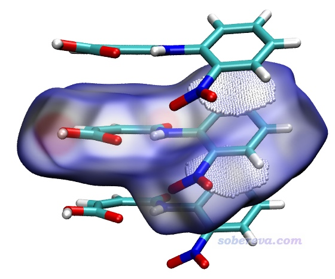

在Multiwfn里显示出相应的局部接触表面的指纹图，如下所示。由于碳的原子半径不小，因此pi-pi堆积对应的局部表面与表面内和表面外的碳原子都有一定距离，而碳原子间距离若太远也不会有pi-pi堆积效应，因此这些表面顶点在指纹图中的位置是d_i和d_e都不大不小的区域。

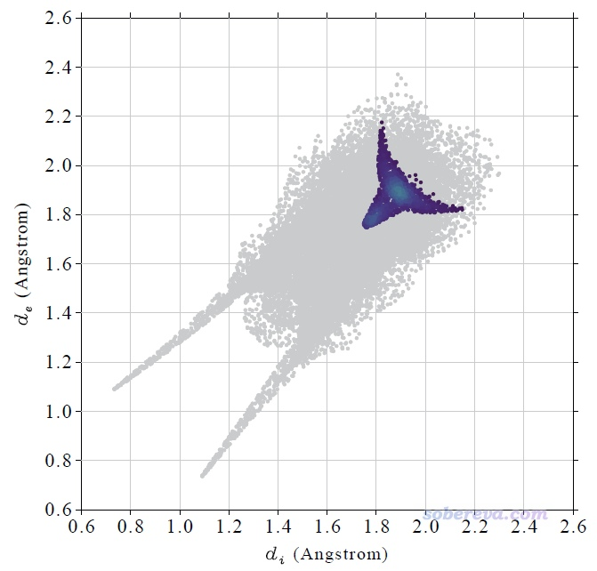

### 3.4 统计不同元素间的接触面积

如果想得到中心分子与周围分子的每一对元素之间的局部接触面积，虽然通过前面演示的局部接触分析可以手动实现，但有多少种元素组合就得操作多少次，很麻烦。因此Multiwfn提供了一次性完成的功能。进入前述的Multiwfn的20 Fingerprint plot and local contact analyses选项后，不需要定义内部外部原子，直接选择选项3 Calculate contact area between different elements，就可以马上得到以下信息

Inside element, outside element, their contact area (Angstrom^2) and percentage (%)  
  H-H        47.330      19.676  
  H-C        10.423       4.333  
  H-N         0.521       0.216  
  H-O        56.618      23.537  
  C-H        12.821       5.330  
  C-C        22.304       9.272  
  C-N         2.614       1.087  
  C-O         4.552       1.892  
  N-H         0.876       0.364  
  N-C         2.546       1.059  
  N-N         0.464       0.193  
  N-O         1.910       0.794  
  O-H        61.504      25.568  
  O-C         4.280       1.779  
  O-N         1.816       0.755  
  O-O         9.970       4.145

The same as above, but do not distinguish inside and outside elements  
  H-H              47.330      19.676  
  H-C/C-H          23.244       9.663  
  H-N/N-H           1.396       0.581  
  H-O/O-H         118.121      49.105  
  C-C              22.304       9.272  
  C-N/N-C           5.160       2.145  
  C-O/O-C           8.831       3.671  
  N-N               0.464       0.193  
  N-O/O-N           3.727       1.549  
  O-O               9.970       4.145

Area of total contact surface is   240.550 Angstrom^2

可见以上信息包含了每一对元素的分析结果。例如O-H        61.504      25.568这一行代表中心分子的氧元素与周围分子的氢元素之间的局部接触面积是61.504 Angstrom^2，占总面积的25.568%，这和3.4节我们专门算的结果完全一致。而后面输出的比如H-O/O-H         118.121      49.105代表不管O和H谁在表面内、谁在表面外，两种元素之间的接触面积总共是118.121 Angstrom^2，占总面积的49.105%。

为了看起来更直观，可以把上面的三列形式的数据拷到txt文件里，然后拖到Origin中导入，再绘制饼形图，如下所示，一目了然。图中只有占比相对较大的几种接触直接标注了数值。

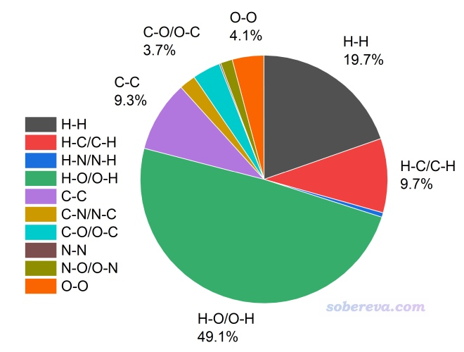

### 3.5 Hirshfeld surface等值面的截断问题

Multiwfn在构造Hirshfeld surface之前，需要先对一个矩形区域（称为“盒子”）中均匀分布的格点计算你设定的体系片段的Hirshfeld权重。盒子范围是对你定义的片段往各个方向延展一定距离来确定的，延展距离是位于最边界的原子的范德华半径乘以一个系数得到的。默认的系数值是1.7，一般来说够大了，但如果Hirshfeld surface延伸到距离当前片段较远的地方，导致超过了盒子范围，则Hirshfeld surface就会在相应地方被截断，等值面在那个地方看起来就会有窟窿。此时如果你想要让等值面完整、完全封闭，显然就需要增大系数。这一节拿富勒烯晶体举个例子。

本文文件包里的C60.cif是C60富勒烯晶体结构文件。按照3.0和3.1节的做法抠团簇、绘制电子密度着色的Hirshfeld surface，会得到下图。这里我在Graphics - Representation里选择显示等值面的那个Rep后在界面右下角Show旁边的下拉框里选择了Box+Isosurface，这样除了等值面外，盒子范围还会用细线同时显示出来。由下图可见，等值面上有个难看的窟窿，因为6个富勒烯之间有孔洞区域，Hirshfeld surface实际上会延伸到这里，但当前被尺寸有限的盒子截断了。

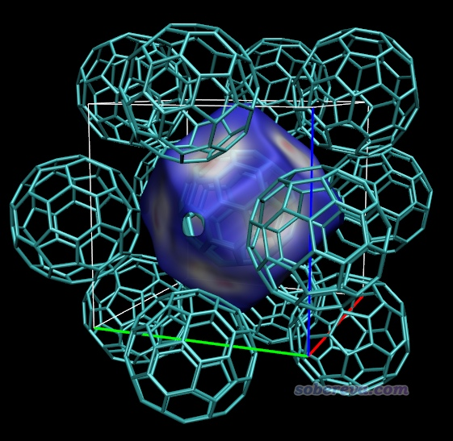

当你发现存在这样的窟窿，想通过增大延展距离来避免，就应当从主功能12的后处理菜单返回之前的菜单（即刚进入主功能12看到的菜单），然后输入  
4  //高级选项  
1  //设置确定延展距离用的范德华半径的倍数  
2.3   //设一个比原本更大的值，数值可以反复尝试。设得越大，盒子就越大，格点数就越多，计算耗时就越高、产生的cub文件尺寸就越大。由于之前的等值面只有一个小窟窿，所以盒子再大一点就够了，因此当前尝试的2.3比之前默认的1.7没大太多  
0  //返回  
0  //开始计算

之后按照之前的步骤绘制Hirshfeld surface图，如下所示，窟窿已经没了。当前的Hirshfeld surface是个正十二面体，每个面都有块白色且中间偏红的区域，清楚地展现出中间的富勒烯和周围富勒烯在此处有显著的pi-pi堆积作用，由于这些区域离碳原子不远因此电子密度不是很小。而表面上蓝色部分都是晶体中的缝隙、孔洞区域，电子密度极低。

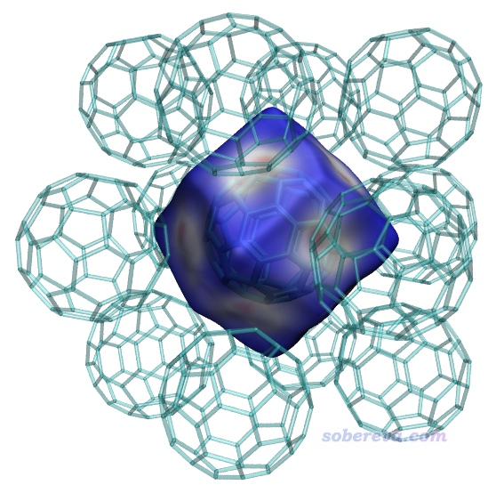

顺带一提，此体系的指纹图如下所示。绘图前用Multiwfn菜单里的选项3 Set range of axes适当加大了上限。可见散点的分布区域很窄，各处d_i和d_e数值都差不多大，涵盖从中等到较大范围。这体现出表面顶点基本都是位于中间分子和周围分子之间的正中央区域，并且中间分子和周围分子有的地方挨得近（d_i和d_e为中等大小），有的地方离得远（d_i和d_e较大）

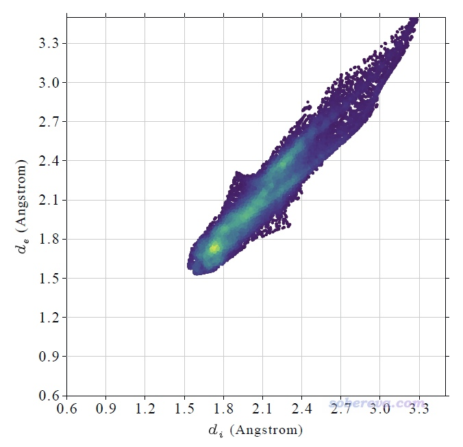

## 4 将Hirshfeld surface分析用于分子复合物

这一节示例HS分析用于展现孤立体系中的片段间相互作用。片段是指一批原子的集合，可以根据需要自由定义，比如既可以是分子复合物中的一个或多个分子，也可以是一个分子中的一个基团，也可以是一个过渡金属配合物中的一个或多个配体，等等。对于孤立体系，由于感兴趣的片段通常不是像晶体环境一样被其它原子所完整包围的，所以相应的Hirshfeld surface通常是开放的而不是完全封闭的。

笔者之前做了大量的和18碳环及其衍生物有关的研究工作，汇总见<http://sobereva.com/carbon_ring.html>。其中研究了具有双环特征的OPP分子与18碳环的结合问题，成果介绍见《8字形双环分子对18碳环的独特吸附行为的量子化学、波函数分析与分子动力学研究》（<http://sobereva.com/674>）和《理论设计新颖的基于18碳环构成的双马达超分子体系》（<http://sobereva.com/684>）。研究中使用了IGMH方法直观展现了OPP与18碳环之间的弱相互作用，此例通过绘制电子密度着色的Hirshfeld surface图也来展现一下。

上述研究中使用DFT优化出来的OPP结合一个18碳环的结构文件是本文文件包里的C18-OPP.pdb。将之载入Multiwfn，然后进入主功能0，会发现此结构文件中18碳环是斜着的，而由于HS分析用的盒子的边框总是平行于笛卡尔轴的，因此直接对它产生Hirshfeld surface的话表面开口的地方也将是斜着的，看着很恶心。因此此例做HS分析之前还需要先用《Multiwfn中非常实用的几何操作和坐标变换功能介绍》（<http://sobereva.com/610>）里介绍的功能令18碳环平行于XY平面，如下所示。

启动Multiwfn，载入C18-OPP.pdb，然后输入  
300  //其它功能（Part 3）  
7  //对当前体系做几何操作  
11  //令一批原子拟合的平面平行于某个笛卡尔平面  
225-242  //18碳环的原子序号  
1  //平行于XY平面  
现在可以选0在图形界面观看当前结构，会发现确实18碳环已经在XY平面上了。点RETURN关闭图形窗口，然后接着输入  
-10  //返回  
0   //返回到主菜单  
12   //定量分子表面分析  
1  //设置表面的定义  
5  //Hirshfeld surface  
225-242  //18碳环的原子序号  
4  //高级选项  
1  //设置定义盒子延展距离用的范德华半径的倍数  
2.3  //比默认值更大，实测不这样的话会导致不好看的截断  
0  //返回  
0  //开始分析  
-2  //导出surf.cub  
13  //导出mapfunc.cub

现在基于surf.cub和mapfunc.cub用hirsh_rho.vmd照常绘制Hirshfeld surface图。这里我把VMD的四个光源都打开了，18碳环用CPK方式显示，双环OPP分子用Edgy材质。为了着色效果更鲜明，色彩刻度上限设为了比默认更小的0.01。此时图像如下所示，可见白色和偏红的条状区域把18碳环与OPP的pi-pi作用最强烈的区域展现得挺清楚，此处电子密度比周围相对更大。由于OPP的大环不是像18碳环一样理想的圆形，形状没有完美匹配，因此它们之间的相互作用明显不是处处均匀的。通过Hirshfeld surface的颜色可见，在大环末端，特别是两个大环连接区域，大环与18碳环的pi-pi作用都很弱、电子密度很低。当前的Hirshfeld surface在18碳环上、下方都是开口的，因为在这里被盒子边界截断了，显然这样的截断是理应有的，因为上下没有其它原子了，原理上就不可能是封闭的。

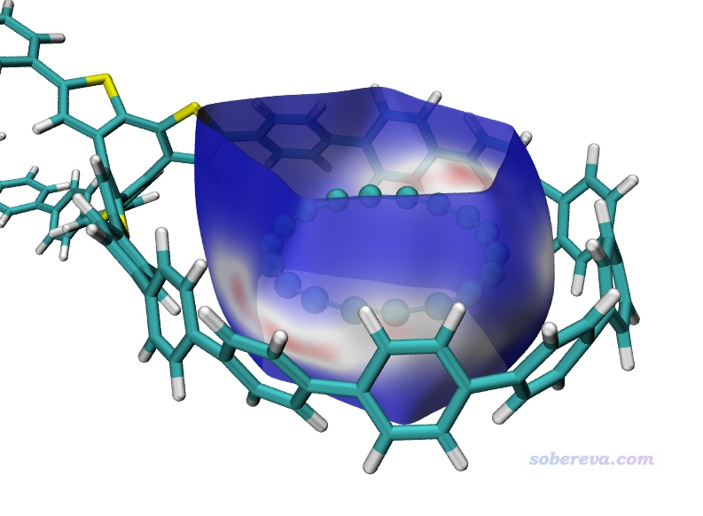

下面这张图是Comput. Biol. Chem., 101, 107786 (2022)中用Multiwfn+VMD画的Hirshfeld surface图，展现了配体和附近的蛋白质的氨基残基间的相互作用情况，效果不错，作用位点能看得比较清楚。

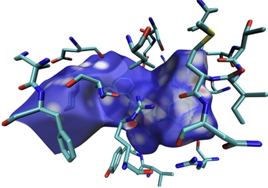

值得一提的是HS分析不仅限于用于考察弱相互作用，让Hirshfeld surface跨越化学键也完全可以。在《一篇最全面介绍各种弱相互作用可视化分析方法的文章已发表！》（<http://sobereva.com/667>）介绍的我的综述文章中给出了一个九并苯共价二聚体的例子，这里我也绘制了其电子密度着色的Hirshfeld surface，其中一个九并苯被定义为了片段，色彩刻度用0-0.01，图像如下所示。可见Hirshfeld surface正好严格平行于两个九并苯、精确处于二者之间。在两个九并苯之间形成共价键的区域及附近电子密度很大，颜色都为红色，而其它白色区域体现了九并苯之间的明显的pi-pi堆积作用。

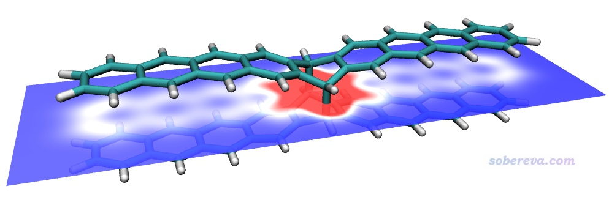

## 5 Becke surface分析一例：DNA

距离原子非常远的地方电子密度精确为0，这样的地方是没法计算Hirshfeld权重的，Hirshfeld surface也没法在这个区域出现，这是HS分析的一个缺点。如果极个别情况下被研究的片段与其它部分的接触面就是会牵扯到距离所有原子都很远的区域，那么这个时候就必须用我提出的Becke surface代替Hirshfeld surface了，因为在电子密度为0的地方也是可以计算片段的Becke权重的。除了这种极个别情况外没有用Becke surface的必要，图像效果不会更好，而且对大体系耗时更高。

这一节就以DNA双螺旋结构为例绘制做Becke surface分析。Multiwfn自带的examples目录下的DNA.pdb是一个DNA片段的结构文件，其中一条链的原子序号是1-319，它将被定义为片段。

启动Multiwfn，载入DNA.pdb，然后输入  
12  //定量分子表面分析  
1  //选择表面的定义  
6  //Becke surface  
1-319  //第一个片段的原子序号  
4  //高级选项  
1  //设置定义盒子延展距离用的范德华半径的倍数  
0  //倍数设为0，使得盒子紧贴着边界原子。因为感兴趣的相互作用区域是在两条链间，这样减小盒子尺寸可以避免Becke surface过大、延伸到不感兴趣的区域去  
0  //返回  
0  //开始计算  
在笔者的i9-13980HX笔记本上，用16核并行，花了15分钟。嫌慢的话可以用核很多的服务器。对于预览目的，也可以把格点间距设大到比如0.5，耗时只有原本的约八分之一，但此时图像会明显更为粗糙。

导出mapfunc.cub和surf.cub并照常用hirsh_rho.vmd绘图，得到的图像如下所示，可见Becke surface把两条DNA链间的接触面非常直观地展现了出来。在每一层的两个碱基之间都有两块红色区域，体现出两个典型氢键的存在导致相应地方电子密度相对较大。仔细看的话，会发现有的两块红色区域旁边还有一小块白色区域，这对应于C-H...O很弱的氢键。Becke surface的其它区域都是蓝色，说明两条链在其它地方并没有值得一提的相互作用（注意不能描述为“没有相互作用”，用词必须严谨。重原子间的色散作用能即便到了10埃也没完全衰减到0，两条链的骨架之间的色散作用对相互作用能的贡献不可完全忽略，只不过强度属于“不值得专门一提”的程度）

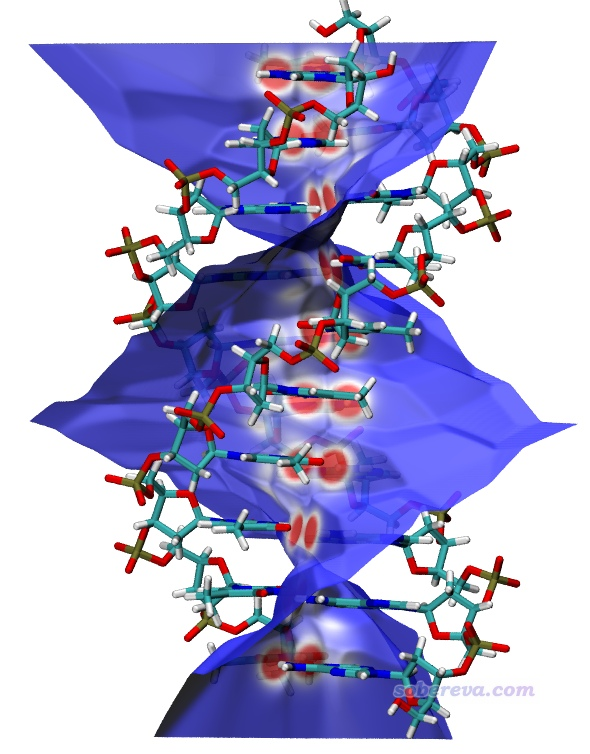

按照HS分析的做法也可以显示Becke surface的指纹图，如下所示，可见左下方存在两个尖儿，体现出每条DNA链既作为氢键给体也作为氢键受体和另一条链形成了氢键，和HS分析能展现的信息基本一致。但尖儿的具体位置不可能十分一致，毕竟Hirshfeld和Becke权重函数的定义方式差异显著。

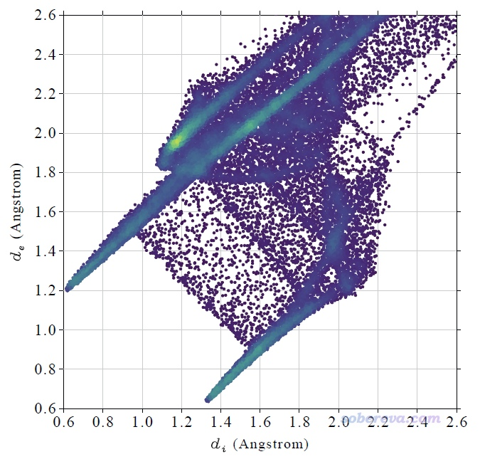

## 6 总结

本文介绍了HS分析的基本思想，并通过大量例子非常详细介绍了Multiwfn做HS分析的方法和很多要点。可见HS分析用起来灵活方便，可以较好地直观展现化学体系的特定片段与周围其它原子之间的相互作用。同样的目的用Multiwfn做基于电子波函数的IGMH分析也同样可以达到，而且IGMH原理更为严格，通过sign(lambda2)rho函数对等值面着色还能区分相互作用类型，还能给出各个原子的贡献量。HS分析可以作为IGMH分析的展现形式的补充，并且由于HS分析只依赖于原子坐标而且计算量很低，因此可以快速地用于很大体系，也不需要事先做量子化学计算产生电子波函数。注：只有原子坐标信息时也可以用Multiwfn做IGM分析，耗时也极低，但图像效果明显不及IGMH，参见《使用Multiwfn做IGMH分析非常清晰直观地展现化学体系中的相互作用》（<http://sobereva.com/621>）。

**最后提醒一下，使用Multiwfn做HS分析或Becke surface分析时请按Multiwfn启动时的提示恰当引用Multiwfn原文，对于给别人代算的目的也需要明确告知对方这一点。**
