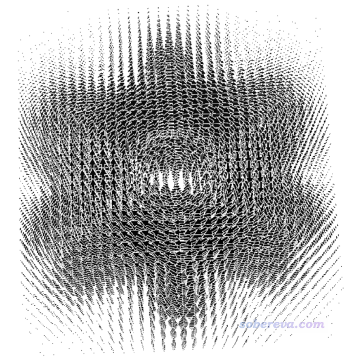
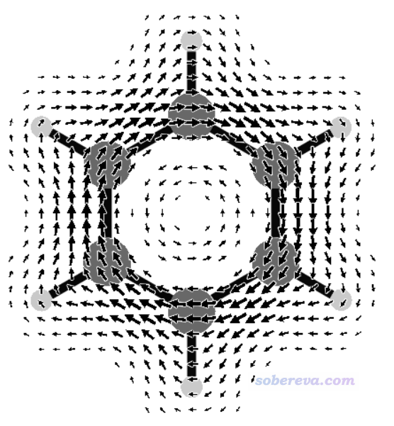
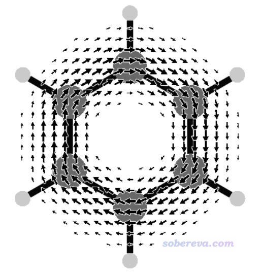
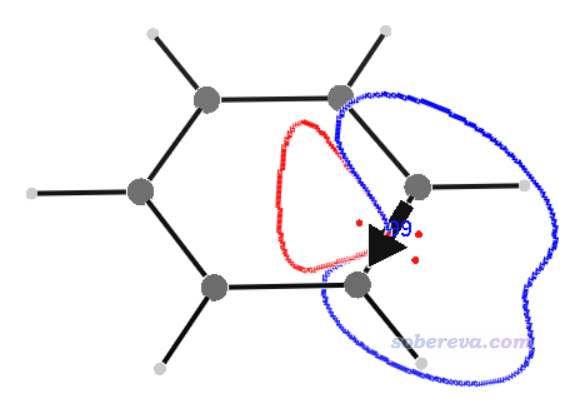
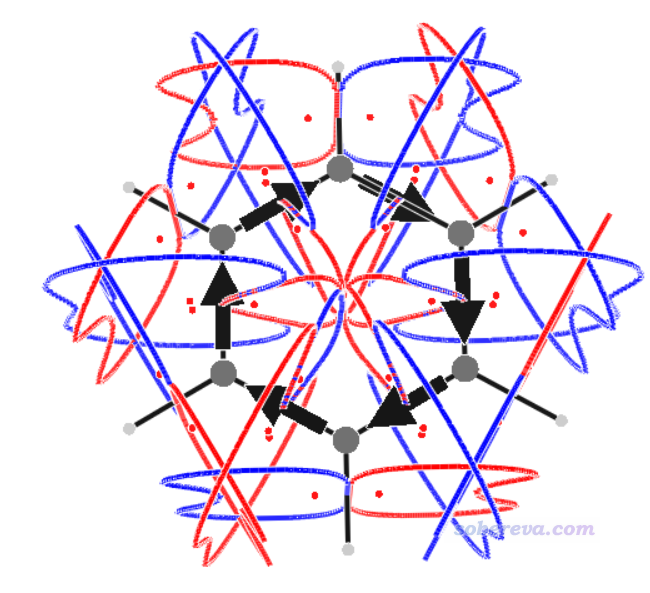
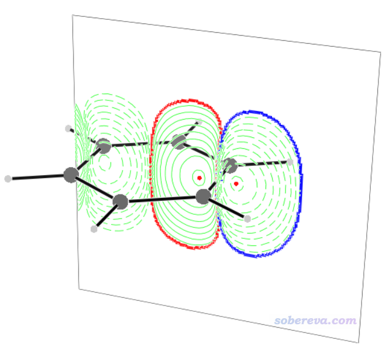

**使用SYSMOIC程序绘制磁感生电流图和计算键电流强度**

Using SYSMOIC program to plot magnetically induced current map and calculate bond current strength

文/Sobereva@[北京科音](http://www.keinsci.com)  2024-Feb-29

## 0 前言

笔者在《衡量芳香性的方法以及在Multiwfn中的计算》（<http://sobereva.com/176>）中介绍过，磁感生电流是一种重要、直观的考察分子芳香性的方式。SYSMOIC是一个基于continuous transformation of the origin of the current density (CTOCD)方法考察化学体系的磁感生电流相关问题的程序。本文将结合苯分子为例，介绍这个程序的最关键用法。SYSMOIC程序和相关原理的详细介绍可以看原文J. Chem. Inf. Model., 61, 270 (2021)。

AICD和GIMIC也是两个重要的考察磁感生电流的程序，笔者在下文有专门的介绍。这些文章里介绍的背景知识对理解本文很有帮助  
• 使用AICD 2.0绘制磁感应电流图（<http://sobereva.com/294>）  
• 使用AICD程序研究电子离域性和磁感应电流密度（<http://sobereva.com/147>）  
• 考察分子磁感生电流的程序GIMIC 2.0的使用（<http://sobereva.com/491>）  
• Utilizing AICD and GIMIC programs to study magnetically induced current density（<http://sobereva.com/148>）  
之所以笔者写此文介绍SYSMOIC，在于它对以上两个程序有明显互补性。AICD程序是将感生电流以箭头方式绘制在AICD的等值面上，而等值面以外区域的感生电流就无法在图上体现出来了，而且AICD没法给出感生电流的键截面积分值（键电流强度）来定量考察电流大小。SYSMOIC则能够给出三维空间或二维平面上的感生电流向量场图，从而能展现出AICD图表现不出来的信息，而且SYSMOIC还能非常方便地给出键电流强度。GIMIC程序虽然能做感生电流积分、结合Paraview程序能给出漂亮的向量场图，但是GIMIC却无法将感生电流分解成不同分子轨道的贡献，而SYSMOIC则能够方便地指定计算感生电流时只考虑或不考虑哪些分子轨道。可见SYSMOIC有独特的价值。

本文介绍的情况对应SYSMOIC 2024.1版，对其它版本不一定适用，请结合相应版本程序提示和手册随机应变。

《深度揭示互为等电子体的苯、无机苯和carborazine的芳香性的显著差异》（<http://sobereva.com/731>》介绍的笔者的Chem. Eur. J., 30, e202403369 (2024)文章中使用本文介绍的方法清晰直观地展现和讨论了苯、无机苯和carborazine芳香性的差异，**非常推荐阅读并将此文作为例子引用。**

## 1 SYSMOIC的基本特征

SYSMOIC是免费而不开源的程序，Windows、Linux、Mac版都有，可以在<http://SYSMOIC.chem.unisa.it/DISTRIB>下载。诸如STABIN_LNX-2024.1.tar.gz就是Linux的2024.1版可执行文件包。Linux版需要用较新的系统，笔者用Rocky Linux 9可以正常使用，CentOS 7.4用不了。

SYSMOIC是由一堆子程序组成的，对应压缩包里不同可执行文件，Windows版有.exe后缀，其它平台的没有。例如JBMAP子程序用于计算感生电流格点数据，BOCUST子程序用于计算键电流强度，等等。v3d子程序用来对其它子程序计算出来的.3d文件进行可视化，如绘制感生电流矢量图。各个程序的用法在SYSMOIC的在线手册<http://sysmoic.chem.unisa.it/MANUAL/>里都有说明。

SYSMOIC是解压即用的程序。解压后只需要把SYSMOIC目录加入到操作系统的PATH环境变量里（不会的话自行google），然后就可以在任何目录下输入子程序名直接使用了。

SYSMOIC有不少官方例子文件，是<http://sysmoic.chem.unisa.it/WORKED_EXAMPLES/>里的WORKEXA.tar.gz。例子按照体系/理论方法/基组对目录层级进行命名，里面RUN_TESTS文件是对例子体系做各种分析的shell脚本，可以从中看到都是以什么命令调用程序的，以及传入的命令文件是什么。REFERENCES目录下的文件是运行RUN_TESTS脚本后产生的.3d文件和程序输出信息，对前者可以直接用v3d作图。

SYSMOIC必须结合最主流的量子化学程序Gaussian使用，目前只支持闭壳层形式的HF和DFT。只需要用Gaussian做NMR计算的同时产生wfx文件，再用SYSMOIC自带的unpackwfx将之转化成fort.3、fort.11、fort.23、fort.28这四个二进制文件，之后就可以用JBMAP、BOCUST等子程序做各种计算了，算完了可以用v3d子程序直接作图。

## 2 产生苯的SYSMOIC输入文件

下面以最典型的芳香性分子苯为例，讲解SYSMOIC绘制感生电流矢量图和计算键电流强度的方法。其它的用法我觉得在一般研究中用到的机会很少，所以就不在本文介绍了，感兴趣者请看程序手册、原文并结合程序自带的例子文件摸索。下文涉及的各种输入输出文件都可以在<http://sobereva.com/attach/702/file.rar>中获得。

首先写一个在B3LYP/6-31G*级别下做NMR计算的Gaussian输入文件benzene.gjf，内容如下，在本文的文件包里已经提供了。其中的坐标是在当前级别下已经优化过的。NMR=CSGT要求以CSGT方法做NMR计算，out(wfx,CSGT)要求产生.wfx波函数文件，并且把CSGT计算过程中产生的扰动的轨道展开系数写入到wfx文件中，输出位置为末尾指定的D:\benzene.wfx。

# b3lyp/6-31g(d) NMR=CSGT out(wfx,CSGT)  
[空行]  
benzene  
[空行]  
0 1  
 C                  0.00000000    1.39621600    0.00000000  
 C                  1.20915900    0.69810800    0.00000000  
 C                  1.20915900   -0.69810800    0.00000000  
 C                  0.00000000   -1.39621600    0.00000000  
 C                 -1.20915900   -0.69810800    0.00000000  
 C                 -1.20915900    0.69810800    0.00000000  
 H                  0.00000000    2.48297800    0.00000000  
 H                  2.15032200    1.24148900    0.00000000  
 H                  2.15032200   -1.24148900    0.00000000  
 H                  0.00000000   -2.48297800    0.00000000  
 H                 -2.15032200   -1.24148900    0.00000000  
 H                 -2.15032200    1.24148900    0.00000000  
[空行]  
D:\benzene.wfx  
[空行]  
[空行]

算完后就有了benzene.wfx，确保它在当前目录下，并且已经把SYSMOIC目录加入到了PATH环境变量中，然后运行unpackwfx benzene命令，当前目录下立刻就出现了fort.3、fort.11、fort.23、fort.28，它们都已提供在了本文的文件包里。后文说的所有操作都是对于这四个fort文件都处于当前目录下的情况而言的。

注意当前的苯分子是处在Z=0的XY平面上，用Multiwfn载入Gaussian的out文件然后进主功能0，或者用GaussView载入out文件并显示笛卡尔轴，都可以确认这一点。后面我们要考察的都是外磁场方向垂直于苯环所导致的感生电流的情况。

## 3 绘制磁感生电流向量场图的例子

### 3.1 默认方式绘制

先来看怎么产生一个最简单的磁感生电流量场图，之后再解释细节。直接在命令行窗口输入JBMAP运行之，屏幕上会出现好多默认用的参数，比如下面这行，就是告诉你默认的外磁场是(0 0 1)矢量，显然正垂直于当前苯环，和我们期望的一致  
magnetic field...........B    0.0000    0.0000    1.0000

程序问你当前显示出来的参数是否ok，这里就直接按回车代表用默认的y（yes）。然后再依次问你三个问题：  
• external grid points y/n? [n]：即是否读取外部格点，这里直接按回车代表用默认的n（如果要计算的点不是均匀分布在一个矩形区域，而是比如分布在一个球层表面，就需要输入y并且提供格点定义文件）  
• reference arrow y/n? [n]：含义不明。直接按回车用默认的n  
• B direction y/n? [n]：即是否把外磁场箭头画在图上，直接按回车用默认的n。如果你想把外磁场箭头绘制在图上就输入y，并且输入箭头的位置和长度

马上当前目录下就有了JBM.3d文件。输入v3d JBM.3d通过v3d程序对这个文件作图，就蹦出了图形窗口，如下所示，可以看到在一个矩形区域内均匀分布的每个格点位置都有一个箭头指示此位置的磁感生电流的方向和大小。

想退出的话在图形窗口按ESC键，或者在文本窗口按ctrl+C。

上面的图非常丑陋，箭头特别拥挤，分子结构也看不清楚，完全没法用。下一节讲怎么对JBMAP的计算进行自定义。

### 3.2 自定义JBMAP的运行参数

JBMAP有两个方式指定运行参数，比如要把外磁场矢量改为0 1 1（程序自动会做归一化成为0.0000 0.7071 0.7071），既可以运行JBMAP -B 0 1 1命令，也可以先启动JBMAP然后直接输入B 0 1 1后按回车，在屏幕上显示的参数中都会看到外磁场矢量已经变更成自设的值了。

JBMAP命令后面可以直接接的选项可以输入JBMAP -h查看，其中几个关键的在这里提一下：  
-o：输出的.3d文件名，默认是-o JBM  
-f：原子球大小的倍数，默认为-f 0.2。想让作出的图里原子球大一些就把这个改大  
-B：外磁场矢量，默认为-B 0 0 1  
-j：感生电流类型，默认是-j TOT，即diatropic和paratropic的总和。写-j PARA代表只考虑paratropic部分，写-j DIA代表只考虑diatropic部分  
-q：考虑的轨道。例如只想考虑17 20 21三个分子轨道对磁感生电流的贡献，就写-q +3 17 20 21，只去掉15 16号分子轨道的贡献就写-q -2 15 16。默认是考虑所有分子轨道的贡献（只有占据轨道才有贡献）  
-m：设置SYSMOIC计算感生电流用的CTOCD方法的具体形式，参看<http://sysmoic.chem.unisa.it/MANUAL/S4.SS12.html>的说明。当基组是完备的时候这些方法结果等价。有些选项是仅对于某些方法才需要设，比如用common gauge-origin的时候需要用-g自定义原点坐标（默认为0 0 0）。默认用的CTOCD-DZ2基本上对于所有情况都是合适的选择，也不用设额外参数。关于CTOCD不同形式的介绍和差异，可以看前述的SYSMOIC原文以及感生电流综述文章WIREs Comput Mol Sci, 6, 639 (2016)的Continuous Transformations of the Origin of the Current Density一节。

JBMAP运行后可以修改的参数当中较重要的如下：  
• B：外磁场矢量，默认B 0 0 1  
• JTERM：感生电流类型，默认是JTERM 0，即diatropic和paratropic的总和。1和2分别代表paratropic和diatropic  
• RI和RF：分别指定格点所均匀分布的矩形盒子的X、Y、Z最小笛卡尔坐标和最大笛卡尔坐标。默认是根据体系坐标自动确定以覆盖整个体系。对上面的苯分子的例子，从屏幕上默认的参数可见，当前对应的是RI -6.0635 -6.6921 -2.0000和RF 6.0635 6.6921 2.0000  
• FATT：给感生电流乘的系数。比如大部分箭头在图上都显得很不显著，就可以设大这个值以更便于观看  
• FMM：磁感生电流过滤范围。例如FMM 0.01 1就代表忽略感生电流的模小于0.01和大于1的格点（是对乘上FATT之前而言的），免得干扰观看。默认0 0.1  
• STEP：格点间距，数值越小箭头越密、计算越耗时。默认0.4 Bohr  
• LUNA：0和1分别代表箭头的长度和面积正比于感生电流的模，默认是后者  
• METH：计算方法，默认的2对应CTOCD-DZ2

为了方便，我推荐以命令行方式运行JBMAP。交互式程序怎么以命令行方式运行，我在《详谈Multiwfn的命令行方式运行和批量运行的方法》（<http://sobereva.com/612>）里有很详细说明。下面以这种方式结合自定义参数用JBMAP再次对苯进行计算。创建一个文本文件叫CDMAP.txt，内容如下，每一行对应一条传给JBMAP程序的命令。此例RI和RF的Z值都是1，X和Y范围都是-6到6 Bohr，因此格点会分布在苯分子上方1 Bohr的XY平面上的正方形区域内。此文件后面的y、n、n、n对应交互式界面里程序向你提问时依次输入的四个指令。

B   0 0 1  
RI -6 -6 1  
RF  6  6 1  
FMM 0.01 1  
FATT 3  
STEP 0.4  
LUNA 1  
JTERM 0  
y  
n  
n  
n

运行JBMAP -f 0.5 < CDMAP.txt，然后再运行v3d JBM.3d，看到下图，可见清楚地把苯分子上方的磁感生电流描绘了出来。

再来看只考虑pi轨道时的磁感生电流图的绘制。把benzene.wfx文件载入Multiwfn，进入主功能0，按照《使用Multiwfn观看分子轨道》（<http://sobereva.com/269>）说的，从HOMO开始往下挨个看轨道，就能找到三个pi轨道，序号为17、20、21。原子数多的时候也可以用《在Multiwfn中单独考察pi电子结构特征》（<http://sobereva.com/432>）介绍的做法让Multiwfn自动找出来所有pi轨道序号。运行JBMAP -q +3 17 20 21 -f 0.5 < CDMAP.txt，然后再用v3d绘图，得到下图，这便是苯的pi电子的感生电流图了。相对于之前的所有电子贡献的图，此图少了sigma电子造成的出现在内环的逆时针（paratropic电流）特征，而且也没有了氢原子区域的感生电流，因为pi电子不在氢上。

### 3.3 v3d的使用细节

下面专门细谈一下v3d界面的操作。v3d图形窗口出现后，可以用鼠标拖动体系旋转视角。还可以在图形窗口处于激活状态下按h键，此时文本窗口会出现可以用的所有按键的功能说明。其中较重要的按键在这里说一下。

先说视角调节按键：  
a、b、g：视角由alpha、beta、gamma值定义，按a、b、g键会分别增加它们1.0。如果按住shift键再按，也即按A、B、G，会分别增加它们10  
• f和F：调节缩放因子。按一下f图像就会放大一点，按一下F就会放大很多  
• d和D：调节视角距离。按一下d就会增加0.1，按一下D就会增加1。视角距离越远，近大远小的透视效果越弱、越接近正交视角的效果（据我所知v3d没法完全用正交视角）  
• n和N：设置雾化距离阈值。超过视角一定距离阈值开始就会用雾化效果使得远处物体被屏蔽。按n增加阈值0.1，按N增加1.0  
• C：令图像居中

每次按以上按键调节设置的时候在文本窗口都会看到当前值。如果你想把这些键的操作效果反过来，比如按一次f就令图像缩小一点，那就先按一下c键进入反转操作状态（文本窗口里会看到c变成了c-1），然后再按f就行了。再次按c则还原到普通操作状态。

按p键可以把当前图像保存成当前目录下的.ps文件。这是矢量图像格式，在Windows下可以用装了ghostscript插件的irfanview或photoshop等程序打开，也可以用Acrobat distiller转成pdf再打开。在Rocky Linux、CentOS等系统里也自带了ps文件观看程序。

默认情况下产生的ps文件画出来的感生电流的箭头会有较厚的白边，当箭头多的时候白边会导致后面的箭头被遮挡，比较难看。解决办法是按一下c键先进入反转操作状态，然后按住k键一会儿使得白边量减小（文本窗口不会提示减小到了多少），然后再导出ps文件，然后就会发现白边非常细了。

如果想保存当前的作图设置，按S，当前目录下就出现了SpecialValues.txt文件，里面记录了作图设置，可以看到f、d等数值都记录在内。当再次启动v3d时，程序若发现当前目录下有这个文件，就会自动载入里面的设置。如果你希望每次产生的ps文件里箭头的白边都非常细，可以启动v3d后先直接按S保存一个记录默认状态的SpecialValues.txt文件，然后把里面对应白边粗细的ridfr前面的值改为0.1。这样每次启动v3d就会默认用这个设置了。

## 4 计算键电流强度

对键截面做感生电流积分的概念我在《考察分子磁感生电流的程序GIMIC 2.0的使用》（<http://sobereva.com/491>）中已经专门讲过了，这可以定量考察穿越特定化学键的电流强度从而便于对比，这在SYSMOIC里叫键电流强度。SYSMOIC算键电流强度远比用GIMIC更方便，都省得自己定义积分范围，结果还能直接可视化。下面我们对苯的一个C-C键计算键电流强度。

直接在命令行窗口中输入BOCUST命令运行此程序，程序首先会提示  
| plotted    12 atoms  
| plotted    12 bonds  
 ====> Pair C1    -  C2     distance=    1.396 Ang  
这说明程序发现有12个原子对儿的距离都处在默认的距离下限（0.9埃）和距离上限（1.6埃）之内。其中C1-C2是第一个原子对，现在问你是否对这个C1-C2键计算键电流强度。这里输入y然后按回车，很快就会出现结果  
CONTRIBUTION  1 -0.6000526E+00 AU -0.1690912E-07 SI  
CONTRIBUTION  3  0.1784109E+00 AU  0.5027513E-08 SI  
TOTAL CS ==>    -0.4216417E+00 AU -0.1188161E-07 SI  
(2) CS/CS0 RELBEN FICS     0.99    3.00  0  
上面显示的两个CONTRIBUTION分别是diatropic和paratropic对键电流强度的贡献，由于方向相反，显然符号相反。二者之和取绝对值0.4216417 a.u.就是键电流强度大小，换算成常用的nA/T单位就乘以28.179409，即11.88 nA/T。这个值与《考察分子磁感生电流的程序GIMIC 2.0的使用》（<http://sobereva.com/491>）在B3LYP/6-311G*级别通过GIMIC程序得到的12.086 nA/T非常接近。上面信息中的CS/CS0 RELBEN FICS     0.99代表当前值与参考值的比值是0.99。这里参考值是程序内置的对苯在某个级别计算的C-C键电流强度12 nA/T。

接下来程序又问你是否对C1-C6计算键电流强度。由于当前所有C-C键都是等价的，只需要计算一个就行了，因此输入N回车，程序就结束运行了。如果你想把所有键都进行计算，就接着输入11次y回车把剩下11个键都算完。当前体系一共6个C-C键、6个C-H键。

当前目录下出现了BCS.3d文件。运行v3d BCS.3d，就可以看到下图

此图里黑色箭头体现了C1-C2键电流的大小和方向。积分截面处在键的正中央并与键垂直，图中的曲线是这个截面上的感生电流0.001 a.u.等值线，曲线内部区域是对感生电流积分的区域，红色和蓝色分别对应paratropic和diatropic部分。可见diatropic分布在环的外侧，这与之前从向量场图中看到的顺时针环电流的主要分布是一致的。图中的红色小点对应截面上感生电流的极值点。键上面标的文字99对应于前述的参考比值0.99乘以100。文字出现的位置在键的正中央，不容易分辨，可以在图形窗口激活状态下按W键关闭文字显示，然后再自行ps上。

如果你想一次性把所有键的电流强度都计算，又不想一次次麻烦地输入y，那么可以写一个文本文件比如叫ally.txt，里面有12行，每一行都是y。运行BOCUST < ally.txt，这样所有键就都会被计算了。此时对得到的BCS.3d绘制会看到下图

下面介绍一下BOCUST运行时可以接的选项中比较重要的：  
-o、-f、-B、-m、-q等：和前面介绍的JBMAP程序的情况完全相同。即BOCUST也可以用-B指定外磁场方向、用-q指定考虑哪些轨道，等等。  
-d、-D：确定哪些原子对儿被考虑时用的距离下限和上限（埃），默认-d 0.9 -D 1.6  
-e：确定键截面上做积分的区域用的感生电流等值线的数值（a.u.），默认-e 0.001  
-CS0：参考电流强度（nA/T），默认-CS0 12  
-nocd：不显示积分区域和极值点。如果想让图上只有箭头而没有曲线和小点，应该加上这个  
-l [比值]：在截面上绘制感生电流的不同数值的等值线，后面跟的是相邻等值线数值的比值  
-C [粗细]：绘制截面的边框

例如这里计算C1-C2的sigma电子的键电流强度（即扣除三个pi轨道贡献），并在截面上显示等值线、显示边框，就运行BOCUST -q -3 17 20 21 -l 3 -C 5，然后输入y回车，再N回车。之后用v3d对BCS.3d作图看到下图。可见整个截面，以及里面的感生电流等值线，都显示得很清楚。由于这个截面上diatropic和paratropic的大小都差不多（毕竟苯分子没有sigma芳香性特征），所以键电流强度仅为0.007 a.u.。

## 5 总结

此文对分析磁感生电流的程序SYSMOIC做了介绍并给出了具体例子。由例子可见，通过SYSMOIC结合Gaussian绘制感生电流向量场图很方便，不需要借助第三方程序。SYSMOIC做键电流强度计算也很自动化，不需要像GIMIC那样谨慎地定义积分区域，而且键电流大小和方向还能直接通过箭头直观显示出来。SYSMOIC的计算速度也比较快。

本文只涉及了SYSMOIC最常用的功能，还另外有一些其它功能，比如对感生电流密度做拓扑分析，计算各种感生电流密度相关的场（ACID及其各向异性、磁屏蔽密度、vorticity张量的迹及其各向异性等）并绘制成等值面和填色平面图、计算任意格点上的感生电流张量和导数等等。

《详谈分子轨道对磁感生电流的贡献》（<http://sobereva.com/703>）和本文有密切关联，非常建议阅读。
