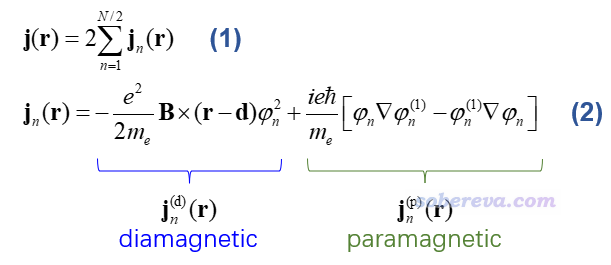
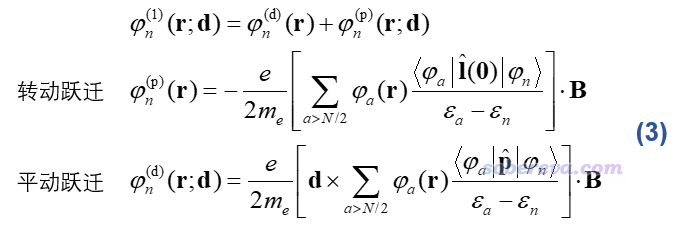
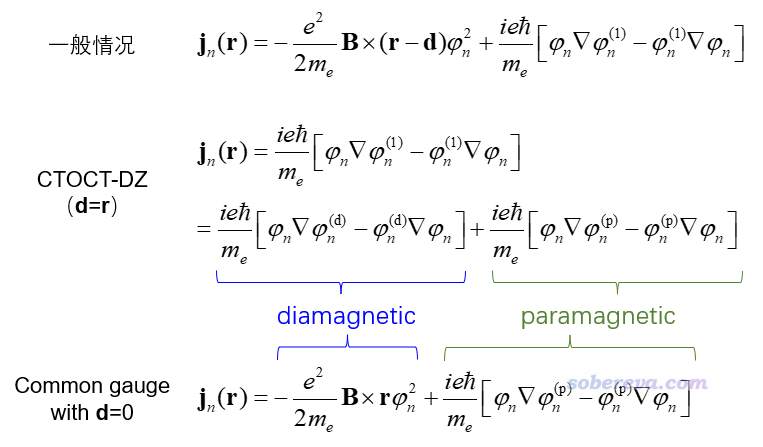
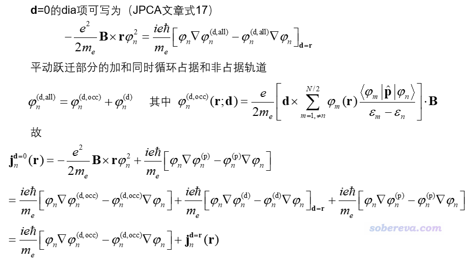
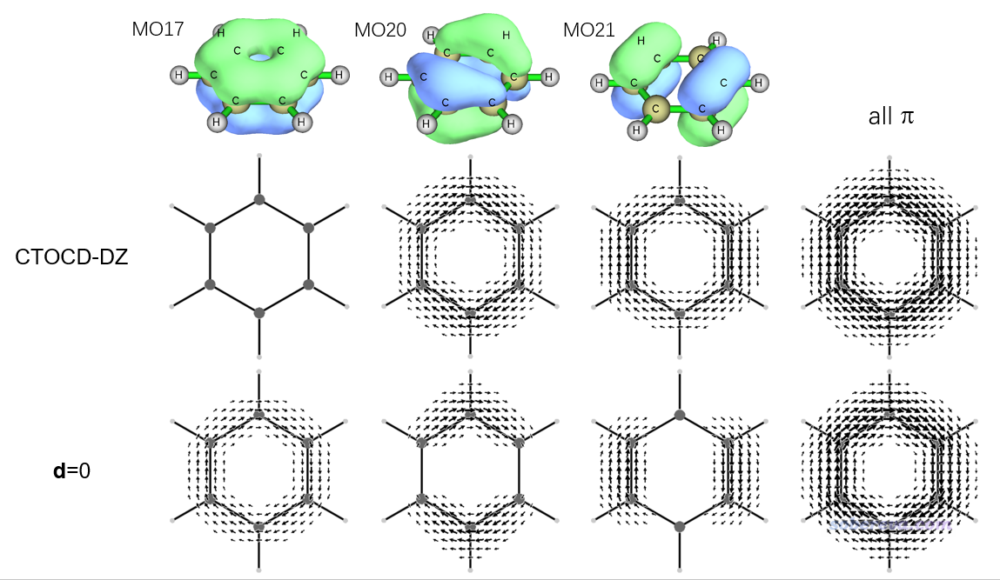
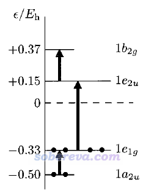
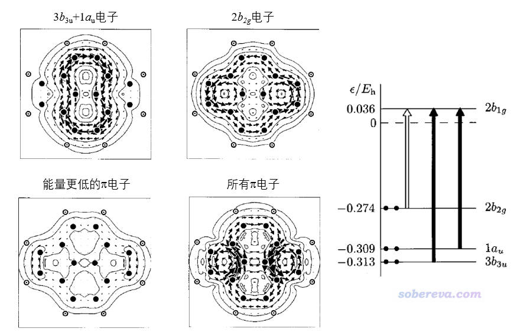
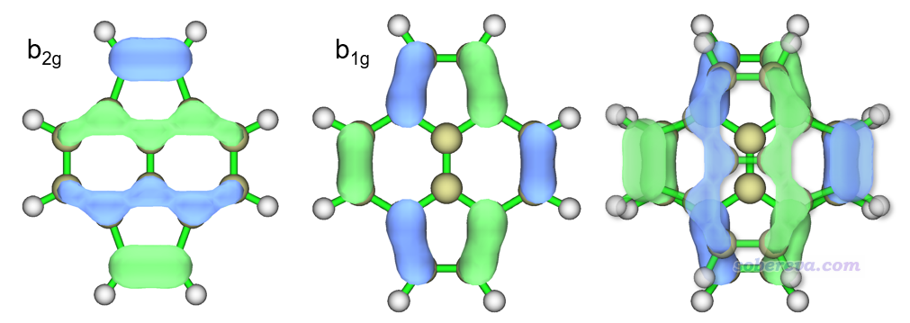
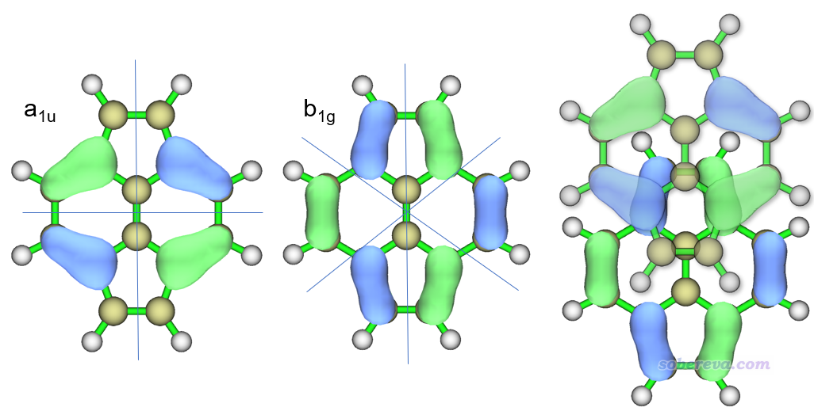

**深入理解分子轨道对磁感生电流的贡献**  
Deep understanding of contribution of molecular orbitals to magnetically induced currents

文/Sobereva@[北京科音](http://www.keinsci.com)   2024-Mar-3

## 0 前言

施加外磁场会导致化学体系产生磁感生电流，考察磁感生电流是研究分子芳香性的重要方法。我之前写过诸多博文介绍过，如《使用SYSMOIC程序绘制磁感生电流图和计算键电流强度》（<http://sobereva.com/702>）、《考察分子磁感生电流的程序GIMIC 2.0的使用》（<http://sobereva.com/491>）、《使用AICD 2.0绘制磁感应电流图》（<http://sobereva.com/294>）、《衡量芳香性的方法以及在Multiwfn中的计算》（<http://sobereva.com/176>）等。最常见的是考察整个分子的磁感生电流，而对于苯等平面体系，也经常区分成sigma和pi电子的感生电流分别考察，以更充分了解不同类型电子的离域性、对芳香性的贡献。对于CTODZ和与之本质相同的CSGT计算感生电流方法，总的感生电流是可以精确写为所有占据轨道贡献之和的形式的，也因此原理上可以给出任意占据轨道对应的感生电流。轨道的感生电流会带来感生磁场，对外磁场有屏蔽或去屏蔽效果，因此相应地可以得到各个轨道对NICS的贡献，如《基于Gaussian的NMR=CSGT任务得到各个轨道对NICS贡献的方法》（<http://sobereva.com/670>）所展示的。

然而，单一轨道对感生电流和NICS的贡献实际上是存在任意性的，过度解释可能得到十分误导性的结论。本文就专门详细谈一谈这个问题，以令读者正确理解轨道对感生电流的贡献。并且还同时介绍一下如何根据占据轨道到空轨道之间的跃迁模型来预测和解释一些体系的磁感生电流。本文许多内容和讨论取材自J. Phys. Chem. A, 105, 9553 (2001)一文，这是一篇很经典的探讨轨道与磁感生电流关系的文章。但这篇文章里很多部分写得难懂，本文则尽可能说得清楚、明白、易懂。

## 1 分子轨道对感生电流贡献的表达式

此文只讨论闭壳层的情况，假设体系有N个电子，因此有N/2个占据轨道。如下式(1)所示，总的感生电流可以写为所有占据轨道的加和形式，n是轨道序号。下式(2)给出了n轨道对r处感生电流矢量的表达式，B是外磁场矢量，d是测量原点（gauge origin），φ是无磁场下计算的分子轨道波函数，φ(1)是以二阶微扰理论得到的外磁场作用下的φ的一阶校正。

由上式可见，轨道的感生电流由paramagnetic（顺磁）和diamagnetic（抗磁）两部分构成，以下分别简称para和dia。dia电流是楞次定律说的给导体施加外磁场时产生的那种感生电流，正比于轨道上的电子的概率密度，它产生的感生磁场会在环形感生电流内部区域对外磁场产生削弱作用。而para部分完全来自于量子力学效应，直接牵扯到轨道波函数，方向与dia相反。

在完备基组下，体系总的感生电流计算结果是不依赖于d的选取的，但构成它的dia和para电流各自大小却依赖于d，因此dia和para的划分没有严格的物理意义、也不存在唯一的划分。而对分子轨道而言，不仅d的选取会影响此轨道的dia和para电流，对二者的总和也会产生影响。上式的dia部分里直接就有d，而para部分的φ(1)当中的φ(d)也依赖于d，具体表达式如下

ε是分子轨道能量，p是单电子动量算符，l(0)=r×p是相对于笛卡尔坐标原点的单电子角动量算符。φ(p)和φ(d)分别涉及当前轨道向各个空轨道的转动跃迁和平动跃迁。

如果计算所有位置的感生电流时使用统一的d，叫做common gauge-origin。这种做法平时基本不用，因为d的选取任意性太强而又会直接影响结果（也就某些情况有相对适合、意义较强的，比如算苯的时候可以把d设为环中央）。如果计算r处的感生电流用的d可表达为d(r)形式，即d也是像r一样连续变化的且依赖于r，则被称为CTOCD方法。SYSMOIC程序就是基于此方法计算感生电流。CTOCD有不同具体形式，其中CTOCD-DZ方法的名字中的DZ代表diamagnetic zero，它将d设为r，即算哪个位置的感生电流就把此时用的d设在哪里，使得上面(2)式中的dia项为0。虽然不能说把d设为r就有什么确切的物理意义，但起码没有common gauge-origin的d选取的表面上的任意性。

下面我把一般情况、d=r的情况、d=0的情况的感生电流表达式放在一起，便于大家弄清楚它们之间的异同、para和dia的定义。

CTOCT-DZ方法由于d=r，所以上面“一般情况”中的B×(d-r)项就没了，再把φ(1)=φ(p)+φ(d)代进去就得到了CTOCT-DZ的表达式。可见其中一部分由涉及平动跃迁的φ(d)所贡献，这部分被习俗地视为CTOCT-DZ的dia项，另一部分由涉及转动跃迁的φ(p)所贡献，这部分被习俗地视为CTOCT-DZ的para项。而对应d=0的common gauge-origin的情况中φ(d)就不复存在了，φ(1)=φ(p)，就有了上面的式子。由上式可见，CTOCT-DZ和d=0的情况的para项是相同的，但是dia项不同，因此两种情况计算的轨道感生电流是不同的。

基组够大的情况，总的感生电流近乎不依赖于d，因此可以用总的感生电流讨论芳香性。而由于轨道的感生电流明显依赖于d，所以绝对不能轻易拿一个轨道的感生电流的特征去判断它对体系芳香性、电子离域有什么样的贡献，否则会造成误导。但这不代表做感生电流的轨道层面的分解讨论就没实际意义，因为完备基组下某些轨道的感生电流的总和也是不依赖于d的。对纯平面体系，sigma电子的感生电流和pi电子的感生电流可以精确分离，且二者都是不依赖于d的。具体为什么，是因为存在以下关系

由上面最后一个式子可见，某分子轨道的CTOCD-DZ和d=0的感生电流只相差一部分，它依赖于此轨道与其它占据轨道之间的平动跃迁。当所有占据轨道的感生电流加和时，n轨道的感生电流表达式中的n→m跃迁部分的贡献和m轨道的感生电流表达式中的m→n跃迁部分的贡献精确抵消了（因为轨道能量差是φ(d,occ)的分母项，ε_n-ε_m和ε_m-ε_n的符号相反），所以CTOCD-DZ和d=0得到的体系总感生电流是相同的。为什么对于纯平面体系pi（或sigma）电子的总感生电流也不依赖于d？这是因为由于对称禁阻原因sigma与pi轨道之间的<φ_m|p|φ_n>项精确为0（即在垂直于外磁场方向即便平移sigma轨道后也仍然与pi轨道正交），φ(d,occ)因此又可以分为只循环sigma轨道和只循环pi轨道部分的加和，即sigma和pi是两个不同的block。所以所有pi轨道的感生电流加和时由于所有牵扯到的n→m和m→n（n和m皆为占据的pi轨道）的贡献精确抵消原因，它不依赖于d。

## 2 苯分子的不同pi轨道的感生电流

这一节看一个实例，以更好地了解上一节的讨论。下图给出了苯的最低pi轨道（MO 17）以及两个简并的HOMO pi轨道（MO 20 21)各自的Multiwfn绘制的0.05 a.u.轨道等值面图，以及SYSMOIC程序绘制的分子平面上方1 Bohr处的感生电流图。所有三个轨道加和对应的总的pi感生电流图也一起给出了。计算分别使用CTOCD-DZ形式（对应SYSMOIC里JBMAP结合-m DZ1选项），以及d=0的common-gauge情况（对应SYSMOIC里JBMAP结合-m CO选项，默认的d坐标(0,0,0)此时对应苯环中心）。几何优化和产生波函数文件都是在B3LYP/6-31G*下进行的。

由上图可见，CTOCD-DZ和d=0的总的pi感生电流基本没有可查觉的差别，但是这两种方法算出来的不同pi轨道的感生电流就相差显著了。CTOCD-DZ的MO 17的感生电流极小，在当前作图设置下甚至都看不到，而d=0时它的感生电流则很显著，和其它pi轨道的差不多。其原因在于MO 17与低阶的空轨道之间的平动和转动跃迁都是禁阻的，只可能往能量很高的空轨道跃迁，又由于轨道能量差出现在φ(d)和φ(p)的分母项，自然CTOCD-DZ方法算出来的它的感生电流特别小。而反之，d=0方式计算轨道感生电流的公式里有B×rφ^2项，φ^2对应当前轨道概率密度，因此由于MO 17在整个六元环上分布得很均匀且密集，使得MO 17的d=0方法算的感生电流很显著。也由于d=0的感生电流计算公式的这个特点，MO 20和21的感生电流显著分布区域也和轨道波函数显著分布的区域高度类似，而CTOCD-DZ的感生电流分布和轨道分布则没有视觉上的显著联系。

对MO 17，CTOCD-DZ和d=0的图像展现的信息有天壤之别。如果不懂以上原理的话，看CTOCD-DZ图就会盲目以为MO 17的电子几乎没有在六元环上的离域性、跟pi芳香性没联系。而事实上，在碳环上完全均匀分布的MO 17显然对苯的pi电子的全局离域有重要贡献。所以，特定轨道的感生电流和轨道实质上体现的电子离域特征并没有必然关联，这点一定要注意！

那么是否轨道的感生电流一定不能用于讨论轨道对芳香性的贡献呢？在我来看，这种讨论方式虽然由于上述原因而非常不推荐，但在特殊情况下还是可行的，比如上面d=0方法算的MO 17的感生电流确实体现出MO 17对芳香性有明显贡献。这里我阐述我的个人观点：如果一个轨道对电子在某个环上的多中心离域完全没有贡献，那么无论怎么选择d也算不出它有连贯环绕整个环的dia电流，例如内核电子轨道；而如果能有特定的d可以算出来它有连贯环绕整个环的dia电流，那么这个轨道对多中心离域就是有明显贡献的，如苯的MO 17。从前面的图中还可以看到，d=0时的MO 20和21各自的感生电流都没有在整个苯环上连成整体，但在CTOCD-DZ的情况下则连成了整体，根据以上我的观点，这直接说明了这俩轨道确实对pi电子的六中心离域有直接贡献。

CTOCD-DZ算的MO 17的感生电流极小，也很大程度反映在《基于Gaussian的NMR=CSGT任务得到各个轨道对NICS贡献的方法》（<http://sobereva.com/670>）文中以CSGT方式算的苯的各个分子轨道对NICS(1)zz的贡献上，MO 17的贡献（-1.58 ppm）远低于MO 20和21的贡献（-14.07 ppm）。CSGT方法是使用(2)式计算各处的感生电流密度，用Becke多中心积分方法通过Biot-Savart定律计算特定位置的磁屏蔽张量，每个积分格点用的d是此处的坐标往距离它最近的原子核一定程度移动得到的（基于各个原子的Becke权重确定）。SYSMOIC程序给出的CSGT方法算的MO 17的感生电流密度和CTOCD-DZ一样也是微乎其微的。

## 3 基于轨道跃迁模型的解释感生电流的例子

CTOCD-DZ算的轨道感生电流没法展现出苯的最低pi轨道对六中心离域的贡献，是否说明CTOCD-DZ没啥实际优点？答案是否定的。一方面，CTOCD-DZ计算轨道感生电流时给定了明确的d的选取方式，因此消除了人为选择的任意性；另一方面，CTOCD-DZ计算轨道感生电流的公式是可以严格分解为当前轨道向不同空轨道的跃迁贡献的，这种形式被称为完全态求和（sum-over-state, SOS）。SOS形式使得研究者可以从轨道间的平动和转动跃迁角度来定性预测不同轨道的感生电流该是什么样，以及深层次解释和理解CTOCD-DZ实际算出来的轨道感生电流为什么是那样，从而获得重要的physical insight。其实还有不少其它的分子属性也可以表达为SOS形式，例如我在《使用Multiwfn基于完全态求和(SOS)方法计算极化率和超极化率》（<http://sobereva.com/232>）里介绍了（超）极化率就可以通过SOS形式来计算，并且经过简化，还可以得到两态和三态模型来分析讨论影响第一超极化率的关键因素，见《使用Multiwfn对第一超极化率做双能级和三能级模型分析》（<http://sobereva.com/512>）和《谈谈计算第一超极化率的双能级公式》（<http://sobereva.com/361>）。

对于CTOCD-DZ方法计算的占据轨道n的感生电流，n向某个空轨道a的跃迁若能够对它有显著的贡献，需要满足三个条件  
(1)对称匹配。n→a必须要么平动跃迁允许（对dia电流有贡献），要么转动跃迁允许（对para电流有贡献），要么都允许。对于有点群对称性的体系来说，如式(3)所示，平动跃迁如果是允许的就意味着<φ(a)|p|φ(n)>不能精确为0，这要求n与a轨道不可约表示的直积对应的表示包含垂直于磁场的平移。转动跃迁如果是允许的就意味着<φ(a)|l(0)|φ(n)>不能精确为0，这要求n与a轨道不可约表示的直积对应的表示包含绕着磁场方向的旋转  
(2)轨道重叠显著。如果a和n的空间分布没有明显的重叠，自然平动和转动跃迁肯定非常小、n→a跃迁不可能对n的感生电流有可查觉的贡献  
(3)能量相近。由于a和n轨道的能量差出现在式(3)的分母部分，因此只有较高的占据轨道与较低的空轨道之间的跃迁才可能对感生电流有明显贡献

下图是JPCA文中在HF/6-31G*级别算的D6h点群的苯的前线轨道能级图，小圆点是占据的电子，黑色箭头是平动允许的轨道跃迁，苯处在XY平面上。例如e1g与e2u之间的直积是b1u+b2u+e1u，查特征标表可知e1u包含(x,y)，与Z方向的外加磁场相垂直，因此平动跃迁允许。下图所标注的a2u到e1g、e2u到b2g也类似地都是平动跃迁允许的。这些轨道之间没有转动跃迁是允许的，因为它们的不可约表示的直积都没有包含绕Z轴旋转的行为（Rz）。对于CTOCD-DZ方法，前面说过它只涉及占据轨道到空轨道的跃迁，因此此体系的感生电流仅来自于下图中e1g（HOMO）到e2u（LUMO）的跃迁，而且完全是dia电流。D6h点群的不可约表示里只有e1u含有x和y行为，能量最低的占据pi轨道是a2u，仅和e1g直积可以得到e1u，而空轨道里最低的e1g轨道是能量很高的，因此这个占据pi轨道向e1g轨道跃迁导致的对dia电流的贡献可忽略不计，这是为什么上一节看到CTOCD-DZ算的苯的MO 17的感生电流在图上都看不到。

下图是CTOCD-DZ计算的pyracylene的感生电流以及轨道跃迁示意图，分子在YZ平面上，外磁场由屏幕内向着屏幕外顺着X方向加（图片取自前述JPCA文章，为了和我的习俗相同，我把文中的感生电流方向反转了一下，顺时针和逆时针分别对应dia和para电流）。下图右侧示意图中实箭头对应允许的平动跃迁（因为b3u与b1g的直积b2u包含y，au与b1g的直积b1u包含z），故b3u和au轨道贡献顺时针的dia电流；空心箭头对应允许的转动跃迁（因为b2g与b1g的直积b3g包含Rx），故b2g轨道贡献逆时针的para电流。由于更低阶pi轨道对感生电流贡献甚微，所以总的pi感生电流的图像特征基本等于b3u和au贡献的dia电流以及b2g轨道贡献的para电流的总和。由于同时有4个电子贡献dia电流而只有2个电子贡献para电流，故前者整体强度更大，这是为什么在这两种电流方向相反的分子的上、下区域，总电流体现的是顺时针特征。

如果不通过群论知识，怎么判断什么样的轨道之间的转动跃迁是比较显著的呢？这可以结合图形进行判断和理解。若绕着磁场旋转一个轨道后就可以令二者不再正交，那么它们之间的转动跃迁就是允许的，这通常出现在两个轨道的节面数目是相似的情况下。例如下图所示的pyracylene的HOMO (b2g)→LUMO (b1g)的跃迁就是如此，最右边的图是把HOMO旋转90度后和LUMO的重叠图，可见相位完全匹配且高度重叠，因此这种跃迁能够对para电流有显著贡献。

如果在垂直于磁场方向平移一个轨道后能够与另一个轨道之间不再正交（一个轨道比另一个轨道多一个节面往往是这种情况），那么二者间的平动跃迁就是允许的。例如下图所示的pyracylene的HOMO-1 (au)→LUMO (b1g)的跃迁就是如此，HOMO-1有两个节面，LUMO有三个节面，最右边的图是把HOMO-1垂直于磁场平移后和LUMO的重叠图，可见能是以相位匹配的方式重叠，重叠积分明显不为0，因此这种跃迁能够对dia电流有显著的贡献。

通过以上例子，可以看出利用占据-非占据轨道跃迁模型，确实可以对CTOCD-DZ方法计算的轨道感生电流予以预测，还能对总感生电流的特征从轨道角度进行深层次的解释。前述JPCA文章里还有更多分析例子，包括苯的阴/阳离子、萘、并六苯、晕苯、碗烯，感兴趣者可以看看。文章还总结出CTOCD-DZ计算的感生电流的规律，对满足4n+2的普通碳单环体系，只有处于二重简并的HOMO轨道上的4个pi电子对pi感生电流有明显贡献，而更低的轨道的贡献可以忽略。而对于更复杂的多环分子，只有少量的前线pi占据轨道对感生电流有显著贡献，这是因为低阶pi占据轨道往平动/转动允许的pi空轨道上跃迁对应的能级差太大而必定贡献很小，而低阶pi占据轨道往前线pi占据轨道跃迁即便是平动/转动允许的也没用，因为占据-占据轨道的跃迁贡献不在CTOCD-DZ方法中出现）。
