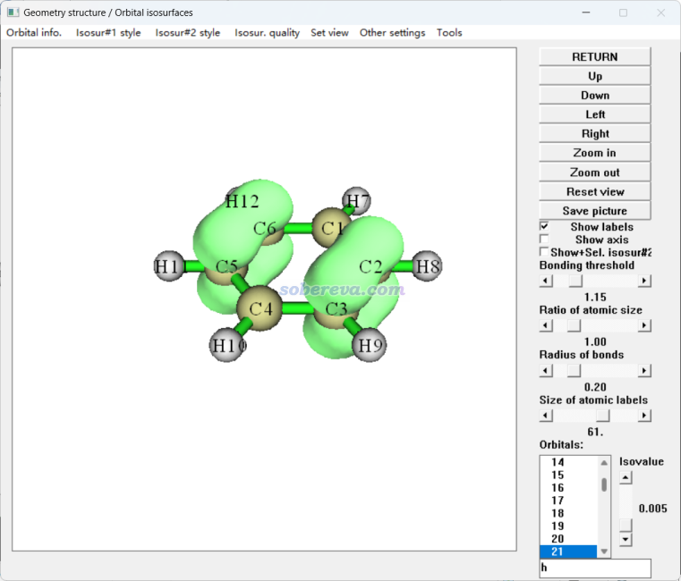
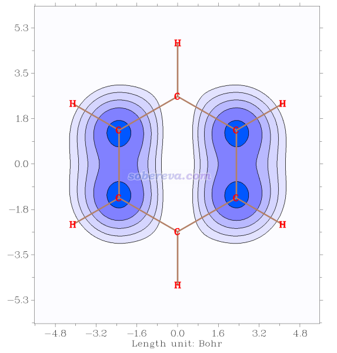
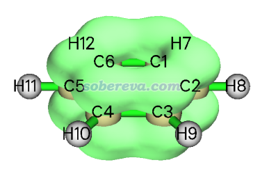

**使用Multiwfn观看轨道概率密度**  
Using Multiwfn to visualize orbital probability density

文/Sobereva@[北京科音](http://www.keinsci.com)   2024-Mar-25

## 0 前言

某个位置的轨道的概率密度等于轨道波函数的模的平方，对于实数型波函数来说就是轨道的平方。笔者之前有很多次被Multiwfn用户问到怎么用Multiwfn观看轨道的概率密度。传统的做法是先进入Multiwfn的主功能6的子功能26，把要考察的轨道占据数设为1，其它的都设为0，之后计算出的电子密度考察就等于那个轨道的概率密度了。考虑到这种做法步骤略麻烦，因此笔者对Multiwfn做了扩展，大大方便了考察轨道概率密度的流程，将在本文进行介绍。本文的做法适用于2024-Mar-25及以后发布的Multiwfn版本，老版本用户请去官网<http://sobereva.com/multiwfn>下载新版本。

如果读者不熟悉Multiwfn的话，看《Multiwfn FAQ》（<http://sobereva.com/452>）和《Multiwfn入门tips》（<http://sobereva.com/167>）。不知道波函数文件怎么产生的话，看《详谈Multiwfn支持的输入文件类型、产生方法以及相互转换》（<http://sobereva.com/379>）。

下面将使用苯分子作为示例，用到的波函数文件是Multiwfn程序包自带的examples目录下的benzene.fch。

## 1 观看轨道概率密度等的值面图

在《使用Multiwfn观看分子轨道》（<http://sobereva.com/269>）里详细介绍了怎么用Multiwfn非常方便快速地观看轨道波函数，没看过者务必先看一遍。观看轨道概率密度也可以在这个界面里方便地进行。启动Multiwfn，载入examples目录下的benzene.fch，然后进主功能0，在图形窗口菜单栏的Other settings里选择Choose plotting wavefunction or density，选择density然后点Return，再在窗口右下角的轨道列表里点击某轨道，或者在文本框里输入轨道序号，就看到了轨道概率密度等值面图。例如21号轨道如下

如果之后又想观看轨道波函数了，在刚才的窗口里选wavefunction即可。

## 2 导出轨道概率密度的cub文件

这个例子是对benzene.fch的第21号轨道计算轨道概率密度格点数据并导出为cub文件，cub文件是计算化学领域最流行的记录格点数据的格式，介绍见《Gaussian型cube文件简介及读、写方法和简单应用》（<http://sobereva.com/125>），导出后还可以用VMD按照《在VMD里将cube文件瞬间绘制成效果极佳的等值面图的方法》（<http://sobereva.com/483>）很方便地作出效果很好的图像。

启动Multiwfn，载入examples目录下的benzene.fch，然后输入  
5   //计算格点数据  
44   //轨道概率密度  
21   //21号轨道。这个轨道是HOMO，在这里输入h也可以  
2   //中等质量格点  
立马就算完了。从屏幕上的提示可以看到基于均匀格点积分得到的积分值为0.999996090147538，非常接近理应的1。

现在选择2，当前目录下就出现了orbdens.cub，这就是21号轨道的概率密度的cub文件了。

## 3 绘制轨道概率密度平面图

benzene.fch里的分子处在Z=0的XY平面上。此例对苯分子平面上方1 Bohr的位置绘制带填色效果的等值线图。绘制平面图的更多例子和技巧看Multiwfn手册4.4节，在《量子化学波函数分析与Multiwfn程序培训班》（<http://www.keinsci.com/workshop/WFN_content.html>）里我还做了非常全面的讲解。

启动Multiwfn，载入examples目录下的benzene.fch，然后输入  
4  //绘制平面图  
44   //轨道概率密度  
21   //21号轨道  
2   //等值线图  
[回车]  //用默认的格点数  
0   //设置延展距离  
1.5   //1.5 Bohr  
1   //XY平面  
1   //Z=1 Bohr  
关闭图像，然后接着输入  
17    //设置显示标签的距离阈值  
5   //5 Bohr  
n  
8   //显示化学键  
14   //棕色  
9   //开启等值线之间的填色效果  
9   //修改填色效果  
3   //设置色彩变化方式  
3   //Rainbow starting from white  
0   //返回  
-1   //重新作图

现在看到下图，效果不错。还可以用当前菜单中的选项进一步调节，如原子标签大小、坐标轴刻度等。

## 4 计算多个轨道概率密度的总和

基态极小点结构下的苯的HOMO是二重简并的，即20和21号轨道能量相同。这里再演示一下怎么绘制这两个轨道概率密度总和的等值面图。

启动Multiwfn，载入examples目录下的benzene.fch，然后输入  
6   //修改和检查波函数  
26   //修改轨道占据数  
0   //选择所有轨道  
0   //把所有轨道占据数设为0  
20,21   //选择这两个轨道  
1   //占据数设为1  
q   //返回  
-1   //返回主菜单  
5   //计算格点数据  
1   //电子密度  
2   //中等质量格点  
-1   //观看格点数据的等值面图

在图形界面里把等值面数值设为0.005后看到下图，这便是我们想要的了。之后还可以将格点数据导出成cub文件。

