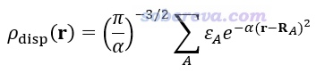
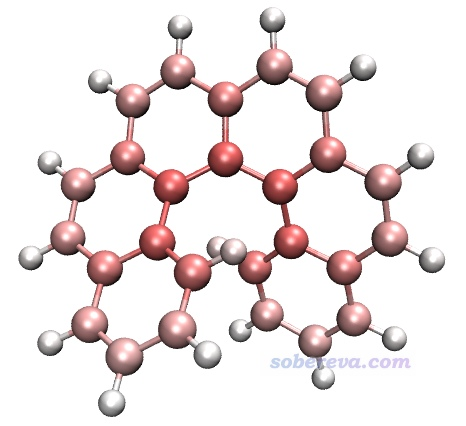
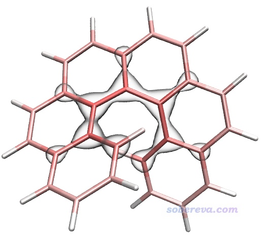
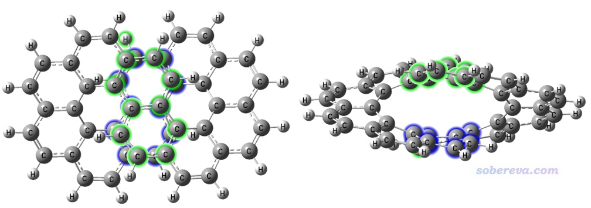
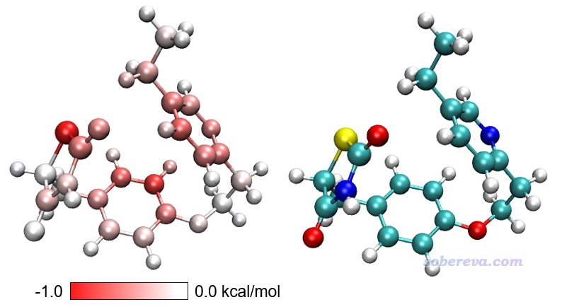
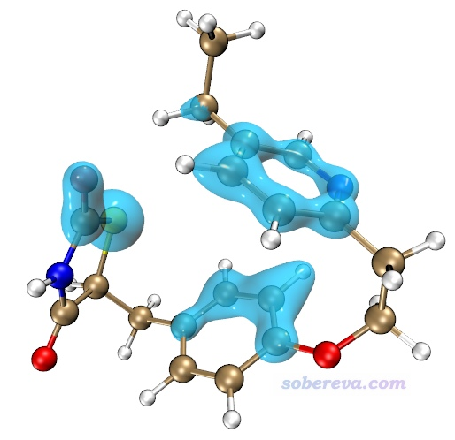
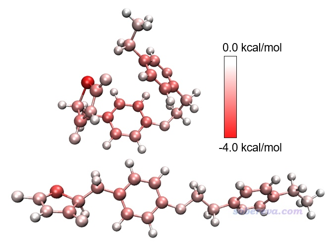
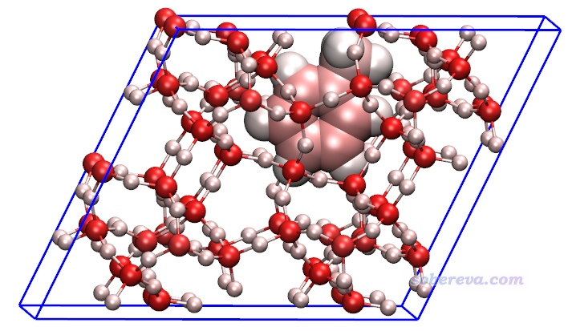
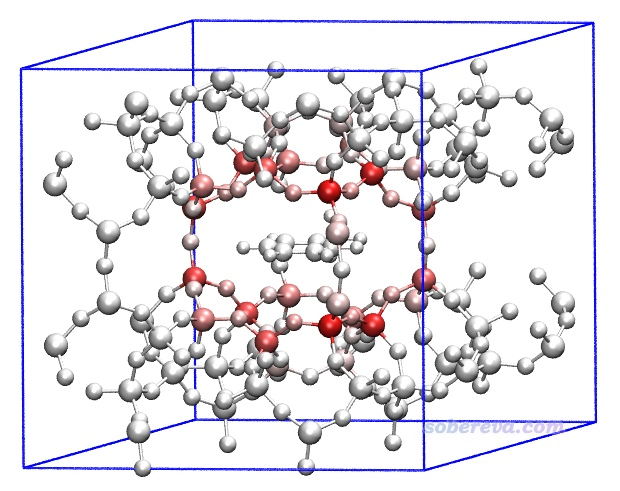
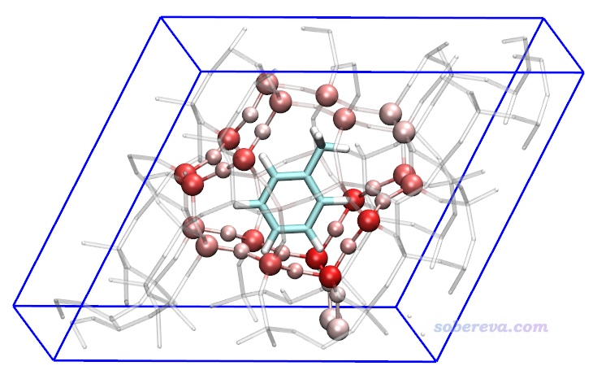

**使用Multiwfn图形化展现原子对色散能的贡献以及色散密度  
Using Multiwfn to graphically exhibit atomic contribution to dispersion energy and dispersion density**

文/Sobereva@[北京科音](http://www.keinsci.com)  2024-Apr-14

## 0 前言

色散作用是分子间和分子内弱相互作用中的关键组成部分，在《谈谈“计算时是否需要加DFT-D3色散校正？”》（<http://sobereva.com/413>）中我做过简要介绍，在“量子化学波函数分析与Multiwfn程序培训班”（<http://www.keinsci.com/workshop/WFN_content.html>）的“弱相互作用的分析”一节里有深入全面介绍。本文将介绍从2024-Apr-13起，Multiwfn程序加入的计算原子对色散能贡献的功能，是主功能21中的子功能4。这个功能可以非常方便快速地给出每个原子对体系中色散能的贡献，结合VMD可以直观地通过原子着色展示，还能计算任意方式定义的两个片段间的色散作用能。虽然《使用Multiwfn做基于分子力场的能量分解分析》（<http://sobereva.com/442>）介绍的EDA-FF功能也可以实现这些分析，但原理不同，EDA-FF是基于力场来得到的，而且使用前需要先指认原子类型、写分子列表文件，用起来明显没本文介绍的功能省事。此外，本文介绍的功能还支持周期性体系，这是EDA-FF目前不支持的。本文介绍的功能还可以把原子对色散作用的贡献转化为实空间函数，便于通过等值面图观看，还能直接给出不同化学环境下原子贡献的色散能的差值从而得到更丰富信息、提供更多分析讨论的素材。相信读者看过本文的例子后会感到此文介绍的功能颇有实际价值。

Multiwfn可以在官网<http://sobereva.com/multiwfn>免费下载，**必须使用2024-Apr-13及以后发布的版本**。不了解Multiwfn者建议参看《Multiwfn入门tips》（<http://sobereva.com/167>）和《Multiwfn FAQ》（<http://sobereva.com/452>）。使用本文的功能发表文章时必须在正文引用Multiwfn启动时提示的程序原文，给别人代算时也必须非常明确告知对方这点。

下面第1节简要介绍此功能的基本原理，第2节介绍使用方法，之后结合各种例子演示典型的用法。

## 1 原子对色散能贡献的计算原理

我在《使用sobEDA和sobEDAw方法做非常准确、快速、方便、普适的能量分解分析》（<http://sobereva.com/685>）介绍的sobEDA能量分解的原文里专门讨论了DFT-D3色散校正能和色散作用的关系，推荐仔细看看。如果不了解DFT-D3者也务必先看看《DFT-D色散校正的使用》（<http://sobereva.com/210>）和《谈谈“计算时是否需要加DFT-D3色散校正？”》（<http://sobereva.com/413>）。对于B3LYP这样本身对色散作用描述能力为0的泛函，DFT-D3色散校正能可以近似视为是色散能，JCTC, 20, 1923 (2024)将D3校正能与耦合簇方法算的高精度色散作用能进行对比也印证了这一点。在不考虑三体耦合项的情况下，DFT-D3总色散校正能是每一对原子间色散作用能Edisp(i,j)的加和。因此，i原子对体系色散能的贡献可以计算为Edisp(i)=∑[j≠i]Edisp(i,j)/2。两个片段间的色散作用能等于二者间的每一对原子间色散作用能的总和。

对周期性体系也可以计算i、j原子间色散作用能Edisp(i,j)，是i与当前晶胞和周围所有镜像晶胞里的j原子的色散作用能的总和。当然，镜像晶胞不可能考虑无穷多，用个足够大的截断阈值即可。要注意对孤立体系显然Edisp(i,i)=0，但对周期性体系它一般不为0，因为当前晶胞里i原子和它的周期镜像之间也有色散作用。周期性体系中原子对色散能的贡献为Edisp(i)=∑[j≠i]Edisp(i,j)/2+Edisp(i,i)。

JCTC, 20, 1923 (2024)还提出色散密度（dispersion density）的概念，它相当于把每个原子对色散能的贡献展宽成高斯函数并叠加构成三维实空间函数ρ_disp，从而可以作图展现，如画成等值面图，或者用于给原子球或电子密度等值面着色等。ρ_disp的定义如下式所示。α一般取0.5，ε_A是前述方式计算的A原子对色散能的贡献，R_A是A原子坐标。

不同化学环境下（比如m和n两个结构下）共有的某个原子A贡献的色散能之差记为Δε_A，将上式的ε_A替换为Δε_A得到的就是Δρ_disp函数。如果计算Δρ_disp用的核坐标是m结构下的，那么可以把Δρ_disp用于给m结构下的原子球进行着色，或者画成等值面附在其结构图上。

顺带一提，DFT-D3色散校正能本质上是利用原子的C6色散系数进行计算的，推荐看《使用Multiwfn计算原子的C6色散系数》（http://sobereva.com/709）了解更多相关知识。

## 2 Multiwfn分析原子对色散能贡献功能的使用

任意含有结构信息的文件，如xyz、pdb、mol2、gjf、fch、mwfn等，都可以作为本文介绍的功能的输入文件，介绍见《详谈Multiwfn支持的输入文件类型、产生方法以及相互转换》（<http://sobereva.com/379>）。如果是周期性体系，载入的文件还必须包含晶胞信息，如cif、带有Tv（平移矢量）的gjf文件、POSCAR、gro等，参看《使用Multiwfn非常便利地创建CP2K程序的输入文件》（<http://sobereva.com/587>）里的说明。

当前功能必须借助Grimme的dftd3程序，而且必须是我的魔改版，下载地址为<http://sobereva.com/soft/dftd3_TLmod.zip>，里面有源代码，dftd3.exe是Windows下的可执行文件，无后缀的dftd3文件是Linux下的可执行文件。必须把Multiwfn的settings.ini文件里的dftd3path参数设为当前机子里dftd3程序的实际路径，否则Multiwfn没法调用之，例如Windows下你把dftd3.exe放在了D:\study\dftd3_TLmod\目录下，就得设成dftd3path= "D:\study\dftd3_TLmod\dftd3.exe"。对于Linux，别忘了还得给dftd3程序用chmod命令加上可执行权限。

启动Multiwfn，载入输入文件，进主功能21的子功能4，根据需要选择恰当的选项、根据屏幕上的提示操作即可。Multiwfn的此功能计算原子间色散作用能是基于B3LYP参数的DFT-D3(BJ)色散校正得到的。

下文所有例子涉及到的输入输出文件都可以在<http://sobereva.com/attach/705/file.zip>中找到。VMD用的是1.9.3版，可以在<http://www.ks.uiuc.edu/Research/vmd/>免费下载。

## 3 实例1：考察螺烯中原子贡献的色散能和色散密度

此例考察一下6-螺烯中的哪些原子对色散作用贡献最为显著。启动Multiwfn，然后输入  
examples\helicene.xyz  //螺烯的结构文件  
21  //能量分解分析  
4  //分析原子对色散作用的贡献  
1  //计算各个原子贡献的色散作用能

此时看到以下信息。可见当前体系色散能，也即B3LYP参数下的DFT-D3(BJ)色散校正能，为-74.468 kcal/mol，各个原子的贡献值也给出了，加和等于总值

 Total dispersion energy:     -74.468 kcal/mol

 Atomic contribution to dispersion energy  
     1(C )    -2.681 kcal/mol  
     2(C )    -2.072 kcal/mol  
     3(C )    -2.068 kcal/mol  
     4(C )    -2.650 kcal/mol  
     5(C )    -3.432 kcal/mol  
...略  
    40(H )    -0.569 kcal/mol  
    41(H )    -0.511 kcal/mol  
    42(H )    -0.614 kcal/mol

现在Multiwfn问你是否导出atomdisp.pqr，输入y，现在当前目录下就有了atomdisp.pqr。其中pqr格式中专用于记录原子电荷的那一列（倒数第三列）现在记录的是原子对色散能的贡献。

接下来用VMD对原子着色以直观展示原子对色散能的贡献。将atomdisp.pqr载入VMD，Graphics - Representation里把Drawing Method设CPK，Coloring Method设Charge，Trajectory标签页里把色彩刻度下限和上限分别设为-5和5。此时看到的图如下所示，由于VMD默认用的色彩刻度是红-白-蓝，因此此图中颜色越红说明原子的色散能越负、与其它原子间的色散作用越强。

由上图可见，碳原子对色散能的贡献远高于氢的，而且越靠螺烯中央的碳贡献越大。原因容易理解，因为越靠中央的碳原子能和越多的其它原子产生色散作用。

下面计算色散能密度。当前界面里选择选项2 Calculate dispersion density for current system，然后选Medium quality grid，马上当前目录下就有了dispdens.cub，这是色散能密度的cub文件。将之载入VMD，Graphics - Representation界面里把Drawing Method设为Isosurface，然后Draw设为Solid Surface，Show设为Isosurface，Isovalue设为-0.15，Material设BlownGlass（并确保Display - Rendermode已经选了GLSL），再把之前的分子结构显示方式设为Licorice，Bond Radius用0.1，此时看到下图，图中的等值面分布明确体现出螺烯靠内区域比其它区域对色散能有相对更显著的贡献。

## 4 实例2：计算无穷烯中的片段之间的色散作用能

Multiwfn文件包自带的examples\NICS_scan目录下的infinitene.pdb是无穷烯的结构文件。如下图所示，绿色的8个碳原子和蓝色的8个碳原子彼此对着，距离又较近，且接近平行，因此可以认为二者之间有pi-pi作用（可以通过《使用IRI方法图形化考察化学体系中的化学键和弱相互作用》<http://sobereva.com/598>介绍的方法可视化展现）。这里计算一下这两个片段间的色散作用能，它和pi-pi作用强度有密切关系，因为pi-pi作用的吸引部分的本质就是色散作用。但注意不能把色散作用能直接当做pi-pi作用能，因为还同时有显著的交换-互斥部分不可忽视。

启动Multiwfn，依次输入  
examples\NICS_scan\infinitene.pdb  //无穷烯的结构文件  
21  //能量分解分析  
4  //分析原子对色散作用的贡献  
6  //计算两个片段间的色散作用能  
1,3,5,35-38,68-69,71  //上图中第1个片段里的原子序号  
25-26,28,30-31,42-44,46,48  //上图中第2个片段里的原子序号

Multiwfn马上就输出了片段间色散作用能：  
Dispersion interaction energy between the fragments:     -13.000 kcal/mol

Multiwfn还可以直接给出某个片段对总色散作用能的贡献。比如要得到上图第一个片段的贡献，就选择选项5 Calculate contribution of a fragment to dispersion energy，然后从屏幕上会看到总色散能为-165.089 kcal/mol。之后再输入1,3,5,35-38,68-69,71，就得到了这个片段的贡献量：  
Dispersion energy contributed by this fragment:     -35.550 kcal/mol  
这个值等于片段与片段自己，以及自己与其它部分的色散作用能之和。它占总色散能的-35.550/(-165.089)*100%=21.5%。

## 5 实例3：Actos不同构象下色散作用的差异

之前我在《利用Gaussian或ORCA程序把分子结构拉直的几种方法》（<http://sobereva.com/594>）里讲了柔性的Actos分子的能量最低构象是弯曲的，但也可以加外力给它拉成直线型构象。弯曲和直线构象的xyz文件已提供在了本文文件包中的Actos目录下，分别为curly.xyz和linear.xyz。这一节我们考察一下弯曲构象下各个原子对色散能的贡献相对于直线型时的变化。启动Multiwfn，然后输入  
curly.xyz  //Actos弯曲构象的结构文件  
21  //能量分解分析  
4  //分析原子对色散作用的贡献  
3  //计算当前与另一个体系的原子对色散作用贡献的差值  
[回车]  //感兴趣的是当前体系（curly.xyz）中的所有原子  
linear.xyz  //Actos直线构象的结构文件  
[回车]  //感兴趣的是linear.xyz中的所有原子

现在屏幕上告诉你后载入的linear.xyz的色散能为-57.553 kcal/mol，先载入的curly.xyz色散能为-69.757 kcal/mol，可见弯曲构象下色散作用更强。屏幕上还显示了各个原子对色散能的贡献在两个结构下的差异。

然后输入y，当前目录下就产生了diffatomdisp.pqr，其中charge属性记录的是curly.xyz的各个原子贡献的色散能减去linear.xyz的各个原子贡献的色散能，而此文件里的原子坐标和curly.xyz一致。将此文件用VMD按照实例1的做法作图，色彩刻度范围用-1.0到1.0 kcal/mol，得到下面左图（色彩刻度条是从Graphics - Color - Color Scale里抠出来再用powerpoint手动做的），下面右图是根据元素名着色以便对照（黄色是硫）。

上图越红的原子对应从直线构象变成卷曲构象过程中对色散作用贡献得越多的原子，可见色散作用增强主要出现在构象蜷缩后能够与其它原子整体距离变得更近的原子上，而主要分布在边角部分的白色原子的色散作用则没有显著改变。

Multiwfn也可以给出色散密度的差值格点数据并作图。在当前界面里输入  
4  //计算当前与另一个体系的色散密度的差值  
[回车]  //感兴趣的是当前体系（curly.xyz）中的所有原子  
linear.xyz  //Actos直线构象的结构文件  
[回车]  //感兴趣的是linear.xyz中的所有原子  
3   //高质量格点  
现在当前目录下就有了dispdensdiff.cub。使用《在VMD里将cube文件瞬间绘制成效果极佳的等值面图的方法》（<http://sobereva.com/483>）里的脚本对其绘制±0.025的等值面，得到下图，蓝色对应负值等值面（-0.025，单位kcal/mol/Bohr^3）。可见此图把卷曲造成色散作用显著增强的区域展示得很清楚。

下面是对Actos两种构象各自分别绘制的原子贡献的色散能的着色图。由此图可见，如果不把两个构象的数据求差，直接观看各自颜色的话，并不好分辨各个原子对色散作用的贡献在两个构象之间有什么差异，这体现出求差的重要性。值得一提的是，两个构象下最红的原子都是硫原子，它比其它元素原子对色散作用的贡献都更强，这在于它有明显更大的动态极化率。

## 6 实例4：沸石吸附甲苯

这一节演示一下对周期性体系做前述分析。我在“北京科音CP2K第一性原理计算培训班”（<http://www.keinsci.com/workshop/KFP_content.html>）的结构优化部分讲了个例子，是沸石吸附甲苯的，这一节使用这个结构作为例子。由于甲苯的极性很低，因此沸石与甲苯间的吸引作用多半是色散作用贡献的，因此将色散作用分解为原子的贡献来考察可以得到有益的信息。

CP2K在PBE-D3(BJ)/DZVP-MOLOPT-SR-GTH级别下对沸石+甲苯做结构优化得到的restart文件是本文文件包里的zeolite-mol目录下的opt-1.restart，作为Multiwfn的输入文件就可以从中载入优化后的原子坐标和晶胞信息。只要有了晶胞信息，本文介绍的Multiwfn的功能就会自动在色散作用计算时考虑周期性。当然，用第2节提到的cif等含有晶胞和原子坐标信息的格式作为输入文件也都是可以的。

我们先对这个体系绘制一下原子对色散能贡献的着色图。完全按照第3节的例子操作，只不过把输入文件换成opt-1.restart，得到的结果如下。色彩刻度用-8到8 kcal/mol范围。由于当前体系有晶胞信息，所以Multiwfn导出的pqr文件里也有晶胞信息，故载入到VMD后在文本窗口里输入pbc box命令可以显示出盒子。为了清楚起见，对应217-231号原子的甲苯部分用大圆球方式显示，并且用了正交视角（Display - Orthographic）。

由上图可见，对色散作用贡献最大的是硅原子，比氧、碳都大得多，氢的贡献最小。

上图并不能直接展现沸石中哪些原子与甲苯的色散作用最强。想考察这个问题，需要令沸石+甲苯体系中的沸石原子（1-216号原子）对色散能的贡献与独立的沸石体系中的原子对色散能的贡献求差，下面就这么做一下。值得注意的是，从上图中可见，甲苯在当前晶胞的靠边的位置，若把甲苯挪到晶胞中央，无疑更便于观看，因此在考察色散作用之前先对结构做一些修改。

启动Multiwfn，载入前述的opt-1.restart，然后输入  
300  //其它功能（Part 3）  
7  //几何操作。这个功能在《Multiwfn中非常实用的几何操作和坐标变换功能介绍》（<http://sobereva.com/610>）中有详细介绍  
24  //对体系进行平移以使得选择的区域在晶胞中央  
217-231  //甲苯部分的原子序号  
22   //由于平移后会有原子露出晶胞，用这个选项把原子都卷进盒子以便观察  
-4  //将当前体系导出为cif文件  
zeolite-mol.cif   //导出的文件名。对应沸石+甲苯  
17   //只保留体系的一部分  
1-216  //保留沸石部分，因此甲苯部分会被删掉  
-4  //将当前体系导出为cif文件  
zeolite.cif   //导出的文件名。对应沸石部分

现在当前目录下就有了zeolite-mol.cif和zeolite.cif，在本文的文件包的zeolite目录下也提供了。下面开始做色散作用的分析。重启Multiwfn，然后依次输入  
zeolite-mol.cif  //沸石+甲苯的结构文件  
21  //能量分解分析  
4  //分析原子对色散作用的贡献  
3  //计算当前与另一个体系的原子对色散能贡献的差值  
1-216  //感兴趣的原子是当前体系（zeolite-mol.cif）中的沸石部分的原子（前216号）  
zeolite.cif  //沸石的结构文件  
[回车]  //感兴趣的原子是zeolite.cif中的所有216个原子，也正对应于zeolite-mol.cif的1-216号原子  
y  //导出diffatomdisp.pqr

将diffatomdisp.pqr载入VMD，用Charge属性进行着色，色彩刻度范围用-0.8到0.8，看到下图。

上图中甲苯是白色，是因为它不在前面我们定义的zeolite-mol.cif的感兴趣的原子范围内，因此它的数据完全为0。距离甲苯较近的沸石原子对色散能的贡献发生了较大变化，由于zeolite-mol.cif和zeolite.cif中沸石部分的结构是相同的，因此图中的颜色完全体现了沸石的各个原子与甲苯之间的色散作用能。由图可见色散作用随距离衰减得非常快（有1/r^6衰减行为），基本上只有与甲苯最近一层的沸石原子才与它有很显著的色散作用。值得一提的是，在《使用Multiwfn做IGMH分析非常清晰直观地展现化学体系中的相互作用》（<http://sobereva.com/621>）文中也有这个体系，通过IGMH方法直观地展现了甲苯与沸石之间的相互作用，这是另外一种分析视角。

上图还可以再改一改变成下面这样，把与甲苯相互作用显著的沸石的原子展现得明显更清楚。具体来说，Graphics - Representation里建立三个Rep：一个Rep显示甲苯，用Name着色、Licorice方式显示、BrushedMetal材质；一个Rep显示整个沸石，选择语句为serial 1 to 216、Licorice显示（Bond Radius用0.1）、Charge着色、Transparent材质；一个Rep专门显示沸石中的原子数值小于-0.2的部分，选择语句为charge<-0.2、CPK显示、Charge着色。

在这一节的最后强调一下，做原子的色散能贡献或者色散密度的差值分析时，对两个体系分别选择的感兴趣的原子范围中的原子数必须相同，而且其中原子顺序也必须相同，否则显然原子的色散能贡献在求差时就错乱了。

## 7 总结

实际化学体系中色散作用几乎无处不在，本文介绍的从2024-Apr-13更新的Multiwfn中引入的新功能可以非常便利、快速、直观地展现各个原子对色散作用的贡献，还能转化成实空间函数色散密度通过等值面等方式表现三维空间中哪些区域对色散作用贡献显著，而且还能对同一个体系的不同结构之间以及两个相关体系之间给出原子对色散能贡献的差值，从而更清楚地了解色散效应起到的作用。显然此功能对于与色散作用关系密切的问题的研究有重要帮助，值得在实际研究中考虑使用。值得一提的是，Multiwfn中的范德华势分析也与色散作用的研究密切相关，非常推荐阅读《谈谈范德华势以及在Multiwfn中的计算、分析和绘制》（<http://sobereva.com/551>）和《使用Multiwfn对静电势和范德华势做拓扑分析精确得到极小点位置和数值》（<http://sobereva.com/645>）。
