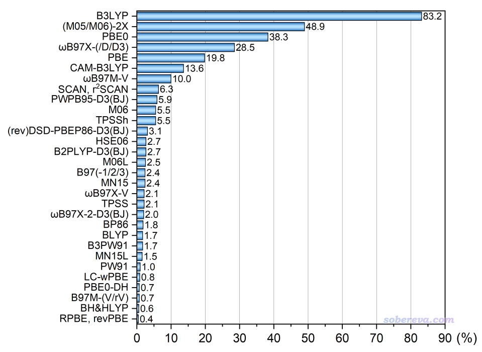
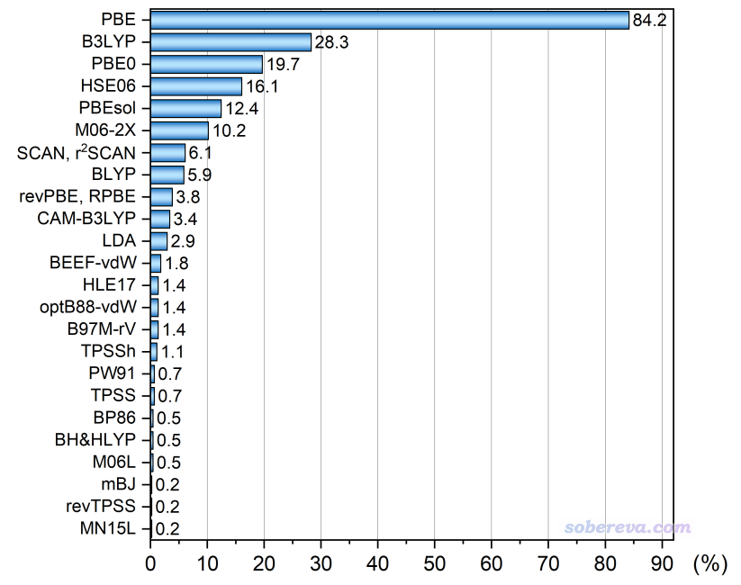
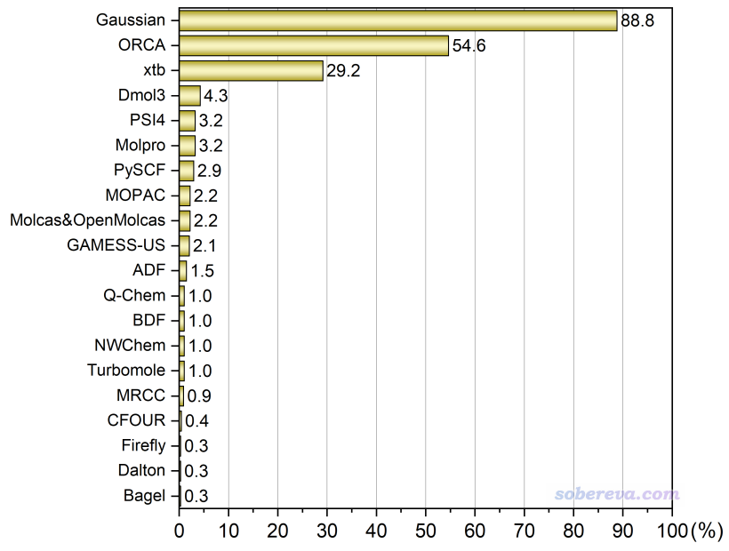
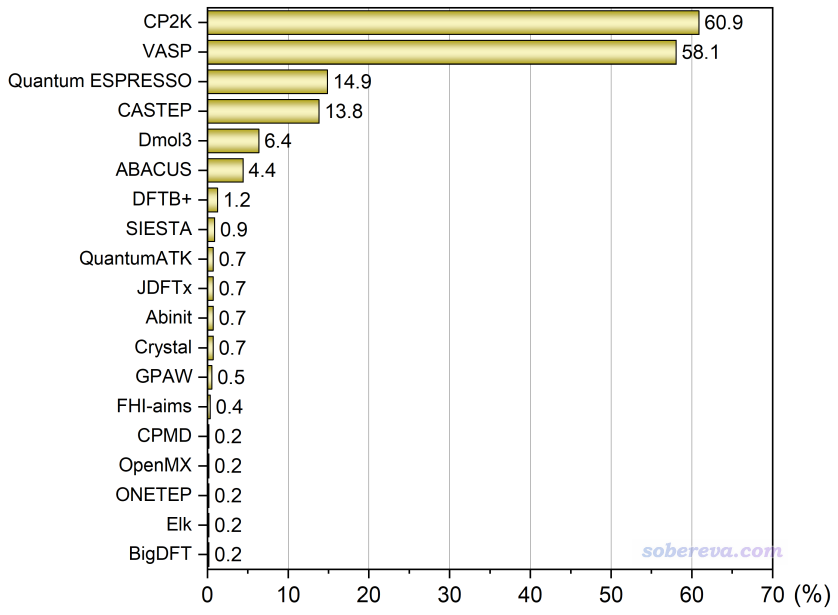
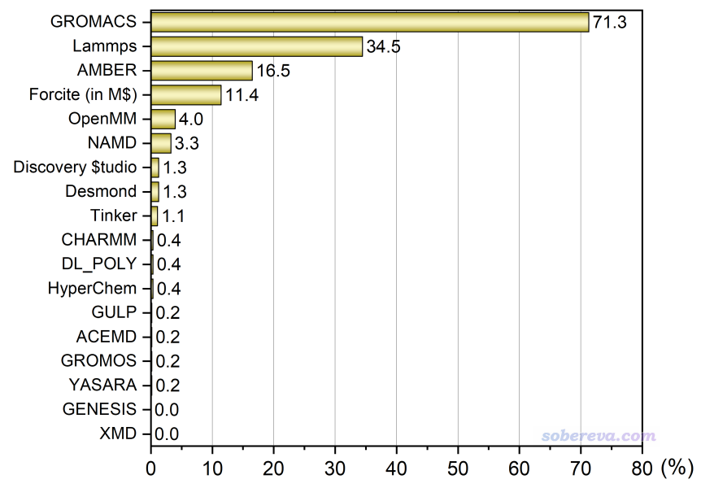

**2024年计算化学公社举办的计算化学程序和DFT泛函的流行程度投票结果**

Results of the Computational Chemistry Commune 2024 poll on the popularity of computational chemistry programs and DFT functionals

文/Sobereva@[北京科音](http://www.keinsci.com)  2024-May-5

## 0 前言

2024年4月4号，在北京科音建立的人气最高、专业性最强的综合性计算化学论坛“计算化学公社”（<http://bbs.keinsci.com>）上开展了为期一个月的五项投票：  
你最常用的做量子化学计算的DFT泛函投票（<http://bbs.keinsci.com/thread-44387-1-1.html>）  
你最常用的做第一性原理计算的DFT泛函投票（<http://bbs.keinsci.com/thread-44391-1-1.html>）  
你最常用的量子化学程序投票（<http://bbs.keinsci.com/thread-44388-1-1.html>）  
你最常用的分子动力学程序投票（<http://bbs.keinsci.com/thread-44389-1-1.html>）  
你最常用的第一性原理程序投票（<http://bbs.keinsci.com/thread-44390-1-1.html>）

现对投票结果进行总结和简单评论。未来预计每三年重新开展一次投票。要强调的是，这个投票只是体现流行程度，和方法/程序的好坏并没直接关系。本投票结果主要反映中国的计算化学领域的专业、内行群体的情况，不反映业余/外行群体的情况。本次投票的结果也有助于业余/外行研究者正确认清什么才是主流，减少被他人忽悠、听信歪曲说辞误入歧途的概率。

上一次的投票于2021年举行，当时的结果和很多相关评论见下文：  
2021年计算化学公社论坛“你最常用的计算化学程序和DFT泛函”投票结果统计  
<http://sobereva.com/599>（<http://bbs.keinsci.com/thread-23482-1-1.html>）

## 1 你最常用的做量子化学计算的DFT泛函投票

本次可投的泛函有43种，带不带色散校正算同一种泛函。在2021年的投票条目基础上有所增减，特别是增加了双杂化泛函，明显几乎不会有人用的泛函没纳入可投范围。投票范畴仅限做量子化学计算的情况，不包含第一性原理计算的情况。关系特别近的，比如M05-2X和M06-2X、wB97X和wB97XD和wB97X-D3、SCAN和r2SCAN、revDSD-PBEP86-D3(BJ)和DSD-PBEP86-D3(BJ)等等当做同一个泛函来计。此次投票者共713人。本投票每个人最多选6项，且所投的泛函必须占平时全部研究工作的5%以上。按照得票率（票数除以总投票人数）绘制的图如下。为了避免条目过多，只把得票前30名的列出。此图中诸如某泛函对应50%就代表有50%的人平时较多使用此泛函，后文的统计图同理。

总的来说本年度的投票结果和2021年时没太大变化，前六名的顺次没有改变，还是依次为B3LYP、(M05/M06)-2X、PBE0、wB97X-(/D/D3)、PBE、CAM-B3LYP老几样，各自有各自的用处（参看我对2021年投票结果的评论<http://sobereva.com/599>，这里不再赘述）。它们的得票率的相对比例也基本没变，也就是量化领域里用处相对有限的PBE的比例有一定降低，以后肯定还得跌。2021年时候的第7名M06虽然得票率如今还是5%左右，但排名已下滑到第10，被wB97M-V、SCAN/r2-SCAN、PWPB95-D3(BJ)所超过。M06在我来看用处着实不大，虽然计算过渡金属配合物体系有一定用处，但PBE0-D3(BJ)/D4多数情况是更好的选择，而且M06还有后继者MN15可用。wB97M-V的得票率从2018年的3.1%提升到了如今的10%，已经算是增幅很快了，再过3年统计时肯定还会增高。此泛函在国内量化研究者中一定程度的流行，很大程度在于在计算化学公社论坛和思想家公社QQ群的讨论中时常被提及、在《简谈量子化学计算中DFT泛函的选择》（<http://sobereva.com/272>）博文中和我在北京科音基础（中级）量子化学培训班（<http://www.keinsci.com/workshop/KBQC_content.html>）中的推荐、被免费的ORCA程序支持。提出时间不算很长的纯泛函SCAN及其改进版r2SCAN现在得票率能到6%着实不容易，2021年时得票率还不到1%，这主要在于有越来越多的程序已经支持此泛函，而且综合素质整体强于更早的经典泛函PBE，因而在纯泛函范畴内能有重要的位置。

2021年投票的时候没纳入双杂化泛函，这次得票率超过1%的双杂化泛函的排名顺序是PWPB95-D3(BJ)(5.9%) > (rev)DSD-PBEP86-D3(BJ)(3.1%) > B2PLYP-D3(BJ) (2.7%) > ωB97X-2-D3(BJ) (2.0%)。PWPB95-D3(BJ)和(rev)DSD-PBEP86-D3(BJ)能在国内用户中变得流行和上述wB97M-V的情况很类似。本身这俩泛函各有长处，有流行开来的必然性。PWPB95-D3(BJ)比较robust，算过渡金属配合物能量问题较好，能在ORCA里用；而revDSD-PBEP86-D3(BJ)算主族体系反应能、势垒以及弱相互作用能都是双杂化里顶尖的，而且在Gaussian里通过《Gaussian中非内置的理论方法和泛函的用法》（<http://sobereva.com/344>）我介绍的方法能直接用。此外，ORCA中DSD-PBEP86适合算TDDFT和NMR目的也是其加分项。这俩泛函现在流行度能超过经典且最早提出的双杂化泛函B2PLYP是其应得的。

BLYP这次的排名降幅很大，从第10名已跌到第22名，本身这个泛函如今鲜有用武之地。BLYP一般也就算算主族体系，在Gaussian里用这个明显不如用B3LYP，耗时也持平，而以前在ORCA里用这个搭配def2-SVP结合RIJ加速做有机体系几何优化速度效率高是个用处，以前我在《大体系弱相互作用计算的解决之道》（<http://sobereva.com/214>）里也提过，但如今也不如改用B97-3c来跑。

## 2 你最常用的做第一性原理计算的DFT泛函投票

可投的泛函有26种，带不带色散校正算同一种泛函。此投票在2021年没有，是本次新加的。此次投票者共442人。本投票每个人最多选6项，且所投的泛函必须占平时全部研究工作的5%以上。结果如下，零票的未显示

96年提出的PBE至今仍稳居第1的位置，如同B3LYP在量子化学领域的地位，而且和第二名相差更悬殊。PBE能有这样的地位是必然的，PBE提出年代早、被程序支持得极为广泛，计算便宜，有丰富的专门为其搞的赝势，几何优化和分子动力学目的大多数时候够用（加色散校正后又拓宽了其普适性），而且在基态能量相关问题方面依然有使用价值而且没被已流行的其它纯泛函甩开特别多（这和B3LYP在量子化学领域的情况截然不同，B3LYP算能量早过时了，很难再发得出去文章，见<http://bbs.keinsci.com/thread-12773-1-1.html>）。B3LYP在这次投票里得了第2，令我有点意外，大概率是很多人不好好看投票帖子的说明，误把量子化学研究用的泛函也在此进行投票了。PBE0能排第3不意外，需要一个HF成分适当的杂化泛函做TDDFT/TDDFPT算激发态、算强相关体系的问题时经常用得着。HSE06流行度排得上第4主要来自于其计算带隙、能带方面公认很好，以及晶胞参数优化方面表现不错。PBEsol是优化晶体结构、晶胞参数的好把式，而且还是便宜的纯泛函，能排到第5很正常。M06-2X能排第6令我有点意外，一方面必定是有人误当成量子化学计算的情况来投，另一方面是计算主族晶体/液体相关的化学反应、吸附的相关能量问题必定有一些人在用。SCAN/r2SCAN已经有一定流行度，由于在文献中出现频率越来越高，在未来的流行度必定也会逐渐提升，但流行度超越PBE在可预见的未来还不太可能，毕竟对于大量PBE就已经表现得够用的范畴，作为更贵但没带来显著优势的meta-GGA的SCAN/r2SCAN不可能显著侵占这方面的市场。第一性原理领域里用BLYP的人我不很理解是什么心态。revPBE和与之相似的RPBE能有一定流行度在于算化学吸附方面不错，被不少人用。第一性原理方面的泛函投票中CAM-B3LYP显得远不如量子化学领域里来得流行，估计用这个的大部分都是CP2K用户用来算激发态和UV-Vis谱方面，只占投票的少量群体。算化学吸附很好的BEEF-vdW和算物理吸附很好的optB88-vdW能有一定票数不算意外。纯泛函中矮子里拔将军算带隙往往可以接受的HLE17在本次投票中获得了一点流行度，略意外的是算带隙整体更好些的纯泛函mBJ反倒在这次投票中显得无人问津，可能是前者在CP2K里能直接用而后者不能所致。作为PBE后继提出来的知名的TPSS流行度那么低有点令我意外，倒也确实实际用处不太大，现在又有了理论上以及实际整体表现得更好的r2SCAN。PW91虽然在文献里出现得很多，但这次得票率相当低，毕竟实际中有PBE就基本没有更老的PW91能派上用场的时候。B97M-rV能有少量票数，主要在于算热力学量方面在纯泛函里是表现得较突出的。

## 3 你最常用的量子化学程序投票

可投程序有29种，投票者共679人。本投票每个人最多选三项，且所投的程序必须占平时全部研究工作的10%以上。按照得票率绘制的图如下，只显示了得票前20名的

前三位和2021年投票的结果一样，还是Gaussian > ORCA > xtb，Gaussian依然是约90%的量子化学研究者日常必用的程序，稳稳占据主导位置。而ORCA和xtb的得票率比2021年时都有了约10%增长，这是意料之中的。实际上这三个程序也是我自己最常用的：xtb拿来快速预优化和结合molclus（<http://www.keinsci.com/research/molclus.html>）做构象搜索的初筛，Gaussian做基于DFT的opt、freq、扫描、IRC等涉及几何变化的任务以及算一些属性（NMR、超极化率等），ORCA算高精度单点。这三个程序的流行度远远甩开了其它程序，一方面是它们比较容易安装和使用，一方面各有各的独特优势，有被大量使用的刚性原因。而且它们把大部分量子化学计算的应用领域都给覆盖了，对于日常应用性研究来说其它程序难以有和它们竞争的显著空间。Dmol3、ADF、Q-Chem、Turbomole这四个商业程序日子愈发不好过。在量化计算方面没有长处还巨贵的Dmol3的用户越来越少，从2021年的6.2%已经进一步萎缩到了4.3%，以后肯定还会明显进一步萎缩。ADF从2021年时候的仅仅2.2%进一步萎缩到了1.5%。Q-Chem从2021年的3.0%萎缩到了1.0%。Turbomole从2021年的1.6%萎缩到了1.0%。以GPU加速为卖点的TeraChem更不幸，2021年时候还有1人投票，今年变成了0人。

## 4 你最常用的第一性原理程序投票

可投程序有25种，投票者共565人。本投票每个人最多选三项，且所投的程序必须占平时全部研究工作的10%以上。按照得票率绘制的图如下（0票的没显示）

根据这次投票的结果可见，至少在计算化学公社论坛里，CP2K的流行程度已经赶超了VASP。这令我90%程度感到意外，但也有10%程度感觉是在情理之中。由于Multiwfn在2021年开始提供了极其易用的创建CP2K输入文件的功能（<http://sobereva.com/587>），我后来又对此功能反复打磨并在Multiwfn中提供了对CP2K绘制DOS、能带、STM、电子激发、成键分析等许多功能，再加上2023年3月、2023年10月和2024年3月开办了三期北京科音CP2K第一性原理计算培训班（<http://www.keinsci.com/workshop/KFP_content.html>）非常全面系统讲解了CP2K的使用，无疑令中国的CP2K用户猛增。但即便我已预料CP2K的得票率肯定会远高于2021年时候的33.3%，但也没预料到这次居然能达到60.9%，直接翻了将近一倍，甚至把一直霸占流行度榜首的VASP给挤下去了。由于免费且十分高效的CP2K的用户还在不断激增，而且CP2K更新很快，不断完善和发展新功能，Multiwfn在未来还会给其提供更多的相关分析处理功能，CP2K的位置在以后无疑还会更加牢固。相比之下，VASP的流行度从2021年投票时候的65.8%降到了现在的58.1%。由于现在有非常强大的竞争者CP2K，而且CP2K不具备的一些功能还有免费的Quantum ESPRESSO能用来平替VASP，售价较昂贵且算大体系速度远不如CP2K的VASP在未来的前景不乐观。以前很多人一提到第一性原理计算就言必称VASP，以后就不再是如此了。除了CP2K的流行度猛增外，其它程序的流行度都普遍出现了下降，如CASTEP和Dmol3分别从2021年的19.0%和9.3%下降到了13.8%和6.4%。Wien2k今年更是连一票都没有，而2021年时还有3票。那些程序流行度百分比减少，一方面是它们的票数大多数确实有一定减少，用户发现有更理想或免费的程序可用，另一方面原因应当是有很多通过CP2K程序开始入手第一性原理计算的人加入了投票，他们只对CP2K的得票率有贡献而间接地拉低了其它程序的得票率。

## 5 你最常用的分子动力学程序投票

可投程序有18种，投票者共551人。本投票每个人最多选三项，且所投的程序必须占平时全部研究工作的10%以上。按照得票率绘制的图如下

GROMACS依旧是用户数的龙头老大，而且流行度从2021年投票时的69.3%还进一步略微提升到了71.3%，得票数大约等于其它所有程序用户数之和，和曾经的情况一样。第2、3位依然分别是Lammps和AMBER。Lammps和OpenMM得票率略涨，而AMBER、Forcite和NAMD的流行度都有较多降幅，GULP、DL_POLY和CHARMM更是快跌没了。
