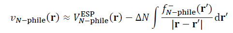
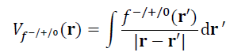
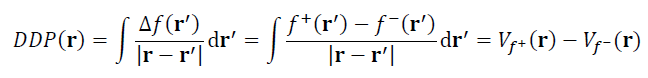
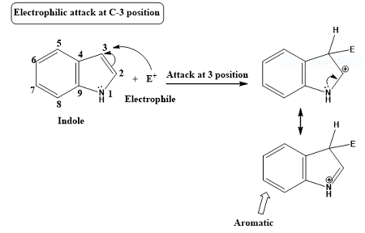
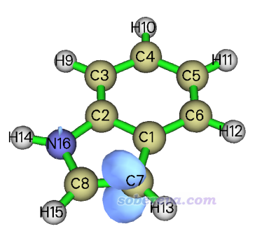
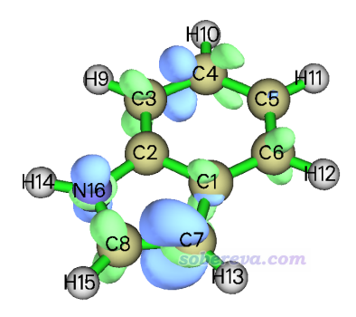
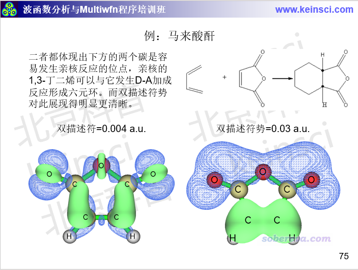

**使用Multiwfn计算双描述符势预测反应位点**  
Using Multiwfn to calculate dual descriptor potential to predict reactive sites

文/Sobereva@[北京科音](http://www.keinsci.com)   2024-Jun-1

## 1 前言

双描述符（dual descriptor）是概念密度泛函理论框架下定义的非常流行的预测亲电和亲核反应位点的方法，见《概念密度泛函综述和重要文献合集》（<http://bbs.keinsci.com/thread-384-1-1.html>）里面的相关资料和我写过的各种相关博文的汇总，以及笔者的论文《亲电取代反应中活性位点预测方法的比较》（<http://www.whxb.pku.edu.cn/CN/abstract/abstract28694.shtml>）和《Comparative study on the methods for predicting the reactive site of nucleophilic reaction》（<https://doi.org/10.1007/s11426-015-5494-7>）。最近，双描述符势（dual descriptor potential）在J. Math. Chem., 62, 1094 (2024)中被提出，文中指出它在预测反应位点方面比双描述符具有一定优势，原理上也更严格。从2024-May-13更新的Multiwfn开始，双描述符势的计算已被纳入到了《使用Multiwfn超级方便地计算出概念密度泛函理论中定义的各种量》（<http://sobereva.com/484>）所介绍的Multiwfn做概念密度泛函理论分析的功能（主功能22）当中。下文就简单介绍一下双描述符势的概念，并给出很典型的计算例子。

## 2 原理

在说双描述符势之前先说福井势（Fukui potential）。两个分子之间反应倾向于在什么位点发生，取决于反应初期反应物之间的相互作用，在这方面静电势与福井势之间存在明显的互补关系。例如当一个亲电物质正在与一个亲核物质反应，亲核物质对亲电物质施加的外势可以写为下式，它对于亲电物质与它的反应产生了引导作用。式中N-phile下标代表亲核物质，ΔN是反应物之间转移的电子数，V_ESP是静电势，f-是福井函数，积分部分对应福井势。

反应初期的反应物的外势分布特征决定了优先的反应位点。一般的化学反应总是伴随着或多或少的电子转移，而静电势则完全没有考虑电子转移对外势的影响，因此静电势对反应位点的预测往往很失败，这在前面提到的我的论文里的对比中都有体现。电子转移对外势的影响藉由福井势体现了出来，而且当电子转移越显著（ΔN越大），福井势的重要性就越显著、对反应位点越起到决定性作用。

对应于福井函数有三种形式，f-、f+和f0，相应地福井势也有三种形式，Vf-、Vf+和Vf0，如下所示

根据上面的介绍可知，用福井势讨论反应位点比用福井函数明显更严格，因为前者才是与反应初期的外势直接相联系的，而福井函数只是间接地联系。而之所以人们在讨论反应位点时经常用福井函数而很少见到用福井势，主要在于二者的分布特征通常相似、能得到的结论相同，而计算福井势则需要计算复杂的积分，相当于计算静电势的成本，这远比计算福井函数昂贵。

对f+和f-福井函数求差可得到双描述符（Δf）。类似地，双描述符势可以对Δf做库仑积分得到，也相当于Vf+和Vf-之间求差，如下所示

和Δf一样，双描述符势的最正和最负的区域分别对应优先发生亲核和亲电反应的位点。双描述符势的计算代价显著高于Δf，其好处是函数分布特征比Δf简单得多，明显更易于考察反应位点，而且理论上还更为严格，因为能与外势直接挂钩。

注意虽然基于Δf可以定义简缩双描述符（condensed dual descriptor）便于在不同原子间定量对比，但双描述符势并没法搞成简缩的形式。

## 3 实例

下面来看怎么用Multiwfn非常方便地计算双描述符势，并且通过此例能展现出双描述符势相对于Δf的实际好处。读者务必先仔细阅读《使用Multiwfn超级方便地计算出概念密度泛函理论中定义的各种量》（<http://sobereva.com/484>）了解Multiwfn的主功能22的基本用法，这里假定读者已经读过此文。计算福井势和双描述符势的功能从2024-May-13及以后版本的Multiwfn中才支持，切勿用更老的版本。Multiwfn可以在其官网<http://sobereva.com/multiwfn>免费下载。

这个例子是用双描述符势预测吲哚（indole）的亲电反应位点。下图是网上找的，可见吲哚的亲电反应优先发生在3号位的碳原子上，我们来看看双描述符势能否正确预测。下面的例子涉及到的所有文件都可以在<http://sobereva.com/attach/708/file.zip>里得到。

首先用GaussView之类程序画出来吲哚的结构，然后用Gaussian等量子化学程序做几何优化。Gaussian在常用的B3LYP/6-31G*级别做优化的输入输出文件在本文的文件包里都提供了。之后启动Multiwfn，然后输入  
indole.out  //Gaussian优化吲哚任务的输出文件，Multiwfn会从中载入最后一帧结构  
22  //概念密度泛函理论计算  
1  //生成N、N-1和N+1态的.wfn文件（N代表原本状态的电子数）  
[回车]  //用默认的B3LYP/6-31G*级别计算  
[回车]  //净电荷和自旋多重度(0 1)、(-1 2)、(1 2)分别用于N、N+1和N-1态  
此时当前目录下已经产生了N.gjf、N+1.gjf和N-1.gjf，可以手动用Gaussian进行计算。如果你把Multiwfn的settings.ini里的gaupath设为了当前实际运行Gaussian的命令，这里也可以输入y直接让Multiwfn调用Gaussian去自动计算这些文件。算完后当前目录下就有了N.wfn、N+1.wfn和N-1.wfn。之后输入  
9  //计算福井势和双描述符势的格点数据  
1  //由于当前体系小，而且福井势和双描述符势的计算耗时较高，故这里使用低质量格点

在笔者的i9-13980HX机子上总共20多秒钟算完。然后在当前的菜单里可以看到直接显示各种形式的福井势和双描述符势的选项，以及将它们导出成cub文件的选项。选择4直接显示双描述符势，并把等值面数值设为0.04（单位是a.u.），看到的图如下所示，蓝色代表与当前等值面数值符号相反，也即-0.04 a.u.的等值面。可见双描述符势非常清楚地显示出C7（当于3位的碳）具有最负的福井势，说明这是亲电反应最优先发生的位点，和已知的实验结论完全一致！

再来看看双描述符的图像是什么样。输入以下命令  
0  //返回  
3  //计算福井函数和双描述符的格点数据  
2  //中等质量格点  
4  //显示双描述符的等值面图  
将等值面数值调整到易于分析的0.005，结果如下。可见双描述符也体现出C7是优先发生亲电反应的位点，因为蓝色等值面在C7附近最大。然而双描述符的等值面明显显得很零碎，有很多节面，远不如双描述符势的等值面对反应位点展现得清晰。这在于双描述符势是对双描述符求库仑积分，在积分时把双描述符复杂的函数分布特征给消除了。

在量子化学波函数分析与Multiwfn程序培训班（<http://www.keinsci.com/workshop/WFN_content.html>）里专门讲“反应位点的预测与反应活性分析”的部分里还给了很多其它的例子，这里再列举其中一个，展现亲核位点的：

## 4 总结

本文对最近提出的双描述符势的概念进行了简要介绍，并演示了用Multiwfn计算双描述符势的具体例子。双描述符势比常用的双描述符虽然计算起来更昂贵，但物理意义更严格、对反应位点展现得更清楚，因此当实际发现双描述符预测反应位点不准时，或者其等值面过于复杂而难以预测反应位点时，或者就是想得到更可靠的反应位点预测结果时，都建议用双描述符势代替双描述符。在前面提到的双描述符势的原文里还有更多的应用例子，感兴趣者可以阅读。

**使用本文的方法计算在发表结果时务必记得按照Multiwfn程序启动时的提示对Multiwfn进行正确的引用。**
