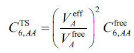
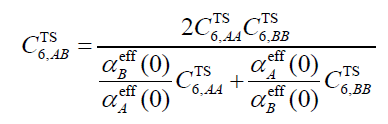
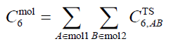

**使用Multiwfn计算原子的C6色散系数**  
Using Multiwfn to calculate atomic C6 dispersion coefficients

文/Sobereva@[北京科音](http://www.keinsci.com)   2024-May-18

## 1 前言

绝大多数分子力场表现色散吸引部分都是基于原子的C6色散系数进行计算的，原子间色散作用能表达为-C6/r^6，其中r为原子间距离。著名的DFT-D3色散校正（<http://sobereva.com/210>），以及Tkatchenko-Scheffler (TS)等色散校正方法，也都是依赖于原子的C6色散系数计算校正能。显然，C6色散系数是一个很重要的量。本文介绍怎么用Multiwfn程序（<http://sobereva.com/multiwfn>）通过TS方法计算原子的C6色散系数。看完了本文，读者也同时会知道如何算分子间的C6系数。使用本文的方法计算发表文章时，记得需要按照Multiwfn启动时屏幕上的提示对程序进行恰当引用。

## 2 背景知识

原子在孤立状态的C6系数已经有很多文章报道，例如JCP, 121, 4083 (2004)给出了前五周期除Zr-Cd外各个元素的C6。JCTC, 12, 3603 (2016)还给出了整个周期表各种元素及部分元素离子态的C6。原子的C6系数是严重受到化学环境的影响的，计算实际化学体系中的原子C6系数没有唯一方法，不同研究者提出了不同策略，有的粗糙有的精确，有的简单有的复杂。例如DFT-D3色散校正基于原子的配位数进行计算，DFT-D4（<http://sobereva.com/464>）还额外依赖于原子电荷，XDM色散校正基于实际电子密度计算。一种实现起来简单的方法是PRL, 102, 073005 (2009)中提出的TS色散校正方法用的策略，它将分子中某原子A的C6系数表达为

其中V_eff和V_free分别是原子在当前分子中的有效体积以及它在孤立状态下的体积（自由体积）。注意这两个体积和一般意义的体积并不是一回事，务必看《使用Multiwfn计算分子中的原子极化率》（<http://sobereva.com/600>）了解其定义和细节。上式中C6_free是原子在孤立状态下的C6系数，如前所述这在文献里已经给了。一旦有了各个原子的C6系数，就可以计算不同原子间的C6系数，如下所示，其中α_eff(0)是原子在分子中的静态极化率，计算方式在《使用Multiwfn计算分子中的原子极化率》中专门说了。

利用原子间的C6系数，还可以进一步计算分子间的C6系数，如下所示，A和B分别循环两个分子的各个原子。

分子间的C6系数也可以通过dipole oscillator strength distributions (DOSD)实验数据得到，例如在JCP, 123, 024101 (2005)中给出了178个分子间和少量分子-原子间C6系数。值得一提的是，有了分子间C6系数也可以拟合出不同原子类型间的C6系数，例如JCP, 116, 515 (2002)。

计算原子在分子中的有效体积V_eff的时候涉及到将分子空间划分成原子空间，这由原子权重函数体现，这有很多定义，例如AIM、Becke、Hirshfeld、Hirshfeld-I、MBIS、Voronoi等。在MBIS原文JCTC, 12, 3894 (2016)当中第5节做了对比测试，TS方法与MBIS相结合表现得最好，得到的分子C6系数与实验值相差最小，方均根百分比误差为6.9 %。文中测试时是基于B3LYP/6-311+G(2df,p)级别得到的波函数算的密度。

## 3 计算方法

Multiwfn从2024-May-17更新的版本开始支持了计算原子C6色散系数，此版本的原子空间划分支持Becke、Hirshfeld、Hirshfeld-I和MBIS。如果你不了解Multiwfn的话，务必看《Multiwfn FAQ》（<http://sobereva.com/452>）和《Multiwfn入门tips》（<http://sobereva.com/167>）。Multiwfn可以在其官网<http://sobereva.com/multiwfn>免费下载。

Multiwfn计算C6系数的操作和要求的输入文件和《使用Multiwfn计算分子中的原子极化率》（<http://sobereva.com/600>）介绍的严格一致，Multiwfn在输出原子极化率之后就会输出原子C6系数。在输入文件方面，简单来说，需要提供当前体系的波函数文件，格式可以是mwfn/wfn/fch/molden等等，产生方法见《详谈Multiwfn支持的输入文件类型、产生方法以及相互转换》（<http://sobereva.com/379>）。而且还需要提供当前体系中每种元素的波函数文件，用量子化学程序对相应元素原子做单点计算即可得到，注意自旋多重度应当对应基态的。下面就给出一个具体计算例子。

## 4 实例

此例对CCl4进行计算。计算级别使用前面提到的JCTC, 12, 3894 (2016)测试时所使用的B3LYP/6-311+G(2df,p)，CCl4的几何优化也在这个级别。注意这个级别未必就是最佳选择，毕竟文中作者也没做过对比测试。此例用到的CCl4分子、C和Cl原子的fch格式的波函数文件在<http://sobereva.com/attach/709/file.zip>里都提供了，其中用于产生它们的Gaussian的输入输出文件也都给了。

启动Multiwfn，然后输入  
CCl4.fch   //分子波函数文件的实际路径  
15  //模糊空间分析  
-1  //修改原子空间定义方式  
5  //MBIS方法  
1  //开始产生MBIS原子空间。这是个迭代过程  
13  //计算原子有效体积、自由体积、极化率和C6系数  
C.fch   //C原子的波函数文件的实际路径  
Cl.fch   //Cl原子的波函数文件的实际路径

马上就算完了，结果如下

...略（原子有效体积、自由体积、极化率信息）  
 Atomic C6 coefficients estimated using Tkatchenko-Scheffler method:  
    1(C ):   41.22 a.u. (Ref. data:    46.6 a.u.)  
    2(Cl):   95.94 a.u. (Ref. data:    94.6 a.u.)  
    3(Cl):   95.94 a.u. (Ref. data:    94.6 a.u.)  
    4(Cl):   95.94 a.u. (Ref. data:    94.6 a.u.)  
    5(Cl):   95.94 a.u. (Ref. data:    94.6 a.u.)

Note: Reference data denotes the built-in value of free-state atom  
 Homomolecular C6 coefficient:   2076.98 a.u.

可见C和Cl的C6系数分别为41.22和95.94 a.u.。Ref. data对应的是相应元素在孤立状态下的C6值，取自JCP, 121, 4083 (2004)。如果这里显示的是0，说明此文里没给此元素的孤立状态C6值，只能自己从其它地方获取，并根据前面输出的原子有效体积和自由体积按照第2节介绍的公式手动计算此原子在分子中的C6。

由上还可以看到homomolecular的C6系数，这是指Multiwfn根据自动算的原子间的C6系数得到的CCl4与CCl4分子间的C6系数。当前值2076.98 a.u.非常接近JCP, 123, 024101 (2005)给出的实验值2024 a.u.，计算得很成功！注意不是对所有体系都能和实验吻合得这么好，当前属于表现较好的情况。

也可以考察一下改成Hirshfeld原子空间时的结果如何。运行以下命令  
-1  //修改原子空间定义方式  
3  //Hirshfeld方法，且基于Multiwfn内置的球对称化的原子电子密度进行计算  
13  //计算原子有效体积、自由体积、极化率和C6系数  
此时的结果为

Atomic C6 coefficients estimated using Tkatchenko-Scheffler method:  
    1(C ):   40.84 a.u. (Ref. data:    46.6 a.u.)  
    2(Cl):   89.02 a.u. (Ref. data:    94.6 a.u.)  
    3(Cl):   89.02 a.u. (Ref. data:    94.6 a.u.)  
    4(Cl):   89.02 a.u. (Ref. data:    94.6 a.u.)  
    5(Cl):   89.02 a.u. (Ref. data:    94.6 a.u.)

Note: Reference data denotes the built-in value of free-state atom  
 Homomolecular C6 coefficient:   1945.22 a.u.

可见当前homomolecular的C6系数1945.22 a.u.与实验值的误差明显大于用MBIS原子空间时的。根据JCTC, 12, 3894 (2016)的测试，从统计结果来看，MBIS比Hirshfeld的整体误差更小，但对于特定分子，也往往出现Hirshfeld的误差更小的情况。
