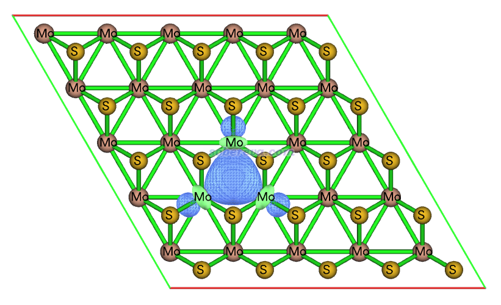

**使用Multiwfn结合CP2K计算晶体中原子的氧化态**  
Using Multiwfn in combination with CP2K to calculate oxidation state for atoms in crystals

文/Sobereva@[北京科音](http://www.keinsci.com)  2024-May-23

## 1 前言

波函数分析程序Multiwfn可以基于电子波函数计算原子和片段的氧化态，这在笔者之前写的《使用Multiwfn通过LOBA方法计算氧化态》（<http://sobereva.com/362>）一文中已做了详细介绍，没读过者一定要先阅读此文，否则无法理解下文的内容。此文介绍的做法已经被广泛用来准确地考察分子中的氧化态。如今Multiwfn已经支持将这种方法用于CP2K计算的周期性体系的波函数，从而考察晶体中原子的氧化态，这非常有实际价值，具体做法将在本文介绍。注意氧化态和原子电荷完全是两码事，周期性体系的原子电荷的计算看《使用Multiwfn对周期性体系计算Hirshfeld(-I)、CM5和MBIS原子电荷》（<http://sobereva.com/712>）。

Multiwfn可以在官网<http://sobereva.com/multiwfn>免费下载，本文的读者必须使用**2024年5月23日**及以后更新的版本，否则没有本文介绍的特性。对Multiwfn不了解者看《Multiwfn FAQ》（<http://sobereva.com/452>）和《Multiwfn入门tips》（<http://sobereva.com/167>）。

## 2 用法

在Multiwfn中对周期性体系做LOBA或mLOBA分析氧化态的具体操作流程和对孤立体系做别无二致，都是先用主功能19产生定域化轨道（介绍见《Multiwfn的轨道定域化功能的使用以及与NBO、AdNDP分析的对比》<http://sobereva.com/380>），然后进入主功能8（轨道成分分析），选择LOBA/mLOBA分析，之后输入一个LOBA方法判断定域化轨道电子归属的阈值，或者输入m让Multiwfn按照mLOBA的方式判断归属即可。定域化轨道的电子归属是什么意思，在前述的《使用Multiwfn通过LOBA方法计算氧化态》里已经专门说过了，这里不再累述。之后各个原子的氧化态就会立马输出出来。用户也可以自定义片段来得到片段的氧化态。

对周期性体系做LOBA/mLOBA分析的输入文件必须是CP2K产生的molden文件，并且需要自己在里面加入盒子信息。具体方法在《详谈使用CP2K产生给Multiwfn用的molden格式的波函数文件》（<http://sobereva.com/651>）里有详细介绍。由于考虑k点时不能产生molden文件，因此原本晶胞较小的话需要扩胞成足够大的超胞，从而对其计算时只需要考虑gamma点。Multiwfn不支持Quantum ESPRESSO、VASP等其它第一性原理程序产生的波函数，也没有任何支持的必要，因为对于绝大多数情况，用Multiwfn创建CP2K单点输入文件并用CP2K计算是非常简单且快速的事，可参考《使用Multiwfn非常便利地创建CP2K程序的输入文件》（<http://sobereva.com/587>）。

对于当前目的，CP2K计算时用赝势基组也行，用全电子基组也行，没有什么特别的讲究。CP2K计算的时候不要开smearing，否则轨道占据数不再精确为整数、不再是标准的单行列式波函数，此时也就没法做轨道定域化。如果有特殊原因非开smearing不可，可以在Multiwfn载入molden文件后进入主功能6，选择选项38，此时Multiwfn会按照轨道能量由低到高重排电子确定占据数，轨道占据数就都为整数了，之后退回到主菜单，再照常按前述步骤做LOBA/mLOBA分析即可。

## 3 例子

下面给出一系列通过Multiwfn使用LOBA/mLOBA计算固体的氧化态的例子。CP2K的输入输出文件在<http://sobereva.com/attach/711/file.zip>里都给了。只有3.1节例子对应的molden文件我在里面直接给了，如果所有例子的molden文件都给的话压缩包就太大了。CP2K输入文件里的各种设置我这里就不细说了，在北京科音CP2K第一性原理计算培训班（<http://www.keinsci.com/workshop/KFP_content.html>）里有非常全面系统的讲解。

### 3.1 单层氮化硼

氮化硼（BN）是知名的二维材料，这里完整介绍单层BN的氧化态计算的流程。本文文件包里的BN_bulk.cif是氮化硼晶体的结构文件，用GaussView打开它，可看到晶胞里有两层BN。删除其中的一层，然后保存为BN_ml.gjf。之后启动Multiwfn，载入BN_ml.gjf，输入  
cp2k   //创建CP2K输入文件  
[回车]  //产生的输入文件用默认的名字BN_ml.inp  
-2  //要求导出molden文件  
-11  //进入几何操作界面  
19  //构造超胞  
6  //第1个平行于层的方向扩胞成原先的6倍  
6  //第2个平行于层的方向扩胞成原先的6倍  
1   //垂直于层的方向不扩胞  
-10  //返回  
-7  //设置周期性  
XY  
0  //产生输入文件（计算级别为默认的PBE/DZVP-MOLOPT-SR-GTH）

用CP2K运行Multiwfn产生的BN_ml.inp，我这里用双路7R32 96核机子4秒钟就算完了。现在当前目录下有了BN_ml-MOS-1_0.molden，按照《详谈使用CP2K产生给Multiwfn用的molden格式的波函数文件》（<http://sobereva.com/651>）所述，把以下信息插入进去，以定义晶胞信息和原子价电子数信息。改好的文件已经在本文的文件包里提供了，是BN_ml-MOS-1_0.molden。

 [Cell]  
14.98944000     0.00000000     0.00000000  
-7.49472000    12.98123580     0.00000000  
 0.00000000     0.00000000     8.00000000  
 [Nval]  
B 3  
N 5

启动Multiwfn，载入BN_ml-MOS-1_0.molden，然后输入  
19  //轨道定域化  
1  //只定域化占据轨道，用默认的Pipek-Mezey方法  
8  //轨道成分分析  
100  //LOBA/mLOBA分析

输入一个阈值，比如50，马上看到各个原子的以LOBA方法计算的氧化态，如下所示。可见B的氧化态为3、N为-3，整个体系所有原子氧化态加和为0，非常符合常识。这里用的阈值50%对于成键方式比较典型的情况是适合的，它的意思是如果有某原子对某个定域化轨道贡献超过50%（Multiwfn以Hirshfeld方法计算贡献值），则这个轨道的电子就完全归属于这个原子。

 Oxidation state of atom   1(B ) :  3  
 Oxidation state of atom   2(N ) : -3  
 Oxidation state of atom   3(B ) :  3  
 Oxidation state of atom   4(N ) : -3  
 Oxidation state of atom   5(B ) :  3  
 Oxidation state of atom   6(N ) : -3  
...略  
 The sum of oxidation states:     0

我提出的modified LOBA (mLOBA)方法是对LOBA的重要改进，它将每个定域化轨道的电子完全归属到对它贡献最大的那个原子上，可以确保所有原子的氧化态加和总为0，而且也没有阈值选择的任意性（有的时候LOBA的结果对阈值敏感），比LOBA在原理上明显更好。在当前界面里输入m即得到mLOBA方法算的氧化态的结果，也是B和N的氧化态分别为3和-3。

### 3.2 BaTiO3

BaTiO3晶体的cif文件是本文文件包里的BaTiO3.cif。用Multiwfn创建其4*4*4超胞在PBE/DZVP-MOLOPT-SR-GTH下做单点的CP2K计算的输入文件。当前的超胞在每个方向有16埃，足够大了。CP2K计算后得到molden文件，在里面加入恰当的[Cell]和[Nval]字段后，启动Multiwfn并将之载入，然后输入  
19  //轨道定域化  
-9  //设置产生定域化轨道后自动计算轨道成份的方法  
0  //不输出轨道成份。这些信息不是当前感兴趣的，当前体系又大，不输出可以节约不少时间  
1  //只定域化占据轨道，用默认的Pipek-Mezey方法  
由于当前体系大、轨道数很多，因此轨道定域化过程耗时较高。在EPYC 7R32机子上花了约8分钟。之后输入  
8  //轨道成分分析  
100  //LOBA/mLOBA分析  
m  //显示mLOBA方法计算的原子氧化态

马上看到以下结果。可见Ba、Ti、O的氧化态都和常识完全一致

 Oxidation state of atom   1(Ba) :  2  
 Oxidation state of atom   2(Ti) :  4  
 Oxidation state of atom   3(O ) : -2  
 Oxidation state of atom   4(O ) : -2  
 Oxidation state of atom   5(O ) : -2  
...略

### 3.3 MOF-5

MOF-5是知名的金属有机框架化合物，介绍见<https://en.wikipedia.org/wiki/MOF-5>。其中含有Zn，这里算算Zn的氧化态是多少。MOF-5晶体的cif文件在本文的文件包里提供了，是立方晶胞，边长25.86埃。由于边长已经大到可以只考虑gamma点做计算，因此CP2K计算时不需要扩胞，直接对原胞算单点得到molden文件即可。相应的CP2K输入文件已提供在了本文的文件包里。氧化态计算过程同前，7R32机子上几分钟可以算完整个过程。氧化态结果为Zn=2、O=-2、H=1、C=2/0/2。可见Zn、O、H的氧化态都完全符合预期。当前体系中C的氧化态有三种，和所处的化学环境差异有关。

### 3.4 单层MoS2

MoS2是知名的二维材料体系，它的体相结构文件是本文文件包里的MoS2_bulk.cif。完全效仿3.1节氮化硼的例子，取单层并基于5*5*1的超胞模型做它的氧化态的计算。如果以LOBA方法计算氧化态并输入50作为阈值，结果为

 Oxidation state of atom   1(Mo) :  6  
 Oxidation state of atom   2(S ) : -2  
 Oxidation state of atom   3(Mo) :  6  
 Oxidation state of atom   4(S ) : -2  
 Oxidation state of atom   5(S ) : -2  
 Oxidation state of atom   6(S ) : -2  
 Oxidation state of atom   7(Mo) :  6  
...略  
 The sum of oxidation states:   50

虽然Mo的价电子有6个，看似Mo的氧化态为6也不是不可能，但实际上明显是错的，因为当前所有原子的氧化态加和为100。考虑到S的氧化态不可能比-2更负，明显当前的结果高估了Mo的氧化态。即便尝试各种阈值，也始终得不到能令LOBA方法算的氧化态加和为0的情况。因此LOBA对此体系完全失败。

输入m使用mLOBA计算氧化态，结果为

 Oxidation state of atom   1(Mo) :  4  
 Oxidation state of atom   2(S ) : -2  
 Oxidation state of atom   3(S ) : -2  
 Oxidation state of atom   4(Mo) :  4  
 Oxidation state of atom   5(S ) : -2  
 Oxidation state of atom   6(S ) : -2  
 Oxidation state of atom   7(Mo) :  2  
 Oxidation state of atom   8(S ) : -2  
 Oxidation state of atom   9(S ) : -2  
...略  
 The sum of oxidation states:     0

可见mLOBA方法算的所有原子氧化态加和为期望的0，但是Mo有的氧化态是2有的是4，和当前体系中所有Mo等价的事实不符，原因后面会说。解决方法是输入-1定义片段，然后输入所有Mo对应的序号。序号的快速查询方法是在Multiwfn主功能0的菜单里选择Tools - Get atom indices of a given element，然后输入Mo，点OK，就会返回下面的内容，将之粘贴到Multiwfn定义片段的窗口里即可。  
1,4,7,10,13,16,19,22,25,28,31,34,37,40,43,46,49,52,55,58,61,64,67,70,73  
片段定义好后，再次输入m，可以看到Oxidation state of the fragment: 100，即这个片段总的氧化态为100。由于当前体系里有25个完全等价的Mo，因此Mo的氧化态为100/25=4，是完全正确的值。

为什么mLOBA算出来的明明等价的Mo会有不同的氧化态？这可以通过考察定域化轨道的特征结合mLOBA的原理予以了解。默认情况下，Multiwfn的主功能19做完轨道定域化后会自动输出各个定域化轨道的成份，可以看到除了单中心、双中心的定域化轨道外，还有大量三中心的：

 More delocalized LMOs: (Three largest contributions are printed)  
  301:   64(Mo) 24.8%   46(Mo) 24.8%   61(Mo) 24.8%  
  302:   46(Mo) 24.8%   49(Mo) 24.8%   31(Mo) 24.8%  
  303:   16(Mo) 24.8%   34(Mo) 24.8%   31(Mo) 24.8%  
...略

从轨道成份上明显可知这些三中心轨道都是等价的。轨道定域化做完后按照《使用Multiwfn观看分子轨道》（<http://sobereva.com/269>）说的，在Multiwfn的主功能0里随便看一个三中心轨道，如下所示

可见这个轨道体现的是三个Mo之间的三中心作用。按照mLOBA的思想，这个轨道上的两个电子会完全归属到对它贡献最大的原子上，但由于三个Mo的贡献本质上相同，实际的贡献量由于数值计算误差会有极其轻微的差异，所以这个轨道上的电子归属到哪个Mo是有随机性的，这是为什么Mo的氧化态有的为2有的为4。可见，只要把轨道定域化和mLOBA的思想都理解了，遇到可疑的结果自然就能通过具体分析搞明白是怎么回事、知道怎么恰当解决。

## 4 总结

本文详细介绍了怎么用Multiwfn基于CP2K对固体做DFT计算得到的波函数通过LOBA和mLOBA方法得到原子的氧化态，给了很多例子。可见本文的方法操作简单，结果非常合理，这对于讨论原子在固体中的状态、对体系进行分类很有价值。作为练习，读者可以对NaCl、MgO、AlN、SiO2晶体也都算算氧化态。值得一提的，如本文的例子所体现的，如有了我后来提出的mLOBA方法，原本的LOBA就没什么使用价值了，我建议总是默认用mLOBA。

使用本文的方法计算在发表结果时务必记得按照Multiwfn程序启动时的提示对Multiwfn进行正确的引用。
