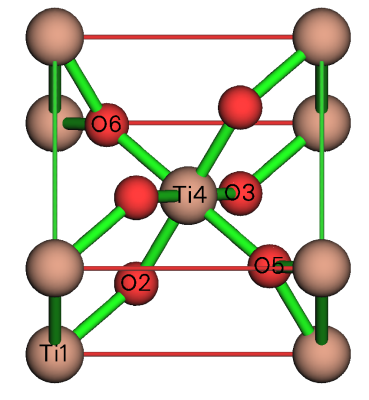

**使用Multiwfn对周期性体系计算Hirshfeld(-I)、CM5和MBIS原子电荷**  
Using Multiwfn to calculate Hirshfeld(-I), CM5 and MBIS atomic charges for periodic systems

文/Sobereva@[北京科音](http://www.keinsci.com)

First release: 2024-Jun-8    Last update: 2026-Jan-9

## 1 前言

原子电荷（atomic charge）即原子所带的净电荷，对于讨论化学体系中原子的带电状态有重要意义，作为原子的一种描述符它也和原子的很多属性有密切联系。强烈建议阅读《一篇深入浅出、完整全面介绍原子电荷的综述文章已发表！》（<http://sobereva.com/714>）里提到的笔者写的原子电荷的综述以全面了解原子电荷。

强大的波函数分析程序Multiwfn（<http://sobereva.com/multiwfn>）支持非常丰富的原子电荷计算方法，其中多数已经支持周期性体系。Multiwfn支持的方法中有一类是基于模糊式原子空间划分，也就是每个原子对应一个平滑的权重函数，权重函数与体系的电子密度的乘积的全空间积分就是这个原子带的电子数（原子的布居数），原子的核电荷数减去它就是原子电荷。Multiwfn支持的这类方法包括Hirshfeld、Hirshfeld-I、MBIS、Becke，以及对Hirshfeld电荷做后校正得到的ADCH和CM5电荷。从2024-May-25更新的Multiwfn版本开始，Hirshfeld、CM5、Hirshfeld-I、MBIS都已经支持了周期性体系，本文将具体介绍怎么用Multiwfn与非常流行、高效且免费的第一性原理程序CP2K相结合非常方便快速地计算这些原子电荷。Multiwfn计算这些电荷的功能是普适的，并不限于结合CP2K，也可以基于其它第一性原理程序产生的体系的电子密度的cube文件来算，还支持VASP产生的记录电子密度的CHGCAR文件。  
注：Multiwfn更老的一些版本也支持基于周期性波函数计算Hirshfeld和CM5电荷，但那时候用的算法对于周期性体系效率极低，本文介绍的做法与之有天壤之别。

下文第2节简要介绍一下Hirshfeld、Hirshfeld-I、CM5和MBIS原子电荷的基本特点，第3节介绍用Multiwfn+CP2K计算它们的具体方法，第4节给出具体例子，同时还会介绍怎么计算片段电荷。使用Multiwfn计算原子电荷在发表文章时记得需要按Multiwfn启动时的提示恰当引用Multiwfn。

Multiwfn可以在官网<http://sobereva.com/multiwfn>免费下载，如果对Multiwfn不了解的话建议看《Multiwfn FAQ》（<http://sobereva.com/452>）和《Multiwfn入门tips》（<http://sobereva.com/167>）。如果你用CP2K创建给Multiwfn算原子电荷用的输入文件的话，笔者假定你对CP2K的使用已经有基本且正确的了解，不具备这些知识的话非常建议通过**北京科音CP2K第一性原理计算培训班****（**[**http://www.keinsci.com/workshop/KFP_content.html**](http://www.keinsci.com/workshop/KFP_content.html)**）**完整、系统地学习一遍。本文的例子利用到Multiwfn创建CP2K的输入文件，相关介绍见《使用Multiwfn非常便利地创建CP2K程序的输入文件》（<http://sobereva.com/587>）。

## 2 Hirshfeld、Hirshfeld-I、CM5和MBIS等原子电荷简介

Hirshfeld、Hirshfeld-I、CM5和MBIS原子电荷在Multiwfn手册3.9节的相应小节里都有很详细的介绍，因此这里不介绍细节，只是简单说一下它们的特点。

Theor. Chim. Acta (Berl.), 44, 129 (1977)中提出的Hirshfeld电荷是被广为使用的原子电荷，计算方式简单，物理意义清楚，在量子化学研究孤立体系和第一性原理研究周期性体系的领域中都用得很多。Hirshfeld电荷为人诟病的地方是原子电荷数值整体严重偏小，对偶极矩、静电势重现性很差，这在我写的《原子电荷计算方法的对比》（<http://www.whxb.pku.edu.cn/CN/abstract/abstract27818.shtml>）里的对比测试中有充分体现。

JCP, 126, 144111 (2007)提出的Hirshfeld-I是在Hirshfeld基础上的改进，通过迭代方式不断更新原子权重函数直到收敛，这使得原子权重函数所描述的原子空间可以响应实际化学环境。其原子电荷数值显著大于Hirshfeld，对静电势的重现性也有明显改进。代价是Hirshfeld-I需要做迭代，往往几十轮，计算耗时明显高于Hirshfeld，而且需要事先提供体系中各种元素的各个氧化态的原子径向密度信息，实现起来较麻烦（为了实现Hirshfeld-I，我计算了360多个原子的径向密度文件并在Multiwfn中自带）。

务必注意，虽然CP2K程序自己也支持Hirshfeld-I电荷的计算，但我测试发现其结果和一般意义的Hirshfeld-I电荷不同，我检查了其源代码也确认了其实现方式明显不是基于Hirshfeld-I的标准定义，因此如果你要得到一般意义的Hirshfeld-I电荷，必须用Multiwfn来算。CP2K算的Hirshfeld电荷在结合SHAPE_FUNCTION DENSITY选项时的结果虽然不离谱，但结果和Multiwfn算的也存在不可忽视的差异，应当以Multiwfn的结果为准。

JCTC, 8, 527 (2012)中提出的CM5电荷和我在J. Theor. Comput. Chem., 11, 163 (2012)中提出的ADCH电荷一样都是对Hirshfeld电荷的后校正，对大部分情况都能使得它的原子电荷变得更大、更符合化学直觉，对静电势的重现性也明显变得更好。ADCH没有CM5那么强的经验性、不牵扯一堆经验参数，因而原理更为理想、更推荐使用。CM5最初是用于分子体系的，如今在应用于晶体方面也已经有了一定探索，例如JCTC, 16, 5884 (2020)将CM5与其它一些原子电荷对比考察了它们对一些固体的电荷分布的描述。CM5还被用于一些计算化学领域的方法，比如《比SMD算溶解自由能更好的溶剂模型uESE的使用》（<http://sobereva.com/593>）里介绍的uESE溶剂模型依赖于CM5电荷，CM5乘以1.2后适合结合OPLS-AA力场做动力学模拟，见《计算适用于OPLS-AA力场做模拟的1.2*CM5原子电荷的懒人脚本》（<http://sobereva.com/585>）。

ADCH电荷在分子体系的研究方面已被广为使用，之前有人问我是否会把ADCH电荷扩展到周期性体系。我目前没这个打算，因为ADCH电荷的思想对周期性体系往往不适用。ADCH方法将原子偶极矩展开为周围原子的校正电荷，但对于诸如NaCl这样的体系，每个原子所处的环境是中心对称的，因此原子偶极矩为0、校正电荷都为0，故ADCH电荷会与Hirshfeld电荷完全相同。

MBIS (Minimal Basis Iterative Stockholder)电荷于JCTC, 12, 3894 (2016)中提出。类似于Hirshfeld-I，此方法也是通过迭代方式（因此耗时较高）优化原子空间直到收敛。MBIS比Hirshfeld-I的一大好处是不需要利用各个元素各个氧化态的原子径向密度信息，因此实现起来简单得多，也更优雅。原文里的测试体现出MBIS比Hirshfeld-I整体更具有优势。但MBIS经常收敛较慢，对于某些体系甚至需要200多轮才能充分收敛。目前Multiwfn里MBIS最高支持到Rn元素。

根据我的测试，对于大多数固体体系，原子电荷大小的关系是MBIS和Hirshfeld-I最大、谁大不一定，CM5大小介中，Hirshfeld电荷最小。如果你对数值的绝对大小不那么在乎，只是想体现相对大小关系的话，最“朴素”且很便宜的Hirshfeld也可以用。但如果对定量数值关心的话，建议用其它的。CM5、Hirshfeld-I和MBIS用于晶体哪个最理想没有定论，都可以算一算看看，如果倾向于得到较大数值的结果可以优先考虑Hirshfeld-I和MBIS。如果其中有的原子电荷明显不合理那就弃掉换别的方法，比如O的电荷如果算出来-2.34那就不应该用，因为显然O最多只能带-2电荷。

特别要强调的是，绝对不要把原子电荷与氧化态搞混，也切勿用原子电荷判断氧化态！氧化态怎么正确地判断看《使用Multiwfn结合CP2K计算晶体中原子的氧化态》（<http://sobereva.com/711>）和《使用Multiwfn通过LOBA方法计算氧化态》（<http://sobereva.com/362>）。

还有很多其它原子电荷计算方法，诸如Mulliken电荷、Lowdin电荷、SCPA电荷、AIM电荷（被个别文章称为Bader电荷）等，Multiwfn也都支持将它们用于周期性体系，这不属于本文的范畴。Mulliken电荷结合CP2K里常用的MOLOPT系列和pob系列基组用于周期性体系也说得过去。虽然它是基于希尔伯特空间划分的原子电荷中最原始、思想最朴素的一种，但实际结果一般还算定性正确，而且计算耗时极低。被用得很多的AIM电荷实际上很糟糕，往往出现违背化学常识的结果，这在前述的《原子电荷计算方法的对比》里已经充分体现了，不建议用。

## 3 Hirshfeld、Hirshfeld-I、CM5和MBIS原子电荷在Multiwfn中的计算方法

### 3.1 CP2K用户的情况

首先说对于CP2K用户怎么计算。Hirshfeld、Hirshfeld-I、CM5和MBIS原子电荷都是完全基于电子密度计算的，不直接牵扯到波函数，在Multiwfn中计算它们有两种可以用的输入文件：  
(1)用CP2K产生的体系的电子密度cube文件作为输入文件。这种情况在CP2K计算时可以考虑k点，是我最推荐的，耗时非常低。如果不了解cube文件的格式的话，参看《Gaussian型cube文件简介及读、写方法和简单应用》（<http://sobereva.com/125>）。注意CP2K 2026.1以前的版本有bug，产生的cube文件里的原子有效电荷都为0，这会导致Multiwfn无法正确计算原子电荷。这里说的原子的有效核电荷是指当前基组描述的原子的电子数，对于赝势基组它对应价电子数。为此，要么用文本编辑器手动改cube文件中每个原子的有效核电荷，要么把cube文件第一行写成各个元素的有效核电荷，例如N 5 B 3 Ti 12，这代表当前体系中的N、B、Ti的有效核电荷数分别为5、3、12  
(2)用CP2K产生的记录了体系波函数的molden文件作为输入文件。详见《详谈使用CP2K产生给Multiwfn用的molden格式的波函数文件》（<http://sobereva.com/651>）。这个方法的缺点在于没法考虑k点，对于小晶胞体系必须先扩胞到足够大，从而在计算时只考虑gamma点，这显然使得在CP2K中和Multiwfn中的计算耗时都会比用(1)的方式高很多

用Multiwfn载入上述输入文件其中一种后，进入主功能7，然后选择相应选项即可计算Hirshfeld、Hirshfeld-I、CM5和MBIS原子电荷。对于molden文件当输入文件时，Multiwfn还会让你输入计算用的格点间距，格点间距越小耗时越高而计算精度越高，通常用0.2 Bohr就可以，是精度和耗时的较好权衡。而使用cube文件做为输入文件时，计算原子电荷用的格点间距与此文件的格点间距直接对应，CP2K的CUTOFF设得越大则产生的cube文件里的格点间距会越小。

由于Multiwfn计算上述电荷用的是均匀分布的格点，不可能准确积分较重原子的内核区域电子密度，因此上述输入文件应当是CP2K做GPW计算得到的，也需要用赝势基组，此时cube文件记录的电子密度或者molden文件里记录的波函数只对应于价电子。

顺带一提，如果你要计算Mulliken电荷，用Multiwfn载入上述的molden文件，然后进主功能7，依次选择5、1即可得迅速到结果。Multiwfn中计算AIM电荷的方法笔者以后会另文说明。

### 3.2 其它程序用户的情况

如果你是VASP用户，可以用记录晶胞中价电子密度的CHGCAR文件给Multiwfn用于计算前述原子电荷，等同于3.1节说的第2类输入文件。只要文件名里包含CHGCAR字样就会被Multiwfn当做是CHGCAR文件来载入。注意为了让Multiwfn得知各类原子的有效核电荷数，CHGCAR文件的第一行需要以Nval为开头，后面依次写上各类元素的名字和有效核电荷，并以空格分隔。比如写为Nval Na 1 Cl 7，这代表Na和Cl的有效核电荷数分别为1和7。一个具体例子是<http://sobereva.com/attach/712/CHGCAR_Si8.rar>。

注意VASP的PAW计算可能在原子核附近区域产生负值的电子密度。从2024-Dec-27更新的Multiwfn开始可以对这种情况给出正确的Hirshfeld、Hirshfeld-I、CM5电荷，但这种情况的电子密度原理上不兼容MBIS计算，所以算MBIS电荷时应当不用PAW。

如果你是其它第一性原理程序的用户，若程序可以产生记录晶胞中价电子密度的cube文件（即等同于3.1节说的第2类输入文件），也都可以用于给Multiwfn计算前述的原子电荷。

之后在Multiwfn中的计算过程和CP2K用户没任何区别。

## 4 实例

下面给出Multiwfn结合CP2K计算Hirshfeld、Hirshfeld-I、CM5和MBIS原子电荷的具体例子。相关的文件都可以在<http://sobereva.com/attach/712/file.zip>中得到（4.2、4.3和4.5节的cube/molden文件除外，因为文件过大）。

### 4.1 TiO2晶体

此例对TiO2的金红石晶型计算前述的原子电荷。它的实验晶体结构的cif文件是本文文件包里的TiO2-Rutile.cif，结构图如下所示

先用CP2K计算出这个晶胞的电子密度的cube文件，用于之后Multiwfn做原子电荷计算。首先用Multiwfn创建CP2K输入文件，启动Multiwfn并载入TiO2-Rutile.cif，然后输入  
cp2k  //创建CP2K的输入文件  
[回车]  //产生的文件名用默认的TiO2-Rutile.inp  
-3  //产生cube文件  
1  //电子密度  
8  //设置k点  
4,4,6  //与各个晶胞边长相乘皆为18埃左右，够用了  
0  //产生输入文件，计算级别为默认的PBE/DZVP-MOLOPT-SR-GTH

用CP2K运行刚得到的TiO2-Rutile.inp，马上就算完了，得到了TiO2-Rutile-ELECTRON_DENSITY-1_0.cube文件，在本文的文件包里已经提供了。如果你用的是CP2K 2026.1以前的版本，还需用文本编辑器打开此文件，把第一行改为Ti 12 O 6并保存。这代表Ti和O的有效核电荷分别为12和6，直接对应于输入文件里它们分别用的DZVP-MOLOPT-SR-GTH-q12和DZVP-MOLOPT-SR-GTH-q6基组名里面的q后面的值。

启动Multiwfn，输入  
TiO2-Rutile-ELECTRON_DENSITY-1_0.cube  //写此文件的实际路径  
y  //从第一行载入各个元素有效核电荷（对CP2K 2026.1及以后的版本产生的cube文件没有这一步）  
7  //布居分析与原子电荷计算  
1  //Hirshfeld电荷

立刻看到如下Hirshfeld电荷计算结果。由于格点间距不是无穷小，因此等价的原子算出来的原子电荷也会有轻微的数值差异，可以自己手动取平均。如果用更大的CUTOFF，则cube文件的格点间距会更小，不等价性会更低。  
Final atomic charges:  
Atom    1(Ti):     0.59349459  
Atom    2(O ):    -0.29461903  
Atom    3(O ):    -0.29472601  
Atom    4(Ti):     0.58363165  
Atom    5(O ):    -0.29385236  
Atom    6(O ):    -0.29385236  
现在Multiwfn还问你是否把原子电荷导出为chg文件，这里选n不导出。

接下来计算CM5电荷。在Multiwfn主功能7里选择16，马上就得到了结果  
                      ---------- CM5 charges ----------  
Atom:    1Ti  CM5 charge:    1.348393  Hirshfeld charge:    0.593495  
Atom:    2O   CM5 charge:   -0.672093  Hirshfeld charge:   -0.294619  
Atom:    3O   CM5 charge:   -0.672191  Hirshfeld charge:   -0.294726  
Atom:    4Ti  CM5 charge:    1.338580  Hirshfeld charge:    0.583632  
Atom:    5O   CM5 charge:   -0.671306  Hirshfeld charge:   -0.293852  
Atom:    6O   CM5 charge:   -0.671306  Hirshfeld charge:   -0.293852  
Summing up all CM5 charges:     0.00007649  
可见CM5电荷的大小明显大于Hirshfeld电荷，看起来更合理，而Hirshfeld电荷值明显偏小。

下面再演示计算Hirshfeld-I电荷。把Multiwfn自带的examples目录下的atmrad目录挪到当前目录下，这样Multiwfn计算Hirshfeld-I电荷时就会自动用此目录下的各种元素各个价态的径向电子密度。之后在主功能7里选15，再选1用默认的设置进行Hirshfeld-I电荷计算，经过16轮迭代得到了结果：  
Final atomic charges:  
Atom    1(Ti):     3.01789464  
Atom    2(O ):    -1.50888824  
Atom    3(O ):    -1.50886131  
Atom    4(Ti):     3.01787620  
Atom    5(O ):    -1.50897240  
Atom    6(O ):    -1.50897240  
可见Hirshfeld-I电荷的大小不仅显著大于Hirshfeld电荷，比CM5电荷还要大很多。虽然数值很大，但完全在合理范围内，毕竟都没有大过原子的氧化态。

接下来再计算MBIS电荷。在主功能7里选择20，再选1用默认的设置进行MBIS电荷计算，经过19轮迭代得到了结果：  
Final atomic charges:  
Atom    1(Ti):     1.73473636  
Atom    2(O ):    -0.86733169  
Atom    3(O ):    -0.86731253  
Atom    4(Ti):     1.73467041  
Atom    5(O ):    -0.86734303  
Atom    6(O ):    -0.86734303  
对于当前例子，MBIS的数值介于CM5和Hirshfeld-I之间。但也有很多反例，MBIS也经常比Hirshfeld-I电荷还大不少，后文有例子。

以上原子电荷的计算顺序是随意的，不要误以为必须按上述顺序计算，你想算哪个就算哪个即可。

### 4.2 AlN晶体

这一节计算AlN晶体的原子电荷。完全可以按照和上一节相同的做法基于电子密度的cube文件来计算，但本节演示一下基于超胞的molden文件的计算过程。AlN原胞的cif文件是本文文件包里的AlN.cif，将之载入Multiwfn，然后输入以下命令创建CP2K输入文件  
cp2k  //创建CP2K输入文件  
AlN_443.inp  //产生的输入文件名  
-11  //进入几何操作界面  
19  //构造超胞  
4  //a方向扩胞成原本的4倍  
4  //b方向扩胞成原本的4倍  
3  //c方向扩胞成原本的3倍  
-10  //返回  
-2  //要求产生molden文件  
0  //产生输入文件

用CP2K运行刚产生的AlN_443.inp，得到AlN_443-MOS-1_0.molden。在此文件开头插入以下内容定义晶胞和各个元素的价电子数  
[Cell]  
12.44400000     0.00000000     0.00000000  
-6.22200000    10.77682012     0.00000000  
 0.00000000     0.00000000    14.93400000  
[Nval]  
Al 3  
N 5

启动Multiwfn，载入AlN_443-MOS-1_0.molden，然后输入  
7  //布居分析与原子电荷计算  
16  //CM5电荷  
[回车]  //使用均匀分布的格点计算  
[回车]  //使用默认的0.2 Bohr格点间距。格点间距越小结果越精确但计算越耗时  
在i9-13980HX CPU上24核并行，50秒就算完了，结果为

                      ---------- CM5 charges ----------  
Atom:    1Al  CM5 charge:    0.467945  Hirshfeld charge:    0.302813  
Atom:    2N   CM5 charge:   -0.467945  Hirshfeld charge:   -0.302812  
Atom:    3Al  CM5 charge:    0.467945  Hirshfeld charge:    0.302812  
Atom:    4N   CM5 charge:   -0.467946  Hirshfeld charge:   -0.302814  
...略

Al的电负性很小，N的电负性很大，因此二者的原子电荷理应相差悬殊。当前的Hirshfeld电荷明显偏小。CM5电荷的数值虽然更大，但还是显得有些偏低。

下面再计算Hirshfeld-I电荷。在主功能7里输入  
15  //Hirshfeld-I  
1  //开始计算  
[回车]  //使用默认的0.2 Bohr格点间距

经过37轮收敛，结果如下。可见Hirshfeld-I电荷的数量级比较合理，体现出AlN中成键的极强离子性  
 Atom    1(Al):     1.80317384  
 Atom    2(N ):    -1.80317397  
 Atom    3(Al):     1.80317257  
 Atom    4(N ):    -1.80317539  
...略

最后再计算下MBIS电荷。在主功能7里输入  
20  //MBIS  
1  //开始计算  
[回车]  //使用默认的0.2 Bohr格点间距

对此体系MBIS收敛很慢，经过190轮才达到收敛，在i9-13980HX上24核并行算了5分钟，在双路7R32 96核并行下算了不到一分钟。结果如下。可见对此体系，MBIS电荷的数值很大，和氧化态几乎正好是一样的。所以，如前所述，若你就是想算出来比较大的原子电荷，可以先考虑MBIS，但也有一些例外，后面会提到。  
Atom    1(Al):     2.99599978  
Atom    2(N ):    -2.99601488  
Atom    3(Al):     2.99600129  
Atom    4(N ):    -2.99599935

### 4.3 MOF-5晶体

MOF-5晶体含有Zn、O、C、H。其cif文件是本文文件包里的MOF-5.cif。由于此体系的晶胞边长约26埃，因此计算电子密度格点数据时不用考虑k点。按照3.1节的做法，基于PBE/DZVP-MOLOPT-SR-GTH级别的电子密度cube文件（第一行改为Zn 12 O 6 C 4 H 1），用Multiwfn计算各种原子电荷，结果如下。此体系中O有两类，分别给出，C则处于较多不同的化学环境，其电荷就不给出了。

Hirshfeld：  
Zn=0.372 O=-0.332/-0.200 H=0.056

CM5：  
Zn=0.644 O=-0.584/-0.305 H=0.116

Hirshfeld-I（36轮收敛，2*7R32机子上96核并行4分多钟算完）  
Zn=1.568 O=-1.917/-0.746 H=0.139

MBIS（39轮收敛，2*7R32机子上96核并行3分多钟算完）  
Zn=1.546 O=-1.662/-0.782 H=0.190

对这个体系，MBIS和Hirshfeld-I相符得很好，而且Zn的电荷大小很合理。Hirshfeld电荷再次数值最小、CM5比之大一些。

### 4.4 其它：MoS2、BaTiO3、MgF2、NaCl

注意MBIS电荷并非总是较大。例如《使用Multiwfn结合CP2K计算晶体中原子的氧化态》（<http://sobereva.com/711>）里的单层MoS2的例子，在PBE/DZVP-MOLOPT-SR-GTH级别的波函数下，Mo的电荷的计算结果是Hirshfeld=0.330，CM5=0.827，Hirshfeld-I=1.987，MBIS=-0.059，Mulliken=-0.771。对这个体系来说CM5和Hirshfeld-I显得靠谱，MBIS电荷接近0有点说不通，Mulliken电荷明显有误导性。

BaTiO3在PBE/DZVP-MOLOPT-SR-GTH级别下的原子电荷计算结果如下。Hirshfeld还是严重偏小。Hirshfeld-I大得离谱，Ba的原子电荷都超过氧化态+2了。相较之下CM5和MBIS的结果比较靠谱，正好二者算的O的原子电荷差不多，差异主要在Ba和Ti的电荷的相对大小上。  
Atom:    1Ba  CM5 charge:    1.103253  Hirshfeld charge:    0.404357  
Atom:    2Ti  CM5 charge:    1.200467  Hirshfeld charge:    0.537212  
Atom:    3O   CM5 charge:   -0.767963  Hirshfeld charge:   -0.310211  
Atom:    4O   CM5 charge:   -0.767892  Hirshfeld charge:   -0.315693  
Atom:    5O   CM5 charge:   -0.767892  Hirshfeld charge:   -0.315693

Hirshfeld-I  
Atom    1(Ba):     2.37169239  
Atom    2(Ti):     3.02878350  
Atom    3(O ):    -1.78799416  
Atom    4(O ):    -1.80625420  
Atom    5(O ):    -1.80625434

MBIS：  
Atom    1(Ba):     0.57391985  
Atom    2(Ti):     1.69416825  
Atom    3(O ):    -0.74678425  
Atom    4(O ):    -0.76066530  
Atom    5(O ):    -0.76066537

再看两个典型离子化合物的情况，都在PBE/DZVP-MOLOPT-SR-GTH级别下计算。对NaCl计算的Na的原子电荷为：Hirshfeld=0.217，CM5=0.443，Hirshfeld-I：1.053，MBIS：1.043，Mulliken：0.596  
对MgF2计算的Mg的原子电荷为：  
Hirshfeld=0.414，CM5=0.828，Hirshfeld-I：2.048，MBIS：1.888，Mulliken：1.439  
可见对于强离子性化合物，Hirshfeld-I和MBIS电荷都在氧化态附近，并且由于方法定义的缺陷，往往电荷的大小还轻微大于氧化态的大小（但如果用大核赝势，对Na和Mg只描述最外层的3s价电子，则不会有这个问题）。其它原子电荷的大小关系为Mulliken>CM5>Hirshfeld。

以MgF2为例，这里顺带一提CP2K算的Hirshfeld-I电荷明显不对，千万不要用。在CP2K输入文件的&DFT/&PRINT里加上以下内容要求输出Hirshfeld-I电荷后，CP2K直接给出的Mg的Hirshfeld-I电荷为0.522，和Multiwfn算的相距甚远。  
&HIRSHFELD  
  SHAPE_FUNCTION DENSITY  
  SELF_CONSISTENT T  
&END HIRSHFELD

### 4.5 NaCl板吸附CO的片段电荷

NaCl板吸附CO是《使用CP2K结合Multiwfn绘制密度差图、平面平均密度差曲线和电荷位移曲线》（<http://sobereva.com/638>）里的一个例子体系，这里基于这个模型计算一下原子电荷和CO片段的电荷。CP2K优化这个体系后产生的NaCl_CO-1.restart文件在本文的文件包里提供了，将之载入Multiwfn，然后输入  
cp2k  //创建CP2K输入文件  
NaCl_CO.inp  //产生的输入文件名  
-7  //设置周期性  
XY  
-3  //要求产生cube文件  
1  //电子密度  
-2  //产生molden文件（用于之后算Mulliken电荷的目的）  
0  //产生输入文件

计算完毕后，把NaCl_CO-ELECTRON_DENSITY-1_0.cube文件第一行改为Na 9 Cl 7 C 4 O 6。先用Hirshfeld方法各个原子的电荷和CO的片段电荷。启动Multiwfn，载入此cube文件，然后输入  
7  //布居分析与原子电荷计算  
-1  //定义片段  
109,110  //CO的原子序号  
1  //Hirshfeld电荷  
结果为  
...略  
 Atom  109(C ):     0.13622804  
 Atom  110(O ):    -0.03514734

Fragment charge:    0.10108070  
Fragment population:    9.89891930

即CO的Hirshfeld片段电荷为0.101。

之后再选择CM5方法，结果为  
...略  
 Atom:  109C   CM5 charge:    0.147306  Hirshfeld charge:    0.136228  
 Atom:  110O   CM5 charge:   -0.081972  Hirshfeld charge:   -0.035147  
 Summing up all CM5 charges:     0.00510030

 Fragment charge:    0.06533361

之后再选择Hirshfeld-I方法，结果为  
 Atom  109(C ):     0.09790054  
 Atom  110(O ):    -0.08744136

 Fragment charge:    0.01045918

之后再选择MBIS方法，结果为  
...略  
 Atom  109(C ):     0.19642171  
 Atom  110(O ):    -0.15937966

 Fragment charge:    0.03704205

再来算Mulliken电荷。用Multiwfn载入加入了恰当的[Cell]和[Nval]信息的CP2K计算后产生的NaCl_CO-MOS-1_0.molden文件，输入  
7  //布居分析与原子电荷计算  
-1  //定义片段  
109,110  //CO的原子序号  
5  //Mulliken电荷  
1  //在屏幕上输出结果  
结果为  
...略  
Atom   109(C )    Population:  3.60671601    Net charge:  0.39328399  
Atom   110(O )    Population:  6.23484007    Net charge: -0.23484007  
Total net charge:   -0.00000086

Fragment charge:    0.15844392

可见不同方法计算的结果在定量上有一定差异，但都有共性，即CO整体带少量正电，即电子从CO往NaCl板上转移了一些。并且C和O分别带正电和负电，且原子电荷的绝对值都是C大于O。

## 5 总结

本文简要介绍了四种知名的基于模糊式原子空间划分计算原子电荷的方法的特点，包括Hirshfeld、Hirshfeld-I、CM5和MBIS，并介绍了它们在Multiwfn中的计算方法，并且给了很多具体例子，以使得读者能了解如何使用Multiwfn结合CP2K或其它第一性原理程序很容易地计算它们。同时还说明了怎么直接计算片段电荷，这是定量讨论体系中两部分间电子转移的最严格的方式。推荐将这些原子电荷应用于实际问题的研究当中以考察固体与表面体系的电荷分布情况。记得届时应恰当引用Multiwfn启动时提示的Multiwfn原文以及相应的原子电荷的原文。

通过本文的一些体系的对比可以明显看到，Hirshfeld电荷原理上最简单，但明显缺点是整体严重偏小，CM5通常比它大不少，而且电荷的稳定性不错。虽然结合化学直觉来看，CM5电荷的绝对大小仍然往往能偏小，但至少也不会明显离谱，总比Hirshfeld电荷更建议使用。Hirshfeld-I和MBIS电荷普遍比较大，谁更大不一定，至少几乎总比CM5还大不少，从绝对大小来看往往比CM5更合理，但稳健性比CM5弱一些，对极个别体系可能会表现得不符合常识。对于离子性特征很强的化合物，Hirshfeld-I和MBIS电荷往往接近氧化态，由于方法并不完美，有时候原子电荷甚至比氧化态还要大一点点。当然，没有任何原子电荷计算方法是绝对完美的，本文介绍的这些原子电荷在实际当中都可以用，可以根据它们的特点和实际结果决定选用，在横向对比时方法必须统一。

顺带一提，对于计算固体表面或者多孔物质的原子电荷以用于基于力场的动力学模拟的目的，我目前最推荐CP2K算REPEAT电荷，北京科音CP2K第一性原理计算培训班（<http://www.keinsci.com/workshop/KFP_content.html>）里讲“电子结构的分析”的部分做了专门的介绍。但REPEAT电荷需要在真空区定义拟合点，因而无法用于诸如本文所示的AlN、TiO2等致密的固体，而且对于远离真空区的原子也没法拟合出质量靠谱的原子电荷。所以REPEAT电荷有特定用处，但不是像本文介绍的那些原子电荷一样属于普适性的原子电荷计算方法。
