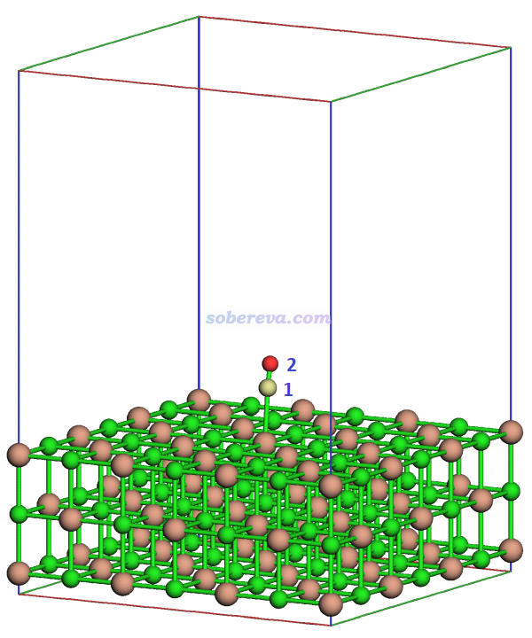
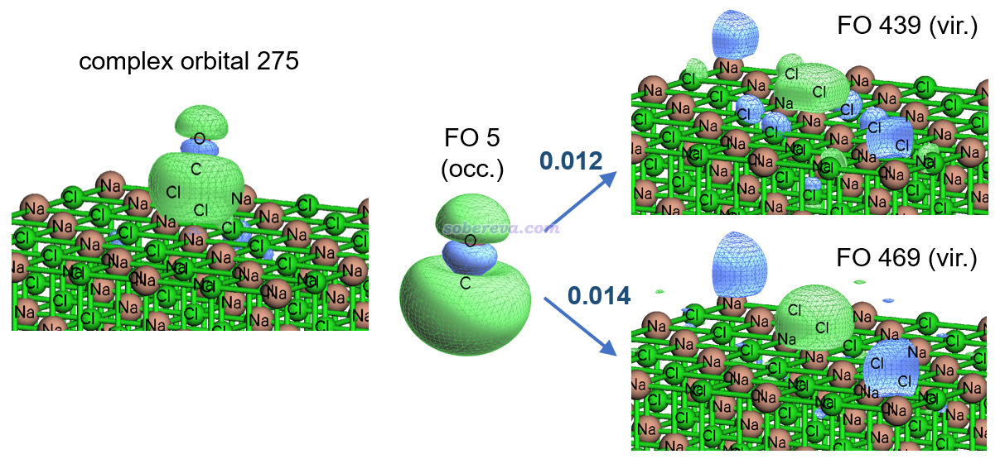

**使用Multiwfn结合CP2K对周期性体系做电荷分解分析（CDA）**  
Using Multiwfn in combination with CP2K to perform charge decomposition analysis (CDA) for periodic systems

文/Sobereva@[北京科音](http://www.keinsci.com)  2024-Jul-1

## 1 前言

笔者之前写过《使用Multiwfn做电荷分解分析(CDA)、绘制轨道相互作用图》（<http://sobereva.com/166>）介绍了怎么用Multiwfn程序基于Gaussian等量子化学程序产生的波函数文件对分子体系做电荷分解分析（CDA）。这种方法可以从片段轨道间相互作用的角度深入了解片段间是如何转移电子的。由于CDA的很高价值，Multiwfn做CDA分析已经得到非常广泛的使用。如果读者没看过此<http://sobereva.com/166>的话一定要先仔细看一下，否则无法理解下文的内容。

从2024-Jun-5更新的Multiwfn开始，CDA模块已经支持了基于CP2K产生的molden文件做周期性体系的CDA分析，下面将通过一个简单的例子进行演示。Multiwfn可以在主页<http://sobereva.com/multiwfn>免费下载，不了解此程序者参看《Multiwfn FAQ》（<http://sobereva.com/452>）和《Multiwfn入门tips》（<http://sobereva.com/167>）。我假定读者已经具备了CP2K的基本使用知识，不了解者推荐通过北京科音CP2K第一性原理计算培训班（<http://www.keinsci.com/workshop/KFP_content.html>）完整系统地学习。

本文的例子是计算NaCl板吸附CO分子的体系，用CDA方法考察CO与NaCl板之间电子转移情况。这个体系优化后的结构如下，C和O分别是1和2号原子，3-110号原子是NaCl板。对这个体系，之前我在《使用CP2K结合Multiwfn绘制密度差图、平面平均密度差曲线和电荷位移曲线》（<http://sobereva.com/638>）中通过密度差图的方式定性考察了电子转移，在《使用Multiwfn对周期性体系计算Hirshfeld(-I)、CM5和MBIS原子电荷》（<http://sobereva.com/712>）里通过片段电荷的方式定量考察了电子转移。而下面用CDA分析，可以以轨道角度在明显更深层次理解电子转移细节。

本文例子涉及的所有文件都在<http://sobereva.com/attach/716/file.7z>里。CP2K用的版本是2024.1，Multiwfn是2024-Jun-5更新的版本，读者绝对不要用Multiwfn的更老版本。

## 2 产生输入文件

首先我们要用CP2K计算NaCl+CO、NaCl、CO各自的molden格式的波函数文件。如果你不知道怎么用CP2K产生molden文件的话，先仔细阅读《详谈使用CP2K产生给Multiwfn用的molden格式的波函数文件》（<http://sobereva.com/651>），我假定读者已经看过本文了。这里有几个要点：  
(1)整体和片段的molden文件里的原子坐标必须对应  
(2)整体和片段的计算必须使用严格相同的级别和设置，用的盒子也应当一致  
(3)必须要求CP2K计算所有空轨道  
(4)整体的molden文件里需要加入[Cell]字段定义晶胞信息，而片段的molden文件里加不加入不影响CDA结果。[Nval]字段可加入可不加入，也不影响CDA结果

本文文件包里的NaCl_CO.cif是以前我在PBE-D3(BJ)/DZVP-MOLOPT-SR-GTH下优化的NaCl板吸附CO的结构文件。用Multiwfn载入它，然后输入  
cp2k  //创建CP2K输入文件  
NaCl_CO.inp  //产生的输入文件名  
-2  //要求产生molden文件  
-9  //其它设置  
12  //设置计算的空轨道数  
-1  //计算所有空轨道  
0  //返回  
0  //产生输入文件

用CP2K运行NaCl_CO.inp，得到NaCl_CO-MOS-1_0.molden。然后将以下字段插入到molden文件的开头  
[Cell]  
 16.92168000     0.00000000     0.00000000  
  0.00000000    16.92168000     0.00000000  
  0.00000000     0.00000000    25.00000000

将NaCl_CO.inp复制为NaCl.inp，再将NaCl.inp中&COORD里的CO部分删掉、PROJECT NaCl_CO改名为PROJECT NaCl，然后用CP2K运行之，得到NaCl-MOS-1_0.molden。将上面的[Cell]加入其中（这和CDA分析无关，加入这个的目的是为了之后在Multiwfn中能正确观看NaCl板的周期性的晶体轨道）。

将NaCl_CO.inp复制为CO.inp，再将CO.inp中&COORD里的NaCl部分删掉、PROJECT NaCl_CO改名为PROJECT CO，然后用CP2K运行之，得到CO-MOS-1_0.molden。这个可以不用刻意加上[Cell]，因为当前体系中CO离盒子边界很远，显示轨道时是否考虑周期性对看到的图像没影响。

接下来就可以进行CDA分析了。

## 3 进行CDA分析

启动Multiwfn，载入NaCl_CO-MOS-1_0.molden，然后依次输入  
16  //CDA分析  
2  //两个片段  
CO-MOS-1_0.molden  //CO的波函数文件。注意要按整个体系里原子序号顺序载入片段  
NaCl-MOS-1_0.molden  //NaCl板的波函数文件

现在屏幕上输出了一大堆复合物轨道的CDA结果，同时还输出了ECDA结果：  
The net electrons obtained by frag. 2 = CT( 1-> 2) - CT( 2-> 1) =    0.1580  
这个ECDA结果告诉你CO（片段1）往NaCl板（片段2）转移了0.158个电子，这和《使用Multiwfn对周期性体系计算Hirshfeld(-I)、CM5和MBIS原子电荷》（<http://sobereva.com/712>）里通过Mulliken方法计算的CO的片段电荷严格相同。

当前CDA分析输出的复合物轨道太多，一共437个（对应整个体系的占据轨道数），而绝大多数对d、b、r项的贡献微乎其微或完全为0，没有考察的意义。为了简化输出，在当前界面里输入  
-3  //设置CDA输出时d、b、r项的阈值，它们之一的绝对值大于这个阈值的复合物轨道才会输出  
0.005  
0  //显示CDA和ECDA结果

当前结果如下  
   Orb.      Occ.          d           b        d - b          r  
     272    2.000000    0.006220   -0.000012    0.006232    0.000488  
     275    2.000000    0.125862   -0.001874    0.127736    0.051155  
     297    2.000000    0.001098    0.000305    0.000792   -0.005373  
     318    2.000000    0.001053    0.000326    0.000727   -0.005720  
     341    2.000000    0.000781    0.000200    0.000581   -0.006708  
     352    2.000000    0.002291    0.000731    0.001560   -0.015705  
     360    2.000000    0.001101    0.000298    0.000803   -0.009297  
     414    2.000000    0.000635    0.000214    0.000421   -0.005229  
     427    2.000000    0.000739    0.000219    0.000520   -0.005731  
 -------------------------------------------------------------------  
 Sum:     874.000000    0.153805    0.017732    0.136074   -0.037831  
 Note: The "Sum" includes all terms including those not printed above

CDA的总结果是CO向NaCl转移了d=0.154个电子，NaCl向CO反馈了b=0.018个电子，NaCl净获得d-b=0.136个电子。b项基本可以忽略不计，而d的主要贡献是由275号复合物轨道造成的。这个复合物轨道的贡献显然值得进一步探究，看看是由CO和NaCl板的哪些片段轨道混合所造成的。为此，输入  
6  //将特定复合物轨道对CDA项的贡献进行分解  
275  //要考察的复合物轨道序号  
0.005  //输出阈值  
现在看到如下结果

Occupation number of orbital   275 of the complex:  2.00000000  
 FragA Orb(Occ.)  FragB Orb(Occ.)      d           b        d - b          r  
    5( 2.0000)     271( 2.0000)    0.000000    0.000000    0.000000    0.005183  
    5( 2.0000)     289( 2.0000)    0.000000    0.000000    0.000000    0.005642  
    5( 2.0000)     336( 2.0000)    0.000000    0.000000    0.000000    0.005127  
    5( 2.0000)     341( 2.0000)    0.000000    0.000000    0.000000    0.008960  
    5( 2.0000)     435( 0.0000)    0.009358    0.000000    0.009358    0.000000  
    5( 2.0000)     439( 0.0000)    0.011934    0.000000    0.011934    0.000000  
    5( 2.0000)     443( 0.0000)    0.010929    0.000000    0.010929    0.000000  
    5( 2.0000)     447( 0.0000)    0.008032    0.000000    0.008032    0.000000  
    5( 2.0000)     453( 0.0000)    0.009177    0.000000    0.009177    0.000000  
    5( 2.0000)     465( 0.0000)    0.010755    0.000000    0.010755    0.000000  
    5( 2.0000)     469( 0.0000)    0.013735    0.000000    0.013735    0.000000  
    5( 2.0000)     473( 0.0000)    0.011282    0.000000    0.011282    0.000000  
 Sum of above terms:               0.085201    0.000000    0.085201    0.024911

可以看到CO向NaCl转移电子靠的都是CO的5号占据轨道和NaCl空轨道相互作用。NaCl板接收CO转移来的电子分散在其大量空轨道上，比如NaCl板的443号空轨道接受了0.011个电子。在当前的输出阈值下，上面输出的这些项的所有的d项加和为0.085，明显和275号复合物轨道的总d值0.153有很大差距，说明CO还向上面没输出的很多其它的NaCl板的空轨道转移了电子。

下图把275号复合物轨道、CO的5号占据轨道，以及NaCl接收CO贡献来的电子最多的两个轨道（439、469）展示在了一起，便于大家直观了解情况，等值面数值用的是0.02。复合物和片段的轨道可以用Multiwfn载入相应的波函数文件后用主功能0按照《使用Multiwfn观看分子轨道》（<http://sobereva.com/269>）说的观看。从此图可以清晰直观地认识到CO的孤对电子往吸附CO的那个Na位点的空轨道上转移了电子。还有大量也具有这种特征的NaCl板的空轨道也接收了CO的孤对电子，这里没全都画出来。

下面再看一下上图中275号复合物轨道是怎么由片段轨道构成的。按0返回到CDA菜单，然后进入选项2，输入275，看到以下信息

 Note: Only the fragment orbitals with contribution >  1.0 % will be shown below, the threshold can be changed by "compthresCDA" in settings.ini

 Occupation number of orbital   275 of the complex:  2.00000000  
  Orbital     5 of fragment  1, Occ: 2.00000    Contribution:   87.42 %  
  Sum of values shown above:     87.42 %

这告诉你275号复合物轨道由CO的5号占据轨道贡献了87.4%。默认情况下只有贡献大于1%的片段轨道才会输出，虽然NaCl板的一大堆非占据轨道都通过与CO的5号轨道混合而参与了这个复合物轨道的构成，但贡献都小于输出阈值，所以上面没看到。从当前信息可以认识到275号复合物轨道主要体现CO的5号轨道特征，这是为什么上面图中275号复合物轨道和CO的5号轨道看起来十分相似。

## 4 总结

此文通过一个简单的表面吸附的例子演示了怎么用Multiwfn的CDA功能分析周期性体系的电荷转移本质。讨论电子转移常见的套路就是绘制电子密度差、算算片段电荷，而从本文的例子看到Multiwfn可以从片段轨道相互作用对电子转移的本质进行深入的考察，掌握了本文介绍的方法明显可以给分析增光添彩。

使用Multiwfn做本文介绍的分析请记得在发表文章时引用Multiwfn程序启动时提示的Multiwfn原文，以及引用介绍CDA/GCDA方法的文章（Multiwfn用的实质上是我对CDA广义化后的GCDA形式），这在进入Multiwfn的CDA功能时屏幕上明确提示了。
