**使用Multiwfn做周期性体系的atom-in-molecules (AIM)拓扑分析**  
Using Multiwfn to perform atom-in-molecules (AIM) topology analysis for periodic systems

文/Sobereva@[北京科音](http://www.keinsci.com/)   2024-Jul-3

## 0 前言

Bader提出的非常知名的atom-in-molecules (AIM)理论在分析孤立体系和周期性体系的电子结构方面有非常广泛的应用，相关资料汇总见《AIM学习资料和重要文献合集》（<http://bbs.keinsci.com/thread-362-1-1.html>）。AIM分析框架中最常见的分析手段之一是电子密度的拓扑分析，也常被称为AIM拓扑分析，例如根据这种拓扑分析得到的键临界点（BCP）的位置可以用来讨论成键和弱相互作用特征，参考《Multiwfn支持的分析化学键的方法一览》（<http://sobereva.com/471>）和《Multiwfn支持的弱相互作用的分析方法概览》（<http://sobereva.com/252>）里的相关介绍。非常强大的波函数分析程序Multiwfn（<http://sobereva.com/multiwfn>）很早以前就已经支持了结合Gaussian、ORCA等量子化学程序产生的波函数文件对孤立体系做AIM拓扑分析，见《使用Multiwfn做拓扑分析以及计算孤对电子角度》（<http://sobereva.com/108>）和Multiwfn手册4.2节的大量例子。如今Multiwfn也已支持了对周期性体系做AIM拓扑分析，本文的目的是对此进行演示，以使得读者可以轻松地举一反三充分将这种手段应用于实际研究中。使用Multiwfn做AIM拓扑分析在发表文章时记得需要按照Multiwfn启动时的提示恰当引用Multiwfn的原文。

读者务必使用2024-Jun-16及以后更新的Multiwfn版本，否则情况与本文所述不符。Multiwfn可以在主页<http://sobereva.com/multiwfn>免费下载。不了解Multiwfn者建议阅读《Multiwfn入门tips》（<http://sobereva.com/167>）和《Multiwfn FAQ》（<http://sobereva.com/452>）。本文要用到非常流行、高效且免费的第一性原理程序CP2K，不熟悉者推荐通过“北京科音CP2K第一性原理计算培训班”（<http://www.keinsci.com/workshop/KFP_content.html>）系统性学习。本文要使用Multiwfn创建CP2K输入文件，这在《使用Multiwfn非常便利地创建CP2K程序的输入文件》（<http://sobereva.com/587>）里有简要介绍。本文用的CP2K是2024.1版。

下面的例子涉及到的所有文件都可以在<http://sobereva.com/attach/717/file.rar>里得到。

## 1 实例1：NaCl晶体

这一节对NaCl做AIM拓扑分析，要使用CP2K产生的molden文件作为Multiwfn的输入文件。molden文件的产生方法在《详谈使用CP2K产生给Multiwfn用的molden格式的波函数文件》（<http://sobereva.com/651>）里有详细说明。由于考虑k点时CP2K没法产生molden文件，因此必须使用足够大的超胞模型并只考虑gamma点。本文文件包里NaCl.cif是NaCl单胞的晶体结构文件，基于它我们创建CP2K算单点任务的超胞的输入文件，同时得到molden文件。

用Multiwfn载入NaCl.cif，然后输入  
cp2k  //创建CP2K输入文件的界面  
[回车]  //产生的输入文件名用默认的NaCl.inp  
-2  //要求产生molden文件  
-11  //几何操作界面  
19  //构造超胞  
2  //第1个方向平移复制为原先的2倍  
2  //第2个方向平移复制为原先的2倍  
2  //第3个方向平移复制为原先的2倍  
-10  //返回  
0  //产生输入文件

现在当前目录下就有了NaCl.inp，对应的是PBE/DZVP-MOLOPT-SR-GTH计算级别，对此体系是合适的。当前晶胞边长为11.28埃，对于绝缘体来说只考虑gamma点基本够用。用CP2K运行NaCl.inp，得到NaCl-MOS-1_0.molden。用文本编辑器打开NaCl.inp，将以下内容插入文件开头来定义晶胞信息从而使得Multiwfn在分析时能考虑周期性，并且定义Na和Cl的价电子数分别为9和7（不了解为什么这么设置的人看前述的《详谈使用CP2K产生给Multiwfn用的molden格式的波函数文件》）。  
 [Cell]  
11.28112000     0.00000000     0.00000000  
 0.00000000    11.28112000     0.00000000  
 0.00000000     0.00000000    11.28112000  
 [Nval]  
 Na 9  
 Cl 7

下面开始做AIM拓扑分析。启动Multiwfn，载入NaCl-MOS-1_0.molden，然后输入  
2  //拓扑分析（默认是对电子密度做拓扑分析）  
2  //以每个原子核位置为初猜搜索临界点

当前从屏幕上会看到找到了64个(3,-3)临界点，分别对应64个原子核位置的电子密度极大点。之所以虽然当前用的是赝势基组，在原子核位置还能找到电子密度极大点，是因为Multiwfn自动对这些原子指认了合适的EDF信息来描述内核电子，详见《在赝势下做波函数分析的一些说明》（<http://sobereva.com/156>）。

然后再输入  
3  //以每两个原子间连线中点作为搜索临界点的初猜位置  
4  //以每三个原子的中心位置作为搜索临界点的初猜位置  
0  //观看结果

此时文本窗口显示了各种临界点的数目，如下所示，并且提示Poincare-Hopf关系已经满足了，因此大概率所有临界点都已经找全了。  
 The number of critical points of each type:  
 (3,-3):    64,   (3,-1):   384,   (3,+1):   384,   (3,+3):    64  
 Poincare-Hopf verification:    64  -   384  +   384  -    64  =     0  
 Fine, Poincare-Hopf relationship is satisfied, all CPs may have been found

在Multiwfn的图形窗口可以看到下图，棕红色大球是Na，绿色大球是Cl，橙色、黄色、绿色小球分别是电子密度的(3,-1)、(3,+1)和(3,+3)临界点，而(3,-3)临界点都被原子球挡住了。在Multiwfn手册3.14节对Multiwfn的拓扑分析功能有完整、非常详细的说明，建议阅读。

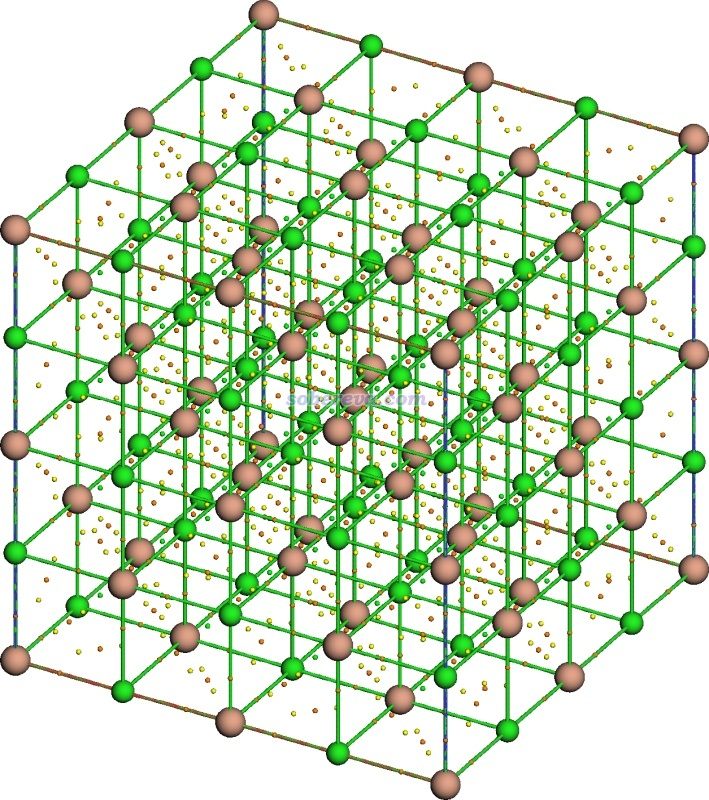

下面再把AIM拓扑分析里常涉及的键径产生出来。在图形界面右上角点Return关闭之，然后选8产生(3,-3)和(3,-1)之间的拓扑路径，也即键径。在笔者的i9-13980HX CPU上24核并行很快就产生完了。之后再选0进入图形界面观看，看到下图，可见所有键径（棕色细线）都产生了出来，既连接相邻的Na和Cl，也连接每一对临近的两个Cl。

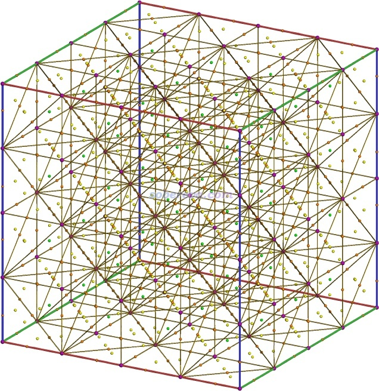

默认情况下Multiwfn把处于晶胞边缘的所有镜像原子和临界点也显示了出来，如果不想显示它们的话（也即只显示晶胞中唯一的那些），在图形界面顶端依次选择Other settings - Toggle showing all boundary atoms和Toggle showing all boundary CPs and paths。在文本窗口也会看到当前设置的状态。

下面来考察一下Na和Cl之间的BCP的属性。用选项0的图形界面右边的选项把其它临界点关闭显示而只显示(3,-1)临界点，选择CP labels复选框要求显示临界点序号，关闭键径显示并要求显示原子，然后就能看到下图，这是当前图像的一个边缘区域（点击save picture按钮可在当前目录下得到高分辨率图像文件，下图是剪切出的一部分）

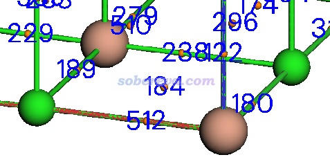

可见189、512、238等序号的临界点都对应Na-Cl的BCP，考察哪个都可以，都是等价的。点击Return按钮关闭图形窗口，然后选择7进入临界点属性计算界面，然后再输入临界点序号189，此时就看到了这个临界点处各种函数的值，如下所示。这些函数在Multiwfn手册2.6节都有简要介绍，且在“量子化学波函数分析与Multiwfn程序培训班”（<http://www.keinsci.com/workshop/WFN_content.html>）里有十分全面深入详细的讲解。

CP type: (3,-1)  
 Density of all electrons:  0.1144132659E-01  
 Density of Alpha electrons:  0.5720663296E-02  
 Density of Beta electrons:  0.5720663296E-02  
 Spin density of electrons:  0.0000000000E+00  
 Lagrangian kinetic energy G(r):  0.1168592222E-01  
 G(r) in X,Y,Z:  0.7296255010E-03  0.1022667133E-01  0.7296253875E-03  
 Hamiltonian kinetic energy K(r): -0.3025433987E-02  
 Potential energy density V(r): -0.8660488230E-02  
 Energy density E(r) or H(r):  0.3025433987E-02  
 Laplacian of electron density:  0.5884598270E-01  
 Electron localization function (ELF):  0.1993303578E-01  
 Localized orbital locator (LOL):  0.1249064363E+00  
...略

如我在全面提到的《Multiwfn支持的分析化学键的方法一览》文中所述，BCP位置上电子密度拉普拉斯函数和能量密度都为正是离子键的典型特征。当前BCP这两个值分别为0.0588 a.u.和0.00302 a.u.，都为正值，完全体现出Na-Cl是离子键的实事。此外，当前BCP的电子密度仅为0.01144 a.u.、ELF仅为0.0199，BCP处很小的电子密度和ELF值也是典型的离子键的普遍共性。

我在《使用Multiwfn+VMD快速地绘制高质量AIM拓扑分析图（含视频演示）》（<http://sobereva.com/445>）介绍了一种极好的将Multiwfn和VMD联用快速、理想地绘制AIM拓扑分析图的做法，比在Multiwfn里直接显示的效果更好，而且视角可以自由旋转，没看过的话务必先看一下。对于当前体系，也可以像此文一样用Multiwfn文件包里的examples\scripts\AIM.bat和AIM.txt来作图，得到的图像如下。

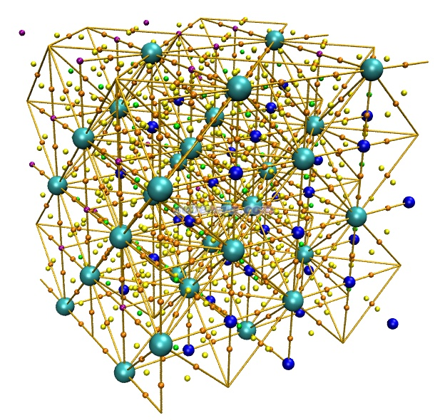

上图效果明显不好，显得残缺不全，这是因为此时显示的原子、临界点、键径都只有晶胞里唯一的那些，而处于棱和面上的边界原子、临界点、键径的周期镜像都没有显示出来。为了避免这个问题，对于当前体系有原子、临界点、键径处于棱和面上的情况，应当改用examples\scripts\目录下的AIM+boundary.bat和AIM+boundary.txt来绘制，其用法与AIM.bat和AIM.txt的组合完全一致。只不过前者传递给Multiwfn的指令要求Multiwfn导出mol.pdb、CPs.pdb和paths.pdb文件时把边界的镜像也都纳入进去。利用AIM+boundary.bat和AIM+boundary.txt来绘制的结果如下，可见此时的效果就很好了，和前面在Multiwfn里看到的完全相同。注意此时这三个pdb文件里只有序号靠前的那些才是晶胞中唯一的那些。

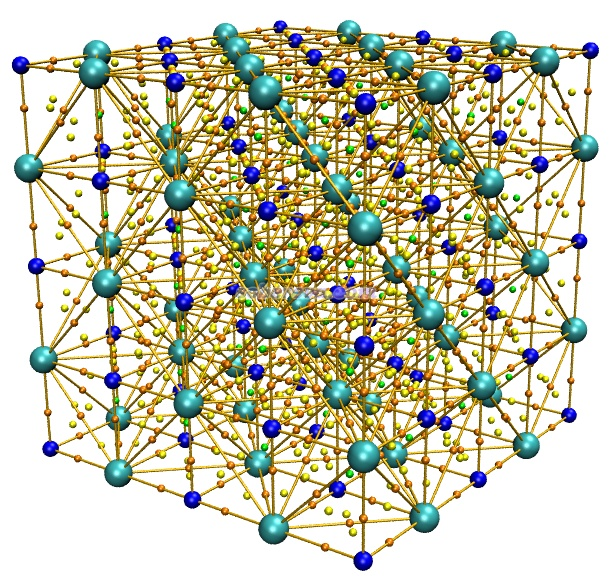

## 2 层状COF

下面再举个例子，用Multiwfn对一个层状的共价有机框架化合物（COF）体系做AIM拓扑分析。此体系的cif文件是本文文件包里的COF-12000N2.cif，其结构图如下所示。

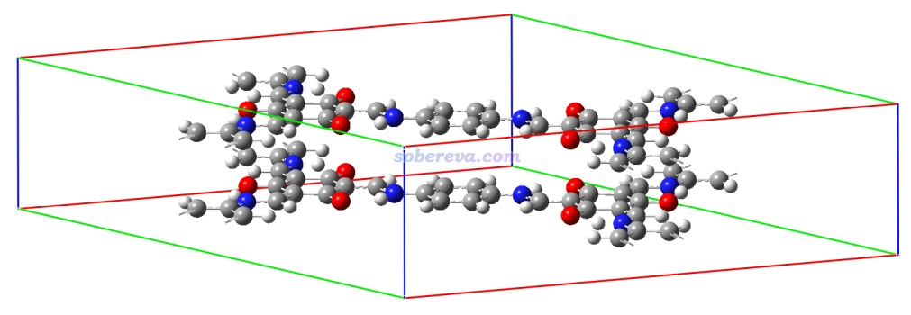

由于此体系的晶胞尺寸不小，计算时可以直接对原胞做只考虑gamma点的计算来得到molden文件。如《实验测定分子结构的方法以及将实验结构用于量子化学计算需要注意的问题》（<http://sobereva.com/569>）所说，由于X光衍射测的晶体结构中氢的原子位置通常不准确，最好做分析前先冻结重原子而优化一下氢原子的坐标，但此例为了省事就跳过这一步了。如果你要用AIM拓扑分析考察氢键，由于氢的位置是重中之重，那显然是绝对不能略过这一步的。

当前体系用PBE结合CP2K的GTH赝势基组计算完全可以，而此例作为演示，这回使用PBE结合pob-TZVP-rev2全电子基组计算。启动Multiwfn，载入COF-12000N2.cif，然后输入  
cp2k  //创建CP2K输入文件的界面  
[回车]  //产生的输入文件名用默认的COF-12000N2.inp  
-2  //要求产生molden文件  
2  //选择基组  
15  //pob-TZVP-rev2  
4  //开OT，对当前用的基组通常比对角化明显更容易收敛  
0  //产生输入文件

用CP2K计算COF-12000N2.inp，然后将以下晶胞设置信息插入到计算得到的COF-12000N2-MOS-1_0.molden文件的开头  
 [Cell]  
 22.55600000     0.00000000     0.00000000  
-11.27800000    19.53406901     0.00000000  
  0.00000000     0.00000000     6.80000000

启动Multiwfn，载入COF-12000N2-MOS-1_0.molden，然后输入  
2  //拓扑分析（默认是对电子密度做拓扑分析）  
2  //以每个原子核位置为初猜位置搜索临界点  
3  //以每两个原子间连线中点作为搜索临界点的初猜位置  
4  //以每三个原子的中心位置作为搜索临界点的初猜位置  
8  //产生(3,-3)到(3,-1)的拓扑路径  
0  //观看结果  
现在看到下图。可见临界点和键径都成功地得到了，不仅有化学键对应的BCP和键径，COF内氢键N-H...O作用以及层之间相互作用相对应的BCP和键径都有。而且不仅有晶胞内两层COF之间相互作用的BCP和键径，当前晶胞里的COF和相邻镜像晶胞里的COF相互作用对应的BCP和键径也都有，显然周期性完全充分考虑了。

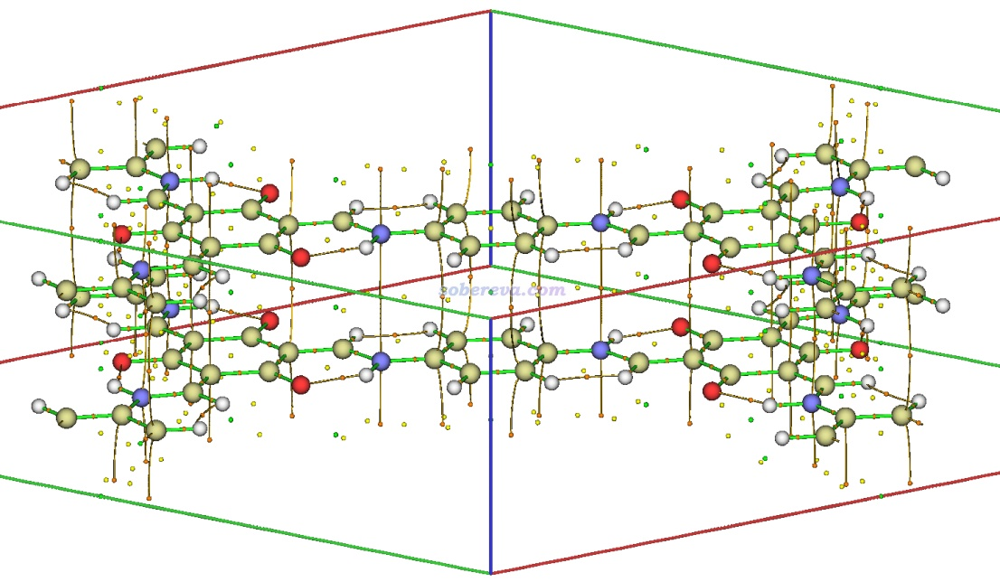

虽然Multiwfn的文本窗口提示当前并未符合Poincare-Hopf关系，但由于感兴趣的临界点和键径都有了，所以就没必要进一步搜索了。

再利用前述名为AIM+boundary.bat的Windows批处理脚本结合AIM+boundary.txt里记录的指令，用Multiwfn+VMD绘制体系结构+临界点+键径图。然后再在VMD的文本窗口里输入pbc box命令显示盒子，VMD main界面里选择Display - Orthographic用正交视角。此时VMD显示的图像如下，可见非常理想！

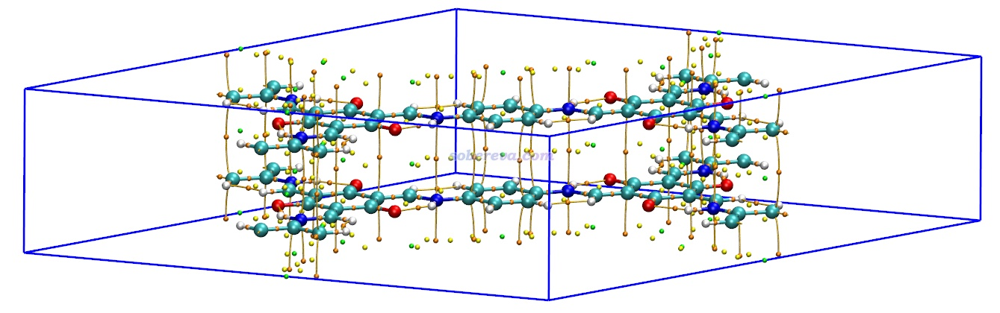

顺带一提，对于当前体系要想完整展现层间相互作用的话，最理想的做法是用我提出的IGMH，见《使用Multiwfn做IGMH分析非常清晰直观地展现化学体系中的相互作用》（<http://sobereva.com/621>），以及我的综述《一篇最全面介绍各种弱相互作用可视化分析方法的文章已发表！》（<http://sobereva.com/667>）和《Angew. Chem.上发表了全面介绍各种共价和非共价相互作用可视化分析方法的综述》（<http://sobereva.com/746>）。

## 3 对Ag晶胞基于电子密度格点数据做AIM拓扑分析

Multiwfn不仅可以基于CP2K产生的波函数文件做AIM拓扑分析，还可以基于从cube等文件里载入的电子密度的格点数据做拓扑分析，此时各个位置的电子密度、梯度和Hessian矩阵基于格点数据以B-spline方式插值得到。由于这个特性，Multiwfn做周期性体系的AIM拓扑分析不限于CP2K用户，诸如从VASP产生的CHGCAR文件里读取电子密度格点数据做AIM拓扑分析也可以。Multiwfn支持哪些格点数据文件格式见手册2.5节的说明。而且CP2K用户还可以在考虑k点的情况下对原胞计算得到电子密度cube文件结合Multiwfn做AIM拓扑分析，而不必在晶胞较小时非得弄成超胞模型再算。但基于电子密度格点数据做AIM拓扑分析的关键不足是对临界点只能得到电子密度及其导数信息以及一些与之直接相关的量，而依赖于波函数才能计算的如动能密度、ELF等函数就没法计算了。另外，如果电子密度格点数据是在赝势下计算产生的，基于它插值出的电子密度函数中，原子核处将没有电子密度极大点，也因此无法产生键径。

此例演示用Multiwfn对Ag的单胞基于电子密度cube文件做AIM拓扑分析的过程。使用的级别是PBE/TZVPP-MOLOPT-PBE-GTH-q19，这个基组是CP2K 2024.1的data目录下的BASIS_MOLOPT_UZH基组文件里的。之所以不用常用的BASIS_MOLOPT里的Ag的基组，在于那里面Ag的基组都是-q11的，即只描述11个价电子。使用赝势的情况下做AIM拓扑分析时，被描述的价电子越多，即使用越小核赝势，结果越准确、越可能接近全电子计算的结果。

启动Multiwfn，载入本文文件包里的Ag单胞的晶体结构文件Ag.cif，然后输入  
cp2k  //创建CP2K输入文件的界面  
[回车]  //产生的输入文件名用默认的Ag.inp  
-3  //要求产生cube文件  
1  //电子密度  
6  //开smearing  
8  //设置k点  
10,10,10  
0  //产生输入文件

把Ag.inp里BASIS_SET_FILE_NAME设为BASIS_MOLOPT_UZH，POTENTIAL_FILE_NAME设为POTENTIAL_UZH。Ag的BASIS_SET设为TZVPP-MOLOPT-PBE-GTH-q19，POTENTIAL设为GTH-PBE-q19。然后用CP2K计算，之后会得到记录晶胞内价电子密度的Ag-ELECTRON_DENSITY-1_0.cube。如果不了解cube格式的话，看《Gaussian型cube文件简介及读、写方法和简单应用》（<http://sobereva.com/125>）。用文本编辑器打开这个cube文件，在第一行里写上box2cell。这样Multiwfn载入这个cube文件时，一旦发现第一行的内容包含box2cell，就会把格点数据的盒子信息转化为晶胞信息，从而在计算的时候能够考虑周期性（也可以不修改cube文件，而是载入cube文件后用隐藏的主功能1000里的子功能18来实现盒子信息向晶胞信息的转化）。

把Multiwfn的settings.ini里的iuserfunc设为-3，使得user-defined function对应基于载入的格点数据通过B-spline插值的函数。然后启动Multiwfn，载入Ag-ELECTRON_DENSITY-1_0.cube，之后输入  
2  //拓扑分析  
-11  //修改被分析的函数  
100  //User-defined function，当前对应于插值方式产生的价层电子密度  
3  //将每两个原子之间的中点作为搜索临界点的初猜  
然后进入选项0，并把原子标签显示出来、把键设细，就会看到下图。可见临近原子之间的BCP都已经找到了

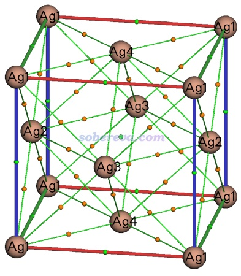

下面再把更多的临界点也找出来。当前情况不适合选择选项4、5分别用3、4个原子中心作为初猜点来搜索临界点。选项3用每两个原子之间中点当做初猜点时是考虑循环相邻晶胞中的镜像原子的，而选项4、5则只会循环当前晶胞里那些唯一的原子，因此此例用选项4、5搜索后还是会遗漏许多重要的临界点。当前最适合的方式是选择选项6里的子选项-1，此时会在每个原子附近特定半径内撒一批初猜点来搜索临界点。这么选过之后，会发现找到了一大堆新的临界点，进入选项0后看到的图如下所示。下图左侧把所有临界点都显示了出来，可以看到离原子核较近的区域临界点有不少，而且各种类型的都有。这是因为当前用了赝势，由于电子密度不是从原子核开始向四周单调下降的，因此会在价层区域出现各种各样的临界点，这些不是我们感兴趣的。把原子球设大掩盖这些没什么意义的临界点，并且旋转体系使得视角与晶轴平行后，就看到了下面的右图。可见在原子间相互作用区域找到的临界点的分布整齐、对称，因此可以认为有意义的临界点都找到了。

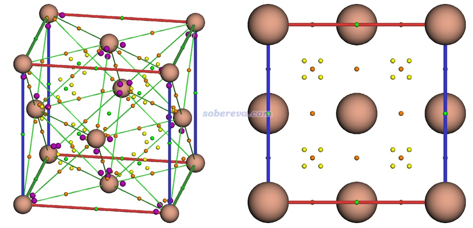

有一个概念叫平面性指数，在“量子化学波函数分析与Multiwfn程序培训班”（<http://www.keinsci.com/workshop/WFN_content.html>）里有一页幻灯片做了介绍，如下所示。我们这里来对Ag晶体计算一下这个平面性指数，看看是否和文章里说的情况吻合。注意这里说的平面性指数和《使用Multiwfn定量化和图形化考察分子的平面性（planarity）》（<http://sobereva.com/618>）里介绍的我提出的衡量体系几何结构平面性的参数是两码事。

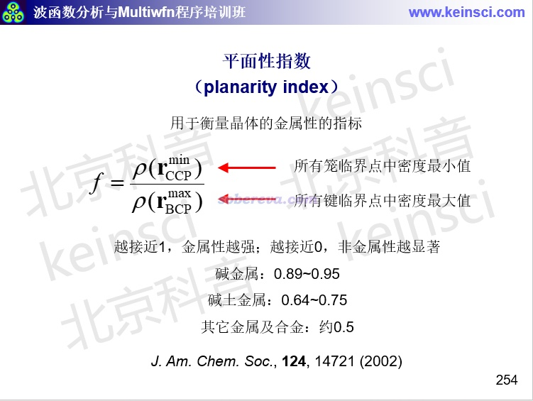

首先我们得确定要考察的笼临界点也即(3,+3)的临界点编号。下图左边只显示了笼临界点，可见当前体系有两类笼临界点，一种是诸如晶胞中心的那个（15号），它处于八面体中心。另一种是处于四面体中心的，比如63号临界点。下图右边只显示了所有BCP，此体系中所有的BCP都是等价的，我们考虑其中任意一个，比如1号。利用当前拓扑分析界面里的选项7依次对这三个临界点的属性进行考察，可以得到的这三个位置的基于格点数据插值产生的电子密度，也即User-defined real space function后面的值，结果如下（注意不要读Multiwfn直接输出的Density of electrons后面的值，那个是用孤立状态原子的电子密度叠加得到的准分子密度）  
CP(15): 0.1572533472E-01 a.u.  
CP(63): 0.2212960297E-01 a.u.  
CP(1): 0.2706526462E-01 a.u.

可见两类笼临界点里电子密度最小值是0.01572 a.u.，BCP处的电子密度为0.02706 a.u.，因此平面性指数为0.01572/0.02706=0.58，在0.5左右，符合幻灯片里说的“其它金属及合金”的情况。

## 4 总结&其它

本文通过三个有代表性的例子详细介绍了在Multiwfn中对周期性体系做电子密度的拓扑分析，也即一般说的AIM拓扑分析的完整过程，所有要注意的细节都做了解释。通过例子可见，Multiwfn做周期性体系的拓扑分析的过程很简单，并不比分析孤立体系更复杂。读者如果实际操作一遍，还会感受到Multiwfn做这些分析的速度相当快。AIM拓扑分析对于考察周期性体系的电子结构有重要意义，推荐读者在实际研究中运用，使文章增光添彩。

很值得一提的是，Multiwfn的拓扑分析功能极其普适，绝不仅限于电子密度的拓扑分析。对于Multiwfn自身可以直接计算的函数，以及载入的格点数据里记录的函数，Multiwfn都可以做拓扑分析，对分子体系的例子参看比如《使用Multiwfn对静电势和范德华势做拓扑分析精确得到极小点位置和数值》（<http://sobereva.com/645>）对静电势、范德华势的拓扑分析，以及《在Multiwfn中单独考察pi电子结构特征》（<http://sobereva.com/432>）里面对ELF-pi函数的拓扑分析。对周期性体系，Multiwfn也完全可以以相同的方式对任意函数做拓扑分析。

使用本文的做法做AIM拓扑分析在发表文章时必须按照Multiwfn启动时的提示恰当引用Multiwfn，如果用于给别人代算也要明确告知对方这一点。
